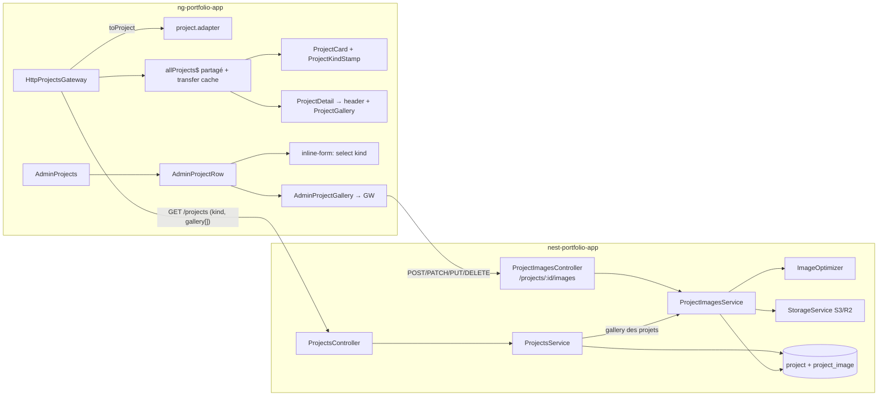

# 011 — Nature des réalisations et galerie

## Description

### Contexte

La page Réalisations (`/projects`) et les pages détail (`/projects/:slug`) listent six projets,
servis par l'API NestJS (repo voisin `/home/j-ned/Projects/Portfolio/nest-portfolio-app`, table
`projects`, administrée depuis l'admin du site) :

| Projet | Catégorie actuelle | Nature réelle | Lien |
|---|---|---|---|
| DashFlow | Application Web | en production | https://dashflow.nedellec-julien.fr |
| CandiDash | Application Web | en production | https://candidash.nedellec-julien.fr |
| Coaching Life | Application Web | démo (activité fictive) | https://coaching-life.nedellec-julien.fr |
| Le Vieux Comptoir | Application Web | démo (établissement fictif) | https://vieux-comptoir.nedellec-julien.fr (la base pointe encore sur GitHub Pages) |
| LabelSync Pro | Script | script Bash | dépôt GitHub |
| GitPush Auto | Script | script Bash | dépôt GitHub |

Un visiteur ne peut pas distinguer une application réellement en service d'un site de
démonstration : c'est un problème d'honnêteté (spec 010 : une démo ne passe jamais pour une
référence client) et de lisibilité. Chaque projet n'a par ailleurs qu'**une** image : la page
détail ne montre pas le produit au-delà de sa couverture.

### Ce qui est attendu

#### 1. Un badge de nature sur chaque projet

- Trois natures : **En production** (application en service, utilisateurs réels possibles),
  **Démo** (site fictif, construit pour montrer le résultat), **Script** (outil en ligne de
  commande, sans interface web).
- La nature est une **donnée du projet**, stockée par l'API et modifiable dans l'admin, distincte
  de `category` (qui reste le filtre « Application Web / Script » existant). Décision du
  propriétaire (2026-10-06) : nouveau champ côté API, pas de table statique côté front.
- Le badge apparaît sur la carte de la liste (`ProjectCard`) et dans l'en-tête de la page détail,
  lisible sans dépendre de la couleur seule, cohérent avec le badge « Démo » de la spec 010.
- Pour une démo, le lien vers le site reste « Voir la démo » ; pour une application en
  production, le libellé dit clairement que c'est le service réel (copie à valider).

#### 2. Une galerie de captures par projet

- Chaque projet peut porter plusieurs captures en plus de son image de couverture : autres pages
  du site, écrans de l'application, sortie d'un script.
- Chaque capture a un texte alternatif qui décrit ce qu'elle montre, et un ordre d'affichage.
- La page détail affiche la galerie sous la présentation ; la liste n'en montre rien (seule la
  couverture). Pas de carrousel automatique : défilement ou grille, navigable au clavier, avec
  agrandissement accessible si prévu.
- L'admin permet d'ajouter, réordonner, renseigner l'`alt` et supprimer les captures d'un projet.
- Stockage comme les images actuelles : AVIF sous clé hachée côté API (cf. mémoire du projet :
  `<type>/<id>-<sha8>.avif`, cache immuable).

#### 3. De nouveaux visuels

- **Couverture** de chaque projet refaite au format des démos de la spec 010 : capture ordinateur
  dans une fenêtre de navigateur et capture mobile dans un téléphone, sur un fond assorti. Pour les
  deux scripts, un visuel de terminal propre (commande et sortie réelles), au même gabarit.
- **Galerie** : captures propres des principaux écrans de chaque projet.
- Les applications en production (DashFlow, CandiDash) ont des écrans derrière authentification :
  les captures se font sur une instance **locale avec données de démonstration**, jamais avec les
  données réelles d'un utilisateur de production.
- L'URL du Vieux Comptoir en base passe sur le sous-domaine (`liveUrl`).

### Hors périmètre

- Mesures de performance (mises de côté par le propriétaire le 2026-10-06).
- Refonte de la mise en page de la liste et du détail (spec 009, déjà livrée).
- Une page ou un filtre « Démos » distinct.

### Contraintes

- Ordre de déploiement : **API puis front** (CLAUDE.md, item 10). Le front doit tolérer un projet
  sans nature (valeur absente pendant la transition) et sans galerie.
- Prérendu et SEO des pages projets intacts ; la galerie est dans le HTML servi, images en lazy.
- Les images de projets viennent de `api.nedellec-julien.fr` : la CSP `img-src` l'autorise déjà.
- Une démo ne porte jamais le badge « En production », et inversement : la nature est vérifiable
  (lien vivant, mention démo sur le site de démo).

### Critères d'acceptation

1. Chaque projet expose sa nature via l'API ; les six projets ont la bonne valeur en production.
2. Le badge est visible sur la carte de liste et dans l'en-tête du détail, avec texte, contraste
   AA, sans saut de titre.
3. L'admin permet de choisir la nature d'un projet et de gérer sa galerie (ajout, ordre, `alt`,
   suppression).
4. La page détail affiche la galerie quand elle existe, rien quand elle est vide ; navigation
   clavier, zéro violation axe, images en lazy avec dimensions (pas de CLS).
5. Les six couvertures sont remplacées par les nouveaux visuels ; chaque projet a une galerie d'au
   moins deux captures propres.
6. Tests unitaires et d'intégration des deux dépôts verts ; gates du front (Dockerfile) et de l'API
   verts.

### Questions ouvertes pour Julien

1. Libellés exacts des badges et du lien des applications en production.
2. Nombre de captures visé par projet (proposition : 3 à 5).
3. Pour DashFlow et CandiDash, des comptes ou des données de démonstration existent-ils dans les
   seeds des dépôts, ou faut-il en créer pour les captures ?

## Plan technique

> Deux dépôts : **API** `/home/j-ned/Projects/Portfolio/nest-portfolio-app` (NestJS 11, Drizzle
> 0.45, `class-validator` dans le module `projects` (Zod n'y sert pas), Jest + `createMockDb`) puis
> **front** (ce dépôt). Décisions structurantes : **ADR-0008** (nature `kind`) et **ADR-0009**
> (galerie `project_image`), tous deux **acceptés**. Les arbitrages du propriétaire du 2026-10-06
> (fin de spec) sont intégrés. Validation runtime aux frontières côté front : non vérifiée (profil :
> adapters purs, sans lib de validation).

### 0. Faits relevés qui orientent le plan

- Le détail (`project-detail.ts`) ne demande **aucun** projet seul. Il cherche son slug dans
  `getAllProjects()`, la liste partagée (`share`, `resetOnRefCountZero: false`), lue dans le
  transfer cache au prérendu (`isPublicReadUrl` couvre déjà `/api/projects`). L'API n'a pas de
  route par slug. **Conclusion : la galerie voyage dans la liste** (ADR-0009 §4).
- `ImageOptimizer.optimize()` renvoie déjà `width`/`height`, donc les dimensions intrinsèques sont
  connues sans coût.
- `ValidationPipe({ forbidNonWhitelisted: true })` : un front qui envoie `kind` à l'ancienne API
  reçoit un 400. **L'ordre API puis front est donc obligatoire**, et pas seulement pour
  l'affichage.
- L'API répond `image: "/storage/…"` (chemin relatif), que le gateway résout aujourd'hui dans
  `resolveProject`. Les réponses `create`/`update` ne sont **pas** résolues, et l'admin affiche
  alors une miniature cassée jusqu'au rechargement. L'adapter corrige ce défaut au passage.
- Aucun `*.adapter.ts` ni `*.types.ts` n'existe dans `features/projects/infra` : le gateway est
  typé directement sur `Project`. Un `Project` littéral est recopié dans 10 fichiers de spec. Le
  builder `features/<x>/testing/<x>-builders.ts` (`makeX`) existe déjà pour `offer`.
- Le badge « Démo » de la spec 010 est un `<span>` en ligne dans `offer-demo-card.ts`. Avec ce
  plan, ce style aura **3 consommateurs**, d'où son extraction dans `shared/ui/stamp.ts`.
- **Règle d'honnêteté de la spec 010 amendée** (arbitrage 2) : une démo est admise dans les
  Réalisations **avec le tampon « Démo »**, jamais sur la home, jamais présentée comme référence
  client (ADR-0008 §7). Spec 010 (§ 2 et critère 6) et `DESIGN.md` (carte de démo, *Don't*) sont
  déjà réécrits dans ce sens.
- Home (arbitrage 3) : la section « Des projets en production » ne montre que les projets
  `featured` **et** `kind === 'production'`. Aujourd'hui, seul `getFeaturedProjects()` alimente
  la home (`InMemoryHomeGateway`), avec un filtre `p.featured`. La règle devient un prédicat pur
  du domaine, appliqué à cet endroit unique (tranche F2).

### 1. Architecture



- **Landmarks** : aucun nouveau. La galerie est une `<section aria-labelledby>` via
  `SplitSection` à l'intérieur du `main` du shell. Le dialog d'agrandissement n'est pas un
  landmark. Aucun `header`/`footer` réémis.
- **Presenter** : aucun. Aucune vue ne mêle dérivation non triviale et DOM. Le tri de la galerie
  se fait dans l'adapter, le déplacement d'un élément dans une fonction pure du domaine, la
  sélection du dialog dans un signal. Un presenter serait ici une indirection spéculative.
- **Décomposition** : `ProjectGallery` (grille + dialog, une seule unité d'affichage) ;
  admin : `AdminProjectGallery` (I/O) + `AdminGalleryUploadForm` + `AdminGalleryImageItem`
  (dumb).

### 2. Fichiers à créer / modifier

#### API (`nest-portfolio-app`)

| Fichier | Rôle |
|---|---|
| `src/database/schema/projects.ts` | `PROJECT_KINDS = ['production','demo','script'] as const`, `type ProjectKind`. Colonne `kind: text('kind', { enum: PROJECT_KINDS }).notNull().default('demo')`. `check('project_kind_check', sql\`${t.kind} in ('production','demo','script')\`)` dans l'objet d'index existant. |
| `src/database/schema/project-images.ts` *(nouveau)* | Table `project_image` (ADR-0009 §1) : `id` uuid `gen_random_uuid()`, `projectId` → `projects.id` `onDelete: 'cascade'`, `key` text unique, `alt` text not null, `width`/`height` integer not null, `order` integer not null default 0, `...timestamps()`. Index `project_image_project_order_idx (project_id, order)`. Types `ProjectImage`, `NewProjectImage`. |
| `src/database/schema/index.ts` | Enregistre `project-images` (barrel `schema` existant). |
| `drizzle/0015_*.sql` + `meta/` | **Généré** par `pnpm db:generate` en A1 (colonne `kind` + `CHECK`). Jamais écrit à la main. |
| `drizzle/0017_*.sql` + `meta/` | **Généré** en A2 (table `project_image`). |
| `drizzle/0016_project_kind_backfill.sql` | **Personnalisé** (`pnpm exec drizzle-kit generate --custom --name project_kind_backfill`) : `UPDATE "project" SET "kind"='production' WHERE "slug" IN ('dashflow','candidash');` puis `… 'script' WHERE "slug" IN ('labelsync-pro','gitpush-auto');`. |
| `src/projects/dto/create-project.dto.ts` | `kind?: ProjectKind` : `@ApiPropertyOptional({ enum: PROJECT_KINDS, default: 'demo' })`, `@ValidateIf((_, v) => v !== undefined)`, `@IsIn([...PROJECT_KINDS])` (refuse `null`, ADR-0008 §4). Hérité par `UpdateProjectDto`. |
| `src/projects/dto/project-image-alt.dto.ts` *(nouveau)* | `alt` : `@Transform(trim)`, `@IsString`, `@IsNotEmpty`, `@MaxLength(PROJECT_IMAGE_ALT_MAX)`. Sert au multipart de l'upload (champ texte) et au `PATCH`. |
| `src/projects/dto/reorder-project-images.dto.ts` *(nouveau)* | `imageIds: string[]` : `@IsArray`, `@ArrayMaxSize(PROJECT_GALLERY_MAX)`, `@ArrayUnique`, `@IsUUID('all', { each: true })`. |
| `src/projects/project-gallery.ts` *(nouveau, pur)* | `PROJECT_GALLERY_MAX = 12`, `PROJECT_IMAGE_ALT_MAX = 300`. Types `ProjectImageResponse = { id, url, alt, width, height, order }` et `ProjectResponse = Project & { gallery: ProjectImageResponse[] }`. Fonctions `groupGalleryByProject(rows, toUrl)` (tri `order` puis `createdAt`), `isPermutationOf(currentIds, requestedIds)`, `nextGalleryOrder(rows)`. |
| `src/projects/project-images.service.ts` *(nouveau)* | `upload(projectId, file, alt)` : 404 si le projet n'existe pas, 422 au-delà de `PROJECT_GALLERY_MAX`, puis `optimize`, `id = randomUUID()`, clé `project-images/${id}-${contentHash}.avif`, `storage.upload`, insertion à `nextGalleryOrder`. `updateAlt`, `remove` (ligne supprimée puis `deleteS3IfExists`), `reorder` (transaction : lit les ids, 422 si ce n'est pas une permutation, réécrit `order = index`). Enfin `galleryOf(projectIds)` et `keysOf(projectId)`. |
| `src/projects/project-images.controller.ts` *(nouveau)* | `@Controller('projects/:id/images')`, `JwtAuthGuard` + `@AdminWriteThrottle()` sur les 4 routes : `POST` (`FileInterceptor('file')`, mêmes validateurs que `POST /:id/image` : 5 Mo, `webp|jpeg|png|avif`, 422), `PATCH :imageId`, `PUT order` (200, galerie complète), `DELETE :imageId` (204). `ParseUUIDPipe` sur `id` et `imageId`. Swagger aligné sur l'existant. |
| `src/projects/projects.service.ts` | `findAll`/`findById` rendent `ProjectResponse` (galerie via `ProjectImagesService.galleryOf`, URL via `storage.getPublicUrl`). `create`/`update` rendent aussi `gallery` (`[]` à la création, galerie lue à la mise à jour). `remove` lit `keysOf(id)` **avant** la suppression et efface ces clés S3 **après** (ADR-0009, Consequences). |
| `src/projects/projects.module.ts` | Déclare `ProjectImagesController` et `ProjectImagesService`. |
| `src/common/throttle.ts` | `ADMIN_WRITE_THROTTLE = { default: { limit: 60, ttl: 60_000 } }` + `AdminWriteThrottle()`, sur le modèle de `PublicReadThrottle`. |
| Specs | `project-gallery.spec.ts` (pur), `project-images.service.spec.ts`, `projects.service.spec.ts` (étendu), `create-project.dto.spec.ts` (étendu), `project-image-dtos.spec.ts`. |

#### Front (ce dépôt)

| Fichier | Rôle |
|---|---|
| `features/projects/domain/models/project.model.ts` | `PROJECT_KINDS`, `ProjectKind`, `ProjectImage`. `Project` gagne `kind: ProjectKind \| null` et `gallery: readonly ProjectImage[]`. `ProjectInput = Omit<Project, 'id'\|'image'\|'slug'\|'kind'\|'gallery'> & { readonly kind: ProjectKind }`. |
| `features/projects/domain/is-project-kind.ts` *(nouveau)* | Garde de type `isProjectKind(value: unknown): value is ProjectKind`, utilisée par l'adapter et le formulaire admin. |
| `features/projects/domain/is-showcase-project.ts` *(nouveau)* | `isShowcaseProject(p: Project): boolean` = `p.featured && p.kind === 'production'`. C'est la règle de la section home « Des projets en production ». Une nature `null` est exclue (jamais d'inférence). |
| `features/projects/domain/move-gallery-image.ts` *(nouveau)* | `moveGalleryImage(ids: readonly string[], index: number, delta: -1 \| 1): readonly string[]`. Hors bornes, renvoie une copie inchangée. |
| `features/projects/domain/gateways/projects.gateway.ts` | Ajoute `uploadGalleryImage(projectId, file, alt): Observable<ProjectImage>`, `updateGalleryImageAlt(projectId, imageId, alt): Observable<ProjectImage>`, `reorderGallery(projectId, imageIds): Observable<readonly ProjectImage[]>`, `deleteGalleryImage(projectId, imageId): Observable<void>`. |
| `features/projects/infra/project.types.ts` *(nouveau)* | `ProjectDto` (forme API, avec `kind?: string` et `gallery?: readonly ProjectImageDto[]` tolérés absents) et `ProjectImageDto = { id, url, alt, width, height, order }`. |
| `features/projects/infra/project.adapter.ts` *(nouveau)* | `toProject(dto, apiUrl): Project` : URL de couverture résolue (remplace `resolveProject`), `kind` à `null` s'il est absent ou inconnu, `gallery` à `[]` si absente, sinon triée par `order` puis passée par `toProjectImage`. `toProjectImage(dto, apiUrl): ProjectImage` : `src` résolu, sans `order`, l'ordre étant porté par la position. |
| `features/projects/infra/gateways/http-projects.gateway.ts` | Typé sur `ProjectDto`. **Toutes** les lectures et écritures passent par l'adapter, y compris `create`/`update`. `getFeaturedProjects()` filtre avec `isShowcaseProject`. C'est son seul consommateur : la home, via `InMemoryHomeGateway`, qui ne change pas. Le nom de la méthode est gardé pour ne pas multiplier le diff. Ajoute les 4 méthodes (upload en `FormData` `file` + `alt`). |
| `features/projects/testing/project-builders.ts` *(nouveau)* | `makeProject(overrides)` (`kind: 'production'`, `gallery: []`) et `makeProjectImage(overrides)`. **Remplace** les littéraux des 10 specs qui construisent un `Project` (liste : `grep -rln "featured: false" src/app`). |
| `shared/ui/stamp.ts` *(nouveau)* + spec | `app-stamp` : hôte `inline-block rounded-sm border border-line-strong bg-background px-2 py-1 font-mono text-xs uppercase tracking-[0.06em] text-foreground`, `<ng-content />`. Mêmes classes que le badge de la spec 010, et donc même contraste, déjà calculé dans la spec 010 (paire texte courant). |
| `features/offer/application/components/offer-demo-card.ts` | Le `<span>` devient `<app-stamp data-testid="offer-demo-badge" class="absolute left-3 top-3">Démo</app-stamp>`. Refactor à comportement constant : ses tests ne changent pas. |
| `features/projects/application/project-kind-copy.ts` *(nouveau)* | `PROJECT_KIND_LABELS: Record<ProjectKind, string>`, `LIVE_LINK_LABELS: Record<ProjectKind, string>`, `liveLinkLabel(kind: ProjectKind \| null): string` (libellé neutre si `null`). C'est le seul endroit de la copie. Le `Record` fait échouer la compilation si une nature n'a pas de libellé. |
| `features/projects/application/components/project-kind-stamp.ts` *(nouveau)* + spec | `app-project-kind-stamp`, `kind = input.required<ProjectKind>()`, rend `<app-stamp>{{ label() }}</app-stamp>`. Le consommateur fait le `@if (p.kind; as kind)`, donc rien ne s'affiche si `kind` est `null`. |
| `features/projects/application/components/project-card.ts` | Tampon en `absolute left-3 top-3 z-10` sur la `figure` (déjà `relative`), `data-testid="project-card-kind"`. Lien `liveUrl` : libellé visible `liveLinkLabel(kind)`, avec le titre et « nouvel onglet » en `sr-only` au lieu de l'`aria-label` qui remplace le nom (critère 2.5.3, motif d'`offer-demo-card`). |
| `features/projects/application/components/project-detail-header.ts` | Ligne `catégorie + tampon` (`flex items-center gap-3`) avant le `h1`, `data-testid="project-detail-kind"`. Le lien « Voir la démo » codé en dur devient `liveLinkLabel(kind)`, avec le même motif `sr-only`. |
| `features/projects/application/components/project-gallery.ts` *(nouveau)* + spec | Voir § 6. |
| `features/projects/application/project-detail.ts` | `@if (p.gallery.length > 0) { <app-project-gallery [images]="p.gallery" [projectTitle]="p.title" /> }`, placé après la `figure` de couverture et avant les choix techniques. **Pas de `@defer`** (§ 6). |
| `features/admin/application/components/admin-project-inline-form.ts` | `kind: ProjectKind \| ''` dans le modèle (`EMPTY.kind = ''`, `toModel` : `p.kind ?? ''`), `required(path.kind)`, `<select [formField]="form.kind">` (options `PROJECT_KINDS` + `PROJECT_KIND_LABELS`, première option vide `disabled`). L'action de `submission` sort tôt si `!isProjectKind(m.kind)`, puis `toInput` reçoit un `ProjectKind` sans cast. |
| `features/admin/application/components/admin-project-row.ts` | En édition, **sous** le formulaire (et pas dedans, pour ne pas imbriquer de `<form>`) : `<app-admin-project-gallery [projectId] [images]="project().gallery" (galleryChange)="galleryChange.emit($event)" />`. Nouvelle `output<readonly ProjectImage[]>()` `galleryChange`. |
| `features/admin/application/admin-projects.ts` | `updateGallery(id, images)` : remplace `gallery` de l'élément dans `projectsResource`, puis `projectsGateway.invalidateAllProjects()` et `homeGateway.invalidateBundle()` (même séquence que `updateProject`). |
| `features/admin/application/components/admin-project-gallery.ts` *(nouveau)* + spec | Composant smart : injecte `ProjectsGateway` + `ToastStore`. Ses inputs sont `projectId` et `images`. Il tient l'état local `images = linkedSignal(() => this.images())`. Il orchestre l'upload, l'`alt`, le déplacement et la suppression, puis émet `galleryChange` après chaque succès. Les échecs passent par un toast d'erreur. |
| `features/admin/application/components/admin-gallery-upload-form.ts` *(nouveau)* + spec | Composant dumb, Signal Forms : modèle `{ alt: '' }`, `required` + `maxLength(300)`, `FileDropzone` (`accept="image/avif,image/webp,image/png,image/jpeg"`). Le fichier est dans un `signal<File \| null>`, hors du modèle. Soumission sans fichier : erreur `role="alert"` « Choisissez une image ». Émet `{ file, alt }`. Un `resetToken` + `effect` vide le modèle et le fichier. |
| `features/admin/application/components/admin-gallery-image-item.ts` *(nouveau)* + spec | Composant dumb : miniature (`NgOptimizedImage`, dimensions de la capture, affichage `w-32 h-auto`), son propre `form()` sur `{ alt }` (`linkedSignal` de l'input), et les boutons « Monter » (masqué au premier rang), « Descendre » (masqué au dernier), « Supprimer ». Noms accessibles avec le rang (« Monter la capture 2 »). Sorties : `altSaved`, `moveRequested(-1\|1)`, `removeRequested`. |
| `DESIGN.md` | Nouvelle section « Tampon (`shared/ui/stamp.ts`) » (reprend les règles du badge « Démo »). La carte de démo pointe vers cette section. Section « Galerie de projet ». La règle d'honnêteté de la carte de démo et le *Don't* sont **déjà amendés** (ADR-0008 §7). |
| `src/app/app.config.ts` | **Inchangé** : le filtre du transfer cache (`GET` + `/api/projects`) couvre déjà la liste enrichie. Les écritures de galerie ne sont pas des `GET`. |

### 3. Modèles de données

**API.** Forme de chaque élément de `GET /projects` et de `GET /projects/:id` :
`Project` (colonnes, dont `kind`) + `gallery: { id, url, alt, width, height, order }[]` triée
par `order`. `url` est relative (`/storage/portfolio-storage/project-images/<id>-<sha8>.avif`),
comme `image`. La `key` brute n'est jamais exposée.

**Front, domaine immuable** (`readonly` partout) :

```ts
export const PROJECT_KINDS = ['production', 'demo', 'script'] as const;
export type ProjectKind = (typeof PROJECT_KINDS)[number];
export type ProjectImage = {
  readonly id: string; readonly src: string; readonly alt: string;
  readonly width: number; readonly height: number;
};
// Project : + readonly kind: ProjectKind | null ; + readonly gallery: readonly ProjectImage[]
```

- **Ce qui relève du compile-time** : la nature écrite est non nulle
  (`ProjectInput.kind: ProjectKind`), et chaque nature a son libellé (`Record<ProjectKind, …>`).
- **Ce qui reste un garde runtime** : la valeur reçue de l'API (`isProjectKind` dans l'adapter),
  la permutation de réordonnancement (donnée variable, vérifiée côté API) et le plafond de 12
  captures (côté API).
- **Transition** : `kind: null` et `gallery: []` sont produits par l'adapter. Aucun `?` optionnel
  ne traverse le domaine, et les composants n'ont jamais à gérer `undefined`.

### 4. Réactivité

- Lecture : inchangée. `rxResource` sur `getAllProjects()` dans le détail et la liste. La
  galerie est un champ du projet déjà dérivé par `computed`.
- `ProjectGallery` : `selected = signal<ProjectImage | null>(null)`. Ouverture et fermeture du
  dialog par `afterRenderEffect({ write })` qui lit `selected()` et appelle
  `showModal()`/`close()` selon l'état (garde sur `dialog.open`). Le DOM est ainsi à jour
  **avant** l'ouverture. L'événement natif `(close)` (Échap ou bouton) fait `selected.set(null)`
  et rend le focus au déclencheur (référence gardée au clic).
- Admin : `linkedSignal` pour la copie locale de la galerie et pour chaque modèle `alt`. Les
  appels se font en `subscribe` + `takeUntilDestroyed`, comme dans `admin-projects.ts`.

### 5. État partagé et coordination

- **Pas de store.** La seule source partagée reste `HttpProjectsGateway.allProjects$`.
- **Gateway** : `ProjectsGateway` (abstract existant, une seule implémentation). On l'étend, on
  ne le duplique pas. C'est la seule frontière HTTP. Aucun `HttpClient` dans les composants.
- **Pas de facade.** `AdminProjectGallery` injecte directement le gateway (CLAUDE.md : smart
  component → gateway quand il n'y a pas de use case). L'ajouter à `AdminProjects` ferait grossir
  un composant déjà à environ 200 LOC et ferait remonter 4 sorties à travers `AdminProjectRow`.
- **Pas de use case.** Ce seraient des passthroughs. La seule règle métier front,
  `moveGalleryImage`, est une fonction pure du domaine.
- Invalidation : après chaque écriture de galerie, `invalidateAllProjects()` met à jour la liste
  publique de la session admin (`refCount` à zéro sans reset). Le HTML prérendu, lui, reste figé
  jusqu'au build suivant (§ 9).

### 6. UI : tampon, galerie, agrandissement

- **Tampon** : une seule apparence pour les trois natures (`bg-background text-foreground`,
  trait `line-strong`, mono majuscule), c'est le texte qui les distingue. Pas d'indigo (One Indigo
  Rule) et pas de couleur de statut : la nature ne dépend jamais de la couleur seule, et le
  contraste est celui du texte courant. Ce n'est pas un titre (aucun `h*`), donc il ne fait pas
  sauter de niveau.
- **Galerie** (`ProjectGallery`) : `SplitSection` (`headingId="gallery-title"`, titre
  « Captures », résumé court), `data-testid="project-gallery"`. La grille est un `ul role="list"`
  en une colonne en mobile et deux à partir de `md`, `items-start`. Chaque `li` contient un
  `<button type="button">` qui couvre la miniature, avec pour nom accessible « Agrandir : {alt} »
  (`sr-only`) et un `focus-visible` (outline indigo du thème). L'image utilise
  `NgOptimizedImage` : `[ngSrc]="image.src"`, `[width]`/`[height]` intrinsèques venus de l'API,
  `[alt]="image.alt"`, `class="block h-auto w-full"`, **pas de `priority`, pas de `fill`, pas de
  `ngSrcset`** (`loading="lazy"` par défaut). Le ratio intrinsèque est respecté, sans recadrage :
  aucune distorsion, aucun CLS. `@for … track image.id`.
- **Agrandissement** : un seul `<dialog>` natif par galerie, `viewChild.required`, ouvert en
  `showModal()`. Cela fournit l'inertie du reste de la page, la touche Échap et le `::backdrop`.
  Il contient un bouton « Fermer » (`min-h-11`, premier focusable), puis l'image
  (`NgOptimizedImage`, mêmes `ngSrc`/dimensions, `max-h-[85svh] w-auto`) et l'`alt` du dialog via
  `aria-label` (« Capture agrandie : {alt} »). Pas de navigation précédente/suivante (YAGNI) : la
  touche Tab entre les miniatures suffit. Le motion respecte `motion-reduce` (aucune animation
  ajoutée).
- **Pas de `@defer`** : le composant pèse peu, `NgOptimizedImage` est déjà dans le chunk du
  détail, et les images sont déjà différées par `loading="lazy"`. Un `@defer` demanderait un
  `@placeholder` de hauteur inconnue (le nombre et le ratio des captures varient), donc un CLS en
  navigation SPA, pour un gain JS négligeable. La galerie est dans le HTML prérendu et s'hydrate
  avec la route. Un clic avant hydratation est rejoué (`withEventReplay`).
- **SEO** : titre, meta et JSON-LD `CreativeWork` inchangés. Les miniatures sont dans le HTML
  servi, avec leur `alt`. Aucune démo n'entre dans un JSON-LD d'avis.

### 7. Cross-platform et bibliothèques

- Pas de cible native. **Aucune dépendance ajoutée** : `<dialog>` natif (happy-dom 20.9 implémente
  `showModal`), boutons monter/descendre plutôt que `@angular/cdk/drag-drop` (absent du repo).
  Côté API : `sharp`, `@nestjs/throttler` et `crypto.randomUUID` sont déjà là.

### 8. Visuels (production hors code)

**Gabarits** (vérifiés sur les recadrages actuels : carte en `aspect-[16/9]` puis `md:aspect-[2/1]`,
détail en `aspect-[16/9]` puis `sm:aspect-[2/1]` puis `lg:aspect-[21/9]`, tous en `object-cover`) :

- **Couverture** (recomposition prise en charge par Julien) : 1600 × 1000 (16:10, même gabarit que `public/demos/`, fenêtre de navigateur +
  téléphone sur fond assorti). **Zone sûre** : tout le contenu utile tient dans la bande centrale
  de 1600 × 686 px, puisque 1600 / (21/9) = 685,7 px est la hauteur conservée par le recadrage le
  plus serré (détail `lg`). Il reste 157 px de fond au-dessus et au-dessous. Les visuels de la
  spec 010 (`public/demos/*`) remplissent tout le 16:10, ce qui couperait la barre du navigateur
  et le bas du téléphone. **Ils ne sont pas réutilisables tels quels** et doivent être recomposés.
- **Scripts** (LabelSync Pro, GitPush Auto) : une fenêtre de terminal (thème sombre, titre de
  fenêtre, invite, **commande et sortie réelles** d'une exécution sur un dépôt de test), même fond
  et même zone sûre, sans téléphone.
- **Galerie** : de 3 à 5 captures par projet (arbitrage 5). Vues ordinateur à 1280 × 800 avec un
  DPR de 1,25, soit un fichier de 1600 × 1000. Vues mobiles composées par 2 ou 3 téléphones sur
  une planche de 1600 × 1000, pour garder une grille régulière (le front accepte n'importe quel
  ratio). Scripts : sorties de `--help`, d'une exécution nominale et d'un cas d'erreur.
- **Outil** : un script Playwright + composition HTML/sharp **hors dépôt**, dans le scratchpad,
  comme pour la spec 010 (l. 88). Les fichiers sont envoyés en PNG ou WebP sans perte de 5 Mo au
  plus : l'API les réencode en AVIF.
- **`alt`** : il décrit ce qu'on voit (écran, données visibles), jamais « capture de… ». Celui de
  la couverture reste `title` dans la carte et « Aperçu du projet X » dans le détail (inchangé).

**Écrans authentifiés** (arbitrage 4) :

- **DashFlow** : les captures sont prises dans son mode démo public (données fictives du compte
  démo). Julien les a déjà faites, aucune instance locale n'est nécessaire.
- **CandiDash** : instance locale alimentée par un seed de candidatures fictives, écrit dans le
  dépôt CandiDash (PR séparée, **hors de cette spec**, menée par Julien). Constat qui a motivé
  ce choix : le dépôt n'avait ni seed, ni compte de démo, ni fixtures.
- Aucune donnée réelle d'un utilisateur de production sur une capture.

**Mise en production** : par l'admin uniquement (ADR-0009 §6). Couverture : « Modifier » puis la
dropzone d'image existante. Galerie : le nouveau bloc. `liveUrl` du Vieux Comptoir passe à
`https://vieux-comptoir.nedellec-julien.fr` (il répond 200 le 2026-10-06), également dans
l'admin. Aucun fichier dans `public/` et aucun commit de visuel.

### 9. Ordre de déploiement et transition

1. **PR API** (A1 à A5), mergée puis déployée. Les migrations 0015 à 0017 sont jouées au
   démarrage du conteneur. Vérification en prod :
   `curl -s https://api.nedellec-julien.fr/api/projects | jq '.[] | {slug, kind, n: (.gallery|length)}'`
   doit donner 2 `production`, 2 `demo`, 2 `script`, et `n = 0`. L'ancien front ignore
   `kind`/`gallery` (aucune validation runtime). Son admin crée sans `kind`, ce qui donne `demo`
   (défaut sûr).
2. **PR front** (F1 à F7), mergée **après** la réponse de l'API (CLAUDE.md, item 10). Si le front
   arrive en avance, `kind` absent donne `null` (pas de tampon, libellé neutre) et `gallery`
   absente donne `[]`. Mais l'écriture du formulaire admin échouerait (400,
   `forbidNonWhitelisted`).
3. **Session de contenu** dans l'admin : les 6 couvertures, les galeries et l'URL du Vieux
   Comptoir. Le remplacement d'une couverture **supprime l'ancienne clé S3** : l'image du HTML
   prérendu est cassée jusqu'à l'étape 4. Il faut donc tout faire en une fois.
4. **Redéploiement du front** dans Dokploy (« Redeploy », la CI ne le déclenche pas), puis
   vérification **en prod** : `projects/<slug>/index.html` contient les ``
   de la galerie et la nouvelle clé de couverture. Pas seulement dans `dist/`.

### Tranches

L'API d'abord, de A1 à A5 (une PR), puis le front, de F1 à F7 (une PR). Chaque tranche
d'API se vérifie par `pnpm test`, `pnpm lint` et `pnpm build`. Celles qui touchent au schéma se
vérifient aussi par `pnpm db:reset` en local, suivi d'une requête SQL de contrôle.

**API (`nest-portfolio-app`)**

- **Tranche A1 — chaque projet a une nature** : schéma `kind` + `CHECK`, migrations 0015 (colonne)
  et 0016 (backfill), DTO (`kind` accepté pour chaque valeur, `'foo'` → 400, `null` →
  400, absent → défaut), le service passe `kind` à l'insertion et à la mise à jour, et la réponse
  l'expose.
- **Tranche A2 — la liste et le détail exposent la galerie** : table `project_image` (migration
  0017), `groupGalleryByProject` (pur : regroupement, tri, URL publique, projet sans
  capture → `[]`), `ProjectImagesService.galleryOf`, `findAll`/`findById`/`create`/`update`
  rendent `gallery`.
- **Tranche A3 — l'admin ajoute une capture** : `POST /projects/:id/images` (404 si le projet
  n'existe pas, 422 si le fichier ou l'`alt` est invalide, 422 au-delà de 12 captures), clé
  hachée, dimensions de sharp, `order` en fin de liste, throttle admin. La capture apparaît dans
  la galerie de A2.
- **Tranche A4 — l'admin modifie l'`alt` et supprime une capture** : `PATCH` et `DELETE`
  (404 si l'`imageId` appartient à un autre projet, S3 effacé après la base). La suppression d'un
  projet efface aussi les clés S3 de sa galerie.
- **Tranche A5 — l'admin réordonne la galerie** : `PUT /projects/:id/images/order`
  (`isPermutationOf` pur : un manquant, un en trop ou un id étranger donnent 422), réécriture en
  transaction, réponse triée.

**Front (ce dépôt), une fois l'API en production**

- **Tranche F1 — le tampon de nature sur la carte et l'en-tête du détail** : modèle `kind`,
  `isProjectKind`, `project.types.ts` + `project.adapter.ts` (pour `kind` : absent ou inconnu →
  `null` ; la galerie est tolérée dès cette tranche et vaut `[]`), gateway sur l'adapter,
  `makeProject` + migration des 10 specs, extraction de `Stamp` (refactor
  d'`offer-demo-card`, ses tests restent verts), `ProjectKindStamp`, `project-kind-copy.ts`, carte
  et en-tête (tampon et libellé de lien par nature, aucun tampon si `null`). Axe : zéro violation
  sur la carte et l'en-tête, pour les 3 natures et pour `null`.
- **Tranche F2 — la home ne montre que des projets en production** : `isShowcaseProject` (domaine
  pur, sans TestBed, `it.each` sur `featured` × `kind`, y compris `null` : seul
  `featured && 'production'` passe), `getFeaturedProjects()` filtré avec ce prédicat. Test dans
  `http-projects.gateway.spec.ts` (`HttpTestingController`) : une liste avec une démo `featured`,
  une production `featured`, une production non `featured` et un `kind` absent ne rend que la
  production `featured`. Le test de composition d'`in-memory-home.gateway.spec.ts` reste vert.
- **Tranche F3 — la page détail montre la galerie** : `ProjectImage`, `toProjectImage` (tri par
  `order`, `src` résolu), `ProjectGallery` en grille (`NgOptimizedImage`, `width`/`height`, lazy,
  aucune `priority`), insertion dans `project-detail` ; galerie vide → aucune section. Axe sur la
  section.
- **Tranche F4 — agrandir une capture au clavier** : bouton par miniature, `<dialog>` +
  `afterRenderEffect`, Échap et « Fermer » referment, le focus revient au déclencheur. Axe avec le
  dialog ouvert.
- **Tranche F5 — l'admin choisit la nature** : `select` requis dans `admin-project-inline-form`
  (erreur si rien n'est choisi, `kind` dans le payload, valeur reprise d'un projet existant,
  `null` → vide).
- **Tranche F6 — l'admin ajoute, renseigne et supprime des captures** : 3 méthodes du gateway
  (`HttpTestingController` : multipart `file` + `alt`, `PATCH`, `DELETE`), `AdminProjectGallery`,
  `AdminGalleryUploadForm`, `AdminGalleryImageItem` (`alt` et suppression), sortie
  `galleryChange` de la ligne, `AdminProjects.updateGallery` (mise à jour locale + invalidations).
- **Tranche F7 — l'admin réordonne les captures** : `moveGalleryImage` (domaine pur, bornes),
  `reorderGallery` (gateway), boutons monter/descendre (masqués aux extrémités), focus remis sur
  le bouton équivalent de la capture déplacée après la réponse, galerie remplacée par la réponse.

### Risques et inconnues

- **Valeurs calibrées** (retenues par défaut, arbitrage 5) : 12 captures, `alt` ≤ 300 caractères,
  60 requêtes par minute en écriture admin. Elles supposent un seul administrateur et un objectif
  de 3 à 5 captures. Avec plusieurs administrateurs, il faudrait une limite par utilisateur.
- **Contenu figé jusqu'au rebuild** : tout changement de visuel casse le HTML prérendu (ancienne
  clé supprimée) jusqu'au redéploiement du front. Le correctif de fond, garder l'ancienne clé un
  certain temps ou déclencher un rebuild depuis l'admin, est hors périmètre et à signaler pour
  une spec future.
- **Seed CandiDash** : prérequis hors de cette spec. Il bloque seulement la galerie CandiDash du
  critère 5, pas les tranches A* et F*.

### Questions pour Julien

Toutes tranchées le 2026-10-06 (voir `## Arbitrages du propriétaire`). Les libellés retenus sont
ceux de l'arbitrage 1, et `project-kind-copy.ts` les reprend mot pour mot.

## Arbitrages du propriétaire (2026-10-06)

1. **Libellés** validés tels quels : badges « En production », « Démo », « Script » ; lien
   « Ouvrir l'application » (production), « Voir la démo » (démo), « Voir le site » (nature
   absente) ; titre de la galerie « Captures ».
2. **Démos dans les Réalisations** : admises avec le badge « Démo », jamais sur la home.
   L'amendement de l'ADR-0008 § 7 est accepté ; la spec 010 (critère 6) et `DESIGN.md` sont mis à
   jour en conséquence.
3. **Home** : la section « Des projets en production » ne montre que les projets de nature
   `production` (filtre côté front, en plus de `featured`) : le titre dit toujours vrai.
4. **CandiDash** : captures prises sur une instance locale alimentée par un seed de candidatures
   fictives, écrit dans le dépôt CandiDash (PR séparée). DashFlow : captures prises dans son mode
   démo public (données fictives du compte démo), déjà faites.
5. Galerie : 3 à 5 captures visées par projet ; plafonds techniques (12 captures, `alt` de 300
   caractères, 60 requêtes/min admin) retenus par défaut.

## Plan de test

### Tranche F1 — le tampon de nature sur la carte et l'en-tête du détail

La carte et l'en-tête sont couverts outside-in : `project-card.spec.ts` pour la carte,
`project-detail.spec.ts` pour l'en-tête, qui n'a pas de spec propre. `ProjectKindStamp` et
`project-kind-copy.ts` n'ont **pas de spec isolé** : ils ne portent aucune dérivation propre, et
leurs libellés sont vérifiés par la carte et l'en-tête pour les 3 natures et pour `null`. `Stamp`
reçoit un spec court, parce que son contrat est l'apparence de l'hôte, dont dépend le contraste
calculé dans la spec 010. `offer-demo-card` ne reçoit aucun test nouveau : son refactor garde le
comportement, et `offer-page.spec.ts` (badge `Démo`) doit rester vert tel quel. Axe : il n'y a
pas de dépendance axe dans le dépôt, le contrôle se fait au verify (comme pour la spec 010).

Contrats fixés par ce RED :

- **Modèle** (`domain/models/project.model.ts`) : `PROJECT_KINDS = ['production', 'demo',
  'script'] as const`, `ProjectKind`, `ProjectImage` `{ id, src, alt, width, height }`.
  `Project` gagne `kind: ProjectKind | null` et `gallery: readonly ProjectImage[]`, tous deux
  obligatoires. **En F1**, `ProjectInput = Omit<Project, 'id' | 'image' | 'slug' | 'kind' |
  'gallery'>` : le `& { readonly kind: ProjectKind }` arrive en F5, avec le sélecteur. Sans cela,
  `admin-project-inline-form` ne compile pas avant d'avoir son champ.
- **`isProjectKind(value: unknown): value is ProjectKind`** (`domain/is-project-kind.ts`) : vrai
  pour les 3 valeurs exactes, faux pour tout le reste (casse, espaces, `''`, `null`,
  `undefined`, nombre, tableau).
- **`toProject(dto: ProjectDto, apiUrl: string): Project`** (`infra/project.adapter.ts`) :
  couverture relative préfixée par `apiUrl`, absolue ou vide laissée telle quelle ; `kind`
  conservé s'il est valide, sinon `null` (absent, inconnu, mauvaise casse, vide), jamais déduit
  de `category` ni de `liveUrl` ; `gallery` à `[]` si elle est absente ou vide (le cas d'une
  galerie remplie arrive en F3). Les autres champs sont conservés.
- **`ProjectDto`** (`infra/project.types.ts`) : la forme de `Project` sans `kind` ni `gallery`,
  plus `kind?: string` et `gallery?: readonly ProjectImageDto[]`, avec `ProjectImageDto = { id,
  url, alt, width, height, order }`.
- **Gateway** : `getAllProjects`, `filterProjects`, `getProjectById`, `createProject` et
  `updateProject` passent tous par `toProject`. Une ligne sans `kind` ni `gallery`, avec une
  couverture relative, donne `kind: null`, `gallery: []` et une couverture absolue.
- **`Stamp`** (`shared/ui/stamp.ts`, `selector: 'app-stamp'`, classe `Stamp`) : l'hôte porte
  exactement `inline-block rounded-sm border border-line-strong bg-background px-2 py-1
  font-mono text-xs uppercase tracking-[0.06em] text-foreground`, le texte vient de
  `<ng-content />`, et les classes de placement du consommateur s'y ajoutent.
- **Testids** : `project-card-kind` (le tampon de la carte, dans la `figure`, hors de tout
  titre) et `project-detail-kind` (le tampon de l'en-tête, avant `project-detail-title`, hors
  de tout titre). Aucun tampon si `kind` vaut `null`. Le texte du tampon est le libellé en casse
  normale (la majuscule est du CSS).
- **Libellés** (arbitrage 1, apostrophe droite) : tampons `En production`, `Démo`, `Script` ;
  lien `Ouvrir l'application` (production), `Voir la démo` (démo), `Voir le site` (`null`).
  **Script** : `Voir le site`. L'arbitrage ne nomme pas ce cas. Les deux scripts n'ont pas de
  `liveUrl` en production, donc le libellé neutre suffit ; à confirmer par Julien.
- **Lien `liveUrl`** (carte et en-tête) : aucun `aria-label`. Son texte complet, blancs de mise en
  forme normalisés, vaut `<libellé> : <titre>, nouvel onglet`, la partie après le libellé
  étant en `sr-only` (motif d'`offer-demo-card`).
- **Builder** (`features/projects/testing/project-builders.ts`) : `makeProject(overrides)`,
  défauts `id-1`, `Mon site`, `mon-site`, `Web`, `[]`, `desc`, `''`, `featured: false`,
  `order: 0`, **`kind: 'production'`**, `gallery: []`. `makeProjectImage` arrive en F3, avec son
  premier usage.

**`domain/is-project-kind.spec.ts`** (TS pur, 12 tests, nouveau)

| Test | Scénario | Assertions clés |
|---|---|---|
| union fermée | `PROJECT_KINDS` | `toEqual(['production', 'demo', 'script'])` |
| natures valides (`it.each` × 3) | `production`, `demo`, `script` | `true` |
| valeurs refusées (`it.each` × 8) | `foo`, `''`, `Production`, ` demo`, `null`, `undefined`, `1`, `['demo']` | `false` |

**`infra/project.adapter.spec.ts`** (TS pur, 13 tests, nouveau)

| Test | Scénario | Assertions clés |
|---|---|---|
| projet complet | DTO de DashFlow (couverture relative) | golden `toEqual` : tous les champs, couverture `https://api.test/api/storage/…` |
| couverture laissée telle quelle (`it.each` × 2) | URL absolue, `''` | même valeur |
| nature conservée (`it.each` × 3) | `production`, `demo`, `script` | même valeur |
| nature refusée (`it.each` × 3) | `client`, `Demo`, `''` | `null` |
| nature absente | `kind` retiré | `null` |
| aucune inférence | `category: 'Script'`, `liveUrl: null`, `kind` retiré | `null` |
| galerie absente, galerie vide | `gallery` retirée, `[]` | `toEqual([])` |

**`infra/gateways/http-projects.gateway.spec.ts`** (+6 tests ; builder partagé à la place du
`makeProject` local)

| Test | Scénario | Assertions clés |
|---|---|---|
| adaptation (`it.each` × 5) | `getAllProjects`, `filterProjects`, `getProjectById`, `createProject`, `updateProject` répondent par une ligne sans `kind` ni `gallery`, couverture relative | `toEqual` du projet adapté (`kind: null`, `gallery: []`, couverture `/api/storage/…`) |
| nature inconnue dans la liste | `kind: 'client'` puis `kind: 'demo'` | natures `[null, 'demo']` |

**`shared/ui/stamp.spec.ts`** (3 tests, nouveau, hôte de test qui projette le texte)

| Test | Scénario | Assertions clés |
|---|---|---|
| libellé | `<app-stamp>Démo</app-stamp>` | texte `Démo` |
| apparence | sans placement | classes de l'hôte triées = les 12 classes du contrat, exactement |
| placement | `class="absolute left-3 top-3"` | les 12 classes + `absolute`, `left-3`, `top-3`, exactement |

**`application/components/project-card.spec.ts`** (+9 tests)

| Test | Scénario | Assertions clés |
|---|---|---|
| tampon (`it.each` × 3) | `production`, `demo`, `script` | texte de `project-card-kind` = `En production` / `Démo` / `Script` |
| sans nature | `kind: null` | pas de `project-card-kind` |
| position | `demo` | le tampon est dans la `figure`, hors de tout `h1`…`h6` |
| lien par nature (`it.each` × 4) | 3 natures + `null`, `liveUrl` renseigné | pas d'`aria-label` ; texte `<libellé> : DashFlow, nouvel onglet` |

**`application/project-detail.spec.ts`** (+9 tests, même grille, sur l'en-tête)

| Test | Scénario | Assertions clés |
|---|---|---|
| tampon (`it.each` × 3) | 3 natures | texte de `project-detail-kind` |
| sans nature | `kind: null` | pas de `project-detail-kind` |
| position | `production` | tampon hors de tout titre, avant `project-detail-title` (`compareDocumentPosition`) |
| lien par nature (`it.each` × 4) | 3 natures + `null` | pas d'`aria-label` ; texte `<libellé> : Mon site, nouvel onglet` |

Adaptation mécanique : `admin-projects.spec.ts`, `admin-project-inline-form.spec.ts`,
`home.spec.ts`, `project-card.spec.ts`, `project-detail.spec.ts`, `projects.spec.ts`,
`filter-projects.use-case.spec.ts`, `paginate-projects.use-case.spec.ts`,
`http-projects.gateway.spec.ts` — 9 helpers locaux de `Project` littéral remplacés par
`makeProject` (deux gardent un enrobage de scénario : sections du détail, projet valide pour le
formulaire), aucune valeur attendue modifiée. `in-memory-home.gateway.spec.ts` n'est pas touché
(projet factice `as never`). Le plan annonçait 10 specs ; le `grep` en trouve 9.

Tous les tests de cette tranche échouent à ce stade (RED confirmé via la commande test du profil
le 2026-10-06 17:58, 35 failed / 1152 total). Nature des échecs : sur l'arbre réel, `pnpm test`
(après `ng cache clean` et purge de `node_modules/.vite`) s'arrête à la compilation, uniquement
sur des symboles applicatifs dus au GREEN : `TS2307` `./is-project-kind`, `./project.adapter`,
`./project.types`, `./stamp` ; `TS2305` `PROJECT_KINDS` ; `TS2339`/`TS2353` `kind` et `gallery`
absents de `Project` ; `NG1010` qui découle de `./stamp`. Aucune faute de type propre aux specs ;
prettier et eslint verts sur les fichiers touchés ; le motif d'archéologie ne trouve que des URL.
Mesure du rouge comportemental : squelette jetable posé le temps d'une exécution puis retiré
(types du modèle, `isProjectKind` qui renvoie `false`, `toProject` qui renvoie le DTO tel quel,
`ProjectDto`, `Stamp` sans classes ni contenu, gateway, carte et en-tête inchangés). Résultat :
110 fichiers, 35 failed / 1152 total, tous en `AssertionError`, répartis ainsi : 3
`isProjectKind`, 7 adapter, 6 gateway, 3 `Stamp`, 8 carte, 8 en-tête. Verts par nature sous le
squelette : les 8 refus d'`isProjectKind`, l'union fermée, la couverture absolue ou vide, les 3
natures conservées, la galerie vide, et l'absence de tampon pour `null` (carte et en-tête).
Harnais vérifié : une implémentation jetable (garde, adapter, gateway sur l'adapter, `Stamp`,
copie, carte et en-tête) donne 1152 passed / 1152. Elle a ensuite été retirée par `git checkout`
et suppression, et `git status` ne montre plus aucun fichier applicatif.
Non-régression : la base avant RED donne 1100 passed / 1100 ; 1152 = 1100 + 52 tests ajoutés.
Aucun test existant ne tombe, `offer-page.spec.ts` compris.
Dû au GREEN : `project.model.ts`, `is-project-kind.ts`, `project.types.ts`,
`project.adapter.ts`, `http-projects.gateway.ts`, `shared/ui/stamp.ts`,
`offer-demo-card.ts` (refactor), `project-kind-copy.ts`, `project-kind-stamp.ts`,
`project-card.ts`, `project-detail-header.ts`.

### Tranche F2 — la home ne montre que des projets en production

Le prédicat est testé dans le domaine, sans TestBed, sur toute la table `featured` × `kind`.
L'usage est prouvé au seul point d'entrée de la home, `getFeaturedProjects()`. Le test de
composition d'`in-memory-home.gateway.spec.ts` stubbe `getFeaturedProjects` : il reste vert sans
modification. Le test existant « dérive de la liste complète » reste vert lui aussi, puisque le
builder met `kind: 'production'` par défaut.

Contrats fixés par ce RED :

- **`isShowcaseProject(project: Project): boolean`** (`domain/is-showcase-project.ts`) : vrai si
  et seulement si `featured` et `kind === 'production'`. Une nature `null` est exclue.
- **`getFeaturedProjects()`** filtre la liste partagée avec `isShowcaseProject`, sans requête
  supplémentaire. L'ordre de la liste est conservé.

**`domain/is-showcase-project.spec.ts`** (TS pur, 8 tests, nouveau)

| Test | Scénario | Assertions clés |
|---|---|---|
| table de vérité (`it.each` × 8) | `featured` ∈ {`true`, `false`} × `kind` ∈ {`production`, `demo`, `script`, `null`} | `true` pour (`true`, `production`) seulement |

**`infra/gateways/http-projects.gateway.spec.ts`** (+1 test)

| Test | Scénario | Assertions clés |
|---|---|---|
| home en production seulement | démo `featured`, production `featured`, production non `featured`, `featured` sans `kind` | ids `['featured-production']` |

Tous les tests de cette tranche échouent à ce stade (RED confirmé via la commande test du profil
le 2026-10-06 18:00, 4 failed / 1161 total). Nature des échecs : mesurés sur la F1 rendue verte
par l'implémentation jetable ci-dessus, plus un squelette `isShowcaseProject` qui renvoie
`project.featured` (le comportement actuel) et un gateway inchangé. Les 4 échecs sont des
`AssertionError` : 3 lignes de la table (`featured` avec `demo`, `script` et `null`) et le test du
gateway (3 ids reçus au lieu d'un seul). Sur l'arbre réel, la compilation s'arrête aussi sur
`TS2307` `./is-showcase-project`, symbole dû au GREEN. Verts par nature sous le squelette : les 4
lignes non `featured` et la ligne (`true`, `production`).
Harnais vérifié : le prédicat réel et le filtre du gateway donnent 1161 passed / 1161,
`in-memory-home.gateway.spec.ts` compris. Ils ont été retirés ensuite.
Non-régression : 1152 tests de la F1 et de la base verts sous ce RED ; 1161 = 1152 + 9.
Dû au GREEN : `is-showcase-project.ts`, `http-projects.gateway.ts` (`getFeaturedProjects`).

### Tranche F1b — le tampon de nature sur les lignes d'index

Sur `/projects` (filtre « Tous »), seuls les projets `featured` sont rendus en `ProjectCard` ; les
démos et les scripts n'apparaissent qu'en lignes d'index (`project-index-link`), sans tampon. La
ligne d'index porte donc le même tampon. Couverture outside-in dans `projects.spec.ts`, aucun
spec isolé (pas de dérivation nouvelle : `ProjectKindStamp` et ses libellés sont réutilisés).

Contrats fixés par ce RED :

- **Testid** `project-index-kind`, porté par l'hôte `app-project-kind-stamp` (même composant
  `ProjectKindStamp` que la carte et l'en-tête, donc mêmes libellés : `En production`, `Démo`,
  `Script`, texte en casse normale). Un tampon par ligne d'index, dans le `li` de la ligne.
- **Aucun tampon** si `kind` vaut `null`.
- **Position et a11y** : le tampon est un **frère du lien**, dans le même `li`, **avant** lui
  dans le DOM, jamais à l'intérieur du `<a>` et jamais sous `aria-hidden`. Justification : c'est
  le contrat le plus simple qui garde le nom accessible du lien intact (titre, résumé, outils) sans
  `aria-label` ni `aria-labelledby` à maintenir. Le placer dans le lien ajouterait « Démo » au nom
  du lien ; le masquer par `aria-hidden` retirerait l'information aux lecteurs d'écran. L'ordre
  « tampon puis lien » reprend celui de la carte (tampon sur la couverture, avant le titre) et de
  l'en-tête (tampon avant le `h1`). L'ordre visuel doit suivre l'ordre du DOM (pas de `order` CSS
  ni de positionnement qui l'inverse), pour l'ordre de lecture.

**`application/projects.spec.ts`** (+5 tests, describe « nature des projets de l'index »,
catalogue d'un seul projet non `featured` construit par `makeProject`)

| Test | Scénario | Assertions clés |
|---|---|---|
| tampon par nature (`it.each` × 4) | `production`, `demo`, `script`, `null` | texte de `project-index-kind` = `En production` / `Démo` / `Script` ; `null` → absent |
| position et nom du lien | `demo` | hôte `APP-PROJECT-KIND-STAMP` ; `closest('a')` nul ; `closest('[aria-hidden="true"]')` nul ; le lien suit le tampon (`compareDocumentPosition` = `FOLLOWING`) |

Tous les tests de cette tranche échouent à ce stade (RED confirmé via la commande test du profil
le 2026-10-06 18:12, 4 failed / 1166 total). Nature des échecs : 4 `AssertionError` sur l'arbre
réel, sans squelette (la compilation passe, aucun symbole applicatif nouveau) : les 3 natures
(`expected null to be 'En production' / 'Démo' / 'Script'`) et le test de position (`expected
undefined to be 'APP-PROJECT-KIND-STAMP'`). Vert par nature : la ligne `null` (aucun tampon
aujourd'hui). Cache invalidé avant la preuve (`ng cache clean`, purge de `node_modules/.vite`).
Prettier vert sur le fichier touché.
Harnais vérifié : une implémentation jetable (`ProjectKindStamp` importé, `kind` ajouté à
`indexOnPage`, tampon avant le `<a>` dans le `li`) donne 1166 passed / 1166 ; elle a été retirée
par restauration d'une copie de `projects.ts`, dont le diff contre `HEAD` est vide.
Non-régression : 1161 tests de F1, F2 et de la base verts sous ce RED ; 1166 = 1161 + 5.
Dû au GREEN : `application/projects.ts` (import de `ProjectKindStamp`, `kind` dans
`indexOnPage`, tampon dans le `li`, avant le lien).

### Tranche F3 — la page détail montre la galerie

La galerie est couverte outside-in dans `project-detail.spec.ts`, par le `ProjectsGateway` stubbé
déjà en place : aucun `project-gallery.spec.ts`. Les tests ne dépendent donc pas de l'API
interne de `ProjectGallery` (`images`, `projectTitle`), seulement de son rendu dans la page. Le
tri et la résolution d'URL sont épinglés dans l'adapter (TS pur). Le gateway n'a pas de test
nouveau : son passage par `toProject` est déjà prouvé en F1, et la galerie est entièrement
produite par `toProject`. Axe : toujours aucune dépendance axe dans le dépôt, contrôle au verify
(section galerie, puis dialog ouvert en F4).

Contrats fixés par ce RED :

- **`toProjectImage(dto: ProjectImageDto, apiUrl: string): ProjectImage`**
  (`infra/project.adapter.ts`, exporté) : `src` = `url` préfixée par `apiUrl` si elle est
  relative, laissée telle quelle si elle est absolue ; résultat **exactement** `{ id, src, alt,
  width, height }` (ni `url` ni `order`).
- **`toProject`** : `gallery` = captures triées par `order` croissant (tri stable : à `order`
  égal, l'ordre reçu de l'API est conservé), puis passées par `toProjectImage`. Le DTO reçu n'est
  pas muté. `gallery` absente ou vide → `[]` (inchangé depuis F1).
- **`ProjectImageDto`** : les specs le désignent par `NonNullable<ProjectDto['gallery']>[number]`,
  il n'a donc pas besoin d'être exporté.
- **Builder** : `makeProjectImage(overrides)` dans `features/projects/testing/project-builders.ts`
  (défauts `img-1`, `https://cdn.test/project-images/img-1.avif`, `Tableau de bord du mois en
  cours`, 1600 × 1000). Écrit dans ce RED.
- **Insertion** : `project-detail` rend la galerie seulement si `p.gallery.length > 0`, **après**
  la `figure` de couverture et **avant** `[data-testid="tech-choices"]`. Aucun `@defer` : la
  galerie est rendue au premier rendu, même avec `DeferBlockBehavior.Manual`.
- **Testids** : `project-gallery` sur l'élément qui englobe la section (hôte de `ProjectGallery`
  conseillé) ; `project-gallery-open` sur chaque bouton de miniature (il contient l'`img`).
- **Structure** : `section[aria-labelledby="gallery-title"]` avec `h2#gallery-title` dont le texte
  est `Captures` (donc `SplitSection` avec `headingId="gallery-title"`) ; une liste `ul > li`, un
  `li` par capture dans l'ordre de `gallery`, chacun contenant **un seul** bouton
  `project-gallery-open`.
- **Miniature** (`NgOptimizedImage`, non `priority`, non `fill`) : attributs `src` = `image.src`,
  `alt` = `image.alt`, `width`/`height` = dimensions intrinsèques, `loading="lazy"`,
  `fetchpriority="auto"`. Ce dernier n'est posé que par `NgOptimizedImage` : un `` brut
  échoue, un `priority` aussi (`high`).

**`infra/project.adapter.spec.ts`** (+5 tests)

| Test | Scénario | Assertions clés |
|---|---|---|
| capture adaptée | DTO à URL relative | `toEqual({ id, src: 'https://api.test/api/storage/…', alt, width, height })` exact |
| URL absolue | `url: 'https://cdn.test/capture.avif'` | `src` identique |
| galerie triée | 3 captures reçues dans l'ordre 2, 0, 1, dimensions variées | `toEqual` des 3 images adaptées, ordre 0, 1, 2 |
| tri stable | `b` (1), `a` (1), `z` (0) | ids `['z', 'b', 'a']` |
| DTO non muté | `b` (1), `a` (0) | le tableau d'origine reste `['b', 'a']` |

**`application/project-detail.spec.ts`** (+7 tests, describe « galerie de captures »)

| Test | Scénario | Assertions clés |
|---|---|---|
| galerie vide | `gallery: []` | ni `project-gallery`, ni `#gallery-title` |
| section | 2 captures | `section[aria-labelledby="gallery-title"] h2#gallery-title` = `Captures` |
| liste | 2 captures | 2 `ul > li`, chacun 1 bouton `project-gallery-open`, `alt` dans l'ordre |
| miniature (`it.each` × 2) | chaque capture | `{ src, alt, width, height, loading: 'lazy', fetchpriority: 'auto' }` |
| position | couverture + galerie + choix techniques | la galerie suit la `figure` et précède `tech-choices` |
| HTML prérendu | `DeferBlockBehavior.Manual` | 2 miniatures dès le premier rendu |

Tous les tests de cette tranche échouent à ce stade (RED confirmé via la commande test du profil
le 2026-10-06 18:41, 9 failed / 1187 total). Mesure commune à F3 et F4 (une seule exécution, 18
failed / 1187 au total, dont 9 pour F3). Nature des échecs : sur l'arbre réel, après `ng cache
clean` et purge de `node_modules/.vite`, `pnpm test` s'arrête à la compilation sur un seul
symbole applicatif dû au GREEN : `TS2305` `toProjectImage` n'est pas exporté par
`./project.adapter`. Aucune faute de type propre aux specs ; prettier et eslint verts sur les 3
fichiers touchés ; le motif d'archéologie ne trouve rien. Rouge comportemental mesuré avec un
squelette jetable (`toProjectImage` qui recopie `url` en `src` sans la résoudre, `toProject` et
`project-detail` inchangés), retiré ensuite : 9 `AssertionError` pour F3 (2 adapter, 1 galerie
triée, 6 détail). Verts par nature sous le squelette : l'URL absolue, le DTO non muté et la
galerie vide.
Harnais vérifié : une implémentation jetable (`toProjectImage` et tri dans `toProject`,
`ProjectGallery` avec `SplitSection`, liste, `NgOptimizedImage` et dialog, insertion dans
`project-detail`) donne 1187 passed / 1187. Elle a été retirée : `project-gallery.ts` supprimé,
`project.adapter.ts` restauré depuis sa copie, `project-detail.ts` sans diff contre `HEAD`.
Non-régression : 1166 tests de F1, F2, F1b et de la base verts sous ce RED ; 1187 = 1166 + 21
(12 F3, 9 F4).
Dû au GREEN : `infra/project.adapter.ts` (`toProjectImage`, tri de `gallery`),
`application/components/project-gallery.ts` (nouveau), `application/project-detail.ts`
(insertion).

### Tranche F4 — agrandir une capture au clavier

Même couverture outside-in, dans `project-detail.spec.ts` (describe « agrandissement d'une
capture »). Pas de navigation précédente/suivante : le plan l'écarte (§ 6, YAGNI), aucun test.

**`<dialog>` sous happy-dom 20.9.0** (lu dans `HTMLDialogElement.js`) :

- `showModal()` et `show()` ne font que poser l'attribut `open` : pas d'état modal, pas de
  `::backdrop`, pas d'inertie, **pas de déplacement du focus**. `showModal` et `show` sont
  indiscernables par le DOM, d'où un espion sur `HTMLDialogElement.prototype.showModal`.
- `close(returnValue?)` retire `open` et émet `close` de façon **synchrone** si le dialog était
  ouvert (le navigateur l'émet dans une tâche ultérieure). `(close)` d'Angular le reçoit.
- **Échap n'est pas implémenté** (aucun `keydown` → `cancel` → `close`). Le test rejoue la
  séquence du navigateur : `keydown` Escape, puis `cancel` annulable, puis `close()` si `cancel`
  n'a pas été annulé.
- Le focus programmatique (`focus()`, `document.activeElement`) fonctionne. Comme `showModal` ne
  déplace pas le focus, le test le pose lui-même sur « Fermer » après l'ouverture, comme le ferait
  le navigateur. Sans cela, un test de retour du focus passerait sans implémentation.
- À vérifier au verify, dans Chromium : focus sur « Fermer » à l'ouverture, inertie du fond,
  Échap réel, `::backdrop`, axe avec le dialog ouvert.

Contrats fixés par ce RED :

- **Testids** : `project-gallery-dialog` (le `<dialog>`, **un seul** par galerie, présent et fermé
  au rendu), `project-gallery-close` (bouton « Fermer »), `project-gallery-enlarged` (l'`img`
  agrandie, dans le dialog).
- **Bouton de miniature** : `<button type="button">`. Son nom accessible, calculé par le spec
  (`aria-label` s'il existe, sinon texte des descendants non `aria-hidden` plus `alt` des `img`,
  blancs normalisés), vaut `Agrandir : <alt>`. Structure conseillée : `<span class="sr-only">
  Agrandir :</span>` suivi de l'`img` dont l'`alt` complète le nom. Un `sr-only` « Agrandir :
  {alt} » **plus** l'`alt` de l'image doublerait l'`alt` et échoue.
- **Ouverture** : activer un bouton appelle `showModal()` **une fois** ; le dialog est `open` ;
  son `aria-label` vaut `Capture agrandie : <alt>` ; l'image agrandie porte `src`, `alt`, `width`
  et `height` de la capture choisie.
- **« Fermer »** est le premier contrôle focusable du dialog, nom `Fermer`.
- **Fermeture** par « Fermer » ou par Échap : le dialog n'est plus `open` et le focus revient sur
  **le bouton de miniature qui l'a ouvert** (`document.activeElement`).
- **Réouverture** : après une fermeture par Échap, réactiver la même miniature rouvre le dialog.
  Cela impose que l'événement natif `close` remette la sélection à `null`.
- Les espaces autour des deux-points sont comparés après normalisation (`\s+`, qui couvre
  l'espace insécable) : espace simple ou insécable, au choix du GREEN.

| Test | Scénario | Assertions clés |
|---|---|---|
| dialog au repos | galerie de 2 captures | 1 seul `project-gallery-dialog`, `DIALOG`, `open === false` |
| nom du bouton (`it.each` × 2) | chaque miniature | `BUTTON`, `type="button"`, nom `Agrandir : <alt>` |
| ouverture (`it.each` × 2) | clic sur la miniature | `showModal` appelé 1 fois, `open`, `aria-label`, `src`/`alt`/`width`/`height` agrandis |
| premier focusable | dialog ouvert | « Fermer », nom `Fermer` |
| fermeture (`it.each` × 2) | « Fermer », Échap | `open === false`, focus sur la miniature d'origine (la 2ᵉ) |
| réouverture | Échap puis même miniature | `open === true` |

Tous les tests de cette tranche échouent à ce stade (RED confirmé via la commande test du profil
le 2026-10-06 18:41, 9 failed / 1187 total). Même exécution que F3 (18 failed / 1187, dont 9 pour
F4) : les 9 sont des `AssertionError` (aucun `TypeError` : les accès aux éléments absents sont
gardés). Aucun test de F4 n'est vert par nature.
Discriminance vérifiée sur l'implémentation jetable : sans `focus()` du déclencheur, les 2 tests
de fermeture tombent ; sans `selected.set(null)` dans `(close)`, le test de réouverture tombe.
Harnais vérifié : même implémentation jetable que F3 (`afterRenderEffect({ write })` qui appelle
`showModal()`/`close()` selon `selected()`, `(close)` qui remet `selected` à `null` et rend le
focus au déclencheur gardé au clic), 1187 passed / 1187, puis retirée.
Dû au GREEN : `application/components/project-gallery.ts` (boutons, dialog, `afterRenderEffect`,
retour du focus).

### Tranche F5 — l'admin choisit la nature

Couverture dans `admin-project-inline-form.spec.ts` (describe « nature du projet »), par le DOM du
`select` et la sortie `saved`. Pas de spec isolé de `isProjectKind` (déjà épinglé en F1).

Contrats fixés par ce RED :

- **Modèle** : `ProjectInput = Omit<Project, 'id' | 'image' | 'slug' | 'kind' | 'gallery'> & {
  readonly kind: ProjectKind }`.
- **Défaut sûr d'un nouveau projet** : aucune nature présélectionnée (`select` à `''`), la
  soumission est bloquée tant que l'admin n'a pas choisi. Le front ne prend jamais `demo` ni
  `production` à la place de l'admin ; le `demo` par défaut reste celui de l'API (ancien front).
- **`select`** : `data-testid="admin-project-kind"`, `aria-required="true"`, libellé `<label for>`
  « Nature ». Options, dans l'ordre : `''` « Choisir une nature » (`disabled`), puis
  `production` « En production », `demo` « Démo », `script` « Script » (`PROJECT_KIND_LABELS`).
- **Erreur** : `data-testid="admin-project-kind-error"`, `role="alert"`, « Ce champ est
  obligatoire », affichée après une soumission sans nature.
- **Édition** : le `select` reprend `project.kind` ; `kind: null` → `''`, soumission bloquée
  jusqu'au choix.
- **Payload** (`saved.data`) : exactement `title`, `category`, `tags`, `description`, `liveUrl`,
  `repoUrl`, `repoUrlFront`, `repoUrlBack`, `featured`, `order`, `techChoices`,
  `architectureDecisions`, `kind` ; ni `slug`, ni `image`, ni `gallery`.
- **Builder** : `makeProjectInput(overrides)` (`features/projects/testing/project-builders.ts`),
  défauts de `makeProject` restreints aux champs écrits, `kind: 'production'`.

**`admin-project-inline-form.spec.ts`** (+12 tests)

| Test | Scénario | Assertions clés |
|---|---|---|
| options | rendu | `[value, libellé, disabled]` des 4 options, exact |
| a11y | rendu | libellé `Nature`, `aria-required="true"` |
| nouveau projet | rendu | `select.value === ''` |
| nature manquante | champs requis remplis, pas de nature, soumission | 0 émission ; erreur `alert` « Ce champ est obligatoire » |
| choix (`it.each` × 3) | nouveau projet, nature choisie au `select` | `data.kind` émis = la nature |
| édition (`it.each` × 3) | projet `production` / `demo` / `script` | `select.value` = la nature ; soumission inchangée → même `kind` |
| nature `null` | projet sans nature | `select` vide, 0 émission, puis `demo` choisi → `['demo']` |
| payload exact | projet `script` édité | `toEqual` des 13 champs écrits |

Adaptation mécanique : `admin-project-inline-form.spec.ts` (« émet techChoices et
architectureDecisions » : nature choisie au `select` avant la soumission),
`admin-projects.spec.ts` (helper local `input()` remplacé par `makeProjectInput`, 5 sites),
`http-projects.gateway.spec.ts` (2 payloads `createProject` construits par `makeProjectInput`) —
9 sites repointés, aucune valeur attendue modifiée.

Tous les tests de cette tranche échouent à ce stade (RED confirmé via la commande test du profil
le 2026-10-06 19:19, 12 failed / 1254 total). Mesure commune à F5, F6 et F7 (une exécution, 59
failed / 1254). Nature des échecs : sur l'arbre réel (après `ng cache clean` et purge de
`node_modules/.vite`, 19:18), `pnpm test` s'arrête à la compilation, uniquement sur des symboles
applicatifs dus au GREEN : `TS2307` `./admin-project-gallery` et `./move-gallery-image` ;
`TS2339` `kind` absent de `ProjectInput` et les 4 méthodes de galerie absentes de
`HttpProjectsGateway` ; `TS2353` `kind` dans `makeProjectInput` ; `TS18046`/`TS7006` qui
découlent du module absent. Prettier et eslint verts sur les 6 fichiers touchés ; le motif
d'archéologie ne trouve rien. Rouge comportemental mesuré avec un squelette jetable
(`ProjectInput & { kind }`, 4 méthodes abstraites, gateway qui rend `NEVER`, `toInput` qui met
`kind` à `null`, `moveGalleryImage` qui rend son entrée, `AdminProjectGallery` à gabarit vide),
retiré ensuite : les 12 tests F5 tombent en `AssertionError` (aucun `select`).
Harnais vérifié : une implémentation jetable (`select` + `required`, `linkedSignal` du modèle sur
l'id du projet, galerie admin complète, ligne et page câblées) donne 1254 passed / 1254, puis a
été retirée ; `admin-project-inline-form.ts`, `admin-project-row.ts`, `admin-projects.ts` et
`projects.gateway.ts` sont sans diff contre `HEAD`, les autres fichiers applicatifs identiques à
leur copie d'avant RED.
Non-régression : les 1187 tests de F1 à F4 et de la base restent verts ; 1254 = 1187 + 67.
Dû au GREEN : `project.model.ts` (`ProjectInput`), `admin-project-inline-form.ts` (`kind` au
modèle, `required`, `select`, `toInput`).

### Tranche F6 — l'admin ajoute, renseigne et supprime des captures

Couverture outside-in de la galerie admin dans `admin-project-gallery.spec.ts`, par le seul
composant smart `AdminProjectGallery` monté avec ses enfants réels, `ProjectsGateway` et
`ToastStore` stubbés : `AdminGalleryUploadForm` et `AdminGalleryImageItem` n'ont **pas de spec
isolé** (leurs entrées et sorties restent libres pour le GREEN, seul le DOM rendu est le contrat).
Le câblage ligne → page est prouvé dans `admin-projects.spec.ts` sur la ligne réelle. Le gateway
est couvert par `HttpTestingController`.

Contrats fixés par ce RED :

- **Gateway** (`ProjectsGateway`, abstract, et `HttpProjectsGateway`) :
  - `uploadGalleryImage(projectId, file, alt): Observable<ProjectImage>` : `POST
    {api}/projects/:id/images`, `FormData` avec `file` et `alt`, réponse 201 adaptée par
    `toProjectImage` ;
  - `updateGalleryImageAlt(projectId, imageId, alt): Observable<ProjectImage>` : `PATCH
    {api}/projects/:id/images/:imageId`, corps `{ alt }`, réponse adaptée ;
  - `deleteGalleryImage(projectId, imageId): Observable<void>` : `DELETE`, 204 ;
  - les erreurs HTTP remontent telles quelles (`status` lisible par l'appelant), sans
    `catchError`.
- **`AdminProjectGallery`** (`selector: 'app-admin-project-gallery'`) : inputs `projectId`,
  `images` ; sortie `galleryChange: readonly ProjectImage[]`, émise après chaque écriture
  réussie avec la galerie complète ; hôte `data-testid="admin-project-gallery"`.
- **Liste** : un `data-testid="admin-gallery-item"` par capture, dans l'ordre ; dans chacun,
  `admin-gallery-item-thumb` (`IMG` : `src`, `alt`, `width`, `height` de la capture) et
  `admin-gallery-item-alt` (champ prérempli, `<label for>` « Texte alternatif de la capture
  {rang} »), dans un `<form>` propre à la capture.
- **Ajout** : `admin-gallery-upload` (le `<form>`, ou un élément qui le contient), champ
  `admin-gallery-upload-alt` (libellé « Texte alternatif », `aria-required="true"`), un
  `input[type=file]` d'`accept` exactement `image/avif,image/webp,image/png,image/jpeg`.
  `alt` envoyé **trimé** ; validation : vide ou blanc → « Ce champ est obligatoire », plus de 300
  caractères → « 300 caractères au plus » (`admin-gallery-upload-alt-error`, `role="alert"`) ;
  300 exactement passe. Sans fichier → `admin-gallery-upload-file-error`, `role="alert"`,
  « Choisissez une image ». Aucun appel tant que le formulaire est invalide. Après un succès, la
  capture s'ajoute en fin de liste, le champ `alt` et le fichier sont vidés. Après un échec,
  rien ne change et l'`alt` saisi est gardé.
- **Erreurs d'ajout** (toast `{ severity: 'error', summary: 'Erreur', detail }`) : 413 → « L'image
  dépasse 5 Mo. » ; 422 → « Image refusée : format non pris en charge, ou galerie déjà
  complète. » ; autre → « Erreur lors de l'ajout de la capture ».
- **Plafond** : à 12 captures, le formulaire d'ajout n'est pas rendu et
  `admin-gallery-full` dit « 12 captures au plus : supprimez-en une pour en ajouter une autre. » ;
  à 11, le formulaire est là. Le 12ᵉ ajout fait basculer.
- **`alt` d'une capture** : soumission du formulaire de la capture → `updateGalleryImageAlt` avec
  l'`alt` trimé ; vide ou plus de 300 → `admin-gallery-item-alt-error` (`role="alert"`, mêmes
  messages), aucun appel ; échec → toast « Erreur lors de l'enregistrement du texte
  alternatif ».
- **Suppression confirmée dans la page** : `admin-gallery-item-remove` (« Supprimer la capture
  {rang} ») ouvre une confirmation en ligne, sans `confirm()` natif :
  `admin-gallery-item-confirm-remove` (« Confirmer la suppression de la capture {rang} »), qui
  reçoit le focus, et `admin-gallery-item-cancel-remove` (« Annuler »), qui referme et rend le
  focus à « Supprimer ». Rien n'est supprimé avant la confirmation. Échec → toast « Erreur lors
  de la suppression de la capture », capture conservée.
- **Ligne et page** : en édition, la ligne rend la galerie **hors** du `<form>` du projet ; hors
  édition, aucune galerie. `galleryChange` de la ligne met à jour `gallery` du projet dans la
  liste de la page, puis appelle `invalidateAllProjects()` et `HomeGateway.invalidateBundle()`
  une fois chacun. Une écriture de galerie **ne réinitialise pas** le formulaire du projet ouvert
  (un titre saisi et non enregistré est gardé).
- Les boutons sont des `<button>` natifs, ou des `app-button` dont le `button` interne porte le
  nom ; le `data-testid` peut être sur l'un ou l'autre.

**`infra/gateways/http-projects.gateway.spec.ts`** (+5 tests)

| Test | Scénario | Assertions clés |
|---|---|---|
| ajout | fichier + `alt` | `POST`, `FormData` `file`/`alt` ; capture adaptée (`src` résolu) |
| refus (`it.each` × 2) | 413, 422 | l'erreur atteint l'appelant avec son `status` |
| `alt` | nouveau texte | `PATCH`, corps `{ alt }` ; capture adaptée |
| suppression | capture | `DELETE` ; résolu après 204 |

**`admin/application/components/admin-project-gallery.spec.ts`** (24 tests F6, nouveau)

| Test | Scénario | Assertions clés |
|---|---|---|
| liste | 3 captures | par capture : `IMG`, `src`, `alt`, `width`, `height`, champ `alt` |
| noms | 2ᵉ capture | libellé du champ, noms « Monter / Descendre / Supprimer la capture 2 » |
| formulaire d'ajout | rendu | libellé, `aria-required`, `accept` exact |
| ajout | `'  Vue mobile  '` + PNG | appel `('uuid-1', file, 'Vue mobile')`, 4ᵉ capture, `galleryChange` |
| remise à zéro | après succès | `alt` vide ; nouvel envoi sans fichier → erreur fichier, 1 seul appel |
| 300 caractères | borne | 1 appel |
| `alt` invalide (`it.each` × 3) | vide, blanc, 301 | 0 appel ; erreur `alert` et message |
| sans fichier | `alt` seul | 0 appel ; « Choisissez une image » |
| erreurs (`it.each` × 3) | 413, 422, 500 | toast exact ; liste, émissions et `alt` inchangés |
| plafond (`it.each` × 2) | 11, 12 captures | formulaire présent / absent, message de plafond |
| 12ᵉ ajout | 11 captures + ajout | 12 captures, formulaire remplacé par le message |
| `alt` d'une capture | 2ᵉ capture, texte entouré d'espaces | appel trimé, miniature mise à jour, `galleryChange` |
| `alt` invalide (`it.each` × 2) | vide, 301 | 0 appel ; erreur `alert` |
| `alt` refusé | 500 | toast exact, aucune émission |
| confirmation | « Supprimer » | confirmation nommée, focus dessus, 0 appel, 0 `confirm()` natif |
| annulation | « Annuler » | confirmation fermée, focus sur « Supprimer », 0 appel |
| suppression | « Confirmer » | appel `('uuid-1', 'img-b')`, capture retirée, `galleryChange` |
| suppression refusée | 500 | toast exact, 3 captures, aucune émission |

**`admin/application/admin-projects.spec.ts`** (+4 tests, describe « galerie du projet en
édition », ligne réelle)

| Test | Scénario | Assertions clés |
|---|---|---|
| galerie (`it.each` × 2) | en édition / hors édition | 1 / 0 bloc `admin-project-gallery`, jamais dans un `<form>` |
| mise à jour | suppression d'une capture | `gallery` du projet = `['img-a']` ; 1 `invalidateAllProjects`, 1 `invalidateBundle` |
| formulaire gardé | titre saisi, puis suppression | titre `Titre en cours` gardé, `gallery` = `['img-a']` |

Tous les tests de cette tranche échouent à ce stade (RED confirmé via la commande test du profil
le 2026-10-06 19:19, 32 failed / 1254 total). Même exécution que F5 (59 failed / 1254). Les 32
échecs : 5 au gateway, en `Error` « Expected one matching request … found none » de
`HttpTestingController` (aucune requête émise par le squelette), et 27 `AssertionError` (24
galerie, 3 page). Vert par nature : la ligne hors édition (aucune galerie aujourd'hui).
Discriminance vérifiée sur l'implémentation jetable : sans le focus sur la confirmation, le test
de confirmation tombe ; avec un `linkedSignal` du formulaire qui suit chaque nouvelle référence du
projet, le test « formulaire gardé » tombe.
Non-régression : comme F5.
Dû au GREEN : `projects.gateway.ts` (3 méthodes), `http-projects.gateway.ts` (3 méthodes),
`admin-project-gallery.ts`, `admin-gallery-upload-form.ts`, `admin-gallery-image-item.ts`
(nouveaux), `admin-project-row.ts` (galerie sous le formulaire, `galleryChange`),
`admin-projects.ts` (`galleryChange` → mise à jour + invalidations),
`admin-project-inline-form.ts` (modèle qui ne se réinitialise que sur un autre projet).

### Tranche F7 — l'admin réordonne les captures

`moveGalleryImage` est testé dans le domaine, sans TestBed. Le reste suit le harnais de F6.

Contrats fixés par ce RED :

- **`moveGalleryImage(ids: readonly string[], index: number, delta: -1 | 1): readonly string[]`**
  (`domain/move-gallery-image.ts`) : échange l'élément `index` avec son voisin `index + delta` ;
  si l'un des deux sort des bornes (`index` négatif ou au-delà, premier vers le haut, dernier vers
  le bas), rend une copie inchangée. Rend toujours un **nouveau** tableau et ne mute jamais
  l'entrée.
- **Gateway** : `reorderGallery(projectId, imageIds): Observable<readonly ProjectImage[]>` : `PUT
  {api}/projects/:id/images/order`, corps `{ imageIds }`, réponse adaptée capture par capture,
  dans l'ordre reçu.
- **Boutons** : `admin-gallery-item-up` (« Monter la capture {rang} ») et
  `admin-gallery-item-down` (« Descendre la capture {rang} »), **absents du DOM** aux extrémités
  (plan, § Fichiers : « masqué »), et tous deux absents pour une capture seule.
- **Déplacement** : `reorderGallery('uuid-1', permutation complète)`, puis la liste rendue et
  `galleryChange` sont **la réponse de l'API**, telle quelle. Le focus atterrit sur le bouton de
  même sens de la capture déplacée ; s'il n'existe plus (la capture a atteint une extrémité), sur
  le bouton de sens opposé de cette même capture. Échec → toast « Erreur lors du déplacement de
  la capture », ordre inchangé, aucune émission.

**`domain/move-gallery-image.spec.ts`** (TS pur, 13 tests, nouveau)

| Test | Scénario | Assertions clés |
|---|---|---|
| déplacements (`it.each` × 4) | `a, b, c` : (0, +1), (1, +1), (1, −1), (2, −1) | ordre attendu exact |
| bornes (`it.each` × 5) | (0, −1), (2, +1), (−1, +1), (3, −1), (7, +1) | `['a', 'b', 'c']` |
| vide, seul | `[]`, `['a']` | inchangé |
| immuabilité (`it.each` × 2) | entrée gelée, dans et hors bornes | nouveau tableau, entrée intacte |

**`infra/gateways/http-projects.gateway.spec.ts`** (+1 test)

| Test | Scénario | Assertions clés |
|---|---|---|
| réordonnancement | `['img-c', 'img-a', 'img-b']` | `PUT`, corps `{ imageIds }` ; galerie adaptée dans l'ordre |

**`admin/application/components/admin-project-gallery.spec.ts`** (+8 tests, describe « ordre
des captures »)

| Test | Scénario | Assertions clés |
|---|---|---|
| extrémités | 3 captures | présence `[haut, bas]` : `[non, oui]`, `[oui, oui]`, `[oui, non]` |
| capture seule | 1 capture | ni « Monter » ni « Descendre » |
| déplacement (`it.each` × 4) | 1 ↓, 2 ↑, 2 ↓, 3 ↑ | permutation envoyée, ordre rendu, focus (même sens, ou sens opposé à l'extrémité) |
| réponse de l'API | réponse avec un `alt` modifié | ordre et `alt` de la réponse, `galleryChange` = réponse |
| refus | 422 | toast exact, ordre inchangé, aucune émission |

Tous les tests de cette tranche échouent à ce stade (RED confirmé via la commande test du profil
le 2026-10-06 19:19, 15 failed / 1254 total). Même exécution que F5 (59 failed / 1254). Les 15
échecs : 6 `moveGalleryImage` et 8 galerie en `AssertionError`, 1 gateway en `Error` de
`HttpTestingController`. Verts par nature sous le squelette (qui rend son entrée) : les 5 bornes,
le vide et le seul. Discriminance vérifiée sur l'implémentation jetable : sans la remise du focus
après la réponse, les 4 déplacements tombent (happy-dom ne pose pas le focus au clic : le test ne
le pose pas non plus, l'implémentation doit le faire).
Non-régression : comme F5.
Dû au GREEN : `domain/move-gallery-image.ts` (nouveau), `projects.gateway.ts` et
`http-projects.gateway.ts` (`reorderGallery`), boutons et focus dans la galerie admin.

## Journal des tranches

- **Tranche F1 — le tampon de nature sur la carte et l'en-tête du détail** : GREEN 1161 passed / 1161 total (F1 et F2 implémentées dans la même passe, suite mesurée une fois sur l'ensemble) · refactor : aucun (passe manuelle sur le diff, `simplify` non invoqué en sous-agent : `resolveProject` remplacé par `toProject`, sans doublon ; `ProjectImageDto` non exporté tant que `toProjectImage` (F3) ne l'importe pas ; `LIVE_LINK_LABELS` privé derrière `liveLinkLabel`, libellé neutre factorisé ; suffixe `sr-only` du lien produit par `liveLinkContext`, partagé par la carte et l'en-tête, espace insécable en ` ` dans une constante ; `Stamp` porte ses classes sur l'hôte, sans élément enveloppant ; aucun nom cryptique). Le `toProject` de F1 rend toujours `gallery: []`, la galerie remplie arrivant en F3 avec `toProjectImage`. Prettier relancé : deux fichiers voisins non conformes (`filter-projects.use-case.ts`, `projects.routes.ts`) laissés hors du diff.
- **Tranche F2 — la home ne montre que des projets en production** : GREEN 1161 passed / 1161 total · refactor : aucun (prédicat passé tel quel à `filter`, aucune indirection ajoutée).
- **Tranche F1b — le tampon de nature sur les lignes d'index** : GREEN 1166 passed / 1166 total · refactor : aucun (`kind` ajouté à la projection `indexOnPage`, `ProjectKindStamp` réutilisé avant le lien dans le `li`, padding vertical du lien réparti entre le `li` et le lien ; `pnpm lint` vert).
- **Tranche F3 — la page détail montre la galerie** : GREEN 1187 passed / 1187 total (F3 et F4 implémentées dans la même passe, suite mesurée une fois sur l'ensemble) · refactor : aucun (passe manuelle sur le diff, `simplify` non invoqué en sous-agent : `ProjectImageDto` dérivé dans l'adapter de `ProjectDto['gallery']` comme le font les specs, sans export ajouté à `project.types.ts` ; tri par copie `[...gallery].sort` (stable, `toSorted` hors de la cible `ES2022`) ; `resolveUrl` partagé entre couverture et captures ; input `projectTitle` du plan non posé, aucun test ni usage d'affichage ne le lit). `pnpm lint` vert.
- **Tranche F4 — agrandir une capture au clavier** : GREEN 1187 passed / 1187 total · refactor : handler `(close)` renommé `returnToThumbnail` (il remet la sélection à `null` et rend le focus, `restoreFocus` n'en disait que la moitié) ; espace insécable des libellés en constante `NBSP = '\u00a0'`, comme `project-kind-copy.ts`.
- **Tranche F5 — l'admin choisit la nature** : GREEN 1254 passed / 1254 total (F5, F6 et F7 implémentées dans la même passe, suite mesurée une fois sur l'ensemble) · refactor : les trois `linkedSignal` du formulaire (`_model`, `selectedTags`, `imagePreview`) lisent la même source `_editedProject`, un `computed` à égalité par `id`, au lieu du seul modèle (sinon une écriture de galerie aurait remis les tags et l'aperçu à zéro) ; options du `select` dérivées de `PROJECT_KINDS` et `PROJECT_KIND_LABELS`, sans liste recopiée.
- **Tranche F6 — l'admin ajoute, renseigne et supprime des captures** : GREEN 1254 passed / 1254 total · refactor : validation de l'`alt` (trim, requis, 300) posée une fois dans `admin-gallery-alt-schema.ts`, importée par `AdminGalleryUploadForm` et `AdminGalleryImageItem` ; les quatre écritures de `AdminProjectGallery` passent par un même `write()` (abonnement, toast d'erreur) puis `commit()` (état local et `galleryChange`) ; `ProjectImageDto` exporté de `project.types.ts`, lu par l'adapter et le gateway, à la place du type dérivé dans l'adapter ; alias `ButtonRef` à un seul site remis en ligne ; constante `NBSP` remplacée par `\u00a0` dans l'unique message qui en a besoin. Bouton « Confirmer » passé en `outlined` après le verify : la variante pleine `danger` échoue au contraste en sombre.
- **Tranche F7 — l'admin réordonne les captures** : GREEN 1254 passed / 1254 total · refactor : aucun (`moveGalleryImage` en un `map` sans mutation ; le focus après déplacement passe par `focusMoveButton` de la ligne, trouvée par `viewChildren` et l'`id`, sans sélecteur DOM).
- **Corrections de la revue (F6 et F7)** : RED 5 failed / 1259 total (focus après suppression ×3, une écriture à la fois par capture ×2, tous en `AssertionError`, les 1254 autres verts), puis GREEN 1259 passed / 1259 total · refactor : `afterRender()` et `itemOf()` remplacent `focusMovedImage`, partagés par le déplacement, la suppression et le retour du focus après un échec ; `pendingWrite()` marque la capture occupée pour toutes ses écritures (`alt`, déplacement, suppression). `DESIGN.md` gagne les sections Tampon et Galerie de projet, et `DESIGN.json` reprend le *Don't* amendé.

## Verify

### Tranches F1 et F2 — `/projects`, détails, home, offre atelier (surfaces atteignables en production, restructurées)

Steps : `pnpm install --frozen-lockfile` → `pnpm run build --configuration production` (20 routes
prérendues, API prod qui renvoie déjà `kind` : 2 `production`, 2 `demo`, 2 `script`, galeries
vides) → lecture de `dist/angular-portfolio-app/browser/projects/**/index.html` →
`python3 -m http.server 4371` sur `browser/` → Chromium headless (Playwright) à 1440×900 (DPR 1) et
375×812 (DPR 2), clair puis sombre (thème posé avant chargement par `j-ned:theme`), défilement de
la page, axe-core 4.13 injecté (`wcag2a`, `wcag2aa`, `wcag21a`, `wcag21aa`, `best-practice`). Pas
de Lighthouse. `public/sitemap.xml` et `public/rss.xml` restaurés par `git checkout`. Serveur
arrêté par `fuser -k 4371/tcp`. Captures : scratchpad de la session, dossier `f12/`.

1. **HTML prérendu** : chaque détail porte son tampon, `data-testid="project-detail-kind"` avant
   le `h1` : DashFlow et CandiDash « En production », Coaching Life et Le Vieux Comptoir « Démo »,
   LabelSync Pro et GitPush Auto « Script ». `/projects/index.html` : deux cartes, DashFlow et
   CandiDash, toutes deux « En production ».
2. **`/projects`** (4 combinaisons largeur × registre) : les cartes rendues sont les deux projets
   `featured` (DashFlow, CandiDash), chacune tamponnée « En production » (rendu en majuscules par
   `text-transform`), lien « Ouvrir l'application : <titre>, nouvel onglet », sans `aria-label`.
   Les quatre autres projets sont dans l'index en lignes (`project-index-link`), qui n'est pas une
   `ProjectCard` et ne porte donc aucun tampon (voir le point d'attention plus bas). axe : 0
   violation dans les 4 combinaisons.
3. **Détails** (clair et sombre) : DashFlow « En production », lien « Ouvrir l'application :
   DashFlow, nouvel onglet » vers `https://dashflow.nedellec-julien.fr/` ; Coaching Life « Démo »,
   lien « Voir la démo : Coaching Life, nouvel onglet » ; LabelSync Pro « Script », sans lien de
   site (pas de `liveUrl`). Tampon hors de tout titre et avant le `h1`, hiérarchie `h1` puis `h2`/`h3`
   inchangée. axe : 0 violation sur les 6 pages.
4. **Home** : la section des projets ne montre que DashFlow et CandiDash, tous deux « En
   production » ; aucune démo.
5. **Carte de démo de l'offre atelier** : comparée à la production (`nedellec-julien.fr`, code de
   `master`) à 1440×900, clair. L'élément passe de `SPAN` à `APP-STAMP`, tout le reste est
   identique : position (13, 82) dans la carte, 49,7 × 26 px, `JN Mono` 12 px, `letter-spacing`
   0,72 px, majuscules, texte `oklch(0.266 0.011 56)` sur `oklch(0.97 0.008 87)`, trait 1 px,
   rayon 4 px, marges internes 4 px × 8 px, `position: absolute`, `display: block`.
6. **Console** : sur chaque page, les trois mêmes entrées dues au serveur statique local
   (`/api/config` en 404, `analytics/track` refusé par CORS depuis `localhost`). Aucune erreur ni
   avertissement lié au tampon ou aux liens.

Verdict : **PASS**, avec un point d'attention : sur `/projects`, seules les cartes `featured`
portent le tampon. Les deux démos et les deux scripts n'y apparaissent qu'en lignes d'index, sans
tampon ; leur nature n'est visible que dans le détail.

### Tranches F3 et F4 — `/projects/dashflow`, galerie et agrandissement (surface non atteignable en production : galeries vides)

Steps : `pnpm install --frozen-lockfile` → `pnpm run build --configuration production` (20 routes
prérendues) → `python3 -m http.server 4373` sur `dist/angular-portfolio-app/browser/` → Chromium
headless (Playwright) à 1440×900 (DPR 1) et 375×812 (DPR 2), clair puis sombre (`j-ned:theme` posé
avant chargement, `app-dark` constaté). Le document `/projects/dashflow` est servi depuis
`index.csr.html` : le HTML prérendu porte la liste dans le cache de transfert, l'hydratation ne
refait donc aucun `GET`, et l'interception ne s'appliquerait pas. `GET
https://api.nedellec-julien.fr/api/projects?…` est intercepté (`page.route`) : la réponse de
production reçoit, sur DashFlow, une galerie de 3 captures d'URL relative
(`/storage/project-images/0{1,2,3}-….jpg`, 1600 × 1000) envoyées dans l'ordre 2, 0, 1 ; les images
sont servies depuis `visuels-realisations/dashflow/`. `analytics/track` est coupé. axe-core 4.13
injecté (`wcag2a`, `wcag2aa`, `wcag21a`, `wcag21aa`, `best-practice`). Pas de Lighthouse.
`public/sitemap.xml` et `public/rss.xml` restaurés par `git checkout`. Serveur arrêté par
`fuser -k 4373/tcp`. Captures : scratchpad de la session, dossier `f34/` (`gallery-*`,
`dialog-*`).

1. **HTML prérendu** : aucun des 6 détails ne contient `Captures`, `gallery-title` ni
   `project-gallery` ; leur cache de transfert porte `"gallery":[]`.
2. **Grille** (4 combinaisons) : 3 miniatures dans l'ordre `order` (Vue globale, Transactions,
   Enveloppes), donc tri et résolution d'URL relative vérifiés de bout en bout ; 2 colonnes à 1440,
   1 à 375 ; ratio rendu 1,600 pour les trois (intrinsèque 1600/1000) ; `loading="lazy"`,
   `fetchpriority="auto"` ; images chargées.
3. **Clavier** : Tab jusqu'à la première miniature, nom lu « Agrandir : <alt> », puis Entrée →
   `dialog.open`, `:modal` vrai, `aria-label` « Capture agrandie : Vue globale : … », focus sur
   « Fermer » (`project-gallery-close`, anneau `focus-visible` visible). Image agrandie dans le
   viewport : 1235 × 772 dans 1440 × 900, 317 × 198 dans 375 × 812.
4. **Fond inerte** : 4 Tab successifs alternent entre « Fermer » et la barre du navigateur
   (`body`), jamais un élément hors du dialog ; un clic d'essai sur un lien de l'en-tête échoue
   (intercepté par le dialog modal).
5. **Échap réel** (`keyboard.press('Escape')`) : dialog fermé, focus revenu sur la miniature
   d'origine. Tab vers la 2ᵉ miniature, Entrée : le dialog rouvre sur « Liste des transactions… » ;
   Entrée sur « Fermer » : fermé, focus sur la 2ᵉ miniature.
6. **`::backdrop`** : fond `background` à 90 % dans les deux registres ; en clair la page disparaît
   sous l'ivoire, en sombre elle reste devinable, très assombrie ; le dialog est cerné par
   `line-strong`. Lisible dans les deux registres (captures `dialog-*`).
7. **axe** : 0 violation dialog fermé et dialog ouvert, dans les 4 combinaisons.
8. **CLS** : 0 (aucune entrée `layout-shift`) dans les 4 combinaisons, page défilée jusqu'en bas.
9. **Console** : deux entrées dues au montage local (`/api/config` en 404 sur le serveur statique,
   `analytics/track` coupé volontairement). Aucune autre erreur ; build de production, donc sans
   les avertissements de développement `NG029xx`.

Verdict : **PASS**.

### Tranches F5, F6 et F7 — `/admin/projects`, nature et galerie (surface admin, atteignable par l'admin seul)

Steps : `pnpm install --frozen-lockfile` → `pnpm run build --configuration production` (20 routes
prérendues) → `python3 -m http.server 4375` sur `dist/angular-portfolio-app/browser/` → Chromium
headless (Playwright) à 1440×900, clair puis sombre (`j-ned:theme` posé avant chargement,
`app-dark` constaté). `/admin/**` est servi depuis `index.csr.html` (route `RenderMode.Client`).
**Aucune requête n'atteint l'API de production et aucun identifiant n'est saisi** : `page.route`
sur `https://api.nedellec-julien.fr/**` répond à tout, l'inconnu reçoit un 404 local. Session
simulée : indice `auth:session` posé, `GET /auth/me` répond un utilisateur fictif. `GET
/projects` rend DashFlow (`production`, 3 captures envoyées dans l'ordre 1, 0, 2) et LabelSync
Pro (sans `kind`). Les écritures suivent le contrat de la PR API #42 (`POST` 201 capture,
`PATCH` capture, `PUT order` galerie complète, `DELETE` 204, refus 413 et 422) ; les miniatures
sont servies depuis `visuels-realisations/dashflow/`. axe-core 4.13 (`wcag2a`, `wcag2aa`,
`wcag21a`, `wcag21aa`, `best-practice`). Pas de Lighthouse. `public/sitemap.xml` et
`public/rss.xml` restaurés par `git checkout`. Serveur arrêté par `fuser -k 4375/tcp`.
Captures : scratchpad de la session, dossier `f57/`.

1. **Nature** : LabelSync Pro ouvert, `select` vide ; « Enregistrer » sans choix → « Ce champ est
   obligatoire » (`role="alert"`), aucun `PATCH`. « Script » choisi → `PATCH /projects/:id` avec
   les 13 champs écrits, dont `kind: "script"`, sans `slug` ni `gallery`.
2. **Liste** : DashFlow ouvert, galerie hors du `<form>` du projet, captures dans l'ordre `order`.
3. **Ajout refusé** : 413 → toast « L'image dépasse 5 Mo. » ; 422 → toast « Image refusée : format
   non pris en charge, ou galerie déjà complète. » ; à chaque fois 3 captures et l'`alt` saisi
   gardé.
4. **Ajout** : `POST /projects/:id/images` en `multipart/form-data` (frontière présente), partie
   `file` (`04-analyses.jpg`, `image/jpeg`) et partie `alt` (« Analyses du mois ») ; 4ᵉ capture
   en fin de liste, champ `alt` et zone de dépôt vidés.
5. **`alt`** : saisie entourée d'espaces dans la 2ᵉ capture, Entrée → `PATCH
   /projects/:id/images/:imageId` avec `{ alt }` trimé ; la miniature porte le nouvel `alt`.
6. **Suppression au clavier** : Entrée sur « Supprimer la capture 4 » → focus sur « Confirmer la
   suppression de la capture 4 », aucun `DELETE` ; Tab, Entrée sur « Annuler » → focus revenu sur
   « Supprimer la capture 4 » ; Entrée, puis Entrée sur « Confirmer » → un seul `DELETE`, capture
   retirée.
7. **Ordre au clavier** : Entrée sur « Descendre la capture 1 » → `PUT …/images/order` avec la
   permutation complète, focus sur « Descendre la capture 2 » ; Entrée → la capture atteint le
   dernier rang, focus sur « Monter la capture 3 » ; Espace → focus sur « Monter la capture 2 ».
   La liste suit à chaque fois la réponse de l'API.
8. **axe sur la galerie** (hors `FileDropzone`) : 0 violation en clair et en sombre, galerie
   ouverte, confirmation ouverte, erreurs de champ affichées. Un premier passage a relevé le
   contraste du bouton « Confirmer » en variante pleine `danger` en sombre ; passé en `outlined`,
   puis rejoué à 0.
9. **axe sur la page entière** : non nul, avec des violations **antérieures** à cette tranche et
   hors de son diff : `FileDropzone` partagé (`label` sur l'`input` `sr-only`,
   `label-content-name-mismatch` sur le bouton à `aria-label`), relevées sur la zone de dépôt du
   formulaire projet existant comme sur celle de la galerie, qui la réutilise ; `main` imbriqué
   dans `main` de la mise en page admin (`landmark-*`) ; contraste du titre des toasts en clair ;
   contraste de l'aide `text-muted/80` de `FileDropzone` en sombre.
10. **Console** : `/api/config` en 404 (serveur statique), `/contact/messages/unread-count` en 404
    (non simulé), et les 413 et 422 provoqués. Aucune autre erreur.

Verdict : **PASS** sur les comportements F5 à F7 et sur l'a11y de la galerie. Point d'attention :
l'écran admin n'est pas à 0 violation axe tant que `FileDropzone`, la mise en page admin et les
toasts gardent leurs défauts antérieurs.


### Corrections de la revue — focus après suppression et garde par capture (`/admin/projects`)

Steps : même montage que F5 à F7 (build de production servi sur le port 4375, Chromium headless,
`page.route` sur tout `https://api.nedellec-julien.fr/**`, session simulée, aucun appel à
l'API de production). Le `DELETE` simulé répond après 600 ms, en 500 sur demande. Serveur arrêté
par `fuser -k 4375/tcp`. Captures : `f57/focus-after-delete-light.png`, `f57/focus-empty-light.png`.

1. **Échec** : « Confirmer » désactivé pendant la requête (le focus passe alors sur `body`,
   comportement de Chromium sur un bouton désactivé), toast, puis focus rendu à « Confirmer la
   suppression de la capture 2 » ; 3 captures gardées.
2. **Milieu** : double déclenchement de « Confirmer » → un seul `DELETE` ; focus sur « Supprimer la
   capture 2 », celle qui a pris le rang libéré.
3. **Fin** : suppression de la dernière → focus sur « Supprimer la capture 1 », la nouvelle dernière.
4. **Galerie vidée** : focus sur le champ « Texte alternatif » du formulaire d'ajout.
5. **Console** : `/api/config` et `unread-count` en 404 (montage local), le 500 provoqué. Rien
   d'autre.

Verdict : **PASS**.

## Review code

### PR front (F1, F2, F1b, F3, F4, F5, F6, F7)

**Verdict** : REJECTED
**Gates CI locaux** : install ✅ (`pnpm install --frozen-lockfile`, exit 0) / tests ✅ (`pnpm test`, exit 0, 113 fichiers / 1254 passed, après `ng cache clean` + purge `node_modules/.vite`) / lint ✅ (`pnpm lint`, exit 0, « All files pass linting ») / build ✅ (`pnpm run build --configuration production`, exit 0, 20 URL au sitemap dont 6 projets, prérendu complet) ; `Initial total` 584,91 kB / 145,12 kB contre 582,94 kB / 144,74 kB sur `master` (build de référence dans un worktree jetable, retiré) : +1,97 kB brut / +0,38 kB transféré, dû au seul `HttpProjectsGateway` câblé en eager dans `app.config.ts` (adapter, 4 méthodes, `isShowcaseProject`, `isProjectKind`) ; les composants restent lazy (`Agrandir` dans le chunk `project-detail`, `captures au plus` dans `admin-projects`). `public/sitemap.xml` et `public/rss.xml` restaurés par `git checkout`
**Checks mécaniques** : checker non vendoré (`.claude/checks/` absent) : auto-checks joués à la main sur les 41 fichiers du diff (suivis et non suivis). Archéologie (motif du profil) : 0 hit. `OnPush`, `setTimeout`, `styles:`, `export default`, `@Input`/`@Output`, `ngAfterViewInit`, `innerHTML`, `console.`, `fakeAsync`/`waitForAsync`, snapshot, `.only`/`.skip`, `any`, `interface` dans les fichiers neufs : 0. `effect(` neuf : 1 (`admin-gallery-upload-form.ts:78`, `resetToken`, motif prescrit par CLAUDE.md). Octets `C2 A0` bruts dans `src` (`LC_ALL=C grep -rnP '\xc2\xa0' src`) : 0. Mutation en place : `project.adapter.ts:26` `.sort` sur une copie (`[...gallery]`). Domaine sans import Angular ; aucune dépendance `application` → `infra` ajoutée ; builders importés par les seuls specs. Commentaires ajoutés : 4, dont 1 sur deux lignes (point mineur 1)
**Warnings de gate** : aucun (test, lint et build relus en entier)
**Rendu compilé** : ✅ (`app-stamp` est un sélecteur élément, classes sur l'hôte ; HTML prérendu de `site-atelier` et `site-vitrine` : `offer-demo-badge` porte les 12 classes du tampon + `absolute left-3 top-3`, texte « Démo »)
**Preuve de verify runtime** : ✅ (preuve `## Verify` complète pour les trois groupes de tranches, rejouée en partie par la revue, cf. ci-dessous)
**Score de mutation** : N/A (profil sans outil)
**Conventions Angular 20+** : ✅
**Cross-platform** : ✅
**Tests** : ✅
**Sécurité** : ✅
**Alignement spec** : ❌ (points 1 et 2)

Contrôles de la revue :

- **Tolérance de transition** : `toProject` (`project.adapter.ts:19-29`) rend `kind: null` pour une valeur absente ou inconnue (garde `isProjectKind`, aucune inférence) et `gallery: []` pour une galerie absente ; `ProjectDto` déclare `kind?`/`gallery?`. Avec `null`, aucun tampon (`@if (… kind; as kind)` sur la carte, la ligne d'index et l'en-tête) et lien « Voir le site » (`liveLinkLabel`). Les écritures `create`/`update` passent aussi par l'adapter (miniature admin résolue).
- **Honnêteté** : `getFeaturedProjects()` filtre par `isShowcaseProject` (`featured && kind === 'production'`) ; HTML prérendu de la home : deux cartes, DashFlow et CandiDash, « En production », liens vers ces deux seuls détails. Tampon cohérent : les 6 détails prérendus portent la bonne nature (2 « En production », 2 « Démo », 2 « Script ») avant le `h1` ; `/projects` : 2 cartes « En production » et 4 lignes d'index (« Démo » ×2, « Script » ×2). Le badge des offres (`offer-demo-card.ts:19`) garde exactement les classes et le texte de la spec 010.
- **Dialog** : `showModal()` dans un `afterRenderEffect({ write })` gardé par `!dialog.open` (`project-gallery.ts:92-97`) ; la fermeture reste native (bouton `dialog.close()`, Échap), et `(close)` remet la sélection à `null` puis rend le focus au déclencheur gardé au clic (`:104-107`). Miniatures `NgOptimizedImage` sans `priority`, `fill` ni `ngSrcset`.
- **Admin** : Signal Forms conformes (`[formField]` sans `required`/`disabled`/`value`/`maxlength` en parallèle, `aria-required`, `label for`, erreurs `role="alert"` sous le champ touché, soumission par `submission.action`, submit désactivé sur `busy()` seul). `_editedProject` (`admin-project-inline-form.ts:275-277`) est un `computed` pur à égalité par `id` : sans effet de bord ni abonnement, il ne fuit rien ; l'édition se ferme après chaque enregistrement réussi, donc aucune valeur serveur n'est masquée. La zone de dépôt recréée par `@for (token of [resetToken()]; track token)` est acceptable : le littéral est mémoïsé par le compilateur, `FileDropzone` révoque son blob à la destruction, et le composant partagé n'expose aucune remise à zéro (une entrée `resetToken` sur `FileDropzone` serait plus lisible, hors périmètre). Multipart : `FormData` `file` + `alt` (`http-projects.gateway.ts:125-132`) ; 413 et 422 mappés vers les messages du contrat, autre statut vers le message générique ; `updateGallery` (`admin-projects.ts:194-200`) appelle `invalidateAllProjects()` et `invalidateBundle()`.
- **Prérendu et cache de transfert** : `app.config.ts` inchangé ; le `ng-state` des détails porte la liste complète (`kind` ×6, `"gallery":[]` ×6) ; aucune requête `/api/projects` à l'hydratation de `/`, `/projects` et `/projects/dashflow` (Chromium, journal réseau). Aucun des 6 détails prérendus ne contient `project-gallery` (galeries de prod vides). La présence de la galerie dans le HTML servi quand elle existe n'est pas prouvable sur les données actuelles : elle repose sur l'absence de `@defer` et sur le test « HTML prérendu » (`DeferBlockBehavior.Manual`), à vérifier en prod après la session de contenu (§ 9, étape 4).
- **Verify runtime rejoué** (build prérendu servi par `python3 -m http.server 4381`, Chromium 1208 headless via `playwright-core`, axe-core 4.13 `wcag2a`/`wcag2aa`/`wcag21a`/`wcag21aa`/`best-practice`, pas de Lighthouse ; serveur arrêté par `fuser -k 4381/tcp`) :
  - `/projects` à 1440×900 clair et 375×812 DPR 2 sombre : 2 cartes « En production », lien « Ouvrir l'application : <titre>, nouvel onglet » sans `aria-label` ; 4 lignes tamponnées, tampon avant le lien dans le DOM comme à l'écran ; axe 0.
  - Détails : DashFlow « En production », lien « Ouvrir l'application : DashFlow, nouvel onglet » vers `https://dashflow.nedellec-julien.fr/` ; Coaching Life (sombre) « Démo », « Voir la démo : Coaching Life, nouvel onglet » ; LabelSync Pro « Script », sans lien de site ; tampon avant le `h1` ; axe 0 sur les trois.
  - Home : DashFlow et CandiDash, « En production », seuls.
  - Galerie injectée (document servi depuis `index.csr.html`, `GET /api/projects` intercepté : 3 captures relatives reçues dans l'ordre 1, 2, 0, dont une portrait 800 × 1200) : section `aria-labelledby="gallery-title"`, titre « Captures », ordre `order` respecté, `loading="lazy"`, `fetchpriority="auto"`, ratios rendus 1,600 / 1,600 / 0,667 ; clavier : Tab sur la 1ʳᵉ miniature (« Agrandir : » + `alt`), Entrée → `open`, `:modal`, `aria-label` « Capture agrandie : Vue globale du mois », focus sur « Fermer » ; Échap → fermé, focus sur la 1ʳᵉ miniature ; Tab, Entrée → rouvert sur la 2ᵉ ; Entrée sur « Fermer » → fermé, focus sur la 2ᵉ. `::backdrop` `background` à 90 % dans les deux registres. axe 0 dialog fermé et ouvert ; CLS 0 page défilée, dans les deux combinaisons.
  - Console : uniquement `/api/config` en 404 (serveur statique) et `analytics/track` coupé ou refusé par CORS depuis `localhost`, préexistants.
  - Admin (F5 à F7) : non rejoué, preuve de la section `## Verify` acceptée (steps, PASS, captures, console). Violations axe préexistantes hors diff, signalées : `FileDropzone` partagé (`label` de l'`input` `sr-only`, `label-content-name-mismatch`), `main` imbriqué dans le `main` de la mise en page admin, contraste du titre des toasts en clair, contraste de `text-muted/80` de `FileDropzone` en sombre.

**Tests notables** :
- ✨ `src/app/features/admin/application/admin-projects.spec.ts` (« formulaire gardé ») : prouve qu'une écriture de galerie ne réinitialise pas la saisie en cours, discriminance vérifiée contre un `linkedSignal` qui suit chaque référence.
- ✨ `src/app/features/projects/domain/move-gallery-image.spec.ts` : entrée gelée par `Object.freeze`, qui épingle l'immuabilité sans espion.
- ✨ `src/app/features/projects/application/project-detail.spec.ts` (« agrandissement ») : rejoue la séquence Échap du navigateur (`keydown`, `cancel`, `close`) et pose le focus comme lui, faute de quoi le test de retour du focus passerait à vide sous happy-dom.

**Altitude composant** (advisory, non bloquant) :
- ⚠️ `src/app/features/admin/application/components/admin-project-inline-form.ts` : 349 → 395 LOC (déjà au-dessus de 250) ; candidat découpe : sortir le bloc « choix techniques / décisions d'architecture » (tableaux `applyEach`) dans un sous-composant.
- ⚠️ `src/app/features/projects/application/projects.ts` : 273 LOC, aggravé de quelques lignes ; candidat découpe : extraire la ligne d'index (`li` tampon + lien) en composant présentationnel.

**Risque résiduel** (advisory, § 8) :
- réversibilité : profil muet (Dokploy continu sur `master`) · monitoring : Sentry
- aucun état persistant touché côté front
- non couvert par les gates : galerie dans le HTML prérendu sur données réelles (prouvée seulement par le test sans `@defer`, à vérifier en prod après redéploiement, § 9) ; images cassées dans le HTML prérendu entre une mise à jour de visuel dans l'admin et le redéploiement du front (ADR-0009, hors périmètre).

**Points à corriger** :

Bloquants :
1. `DESIGN.md` : le plan (§ 2, ligne `DESIGN.md`) prescrit une section « Tampon (`shared/ui/stamp.ts`) », vers laquelle pointe la carte de démo (`DESIGN.md:309`), et une section « Galerie de projet » ; aucune des deux n'existe, et le Journal ne justifie pas l'écart. Les ajouter (tampon : apparence unique, texte qui distingue, pas d'indigo, jamais un titre ; galerie : grille 1 puis 2 colonnes, bouton par miniature, dialog natif `showModal`, `::backdrop` `background/90`, lazy sans `priority`). Dans la même retouche, `DESIGN.json:319` garde l'ancien *Don't* (« aucune démo dans les Réalisations ») alors que `DESIGN.md:420` a été amendé : les deux fichiers étaient identiques depuis la spec 010 et se contredisent désormais. Aligner `DESIGN.json` sur `DESIGN.md`.
2. `src/app/features/admin/application/components/admin-project-gallery.ts:124-130` : après une suppression confirmée, le bouton « Confirmer » focalisé est détruit avec sa capture et le focus tombe sur `body` ; un utilisateur clavier repart du haut de la page (WCAG 2.4.3, focus perdu sur une action destructrice, alors que F7 gère déjà le focus après un déplacement). Focus attendu, posé en `afterNextRender` comme `focusMovedImage` : le bouton « Supprimer » de la capture qui prend le rang libéré (la suivante) ; si la capture supprimée était la dernière, celui de la nouvelle dernière ; si la galerie devient vide, le champ « Texte alternatif » du formulaire d'ajout. À couvrir d'abord en RED dans `admin-project-gallery.spec.ts` (3 cas : milieu, fin, galerie vidée).

Mineurs :
1. `src/app/features/admin/application/components/admin-project-inline-form.ts:273-274` : commentaire sur deux lignes, la politique du profil n'en admet qu'une ; le réduire (« Une écriture de galerie garde l'id : la saisie ne se réinitialise qu'au changement de projet. »).
2. `src/app/features/admin/application/components/admin-project-gallery.ts:29` : « Image refusée : format… » a une espace simple avant le deux-points, alors que `:25` et le reste du diff utilisent `\u00a0`. Harmoniser, contrat du Plan de test et test compris.
3. `src/app/features/admin/application/components/admin-gallery-image-item.ts:346-356` (et « Monter »/« Descendre ») : aucune garde pendant la requête. Un double déclenchement de « Confirmer » envoie deux `DELETE`, et le second affiche un toast d'erreur pour une capture déjà supprimée. Désactiver les actions de la capture pendant son écriture (même principe que `busy` sur l'ajout).
4. `const NBSP = '\u00a0'` est déclaré deux fois (`project-gallery.ts:15`, `project-kind-copy.ts:144`) : acceptable tant qu'il reste privé à chaque fichier, à ne pas multiplier.

Mineur 2 corrigé après la revue (2026-10-06) : le toast 422 s'écrit « Image refusée : … » (U+00A0 avant le deux-points, en `\u00a0` dans le source) ; test ajusté d'abord (RED 1 échec), puis code (GREEN 1259/1259), lint vert, aucun octet `C2 A0` brut dans `src`.

### Re-revue des corrections (2026-10-06)

**Verdict** : APPROVED
**Gates CI locaux** : install ✅ (`pnpm install --frozen-lockfile`, exit 0) / tests ✅ (`pnpm test`, exit 0, 113 fichiers / 1259 passed, après `ng cache clean` + purge `node_modules/.vite`) / lint ✅ (`pnpm lint`, exit 0, « All files pass linting ») / build ✅ (`pnpm run build --configuration production`, exit 0) ; `Initial total` 584,91 kB / 145,15 kB (inchangé en brut depuis la première revue ; `admin-projects` passe à 33,65 kB / 8,64 kB, lazy) ; `public/sitemap.xml` et `public/rss.xml` restaurés par `git checkout`
**Checks mécaniques** : checker non vendoré (`.claude/checks/` absent) : auto-checks rejoués à la main sur le diff des corrections. Archéologie : 0 hit. Commentaires ajoutés : 4, tous sur une ligne. `setTimeout`, `OnPush` dans les fichiers neufs : 0. Octets `C2 A0` bruts dans `src` : 0.
**Warnings de gate** : aucun (test, lint et build relus en entier)
**Rendu compilé** : ✅ (inchangé, aucun composant à sélecteur attribut ni `shared/ui/**` touché par les corrections)
**Preuve de verify runtime** : ✅ (section `## Verify`, « Corrections de la revue » : steps, PASS, captures, console ; comportements aussi épinglés par les tests)
**Score de mutation** : N/A (profil sans outil)
**Conventions Angular 20+** : ✅
**Cross-platform** : ✅
**Tests** : ✅
**Sécurité** : ✅
**Alignement spec** : ✅

Contrôles de la re-revue :

- **Bloquant 1 levé** : `DESIGN.md` gagne « Tampon (`shared/ui/stamp.ts`) » et « Galerie de projet », fidèles au code (classes de l'hôte, placement par consommateur, une seule apparence ; `SplitSection`, grille 1 puis 2 colonnes, `button` par miniature, `showModal`, retour du focus, `::backdrop` `background/90`, ni `priority` ni `@defer`). `DESIGN.json:319` reprend mot pour mot le *Don't* amendé de `DESIGN.md`.
- **Bloquant 2 levé** : `admin-project-gallery.ts:137-148` mémorise le rang avant l'écriture, puis `focusAfterRemoval` (`:181-186`) focalise en `afterNextRender` « Supprimer » de la capture au rang libéré, sinon de la nouvelle dernière, sinon `focusAlt()` du formulaire d'ajout. Couvert par `admin-project-gallery.spec.ts` (milieu et fin en `it.each`, galerie vidée), RED de 5 échecs documenté au Journal.
- **Mineurs** : commentaire ramené à une ligne (`admin-project-inline-form.ts:273`) ; toast 422 en ` ` (code, test et contrat) ; `pendingWrite()` (`admin-project-gallery.ts:150-159`) marque la capture occupée par `defer` + `finalize` avec de nouveaux `Set` (pas de mutation), et `busy` désactive « Monter », « Descendre » et « Confirmer » (`admin-gallery-image-item.ts:78`, `:91`, `:104`) ; un seul `DELETE` ou `PUT` par double déclenchement (2 tests). En cas d'échec, le focus revient au bouton concerné (`:146`, `move`). L'ordre `next`/`error` puis `finalize` réactive les boutons avant le rendu qui exécute le `afterNextRender`, donc le focus atteint un bouton actif.

**Risque résiduel** (advisory, § 8) :
- réversibilité : profil muet (Dokploy continu sur `master`) · monitoring : Sentry
- aucun état persistant touché côté front
- pendant une écriture, le bouton désactivé (`disabled` natif d'`app-button`) perd le focus au profit de `body` dans Chromium, rendu à la fin de la requête ; une variante `aria-disabled` garderait le focus en place. Écart transitoire, non bloquant, à reprendre si `app-button` gagne cette variante.
- concurrence entre captures différentes non gardée (deux déplacements simultanés sur deux captures calculent leur permutation sur le même état) : la dernière réponse l'emporte et la liste affichée suit l'API, sans perte de capture ; l'admin n'a qu'un utilisateur.
- non couvert par les gates : galerie dans le HTML prérendu sur données réelles (à vérifier en prod après la session de contenu et le redéploiement, § 9, étape 4).
