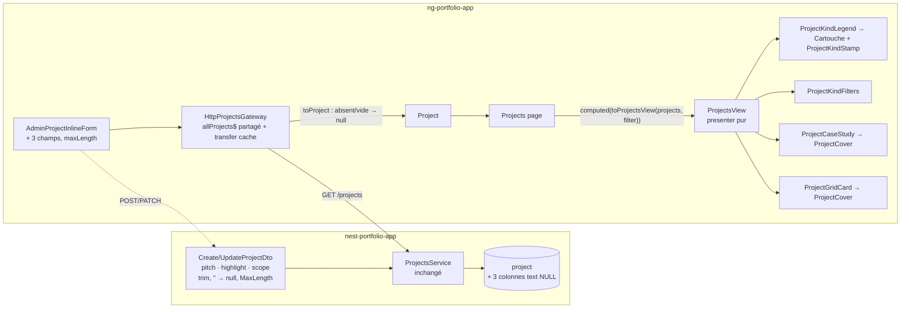

# 012 — Refonte de la page Réalisations

## Description

### Contexte

Depuis la spec 011, chaque projet a une nature (`production`, `demo`, `script`), une galerie et,
bientôt, une couverture au format mockup (navigateur + téléphone, ou terminal pour les scripts).
La page `/projects` n'en tire pas parti :

- les deux projets mis en avant sont des cartes chargées (description tronquée, encadré « Décision
  clé », 7 à 9 étiquettes, trois liens) : l'œil ne sait pas où aller ;
- les quatre autres sont une liste de texte sans visuel : démos et scripts paraissent secondaires ;
- le filtre « Application Web / Script » double les badges de nature et ne distingue pas les démos ;
- l'introduction (« Des applications en production et les outils qui m'aident à les livrer ») ne
  mentionne pas les démos.

Maquette validée par Julien le 2026-10-06 : `specs/assets/012/maquette-clair.jpg`,
`maquette-sombre.jpg`, `maquette-mobile.jpg` ; état actuel : `specs/assets/012/avant.jpg`.

### Ce qui est attendu

#### 1. Page `/projects` (maquette)

1. **En-tête** : sur-titre « 6 réalisations » (compte réel), titre « Réalisations », introduction
   exacte et générée depuis les données ou rédigée (à trancher par l'architecte : elle ne doit
   jamais devenir fausse quand les projets changent). À droite, une **légende en cartouche**
   (« Légende » / « Nature du projet ») : une ligne par nature avec son tampon, une définition
   (« Utilisé pour de vrai », « Entreprise fictive », « Outil en ligne de commande ») et le nombre
   de projets de cette nature.
2. **Filtres par nature** : Tous, En production, Démos, Scripts, avec leur compte ; remplacent le
   filtre par catégorie. Accessibles (navigation, état actif annoncé), conservés dans l'URL si le
   filtre actuel l'est.
3. **Section « En production »** : une **étude de cas** par projet `production`, couverture large
   (7/12) et texte (5/12), en alternance gauche/droite sur grand écran, empilées sur mobile.
   Texte : index et catégorie en mono (« 01 · Application web »), nom, **accroche**, trois
   **repères** en liste de définitions (Stack, Point fort, Périmètre), boutons « Voir la fiche »
   (principal) et « Ouvrir l'application » (secondaire, nouvel onglet, si `liveUrl`).
4. **Section « Démos et outils »** : grille de cartes (2 colonnes, 1 sur mobile) pour les projets
   `demo` et `script` : couverture avec tampon, nom, stack courte en mono, accroche, lien « Voir la
   fiche ».
5. Un projet sans nature (transition) reste visible : l'architecte décide où (grille, sans tampon).
6. La fiche détail garde ses contenus (décisions, choix techniques, galerie) ; l'encadré « Décision
   clé » et les rangées d'étiquettes quittent la liste.
7. Direction « dessin technique » de `DESIGN.md` (cartouche, traits, mono), une seule couleur
   d'accent, clair et sombre, WCAG AA, un seul `h1`, pas de saut de titre, cibles ≥ 44 px.

#### 2. Champs éditoriaux des projets (API + admin)

Décision de Julien (2026-10-06) : de **nouveaux champs** dans l'API et l'admin, plutôt que des
valeurs dérivées de la description :

- **accroche** : une phrase qui dit à quoi sert le projet (longueur bornée, ~160 caractères) ;
- **point fort** : un repère court (~80 caractères) ;
- **périmètre** : un repère court (~80 caractères), par exemple « Conception, développement,
  déploiement ».
- La **stack** affichée reste dérivée des `tags` (premiers éléments), sauf avis contraire motivé
  de l'architecte.
- Champs facultatifs pendant la transition : le front tolère leur absence (repli défini par
  l'architecte, jamais un texte inventé côté front).
- L'admin permet de les saisir et de les modifier (Signal Forms, validation des longueurs).

#### 3. Contenus de départ

Proposition à valider par Julien, saisie par l'admin après déploiement (pas de migration de
contenu) :

| Projet | Accroche | Point fort | Périmètre |
|---|---|---|---|
| DashFlow | Le budget familial et le suivi médical de toute la famille dans une seule app, chiffrés sur l'appareil avant d'être envoyés. | Chiffrement de bout en bout côté client | Conception, développement, déploiement |
| CandiDash | Un tracker de candidatures dédié : chaque candidature, son statut et ses relances automatiques, sans tableur. | Architecture en trois couches, testée sans TestBed | Conception, développement, déploiement |
| Coaching Life | Site vitrine d'une coach fictive : trois activités, prise de rendez-vous et espace d'administration. | Pages vitrines prérendues, administration côté navigateur | Conception, développement, déploiement |
| Le Vieux Comptoir | Brasserie fictive en une page : l'ambiance dès la première image, la carte et la réservation. | Site statique Astro, 100 % Lighthouse | Conception, développement, mise en ligne |
| LabelSync Pro | Synchronise un jeu standardisé d'étiquettes GitHub sur tous mes dépôts, depuis un seul fichier JSON. | Workflow réutilisable depuis n'importe quel dépôt | Conception et maintenance |
| GitPush Auto | Guide tout le flux Git, de la branche au merge, par des menus interactifs en français et en anglais. | Mode prévisualisation (--dry-run) | Conception et maintenance |

### Hors périmètre

- La fiche détail `/projects/:slug` (inchangée hormis ce qui découle des nouveaux champs, si
  l'architecte juge utile d'y afficher l'accroche).
- La home (« Des projets en production ») : inchangée.
- Mesures de performance (mises de côté par le propriétaire).

### Contraintes

- Ordre de déploiement **API puis front** (CLAUDE.md, item 10).
- Prérendu et SEO de `/projects` intacts ; liste partagée et transfer cache (spec 004) préservés.
- Images : couvertures servies par l'API (`api.nedellec-julien.fr`, déjà autorisé par la CSP),
  `NgOptimizedImage` avec dimensions, une seule image `priority` sur la page (la première étude de
  cas), les autres en lazy, pas de CLS.
- Pas de régression des tests et du comportement de pagination existants (à trancher : la
  pagination reste-t-elle utile avec 6 projets ?).

### Critères d'acceptation

1. `/projects` reproduit la maquette en clair, en sombre et sur mobile.
2. Légende et filtres : les comptes correspondent aux données ; filtrer par nature n'affiche que les
   projets de cette nature ; état actif annoncé.
3. Études de cas pour les projets `production`, cartes pour `demo` et `script`, chacune avec son
   tampon ; accroche et repères issus des nouveaux champs, repli défini quand ils manquent.
4. L'API expose et valide les trois champs ; l'admin les saisit ; les tests des deux dépôts sont
   verts.
5. Zéro violation axe, un seul `h1`, aucune image cassée, CLS 0, page prérendue.

### Questions ouvertes pour Julien

1. Les textes de départ du tableau ci-dessus (accroches, points forts, périmètres).
2. Libellés des repères : « Stack », « Point fort », « Périmètre » conviennent-ils ?

## Plan technique

> Deux dépôts : d'abord l'**API** `/home/j-ned/Projects/Portfolio/nest-portfolio-app` (NestJS,
> Drizzle, `class-validator` dans le module `projects`, Jest), puis le **front** (ce dépôt).
> Décision structurante : **ADR-0010** (champs éditoriaux, page organisée par nature), qui
> prolonge ADR-0008 et ADR-0009. Les arbitrages du propriétaire (fin de spec) sont intégrés. Côté
> front, la validation runtime aux frontières n'est pas vérifiée : le profil s'appuie sur des
> adapters purs, sans bibliothèque de validation.

### 0. Faits relevés qui orientent le plan

- **Le filtre actuel n'est pas dans l'URL.** C'est un `signal(ALL_LABEL)` local dans
  `projects.ts`. La règle de la spec (« conservés dans l'URL si le filtre actuel l'est ») donne
  donc un **filtre local**. Le prérendu ne produit que `/projects`, et nginx sert ce HTML quelle
  que soit la query. Avec un `?nature=` hydraté, la page serait rendue sur une autre branche que
  le HTML servi (ADR-0010 §7).
- **La pagination ne s'active jamais.** `ITEMS_PER_PAGE = 12` pour 6 projets, et elle couperait
  absurdement entre les études de cas et la grille. `paginate-projects.use-case.ts` n'a qu'un
  consommateur (cette page). `AppPaginator` sert aussi au blog et reste.
- **`ProjectCard` sert à la home** (`home-projects.ts`, `[showKeyDecision]="true"`), qui est hors
  périmètre. Elle reste inchangée. `/projects` cesse de l'utiliser.
- **`getCategories()` et `ProjectsGateway.filterProjects()` servent à l'admin**
  (`admin-projects.ts`) et restent. Seule la fonction de domaine
  `filter-projects.use-case.ts` (par catégorie, un seul consommateur) disparaît.
- **Couvertures** : `project.image` est une URL sans dimensions intrinsèques. Les 6 projets en
  ont une en prod (AVIF, 1600 px de large au plus). On utilise donc `fill` dans un conteneur à
  ratio fixe `aspect-[16/10]` (celui de la maquette), qui ne provoque aucun CLS par construction.
- **Ordre des tags en prod** (relevé le 2026-10-06) : DashFlow
  `Angular, TypeScript, TailwindCSS, Docker, PostgreSQL, NestJS, API, JWT` et Coaching Life
  `Angular, Git, PostgreSQL, TailwindCSS`. Avec la règle « premiers tags », on n'obtient pas la
  stack de la maquette sans réordonner les tags dans l'admin (ADR-0010 §5, question 1).
- **Longueurs des textes de départ** (calculées en `len()` Python, équivalent `string.length`
  pour ces caractères BMP) : 93 à 124 caractères pour les accroches (borne 160), 33 à 57 pour les
  points forts, 25 à 40 pour les périmètres (borne 80). Tous passent.
- **API** : `ValidationPipe({ whitelist, forbidNonWhitelisted, transform: true })` et précédent
  `@Transform` (trim) dans `ProjectImageAltDto`. Le service fait `insert(...).values({ ...dto })`
  et `update().set({ ...rest })`, et la réponse étale la ligne (`...p`). Une colonne ajoutée au
  schéma est donc **persistée et exposée sans toucher au service**. Les tests du service et du
  DTO le prouvent.
- **Précédents front réutilisés** : `Cartouche`, `Stamp`/`ProjectKindStamp`,
  `project-kind-copy.ts` (`PROJECT_KIND_LABELS`, `liveLinkLabel`, `liveLinkContext`), les
  utilities `link-btn-primary`/`link-btn-outline`/`page-container`, `firstSentence` (déjà dans
  `projects.ts`, déplacée dans le domaine), le motif « lien étiré » de la carte d'offre
  (`after:absolute after:inset-0`, nom en `sr-only`), le `maxLength` de Signal Forms
  (`contact-form.ts`), et la sortie `linkClicked` suivie par la page
  (`ProjectDetailHeader` → `ProjectDetail`).

### 1. Architecture



- **Landmarks** : aucun nouveau. La page reste une `<section aria-labelledby="projects-heading">`
  dans le `main` du shell. Elle n'émet ni `header` ni `footer` de landmark : l'en-tête de page
  est un `<header>` imbriqué dans `section`, donc sans rôle `banner`, comme aujourd'hui. La légende
  est un `role="group"` (hôte de `Cartouche`), pas un `aside` (pas de `complementary`). Les filtres
  sont un `role="group"`, pas un `nav`, puisqu'ils ne naviguent pas (l'`aria-label` de la maquette
  est corrigé).
- **Titres** : `h1` « Réalisations » (unique). `h2` « En production » et « Démos et outils ». `h3`
  pour le nom de chaque étude de cas et de chaque carte. Pas de saut de niveau.
- **Frontière presenter / vue.** `projects.ts` dérive aujourd'hui sections, comptes, libellés et
  pagination dans le composant. Toute la dérivation sort dans **une fonction pure**
  `toProjectsView(projects, filter): ProjectsView` (`application/projects-view.ts`). Elle n'est
  pas une classe : il n'y a ni état ni DOM, une fonction suffit et se teste sans TestBed. Ce
  n'est ni un store ni une facade. La page ne garde que la glue : `rxResource` du gateway, le
  signal du filtre, `view = computed(() => toProjectsView(projects(), filter()))`, `retry()` et le
  suivi analytics du lien externe. Elle n'a plus d'`afterRenderEffect`, puisque le scroll de
  pagination disparaît.
- **Décomposition** (fichiers à créer, § 2) : `ProjectKindLegend`, `ProjectKindFilters`,
  `ProjectCaseStudy`, `ProjectGridCard` et `ProjectCover`. Ce dernier rassemble le cadre, l'image
  `fill`, le tampon et le repli sans image, une structure de plusieurs éléments partagée par les
  deux présentations. Tous sont dumb (`input`/`output`/`model`) et n'injectent rien.

### 2. Fichiers à créer / modifier

#### API (`nest-portfolio-app`)

| Fichier | Rôle |
|---|---|
| `src/database/schema/projects.ts` | Ajoute `pitch: text('pitch')`, `highlight: text('highlight')`, `scope: text('scope')` (nullables, sans défaut) |
| `drizzle/0018_*.sql` + `drizzle/meta/*` | Généré par `pnpm db:generate` : 3 `ALTER TABLE "project" ADD COLUMN … text` |
| `src/projects/project-editorial.ts` | **Créer** : `PROJECT_PITCH_MAX = 160`, `PROJECT_FACT_MAX = 80`, `toNullableText(value: unknown): unknown` (string → `trim()`, puis `''` → `null` ; autre type renvoyé tel quel pour que `@IsString` le rejette) |
| `src/projects/project-editorial.spec.ts` | **Créer** : `toNullableText` (`it.each`) |
| `src/projects/dto/create-project.dto.ts` | 3 propriétés `?: string \| null` : `@Transform(({ value }) => toNullableText(value))`, `@IsOptional()`, `@ValidateIf((_, v) => v !== null)`, `@IsString()`, `@MaxLength(…)`, `@ApiPropertyOptional({ maxLength, nullable: true })` |
| `src/projects/dto/update-project.dto.ts` | Inchangé : il hérite par `PartialType` (`@IsOptional` explicite du parent : `null` accepté) |
| `src/projects/dto/create-project.dto.spec.ts` | Nouveaux `describe` (bornes, `null`, `''`, espaces, type invalide, Create et Update) |
| `src/projects/projects.service.spec.ts` | `create` transmet les 3 champs à l'insert. `update` transmet `null`. Champ absent → absent du `set` |

#### Front (ce dépôt)

| Fichier | Rôle |
|---|---|
| `features/projects/domain/models/project.model.ts` | `Project` + `readonly pitch: string \| null; highlight: string \| null; scope: string \| null`. `PROJECT_PITCH_MAX_LENGTH = 160`, `PROJECT_FACT_MAX_LENGTH = 80`. `type ProjectKindFilter = ProjectKind \| 'all'`. `type ProjectKindCounts = Readonly<Record<ProjectKind, number>>` |
| `features/projects/domain/count-projects-by-kind.ts` (+ `.spec`) | **Créer** : `countProjectsByKind(projects): ProjectKindCounts` (ignore `kind: null`, zéro pour une nature absente) |
| `features/projects/domain/filter-projects-by-kind.ts` (+ `.spec`) | **Créer** : `filterProjectsByKind(projects, filter: ProjectKindFilter)` (`'all'` → tout, y compris `null`, ordre conservé) |
| `features/projects/domain/split-case-studies.ts` (+ `.spec`) | **Créer** : `splitCaseStudies(projects): { caseStudies; others }`. `kind === 'production'` va à gauche, le reste (`demo`, `script`, `null`) à droite, ordre conservé |
| `features/projects/domain/project-pitch.ts` (+ `.spec`) | **Créer** : `projectPitch(project)` = `pitch ?? firstSentence(description)`. `firstSentence` est déplacée ici depuis `projects.ts` |
| `features/projects/domain/project-stack.ts` (+ `.spec`) | **Créer** : `projectStack(tags, size): readonly string[]` (premiers `size` tags) |
| `features/projects/domain/use-cases/filter-projects.use-case.ts` (+ `.spec`) | **Supprimer** (filtre par catégorie, sans autre consommateur) |
| `features/projects/domain/use-cases/paginate-projects.use-case.ts` (+ `.spec`) | **Supprimer** (pagination retirée de `/projects`) |
| `features/projects/infra/project.types.ts` | `ProjectDto` : `Omit<Project, 'kind' \| 'gallery' \| 'pitch' \| 'highlight' \| 'scope'>` + `pitch?: string \| null` (idem pour les deux autres) |
| `features/projects/infra/project.adapter.ts` (+ `.spec`) | Normalise les 3 champs : absent, `null`, `''` ou espaces → `null`, sinon `trim()` (fonction locale `toNullableText`, un seul fichier consommateur) |
| `features/projects/testing/project-builders.ts` | `makeProject` / `makeProjectInput` : `pitch: null, highlight: null, scope: null` |
| `features/projects/application/project-kind-copy.ts` | + `PROJECT_KIND_DEFINITIONS` (« Utilisé pour de vrai », « Entreprise fictive », « Outil en ligne de commande »), `PROJECT_KIND_FILTER_LABELS`, table unique `Record<ProjectKindFilter, string>` (`all: 'Tous'`, « En production », « Démos », « Scripts ») qui remplace la constante `ALL_KINDS_FILTER_LABEL` d'abord prévue (livré en F4), `PROJECT_FACT_LABELS` (`stack: 'Stack'`, `highlight: 'Point fort'`, `scope: 'Périmètre'`) |
| `features/projects/application/projects-intro.ts` (+ `.spec`) | **Créer** : `projectsIntro(counts): string` (§ 6.3) |
| `features/projects/application/projects-view.ts` (+ `.spec`) | **Créer** : types `ProjectsView`, `CaseStudyView`, `ProjectCardView`, `KindFilterOption`, `LegendRow`, et la fonction `toProjectsView(projects, filter)` (§ 4) |
| `features/projects/application/components/project-cover.ts` (+ `.spec`) | **Créer** : `figure` à ratio 16/10, `NgOptimizedImage fill`, tampon en haut à gauche, repli `div aria-hidden` sans image |
| `features/projects/application/components/project-case-study.ts` (+ `.spec`) | **Créer** : étude de cas (§ 6.4) |
| `features/projects/application/components/project-grid-card.ts` (+ `.spec`) | **Créer** : carte de grille (§ 6.5) |
| `features/projects/application/components/project-kind-legend.ts` (+ `.spec`) | **Créer** : légende en cartouche (§ 6.1) |
| `features/projects/application/components/project-kind-filters.ts` (+ `.spec`) | **Créer** : groupe de boutons de filtre (§ 6.2) |
| `features/projects/application/projects.ts` | Réécrit : glue seulement (§ 1). Retire `ProjectCard`, `AppPaginator`, `getCategories`, l'index compact et l'`afterRenderEffect` |
| `features/projects/application/projects.spec.ts` | Réécrit tranche par tranche (les tests de cartes mises en avant, d'index, de filtre par catégorie et de pagination sont remplacés) |
| `features/projects/application/project-detail.spec.ts`, `infra/project.adapter.spec.ts`, `infra/gateways/http-projects.gateway.spec.ts` | Littéraux `Project`/DTO complétés (ou passés par `makeProject`) : le nouveau type l'exige |
| `features/admin/application/components/admin-project-inline-form.ts` (+ `.spec`) | 3 champs, `maxLength`, `toModel`/`toInput` (§ 7) |
| `DESIGN.md` | Sections « Étude de cas » et « Carte de projet (grille) », légende par nature. Mention de `ProjectCover` et de la ligne d'index retirée du placement du tampon |

Pas de modification de `project-detail*`, `home-*`, `ProjectCard`, `app.routes.ts` (SEO) ni
`app.routes.server.ts`.

### 3. Modèles de données

**API.** Les colonnes sont en `text` nullable, et les bornes vivent dans le DTO, comme pour `title`
(ADR-0010 §2). Il n'y a pas de `varchar(n)`.

```ts
// create-project.dto.ts (extrait de forme, pas à copier tel quel)
@ApiPropertyOptional({ maxLength: PROJECT_PITCH_MAX, nullable: true })
@Transform(({ value }: { value: unknown }) => toNullableText(value))
@IsOptional()
@ValidateIf((_, v) => v !== null)
@IsString()
@MaxLength(PROJECT_PITCH_MAX)
pitch?: string | null;
```

| Entrée (POST ou PATCH) | Résultat |
|---|---|
| absent | POST : `NULL`. PATCH : valeur inchangée (clé absente du `set`) |
| `null`, `''`, `'   '` | `NULL` (effacement) |
| `'  Texte  '` | `'Texte'` |
| > 160 (`pitch`) ou > 80 (`highlight`, `scope`) après trim | 400 |
| nombre, tableau, objet | 400 (`@IsString`) |

**Front.** Les champs du modèle sont des `string | null` **requis** (jamais `undefined`), comme
`kind: ProjectKind | null`. Le compilateur force ainsi chaque site de construction à se prononcer.
`ProjectInput` (`Omit<Project, …>`) hérite des trois champs : le formulaire admin doit les envoyer,
c'est vérifié à la compilation. Tous les modèles et vues sont `readonly`, les collections en
`readonly T[]`.

```ts
type ProjectsView = {
  readonly total: number;                       // tous les projets chargés, kind null compris
  readonly intro: string;
  readonly legend: readonly LegendRow[];        // toujours 3 lignes, dans l'ordre de PROJECT_KINDS
  readonly filters: readonly KindFilterOption[]; // 'all' + natures dont le compte > 0
  readonly visibleCount: number;
  readonly caseStudies: readonly CaseStudyView[];
  readonly cards: readonly ProjectCardView[];
};
type LegendRow = { readonly kind: ProjectKind; readonly definition: string; readonly count: number };
type KindFilterOption = { readonly value: ProjectKindFilter; readonly label: string; readonly count: number };
type ProjectFact = { readonly label: string; readonly value: string };
type CaseStudyView = {
  readonly id: string; readonly slug: string; readonly title: string;
  readonly overline: string;                    // '01 · Application Web'
  readonly pitch: string;
  readonly facts: readonly ProjectFact[];       // 0 à 3 lignes, jamais une ligne vide
  readonly liveUrl: string | null;
  readonly image: string;
};
type ProjectCardView = {
  readonly id: string; readonly slug: string; readonly title: string;
  readonly kind: ProjectKind | null;            // null : pas de tampon
  readonly stack: string;                       // '' : élément non rendu
  readonly pitch: string;
  readonly image: string;
};
```

L'étude de cas ne porte pas de `kind` : elle est toujours `production` par construction
(`splitCaseStudies`). Son tampon et son libellé de lien sont donc fixes, et une étude de cas d'une
autre nature est impossible à représenter.

### 4. Réactivité et dérivation

- `projectsResource = rxResource({ stream: () => gateway.getAllProjects() })` est conservé : même
  flux partagé, même transfer cache (spec 004). `categoriesResource` est supprimé, et la page ne
  fait plus qu'**un** abonnement.
- `filter = linkedSignal<readonly Project[], ProjectKindFilter>({ source: projects, computation })`,
  local (ADR-0010 §7) : valeur initiale `'all'` ; à chaque nouvelle liste, il garde le filtre
  précédent s'il sélectionne encore au moins un projet, sinon il revient à `'all'`. Le filtre
  affiché pressé est donc toujours celui qu'applique la vue (livré en F4, à la place du
  `signal<ProjectKindFilter>('all')` d'abord prévu).
- `view = computed(() => toProjectsView(projects(), filter()))`. Le template lit `view()` une
  seule fois par `@let v = view();`. Pas de méthode ni de getter dans le template.
- `toProjectsView` compose les fonctions du domaine. La légende, les filtres, `total` et
  l'introduction se calculent sur **tous** les projets (`countProjectsByKind`). `caseStudies` et
  `cards` passent par `filterProjectsByKind`, puis `splitCaseStudies`. L'index `01` de l'overline
  est la position dans `caseStudies`, sur 2 chiffres, suivie de `' · '` et de `category` telle
  quelle. Les `facts` valent `Stack` = `projectStack(tags, 4).join(' · ')` si non vide, puis
  `Point fort` et `Périmètre` s'ils ne sont pas `null`, dans cet ordre. La `stack` d'une carte
  vaut `projectStack(tags, 2).join(' · ')`.
- **Sélection d'un filtre disparu** : si le filtre actif n'est plus proposé (compte tombé à 0
  après un `reload`), le `linkedSignal` de la page revient à `'all'`, ce qui presse « Tous ».
  `toProjectsView` traite aussi ce filtre comme `'all'` : la redondance est assumée, la page
  garde le bouton pressé juste et la fonction pure reste totale pour tout appelant.

### 5. État partagé et coordination

- **Signals locaux** dans la page (filtre en `linkedSignal` sur la liste chargée, § 4). Aucun store : rien n'est partagé hors de l'écran.
  Aucune facade : la page consomme directement le gateway par `inject` (CLAUDE.md : pas de use
  case passthrough). Le **presenter** est la fonction pure `toProjectsView`.
- **Gateway** : `ProjectsGateway`/`HttpProjectsGateway` sont inchangés, à part l'adapter.
- `ProjectKindFilters` expose `active = model.required<ProjectKindFilter>()` : la page lie son
  `linkedSignal` (`[(active)]="filter"`) et fixe la valeur, l'enfant l'écrit au clic, ce qui justifie le `[(active)]`. Les autres composants
  n'ont que des `input()` (et `output()` pour le lien externe de l'étude de cas).

### 6. UI de la page `/projects`

Direction « dessin technique » (`DESIGN.md`) : traits `line`/`line-strong` décoratifs, mono pour
les métadonnées techniques (index, stack, libellés des repères, comptes), une seule teinte
d'accent (`primary`). Les couleurs passent toutes par les tokens existants. Aucun nouveau contraste
n'est introduit, donc aucun ratio à recalculer : le texte courant et `text-muted` sont déjà
vérifiés dans `DESIGN.md` §2 pour les deux registres.

1. **En-tête** : grille `lg:grid-cols-[minmax(0,1fr)_23.75rem] lg:items-end`, empilée en dessous.
   À gauche : sur-titre mono `text-primary` « N réalisation(s) » (`total`), `h1` inchangé,
   introduction (`view.intro`). À droite, **`ProjectKindLegend`** :
   `<app-cartouche title="Légende" reference="Nature du projet">` sans `rows`, avec un `dl`
   projeté en grille `grid-cols-[auto_minmax(0,1fr)_auto]`, trois lignes : `dt` =
   `<app-project-kind-stamp>`, `dd` = définition, `dd` = compte en mono `tabular-nums` avec
   `sr-only` « projet(s) » pour que le nombre soit lu avec son unité. La barre de titre suit
   `Cartouche` (titre puis référence empilés, `DESIGN.md`) et non la ligne unique de la maquette :
   l'écart est assumé pour garder une seule apparence de cartouche. Il s'agit d'un cartouche de
   données, hors de la limite « un cartouche décoratif par écran ».
2. **`ProjectKindFilters`** : `div role="group" aria-label="Filtrer par nature"`, des `button
   type="button"` avec `[attr.aria-pressed]`. C'est le motif actuel, conservé : ce sont des
   boutons bascule, pas des onglets, car il n'y a ni `tabpanel` ni flèches. Style souligné de la
   maquette : `border-b-2 border-transparent aria-pressed:border-primary
   aria-pressed:font-semibold aria-pressed:text-foreground`. L'état actif passe donc par la
   graisse **et** par le trait `primary`, ce qui suit la Decorative Line Rule (le trait porteur
   est en `primary`). Compte en mono. `min-h-11` (44 px). Sur mobile,
   `overflow-x-auto` sans retour à la ligne. Un filtre n'est proposé que si son compte est > 0
   (« Tous » toujours). Sous le groupe, `<p role="status" class="sr-only">`
   « N réalisation(s) affichée(s) » (`visibleCount`) annonce le résultat d'un changement de
   filtre. Le focus reste sur le bouton pressé.
3. **Introduction** (`projectsIntro(counts)`), **générée** (ADR-0010 §8) : un segment par nature
   de compte > 0, dans l'ordre `production`, `demo`, `script`. Les segments sont joints par
   `', '`, avec majuscule initiale et un point final, suivis de la phrase fixe « Chaque fiche
   montre le résultat et les choix techniques. ». Noms par nature : `application en service`
   (f.), `site de démonstration` (m.) et `outil de développement` (m.), au pluriel au-delà de 1.
   Les nombres s'écrivent en lettres de 1 à 9 (`un`/`une` selon le genre), en chiffres à partir
   de 10. Avec les données actuelles, on obtient exactement le texte de la maquette. Si aucune
   nature n'est connue, il ne reste que la phrase fixe.
4. **`ProjectCaseStudy`** (`input.required<CaseStudyView>()`, `priority = input(false)`,
   `liveLinkClicked = output<void>()`) : `article` en grille
   `lg:grid-cols-12 lg:items-center lg:gap-12`. La couverture vient en premier dans le DOM
   (empilée au-dessus sur mobile, comme dans la maquette), en `lg:col-span-7`. Le texte est en
   `lg:col-span-5`. L'alternance passe par `reversed = input(false)` (la page passe `$even`, première couverture à droite comme sur la maquette), qui
   pose `lg:order-last` sur la couverture : seul l'ordre visuel change, le DOM et l'ordre du focus
   restent stables. Texte : overline mono `text-muted`, `h3` nom, accroche `text-muted
   max-w-[46ch]`, `dl` des repères en grille `grid-cols-[6rem_minmax(0,1fr)]` (`dt` mono
   `text-xs text-muted`, traits `line`), absent si `facts` est vide. Actions : `a routerLink` « Voir
   la fiche » en `link-btn-primary` + `sr-only` «  : <nom> » + flèche `aria-hidden`. Si
   `liveUrl` : `a` « Ouvrir l'application » (`liveLinkLabel('production')`) en
   `link-btn-outline`, `target="_blank" rel="noopener noreferrer"`, `liveLinkContext(title)` en
   `sr-only`, icône `external-link`, et `(click)` qui émet `liveLinkClicked`. La page appelle alors
   `AnalyticsGateway.trackProjectClick`, ce qui garde le suivi actuel des liens externes.
5. **`ProjectGridCard`** (`input.required<ProjectCardView>()`) : `article relative`, couverture,
   puis une ligne `h3` + stack mono (`flex-col` sur mobile, `sm:flex-row sm:justify-between`),
   l'accroche, et le lien « Voir la fiche » `text-primary` `min-h-11` étiré
   (`after:absolute after:inset-0`) avec le nom en `sr-only`. C'est le motif de la carte d'offre :
   un seul interactif, toute la carte est cliquable. Pas de lien externe sur la carte, car il est
   sur la fiche. Grille de la page : `ul role="list" grid gap-8 md:grid-cols-2`.
6. **`ProjectCover`** (`image`, `alt`, `kind: ProjectKind | null`, `priority`) : `figure relative
   aspect-[16/10] overflow-hidden rounded-md border border-line-strong bg-surface`. `img
   [ngSrc] fill class="object-cover"` et `[priority]`. Pas de `ngSrcset` (aucun `IMAGE_LOADER`).
   `alt` = « Aperçu du projet <nom> », comme sur le détail. Tampon `absolute left-3 top-3` si
   `kind`. Si `image` est vide, une `div aria-hidden` de même ratio, d'où zéro CLS dans tous les
   cas.
7. **Une seule `priority`** : `[priority]="$first"` sur la **première étude de cas** uniquement.
   Les cartes de la grille n'en ont jamais. Avec le filtre « Démos » ou « Scripts », aucune image
   n'est prioritaire : le changement est client, après le LCP du HTML prérendu (état « Tous »).
8. **Sections** : `section aria-labelledby` + en-tête `flex justify-between border-b
   border-line-strong`, `h2` + compte mono (« N application(s) » / « N projet(s) »). Une section
   vide sous le filtre courant n'est pas rendue.
9. **Projet sans nature** : dans la grille, sans tampon. Il est compté dans « Tous » et dans le
   sur-titre, mais ni dans la légende ni dans l'introduction. Il est masqué sous un filtre de
   nature (ADR-0010 §6).
10. **États** : erreur avec « Réessayer » inchangée. Une liste chargée vide affiche « Aucune
    réalisation pour le moment. ». Il n'y a plus de message « pour ce filtre » : un filtre à 0
    n'est pas proposé.
11. **Fiche détail** : inchangée. L'accroche y doublerait la description qui ouvre l'en-tête, et
    la fiche garde décisions, choix techniques et galerie. L'encadré « Décision clé » et les rangées
    d'étiquettes quittent `/projects`, puisque la page n'utilise plus `ProjectCard`. La home les
    garde (hors périmètre).
12. **Prérendu et SEO** : `RenderMode.Prerender` et les métadonnées de route sont inchangés (la
    description « projets Angular, NestJS… » reste vraie). Pas de `@defer` : grille et études de
    cas sont le contenu principal de la route. Elles restent dans le HTML prérendu, et les images
    de la grille sont en lazy natif. Un seul `GET /api/projects`, servi par le transfer cache à
    l'hydratation.

### 7. Admin (`admin-project-inline-form`)

- Modèle : `pitch: string; highlight: string; scope: string` (défauts `''`, jamais `null`, selon
  Signal Forms). `toModel` : `p.pitch ?? ''`. `toInput` : `m.pitch.trim() || null`. C'est le même
  motif que les liens : `null` part dans le PATCH et efface le champ.
- Schéma : `maxLength(path.pitch, PROJECT_PITCH_MAX_LENGTH, { message: "L'accroche ne doit pas
  dépasser 160 caractères" })`, et pareil pour `highlight`/`scope` avec
  `PROJECT_FACT_MAX_LENGTH`. Les champs sont facultatifs, donc sans `required`. Les messages
  interpolent la constante, comme dans `contact-form.ts`. On ne pose pas `maxlength` à la main :
  `[formField]` possède l'élément.
- Gabarit : `<fieldset>` + `<legend class="form-label">Présentation dans les Réalisations</legend>`,
  placé après « Description ». `textarea` `pitch` (`rows="2"`, `form-textarea`), `input`
  `highlight` et `scope` (`form-input`), chacun avec `label for`. Une aide sous le champ reliée
  par `aria-describedby` indique la limite (« 160 caractères au plus » / « 80 caractères au
  plus »). Si le champ est touché et invalide, la première erreur s'affiche avec `role="alert"`.
- Le composant passe d'environ 394 à environ 450 lignes, au-dessus du seuil advisory de 250. Ce
  dépassement existait déjà. Extraire un sous-composant de champs (passage de `FieldTree` en
  `input`) n'a aucun précédent dans le repo et sort du périmètre : à signaler en finding, pas à
  traiter ici.

### 8. Cross-platform et bibliothèques

Aucune cible native. Aucune dépendance ajoutée, ni côté API (`class-transformer` et
`class-validator` sont déjà là) ni côté front (`NgOptimizedImage`, Signal Forms).

### 9. Ordre de déploiement et transition

1. **PR API** (A1, A2) mergée, puis conteneur redéployé : la migration 0018 se joue au démarrage.
   Vérification en prod :
   `curl -s https://api.nedellec-julien.fr/api/projects | jq '.[0] | {slug, pitch, highlight, scope}'`
   doit renvoyer les trois clés à `null`. L'ancien front les ignore.
2. **PR front** (F1 à F5), mergée **après** que l'API répond avec les trois clés (CLAUDE.md, item
   10). Si le front arrive en avance, la lecture est tolérée (absent → `null`, repli), mais tout
   enregistrement admin répond 400 (`forbidNonWhitelisted`).
3. **Contenu** dans l'admin : les textes du § 3 de la Description (arbitrage 3), et l'ordre des
   tags si la stack de la maquette est voulue (question 1).
4. **Redeploy du front** dans Dokploy, puis vérification **en prod** :
   `projects/index.html` contient les accroches saisies, l'introduction et un seul
   `fetchpriority="high"`.

### Tranches

L'API d'abord, de A1 à A2 (une PR, `pnpm test` + `pnpm lint` + `pnpm build`, et `pnpm db:reset`
en local pour la migration), puis le front, de F1 à F5 (une PR, gates du Dockerfile).

**API (`nest-portfolio-app`)**

- **Tranche A1 — un projet créé porte une accroche, un point fort et un périmètre** : constantes
  et `toNullableText` (pur, `it.each` : trim, `''` et espaces → `null`, non-string renvoyé tel
  quel), colonnes et migration 0018, `CreateProjectDto` (valeur à la borne acceptée, borne + 1 →
  erreur, pour chacun des trois, `null` accepté, nombre rejeté, absent accepté). Service : `create`
  transmet les trois champs à l'insert et la réponse les expose (`createMockDb`).
- **Tranche A2 — l'admin modifie et efface ces champs** : `UpdateProjectDto` (hérité) accepte
  `null`, `''` → `null` et `'  x  '` → `'x'`, et rejette la borne + 1. Service : `update`
  transmet `null`, et un champ absent n'apparaît pas dans le `set`. Ni le DTO de mise à jour ni le
  service ne changent de code, les tests le prouvent. Si l'un d'eux échoue, A2 révèle un défaut
  de l'héritage `PartialType`.

**Front (ce dépôt), une fois l'API en production**

- **Tranche F1 — l'en-tête dit combien de réalisations, de quelles natures** :
  `countProjectsByKind` (domaine pur, natures absentes à 0, `null` ignoré), `projectsIntro` (pur,
  `it.each` : 2/2/2 donne le texte de la maquette, 1 production donne « Une application en
  service. … », une nature à 0 est omise, 10 s'écrit en chiffres, aucune nature donne la phrase
  fixe seule), copies de nature, `toProjectsView` (première version : `total`, `intro`,
  `legend`), `ProjectKindLegend`. Page : sur-titre « N réalisations », introduction et légende.
  Les cartes, l'index et le filtre par catégorie restent en place.
- **Tranche F2 — chaque projet en production a son étude de cas** : modèle `pitch`/`highlight`/
  `scope`, `project.types.ts`, adapter (absent, `null`, `''`, espaces → `null`), builders et
  littéraux des specs existantes, `projectPitch` (repli sur la première phrase), `projectStack`,
  `splitCaseStudies`, `toProjectsView.caseStudies` (overline `01 · <catégorie>`, repères dans
  l'ordre, ligne omise si `null`, aucun `dl` sans repère), `ProjectCover`, `ProjectCaseStudy`
  (alternance, « Ouvrir l'application » seulement avec `liveUrl`, émission suivie par la page).
  Page : section « En production » à la place des cartes mises en avant. `priority` uniquement
  sur la première image. Axe sur la section.
- **Tranche F3 — les démos et les scripts s'affichent en grille** : `toProjectsView.cards`
  (stack à 2, `kind: null` → pas de tampon), `ProjectGridCard` (lien étiré, nom en `sr-only`).
  Page : section « Démos et outils » à la place de l'index compact. Retrait de la pagination
  (suppression de `paginate-projects.use-case.ts` + spec, de `AppPaginator` et de
  l'`afterRenderEffect`). Aucune `img` de grille n'est `priority`, et le projet sans nature est
  dans la grille.
- **Tranche F4 — filtrer par nature** : `filterProjectsByKind` (pur, `it.each` sur les 4
  valeurs, `null` seulement sous `'all'`), `toProjectsView.filters`/`visibleCount` (filtre à 0
  non proposé, filtre disparu → `'all'`), `ProjectKindFilters` (`aria-pressed`, `model`,
  44 px). Page : le filtre par catégorie est remplacé, une section vide sous filtre n'est pas
  rendue, le statut `sr-only` donne le nombre affiché. Suppression de
  `filter-projects.use-case.ts` + spec, et de `getCategories` dans la page. Axe avec un filtre
  actif.
- **Tranche F5 — l'admin saisit l'accroche, le point fort et le périmètre** : trois champs dans
- **Correctifs de la revue finale** : GREEN 1469 passed / 1469 total (1468 + 1 test de `ProjectCover` : tampon `pointer-events-none`) · refactor : aucun (`sizes` retiré de `ProjectCover`, sans effet sans `IMAGE_LOADER` ni `ngSrcset`)
  `admin-project-inline-form`. Valeurs reprises d'un projet (`null` → vide), payload
  `trim() || null`, erreur au-delà de 160 et de 80 caractères affichée au champ touché, aucune
  émission sur `submit()` invalide, valeur à la borne acceptée.

**Révision des tranches existantes** : les specs de `projects.spec.ts` sur les cartes mises en
avant (F2), l'index et la pagination (F3), et le filtre par catégorie (F4) sont **remplacées**
dans la tranche qui retire le comportement, pas avant. Chaque tranche laisse donc la suite verte.

### Risques et inconnues

- **Stack de la maquette contre ordre réel des tags** : avec la règle « premiers tags », DashFlow
  affiche `Angular · TypeScript · TailwindCSS · Docker`. Réordonner les tags dans l'admin, en les
  désélectionnant puis en les resélectionnant, est la seule voie dans le périmètre (question 1).
- **Bornes 160 et 80** : elles supposent une accroche d'une phrase et des repères tenant sur une
  ligne de la colonne 5/12 (environ 40 à 50 caractères par ligne à `text-sm`). Un repère de 80
  caractères occupe deux lignes, ce que la grille `dl` tolère. Les textes de départ font 57
  caractères au plus.
- **Couvertures au ratio 16/10** : `object-cover` rogne toute couverture d'un autre ratio. Les
  mockups à produire doivent viser 1600 × 1000. Les noms de l'introduction (« site de
  démonstration », « outil de développement ») supposent qu'une démo est un site et qu'un script
  est un outil, ce qui est vrai pour ADR-0008. Une nouvelle nature imposerait de revoir
  `projectsIntro`, et le compilateur le signalera (`Record<ProjectKind, …>`).

### Questions pour Julien

1. **Ordre des tags** : la stack affichée reprend les premiers tags (4 sur une étude de cas, 2
   sur une carte). Acceptes-tu de réordonner les tags dans l'admin pour retrouver la maquette
   (DashFlow : Angular, NestJS, PostgreSQL, Docker…) ? Sinon, il faut une poignée de
   réordonnancement des tags dans l'admin (spec à part).
2. **Projet sans nature** : il est visible seulement sous « Tous », dans la grille, sans tampon.
   Depuis ADR-0008, la colonne est `NOT NULL DEFAULT 'demo'`, donc le cas ne se produit qu'avec
   une valeur inconnue envoyée par l'API. Ce choix te convient-il ?

## Arbitrages du propriétaire (2026-10-06)

1. Maquette validée (`specs/assets/012/`).
2. Nouveaux champs dans l'API et l'admin (accroche, point fort, périmètre) plutôt que des valeurs
   dérivées de la description.
3. Textes de départ du tableau § 3 validés tels quels (à saisir par l'admin après déploiement).
4. Intitulés des repères validés : « Stack », « Point fort », « Périmètre ».
5. Ordre de la stack : Julien réordonne les `tags` dans l'admin (désélectionner puis
   resélectionner) ; pas de spec dédiée au réordonnancement.
6. Projet sans nature : visible seulement sous « Tous », dans la grille, sans tampon (repli de
   transition ; l'API impose une nature, ADR-0008).

## Plan de test

### Tranche F1 — l'en-tête dit combien de réalisations, de quelles natures

Couverture : les trois fonctions pures (`countProjectsByKind`, `projectsIntro`, `toProjectsView`)
sont testées sans TestBed. `ProjectKindLegend` reçoit le spec prévu au plan (rendu : cartouche,
`dl`, unité en `sr-only`) ; la page ne vérifie que le câblage (compte, introduction et comptes de
la légende issus des données). `project-kind-copy.ts` n'a pas de spec isolé : les définitions
sont épinglées par le golden `toEqual` de `toProjectsView().legend` et par le spec de la légende.
Le modèle `Project` ne change pas en F1 (`pitch`/`highlight`/`scope` arrivent en F2).

Sweeps : aucun test existant n'asserte l'ancien sur-titre (« N projets ») ni l'ancienne
introduction (`grep` de `projet`, `projets`, `réalisation`, `Des applications en production`,
`projectCountLabel` sur `src/app` et `e2e`) ; aucune suite à adapter. Les tests de cartes,
d'index, de filtre par catégorie et de pagination de `projects.spec.ts` restent tels quels.

Contrats fixés par ce RED :

- **Modèle** (`domain/models/project.model.ts`) : `ProjectKindCounts =
  Readonly<Record<ProjectKind, number>>` (et `ProjectKindFilter = ProjectKind | 'all'`, utilisé
  par la signature de `toProjectsView`).
- **`countProjectsByKind(projects): ProjectKindCounts`** (`domain/count-projects-by-kind.ts`) :
  les trois clés toujours présentes, `0` pour une nature absente, `kind: null` ignoré.
- **`projectsIntro(counts): string`** (`application/projects-intro.ts`) : segments dans l'ordre
  production, démo, script, natures à 0 omises, joints par `', '`, majuscule initiale, point,
  espace, puis « Chaque fiche montre le résultat et les choix techniques. ». Noms : `application
  en service` (f.), `site de démonstration` (m.), `outil de développement` (m.), pluriel au-delà
  de 1. Nombres en lettres de 1 à 9 (`une`/`un` selon le genre), en chiffres dès 10. Aucune
  nature : la phrase fixe seule. Espaces ordinaires (pas d'insécable) dans ce texte.
- **`toProjectsView(projects, 'all')`** (`application/projects-view.ts`, première version) :
  `total` = tous les projets, `null` compris ; `intro` = `projectsIntro(countProjectsByKind(…))` ;
  `legend` = toujours 3 `LegendRow` `{ kind, definition, count }` dans l'ordre de `PROJECT_KINDS`,
  définitions « Utilisé pour de vrai », « Entreprise fictive », « Outil en ligne de commande ».
  Le type `LegendRow` est exporté par ce fichier.
- **`ProjectKindLegend`** (`application/components/project-kind-legend.ts`, `selector:
  'app-project-kind-legend'`) : **input `rows = input.required<readonly LegendRow[]>()`** (nom
  choisi par ce RED, le plan ne le fixait pas). Rendu dans `Cartouche` titre « Légende »,
  référence « Nature du projet » (groupe nommé « Légende ») ; un seul `dl` ; par ligne, un `dt`
  contenant `<app-project-kind-stamp data-testid="project-kind-legend-kind">`, un `dd`
  `project-kind-legend-definition`, un `dd` `project-kind-legend-count` dont le texte normalisé
  vaut « N projet » (N ≤ 1) ou « N projets », l'unité étant dans un élément
  `project-kind-legend-unit` portant `sr-only`. Aucun titre `h1`…`h6`.
- **Page** (`projects.ts`) : sur-titre `data-testid="projects-count"` = « N réalisation(s) »
  (`view.total`, blancs normalisés, donc insécable toléré), introduction
  `data-testid="projects-intro"` = `view.intro`, `ProjectKindLegend` dans le même `header` que
  le `h1`.

**`domain/count-projects-by-kind.spec.ts`** (TS pur, 7 tests, nouveau)

| Test | Scénario | Assertions clés |
|---|---|---|
| comptes par nature (`it.each` × 5) | aucun projet, 2/2/2 mélangés, 3 productions, 1 démo, scripts + démo | `toEqual` des 3 clés |
| sans nature ignoré | `null`, production, `null`, démo | `{ 1, 1, 0 }` |
| que des `null` | 2 projets sans nature | `{ 0, 0, 0 }` |

**`application/projects-intro.spec.ts`** (TS pur, 15 tests, nouveau)

| Test | Scénario | Assertions clés |
|---|---|---|
| nombres en lettres (`it.each` × 8) | 2/2/2 (maquette), 1/0/0, 0/1/0, 0/0/1, 1/1/1, 0/3/0, 4/5/6, 7/8/9 | `toBe` du texte exact (`Une`/`Un`, `Deux`…`Neuf`, pluriels) |
| nature à 0 omise (`it.each` × 3) | production, démo, script à 0 | segment absent, virgules justes |
| chiffres dès 10 (`it.each` × 3) | 10/0/0, 9/12/1, 0/0/23 | `10 applications…`, `Neuf … 12 sites …`, `23 outils…` |
| aucune nature | 0/0/0 | la phrase fixe seule |

**`application/projects-view.spec.ts`** (TS pur, 12 tests, nouveau)

| Test | Scénario | Assertions clés |
|---|---|---|
| total (`it.each` × 4) | 0, 1, 6 projets, 3 dont 2 sans nature | `total` exact, `null` compris |
| intro maquette | 2/2/2 | texte de la maquette |
| intro sans `null` | production, `null`, script, `null` | `Une application en service, un outil de développement. …` |
| intro vide | aucun projet | phrase fixe |
| légende maquette | 2/2/2 | golden `toEqual` des 3 `LegendRow` (natures, définitions, comptes) |
| légende ordonnée (`it.each` × 4) | scripts seuls, démo + `null`, aucun projet, natures dans le désordre | natures `['production','demo','script']`, comptes exacts |

**`application/components/project-kind-legend.spec.ts`** (TestBed, `setInput('rows')`, 9 tests, nouveau)

| Test | Scénario | Assertions clés |
|---|---|---|
| cartouche | lignes de la maquette | titre `Légende`, référence `Nature du projet`, `role="group"` nommé `Légende` |
| tampons | 3 natures | textes `En production`/`Démo`/`Script`, balise `APP-PROJECT-KIND-STAMP` |
| définitions | 3 natures | les 3 définitions, dans l'ordre |
| comptes avec unité (`it.each` × 3) | 2/2/2, 1/3/0, 12/0/1 | `2 projets`, `1 projet`, `0 projet`, `12 projets` |
| unité masquée | lignes de la maquette | `project-kind-legend-unit` = `projets`, porte `sr-only`, dans le `dd` du compte |
| liste de description | lignes de la maquette | tampons dans un `dt`, définitions et comptes en `DD`, un seul `dl`, dans le groupe « Légende » |
| aucun titre | lignes de la maquette | 0 `h1`…`h6` |

**`application/projects.spec.ts`** (+8 tests, `describe` « en-tête : compte, introduction et légende par nature »)

| Test | Scénario | Assertions clés |
|---|---|---|
| sur-titre (`it.each` × 3) | 6 projets, 1 projet, production + `null` | `6 réalisations`, `1 réalisation`, `2 réalisations` |
| introduction maquette | 2/2/2 | texte de la maquette |
| introduction d'une nature | 1 production | `Une application en service. …` |
| légende câblée (`it.each` × 2) | 2/2/2 ; 3 productions, 1 démo, 1 `null` | tampons dans l'ordre ; comptes `2/2/2 projets`, `3 projets`/`1 projet`/`0 projet` |
| légende dans l'en-tête | 2/2/2 | 3 comptes, même `header` que `projects-title` |

Tous les tests de cette tranche échouent à ce stade (RED confirmé via la commande test du profil
le 2026-10-06 21:01, 47 failed / 1310 total). Nature des échecs : sur l'arbre réel, `pnpm test`
(après `ng cache clean` et purge de `node_modules/.vite`) s'arrête à la compilation, uniquement
sur des symboles applicatifs dus au GREEN : `TS2307` `./count-projects-by-kind`,
`./projects-intro`, `./projects-view`, `../projects-view`, `./project-kind-legend` ; `TS2305`
`ProjectKindCounts` ; `TS7006` (`row` implicite) qui découle de `./projects-view` absent. Aucune
faute de type propre aux specs ; prettier et eslint verts sur les 5 fichiers ; le motif
d'archéologie ne trouve rien. Mesure du rouge comportemental : squelette jetable posé le temps
d'une exécution puis retiré (types du modèle, `countProjectsByKind` à zéro, `projectsIntro` et
`toProjectsView` vides, `ProjectKindLegend` sans gabarit, page inchangée). Résultat : 117
fichiers, 47 failed / 1310 total, tous en `AssertionError` : 5 `countProjectsByKind`, 15
`projectsIntro`, 11 `toProjectsView`, 8 légende, 8 page. Verts par nature sous le squelette (4) :
aucun projet et que des `null` (comptes à zéro), `total` à 0, légende sans titre.
Harnais vérifié : une implémentation jetable (fonctions, légende, page) donne 1310 passed / 1310,
puis a été retirée (`git checkout` + suppression ; `git status` ne montre que les specs).
Non-régression : la base avant RED donne 1259 passed / 1259 ; 1310 = 1259 + 51 tests ajoutés.
Aucun test existant ne tombe.
Dû au GREEN : `project.model.ts` (`ProjectKindCounts`, `ProjectKindFilter`),
`count-projects-by-kind.ts`, `project-kind-copy.ts` (`PROJECT_KIND_DEFINITIONS`),
`projects-intro.ts`, `projects-view.ts`, `components/project-kind-legend.ts`, `projects.ts`.

### Tranche F2 — chaque projet en production a son étude de cas

Couverture : `projectPitch`, `projectStack` et `splitCaseStudies` en TS pur ; l'adapter sur les
trois champs ; `toProjectsView().caseStudies` (golden `toEqual` + repères + index d'overline) ;
`ProjectCover` et `ProjectCaseStudy` en TestBed (`setInput`) ; la page ne vérifie que le câblage
(section, compte, ordre, repli d'accroche, alternance, priorité unique, suivi du lien externe,
hiérarchie des titres). F3, F4 et F5 ne sont pas testés.

Sweeps (modèle `Project`/`ProjectInput` élargi de trois champs requis) :

- `grep` des constructions de `Project`, `ProjectInput` et `ProjectDto` dans `src/**/*.spec.ts` :
  toutes passent par `makeProject`/`makeProjectInput`, sauf le `dto()` local de
  `project.adapter.spec.ts`. Builders étendus (`pitch`, `highlight`, `scope` à `null`), `dto()`
  étendu (trois textes). Le `legacyRow` de `http-projects.gateway.spec.ts` dérive de `makeProject`
  et reste juste sans retouche.
- Golden de l'adapter (« every field is kept ») : les trois champs ajoutés à l'entrée et à
  l'attendu (changement de contrat, rouge d'assertion).
- Golden du payload admin (`admin-project-inline-form.spec.ts`, « the payload is exactly the
  writable fields ») : `pitch`, `highlight`, `scope` à `null` pour un projet qui n'en a pas.
  `ProjectInput` hérite des trois champs dès F2, donc `toInput` doit les émettre dès ce GREEN ; le
  formulaire (saisie, bornes) reste F5.
- `projects.spec.ts` : les tests des cartes mises en avant sont remplacés (plan, « Révision des
  tranches existantes »). Priorité d'image : portée sur les études de cas et sur **toute** la page
  (`['high', 'auto']`). Catalogue « hiérarchie » : natures posées (Alpha, Beta `production` ; les
  autres `demo`/`script`), helper `cards` remplacé par les titres d'études de cas, assertion
  « aucune carte sous filtre » retirée (le comportement disparaît, F4 réécrit ce test). Les
  attentes de l'index (Gamma…Zeta, 4 sous « Web », première phrase, stack à 3, tampons) sont
  inchangées : l'index garde sa logique jusqu'à F3.

Contrats fixés par ce RED :

- **Modèle** : `Project` + `pitch`, `highlight`, `scope` en `string | null` requis ;
  `ProjectInput` les hérite ; `ProjectDto` les reçoit en `?: string | null`.
- **Adapter** : pour chacun des trois, absent, `null`, `''`, espaces ou blancs (`'\n\t '`) →
  `null` ; sinon `trim()`.
- **`projectPitch(project): string`** (`domain/project-pitch.ts`) : `pitch` tel quel, sinon
  première phrase de la description (coupe sur un point suivi d'un blanc, comme `firstSentence`
  aujourd'hui ; sans point, la description entière ; `Astro.js` ne coupe pas).
- **`projectStack(tags, size): readonly string[]`** (`domain/project-stack.ts`) : les `size`
  premiers tags, ordre gardé, entrée non mutée.
- **`splitCaseStudies(projects): { caseStudies; others }`** (`domain/split-case-studies.ts`) :
  `kind === 'production'` à gauche, le reste (`null` compris) à droite, ordre gardé, `featured`
  sans effet.
- **`toProjectsView(…).caseStudies: readonly CaseStudyView[]`** et **type `CaseStudyView` exporté**
  par `projects-view.ts` (forme du plan § 3) : `overline` = index sur 2 chiffres + `' · '` (espaces
  ordinaires) + `category` ; `pitch` = `projectPitch` ; `facts` = `{ label, value }` dans l'ordre
  Stack (`projectStack(tags, 4).join(' · ')`, omise si aucun tag), Point fort, Périmètre (omis si
  `null`) ; `liveUrl` absent ou `null` → `null`.
- **`ProjectCover`** (`selector: 'app-project-cover'`) : inputs `image`, `alt`, `kind`
  (`ProjectKind | null`), `priority` (défaut `false`). Testids : `project-cover` (`figure`, classe
  `aspect-[16/10]` avec ou sans image), `project-cover-image` (`img`, `src`, `alt`,
  `fetchpriority`/`loading` : `high`/`eager` si prioritaire, sinon `auto`/`lazy`),
  `project-cover-placeholder` (`aria-hidden="true"`, aucun `img`), `project-cover-kind`
  (`<app-project-kind-stamp>` dans la `figure`, absent si `kind` est `null`).
- **`ProjectCaseStudy`** (`selector: 'app-project-case-study'`) : **input `caseStudy =
  input.required<CaseStudyView>()`** (nom choisi par ce RED), `priority` et `reversed` (défaut
  `false`), `liveLinkClicked = output<void>()`. Testids : `project-case-study` (`article`),
  `project-case-study-overline`, `project-case-study-title` (`h3`), `project-case-study-pitch`,
  `project-case-study-facts` (unique `dl`, absent sans repère), `project-case-study-fact-label`
  (`dt`), `project-case-study-fact-value` (`dd`), `project-case-study-link` (`a`, `href`
  `/projects/<slug>`, nom « Voir la fiche : <nom> »), `project-case-study-link-context` (`sr-only`,
  texte exact `'\u00a0: <nom>'`, dans le lien), `project-case-study-live-link` (seulement avec
  `liveUrl` : `target="_blank"`, `rel="noopener noreferrer"`, nom « Ouvrir l'application : <nom>,
  nouvel onglet », clic → une émission), `project-case-study-cover` (hôte
  `<app-project-cover>`, avant le titre dans le DOM, tampon « En production », `alt` « Aperçu du
  projet <nom> », classe `lg:order-last` si et seulement si `reversed`).
- **Page** : `section` `data-testid="projects-case-studies"` `aria-labelledby` → `h2` « En
  production », compte `projects-case-studies-count` « N application(s) » ; non rendue sans
  projet `production` ; `priority` sur la première étude de cas seulement ; clic sur le lien
  externe → `AnalyticsGateway.trackProjectClick(id, title)` une fois ; titres `h1`, `h2`, puis un
  `h3` par étude de cas. **Alternance : `[true, false, true]` pour `reversed`**, soit la première
  couverture à droite comme sur la maquette validée (DashFlow : texte à gauche, couverture à
  droite ; CandiDash : l'inverse). La page passe `$even` (plan § 6.4), ce qui suit la maquette.

Écart au plan : « Axe sur la section » n'est pas testable, `axe-core` n'est pas installé (aucune
occurrence dans `package.json`). Remplacé par des assertions structurelles (section nommée par son
`h2`, hiérarchie sans saut, `dl`/`dt`/`dd`, noms accessibles des liens, `aria-hidden` du repli).

**`domain/project-pitch.spec.ts`** (TS pur, 5 tests, nouveau)

| Test | Scénario | Assertions clés |
|---|---|---|
| accroche présente | `pitch` + description à 2 phrases | `toBe` de l'accroche |
| repli (`it.each` × 4) | plusieurs phrases, une seule, sans point, `Astro.js` | première phrase exacte |

**`domain/project-stack.spec.ts`** (TS pur, 6 tests, nouveau)

| Test | Scénario | Assertions clés |
|---|---|---|
| premiers tags (`it.each` × 5) | 6 tags/4, 4/4, 2/4, 0/4, 3/2 | `toEqual` exact |
| entrée intacte | 5 tags, taille 2 | tableau d'origine inchangé |

**`domain/split-case-studies.spec.ts`** (TS pur, 7 tests, nouveau)

| Test | Scénario | Assertions clés |
|---|---|---|
| partage (`it.each` × 6) | maquette, désordre, `null`, que production, aucune production, vide | ids des deux côtés, ordre gardé |
| nature seule | démo `featured`, production non `featured` | `['prod']` / `['demo']` |

**`infra/project.adapter.spec.ts`** (+18 tests, golden adapté)

| Test | Scénario | Assertions clés |
|---|---|---|
| golden complet (adapté) | DTO avec les trois textes | `toEqual` avec `pitch`/`highlight`/`scope` |
| absent (`describe.each` × 3) | clé retirée du DTO | `null` |
| vide (`it.each` × 4, × 3 champs) | `null`, `''`, `'   '`, `'\n\t '` | `null` |
| trim (× 3 champs) | `'  Conception et maintenance  '` | texte coupé |

**`application/projects-view.spec.ts`** (+9 tests, `describe('caseStudies')`)

| Test | Scénario | Assertions clés |
|---|---|---|
| golden | DashFlow complet et CandiDash sans accroche ni point fort parmi démo, script, `null` | `toEqual` des 2 `CaseStudyView` (overline, accroche ou repli, repères, `liveUrl`, image) |
| repères (`it.each` × 4) | aucun ; point fort seul ; périmètre seul ; tag + point fort | liste exacte, ordre Stack/Point fort/Périmètre |
| index à 2 chiffres | 10 productions | `01 · Script` … `10 · Script` |
| lien absent (`it.each` × 2) | `undefined`, `null` | `liveUrl` `null` |
| aucune production | démo, script, `null` | `[]` |

**`application/components/project-cover.spec.ts`** (TestBed, 11 tests, nouveau)

| Test | Scénario | Assertions clés |
|---|---|---|
| image | URL + alt | `img` dans la `figure`, `src`, `alt`, pas de repli |
| repli | `image: ''` | 0 `img`, `div aria-hidden="true"` dans la `figure` |
| ratio (`it.each` × 2) | avec et sans image | `aspect-[16/10]` sur la `figure` |
| priorité (`it.each` × 3) | `true`, `false`, défaut | `high`/`eager`, `auto`/`lazy` |
| tampon (`it.each` × 3) | 3 natures | `APP-PROJECT-KIND-STAMP`, libellé, dans la `figure` |
| sans nature | `kind: null` | aucun tampon |

**`application/components/project-case-study.spec.ts`** (TestBed, 15 tests, nouveau)

| Test | Scénario | Assertions clés |
|---|---|---|
| texte | vue complète | `ARTICLE`, overline, `H3`, accroche |
| repères | 3 repères | `dl` unique, `DT`/`DD` dans l'ordre |
| un repère | Périmètre seul | une ligne |
| aucun repère | `facts: []` | aucun `dl` |
| fiche | vue complète | `href`, nom « Voir la fiche : DashFlow », contexte `sr-only` exact |
| lien externe | `liveUrl` | `href`, `_blank`, `rel`, nom complet |
| sans lien externe | `liveUrl: null` | lien externe absent, fiche présente |
| suivi | clic sur le lien externe | `liveLinkClicked` émis une fois |
| couverture | vue complète | `APP-PROJECT-COVER`, tampon « En production », `alt` |
| priorité (`it.each` × 3) | `true`, `false`, défaut | `high`, `auto`, `auto` |
| alternance (`it.each` × 3) | `true`, `false`, défaut | `lg:order-last` selon `reversed`, couverture avant le titre |

**`application/projects.spec.ts`** (+10 tests, `describe` « section « En production » », 3 tests adaptés)

| Test | Scénario | Assertions clés |
|---|---|---|
| section | 2 productions | `SECTION` nommée par le `h2` « En production », titres dedans |
| compte (`it.each` × 2) | 2, 1 | `2 applications`, `1 application` |
| natures mêlées | démo `featured`, production non `featured`, script, `null`, production | `['CandiDash', 'DashFlow']` |
| aucune production | démo, script | section absente |
| câblage | DashFlow renseigné, `scope: null` | overline, accroche, repères Stack/Point fort, `href` des deux liens |
| repli d'accroche | `pitch: null` | première phrase |
| alternance | 3 productions | `[true, false, true]` |
| suivi | clic sur le lien externe | `trackProjectClick('dashflow', 'DashFlow')` une fois |
| titres | 2 productions | `H1`, `H2`, `H3`, `H3` |
| priorité (adapté) | 2 productions `featured` avec image | toutes les `img` sont dans des études de cas, `['high', 'auto']` |

Tous les tests de cette tranche échouent à ce stade (RED confirmé via la commande test du profil
le 2026-10-06 21:18, 75 failed / 1391 total). Nature des échecs : sur l'arbre réel, `pnpm test`
(après `ng cache clean` et purge de `node_modules/.vite`) s'arrête à la compilation, uniquement
sur des symboles applicatifs dus au GREEN : `TS2307` `./project-pitch`, `./project-stack`,
`./split-case-studies`, `./project-cover`, `./project-case-study` ; `TS2305` `CaseStudyView` ;
`TS2339` `caseStudies`, `ProjectDto.pitch/highlight/scope` ; `TS2353` `pitch`/`highlight` sur
`Project`, `Partial<Project>`, `ProjectInput`, `ProjectDto` ; `TS7053` (index par champ
éditorial) qui découle des champs absents du modèle. Aucune faute de type propre aux specs ;
prettier et eslint verts ; le motif d'archéologie ne trouve rien. Mesure du rouge comportemental :
squelette jetable posé le temps d'une exécution puis retiré (champs du modèle et du DTO, adapter
qui recopie sans normaliser, `caseStudies: []`, fonctions pures neutres, `ProjectCover` et
`ProjectCaseStudy` sans gabarit, `toInput` admin sans les trois champs, page inchangée). Résultat :
122 fichiers, 75 failed / 1391 total, tous en `AssertionError` : 1 admin, 14 étude de cas, 10
couverture, 12 page (dont 3 adaptés), 8 vue, 5 `projectPitch`, 4 `projectStack`, 6
`splitCaseStudies`, 15 adapter. Verts par nature sous le squelette (10) : aucun tag (stack),
entrée intacte, aucun projet (partage), aucune production (vue, page), sans nature (couverture),
aucun repère (étude de cas), `null` recopié (adapter × 3). Harnais vérifié : une implémentation
jetable (fonctions, adapter, vue, deux composants, section de la page) donne 1390 passed / 1391,
le seul échec étant le payload admin laissé sans les trois champs ; puis retirée (`git status`
identique à l'état d'avant). Non-régression : la base F1 donne 1310 passed / 1310 ; 1391 = 1310 +
81 tests ajoutés. Aucun test d'une tranche antérieure ne tombe.
Dû au GREEN : `project.model.ts` (trois champs ; `PROJECT_PITCH_MAX_LENGTH`/`PROJECT_FACT_MAX_LENGTH`
non testés ici), `project.types.ts`, `project.adapter.ts`, `project-pitch.ts`, `project-stack.ts`,
`split-case-studies.ts`, `project-kind-copy.ts` (`PROJECT_FACT_LABELS`), `projects-view.ts`
(`CaseStudyView`, `ProjectFact`, `caseStudies`), `components/project-cover.ts`,
`components/project-case-study.ts`, `projects.ts`, `admin-project-inline-form.ts` (`toInput` émet
les trois champs, `null` pour un projet qui n'en a pas).

### Tranche F3 — les démos et les scripts s'affichent en grille

Couverture : `toProjectsView().cards` en TS pur (golden `toEqual`, stack à 2, aucune carte sans
démo ni script) ; `ProjectGridCard` en TestBed (`setInput`) ; la page ne vérifie que le câblage
(section, compte, classement par la seule nature, données d'une carte, projet sans nature, pas de
pagination, aucune image de grille prioritaire, hiérarchie des titres). F4 et F5 ne sont pas
testés.

Sweeps (retrait de l'index compact et de la pagination, classement par `kind` seul) :

- `grep` de `project-index`, `projects-index`, `Autres projets`, `paginate-projects`,
  `paginateProjects`, `calculateTotalPages`, `ITEMS_PER_PAGE`, `app-paginator`, `AppPaginator` sur
  `src` et `e2e` (hors `shared/ui/paginator` et blog, qui gardent `AppPaginator`) : seuls
  `projects.ts`, `projects.spec.ts` et `paginate-projects.use-case.spec.ts` sont concernés.
- `paginate-projects.use-case.spec.ts` **supprimé** (12 tests) : le plan retire la fonction, son
  seul consommateur était la page.
- `projects.spec.ts`, tests **réécrits** (le describe « hiérarchie mis en avant / index » devient
  « classement par nature : études de cas puis grille ») :
  - « les projets en production sont en études de cas et les autres en index » : mêmes données,
    les quatre autres projets sont lus dans la grille (`project-grid-card-title`), plus dans
    l'index ;
  - « un filtre actif : tous les résultats passent dans l'index » : sous le filtre « Web », les
    projets retenus gardent la présentation de leur nature (études de cas Alpha, Beta ; cartes
    Gamma, Zeta). Le transitoire « études de cas masquées sous filtre » disparaît.
- `projects.spec.ts`, tests **retirés** (comportement supprimé, remplacé par les tests de la
  grille) :
  - « six projets tiennent sur une page, sans paginateur » → remplacé par « treize démos sont
    listées sur une seule page » (discriminant : il échoue avec la pagination à 12) ;
  - « un projet de l'index : première phrase et trois outils au plus » → remplacé par la carte
    renseignée (première phrase, **deux** outils, lien) ;
  - describe « nature des projets de l'index » (5 tests : tampon par nature, tampon hors du lien)
    → remplacé par les tampons de `ProjectGridCard` (dans la couverture) et le projet sans nature
    de la page.
- Les comptes du filtre par catégorie (`it.each` × 3) et le test de priorité d'image de F2
  restent inchangés.
- Aucun test existant n'assertait l'effet de `featured` sur `/projects` hors de ceux ci-dessus.

Choix pour l'ancien filtre par catégorie (F3) : il **reste** en place et fonctionnel jusqu'à F4,
qui le remplace. Sous un filtre de catégorie, il restreint les deux sections, et chaque projet
retenu garde la présentation de sa nature (étude de cas ou carte). Ce RED n'épingle pas l'effet
du filtre sur l'en-tête (sur-titre, légende, introduction), comportement voué à disparaître en F4 :
le GREEN peut calculer l'en-tête sur tous les projets, comme le prévoit le plan § 4.

Contrats fixés par ce RED :

- **`toProjectsView(…).cards: readonly ProjectCardView[]`** et **type `ProjectCardView` exporté**
  par `projects-view.ts` (forme du plan § 3 : `id`, `slug`, `title`, `kind`, `stack`, `pitch`,
  `image`). Cartes = projets non `production` (`demo`, `script`, `null`), ordre gardé, `featured`
  sans effet ; `stack` = `projectStack(tags, 2).join(' · ')`, `''` sans tag ; `pitch` =
  `projectPitch` ; `kind` recopié (`null` gardé).
- **`ProjectGridCard`** (`selector: 'app-project-grid-card'`) : **input `card =
  input.required<ProjectCardView>()`** (nom choisi par ce RED). Testids : `project-grid-card`
  (`article`, classe `relative`), `project-grid-card-cover` (hôte `<app-project-cover>`, avant le
  titre dans le DOM, tampon de la nature ou aucun si `null`, `alt` « Aperçu du projet <nom> »,
  jamais prioritaire : `fetchpriority="auto"`, `loading="lazy"`), `project-grid-card-title`
  (`h3`), `project-grid-card-stack` (absent si `stack` vaut `''`), `project-grid-card-pitch`,
  `project-grid-card-link` (`a`, seul élément interactif de la carte, `href` `/projects/<slug>`,
  nom « Voir la fiche : <nom> », classes `after:absolute`, `after:inset-0`, `min-h-11`),
  `project-grid-card-link-context` (`sr-only`, texte exact `'\u00a0: <nom>'`, dans le lien).
- **Page** : `section` `data-testid="projects-cards"` `aria-labelledby` → `h2` « Démos et
  outils », compte `projects-cards-count` « N projet(s) », cartes dans un `ul role="list"` de la
  section ; non rendue sans démo, script ni projet sans nature. Chaque projet apparaît une seule
  fois (les `h3` de la page sont exactement études de cas puis cartes). Pas de pagination (13
  cartes affichées). Aucune `img` de la grille n'est prioritaire. Titres : `h1`, `h2` « En
  production », ses `h3`, `h2` « Démos et outils », ses `h3`.

Écart au plan : aucun. « Axe » n'est pas demandé en F3 ; `axe-core` reste absent (cf. F2).

**`application/projects-view.spec.ts`** (+7 tests, `describe('cards')`)

| Test | Scénario | Assertions clés |
|---|---|---|
| golden | démo `featured` avec accroche, production non `featured`, script sans accroche, `null` sans tag | `toEqual` des 3 `ProjectCardView` (stack à 2, repli d'accroche, `kind: null`, `stack: ''`) |
| stack courte (`it.each` × 4) | 0, 1, 2, 4 tags | `''`, `Bash`, `Astro · TailwindCSS`, deux premiers |
| aucune carte | productions seules | `[]` |
| maquette | 2/2/2 | cartes `p-2`…`p-5`, études de cas `p-0`, `p-1` |

**`application/components/project-grid-card.spec.ts`** (TestBed, `setInput('card')`, 8 tests, nouveau)

| Test | Scénario | Assertions clés |
|---|---|---|
| texte | carte complète | `ARTICLE`, `H3`, stack, accroche |
| sans stack | `stack: ''` | élément stack absent |
| fiche | carte complète | `href`, nom « Voir la fiche : Coaching Life », contexte `sr-only` exact |
| lien étiré | carte complète | seul `a`/`button` de la carte, `relative` sur l'`article`, `after:absolute after:inset-0 min-h-11` sur le lien |
| couverture (`it.each` × 2) | démo, script | `APP-PROJECT-COVER` avant le titre, tampon `Démo`/`Script`, `alt` |
| sans nature | `kind: null` | couverture sans tampon |
| jamais prioritaire | carte avec image | `src`, `auto`/`lazy` |

**`application/projects.spec.ts`** (+10 tests dans `describe` « section « Démos et outils » », 2 réécrits, 7 retirés)

| Test | Scénario | Assertions clés |
|---|---|---|
| Tous (réécrit) | catalogue Alpha…Zeta | études de cas `Alpha, Beta` ; cartes `Gamma, Delta, Epsilon, Zeta` |
| filtre « Web » (réécrit) | même catalogue, clic « Web » | études de cas `Alpha, Beta` ; cartes `Gamma, Zeta` |
| section | démo + script | `SECTION` nommée par le `h2` « Démos et outils », cartes dans un `UL role=list` de la section |
| compte (`it.each` × 2) | 4, 1 | `4 projets`, `1 projet` |
| nature seule | démo `featured`, production non `featured`, script, `null`, production `featured` | cartes `Coaching Life, GitPush Auto, Inconnu` ; `h3` de la page : chaque projet une fois |
| aucune carte | productions seules | section absente |
| câblage | démo sans accroche, 3 tags | tampon `Démo`, `Astro · TailwindCSS`, première phrase, `href` |
| sans nature | `kind: null` | carte présente, aucun tampon |
| sans pagination | 13 démos | 13 titres de cartes, dans l'ordre |
| priorité | 2 productions + 2 cartes illustrées | `[[false,'high'],[false,'auto'],[true,'auto'],[true,'auto']]` |
| titres | production, démo, script | `H1`, `H2`, `H3`, `H2`, `H3`, `H3` |

Tous les tests de cette tranche échouent à ce stade (RED confirmé via la commande test du profil
le 2026-10-06 21:46, 25 failed / 1397 total). Nature des échecs : sur l'arbre réel, `pnpm test`
(après `ng cache clean` et purge de `node_modules/.vite`) s'arrête à la compilation, uniquement
sur des symboles applicatifs dus au GREEN : `TS2307` `./project-grid-card` ; `TS2305`
`ProjectCardView` ; `TS2339` `cards` ; `TS7006` (`card` implicite) qui découle de `cards` absent.
Aucune faute de type propre aux specs ; prettier et eslint verts sur les 3 fichiers ; le motif
d'archéologie ne trouve rien. Mesure du rouge comportemental : squelette jetable posé le temps
d'une exécution puis retiré (`ProjectCardView` et `cards: []`, `ProjectGridCard` sans gabarit,
page inchangée). Résultat : 122 fichiers, 25 failed / 1397 total, tous en `AssertionError` : 6
vue, 8 carte, 11 page (dont 2 réécrits). Verts par nature sous le squelette (2) : aucune carte
(vue), section absente sans démo (page). Harnais vérifié : une implémentation jetable (`cards`,
carte, section de la page à la place de l'index) donne 1397 passed / 1397, puis a été retirée
(empreintes SHA-1 de `projects-view.ts` et `projects.ts` identiques à l'état d'avant).
Non-régression : la base F2 donne 1391 passed / 1391 ; 1397 = 1391 + 25 ajoutés − 7 retirés de
la page − 12 de `paginate-projects.use-case.spec.ts`. Aucun test d'une tranche antérieure ne tombe.
Dû au GREEN : `projects-view.ts` (`ProjectCardView`, `cards`), `components/project-grid-card.ts`,
`projects.ts` (section « Démos et outils » à la place de l'index, filtre par catégorie appliqué aux
deux sections, retrait de `AppPaginator`, de l'`afterRenderEffect`, de `currentPage` et de
`showCaseStudies`), suppression de `domain/use-cases/paginate-projects.use-case.ts`.

### Tranche F4 — filtrer par nature

Couverture : `filterProjectsByKind` en TS pur ; `toProjectsView().filters`/`visibleCount` et
l'application du filtre aux deux sections en TS pur ; `ProjectKindFilters` en TestBed
(`setInput('options')`, `setInput('active')`, lecture du `model` et de son émission) ; la page
vérifie le câblage (groupe, filtre à 0 non proposé, sections filtrées, section vide non rendue,
retour à « Tous », en-tête insensible au filtre, statut `sr-only`, aucune image prioritaire sous
« Démos », URL inchangée, hiérarchie des titres) et l'état vide. F5 n'est pas testé.

Sweeps (remplacement du filtre par catégorie, `getCategories` retiré de la page) :

- `grep` de `filterProjects`, `filter-projects`, `FILTER_ALL`, `getCategories`, `ProjectFilter`,
  `ALL_LABEL`, `Filtrer par`, `Aucun projet` sur `src` et `e2e`. Consommateurs hors de la page :
  `admin-projects.ts` (`getCategories()` et `ProjectsGateway.filterProjects({})`, filtre par
  catégorie de l'admin), `http-projects.gateway.ts` (+ spec) et `admin-projects.spec.ts`. Ils
  **restent** : la méthode du gateway, `ProjectFilter` et `getCategories()` gardent un
  consommateur réel (l'admin). Seule la fonction de domaine
  `domain/use-cases/filter-projects.use-case.ts` (`filterProjects`, `FILTER_ALL`) n'a que la page
  pour consommateur : elle est **supprimée** (dû au GREEN), conformément au plan.
- `domain/use-cases/filter-projects.use-case.spec.ts` **supprimé** (6 tests) : il épingle une
  fonction retirée du code ; son comportement (filtre par catégorie) disparaît de `/projects`.
- `projects.spec.ts`, tests **retirés** (comportement supprimé, remplacé par les filtres par
  nature) :
  - « un filtre par catégorie actif : les projets retenus gardent la présentation de leur
    nature » → remplacé par le filtrage par nature (`it.each` × 3) et le retour à « Tous » ;
  - « le filtre Tous/Web/Script affiche 6/4/2 » (`it.each` × 3) → remplacé par le groupe
    « Filtrer par nature » (libellés, comptes, `aria-pressed`) ;
  - helper `clickFilter` (sélecteur `[role="group"] button`) retiré, remplacé par `choose` sur
    les `data-testid` du nouveau composant.
- `projects.spec.ts`, stubs : `getCategories` retiré des 10 doubles du gateway (la page ne s'y
  abonne plus ; `Partial<ProjectsGateway>` l'autorise). Sous l'ancien code, la page tolère son
  absence (resource en erreur, repli sur « Tous ») : aucun test existant ne tombe.
- `projects.spec.ts`, test d'erreur **adapté** (ré-alignement de contrat) : « pas de message
  vide en cas d'erreur » ne cherchait plus la bonne chaîne une fois l'état vide renommé (« Aucune
  réalisation pour le moment. ») ; l'assertion porte désormais sur l'absence de
  `projects-empty`. L'invariant est inchangé : l'état d'erreur n'affiche pas l'état vide.
- Aucun test n'épinglait « Aucun projet trouvé pour ce filtre. » ; pas de test négatif ajouté
  (le message disparaît, l'état vide est asserté par égalité).

Contrats fixés par ce RED :

- **`filterProjectsByKind(projects, filter): readonly Project[]`**
  (`domain/filter-projects-by-kind.ts`) : `'all'` → tout (`null` compris), sinon les projets de
  cette nature, ordre gardé ; un projet `kind: null` n'apparaît que sous `'all'`.
- **`toProjectsView(projects, filter)`**, type **`KindFilterOption` exporté** par
  `projects-view.ts` (`{ value: ProjectKindFilter; label; count }`) :
  - `filters` : `{ 'all', 'Tous', total }` puis chaque nature de compte > 0, dans l'ordre de
    `PROJECT_KINDS`, libellés « En production », « Démos », « Scripts » ; `total`, `intro`,
    `legend` et `filters` ne dépendent pas du filtre ;
  - `caseStudies`/`cards` passent par `filterProjectsByKind` ; `visibleCount` = nombre de projets
    affichés ;
  - filtre disparu (nature à 0) : traité comme `'all'` (mêmes `caseStudies`, `cards`,
    `visibleCount` = total).
- **`ProjectKindFilters`** (`application/components/project-kind-filters.ts`, `selector:
  'app-project-kind-filters'`) : **input `options = input.required<readonly
  KindFilterOption[]>()`** (nom choisi par ce RED), **`active =
  model.required<ProjectKindFilter>()`**. Testids : `project-kind-filters` (`role="group"`,
  `aria-label="Filtrer par nature"`, contient les boutons), `project-kind-filter` (`button
  type="button"`, `aria-pressed` `"true"`/`"false"`, classe `min-h-11`),
  `project-kind-filter-label`, `project-kind-filter-count`. Clic → `active()` vaut la valeur, une
  émission ; le focus reste sur le bouton pressé.
- **Page** : `<app-project-kind-filters [options]="v.filters" [(active)]="filter" />` à la place
  du groupe par catégorie ; statut `data-testid="projects-visible-count"`, `role="status"`, classe
  `sr-only`, présent dès le premier rendu, texte (blancs normalisés, insécable toléré)
  « N réalisation(s) affichée(s) » ; section sans projet sous le filtre non rendue ; état vide
  `data-testid="projects-empty"` « Aucune réalisation pour le moment. » ; aucun appel à
  `Router.navigate`/`navigateByUrl` au changement de filtre (état local, ADR-0010 §7).

Choix de ce RED : le statut vit dans la **page**, juste après le groupe (il dépend de
`view.visibleCount`, que le composant de filtres n'a pas à connaître). Le composant reste un groupe
de boutons bascule sans dérivation.

Écarts au plan :

- « Axe avec un filtre actif » n'est pas testable : `axe-core` reste absent (cf. F2). Remplacé par
  des assertions structurelles (groupe nommé, `button type="button"`, `aria-pressed` exact sur
  chaque bouton, statut `role="status"`, hiérarchie des titres sous filtre).
- Filtre disparu : la vue le traite comme `'all'`, mais un `signal` simple dans la page aurait
  gardé l'ancienne valeur, sans bouton pressé. **Clos en GREEN** : le filtre de la page est un
  `linkedSignal` sur la liste chargée, qui revient à `'all'` quand le filtre ne sélectionne plus
  rien (plan § 4). Test de page ajouté : « Given le filtre « Scripts » choisi When les projets
  rechargés n'ont plus de script Then la page revient à « Tous », pressé » (rechargement après
  une erreur, par `retry()`).
- Taille de cible : seule la classe `min-h-11` est vérifiable (happy-dom ne calcule pas la mise en
  page) ; la mesure réelle de 44 px relève du Verify.

**`domain/filter-projects-by-kind.spec.ts`** (TS pur, 8 tests, nouveau)

| Test | Scénario | Assertions clés |
|---|---|---|
| filtre (`it.each` × 4) | `all`, `production`, `demo`, `script` sur 7 projets mêlés dont 2 `null` | ids exacts, ordre gardé, `null` seulement sous `all` |
| sans nature (`it.each` × 3) | que des `null`, chaque nature | `[]` |
| nature absente | démo + `null`, filtre `script` | `[]` |

**`application/projects-view.spec.ts`** (+15 tests, `describe('filters')` et `describe('kind filter')`)

| Test | Scénario | Assertions clés |
|---|---|---|
| golden | 2/2/2 | `toEqual` des 4 `KindFilterOption` |
| filtre à 0 (`it.each` × 4) | sans démo ; démos + `null` ; que des `null` ; aucun projet | `[value, count]` exacts |
| en-tête insensible (`it.each` × 4) | 2/2/2 sous les 4 filtres | `total`, `intro`, `legend`, `filters` identiques à `'all'`, total 6 |
| filtre appliqué (`it.each` × 4) | 6 projets mêlés dont `null` | ids des études de cas et des cartes, `visibleCount` |
| filtre disparu (`it.each` × 3) | `script`, `demo`, `production` sans projet de cette nature | comme `'all'`, `visibleCount` = total |

**`application/components/project-kind-filters.spec.ts`** (TestBed, `setInput`, 11 tests, nouveau)

| Test | Scénario | Assertions clés |
|---|---|---|
| groupe | options de la maquette | `role="group"`, nom « Filtrer par nature », 4 `BUTTON type=button` dedans |
| libellés et comptes | maquette | `Tous 6`, `En production 2`, `Démos 2`, `Scripts 2` |
| options réduites | Tous + Démos | 2 boutons |
| état pressé (`it.each` × 4) | chaque valeur active | `aria-pressed` exact sur les 4 boutons |
| choix | Tous → Démos | `active()` = `demo`, émission `['demo']`, pressé déplacé |
| retour | Scripts → Tous | `active()` = `all` |
| focus | clic sur Scripts | `document.activeElement` = bouton pressé |
| cible | maquette | `min-h-11` sur chaque bouton |

**`application/projects.spec.ts`** (+17 tests, `describe` « filtres par nature » et état vide, 1 adapté, 4 retirés)

| Test | Scénario | Assertions clés |
|---|---|---|
| état vide | liste vide | `projects-empty` = « Aucune réalisation pour le moment. » |
| erreur (adapté) | premier chargement en erreur | `projects-empty` absent |
| groupe | maquette + `null` | groupe nommé ; `Tous 7 true`, `En production 2`, `Démos 2`, `Scripts 2` non pressés |
| filtre à 0 | production + script | `Tous`, `En production`, `Scripts` |
| filtrage (`it.each` × 3) | En production, Démos, Scripts | titres affichés ; section vide non rendue ; `null` masqué |
| retour à Tous | Démos puis Tous | tout revient, `Inconnu` compris |
| bouton pressé | Scripts | `[false, false, false, true]` |
| en-tête insensible | Scripts | compte, introduction, légende, comptes des filtres inchangés (`7 réalisations`, `7/2/2/2`) |
| statut (`it.each` × 3) | Tous, En production, Scripts | `7`/`2`/`2 réalisations affichées` |
| statut singulier | une démo filtrée | `1 réalisation affichée` |
| statut présent | premier rendu | `role="status"`, `sr-only`, `6 réalisations affichées` |
| priorité | Démos | `['auto', 'auto']` |
| URL | Démos | cartes filtrées ; `navigate`/`navigateByUrl` jamais appelés |
| titres | Scripts | `H1`, `H2` « Démos et outils », 2 `H3` |

Tous les tests de cette tranche échouent à ce stade (RED confirmé via la commande test du profil
le 2026-10-06 22:14, 46 failed / 1439 total). Nature des échecs : sur l'arbre réel, `pnpm test`
(après `ng cache clean` et purge de `node_modules/.vite`) s'arrête à la compilation, uniquement
sur des symboles applicatifs dus au GREEN : `TS2307` `./filter-projects-by-kind`,
`./project-kind-filters` ; `TS2305` `KindFilterOption` ; `TS2339` `filters`, `visibleCount` ;
`TS7006` (`option`, `value` implicites) qui découle des deux précédents. Aucune faute de type
propre aux specs ; prettier et eslint verts sur les 4 fichiers ; le motif d'archéologie du profil
ne trouve rien. Mesure du rouge comportemental : squelette jetable posé le temps d'une exécution
puis retiré (`filterProjectsByKind` qui renvoie tout, `KindFilterOption`, `filters: []`,
`visibleCount: 0`, `ProjectKindFilters` sans gabarit, page inchangée). Résultat : 123 fichiers,
46 failed / 1439 total, tous en `AssertionError` : 7 `filterProjectsByKind`, 12 vue, 11
composant de filtres, 16 page. Verts par nature sous le squelette (6) : `filterProjectsByKind`
sous `'all'`, en-tête insensible au filtre (vue, × 4), retour à « Tous » (page). Squelette retiré :
empreintes SHA-1 de `projects-view.ts` et `projects.ts` identiques à l'état d'avant.
Harnais non vérifié par une implémentation jetable : la réécriture temporaire de `projects.ts`
(code non commité de F1 à F3) a été refusée par le garde-fou de l'environnement ; le premier GREEN
fera foi.
Non-régression : la base F3 donne 1397 passed / 1397 ; 1439 = 1397 + 52 ajoutés − 4 retirés de
la page − 6 de `filter-projects.use-case.spec.ts`. Aucun test d'une tranche antérieure ne tombe.
Dû au GREEN : `domain/filter-projects-by-kind.ts`, `project-kind-copy.ts`
(`PROJECT_KIND_FILTER_LABELS`, livré en table unique avec `all: 'Tous'`, sans `ALL_KINDS_FILTER_LABEL`), `projects-view.ts` (`KindFilterOption`,
`filters`, `visibleCount`, filtre appliqué, filtre disparu → `'all'`),
`components/project-kind-filters.ts`, `projects.ts` (groupe par nature, `filter` signal local,
un seul `view`, statut, état vide, retrait de `categoriesResource`, `filteredProjects`,
`sectionsView`, `selectFilter`, `ALL_LABEL`), suppression de
`domain/use-cases/filter-projects.use-case.ts`.

### Tranche F5 — l'admin saisit l'accroche, le point fort et le périmètre

Couverture : `admin-project-inline-form` en TestBed (`setInput('project')`), saisie par le DOM
(`input` puis `blur` sur le contrôle), soumission par `submitProject()`. Le modèle, `toModel` et
`toInput` portent déjà les trois champs depuis F2 : les tests passent par les contrôles du
gabarit, donc ils échouent tant que le champ de saisie manque. Les constantes de longueur, que la
QA de F2 avait renvoyées ici, sont épinglées par un golden `toEqual`.

Sweeps (champs de saisie ajoutés au formulaire, bornes nouvelles) :

- `grep` de `pitch`, `highlight`, `scope`, `AdminProjectInlineForm`, `admin-project-inline-form`
  sur `src` et `e2e` : seul `admin-projects.spec.ts` monte le formulaire, par `By.directive`, sans
  rien lire des trois champs. Aucun test existant ne change.
- Golden du payload (« the payload is exactly the writable fields », F2) : inchangé, il couvre le
  projet sans présentation (`null` × 3).
- Bornes : `160` et `80` n'apparaissaient dans aucun test du front.

Contrats fixés par ce RED :

- **Constantes** (`project.model.ts`) : `PROJECT_PITCH_MAX_LENGTH = 160`,
  `PROJECT_FACT_MAX_LENGTH = 80`.
- **Gabarit** : `fieldset` `data-testid="admin-project-presentation"`, légende « Présentation dans
  les Réalisations », placé après le `textarea#description`. Dedans, dans l'ordre :
  `textarea` `data-testid="admin-project-pitch"` (`rows="2"`), puis `input type="text"`
  `admin-project-highlight` et `admin-project-scope`. Chacun a un `id`, un `label for` (« Accroche »,
  « Point fort », « Périmètre ») et pas d'`aria-required`.
- **Aide** : avant toute erreur, `aria-describedby` du contrôle désigne exactement un élément dont le
  texte (blancs normalisés, insécable toléré) est « 160 caractères au plus » ou « 80 caractères au
  plus ».
- **Erreur** : `data-testid="admin-project-<champ>-error"`, `role="alert"`, absente tant que le
  champ n'a pas perdu le focus, puis la première erreur du champ. Messages : « L'accroche ne doit
  pas dépasser 160 caractères », « Le point fort ne doit pas dépasser 80 caractères », « Le
  périmètre ne doit pas dépasser 80 caractères ».
- **Payload** : valeur reprise du projet (`null` affiché vide), `trim()`, `''` ou espaces → `null`,
  borne acceptée, borne + 1 → aucune émission et erreur révélée par la soumission.
- **Bouton d'envoi** : toujours activé avec un champ en erreur (désactivé seulement sur
  `submitting`, inchangé).

Écarts au plan :

- Compteur de caractères : le plan n'en prévoit pas (aide fixe). Aucun test.
- `disabled` pendant `submitting` : déjà câblé, et l'action d'émission se résout dans la même
  micro-tâche, donc l'état intermédiaire n'est pas observable sans ralentir l'action. Seul le
  versant « reste actif quand le formulaire est invalide » est testé.
- Les messages ne peuvent pas prouver qu'ils interpolent la constante (plan) : le golden fige les
  valeurs, les messages fixent le texte.

**`admin/application/components/admin-project-inline-form.spec.ts`** (+28 tests, `describe`
« présentation dans les Réalisations », `describe.each` sur les trois champs)

| Test | Scénario | Assertions clés |
|---|---|---|
| bornes | lecture des constantes | `{ pitch: 160, fact: 80 }` |
| groupe | nouveau projet | `FIELDSET`, légende, 3 testids dans l'ordre, après la description |
| projet sans présentation | `null` × 3 | valeurs `['', '', '']` |
| bouton | accroche de 161 caractères, champ quitté | erreur affichée, bouton `disabled: false` |
| contrôle (× 3) | nouveau projet | balise, type, libellé `for`, `aria-required` absent, aide exacte |
| reprise (× 3) | projet avec les textes de la Description | contrôle affiche le texte, payload le garde |
| trim (× 3) | `'  Texte saisi  '` saisi | payload `'Texte saisi'` |
| effacement (`it.each` × 2, × 3) | `''`, `'   '` saisis | payload `null` |
| erreur au champ touché (× 3) | borne + 1 saisie | pas d'erreur avant `blur`, puis `role="alert"` et message exact |
| borne (× 3) | 160 ou 80 caractères, champ quitté | aucune erreur, payload émis à l'identique |
| borne + 1 (× 3) | 161 ou 81 caractères, soumission | aucune émission, message exact |

Tous les tests de cette tranche échouent à ce stade (RED confirmé via la commande test du profil
le 2026-10-06 22:40, 28 failed / 1468 total). Nature des échecs : sur l'arbre réel, `pnpm test`
(après `ng cache clean` et purge de `node_modules/.vite`) s'arrête à la compilation, uniquement
sur `TS2305` `PROJECT_PITCH_MAX_LENGTH` et `PROJECT_FACT_MAX_LENGTH` (symboles applicatifs dus au
GREEN). Aucune faute de type propre au spec ; prettier et eslint verts ; le motif d'archéologie du
profil ne trouve rien. Mesure du rouge comportemental : squelette jetable (les deux constantes à
`0` dans `project.model.ts`) posé le temps d'une exécution puis retiré. Résultat : 123 fichiers,
28 failed / 1468 total, tous en `AssertionError` : golden des bornes, puis contrôle introuvable
(`expected null to be an instance of HTMLElement` dans la saisie) ou attendu `undefined`. Aucun
test vert par nature. Harnais vérifié : une implémentation jetable (constantes, trois `maxLength`,
`fieldset`, aide, erreur au champ touché) donne 1468 passed / 1468 ; puis retirée (empreintes
SHA-1 de `admin-project-inline-form.ts` et `project.model.ts` identiques à l'état d'avant).
Non-régression : la base F4 donne 1440 passed / 1440 ; 1468 = 1440 + 28 ajoutés, et les 1440
restent verts sous le squelette. Aucun test d'une tranche antérieure ne tombe.
Dû au GREEN : `project.model.ts` (`PROJECT_PITCH_MAX_LENGTH`, `PROJECT_FACT_MAX_LENGTH`),
`admin-project-inline-form.ts` (trois `maxLength` sur les constantes, `fieldset`, trois contrôles,
aides reliées par `aria-describedby`, erreurs au champ touché).

## Journal des tranches

- **Tranche F1 — l'en-tête dit combien de réalisations, de quelles natures** : GREEN 1310 passed / 1310 total · refactor : `host: { class: 'block' }` retiré de `ProjectKindLegend` (l'hôte est un élément de grille, donc déjà bloc)
- **Tranche F2 — chaque projet en production a son étude de cas** : GREEN 1391 passed / 1391 total · refactor : aucun (passe manuelle sur le diff ; seule correction : insécable brut de `ProjectCaseStudy` réécrit en `\u00a0`, signalé par le lint)
- **Tranche F3 — les démos et les scripts s'affichent en grille** : GREEN 1397 passed / 1397 total · refactor : aucun (passe manuelle sur le diff ; insécable brut de `ProjectGridCard` réécrit en `\u00a0`, signalé par le lint)
- **Tranche F4 — filtrer par nature** : GREEN 1440 passed / 1440 total (1439 du RED + 1 test de page ajouté : filtre disparu après rechargement → « Tous » pressé) · refactor : double `toProjectsView` de F3 (`view` + `sectionsView`) fusionné en un seul `view`, groupe de filtres resserré (`gap-1`, `px-2 sm:px-3`) pour tenir en 390 px comme la maquette
- **Tranche F5 — l'admin saisit l'accroche, le point fort et le périmètre** : GREEN 1468 passed / 1468 total · refactor : aucun (passe manuelle sur le diff ; aide sous le champ écrite en classes utilitaires inline plutôt qu'en `@utility` neuf, un seul composant l'emploie)

## Verify

### Tranche F1

Surface déjà atteignable (`/projects`, en-tête restructuré) : preuve due à cette tranche.

1. `pnpm run build --configuration production`, puis `python3 -m http.server 4300 --directory dist/angular-portfolio-app/browser`.
2. Ouvrir `http://localhost:4300/projects/` en 1280 × 900, thème sombre puis clair (bouton de thème), puis en 390 × 844.
3. Observé : sur-titre « 6 réalisations », introduction « Deux applications en service, deux sites de démonstration, deux outils de développement. Chaque fiche montre le résultat et les choix techniques. », légende en cartouche à droite sur grand écran (empilée sous l'introduction sur mobile) avec les tampons En production / Démo / Script, les définitions et les comptes 2/2/2. Pas de défilement horizontal en 390 px (`scrollWidth` = `clientWidth` = 390). HTML prérendu : les mêmes textes et `2 <span class="sr-only">projets</span>`.

Verdict : **PASS**.

Captures : `f1-desktop-sombre.jpg`, `f1-desktop-clair.jpg`, `f1-mobile-clair.jpg` (scratchpad de session).

Console : aucune erreur due au diff. Erreurs d'environnement seulement, propres au service statique local : `GET /api/config` 404 (proxifié par nginx en prod) et `POST api.nedellec-julien.fr/api/analytics/track` bloqué par CORS (origine `localhost:4300`).

### Tranche F2

Surface déjà atteignable (`/projects`, cartes mises en avant remplacées par la section « En production ») : preuve due à cette tranche.

1. `pnpm run build --configuration production` (puis `git checkout public/rss.xml public/sitemap.xml`), et `python3 -m http.server 4300 --directory dist/angular-portfolio-app/browser`.
2. Ouvrir `http://localhost:4300/projects/` en 1280 × 900 en clair, puis en sombre (bouton de thème), puis en 390 × 844 en clair.
3. Observé : section « En production » avec « 2 applications », DashFlow (couverture à droite) puis CandiDash (couverture à gauche), overline `01 · Application Web`, tampon « En production » sur la couverture, repère Stack seul (l'API ne fournit pas encore accroche, point fort ni périmètre : repli sur la première phrase de la description), boutons « Voir la fiche » et « Ouvrir l'application ». En 390 px : couverture au-dessus du texte, pas de défilement horizontal (`scrollWidth` = `clientWidth` = 390). Une seule `img` `fetchpriority="high"` dans le DOM. HTML prérendu : titres DashFlow et CandiDash, `2&nbsp;applications`, un seul `img` prioritaire (plus son `link rel="preload"`).

Verdict : **PASS**.

Captures : `f2-desktop-clair.jpg`, `f2-desktop-sombre.jpg`, `f2-mobile-clair.jpg` (scratchpad de session).

Console : aucune erreur due au diff. Erreurs d'environnement seulement, identiques à F1 : `GET /api/config` 404 et `POST api.nedellec-julien.fr/api/analytics/track` bloqué par CORS.

### Tranche F3

Surface déjà atteignable (`/projects`, index compact et pagination remplacés par la grille « Démos et outils ») : preuve due à cette tranche.

1. `pnpm run build --configuration production` (puis `git checkout public/rss.xml public/sitemap.xml`), et `python3 -m http.server 4300 --directory dist/angular-portfolio-app/browser`.
2. Ouvrir `http://localhost:4300/projects/` (Playwright, Chromium 1208) en 1280 × 900 clair et sombre, puis en 390 × 844 clair et sombre. Cliquer au centre de la couverture de la première carte.
3. Observé : section « Démos et outils » avec « 4 projets », cartes Le Vieux Comptoir et Coaching Life (tampon Démo), LabelSync Pro et GitPush Auto (tampon Script), stack à deux outils, accroche, lien « Voir la fiche » de 44 px de haut dont le `::after` est `absolute` / `inset: 0`. Le point au centre de la couverture appartient au lien, et le clic mène à `/projects/le-vieux-comptoir`. Grille à 2 colonnes sur grand écran, 1 colonne en 390 px, sans défilement horizontal (`scrollWidth` = `clientWidth`). Aucun `app-paginator`, une seule `img` `fetchpriority="high"` (première étude de cas), toutes les images de la grille en `loading="lazy"` / `fetchpriority="auto"`. axe (WCAG 2.1 AA + best-practice) sur la section : 0 violation dans les quatre configurations. HTML prérendu : les quatre titres de cartes, « Démos et outils », `4&nbsp;projets`, un seul `img` prioritaire (plus son `link rel="preload"`).

Verdict : **PASS**.

Captures : `f3-desktop-clair.jpg`, `f3-desktop-sombre.jpg`, `f3-mobile-clair.jpg`, `f3-mobile-sombre.jpg` (scratchpad de session, en-tête fixe du site masqué le temps de la capture).

Console : aucune erreur due au diff. Erreurs d'environnement seulement, identiques à F1 et F2 : `GET /api/config` 404 et `POST api.nedellec-julien.fr/api/analytics/track` bloqué par CORS.

### Tranche F4

Surface déjà atteignable (`/projects`, filtre par catégorie remplacé par le filtre par nature) : preuve due à cette tranche.

1. `pnpm run build --configuration production` (puis `git checkout public/rss.xml public/sitemap.xml`), et `python3 -m http.server 4300 --directory dist/angular-portfolio-app/browser`.
2. Ouvrir `http://localhost:4300/projects/` (Playwright, Chromium 1208) en 1280 × 900 clair et sombre, puis en 390 × 844 clair et sombre. Cliquer « En production », « Démos », « Scripts », « Tous » à la souris ; puis au clavier, focus sur « Tous », Tab × 3 et Espace, Maj+Tab × 3 et Entrée.
3. Observé, dans les quatre configurations : au premier rendu, « Tous 6 » pressé, statut `role="status"` `sr-only` « 6 réalisations affichées ». « En production » : section « En production » seule (DashFlow, CandiDash), statut « 2 réalisations affichées ». « Démos » et « Scripts » : section « Démos et outils » seule avec les deux cartes de la nature, aucune `img` `fetchpriority="high"`. « Tous » : les six projets, une seule image prioritaire. Un seul bouton `aria-pressed="true"` à chaque étape, le focus reste sur le bouton cliqué, l'URL reste `/projects`. Clavier : Espace et Entrée activent le bouton focalisé, anneau `:focus-visible` de 2 px. Hauteur mesurée de chaque bouton : 44,0 px. En 390 px, les quatre filtres tiennent sur une ligne (bord droit du dernier à 358 px pour un groupe qui finit à 374 px), pas de défilement horizontal de page (`scrollWidth` = `clientWidth` = 390). axe (WCAG 2.1 AA + best-practice) sur `app-projects` après chaque clic : 0 violation sur les 16 passages. HTML prérendu : statut « 6&nbsp;réalisations affichées », `aria-pressed` `true/false/false/false`.

Verdict : **PASS**.

Captures : `f4-desktop-clair.jpg`, `f4-desktop-sombre.jpg`, `f4-mobile-clair.jpg`, `f4-mobile-sombre.jpg` (scratchpad de session, filtre « Démos » actif, en-tête fixe du site masqué le temps de la capture).

Console : aucune erreur due au diff. Erreurs d'environnement seulement, identiques à F1 à F3 : `GET /api/config` 404 et `POST api.nedellec-julien.fr/api/analytics/track` bloqué par CORS.

### Tranche F5

Surface déjà atteignable en production (`/admin`, formulaire d'un projet enrichi) : preuve due à cette tranche, **non produite**.

- Écran derrière `authGuard` (`canMatch` sur `admin`) : aucun identifiant saisi, conformément au brief.
- Harnais sans authentification (route temporaire montant `AdminProjectInlineForm` pour Playwright) : refusé par le contrôle de permissions de la session, donc non posé ; `app.routes.ts` intact.
- Ce qui tient lieu de preuve, en attendant une vérification connectée : les 45 tests du composant en TestBed (rendu réel du gabarit dans happy-dom : `fieldset` après `#description`, libellés `for`, aides reliées par `aria-describedby`, erreur `role="alert"` au champ quitté, payload), `pnpm lint` et `pnpm run build --configuration production` verts.

Verdict : **non joué** (ni PASS ni FAIL). Captures : aucune. À faire par une session connectée : `/admin`, éditer un projet, saisir 161 caractères dans « Accroche », quitter le champ, en clair puis en sombre.

### Tranche F5 — preuve produite par la revue (sans identifiants)

1. Build de production servi en local (`dist/angular-portfolio-app/browser`, serveur statique avec repli sur `index.csr.html`, port 4310). Playwright (Chromium 1208) : `localStorage['auth:session'] = '1'` ; toutes les requêtes vers l'API interceptées : `GET /api/auth/me` simulé (utilisateur fictif), `GET /api/projects` servi depuis une copie locale de la réponse publique, `GET /api/storage/**` laissé passer, toute autre méthode que `GET` annulée. Aucun identifiant saisi, aucune écriture vers la prod.
2. `/admin/projects`, « Modifier » sur le premier projet, en clair puis en sombre (1280 × 900). Saisie de 161, 81 et 80 caractères, sortie du champ.
3. Observé : `fieldset` « Présentation dans les Réalisations », libellés `for` « Accroche », « Point fort », « Périmètre », `aria-describedby` vers l'aide « 160 caractères au plus » / « 80 caractères au plus ». Signal Forms pose `maxlength` natif (160/80/80) : la saisie au clavier est tronquée à la borne, donc aucune erreur. En retirant `maxlength` pour forcer 161 caractères : `aria-invalid="true"`, `aria-describedby="pitch-hint pitch-error"`, erreur `role="alert"` « L'accroche ne doit pas dépasser 160 caractères ». axe sur le `fieldset` : 0 violation en sombre ; en clair, `color-contrast` sur `#pitch-error` (4,42:1, utilitaire `form-error` préexistant).

Verdict : **PASS** (fonctionnel), réserve d'accessibilité reportée dans la revue. Console : aucune erreur ni avertissement. Captures : `review/admin-light.jpg`, `review/admin-dark.jpg` (scratchpad de session).

### Correctifs de la revue finale

1. Build de production (`pnpm run build --configuration production`, puis `git checkout public/rss.xml public/sitemap.xml`), servi par `scratchpad/review/serve.mjs` sur le port 4310. Playwright (Chromium 1208), API interceptée : `GET /api/projects` servi depuis la copie locale, `GET /api/storage/**` laissé passer, toute autre méthode que `GET` annulée ; aucune écriture vers la prod.
2. `/projects`, 1280 × 900 et 390 × 844, clair et sombre : point au centre du tampon de la première carte de grille, puis clic à ce point.
3. Observé dans les quatre configurations : `elementFromPoint` au centre du tampon = `A[project-grid-card-link]` (`pointer-events: none` calculé sur le tampon ; avant correctif : `APP-STAMP`), le clic mène à `/projects/le-vieux-comptoir`. axe (WCAG 2.2 AA + best-practice) sur `app-projects` : 0 violation. Images de couverture : `sizes="100vw"` (prioritaire) ou `"auto, 100vw"` (différée), posés par `NgOptimizedImage` en mode `fill`, sans `srcset`.
4. `/admin/projects`, méthode de la revue (`scratchpad/review/admin.mjs`, variante `admin-contrast.mjs` qui relève aussi le rapport mesuré par axe), 1280 × 900 : erreur « L'accroche ne doit pas dépasser 160 caractères » forcée (161 caractères), fond réel du panneau `#f4f4f4`. Clair avant (ancien token réinjecté) : `#df1b22`, **4,42:1**, axe `color-contrast` en violation. Clair après : `#c10007`, **5,83:1**, axe 0 violation. Sombre : inchangé, `#ff6c6e` sur `#1d1d1e`, 6,11:1, axe 0 violation.

Verdict : **PASS**.

Captures : `fix-stamp-{light,dark}-{1280,390}.jpg`, `fix-admin-light-before.jpg`, `fix-admin-light.jpg`, `fix-admin-dark.jpg` (scratchpad de session).

Console : aucune erreur due au diff. Seules erreurs : `POST /api/analytics/track` annulé par le harnais (`net::ERR_FAILED`).

## Review code

**Verdict** : REJECTED
**Gates CI locaux** : install `pnpm install --frozen-lockfile` exit 0 / tests `pnpm test` exit 0 (123 fichiers, 1468 passed / 1468) / lint `pnpm lint` exit 0 (« All files pass linting ») / build `pnpm run build --configuration production` exit 0 (20 routes prérendues), après `ng cache clean` et purge de `node_modules/.vite`. `public/rss.xml` et `public/sitemap.xml` restaurés.
**Checks mécaniques** : checker non vendoré (`.claude/checks/` absent) : auto-checks joués à la main. Archéologie 0, `any` 0, `effect(` 0, `interface` 0, helpers zone 0, snapshot/`fireEvent`/`.only`/`.skip` 0 ; espaces insécables bruts : 2 hits (specs).
**Warnings de gate** : aucun
**Rendu compilé** : N/A (aucun composant à sélecteur attribut ni `shared/ui/**` touché)
**Preuve de verify runtime** : ✅ (`/projects` rejoué par la revue sur le build servi, 4 configurations ; F5 prouvée ci-dessus sans identifiants)
**Score de mutation** : N/A (profil sans outil)
**Conventions Angular 20+** : ✅
**Cross-platform** : ✅
**Tests** : ❌
**Sécurité** : ✅
**Alignement spec** : ❌

Vérifications faites par la revue :

- Prérendu `/projects` : `h1` « Réalisations », `h2` « En production » (`h3` DashFlow, CandiDash), `h2` « Démos et outils » (4 `h3`), en-tête, introduction exacte, légende (3 lignes, unité `sr-only`), 4 filtres (`aria-pressed` `true/false/false/false`), statut `role="status"`, une seule `img` `fetchpriority="high"` (plus son `link rel="preload"`), 5 `img` en `lazy`/`auto`. `Title`, `meta description` et `canonical` inchangés.
- Home, `/projects/dashflow` et `/projects/gitpush-auto` : HTML identique à un build de `master` (seule la numérotation des gabarits dans `__nghData__` change).
- Navigateur, `/projects` en 1280 clair/sombre et 390 clair/sombre : filtres Tous/En production/Démos/Scripts corrects, un seul bouton pressé, focus conservé, URL inchangée, statut exact, 0 image prioritaire sous Démos/Scripts, `scrollWidth` = `clientWidth`, 0 image cassée, axe (WCAG 2.2 AA + best-practice) 0 violation sur `app-projects` à chaque état. Structure conforme à la maquette ; les écarts visibles viennent des données (accroche et repères à `null` en prod, ordre des tags, couvertures de scripts hors 16/10 rognées).

**Altitude composant** (advisory, non bloquant) :
- ⚠️ `admin-project-inline-form.ts` — 513 LOC (était ~395) — dépassement déjà connu et documenté au plan § 7 ; candidat : sous-composant de champs de présentation.

**Duplication / dérivation** (advisory) :
- ⚠️ `projects.ts` (`linkedSignal` du filtre) et `projects-view.ts:108` — la règle « filtre disparu → Tous » est codée deux fois ; garder la fonction totale ou le `linkedSignal`, pas les deux, ou l'assumer explicitement.

**Risque résiduel** (advisory) :
- réversibilité : profil muet · monitoring : Sentry
- non couvert par les gates : contraste de `form-error` en clair (admin), comportement après saisie réelle des champs éditoriaux en prod.

**Points à corriger** :

Bloquants

1. `src/app/features/projects/application/components/project-case-study.spec.ts:119` et `src/app/features/projects/application/components/project-grid-card.spec.ts:68` — espace insécable brut dans `' : DashFlow'` / `' : Coaching Life'` ; écrire `'\u00a0: …'` comme le code applicatif.
2. Plan § 2 (ligne `DESIGN.md`) — `DESIGN.md` n'est pas modifié (aucune section « Étude de cas » / « Carte de projet », `ProjectCover` absent) et l'écart n'est documenté nulle part ; soit faire la mise à jour, soit consigner l'écart.
3. Cohérence de la spec : Plan de test F2 (l. 757-759) dit encore que le plan prescrit `$odd`, alors que § 6.4 (l. 390) dit `$even` ; § 4 et § 5 prescrivent `filter = signal<ProjectKindFilter>('all')` alors que le code utilise `linkedSignal` (écart seulement mentionné au journal F4) ; l'écart F4 « filtre disparu… laissé à l'arbitrage » (l. 1077-1080) n'est pas clos ; `ALL_KINDS_FILTER_LABEL` (§ 2) remplacé par `PROJECT_KIND_FILTER_LABELS.all` sans mention. Aligner le plan sur le code livré.
4. À trancher par la session principale (finding préexistant à risque a11y, § 1 (c)) : `src/styles.css:321` `@utility form-error` (`text-status-error` sur le fond de l'admin clair) = 4,42:1, sous 4,5:1. Le diff ajoute 3 nouveaux usages (`admin-project-inline-form.ts`, erreurs de `pitch`/`highlight`/`scope`). Corriger le token ou ouvrir un ticket explicite avant APPROVED.

Mineurs

5. `src/app/features/projects/application/components/project-cover.ts:35` — le tampon `z-10` passe au-dessus du `::after` du lien étiré : un clic sur le tampon d'une carte de grille ne mène nulle part (mesuré : `elementFromPoint` = `APP-STAMP`). `pointer-events-none` sur le tampon.
6. `src/app/features/projects/application/components/project-cover.ts:22` — `sizes` codé en dur (58vw) sans `IMAGE_LOADER` ni `ngSrcset` : sans effet sur le choix d'image et faux pour les cartes de grille ; hors plan (§ 6.6 « pas de ngSrcset »). Le retirer ou le justifier.
7. `admin-project-inline-form.ts` — Signal Forms pose `maxlength` natif : la saisie et le collage sont tronqués en silence, le message `role="alert"` n'est atteignable que par une valeur déjà trop longue. Acceptable, mais à savoir (l'aide « N caractères au plus » porte l'information).
8. `admin-project-inline-form.ts` (ids `pitch-hint`, `pitch-error`, etc.) — ids fixes ; le formulaire « nouveau projet » et celui d'édition peuvent être ouverts ensemble (`admin-projects.ts:59` et `:72`), d'où des ids en double et un `aria-describedby` qui vise le premier. Motif préexistant (`id="title"`, `id="description"`) que le diff étend.

### Suivi (hors périmètre de la spec 012)

- Point 7 de la revue : Signal Forms pose `maxlength` natif sur l'accroche, le point fort et le périmètre ; la saisie et le collage sont tronqués en silence, et l'erreur `role="alert"` n'apparaît que pour une valeur déjà trop longue. L'aide « N caractères au plus » porte l'information. À reprendre si l'on veut annoncer la troncature.
- Point 8 de la revue : ids fixes dans `admin-project-inline-form.ts` (`pitch-hint`, `pitch-error`, etc., et avant eux `title`, `description`) ; les formulaires « nouveau projet » et d'édition peuvent être ouverts ensemble (`admin-projects.ts`), d'où des ids en double. Motif préexistant, à corriger pour tout le formulaire (ids préfixés par instance).
- Token `status-error` en Ivoire passé de red-600 à red-700 : le texte d'erreur sur fond plein passe de 4,42-4,86:1 à 5,84-6,42:1. Restent sous 4,5:1, bien qu'améliorés, les textes posés sur un aplat teinté du même rouge : `Tag` `error` (`bg-status-error/15`, 4,42 à 4,84:1 selon le fond) et le survol `bg-status-error/15` ou `/20` des boutons de suppression. Préexistant, à traiter avec le `Tag`.
