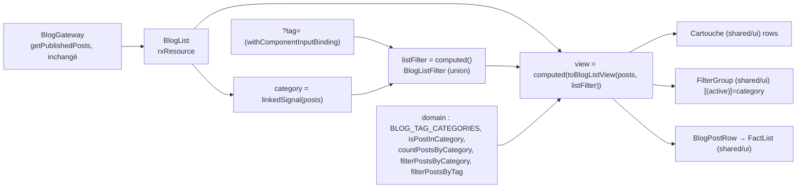

# 014 — Refonte de la liste du blog

## Description

### Contexte

Depuis la spec 012, `/projects` parle le vocabulaire du « dessin technique » de `DESIGN.md` :
sur-titre mono, `h1`, introduction, légende en cartouche, filtres soulignés avec leur compte,
études de cas (overline mono, titre, accroche, repères, lien principal, couverture cadrée).

La liste `/blog` (2 articles en production) est restée sur l'ancien gabarit :

- un en-tête sans cartouche ;
- des lignes à trois colonnes (date à gauche, texte, couverture), des pastilles de tags colorées
  et cliquables, un compteur « +N », le titre comme lien ;
- aucun filtre, sauf le `?tag=` qui arrive des liens de tags de la page article ;
- une pagination de 9 articles qui ne s'active jamais.

### Ce qui est attendu

1. **En-tête** construit comme celui de Réalisations : sur-titre « N articles », `h1` « Blog »,
   introduction, lien RSS conservé. À droite, un **cartouche « Thèmes »** à la place de la
   légende : les 5 thèmes (Stack, Sécurité, Ingénierie, Parcours, Projets) et le nombre d'articles
   de chacun.
2. **Ligne d'article** au vocabulaire des études de cas : surtitre mono « date · durée de
   lecture », titre, extrait, un repère « Sujets » en ligne mono « A · B · C » (3 premiers tags)
   qui remplace les pastilles, un lien « Lire l'article » étiré sur toute la ligne, la couverture.
3. **Filtres par thème**, comme les filtres par nature : « Tous » et les 5 thèmes toujours
   affichés, chacun avec son compte ; un thème sans article reste visible mais grisé. État local,
   sans URL. Un article appartient à un thème si au moins un de ses tags est dans la catégorie
   (`BLOG_TAGS_BY_CATEGORY`) ; il peut compter dans plusieurs thèmes.

### Hors périmètre

- La page article `/blog/:slug` (ses pastilles `BlogTagLink`, ses liens `?tag=`).
- L'admin du blog et le catalogue de tags lui-même.
- L'API : aucun champ ajouté.

### Contraintes

- Prérendu et SEO de `/blog` inchangés (route, titre, description, canonical).
- Une seule image `priority` sur la page, aucun CLS.
- WCAG AA, zéro violation axe, un seul `h1`, pas de saut de titre, cibles ≥ 44 px, clair et
  sombre (Two Registers Rule).
- Le lien `?tag=` venu de la page article continue de filtrer la liste.

### Critères d'acceptation

1. Le sur-titre, le cartouche et les filtres affichent des comptes conformes aux données ; avec
   les articles actuels et `Full-Stack` rangé dans `stack` : Stack 2, Sécurité 1, Ingénierie 0,
   Parcours 1, Projets 1.
2. Filtrer par thème n'affiche que les articles de ce thème ; l'état actif est annoncé ; un thème
   à 0 est focusable, annoncé inactif, et un clic ne change rien.
3. Chaque ligne montre surtitre, titre, extrait, repère « Sujets », lien « Lire l'article »
   (nom accessible distinct par article) et couverture ; aucun autre interactif dans la ligne.
4. `/blog?tag=X` n'affiche que les articles portant le tag X, avec le bandeau « Filtré par X ».
5. `blog/index.html` prérendu contient tous les articles et un seul `fetchpriority="high"`.

## Arbitrages du propriétaire (2026-10-07)

1. **Périmètre : la liste seule.** La page article ne change pas.
2. **En-tête** : sur-titre « N articles », `h1` « Blog », introduction, cartouche « Thèmes » (les
   5 thèmes et leur compte) à la place de la légende, lien RSS conservé. Libellés proposés :
   Stack, Sécurité, Ingénierie, Parcours, Projets.
3. **Ligne d'article** : surtitre mono « date · durée de lecture », titre, extrait, repère
   « Thèmes » « A · B · C » (3 premiers tags) à la place des pastilles, lien « Lire l'article »
   étiré, couverture. Recommandation à trancher par le plan : plus de « +N » ni de lien par tag
   dans la ligne.
4. **Filtres par thème** : 5 boutons + « Tous » toujours affichés, avec leur compte ; thème vide
   visible mais grisé (recommandation : `aria-disabled="true"`, compte 0, focusable, clic sans
   effet, pas de `disabled` natif) ; état local sans URL ; appartenance par « au moins un tag de
   la catégorie ».

### Réponses aux questions du plan (2026-10-07)

5. **`Full-Stack`** passe de `journey` à `stack` dans `BLOG_TAGS_BY_CATEGORY` (tranche B1).
6. **Libellé du repère de ligne** : « Sujets », à la place de « Thèmes » (réservé aux 5
   catégories du cartouche et des filtres).
7. **Pagination** : retirée dans cette PR ; à recréer avec une URL par page au-delà d'une
   trentaine d'articles (§ Suivi).
8. **Extractions `FilterGroup` et `FactList`** vers `shared/ui/` : validées, dans cette PR.

## Plan technique

> Front seul, aucune évolution d'API. Décision structurante : **ADR-0011** (thèmes dérivés du
> catalogue de tags, filtre local à options inactives, un seul filtre actif, groupe de filtres
> partagé). Profil présent ; validation runtime aux frontières non vérifiée (adapters purs, pas
> de bibliothèque), sans objet ici puisque le gateway ne change pas.

### 0. Faits relevés qui orientent le plan

- **La PR #171 (spec 013) est mergée** (squash, `dcd784b`, 2026-10-07 06:32) et
  `feat/refonte-blog` en part. `git diff --name-only master...origin/feat/cartes-accueil` liste
  encore ses fichiers parce qu'un squash ne relie pas l'historique, mais
  `git diff origin/feat/cartes-accueil master` est vide : les arbres sont identiques. La contrainte
  d'indépendance avec #171 est donc sans objet. Le plan peut toucher `projects/**`, et il le fait
  pour deux extractions vers `shared/ui/` (§ 1).
- **Données en production** (API, 2026-10-07) : 2 articles, 9 et 15 tags, tous du catalogue.
  Comptes par thème avec la règle « au moins un tag », catalogue actuel : Stack 2, Sécurité 1,
  Ingénierie 0, Parcours 2, Projets 1 ; l'article sur le chiffrement comptait dans « Parcours »
  par son seul tag `Full-Stack`. **Après le déplacement de `Full-Stack` dans `stack`
  (arbitrage 5)** : chiffrement → Stack, Sécurité, Projets ; reconversion → Stack, Parcours.
  Comptes attendus : **Stack 2, Sécurité 1, Ingénierie 0, Parcours 1, Projets 1**. 3 premiers tags : « Chiffrement · AES-256-GCM · PBKDF2 » et
  « Angular · NestJS · Reconversion ».
- **Consommateurs vérifiés** :
  - `BlogTagLink` : `blog-detail.ts` (pastilles de la page article). **Conservé.**
  - `blog-tag-palette.ts` : `BlogTagLink` et `admin/…/admin-tags-selector.ts`. **Conservé.**
  - `AppTag` : `admin-blog.ts`, `admin-project-row.ts`, `analytics-entity-list.ts`. **Conservé**
    (la liste du blog cesse de l'importer).
  - `AppPaginator` (`shared/ui/paginator.ts`) : **un seul consommateur, `blog-list.ts`**. L'admin
    pagine avec ses utilities `admin-pager-btn`, pas avec ce composant. Il devient mort (§ 6.7).
  - `BLOG_TAGS_BY_CATEGORY` → `AVAILABLE_BLOG_TAGS` (aplatissement dans l'ordre des catégories)
    → `admin-blog-form.ts` → `AdminTagsSelector`. Effet du déplacement de `Full-Stack` dans
    l'admin : la puce change seulement de **position** (elle quitte le bloc Parcours, en fin de
    liste, pour la fin du bloc Stack). Couleur inchangée (`blogTagPalette` ne distingue que
    catalogue / libre), valeur stockée inchangée (chaîne), aucun article à resaisir. Aucun test
    ne dépend de cet ordre (`admin-tags-selector.spec.ts` fournit ses propres tags ;
    `blog-tag.model.spec.ts` ne vérifie que total et unicité, et n'énumère pas `Full-Stack`).
  - `ProjectFactList` : `project-case-study.ts`, `featured-project-card.ts`.
    `ProjectKindFilters` : `projects.ts`.
- **`blog-list.ts` lit les articles par `toSignal(..., { initialValue: [] })`** : « Aucun article
  pour le moment. » s'affiche pendant le chargement client, et une erreur HTTP fait lever le
  signal à la lecture (pas d'état d'erreur). `/projects` utilise `rxResource` + `hasValue()` +
  état d'erreur avec « Réessayer ».
- **`[priority]="$first"` ne peut pas suivre un filtre.** `NgOptimizedImage` interdit tout
  changement de `priority` après l'initialisation (`assertNoPostInitInputChange`, liste
  `['ngSrcset', 'width', 'height', 'priority', 'fill', …]`, vérifié dans
  `node_modules/@angular/common/fesm2022`, erreur en dev). Avec `track post.slug`, une ligne qui
  devient première sous un filtre changerait son `priority` : NG02953. Le défaut existe déjà en
  latence avec `?tag=` + pagination.
- **Précédents réutilisés** : `toProjectsView` (presenter en fonction pure), `PROJECT_KINDS`
  (constante ordonnée dont le type est dérivé), `project-kind-copy.ts` (copies en `Record`),
  `filter` en `linkedSignal` de `projects.ts`, `Cartouche` et son API `rows`, l'en-tête de
  `projects.ts`, le lien étiré de `ProjectGridCard` (nom en `sr-only`), le cadre de
  `ProjectCover` (`rounded-md border-line-strong bg-surface`), `readingTimeMinutes`, l'état
  d'erreur de `/projects` et le `role="status"` `sr-only` du compte affiché.

### 1. Architecture



- **Landmarks** : aucun nouveau. La page reste `<section aria-labelledby="blog-heading">` dans le
  `main` du shell ; l'en-tête est un `<header>` imbriqué dans la `section` (pas de rôle
  `banner`). Le cartouche est un `role="group"` (hôte de `Cartouche`), le groupe de filtres aussi.
  Pas de `nav` : les filtres ne naviguent pas.
- **Titres** : `h1` « Blog » (unique), puis `h2` pour le titre de chaque article. La page n'a
  qu'une liste, sans sous-section : pas de `h2` de section, donc pas de `h3`. Le titre du
  cartouche est un `p` (règle de `Cartouche`).
- **Frontière presenter / vue.** `blog-list.ts` dérive aujourd'hui filtre, comptes, libellés et
  pagination dans le composant, et `BlogPostRow` calcule lui-même temps de lecture et tags
  visibles. Toute la dérivation sort dans une **fonction pure**
  `toBlogListView(posts, filter): BlogListView` (`application/blog-list-view.ts`), sur le modèle
  de `toProjectsView` : ni état ni DOM, testée sans TestBed. Ce n'est ni un store ni une facade.
  La page garde la glue : `rxResource`, l'input `tag`, le signal `category`, `listFilter`,
  `view`, `retry()`. `BlogPostRow` devient purement présentationnel (un `input` de vue, aucun
  `computed`).
- **Décomposition et partage avec Réalisations** :

  | Unité | Où | Pourquoi |
  |---|---|---|
  | `Cartouche` | `shared/ui/` (existant, inchangé) | Le cartouche « Thèmes » est un `Cartouche` avec `rows` (`label` = thème, `value` = « N articles ») : aucune nouvelle structure. |
  | `FilterGroup` | `shared/ui/filter-group.ts` (**nouveau**, extrait de `ProjectKindFilters`) | Structure de plusieurs éléments réutilisée par 2 features (CLAUDE.md, Tailwind v4). Générique sur la valeur, option `disabled` facultative. `/projects` l'adopte, `ProjectKindFilters` est supprimé. |
  | `FactList` | `shared/ui/fact-list.ts` (**déplacé** depuis `projects/…/project-fact-list.ts`) | Le repère « Sujets » de la ligne est exactement un repère d'étude de cas (`dl`, libellé mono, traits `line`). 3 consommateurs : étude de cas, carte de la home, ligne d'article. |
  | En-tête de page | dupliqué volontairement | Gabarit propre à chaque page (classes du `h1`, grille avec le cartouche) : le factoriser créerait un composant à slots pour 2 pages, dont les contenus divergent (RSS, introduction générée ou non). |
  | Cadre de couverture | dupliqué volontairement | `ProjectCover` porte un ratio 16/10, un `alt` descriptif, un repli sans image et un tampon de nature ; la couverture d'article est en 1200/630, décorative (`alt=""`), sans repli ni tampon. Seules les classes du `figure` se ressemblent. À extraire en `shared/ui/` si un troisième consommateur apparaît. |
  | Lien étiré « Lire l'article » | dupliqué volontairement | Un seul élément `a`, 4ᵉ site de la même liste de classes (`ProjectGridCard`, `FeaturedProjectCard`, `OfferCard`). Le passage en `@utility` (ADR-0003) des 4 sites est un refactor transverse, hors de cette spec (§ Risques). |

  Les fonctions et copies du blog (`blog-list-view.ts`, `blog-list-copy.ts`, domaine) restent
  dans `features/blog/` : aucune importation `blog` ↔ `projects`.

### 2. Fichiers à créer / modifier

**Domaine (`features/blog/domain/`)**

- `models/blog-tag.model.ts` (+ spec) — **modifié** : `BLOG_TAG_CATEGORIES` (constante ordonnée),
  types `BlogTagCategory` (dérivé), `BlogCategoryFilter`, `BlogCategoryCounts` ; **`Full-Stack`
  déplacé de `journey` vers `stack`** dans `BLOG_TAGS_BY_CATEGORY` (arbitrage 5), avec un cas
  `['Full-Stack', 'stack']` ajouté à l'`it.each` de `blogTagCategory`. `AVAILABLE_BLOG_TAGS` et
  `blogTagCategory` inchangés dans leur code.
- `is-post-in-category.ts` (+ spec) — **créé** : vrai si au moins un tag de l'article est rangé
  dans la catégorie.
- `count-posts-by-category.ts` (+ spec) — **créé** : compte par catégorie, un article compté une
  fois par catégorie, 0 pour une catégorie absente.
- `filter-posts-by-category.ts` (+ spec) — **créé** : `'all'` rend la liste telle quelle.
- `filter-posts-by-tag.ts` (+ spec) — **créé** : égalité exacte sur le tag (comportement actuel de
  `blog-list.ts`, sorti du composant).

**Application (`features/blog/application/`)**

- `blog-list-copy.ts` (+ spec) — **créé** : libellés des filtres, titre et référence du
  cartouche, libellé du repère, libellé du lien, `articleCountLabel`, `readingTimeLabel`,
  `readLinkContext` (précédent `project-kind-copy.ts`).
- `blog-list-view.ts` (+ spec) — **créé** : `toBlogListView`, types `BlogListFilter`,
  `BlogListView`, `BlogPostRowView`.
- `blog-list.ts` (+ spec) — **modifié** : `rxResource`, état d'erreur, en-tête à cartouche,
  `FilterGroup` ou bandeau `?tag=`, `ul` de lignes, statut `sr-only`, sans pagination.
- `components/blog-post-row.ts` (+ spec) — **modifié** : entrée `BlogPostRowView`, surtitre, repère
  via `FactList`, lien « Lire l'article » étiré, cadre de couverture ; retrait de `BlogTagLink`,
  `AppTag`, du « +N » et des `computed`.
- `components/blog-tag-link.ts`, `blog-tag-palette.ts` — **inchangés** (page article, admin).

**Partagé (`shared/ui/`)**

- `filter-group.ts` (+ spec) — **créé** (extrait de `ProjectKindFilters`, + option inactive).
- `fact-list.ts` (+ spec) — **créé par déplacement** de `projects/…/project-fact-list.ts` (+ spec),
  type `Fact` (remplace `ProjectFact`).
- `paginator.ts` (+ spec) — **supprimés** (plus aucun consommateur).

**Réalisations et home (adoption des primitives partagées, comportement inchangé)**

- `projects/application/components/project-kind-filters.ts` (+ spec) — **supprimés** ; leurs cas
  migrent dans `filter-group.spec.ts`.
- `projects/application/components/project-fact-list.ts` (+ spec) — **supprimés** (déplacés).
- `projects/application/projects.ts` — `<app-filter-group>` à la place de
  `<app-project-kind-filters>`.
- `projects/application/projects-view.ts` — `KindFilterOption` remplacé par
  `FilterOption<ProjectKindFilter>` ; `CaseStudyView.facts: readonly Fact[]`.
- `projects/application/project-facts.ts`, `featured-project-view.ts` — `ProjectFact` remplacé par
  `Fact`.
- `projects/application/components/project-case-study.ts`, `featured-project-card.ts` —
  `<app-fact-list>` à la place de `<app-project-fact-list>`.
- Specs aux sélecteurs renommés : `projects.spec.ts`, `project-case-study.spec.ts`,
  `featured-project-card.spec.ts`, `home/application/home-projects.spec.ts`
  (`project-fact-*` → `fact-*`, `project-kind-filter*` → `filter-group` / `filter-option*`).

**Documentation**

- `DESIGN.md` — sections « Groupe de filtres » et « Liste de repères » (shared), « Ligne
  d'article » ; mise à jour de « Étude de cas », de la carte de la home et de la note « Tags du
  blog » (pastilles sur la page article seulement).
- `.claude/project-profile.md` — retirer `app-paginator` de la liste des composants à forte
  interaction tactile.

### 3. Modèles de données

Tous immuables (`readonly`, `ReadonlyArray`), `type` et unions (profil).

```ts
// domain/models/blog-tag.model.ts
export const BLOG_TAG_CATEGORIES = ['stack', 'security', 'engineering', 'journey', 'projects'] as const;
export type BlogTagCategory = (typeof BLOG_TAG_CATEGORIES)[number];
export type BlogCategoryFilter = BlogTagCategory | 'all';
export type BlogCategoryCounts = Readonly<Record<BlogTagCategory, number>>;
```

```ts
// shared/ui/filter-group.ts
export type FilterOption<T extends string> = {
  readonly value: T;
  readonly label: string;
  readonly count: number;
  readonly disabled?: boolean; // absent = actif ; /projects ne le pose jamais
};

// shared/ui/fact-list.ts
export type Fact = { readonly label: string; readonly value: string };
```

```ts
// application/blog-list-view.ts
export type BlogListFilter =
  | { readonly by: 'tag'; readonly tag: string }
  | { readonly by: 'category'; readonly category: BlogCategoryFilter };

export type BlogPostRowView = {
  readonly slug: string;
  readonly title: string;
  readonly excerpt: string;
  readonly publishedAt: string | null;   // ISO, formaté par DatePipe dans le gabarit
  readonly readingTime: string;          // « 5 min de lecture » (U+00A0)
  readonly facts: readonly Fact[];       // [] ou [{ label: 'Sujets', value: 'A · B · C' }]
  readonly coverImage: string;           // '' = pas de couverture
  readonly linkContext: string;          // «  : <titre> » (U+00A0), en sr-only
  readonly priority: boolean;            // vrai pour le 1er article de la liste complète
};

type BlogListView = {
  readonly total: number;
  readonly themes: readonly CartoucheRow[];                      // 5 lignes, ordre BLOG_TAG_CATEGORIES
  readonly filters: readonly FilterOption<BlogCategoryFilter>[]; // 'all' + 5, toujours 6
  readonly visibleCount: number;
  readonly rows: readonly BlogPostRowView[];
};

export function toBlogListView(posts: readonly BlogPost[], filter: BlogListFilter): BlogListView;
```

- **Exhaustivité au compilateur** : libellés en `Record<BlogCategoryFilter, string>` ;
  `BLOG_TAGS_BY_CATEGORY: Record<BlogTagCategory, …>` existe déjà. Ajouter une catégorie à
  `BLOG_TAG_CATEGORIES` casse la compilation tant que ses tags et son libellé manquent.
- **Exclusivité tag / thème au compilateur** : `BlogListFilter` est une union discriminée ; aucune
  forme ne porte les deux à la fois (ADR-0011 §5).
- **Libellés** (`blog-list-copy.ts`) : `all` « Tous », `stack` « Stack », `security` « Sécurité »,
  `engineering` « Ingénierie », `journey` « Parcours », `projects` « Projets ». Cartouche : titre
  « Thèmes », référence « Articles par thème ». Repère : « Sujets ». Lien : « Lire l'article ».
  `articleCountLabel(n)` = `${n}\u00a0article` + `s` si `n > 1` (0 et 1 au singulier) ;
  `readingTimeLabel(m)` = `${m}\u00a0min de lecture` ; `readLinkContext(t)` = `\u00a0: ${t}`.
  Aucune espace insécable brute dans le TS : toujours l'échappement `\u00a0`.
- Aucun changement de `BlogPost`, du gateway ni de l'adapter.

### 4. Réactivité et dérivation

- `postsResource = rxResource({ stream: () => gateway.getPublishedPosts() })` remplace
  `toSignal`. `posts = computed(() => postsResource.hasValue() ? postsResource.value() : [])`,
  `failed = computed(() => postsResource.status() === 'error')`. Même requête, même transfer
  cache (le prérendu attend la ressource, comme `/projects`).
- `tag = input<string | null>(null)` inchangé (`?tag=`, `withComponentInputBinding()`).
- `category = linkedSignal<readonly BlogPost[], BlogCategoryFilter>({ source: posts, computation })`
  : `'all'` au départ ; à chaque nouvelle liste, garde la valeur précédente si son compte reste
  > 0, sinon `'all'` (précédent `projects.ts`). Un thème actif est donc toujours un thème non
  vide.
- `listFilter = computed<BlogListFilter>(() => tag() ? { by: 'tag', tag } : { by: 'category', category: category() })`.
- `view = computed(() => toBlogListView(posts(), listFilter()))`, lu une fois par
  `@let v = view();`. Aucune méthode ni getter dans les gabarits.
- `toBlogListView` :
  - `total`, `themes`, `filters` se calculent sur **tous** les articles
    (`countPostsByCategory`), quel que soit le filtre ;
  - `filters` : `'all'` (compte `total`, jamais `disabled`) puis les 5 catégories dans l'ordre de
    `BLOG_TAG_CATEGORIES`, `disabled: true` si le compte vaut 0 ;
  - lignes visibles : `filterPostsByTag` sous `by: 'tag'`, `filterPostsByCategory` sous
    `by: 'category'` ; un thème demandé à 0 (appelant hors page) est traité comme `'all'`, pour
    que la fonction reste totale (même redondance assumée que `toProjectsView`) ;
  - `priority` : vrai pour l'article d'indice 0 de la liste **complète** (ordre de l'API), faux
    pour tous les autres, sous tout filtre. Une ligne ne change donc jamais de `priority` après
    création (NG02953, § 0) ;
  - `facts` : `[{ label: 'Sujets', value: tags.slice(0, 3).join(' · ') }]`, ou `[]` sans tag ;
  - `readingTime` : `readingTimeLabel(readingTimeMinutes(contentMarkdown))`.
- Plus de `first`/`linkedSignal` de page ni de `PAGE_SIZE` (§ 6.7).

### 5. État partagé et coordination

- **Signals locaux** dans la page. Aucun store (rien n'est partagé hors de l'écran), aucune facade
  (la page consomme `BlogGateway` par `inject`, pas de use case passthrough). Presenter : la
  fonction pure `toBlogListView`.
- **Gateway** : `BlogGateway` / `HttpBlogGateway` inchangés.
- `FilterGroup` expose `active = model.required<T>()` : la page lie son `linkedSignal`
  (`[(active)]="category"`), l'enfant l'écrit au clic, ce qui justifie le `model()`. Tous les
  autres composants n'ont que des `input()`.

### 6. UI de la page `/blog`

Direction « dessin technique » (`DESIGN.md`) : traits `line`/`line-strong` décoratifs, mono pour
les métadonnées (date, durée, repère, comptes), une seule teinte d'accent. Tous les tokens
existent déjà ; aucun nouveau couple de couleurs texte/fond n'est introduit, donc aucun ratio à
recalculer.

1. **En-tête** : même grille que `/projects`,
   `grid gap-10 pt-18 pb-14 md:pt-26 md:pb-18 lg:grid-cols-[minmax(0,1fr)_23.75rem] lg:items-end lg:gap-16`.
   À gauche : sur-titre mono `text-primary` `articleCountLabel(total)` (`data-testid="blog-count"`,
   `animate-fade-up`), `h1` « Blog » **sans animation** (inchangé, test existant), introduction
   actuelle inchangée (texte fixe, jamais faux), lien RSS inchangé (`rss-link`, `min-h-11`). À
   droite : `<app-cartouche title="Thèmes" reference="Articles par thème" [rows]="v.themes" />`
   (`data-testid="blog-themes"`, `animate-fade-up [animation-delay:200ms]`). Les lignes du
   cartouche (libellé mono majuscule, valeur « 2 articles ») sont celles de l'API `rows`
   existante : la valeur porte son unité en clair, sans `sr-only`. Cartouche de données, hors de
   la limite « un cartouche décoratif par écran ».
2. **États** :
   - `failed()` : bloc `role="alert"` (`blog-error`) « Les articles n'ont pas pu être chargés.
     Vérifiez votre connexion, puis réessayez. » + `app-button` « Réessayer » (`reload()`),
     comme `/projects` ; ni filtres ni liste.
   - chargé, `total === 0` : « Aucun article pour le moment. » (`blog-empty`), sans filtres.
   - chargé, `by: 'tag'` et aucun article : « Aucun article avec ce tag. » (`blog-empty-tag`).
   - Pendant le chargement : ni message vide ni filtres (rendus sous `hasValue()`).
3. **Filtre** (sous l'en-tête, un seul des deux) :
   - sans `tag` : `<app-filter-group label="Filtrer par thème" [options]="v.filters" [(active)]="category" />` ;
   - avec `tag` : le bandeau actuel (`tag-filter-banner`, `tag-filter-clear`, lien `/blog`,
     `aria-label` « Retirer le filtre X » qui contient le libellé visible), déplacé de l'en-tête
     vers cet emplacement.
   - Dans les deux cas, `<p role="status" class="sr-only" data-testid="blog-visible-count">`
     « N article(s) affiché(s) » (`visibleCount`) annonce le résultat d'un changement. Le focus
     reste sur le bouton pressé.
4. **`FilterGroup`** (`shared/ui/`, extrait de `ProjectKindFilters`, mêmes classes) : hôte
   `block overflow-x-auto` ; `div role="group" [attr.aria-label]="label()"`
   (`data-testid="filter-group"`) ; un `button type="button"` par option
   (`filter-option`, `filter-option-label`, `filter-option-count`),
   `[attr.aria-pressed]="option.value === active()"`,
   `[attr.aria-disabled]="option.disabled ? 'true' : null"`, `(click)="select(option)"` où
   `select` n'écrit `active` que si l'option n'est pas inactive. Style souligné inchangé
   (`border-b-2 … aria-pressed:border-primary aria-pressed:font-semibold aria-pressed:text-foreground`,
   `min-h-11`), plus `aria-disabled:cursor-not-allowed aria-disabled:opacity-50` et neutralisation
   du survol (`aria-disabled:hover:text-muted`), comme l'état désactivé des boutons de
   `DESIGN.md`. Le bouton inactif reste dans l'ordre de tabulation, garde son focus visible et est
   annoncé « bascule, non enfoncé, indisponible » avec son compte 0. L'opacité n'est pas le seul
   porteur : le compte « 0 » le dit aussi. Contraste : un composant inactif est exempté du critère
   1.4.3 ; `aria-disabled` est ce qui le déclare inactif, il est donc indispensable et testé.
5. **Liste** : `ul role="list" data-testid="blog-posts" class="border-t border-line-strong"`, un
   `li` par `v.rows`, `track row.slug`, `<app-blog-post-row [post]="row" />`.
6. **`BlogPostRow`** (`input.required<BlogPostRowView>()`, host `block`,
   `[class.animate-fade-up]` = `!post().priority`, inchangé) :
   - `article class="group relative grid gap-5 border-b border-line py-10 lg:grid-cols-[minmax(0,1fr)_20rem] lg:items-start lg:gap-12"` ;
   - colonne texte : surtitre `p` mono `text-xs text-muted` (`post-overline`) =
     `<time [attr.datetime]>{{ date | date: 'd MMM y' }}</time> · <span data-testid="reading-time">…</span>`
     (date et séparateur omis si `publishedAt` est `null`) ; `h2` du titre (`post-title`,
     `text-[clamp(1.375rem,2.3vw,1.875rem)] font-bold leading-[1.18] tracking-tight text-balance`,
     `transition-colors group-hover:text-primary`), **texte simple, plus un lien** ; extrait
     `mt-3 max-w-[62ch] text-muted` (`post-excerpt`) ; `@if (facts.length)`
     `<app-fact-list class="mt-5 max-w-[62ch]" [facts]="facts" />` ; lien
     `a [routerLink]="['/blog', slug]"` (`post-link`) « Lire l'article » +
     `<span class="sr-only">{{ linkContext }}</span>` + icône `arrow-right` (`AppIcon`, décorative),
     classes du lien de `ProjectGridCard` (`mt-1 inline-flex min-h-11 items-center gap-1.5 text-sm font-semibold text-primary after:absolute after:inset-0 hover:underline`) : un seul
     interactif, toute la ligne est cliquable, nom accessible distinct par article ;
   - couverture si `coverImage` : `figure relative -order-1 aspect-[1200/630] w-full overflow-hidden rounded-md border border-line-strong bg-surface lg:order-none`
     (au-dessus en mobile, à droite en grand écran), `img [ngSrc] fill alt="" [priority]="post().priority" class="object-cover"`.
     Pas de `sizes` (aucun `IMAGE_LOADER` ni `ngSrcset`, même retrait qu'en spec 012), pas de
     zoom au survol (raccord avec la grille de Réalisations, où seul le titre réagit). `alt=""`
     conservé : l'image est décorative, le titre et le lien nomment l'article.
   - Plus de pastilles, de « +N », de lien par tag : le `?tag=` reste accessible depuis la page
     article, qui affiche tous les tags (arbitrage 3, recommandation retenue).
7. **Pagination retirée.** Avec 2 articles, `PAGE_SIZE` 9 ne s'active pas ; la pagination est
   purement client (seuls les 9 premiers articles seraient dans le HTML prérendu), et elle
   obligerait à réinitialiser la page à chaque filtre. Tous les articles sont rendus ; les
   couvertures hors première sont en lazy natif. `AppPaginator` n'a plus de consommateur et est
   supprimé avec sa spec (pas de code mort). Retour prévu au-delà d'une trentaine d'articles,
   avec une URL par page (§ Suivi, arbitrage 7).
8. **Une seule `priority`** : la couverture du premier article de la liste complète (§ 4). Sous un
   filtre qui l'exclut, aucune image n'est prioritaire : le changement est client, après le LCP
   du HTML prérendu (état « Tous »). Sur `/blog?tag=X` à l'arrivée, idem si le premier article ne
   porte pas X.

### 7. Prérendu, SEO, hydratation

- `RenderMode.Prerender` de `blog`, `title` et `data.seo` de la route : inchangés. Le HTML
  prérendu (état « Tous », sans tag) contient l'en-tête, le cartouche, les 6 boutons (Ingénierie
  avec `aria-disabled="true"`), toutes les lignes et un seul `fetchpriority="high"`. Pas de
  `@defer` : la liste est le contenu principal de la route.
- `?tag=` : comportement d'hydratation inchangé par rapport à aujourd'hui (le HTML servi est
  celui de `/blog`, l'hydratation applique le tag). Le canonical vient de `data.seo.url`
  (`/blog`, sans query) : pas de nouvelle URL indexable.

### 8. Cross-platform et bibliothèques

Aucune cible native. Aucune dépendance ajoutée (`NgOptimizedImage`, `DatePipe`, `rxResource`,
composants génériques Angular).

### Tranches

Une PR front, gates du Dockerfile (`pnpm install --frozen-lockfile`,
`pnpm run build --configuration production`) + `pnpm test` + `pnpm lint`. Chaque tranche laisse
la suite verte ; les tests existants d'un comportement retiré sont remplacés dans la tranche qui
le retire, pas avant.

- **Tranche B1 — l'en-tête dit combien d'articles, et de quels thèmes** : `BLOG_TAG_CATEGORIES`
  et types, déplacement de `Full-Stack` dans `stack` (cas `['Full-Stack', 'stack']` dans
  l'`it.each` de `blogTagCategory`, RED avant le déplacement ; les autres cas restent verts), `isPostInCategory` et
  `countPostsByCategory` (purs, `it.each` : tag libre ignoré, article multi-thème compté une fois
  par thème, une fois seulement même avec 3 tags du même thème, catégorie absente à 0 ; un cas
  reprend les tags des 2 articles de prod et attend Stack 2, Sécurité 1, Ingénierie 0,
  Parcours 1, Projets 1),
  `blog-list-copy.ts` (`articleCountLabel` 0/1/2, libellés), `toBlogListView` première version
  (`total`, `themes` dans l'ordre, valeurs « N article(s) »). Page : `rxResource`, état d'erreur
  avec « Réessayer », message vide sous `hasValue()`, en-tête en grille avec sur-titre, `h1`,
  introduction, RSS et cartouche « Thèmes ». Lignes, pagination et `?tag=` inchangés.
- **Tranche B2 — chaque article se lit comme une étude de cas** : déplacement de
  `ProjectFactList` en `shared/ui/fact-list.ts` (type `Fact`, sélecteurs `fact-*` renommés dans
  les specs de Réalisations et de la home : RED, puis déplacement), `filterPostsByTag`,
  `toBlogListView.rows` (`readingTime`, `facts` à 3 tags, `[]` sans tag, `linkContext`,
  `priority` du premier article de la liste complète, sous tag compris), `BlogPostRow` en vue
  (surtitre, `h2` texte, extrait, repère, lien étiré « Lire l'article » avec nom distinct, cadre
  de couverture, `alt=""`, aucun autre lien, plus de « +N »). Page : les lignes viennent de
  `v.rows`, `?tag=` passe par `BlogListFilter`. La pagination reste (elle découpe `v.rows`).
  Axe sur une ligne.
- **Tranche B3 — tous les articles sur une seule page** : `ul role="list"` + `li`, retrait de la
  pagination (`PAGE_SIZE`, `first`, `onPageChange`, test « revient à la première page »),
  suppression de `shared/ui/paginator.ts` + spec, mise à jour du profil. 12 articles → 12 lignes,
  une seule `img` `priority`.
- **Tranche B4 — filtrer par thème** : `filterPostsByCategory` (pur, `it.each` sur les 6
  valeurs, article multi-thème présent dans chacun de ses thèmes), `toBlogListView.filters` (6
  options, ordre, `disabled` à 0, « Tous » jamais inactif) et `visibleCount` (thème à 0 demandé
  → `'all'`). Extraction de `FilterGroup` en `shared/ui/` depuis `ProjectKindFilters` avec
  l'option inactive (`aria-pressed`, `aria-disabled`, clic sans effet, toujours focusable,
  `min-h-11`) ; adoption par `/projects` et suppression de `ProjectKindFilters` + spec
  (sélecteurs `filter-*` renommés dans `projects.spec.ts` : RED, puis extraction). Page :
  `category` en `linkedSignal`, groupe de filtres ou bandeau `?tag=` (jamais les deux), statut
  `sr-only`, filtres masqués si `total === 0`, « Aucun article avec ce tag. ». Axe avec un filtre
  actif et avec une option inactive. Mise à jour de `DESIGN.md`.

### Risques et inconnues

- **Thèmes gonflés par les tags transverses** (hypothèse couplée de la règle « au moins un tag ») :
  `Angular` met tout article technique dans « Stack », et c'est désormais vrai aussi de
  `Full-Stack`. La règle suppose un catalogue rangé pour la navigation ; ranger un tag est
  maintenant un choix éditorial public (ADR-0011).
- **`priority` et `NgOptimizedImage`** : le contrat « premier article de la liste complète » est
  ce qui évite NG02953 sous filtre. `qa` doit le tester en filtrant vers un article non premier
  (la ligne existante garde `priority` faux, aucune erreur).
- Le libellé « Sujets » du repère (arbitrage 6) lève la confusion entre les 3 premiers tags d'une
  ligne et les 5 thèmes du filtre ; sous « Stack », l'article sur le chiffrement montre
  « Sujets : Chiffrement · AES-256-GCM · PBKDF2 », ce qui reste juste.

### Suivi (hors périmètre de la spec 014)

- **Pagination par URL** : à recréer au-delà d'une trentaine d'articles, une URL par page
  (prérendue, indexable, canonical par page), en spec dédiée (arbitrage 7).
- **`@utility link-stretched`** (ADR-0003) pour les 4 liens étirés (`ProjectGridCard`,
  `FeaturedProjectCard`, `OfferCard`, ligne d'article).

### Questions pour Julien

Aucune : les 4 questions du plan sont tranchées (Arbitrages 5 à 8).

## Plan de test

### Tranche B1 — l'en-tête dit combien d'articles, et de quels thèmes

Couverture : le catalogue (`BLOG_TAG_CATEGORIES`, `Full-Stack` dans `stack`), `isPostInCategory`,
`countPostsByCategory`, `blog-list-copy.ts` (B1 : `articleCountLabel`, libellés) et
`toBlogListView` (première version : `total`, `themes`) en TS pur, sans TestBed. La page
(`blog-list.spec.ts`, TestBed, `setInput`) vérifie le câblage : sur-titre, `h1`, introduction,
RSS et cartouche dans le même `header`, comptes du cartouche issus des données, `rxResource`
(chargement sans message vide, liste vide sous `hasValue()`, erreur avec « Réessayer » qui
relance). `Cartouche` n'a pas de nouveau spec : son rendu est déjà couvert par
`shared/ui/cartouche.spec.ts`, la page n'en vérifie que les entrées. Lignes, pagination, `?tag=`,
`rows`/`filters`/`visibleCount` de la vue : hors B1, non testés.

Données de test : nouveau builder `features/blog/testing/blog-post-builders.ts`
(`makeBlogPost(overrides)`, défauts identiques à l'ancien `post()` local de `blog-list.spec.ts` ;
`productionPosts()` et `PRODUCTION_POST_TAGS` = les 2 articles de production, tags relevés dans
`public/rss.xml` : 15 tags pour le chiffrement, 9 pour la reconversion). Les autres copies locales
de `post()` (`blog-post-row.spec.ts`, `blog-detail.spec.ts`, `http-blog.gateway.spec.ts`,
`adjacent-posts.spec.ts`, `admin-blog-form.spec.ts`) ne sont pas migrées dans B1 : dette à solder
quand ces suites seront touchées (B2 pour `blog-post-row.spec.ts`).

Sweeps :

- Ancien sur-titre « N article(s) » sans insécable et sélecteur `header p` : seul
  `blog-list.spec.ts` l'assertait. Test recalibré (changement de contrat, pas une adaptation
  mécanique) : sélecteur `blog-count`, valeurs ` `, cas `0` ajouté.
- `Full-Stack`, `BLOG_TAGS_BY_CATEGORY`, `AVAILABLE_BLOG_TAGS`, « Aucun article » dans
  `src/**/*.spec.ts` (aucun dossier `e2e`) : `blog-tag-palette.spec.ts` parcourt le catalogue sans
  dépendre de l'ordre ni de la catégorie de `Full-Stack` ; `admin-tags-selector.spec.ts` fournit
  ses propres tags. Aucune autre suite à adapter.
- État seedé : `toSignal(..., { initialValue: [] })` → `rxResource`. Les tests existants de
  `blog-list.spec.ts` passent par `render()` (`detectChanges` + `whenStable` + `detectChanges`).

Adaptation mécanique : `blog-list.spec.ts` — 8 tests existants (ligne par article, host, titre
sans animation, filtre `?tag=`, bandeau, absence de bandeau, retour en première page, RSS) passés
en `async` + `render()`, `post()` local remplacé par `makeBlogPost()` (mêmes défauts), aucune
valeur attendue modifiée.

Contrats fixés par ce RED :

- **Modèle** (`domain/models/blog-tag.model.ts`) : `BLOG_TAG_CATEGORIES` vaut
  `['stack', 'security', 'engineering', 'journey', 'projects']` et suit l'ordre des clés de
  `BLOG_TAGS_BY_CATEGORY` ; `BlogCategoryCounts` exporté ; `blogTagCategory('Full-Stack')` =
  `'stack'`.
- **`isPostInCategory(post: BlogPost, category: BlogTagCategory): boolean`**
  (`domain/is-post-in-category.ts`).
- **`countPostsByCategory(posts: readonly BlogPost[]): BlogCategoryCounts`**
  (`domain/count-posts-by-category.ts`) : les 5 clés toujours présentes.
- **`blog-list-copy.ts`** : `articleCountLabel(n)` (`0 article`, `1 article`,
  `2 articles`) ; `BLOG_CATEGORY_FILTER_LABELS: Record<BlogCategoryFilter, string>` (nom
  choisi par ce RED, sur le modèle de `PROJECT_KIND_FILTER_LABELS`), d'où `BlogCategoryFilter`
  exporté par le modèle.
- **`toBlogListView(posts, filter: BlogListFilter)`** (`application/blog-list-view.ts`, exporte
  `BlogListFilter`) : `total` = tous les articles ; `themes: readonly CartoucheRow[]` =
  5 lignes `{ label: <libellé du thème>, value: articleCountLabel(compte) }`, ordre
  `BLOG_TAG_CATEGORIES`, calculées sur tous les articles même sous `{ by: 'tag' }`.
- **Page** (`blog-list.ts`), `data-testid` : `blog-count` (sur-titre, texte exact
  `articleCountLabel(total)`), `blog-title` (`h1#blog-heading`, unique), `blog-intro` (texte
  actuel), `rss-link`, `blog-themes` (hôte de `app-cartouche`, groupe nommé « Thèmes », référence
  « Articles par thème », lignes `cartouche-label`/`cartouche-value`), tous dans le même
  `header` de la `section[aria-labelledby="blog-heading"]` ; `blog-empty` « Aucun article pour le
  moment. » seulement une fois la liste chargée ; `blog-error` `role="alert"`, premier `p` =
  « Les articles n'ont pas pu être chargés. Vérifiez votre connexion, puis réessayez. », un
  `button` « Réessayer » qui relance le gateway.

**`domain/models/blog-tag.model.spec.ts`** (TS pur, +3 tests)

| Test | Scénario | Assertions clés |
|---|---|---|
| `blogTagCategory` (`it.each`, + 1 cas) | `Full-Stack` | `'stack'` (les 7 autres cas inchangés) |
| ordre des catégories | constante | `toEqual` des 5 catégories |
| ordre du catalogue | clés de `BLOG_TAGS_BY_CATEGORY` | égales à `BLOG_TAG_CATEGORIES` |

**`domain/is-post-in-category.spec.ts`** (TS pur, 13 tests, nouveau)

| Test | Scénario | Assertions clés |
|---|---|---|
| appartenance (`it.each` × 8) | tag de la catégorie, autre catégorie, tags libres, aucun tag, libre + catalogue, tag en dernier, `Full-Stack` → `stack` / `journey` | `true`/`false` exact |
| article multi-thème (`it.each` × 5) | `Angular` + `Reconversion` | vrai pour `stack` et `journey`, faux ailleurs |

**`domain/count-posts-by-category.spec.ts`** (TS pur, 8 tests, nouveau)

| Test | Scénario | Assertions clés |
|---|---|---|
| comptes (`it.each` × 7) | aucun article, sans tag, tags libres, libre + catalogue, 3 thèmes, 3 tags d'un même thème, 2 articles partageant `stack` | `toEqual` des 5 clés (catégorie absente à 0, une fois par thème) |
| articles de production | `productionPosts()` | Stack 2, Sécurité 1, Ingénierie 0, Parcours 1, Projets 1 |

**`application/blog-list-copy.spec.ts`** (TS pur, 5 tests, nouveau)

| Test | Scénario | Assertions clés |
|---|---|---|
| compte (`it.each` × 4) | 0, 1, 2, 12 | `0 article`, `1 article`, `2 articles`, `12 articles` |
| libellés | `BLOG_CATEGORY_FILTER_LABELS` | golden `toEqual` (Tous, Stack, Sécurité, Ingénierie, Parcours, Projets) |

**`application/blog-list-view.spec.ts`** (TS pur, 8 tests, nouveau)

| Test | Scénario | Assertions clés |
|---|---|---|
| total (`it.each` × 3) | 0, 1, 3 articles (tag libre et sans tag compris) | `total` exact |
| thèmes de production | `productionPosts()` | golden `toEqual` des 5 `CartoucheRow` |
| thèmes ordonnés (`it.each` × 3) | aucun article, 3 de parcours + 1 libre, tags dans le désordre des catégories | libellés dans l'ordre, valeurs « N article(s) » exactes |
| sous un tag | `{ by: 'tag', tag: 'Reconversion' }` | `total` 2, comptes de tous les articles |

**`application/blog-list.spec.ts`** (TestBed, +11 tests, 2 recalibrés)

| Test | Scénario | Assertions clés |
|---|---|---|
| sur-titre (`it.each` × 3, recalibré + cas 0) | 0, 1, 2 articles | `blog-count` = `0 article`, `1 article`, `2 articles` |
| en-tête commun | articles de production | `blog-count`, `blog-intro`, `rss-link`, `blog-themes` dans le `header` du `h1`, section `aria-labelledby="blog-heading"` |
| `h1` unique | articles de production | `H1`, id `blog-heading`, « Blog », un seul `h1` (vert par nature : invariant conservé) |
| introduction | articles de production | texte exact |
| cartouche nommé | articles de production | `role="group"`, `aria-label` « Thèmes », titre, référence « Articles par thème » |
| comptes de production | articles de production | 5 libellés dans l'ordre, valeurs 2/1/0/1/1 avec unité |
| comptes suivant les données | 3 articles de parcours (dont un avec `Docker`) | 1/0/0/3/0 |
| liste vide | `[]` | `blog-empty` « Aucun article pour le moment. », aucune ligne |
| chargement | gateway `NEVER` | ni `blog-empty`, ni le texte du message vide, ni `blog-error` |
| erreur | `throwError` | `blog-error` `role="alert"`, message, bouton « Réessayer », ni `blog-empty` ni ligne |
| relance | erreur puis succès, clic « Réessayer » | 2 appels au gateway, alerte retirée, 2 lignes, `blog-count` `2 articles` |

Tous les tests de cette tranche échouent à ce stade (RED confirmé via la commande test du profil
le 2026-10-07 09:07, 38 failed / 1551 total). Nature des échecs : sur l'arbre réel, `pnpm test`
(après `ng cache clean` et purge de `node_modules/.vite`) s'arrête à la compilation, uniquement
sur des symboles applicatifs dus au GREEN : `TS2307` `./is-post-in-category`,
`./count-posts-by-category`, `./blog-list-copy`, `./blog-list-view` ; `TS2305`
`BlogCategoryCounts` ; `TS2724` `BLOG_TAG_CATEGORIES` ; `TS7006` (`row` implicite) qui découle de
`./blog-list-view` absent. Aucune faute de type propre aux specs ; prettier et eslint verts sur
les fichiers de test ; le motif d'archéologie ne trouve rien. Mesure du rouge comportemental :
squelette jetable posé le temps d'une exécution puis retiré (`BLOG_TAG_CATEGORIES` vide et types
ajoutés, `Full-Stack` laissé dans `journey`, `isPostInCategory` à `false`, comptes à zéro, copies
vides, `toBlogListView` à `{ total: 0, themes: [] }`, page inchangée). Résultat : 131 fichiers,
38 failed / 1551 total : 36 en `AssertionError` (3 catalogue, 6 `isPostInCategory`, 5
`countPostsByCategory`, 5 copies, 7 vue, 10 page) et 2 en `Error: down` — les deux tests d'erreur
de la page, où l'exception levée par le `toSignal` actuel à la lecture est précisément le défaut
que B1 corrige (comportement applicatif, pas une erreur de harnais). Verts par nature sous le
squelette (12) : appartenances fausses (7), comptes à zéro (3), `total` à 0, `h1` unique.
Harnais vérifié : une implémentation jetable (catalogue, fonctions, copies, vue, page en
`rxResource` avec cartouche, erreur et relance) donne 1551 passed / 1551, puis a été retirée
(`git checkout` + suppression ; `git status` ne montre que les specs et le builder).
Non-régression : la base avant RED donne 1503 passed / 1503 ; 1551 = 1503 + 48 tests ajoutés.
Aucun test existant ne tombe hors des 2 cas recalibrés du sur-titre.
Dû au GREEN : `blog-tag.model.ts` (`BLOG_TAG_CATEGORIES`, `BlogTagCategory` dérivé,
`BlogCategoryFilter`, `BlogCategoryCounts`, `Full-Stack` dans `stack`), `is-post-in-category.ts`,
`count-posts-by-category.ts`, `blog-list-copy.ts`, `blog-list-view.ts`, `blog-list.ts`.

### Tranche B2 — chaque article se lit comme une étude de cas

Couverture : `filterPostsByTag` (domaine, TS pur), `readingTimeLabel` et `readLinkContext`
(copies), `toBlogListView.rows` (TS pur, sans TestBed), `FactList` déplacé en `shared/ui/`
(spec déplacé, sélecteurs renommés), `BlogPostRow` en vue (TestBed, `setInput('post', row)`), et
le câblage de la page : lignes issues de `v.rows`, `?tag=` passé par `BlogListFilter`, `priority`
venue de la vue et non plus de `$first`. La pagination reste (hors B2) : le test « revient à la
première page » est inchangé. Filtres par thème, `visibleCount`, `ul`/`li` : hors B2, non testés.

Données de test : `blog-post-row.spec.ts` migre vers `makeBlogPost` ; l'entrée de la ligne
(`BlogPostRowView`) n'est jamais un littéral, elle est construite par
`toBlogListView([makeBlogPost(…)], { by: 'category', category: 'all' }).rows`, ce qui garde un
seul endroit où une vue de ligne se dérive d'un article. Les dates des lignes sont fixées à
`2026-08-31T12:00:00Z` (midi UTC) pour qu'aucun fuseau ne change le jour affiché.

Sweeps :

- `project-fact-*` et `ProjectFact`/`ProjectFactList` dans `src/**/*.spec.ts` : 4 suites
  consommatrices + le spec du composant (tableau ci-dessous). `project-facts.ts`,
  `projects-view.ts`, `featured-project-view.ts` n'ont pas de spec qui nomme le type : rien
  d'autre à adapter.
- `tag-link`, `more-tags`, `post-link` (contrat de ligne retiré ou changé) : seul
  `blog-post-row.spec.ts` assertait les liens de tags et le « +N » de la ligne.
  `blog-tag-link.spec.ts` (`tag-link`, page article) n'est pas concerné. Les tests retirés
  décrivaient un comportement que le plan supprime (§ 6.6) : ils sont remplacés, pas adaptés.
- Ancien `input` `priority` de `BlogPostRow` : seul `blog-post-row.spec.ts` le posait ; la
  priorité est désormais un champ de la vue (`row.priority`).
- `readingTimeMinutes` : la mise en libellé quitte la ligne pour la vue ; les 2 cas « 0 mot » et
  « 1136 mots » de l'ancienne ligne passent dans `blog-list-view.spec.ts` (+ bornes 220 / 221).

Adaptation mécanique (sélecteurs renommés, aucune valeur attendue modifiée, aucune assertion
ajoutée ni retirée) :

| Fichier | Modification | Raison |
|---|---|---|
| `projects/…/components/project-case-study.spec.ts` | 6 sites `project-fact-list`/`-label`/`-value` → `fact-list`/`fact-label`/`fact-value` | `FactList` partagé porte des `data-testid` génériques |
| `projects/…/components/featured-project-card.spec.ts` | 4 sites, même renommage | idem |
| `projects/application/projects.spec.ts` | 2 sites (`fact-label`, `fact-value`) | idem |
| `home/application/home-projects.spec.ts` | 1 site (`fact-value`), ligne repliée par prettier | idem |
| `projects/…/components/project-fact-list.spec.ts` → `shared/ui/fact-list.spec.ts` | fichier déplacé ; import `FactList`/`Fact` depuis `./fact-list`, `describe('FactList')`, type `Fact`, 5 sites de sélecteurs renommés ; 4 tests, mêmes valeurs | déplacement du composant (§ 1, § 2) |

Changements de contrat (hors adaptation mécanique) :

- `blog-post-row.spec.ts` réécrit : 13 tests retirés (titre/extrait/tags en `toContain`, date
  présente ou absente, liens de tags, « +N », absence de « +N », `priority` en `input` × 2,
  animation × 2, temps de lecture × 2, `alt=""`), 14 tests écrits. Les invariants conservés
  (date absente si `null`, `alt=""`, `fetchpriority`/`loading`, animation liée à `priority`)
  sont réassertés sur la nouvelle entrée.

Contrats fixés par ce RED :

- **`filterPostsByTag(posts: readonly BlogPost[], tag: string): readonly BlogPost[]`**
  (`domain/filter-posts-by-tag.ts`) : égalité exacte, sensible à la casse, sans `trim`, ordre
  conservé.
- **`blog-list-copy.ts`** : `readingTimeLabel(m)` = `` `${m} min de lecture` `` ;
  `readLinkContext(t)` = `` ` : ${t}` ``.
- **`shared/ui/fact-list.ts`** : `FactList` (`facts = input.required<readonly Fact[]>()`), type
  `Fact` exporté ; `data-testid` `fact-list` (`dl`), `fact-label` (`dt`), `fact-value` (`dd`).
- **`blog-list-view.ts`** exporte `BlogPostRowView` (champs du § 3) et `toBlogListView(...).rows` :
  une ligne par article visible, ordre de l'API ; `facts` = `[]` ou
  `[{ label: 'Sujets', value: <3 premiers tags joints par ' · '> }]` ; `linkContext` =
  `readLinkContext(title)` ; `readingTime` = `readingTimeLabel(readingTimeMinutes(...))` ;
  `priority` vrai seulement pour l'article d'indice 0 de la liste **complète**, sous tout
  filtre ; `{ by: 'tag' }` passe par `filterPostsByTag`.
- **`BlogPostRow`** : `post = input.required<BlogPostRowView>()`, plus d'`input` `priority` ;
  hôte `animate-fade-up` si `!post().priority`. `data-testid` : `post-row` (`article`,
  `relative`), `post-overline` (`p`, `font-mono`, `<time datetime>` + « · » + `reading-time`,
  date et séparateur omis si `publishedAt` est `null`), `post-title` (`h2`, sans `a`),
  `post-excerpt`, `fact-list` (via `app-fact-list`, absent sans tag), `post-link` (`a`
  `/blog/<slug>`, texte « Lire l'article », `after:absolute after:inset-0 min-h-11`, seul `a`
  ou `button` de la ligne), `post-link-context` (`span.sr-only` dans le lien,
  `readLinkContext(title)`), `post-cover` (`figure` `aspect-[1200/630]`, `img alt=""`, absente
  sans couverture). Ordre DOM : surtitre, titre, extrait, repère, lien, couverture.
- **Page** : `app-blog-post-row [post]="row"` sur `v.rows` (paginé tant que B3 n'a pas retiré la
  pagination), sans `[priority]`.

**`domain/filter-posts-by-tag.spec.ts`** (TS pur, 8 tests, nouveau)

| Test | Scénario | Assertions clés |
|---|---|---|
| tag exact (`it.each` × 7) | tag porté par 2 articles, par 1, par aucun, autre casse, préfixe, espaces autour, tag long contenant un court | slugs exacts dans l'ordre |
| liste vide | `[]` | `[]` |

**`application/blog-list-copy.spec.ts`** (TS pur, +5 tests)

| Test | Scénario | Assertions clés |
|---|---|---|
| temps de lecture (`it.each` × 3) | 1, 6, 12 min | `N min de lecture` |
| contexte du lien (`it.each` × 2) | « Mon article », titre de production | ` : <titre>` |

**`application/blog-list-view.spec.ts`** (TS pur, +17 tests)

| Test | Scénario | Assertions clés |
|---|---|---|
| ligne complète | article daté, couvert, 4 tags, 1136 mots | golden `toEqual` du `BlogPostRowView` |
| sans date ni couverture | `publishedAt: null`, `coverImage: ''` | `null`, `''` |
| temps de lecture (`it.each` × 4) | 0, 220, 221, 1136 mots | 1, 1, 2, 6 min |
| repère « Sujets » (`it.each` × 4) | 0, 1, 3, 5 tags (libre compris) | `[]` ou un fait, 3 premiers tags |
| production | `productionPosts()` | « Chiffrement · AES-256-GCM · PBKDF2 », « Angular · NestJS · Reconversion », contextes |
| sans filtre | 4 articles | ordre API, `priority` `[true, false, false, false]` |
| sous tag (`it.each` × 4) | tag du 1er, tag absent du 1er, tag inconnu, autre casse | slugs et `priority` (`[true,false]`, `[false,false]`, `[]`, `[]`) |
| production sous « Reconversion » | `productionPosts()` | une ligne, `priority` faux |

**`application/components/blog-post-row.spec.ts`** (TestBed, 14 tests, réécrit)

| Test | Scénario | Assertions clés |
|---|---|---|
| ordre de la ligne | 4 tags, couverture | 6 parties dans l'`article`, ordre DOM |
| surtitre daté | 1136 mots | `p` mono, `datetime`, « 31 Aug 2026 · 6 min de lecture » |
| surtitre sans date | `publishedAt: null` | pas de `time`, « 1 min de lecture » seul |
| titre et extrait | — | `h2` sans `a`, textes exacts |
| repère | 4 tags | `dl`, « Sujets », « Angular · NestJS · Docker » |
| sans tag | `tags: []` | pas de `fact-list`, lien présent |
| lien « Lire l'article » | — | `a`, `/blog/mon-article`, nom « Lire l'article : Mon article », contexte `sr-only` dans le lien |
| nom distinct (`it.each` × 2) | 2 articles de production | `href` et nom exacts, propres à chaque article |
| seul interactif | 8 tags, couverture | `a, button` = `[post-link]`, `article` `relative`, lien étiré `min-h-11` |
| couverture | 4 tags, couverture | `figure` `aspect-[1200/630]`, `src`, `alt=""` |
| sans couverture | `coverImage: ''` | ni `post-cover` ni `img` |
| priorité (`it.each` × 2) | ligne d'indice 0, puis 1 | `high`/`eager` sans animation ; `auto`/`lazy` animée |

**`application/blog-list.spec.ts`** (TestBed, +4 tests)

| Test | Scénario | Assertions clés |
|---|---|---|
| lignes de production | `productionPosts()` | titres, noms des liens (distincts), repères dans l'ordre |
| une seule priorité | 2 articles couverts, sans filtre | `[['high','eager'], ['auto','lazy']]` |
| `?tag=` sans le 1er | `tag` = « Reconversion » | une ligne, `['auto','lazy']` |
| filtre posé après rendu | liste complète puis `tag` = « Reconversion » | la 2ᵉ ligne est conservée (même élément), `['auto','lazy']`, pas de NG02953 |

**`shared/ui/fact-list.spec.ts`** (TestBed, 4 tests, déplacé) : mêmes cas que
`project-fact-list.spec.ts`, sélecteurs `fact-*`.

Intestable ici : **« Axe sur une ligne »** (Tranches, B2). Le dépôt n'a ni `axe-core` ni
`@axe-core/vitest` en dépendance, et ajouter une dépendance sort du mandat de `qa`. Les
propriétés vérifiables sans axe sont couvertes (un seul interactif, nom accessible distinct et
complet, `h2`, image décorative `alt=""`). Le
passage axe reste à faire dans le `## Verify` de B2 (axe injecté au runtime, comme en B1).

Tous les tests de cette tranche échouent à ce stade (RED confirmé via la commande test du profil
le 2026-10-07 09:22, 50 failed / 1586 total). Nature des échecs : sur l'arbre réel, `pnpm test`
(après `ng cache clean` et purge de `node_modules/.vite`) s'arrête à la compilation, uniquement
sur des symboles applicatifs dus au GREEN : `TS2307` `./fact-list`, `@shared/ui/fact-list`,
`./filter-posts-by-tag` ; `TS2305` `readingTimeLabel`, `readLinkContext`, `BlogPostRowView` ;
`TS2339` `rows` sur `BlogListView` ; `TS2345` et `TS7006` qui en découlent. Aucune faute de type
propre aux specs ; prettier et eslint verts sur les 10 fichiers de test touchés ; le motif
d'archéologie ne trouve rien. Mesure du rouge comportemental, par squelettes jetables posés puis
retirés :

- **A** (types et exports seuls : `FactList` copié avec les anciens `data-testid`,
  `filterPostsByTag` à `[]`, copies vides, `rows: []`, ligne et page inchangées) :
  **50 failed / 1586 total**. Rapports distincts : 34 `AssertionError`, 1 `NG02953` (le défaut
  que B2 corrige : `$first` change `priority` sous filtre), et les 14 tests de
  `blog-post-row.spec.ts` arrêtés par les gardes du harnais (« the view built no row »), faute de
  `rows` sous ce squelette ; d'où les squelettes B à D, qui mesurent la ligne sur une vue réelle.
- **B** (couche pure réelle, ligne et page inchangées) : 27 failed ; les 14 tests de ligne
  tombent sur un seul `TypeError` (`contentMarkdown` absent de la vue, lu par l'ancienne ligne).
- **C** (couche pure réelle, ligne à l'entrée `BlogPostRowView` mais au gabarit actuel, page sur
  `v.rows` avec `[priority]="$first"`) : **25 failed / 1586**, tous en `AssertionError` sauf
  `NG02953` : 12 ligne, 4 page, 4 `FactList`, 5 consommateurs renommés (`projects` 1,
  `project-case-study` 2, `featured-project-card` 1, home 1). Verts par nature sous C : « sans
  tag → pas de repère » et « sans couverture → ni figure ni image ».
- **D** (ligne réelle, page encore à `[priority]="$first"`) : 2 failed / 1586 — « `?tag=` sans le
  1er » (`AssertionError` : `[['high','eager']]`) et « filtre posé après rendu » (`NG02953`).

Harnais vérifié : une implémentation jetable complète (squelette D + page sans `[priority]`)
donne **1586 passed / 1586**, puis a été retirée (copies B1 restaurées octet pour octet,
`project-fact-list.ts` remis par `git checkout`, fichiers créés supprimés ; `git status` ne
montre que les specs et l'état B1). Non-régression : base B1 1551 ; 1586 = 1551 − 13 (ancienne
ligne) + 48 (8 + 5 + 17 + 14 + 4) ; le spec `FactList` est déplacé à nombre constant (4).
Aucun test d'une tranche antérieure ne tombe sous l'implémentation jetable.
Dû au GREEN : `shared/ui/fact-list.ts` (+ suppression de `project-fact-list.ts`, adoption par
`project-case-study.ts` et `featured-project-card.ts`, `ProjectFact` → `Fact`),
`domain/filter-posts-by-tag.ts`, `readingTimeLabel` et `readLinkContext` dans
`blog-list-copy.ts`, `BlogPostRowView` et `rows` dans `blog-list-view.ts`,
`components/blog-post-row.ts`, `blog-list.ts`.

### Tranche B3 — tous les articles sur une seule page

Couverture : la page (`blog-list.spec.ts`, TestBed) rend toutes les lignes de `v.rows` dans un
`ul role="list"`, une ligne par `li`, sans découpage, avec ou sans `?tag=` ; une seule couverture
prioritaire sur une liste longue. Plus un garde de non-régression sur la ligne (couverture
transparente au clic). Filtres par thème, `visibleCount` : hors B3, non testés.

Données de test : articles par `makeBlogPost` (titres `Article 0` à `Article 11`, ordre de
l'API), couvertures ajoutées par dérivation du builder, comme en B2.

Sweeps :

- `paginator`, `AppPaginator`, `PAGE_SIZE`, `onPageChange`, `pagedRows`, `pagination`,
  `première page` dans tout `src/` : seuls `blog-list.ts` (code, dû au GREEN),
  `blog-list.spec.ts` (1 test) et `shared/ui/paginator.ts` + spec. La seule autre occurrence,
  `aria-label="Pagination"` dans `admin/…/admin-table.ts`, est la pagination propre de l'admin
  (sans `AppPaginator`) : hors périmètre. `AppPaginator` n'a donc plus de consommateur une fois
  `blog-list.ts` modifié.
- Hors `src/` : `.claude/project-profile.md` (`app-paginator` dans les composants à forte
  interaction tactile, mise à jour prévue au plan, due au GREEN) et `DESIGN.md` (« Pagination »,
  gabarit générique, mise à jour documentaire de B4).

Tests retirés (comportement supprimé par le plan, § 6.7) :

| Fichier | Test | Raison |
|---|---|---|
| `blog-list.spec.ts` | « revient à la première page quand le filtre change » | La page n'a plus de page : sans `first` ni `onPageChange`, il n'y a rien à réinitialiser. Le contrat qui le remplace (tout ce qui correspond au filtre est affiché) est porté par le test paramétré ci-dessous. |
| `shared/ui/paginator.spec.ts` | 7 tests (`pageChange` suivant / précédent, bornes désactivées, pages ≤ 7, ellipse, `aria-current`) | Spec supprimée avec le composant, qui n'a plus de consommateur (pas de code mort). |

Contrats fixés par ce RED :

- **Page** : `<ul role="list" data-testid="blog-posts">`, dont les seuls enfants sont des `li`,
  chacun contenant exactement un `app-blog-post-row`, dans l'ordre de `v.rows`. Aucune limite
  de nombre de lignes, avec ou sans `?tag=`. « Aucun article pour le moment. » (`blog-empty`)
  est hors de tout `ul`, et la liste ne contient alors aucun enfant.
- Une seule `img` prioritaire (`high`/`eager`) même sur 12 articles couverts : celle du premier.
- **Ligne** (garde) : le `figure` `post-cover` porte `pointer-events-none`.

**`application/blog-list.spec.ts`** (TestBed, −1 test, +5 tests)

| Test | Scénario | Assertions clés |
|---|---|---|
| une liste, un `li` par article | 12 articles | `blog-posts` est un `UL`, `role="list"`, 12 enfants `['LI', 1 ligne]`, titres `Article 0` à `Article 11` dans l'ordre |
| tout ce qui correspond (`it.each` × 2) | 12 articles `Angular` + 2 `DevOps`, sans tag puis `?tag=Angular` | 14 puis 12 `li` dans `blog-posts`, 14 puis 12 lignes |
| une seule priorité sur 12 | 12 articles couverts | `[['high','eager'], 11 × ['auto','lazy']]` |
| message vide hors liste (garde, vert dès le RED) | aucun article | `blog-empty` sans ancêtre `ul`, `blog-posts` sans enfant |

**`application/components/blog-post-row.spec.ts`** (TestBed, +1 test)

| Test | Scénario | Assertions clés |
|---|---|---|
| couverture transparente au clic (non-régression, vert dès le RED) | couverture présente | `post-cover` a la classe `pointer-events-none` |

Ce garde verrouille le correctif trouvé au verify de B2 : positionnée après le lien dans le DOM,
la couverture recouvrait le pseudo-élément étiré et captait le clic. Il passe sur l'arbre actuel ;
ce n'est pas un test RED.

**`shared/ui/paginator.spec.ts`** : supprimé (7 tests).

Tous les tests de cette tranche échouent à ce stade (RED confirmé via la commande test du profil
le 2026-10-07 09:36, 4 failed / 1584 total). Nature des échecs : `pnpm test` complet (après
`ng cache clean` et purge de `node_modules/.vite`), typecheck vert, 4 `AssertionError` toutes
dans `blog-list.spec.ts` > « tous les articles sur une seule page » : `expected undefined to be
'UL'` (liste absente), `Target cannot be null or undefined` × 2 (`blog-posts` absent, sans tag et
sous `?tag=Angular`), `expected [ [ 'high', 'eager' ], …(8) ] to deeply equal [ …(11) ]`
(pagination à 9 lignes). Les 2 gardes passent, comme attendu. Prettier et eslint verts sur les 2
specs touchées ; aucune insécable brute (`grep -P '\x{00A0}'`) ; le motif d'archéologie ne
trouve rien.

Harnais vérifié : une implémentation jetable de la page (`ul role="list"` + `li` sur `v.rows`,
message vide hors liste, sans paginateur) donne **206 passed / 206** sur les specs de
`features/blog/**`, puis a été retirée (`blog-list.ts` restauré octet pour octet, vérifié par
`cmp`). Non-régression : 1584 = 1586 − 1 (« première page ») − 7 (paginator) + 6 (5 page + 1
ligne) ; 1580 passent, dont tous les tests de B1 et B2.

Dû au GREEN : `blog-list.ts` (`ul`/`li` sur `v.rows`, retrait de `PAGE_SIZE`, `first`,
`pagedRows`, `onPageChange`, de l'import et de l'usage d'`AppPaginator`), suppression de
`shared/ui/paginator.ts`, retrait d'`app-paginator` de `.claude/project-profile.md`.

### Tranche B4 — filtrer par thème

Couverture : `filterPostsByCategory` (domaine, TS pur), `visibleArticleCountLabel` (copie),
`toBlogListView.filters` et `visibleCount` (TS pur), `FilterGroup` extrait en `shared/ui/` (spec
de `ProjectKindFilters` déplacé, sélecteurs renommés, + option inactive), adoption par
`/projects` (sélecteurs renommés), et la page : groupe « Filtrer par thème » ou bandeau `?tag=`,
`category` en `linkedSignal`, statut `sr-only`, « Aucun article avec ce tag. », filtres absents
pendant le chargement, en erreur et sans article. `DESIGN.md` : mise à jour documentaire due au
GREEN, sans test.

Données de test : articles par `makeBlogPost` et `productionPosts()` ; aucune option de filtre
n'est un littéral côté blog (elles viennent de la vue) ; `filter-group.spec.ts` garde ses options
littérales, entrées d'un composant partagé sans builder de domaine (comme l'ancien spec).

Sweeps :

- `project-kind-filter*`, `ProjectKindFilters`, `KindFilterOption` dans tout `src/` : seuls
  `projects.ts` (code, dû au GREEN), `projects-view.ts` (type, dû au GREEN), `projects.spec.ts`
  (8 sites) et le spec du composant. `projects-view.spec.ts` asserte `filters` par `toEqual` sans
  nommer le type ni poser `disabled` : `toEqual` ignore une clé absente, vert inchangé.
- État seedé : le bandeau `?tag=` quitte l'en-tête. `blog-list.spec.ts` n'asserte le bandeau que
  par présence et texte (pas par sa place dans le `header`), et le test d'en-tête ne liste que
  `blog-count`, `blog-intro`, `rss-link`, `blog-themes` : rien à adapter. Les tests B1 à B3
  sans tag tournent désormais sous `category = 'all'`, même rendu qu'avant.
- Copie : `normalized()` de `blog-list.spec.ts` replie `\s`, donc l'insécable : le statut est lu
  par `textContent.trim()` pour que ` ` reste asserté.

Adaptation mécanique (sélecteurs renommés, aucune valeur attendue modifiée, aucune assertion
ajoutée ni retirée) :

| Fichier | Modification | Raison |
|---|---|---|
| `projects/application/projects.spec.ts` | 8 sites : `project-kind-filters` → `filter-group`, `project-kind-filter` → `filter-option`, `project-kind-filter-label` → `filter-option-label`, `project-kind-filter-count` → `filter-option-count` ; une ligne repliée par prettier (`['Tous', 'En production', 'Scripts']`) | `FilterGroup` partagé porte des `data-testid` génériques |
| `projects/…/components/project-kind-filters.spec.ts` → `shared/ui/filter-group.spec.ts` | fichier déplacé ; import `FilterGroup`/`FilterOption` depuis `./filter-group`, `describe('FilterGroup')`, type `FilterOption<Kind>`, `setInput('label', 'Filtrer par nature')` (le libellé devient une entrée), mêmes sélecteurs renommés ; 11 tests, mêmes valeurs | extraction du composant (§ 1, § 2) |

Contrats fixés par ce RED :

- **`filterPostsByCategory(posts: readonly BlogPost[], category: BlogCategoryFilter): readonly BlogPost[]`**
  (`domain/filter-posts-by-category.ts`) : `'all'` rend **la même référence** ; sinon les articles
  dont au moins un tag est dans la catégorie, ordre conservé.
- **`blog-list-copy.ts`** : `visibleArticleCountLabel(n)` = `` `${n} article affiché` ``, `s`
  aux deux mots si `n > 1`.
- **`toBlogListView`** : `filters: readonly FilterOption<BlogCategoryFilter>[]`, toujours 6,
  `'all'` (compte `total`, jamais inactif) puis les 5 thèmes dans l'ordre, `disabled` vrai ssi
  compte 0 (absent ou `false` sinon : les tests lisent `option.disabled === true`), calculés sur
  tous les articles sous tout filtre ; `visibleCount` = nombre de lignes ; `{ by: 'category' }`
  passe par `filterPostsByCategory`, un thème à 0 se replie sur `'all'` ; `priority` reste au
  premier article de la liste complète.
- **`shared/ui/filter-group.ts`** : `FilterGroup<T extends string>` (sélecteur `app-filter-group`),
  `label = input.required<string>()`, `options = input.required<readonly FilterOption<T>[]>()`,
  `active = model.required<T>()` ; type `FilterOption<T>` exporté (`value`, `label`, `count`,
  `disabled?`). `data-testid` : `filter-group` (`div role="group"`, `aria-label` = `label`),
  `filter-option` (`button type="button"`, `aria-pressed`, `aria-disabled="true"` seulement si
  `disabled`, jamais d'attribut `disabled`, `tabIndex` 0, `min-h-11`,
  `aria-disabled:cursor-not-allowed`, `aria-disabled:opacity-50`), `filter-option-label`,
  `filter-option-count`. Clic sur une option inactive : `active` inchangé, rien d'émis, focus
  conservé.
- **`/projects`** : `<app-filter-group label="Filtrer par nature" …>`, comportement inchangé.
- **Page** : sans `tag`, une fois chargée et `total > 0`, `app-filter-group` « Filtrer par
  thème » hors du `header`, avant `blog-posts`, lié à `category` (`linkedSignal` : garde le thème
  tant qu'il a des articles, sinon `'all'`) ; avec `tag`, `tag-filter-banner` à la même place
  (hors `header`, dans la `section`) et aucun `filter-group` ; `blog-visible-count` (`p`
  `role="status"` `sr-only`) = `visibleArticleCountLabel(visibleCount)` dans les deux cas ;
  `blog-empty-tag` « Aucun article avec ce tag. » sous un tag sans résultat, sans `blog-empty` ;
  ni groupe ni statut en erreur, ni groupe pendant le chargement ni sans article. Le choix d'un
  thème ne navigue pas.

**`domain/filter-posts-by-category.spec.ts`** (TS pur, 11 tests, nouveau)

| Test | Scénario | Assertions clés |
|---|---|---|
| par valeur (`it.each` × 6) | 5 articles (multi-thème, libre, sans tag) × `all` + 5 thèmes | slugs exacts dans l'ordre |
| « Tous » | `'all'` | même référence (`toBe`) |
| multi-thème (`it.each` × 3) | `DashFlow` + `Docker` + `Tests` sous `stack`, `engineering`, `projects` | l'article est listé |
| liste vide | `[]` | `[]` |

**`application/blog-list-copy.spec.ts`** (TS pur, +4 tests)

| Test | Scénario | Assertions clés |
|---|---|---|
| statut (`it.each` × 4) | 0, 1, 2, 12 | `0 article affiché`, `1 article affiché`, `2 articles affichés`, `12 articles affichés` |

**`application/blog-list-view.spec.ts`** (TS pur, +17 tests)

| Test | Scénario | Assertions clés |
|---|---|---|
| options de production | `productionPosts()` | `[value, label, count, inactif]` × 6, Ingénierie seule inactive |
| aucun article | `[]` | 6 options, « Tous » 0 actif, 5 thèmes inactifs |
| comptes sous filtre (`it.each` × 3) | « Parcours », tag « Reconversion », tag inconnu | `filters` égal à celui sans filtre |
| par thème (`it.each` × 5) | `all`, `stack`, `security`, `journey`, `projects` | slugs, `visibleCount` |
| thème vide demandé | `engineering` | toutes les lignes, `visibleCount` 4 |
| `visibleCount` (`it.each` × 4) | sans filtre, « Parcours », tag, tag inconnu | 2, 1, 1, 0 |
| production sous « Parcours » | `productionPosts()` | une ligne, `priority` faux, `total` et `themes` inchangés |
| production sous « Sécurité » | `productionPosts()` | une ligne, le premier article garde `priority` |

**`shared/ui/filter-group.spec.ts`** (TestBed, 17 tests : 11 déplacés + 6 nouveaux)

| Test | Scénario | Assertions clés |
|---|---|---|
| 11 cas de `ProjectKindFilters` | options de la maquette | groupe nommé, boutons, libellés et comptes, `aria-pressed`, `model` émis une fois, focus conservé, `min-h-11` |
| nom du groupe | `label` « Filtrer par thème » | `aria-label` |
| option inactive | Ingénierie `disabled` | `aria-disabled` `[null, null, 'true', null]`, aucun `disabled` natif |
| options sans drapeau | maquette | aucun `aria-disabled` |
| clic sur l'option inactive | `active` = `journey` | `active` inchangé, aucune émission, `aria-pressed` inchangés |
| focusable | clic sur Ingénierie | `tabIndex` 0, `activeElement`, `aria-pressed="false"` |
| apparence | Ingénierie | `aria-disabled:cursor-not-allowed`, `aria-disabled:opacity-50`, `min-h-11` |

**`application/blog-list.spec.ts`** (TestBed, +21 tests)

| Test | Scénario | Assertions clés |
|---|---|---|
| groupe de production | `productionPosts()` | `role="group"`, « Filtrer par thème », `[libellé, compte, pressé, aria-disabled, disabled]` × 6 |
| place du groupe | idem | hors `header`, avant `blog-posts` |
| choisir un thème (`it.each` × 4) | Stack, Sécurité, Parcours, Projets | titres exacts, seul bouton pressé, statut exact |
| retour à « Tous » | Parcours puis Tous | 2 titres, `aria-pressed`, statut |
| thème vide pressé | Parcours puis Ingénierie | rien ne change, focus sur Ingénierie |
| comptes inchangés | Sécurité | `blog-count`, cartouche, comptes des filtres identiques ; `2,2,1,0,1,1` |
| statut | sans choix | `P`, `role="status"`, `sr-only`, `2 articles affichés` |
| état local | Parcours | `navigate` et `navigateByUrl` jamais appelés |
| priorité sous thème | couvertures, Parcours | même élément de ligne, `['auto','lazy']`, pas de NG02953 |
| `linkedSignal` (`it.each` × 2) | Parcours puis rechargement avec / sans article de parcours | bouton pressé `Parcours` / `Tous`, titres |
| tag : bandeau à la place | `tag` = Reconversion | pas de `filter-group`, bandeau hors `header`, 1 titre, statut `1 article affiché` |
| tag sans résultat | `tag` = Kubernetes | `blog-empty-tag`, pas de `blog-empty`, aucune ligne, statut `0 article affiché` |
| tag avec résultat (vert dès le RED) | Reconversion | pas de `blog-empty-tag` |
| tag posé puis retiré | sans, Reconversion, `null` | groupe absent sous tag, revient avec « Tous » pressé et 2 titres |
| sans article, chargement, erreur (verts dès le RED × 3) | `[]`, `NEVER`, `throwError` | pas de `filter-group` ; en erreur, pas de statut |

Intestable ici :

- **« Axe avec un filtre actif et avec une option inactive »** : ni `axe-core` ni
  `@axe-core/vitest` en dépendance (même constat qu'en B2). Les propriétés vérifiables sans axe
  sont couvertes (`role="group"` nommé, `aria-pressed`, `aria-disabled` sans `disabled` natif,
  focus, `role="status"`). Passage axe à faire dans le `## Verify` de B4.
- **Apparence rendue de l'option inactive** (opacité, curseur, neutralisation du survol
  `aria-disabled:hover:text-muted`) : happy-dom ne calcule pas les variantes Tailwind ; le test
  vérifie la présence des classes sur le bouton rendu, l'effet visuel reste au `## Verify`.
- **Annonce par un lecteur d'écran** (« bascule, non enfoncé, indisponible », lecture du
  statut) : seuls les attributs sont testables.
- **`DESIGN.md`** : documentation, sans test.

Tous les tests de cette tranche échouent à ce stade (RED confirmé via la commande test du profil
le 2026-10-07 09:55, 75 failed / 1643 total). Nature des échecs : sur l'arbre réel, `pnpm test`
(après `ng cache clean` et purge de `node_modules/.vite`) s'arrête à la compilation, uniquement
sur des symboles applicatifs dus au GREEN : `TS2307` `./filter-group`,
`./filter-posts-by-category` ; `TS2724` `visibleArticleCountLabel` ; `TS2339` `filters` et
`visibleCount` sur `BlogListView` ; `TS7006` qui en découlent. Aucune faute de type propre aux
specs ; prettier et eslint verts sur les 6 specs touchées ; aucune insécable brute
(`grep -P '\x{00A0}'`) ; le motif d'archéologie ne trouve rien. Mesure du rouge comportemental
par un squelette jetable posé puis retiré (`FilterGroup` aux entrées réelles et au gabarit vide,
`filterPostsByCategory` à `[]`, copie vide, `filters: []`, `visibleCount: 0`, page et
`/projects` inchangés) : **75 failed / 1643 total**, tous en `AssertionError` (69 rapports,
vitest regroupant les erreurs identiques) : 17 `filter-group`, 14 `projects` (sélecteurs
renommés), 10 `filterPostsByCategory`, 4 copie, 13 vue, 17 page. Verts par nature sous le
squelette (9) : liste vide du domaine, comptes inchangés sous filtre × 3 et tag inconnu à 0
(vue), tag avec résultat, sans article, chargement, erreur (page).

Harnais vérifié : une implémentation jetable complète (`FilterGroup` avec `select` qui ignore une
option inactive, `filterPostsByCategory`, copie, vue, page à `linkedSignal`, groupe ou bandeau,
statut, `blog-empty-tag`, `/projects` sur `app-filter-group`) donne **1643 passed / 1643**, sans
`NG0` dans la sortie, puis a été retirée (5 fichiers restaurés octet pour octet, vérifiés par
`md5sum -c` ; `filter-group.ts` et `filter-posts-by-category.ts` supprimés ; `git status` ne
montre que les specs). Le premier passage de ce harnais a révélé une faute de spec, corrigée
avant la mesure : `normalized()` repliait l'insécable du statut. Non-régression : base B3
1584 passed / 1584 ; 1643 = 1584 − 11 (spec `ProjectKindFilters`) + 70 (17 + 11 + 4 + 17 + 21) ;
aucun test de B1 à B3 ne tombe sous le squelette ni sous l'implémentation jetable.

Dû au GREEN : `shared/ui/filter-group.ts` (extrait de `ProjectKindFilters`, mêmes classes, +
`label`, `aria-disabled`, `select`), suppression de
`projects/application/components/project-kind-filters.ts`, `projects.ts` (`app-filter-group`
« Filtrer par nature »), `projects-view.ts` (`KindFilterOption` → `FilterOption<ProjectKindFilter>`),
`domain/filter-posts-by-category.ts`, `visibleArticleCountLabel` dans `blog-list-copy.ts`,
`filters` et `visibleCount` dans `blog-list-view.ts`, `blog-list.ts`, `DESIGN.md`.

## Journal des tranches

- **Tranche B1 — l'en-tête dit combien d'articles, et de quels thèmes** : GREEN 1551 passed / 1551 total (au premier cycle) · refactor : aucun (diff relu : `countPostsByCategory` écrit clé par clé plutôt que par déstructuration positionnelle de `BLOG_TAG_CATEGORIES`, pour que le type de retour impose les 5 clés ; aucune autre simplification trouvée). Écart : `toBlogListView` reçoit déjà le filtre (`_filter`, inutilisé en B1, signature fixée par le RED) ; la page calcule `listFilter` depuis `tag` seul (`'all'` sans tag), `category` en `linkedSignal` arrive en B4.
- **Tranche B2 — chaque article se lit comme une étude de cas** : GREEN 1586 passed / 1586 total (au premier cycle) · refactor : aucun dans le code jugé par les tests (diff relu : dérivation de ligne isolée en `toRowView` et `subjectFacts`, privées à `blog-list-view.ts` ; `priority` calculée par identité avec le premier article de la liste complète ; libellé « Sujets » posé dans `blog-list-copy.ts`, consommé par la vue). Correctif runtime trouvé au verify : la couverture, positionnée et placée après le lien dans le DOM, recouvrait son pseudo-élément étiré et captait le clic ; `pointer-events-none` sur le `figure` (image décorative) rend toute la ligne cliquable, vert inchangé. Insécables brutes remplacées par `\u00a0` dans `blog-list-copy.ts` et les 3 specs de B1, lignes repliées par prettier en conséquence (`blog-list.spec.ts`, `blog-list-view.spec.ts`), aucune valeur attendue changée. Écart : `toBlogListView` ignore encore `category` (thème appliqué en B4), la pagination découpe `v.rows` jusqu'à B3.
- **Tranche B3 — tous les articles sur une seule page** : GREEN 1584 passed / 1584 total (au premier cycle) · refactor : aucun (diff relu : la page ne garde que la dérivation `view`, `@for` directement sur `v.rows` ; import `linkedSignal` devenu mort retiré, imports `@angular/core` repliés par prettier). `shared/ui/paginator.ts` supprimé (plus aucune occurrence de `paginator`, `AppPaginator`, `PAGE_SIZE`, `pagedRows`, `onPageChange` dans `src/`), `app-paginator` retiré du profil. Écart : aucun.
- **Tranche B4 — filtrer par thème** : GREEN 1643 passed / 1643 total (au premier cycle) · refactor : repli d'un thème vide simplifié dans `visiblePosts` (privée à `blog-list-view.ts`) : `filterPostsByCategory` rend déjà la liste telle quelle sous `'all'`, la condition redondante est retirée ; vert inchangé. Diff relu : `FilterGroup` reprend le gabarit de `ProjectKindFilters` à l'identique (retours à la ligne du compte compris) + `label`, `aria-disabled`, `select` ; `category` en `linkedSignal` sur le modèle de `projects.ts` ; aucune autre simplification trouvée. `project-kind-filters.ts` supprimé (plus aucune occurrence de `ProjectKindFilters`, `KindFilterOption`, `project-kind-filter` dans `src/`). Bandeau `?tag=` déplacé de l'en-tête vers la place du groupe (classe `mt-5` retirée, `min-h-11` sur le `p`), liste à `mt-8`. Écarts (constatés au verify, hors tests, laissés à la revue design) : l'`opacity-50` de l'option inactive atténue aussi son contour de focus (visible, mais à moitié) ; le lien de retrait du bandeau `?tag=` garde son `min-h-8` (32 px, au-dessus du minimum WCAG 2.5.8 de 24 px, sous les 44 px) inchangé depuis avant la spec.

## Verify

### Tranche B1

Surface déjà atteignable (`/blog`, en-tête restructuré, passage à `rxResource`) : preuve due à cette tranche.

1. `pnpm run build --configuration production`, puis `git checkout public/rss.xml public/sitemap.xml`, et `python3 -m http.server 4300 --directory dist/angular-portfolio-app/browser`.
2. Ouvrir `http://localhost:4300/blog/` en 1280 × 900 en clair, puis en sombre (bouton de thème), puis en 390 × 844 en sombre et en clair. axe-core 4.14 injecté en script de même origine (copie temporaire dans `dist/…/browser`, retirée ensuite), règles WCAG 2.2 AA + best-practice, sur `app-blog-list`.
3. Observé : sur-titre « 2 articles », `h1` « Blog », introduction et lien RSS à gauche ; cartouche « Thèmes » / « Articles par thème » à droite sur grand écran, empilé sous le lien RSS en 390 px, lignes STACK 2 articles, SÉCURITÉ 1 article, INGÉNIERIE 0 article, PARCOURS 1 article, PROJETS 1 article. Lignes d'article et pagination inchangées. Pas de défilement horizontal (`scrollWidth` = `clientWidth` : 1265/1265 et 390/390 ; bord droit du cartouche à 374 px en 390). Une seule `img` `fetchpriority="high"`. axe : 0 violation dans les quatre configurations (un passage lancé pendant la transition de thème a relevé `color-contrast` sur 9 nœuds, disparu une fois la transition finie ; rejoué à 0).
4. HTML prérendu `dist/angular-portfolio-app/browser/blog/index.html` : `blog-count` ` 2&nbsp;articles `, `blog-title`, `blog-intro`, `rss-link`, `blog-themes` présents ; cellules du cartouche `Stack / 2&nbsp;articles`, `Sécurité / 1&nbsp;article`, `Ingénierie / 0&nbsp;article`, `Parcours / 1&nbsp;article`, `Projets / 1&nbsp;article` ; ni `blog-empty` ni `blog-error` ; 2 lignes d'article ; `fetchpriority="high"` sur une seule `img` (plus son `link rel="preload"`).

Verdict : **PASS**.

Captures : `b1-desktop-clair.jpg`, `b1-desktop-sombre.jpg`, `b1-mobile-sombre.jpg`, `b1-mobile-clair.jpg` (scratchpad de session).

Console : aucune erreur due au diff. Erreurs d'environnement seulement, propres au service statique local : `GET /api/config` 404 (proxifié par nginx en prod), `POST api.nedellec-julien.fr/api/analytics/track` bloqué par CORS (origine `localhost:4300`), et la tentative de chargement d'axe depuis cdnjs refusée par la CSP `connect-src` (outillage de vérification, pas l'app).

### Tranche B2

Surface déjà atteignable (`/blog` : lignes réécrites ; `/projects` et la home : `FactList` déplacé) : preuve due à cette tranche.

1. `pnpm run build --configuration production`, puis `git checkout public/rss.xml public/sitemap.xml`, et `python3 -m http.server 4300 --directory dist/angular-portfolio-app/browser`. axe-core 4.14 copié temporairement dans `dist/…/browser` (retiré ensuite), règles WCAG 2.2 AA + best-practice.
2. `/blog/` en 1280 × 900 clair puis sombre, 390 × 844 sombre puis clair ; `/blog/?tag=Reconversion` en 1280 ; `/projects/` et `/` en 1280 (sections à `FactList`).
3. Observé sur `/blog` : chaque ligne lit surtitre mono « 9 sept. 2026 · 13 min de lecture », `h2` texte, extrait, repère « Sujets » (« Chiffrement · AES-256-GCM · PBKDF2 », « Angular · NestJS · Reconversion »), lien « Lire l'article » ; couverture à droite en grand écran, au-dessus du surtitre en 390 px. Un seul `a` par ligne, noms accessibles « Lire l'article : <titre> » distincts. Clic : `elementFromPoint` au centre de la couverture, du titre, de l'extrait, du repère et du surtitre renvoie le lien `post-link` sur les 2 lignes, dans les 4 configurations. Une seule `img` `fetchpriority="high"`. Pas de défilement horizontal (1265/1265, 390/390), aucun élément au-delà du bord droit. `?tag=Reconversion` : bandeau « Filtré par Reconversion », une ligne, couverture `auto`/`lazy`, aucune erreur `NG0` en console. `/projects` et home : repères « Décision clé » / « Stack » inchangés (2 listes chacune).
4. axe : 0 violation sur `app-blog-list` (4 configurations et `?tag=`), `main` de `/projects`, `app-home-projects`. Un passage lancé pendant le fondu d'entrée a relevé `color-contrast` sur le cartouche (6 nœuds), disparu une fois l'animation finie ; rejoué à 0.
5. HTML prérendu `dist/angular-portfolio-app/browser/blog/index.html` : 2 `post-row`, 2 `post-overline` (`13&nbsp;min de lecture`, `6&nbsp;min de lecture`), 2 `post-link` avec `post-link-context` `&nbsp;: <titre>`, 2 `fact-value`, 2 `post-cover` ; `fetchpriority="high"` sur une seule `img` (`eager`, l'autre `auto`/`lazy`) plus son `link rel="preload"`.

Verdict : **PASS**.

Captures : `b2-blog-1280-clair.jpg`, `b2-blog-1280-clair-ligne2.jpg`, `b2-blog-1280-sombre.jpg`, `b2-blog-1280-sombre-lignes.jpg`, `b2-blog-390-sombre.jpg`, `b2-blog-390-clair.jpg`, `b2-blog-tag-reconversion.jpg`, `b2-projects-factlist.jpg`, `b2-home-factlist.jpg` (scratchpad de session).

Console : aucune erreur due au diff, aucun `NG0`. Erreurs d'environnement seulement : `GET /api/config` 404 (proxifié par nginx en prod) et `POST api.nedellec-julien.fr/api/analytics/track` bloqué par CORS (origine `localhost:4300`).

### Tranche B3

Surface déjà atteignable (`/blog` : liste restructurée en `ul`/`li`, pagination retirée) : preuve due à cette tranche.

1. `pnpm run build --configuration production`, puis `git checkout public/rss.xml public/sitemap.xml`, et `python3 -m http.server 4300 --directory dist/angular-portfolio-app/browser`. axe-core 4.14 copié temporairement dans `dist/…/browser` (retiré ensuite), règles WCAG 2.2 AA + best-practice, sur `app-blog-list`.
2. `/blog/` et `/blog/?tag=Angular`, chacun en 1280 × 900 et 390 × 900, en clair (Playwright, `colorScheme: 'light'`) ; `/blog/` en 1280 en clair aussi dans le navigateur intégré.
3. Observé : `blog-posts` est un `UL` `role="list"`, `list-style: none`, padding 0 ; 2 enfants `LI`, une `app-blog-post-row` chacun, dans l'ordre de l'API (chiffrement, puis reconversion). Rendu identique à B2 (séparateurs, couverture à droite en grand écran, au-dessus en 390 px). Aucun paginateur. Priorités `high/eager` puis `auto/lazy`. `?tag=Angular` : bandeau « Filtré par Angular », les 2 articles (tous deux tagués `Angular`), mêmes priorités, aucune erreur `NG0`. Pas de défilement horizontal dans les 4 configurations.
4. axe : 0 violation dans les 4 configurations, et au passage du navigateur intégré.
5. HTML prérendu `dist/angular-portfolio-app/browser/blog/index.html` : `<ul role="list" data-testid="blog-posts">` contenant 2 `li` et 2 `post-row` ; `fetchpriority="high"` sur une seule `img` (plus son `link rel="preload"` image ; l'autre `preload` est la police) ; ni `paginator`, ni `blog-empty`.

Verdict : **PASS**.

Captures : `b3-blog-1280-clair.jpg`, `b3-blog-390-clair.jpg`, `b3-blog-tag-angular-1280-clair.jpg`, `b3-blog-tag-angular-390-clair.jpg` (scratchpad de session).

Console : aucune erreur due au diff, aucun `NG0`. Erreurs d'environnement seulement : `GET /api/config` 404 (proxifié par nginx en prod) et `POST api.nedellec-julien.fr/api/analytics/track` bloqué par CORS (origine `localhost:4300`).

### Tranche B4

Surface déjà atteignable (`/blog` : groupe de filtres, bandeau `?tag=` déplacé, statut ; `/projects` : `FilterGroup` partagé à la place de `ProjectKindFilters`) : preuve due à cette tranche.

1. `pnpm run build --configuration production`, puis `git checkout public/rss.xml public/sitemap.xml`, et `python3 -m http.server 4300 --directory dist/angular-portfolio-app/browser`. Playwright (Chromium 1208) avec axe-core 4.14 injecté, règles WCAG 2.2 AA + best-practice, mesuré après `document.getAnimations()` terminées.
2. `/blog/` en 1280 × 900 et 390 × 900, en clair et en sombre (`.app-dark` posé par le schéma). En 1280 clair : clic sur Stack, Sécurité, Parcours, Projets, Tous ; puis Parcours, puis Ingénierie ; puis clavier (focus sur Tous + Entrée, Tab + Espace, Tab × 2 jusqu'à Ingénierie + Entrée). En 390 sombre : clic sur Sécurité. `/blog/?tag=Reconversion` et `/blog/?tag=Kubernetes` en 1280. `/projects/` en 1280 et 390 : clic sur chaque nature puis Tous.
3. Observé sur `/blog` : groupe « Filtrer par thème » sous l'en-tête, 6 boutons `Tous 2`, `Stack 2`, `Sécurité 1`, `Ingénierie 0`, `Parcours 1`, `Projets 1`, hauteur 44 px chacun, « Tous » pressé ; Ingénierie seule en `aria-disabled="true"`, sans `disabled` natif, opacité 0,5, curseur `not-allowed`. Stack → 2 lignes, statut « 2 articles affichés » ; Sécurité → chiffrement, « 1 article affiché » ; Parcours → reconversion, « 1 article affiché » ; Projets → chiffrement, « 1 article affiché » ; Tous → 2 lignes. Un seul bouton pressé à chaque fois. Sur-titre « 2 articles », cartouche (2, 1, 0, 1, 1) et comptes des filtres (2, 2, 1, 0, 1, 1) inchangés sous tout thème ; l'URL reste `/blog`. Priorités : `high/eager` puis `auto/lazy` ; sous Parcours la seule ligne garde `auto/lazy` ; aucune erreur `NG0`. Clic sur Ingénierie depuis Parcours : rien ne change (Parcours pressé, 1 ligne, même statut), le focus reste sur Ingénierie. Clavier : Entrée et Espace activent, Tab atteint Ingénierie (dans l'ordre de tabulation, contour de focus visible), Entrée dessus ne change rien. En 390, le groupe défile horizontalement dans son hôte (`overflow-x-auto`), sans débordement de la page (`scrollWidth` = `clientWidth`, aucun élément au-delà du bord droit hors du groupe) dans les 4 configurations. `?tag=Reconversion` : pas de groupe, bandeau « Filtré par Reconversion » hors du `header`, 1 ligne, statut « 1 article affiché ». `?tag=Kubernetes` : bandeau, « Aucun article avec ce tag. », aucune ligne, statut « 0 article affiché ». `/projects` : groupe « Filtrer par nature », `Tous 6`, `En production 2`, `Démos 2`, `Scripts 2`, 44 px, aucun `aria-disabled` ; En production → 2 études de cas, 0 carte ; Démos → 0 / 2 ; Scripts → 0 / 2 ; Tous → 2 / 4 ; statuts « N réalisations affichées » ; comportement identique à avant.
4. axe : 0 violation sur `app-blog-list` dans les 4 configurations au chargement, avec un **filtre actif** (Parcours en 1280 clair, Sécurité en 390 sombre), avec le **focus sur l'option inactive** Ingénierie (1280 clair), sous `?tag=Reconversion` et `?tag=Kubernetes` ; 0 violation sur `main` de `/projects` en 1280 et 390.
5. HTML prérendu `dist/angular-portfolio-app/browser/blog/index.html` : `aria-label="Filtrer par thème"`, 6 `filter-option` (Tous, Stack, Sécurité, Ingénierie, Parcours, Projets), un seul `aria-disabled="true"` (Ingénierie), `blog-visible-count` `role="status"` `sr-only` « 2&nbsp;articles affichés » ; `fetchpriority="high"` sur une seule `img` (plus son `link rel="preload"`).

Verdict : **PASS**.

Captures : `b4-blog-1280-clair.jpg`, `b4-blog-1280-sombre.jpg`, `b4-blog-390-clair.jpg`, `b4-blog-390-sombre.jpg`, `b4-blog-1280-clair-parcours.jpg`, `b4-blog-1280-clair-ingenierie-focus.jpg`, `b4-blog-1280-clair-clavier.jpg`, `b4-blog-390-sombre-securite.jpg`, `b4-blog-tag-reconversion.jpg`, `b4-blog-tag-kubernetes.jpg`, `b4-projects-1280-clair.jpg`, `b4-projects-390-clair.jpg` (scratchpad de session).

Console : aucune erreur due au diff, aucun `NG0`. Erreurs d'environnement seulement : `GET /api/config` 404 (proxifié par nginx en prod) et `POST api.nedellec-julien.fr/api/analytics/track` bloqué par CORS (origine `localhost:4300`).

## Review code

**Verdict** : APPROVED
**Gates CI locaux** : install `pnpm install --frozen-lockfile` exit 0 / tests `pnpm test` exit 0 (132 fichiers, 1643 passed / 1643, specs type-checkées) / lint `pnpm lint` exit 0 (« All files pass linting ») / build `pnpm run build --configuration production` exit 0 (20 routes prérendues, CSP sur 21 pages) ; `public/rss.xml` et `public/sitemap.xml` restaurés.
**Checks mécaniques** : checker non vendoré (`.claude/checks/` absent) : auto-checks joués à la main sur les 33 `.ts` du diff. Archéologie : 1 hit, `blog-tag.model.ts:58`, préexistant hors diff (WHY d'une ligne) ; insécable brute : 0 ; `any` : 0 ; `effect(` : 0 ; `fakeAsync`/`waitForAsync` : 0 ; snapshot / `getByTestId` / `fireEvent` / `.only` / `.skip` : 0 ; `export default` : 0 ; restes de `paginator`, `PAGE_SIZE`, `ProjectKindFilters`, `KindFilterOption`, `ProjectFact`, `project-fact-*`, `project-kind-filter*` dans `src/` : 0.
**Warnings de gate** : aucun (aucun warning ni `NG0` dans la sortie des tests, du lint ou du build).
**Rendu compilé** : ✅ (`FilterGroup` et `FactList` ont des sélecteurs élément, encapsulation Emulated standard ; classes Tailwind présentes dans le HTML prérendu).
**Preuve de verify runtime** : ✅ (preuves B1 à B4 complètes, rejouées par la revue sur le build servi : `/blog/` en 1280 et 390, clair et sombre ; 5 thèmes, inactif, clavier ; `?tag=Reconversion` et `?tag=Kubernetes` ; `/projects/` en 1280 clair et 390 sombre ; home. axe 4.14 (WCAG 2.2 AA + best-practice), mesuré après la fin des animations : 0 violation partout. `scrollWidth` = `clientWidth`. Console : seulement le 404 `/api/config` et le CORS analytics, propres au service statique local.)
**Score de mutation** : N/A (profil sans outil)
**Conventions Angular 20+** : ✅
**Cross-platform** : ✅
**Tests** : ✅
**Sécurité** : ✅
**Alignement spec** : ✅

**Tests notables** :
- ✨ `blog-list-view.spec.ts` : `priority` testée sous un filtre qui exclut le premier article. C'est le contrat qui évite NG02953.
- ✨ `filter-group.spec.ts` : l'option inactive est épinglée sur trois points (`aria-disabled` sans `disabled` natif, `tabIndex` 0, clic sans émission).

**Points mineurs (non bloquants, à trancher avant le merge)** :
1. `src/app/shared/ui/filter-group.ts:27` : `aria-disabled:opacity-50` s'applique aussi au contour de focus. Contraste mesuré du contour sur l'option inactive : 2,55:1 en clair et 2,80:1 en sombre, contre 8,05:1 et 8,23:1 sur une option active. WCAG 2.4.7 est respecté, car l'indicateur reste visible. WCAG 1.4.11 exempte à la lettre les composants inactifs, mais ce bouton est focusable exprès : le contour devrait rester à 3:1 ou plus. Correction : `aria-disabled:*:opacity-50` (l'opacité passe sur les deux `span`, le contour reste à pleine opacité), puis mise à jour de l'assertion `filter-group.spec.ts:234` et de la ligne « Option inactive » de `DESIGN.md`.
2. `src/app/features/blog/application/blog-list.ts:91` : le lien `tag-filter-clear` fait 32 px (`min-h-8`). C'est au-dessus du minimum WCAG 2.5.8 (24 px), mais sous la cible de 44 px de la spec. Le défaut est antérieur à la spec. Le passer en `min-h-11` coûte une classe, puisque le bandeau est déjà touché.
3. `src/app/features/blog/application/blog-list.ts:105` : le plan (§ 6.5) prévoyait `border-line-strong` sur le `ul`. Le code garde un `div` avec `border-foreground/8`, une valeur alpha brute qui n'est pas un token `line`. Avec le groupe de filtres, deux traits parallèles se suivent à 32 px d'intervalle (la base du groupe, puis ce trait), alors que `/projects` intercale un titre de section entre eux. Utiliser un token `line` et retirer l'un des deux traits quand le groupe est affiché.
4. `src/app/features/blog/application/blog-list.ts:101` : pendant le chargement, le statut `sr-only` contient « 0 article affiché ». Il passe à « 2 articles affichés » à la réception, ce qui peut produire une annonce parasite en navigation client. Le rendre sous `postsResource.hasValue()`, comme les filtres.
5. `DESIGN.md:464` : la ligne « Pagination » de l'Admin Table indique `h-9 min-w-9`, alors que `admin-pager-btn` vaut `h-11 min-w-11`. La ligne est antérieure à la spec et hors diff. La corriger en une ligne, ou la renvoyer au backlog.

**Contrôles sans réserve** : SEO de `/blog` inchangé (titre, description, canonical `/blog`, `alternate` RSS). Une seule `img` en `fetchpriority="high"`, avec son `preload`. Le prérendu contient les 6 options, dont une seule `aria-disabled` (Ingénierie), et le cartouche donne 2, 1, 0, 1, 1. La page article garde 9 liens `?tag=`. `/projects` se comporte comme avant (`Filtrer par nature`, 2/0, 0/2, 0/2, 2/4). La home rend 2 `FactList`. `Full-Stack` est rangé dans `stack` et ne déplace que la position de la puce dans le sélecteur d'admin. `admin-table` n'est pas touché. Aucun `effect`, `linkedSignal` est conforme au précédent `projects.ts`, aucun appel de méthode dans les gabarits hors gestionnaires d'événements, aucun code mort. L'ordre des sections de la spec (Journal, puis Verify, puis Review) est le même que dans les specs 012 et 013. Le périmètre est respecté : les seuls fichiers hors feature sont `.claude/project-profile.md` (retrait de `app-paginator`) et `DESIGN.md`. La réorganisation des imports de `blog-list.ts` et le `changeDetection: OnPush` hérité sont tolérés par le profil.
