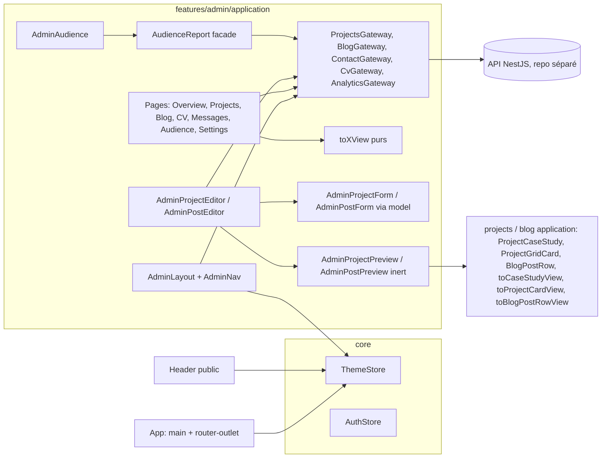

# 015 — Refonte de l'administration

## Description

### Contexte

Les specs 012 à 014 ont installé sur le site public le vocabulaire du « dessin technique » de
`DESIGN.md` : sur-titre mono, grand titre serré, cartouche titré, tampons de nature, listes de
repères `dl`, filtres en onglets soulignés avec leur compte, filets `line` plutôt que cartes
bordées, un seul indigo, deux registres (Console et Ivoire).

L'administration (`src/app/features/admin/**`, environ 4 250 lignes hors tests) est restée sur
l'ancien gabarit « dashboard SaaS » : cartes à bordure, pastilles colorées, libellés anglais.
Cette spec en fait l'audit, puis propose une maquette à valider avant tout plan technique.

Maquette et captures (hors dépôt, scratchpad de session) : `maquette-admin/index.html`
(autonome, tokens et polices du dépôt, bascule clair/sombre), `maquette-admin/captures/*.jpg`
(8 écrans × 2 registres en 1 440 px, plus le tiroir et la vue d'ensemble en 390 px). axe-core
(WCAG 2.2 AA + best-practice) : 0 violation sur les 20 rendus, aucun défilement horizontal.

### Constat

Relevé sur le code de `feat/refonte-admin` (= `master` à `30ef475`) et sur les captures de prod
du 2026-10-07 (registre sombre). Classement par gravité.

#### A. Bugs et risques fonctionnels

1. **Suppression sans confirmation, partout.** Un clic sur la corbeille retire immédiatement un
   projet (`admin-projects.ts:202-227`, déclenché par `admin-project-row.ts:76`), un article
   (`admin-blog.ts:79-85` puis `157-176`) ou le CV en ligne (`admin-cv.ts:44`, `172`). La mise à
   jour optimiste masque la perte : aucun « Annuler » dans le toast, aucun dialog. Aucun
   `confirm`/`dialog` dans toute la feature.
2. **La période affichée d'Analytics ment.** L'état vaut `'30d'` (`admin-analytics.ts:245`), mais
   le `<select [value]>` dont les `option` viennent d'un `@for`
   (`components/admin-analytics-header.ts:45-53`) affiche « 7 derniers jours » : la valeur est
   posée avant que les options existent. En prod, la capture montre « 7 derniers jours » au-dessus
   d'une courbe du 07/09 au 05/10 (30 jours). Les 42 visiteurs sont donc **sur 30 jours**, pas 7
   (la maquette le dit ainsi). Cause probable à confirmer par un test en RED.
3. **Erreur = zéro ou vide.** Aucun écran ne distingue « chargement », « erreur » et « vide » :
   la liste des projets affiche « Aucun projet » pendant le chargement et en erreur
   (`admin-projects.ts:79-85`, `value() ?? []` en `108`) ; idem « Aucun article »
   (`admin-blog.ts:88-91`, `111`) ; le tableau de bord affiche `0` message non lu et `0` CV si
   l'API tombe (`admin-dashboard.ts:169`, `184`). Le site public, lui, a un `role="alert"` avec
   « Réessayer » (`projects.ts`, `blog-list.ts`).
4. **Thème non maîtrisé dans l'admin.** La classe `.app-dark` n'est posée que par le `Header`
   public (`layout/components/header/header.ts:188-195`), qui n'est pas rendu sous `/admin`
   (`app.ts:19-21`) ; `index.html` ne la pose pas. Conséquence : un rechargement direct de
   `/admin` s'affiche en **Ivoire** quelle que soit la préférence enregistrée, et l'admin n'a
   aucun bouton de thème (`admin-layout.ts`, `admin-nav.ts`). Les captures de prod en sombre ne
   sont obtenues qu'en arrivant depuis le site.
5. **Lecture des messages impossible au clavier.** Une ligne de message ne s'ouvre qu'au clic sur
   le `<tr>` (`components/admin-table.ts:84`) ; la colonne « expand » n'est qu'une icône sans
   bouton (`components/admin-col-expand.ts`). Les en-têtes triables sont des `<th role="button">`
   sans `tabindex` ni gestion clavier (`components/admin-table.ts:54-59`), et ce `role` écrase
   `columnheader`, donc l'`aria-sort` n'est plus annoncé.

#### B. Incohérences avec le site

6. **Libellés anglais ou franglais** : « Dashboard » (`admin-layout.ts:91`,
   `admin.routes.ts:11`), « Analytics » (`admin-layout.ts:106`, `admin.routes.ts:35`,
   `components/admin-analytics-header.ts:26`), « Featured » (`admin-project-row.ts:59`,
   `admin-project-inline-form.ts:302`), statut brut « published » (`admin-blog.ts:59`),
   « Likes » (`admin-blog.ts:49`), « Export CSV » (`admin-analytics-header.ts:57`),
   « Upload nouveau CV », « Aucun CV uploadé » (`admin-cv.ts:59`, `53`). Nombres au format
   anglais : « 88.1% », « 1.3 pages / session », « 22s », « 1m 05s »
   (`admin-analytics.ts:356`, `components/admin-analytics-kpis.ts:52`,
   `analytics/domain/analytics-presenter.ts:23`, `28`) ; dates du graphique en ISO « 2026-09-07 »
   (`analytics-presenter.ts:45`).
7. **Cartes à bordure partout**, là où le site pose des filets : ligne de projet
   (`admin-project-row.ts:18`), KPI (`admin-analytics-kpis.ts:13`, `28`, `43`, `58`), graphique
   (`admin-analytics-visitors-chart.ts:12`), listes (`analytics-bar-list.ts:12`), formulaires
   (`admin-project-inline-form.ts:98`, `admin-blog-form.ts:39`), CV et paramètres
   (`admin-cv.ts:19`, `52`, `57`, `admin-settings.ts:23`). Les rayons varient (`rounded-xl`,
   `rounded-2xl`, `rounded-lg`).
8. **Plusieurs accents au lieu d'un** (One Indigo Rule) : violet `accent` pour la carte CV et la
   seconde série du graphique (`admin-dashboard.ts:63-66`,
   `admin-analytics-visitors-chart.ts:21`), vert « succès » comme couleur décorative des barres
   « Pays » et d'icônes (`admin-analytics.ts:145-150`, `159`), ambre « warn » pour
   « Featured », qui n'est pas un avertissement (`admin-project-row.ts:59`), ambre/vert pour des
   icônes de KPI (`admin-analytics-kpis.ts:45`, `60`). Le filtre des messages est un segmenté
   plein `bg-primary-bg` (`admin-messages.ts:62-66`), pas l'onglet souligné du site
   (`shared/ui/filter-group.ts`).
9. **Typographie et hiérarchie hétérogènes.** `h1` en `text-3xl` (tableau de bord, analytics,
   paramètres : `admin-dashboard.ts:27`, `admin-analytics-header.ts:26`, `admin-settings.ts:13`)
   ou `text-2xl` (projets, blog, CV, messages : `admin-projects.ts:31`, `admin-blog.ts:29`,
   `admin-cv.ts:16`, `admin-table.ts:27`), jamais l'Archivo élargi serré des pages publiques ; un
   `h2` « Admin » dans la barre latérale précède le `h1` de chaque page
   (`components/admin-nav.ts:28`) ; libellés de groupe et pastille de compte en `text-[10px]`
   (`admin-nav.ts:60`, `78`). Aucun sur-titre mono, aucun cartouche, aucun tampon de nature
   alors que le modèle `kind` existe (`admin-project-inline-form.ts:136-155`).
10. **Tableau de bord pauvre.** « Bonjour, <e-mail> » (`admin-dashboard.ts:28`), deux compteurs à
    zéro, une date figée au chargement du module (`admin-dashboard.ts:13`), un raccourci
    « Nouveau projet » qui ouvre seulement la liste (`admin-dashboard.ts:142`) et une carte « CV
    téléchargés » qui mène à Analytics (`admin-dashboard.ts:62`). Rien sur l'audience ni sur le
    contenu en ligne.

#### C. Accessibilité (WCAG 2.2 AA)

Contrastes calculés (conversion OKLCH → sRGB, formule WCAG 2.x) sur les tokens de `styles.css`.

11. **Pastilles de statut sous 4,5:1 en Ivoire** : texte `status-success` sur
    `status-success/15` = **2,80:1**, `status-warn` sur `status-warn/15` = **2,82:1**
    (« published », « Featured » : `shared/ui/tag.ts:7-8`, utilisés par `admin-blog.ts:58-61`,
    `admin-project-row.ts:59`). Bons en Console (7,0:1).
12. **Rouge de palette brute** : « Supprimer » des lignes de choix techniques et décisions en
    `text-red-400` (`admin-project-inline-form.ts:325`, `349`) = **2,54:1** sur Ivoire, et hors
    tokens. Bouton danger plein en Console : icône blanche sur `status-error` = **2,75:1**
    (`shared/ui/button.ts:99`, via `admin-project-row.ts:76`).
13. **Bords de champs à 1,6:1** (`border-muted/30`, `styles.css` `@utility form-input`,
    `app-select`) : un champ n'est délimité que par ce trait, sous le 3:1 de 1.4.11. Le champ
    « Ordre » a ses propres classes et un `focus:` au lieu de `focus-visible`
    (`admin-project-inline-form.ts:311`), la case « Featured » aussi (`296`).
14. **Champs sans étiquette** : les lignes de choix techniques et de décisions n'ont qu'un
    `placeholder` (`admin-project-inline-form.ts:320-321`, `340-345`).
15. **Noms d'actions non distincts** : « Modifier » / « Supprimer » identiques sur chaque ligne
    (`admin-project-row.ts:67`, `76`, `admin-blog.ts:72-85`, `components/admin-col-actions.ts`),
    pas d'`aria-expanded` sur le bouton qui déplie l'édition en ligne (`admin-project-row.ts:64-75`),
    lien actif de la navigation sans `aria-current` (`routerLinkActive` sans
    `ariaCurrentWhenActive`, `admin-nav.ts:67`, `96`), pastille de non-lus lue « 3 » sans contexte
    (`admin-nav.ts:76-82`), navigation réduite nommée par `title` seulement (`admin-nav.ts:71`),
    `target="_blank"` sans mention ni `rel` (`admin-cv.ts:38`). Le graphique n'a pas d'alternative
    textuelle (`admin-analytics-visitors-chart.ts:29`).

#### D. Mobile

16. Les tableaux (articles, messages) passent en défilement horizontal (`admin-table` utilise
    `min-w-max`, `styles.css` `@utility admin-table`) ; la catégorie et « Featured » d'un projet
    disparaissent sous `sm` (`admin-project-row.ts:56`) ; le formulaire inline, déjà long de
    quinze champs sans sections, s'ouvre sous une ligne de 48 px de vignette carrée qui rogne une
    couverture 16/10 (`admin-project-row.ts:23-28`).

#### E. Dette de structure (à traiter avec la refonte, pas avant)

17. `admin-table.ts` (244 lignes) et ses sept `admin-col-*` ne servent qu'à `admin-messages.ts` :
    une abstraction générique pour un seul consommateur. `THEME_FALLBACK` recopie les tokens
    (`admin-analytics.ts:38-48`). Six `@utility admin-*` de `styles.css` deviendront orphelins avec
    la nouvelle grammaire. `DESIGN.md` § Admin Table décrit des boutons `h-9` quand l'utility est
    en `h-11`.

### Ce qui est proposé (maquette)

Une seule grammaire pour le site et l'admin, plus dense côté admin :

- **Coque** : barre latérale sobre (filet `line`, aucune carte), monogramme « JN » du header
  public, groupes **Contenu** (Projets, Articles, CV), **Audience** (Audience, Messages),
  **Compte** (Paramètres), libellés de groupe mono 12 px. Page active : texte `foreground`
  semi-gras souligné de 2 px `primary`, comme `FilterGroup` ; `aria-current="page"`. Comptes en
  mono à droite (projets 6, articles 2, non-lus 0 avec « non lu » en `sr-only`). Pied : « Voir le
  site », bascule de thème, déconnexion, e-mail. Mobile : barre supérieure (monogramme, titre de
  la page, menu 44 px) et tiroir `Drawer` existant.
- **En-tête de page** partout : sur-titre mono `primary` porteur d'une donnée, `h1` Archivo 800
  élargi serré (environ 52 px au lieu de 84 px public), phrase d'introduction, action principale
  ou cartouche à droite.
- **Vue d'ensemble** : sur-titre « Mercredi 7 octobre 2026 · 30 derniers jours », phrase de
  synthèse générée (« 42 visiteurs en 30 jours, dont 18 venus de Google. Aucun message en
  attente… »), cartouche « En ligne » (2 en production, 2 démos, 2 scripts, 2 articles), relevé
  « Audience » (42 en grand + courbe à traits droits, puis 56 pages vues, 88,1 %, 22 s), relevé
  « Contacts » (0 non lu, 0 CV), état vide dessiné (tampon « Boîte vide » + phrase + lien), contenu
  en ligne avec vignettes et tampons, actions rapides.
- **Projets** : lignes éditoriales (numéro d'ordre, couverture 16/10 avec tampon de nature,
  sur-titre « 01 · Application Web », titre, accroche, repères Stack et « Accueil : mis en avant »),
  signalement d'une accroche vide (CandiDash), trois boutons icônes nommés (« Modifier :
  DashFlow »…), filtre par **nature** en onglets (Tous 6, En production 2, Démos 2, Scripts 2) à
  la place du `select` par catégorie.
- **Éditeur de projet** : page dédiée, fil d'Ariane, sections `01 · Identité`,
  `02 · Présentation dans les Réalisations`, `03 · Liens`, `04 · Choix techniques`,
  `05 · Galerie` ; nature choisie par trois cartes-radios portant le tampon et sa définition ;
  compteurs « 137 / 160 » ; champs répétés avec étiquettes ; aperçu de la carte publique et
  sommaire d'état à droite (collants) ; barre d'actions collante « N modifications non
  enregistrées · Annuler · Enregistrer ».
- **Articles** : tableau sans cadre (filets), vignette, sujets en mono, tampon « Publié » /
  « Brouillon » (trait tireté), date « 9 sept. 2026 », durée de lecture, j'aime, actions nommées,
  filtre Tous / Publiés / Brouillons.
- **Audience** : période en onglets (supprime le bug du point 2), relevé de quatre chiffres
  séparés par des filets (pas quatre cartes), courbe visiteurs `primary` plein + pages vues
  `foreground` tiretée (une seule teinte), dates françaises, tableau de données en
  `details`, pages et provenance en tableaux à barres fines avec part en %, événements en listes
  de repères. Les donuts disparaissent.
- **Messages, CV, Paramètres** : même en-tête ; état vide dessiné ; gabarit de ligne de message
  (bouton de dépliage avec `aria-expanded`, tampon « Nouveau », actions nommées) ; CV en
  cartouche ; paramètres en lignes (double authentification, session, thème Système / Clair /
  Sombre).

Données de la maquette : relevées en prod le 2026-10-07 (KPI, pages, provenance, projets,
articles, CV). Inventées et marquées comme telles dans la maquette : les accroches hors DashFlow
(l'API n'en fournit pas encore), la durée de lecture du second article, la ligne « Brouillon »,
le message de démonstration, la section « Ce que les visiteurs font », la ligne « Accès direct »
(42 − 20 sessions) et « Autres pages » (56 − 45 vues), la courbe (redessinée d'après la capture,
totaux respectés).

### Hors périmètre

- Aucune évolution de l'API (sauf arbitrage 5 si retenu).
- Pages `login`, `two-factor` et le parcours de configuration 2FA (`settings/security`) : même
  gabarit plus tard.
- Éditeur Markdown riche : le formulaire d'article garde sa zone Markdown et son aperçu.

### Contraintes

- `CLAUDE.md` et `DESIGN.md` : Tailwind seul, `shared/ui` pour toute structure réutilisée
  (`Cartouche`, `Stamp`, `FilterGroup`, `FactList` existent déjà), One Indigo, Two Registers,
  Decorative Line Rule, aucune police ni dépendance nouvelle.
- Signal Forms pour l'éditeur (pas de retour à Reactive Forms).
- Le bord de champ doit atteindre 3:1 : proposer un token `--color-field` (`foreground` à 50 % en
  Ivoire, 38 % en Console, seuils de la Decorative Line Rule) plutôt que `muted/30`.

## Arbitrages proposés

1. **Nom de « Analytics ».** Options : « Audience », « Statistiques », « Fréquentation ».
   *Recommandation : « Audience »*, cohérent avec le groupe de navigation et avec ce que la page
   mesure (des personnes, pas des requêtes). « Statistiques » reste un bon second choix si
   d'autres chiffres non liés aux visiteurs y entrent. L'URL `/admin/analytics` peut rester, ou
   devenir `/admin/audience` avec redirection (le fichier de routes en a déjà dix).
2. **Éditeur de projet : inline ou page dédiée `/admin/projects/:id` (et `/new`) ?**
   *Recommandation : page dédiée.* Le formulaire fait quinze champs plus deux listes répétées et
   une galerie ; inline, il casse la lecture de la liste, interdit l'aperçu latéral et le lien
   direct, et oblige à gérer un seul « en édition » à la fois. Une route donne un `title`, un
   `CanDeactivateFn` pour les modifications non enregistrées, et le raccourci « Nouveau projet »
   du tableau de bord devient vrai. Même choix pour les articles (`/admin/blog/:id`).
3. **Aperçu en direct de la carte publique ?** *Recommandation : oui, à partir de `lg`*, en
   réutilisant les composants publics (`ProjectCaseStudy` / `ProjectGridCard`) alimentés par un
   `computed()` du modèle du formulaire, et non une copie. Coût faible, et c'est le seul moyen de
   voir l'effet d'une accroche ou d'un changement de nature avant le redéploiement. Sous `lg` :
   un lien « Aperçu » ancré, pas de panneau.
4. **Périmètre de la première PR.** *Recommandation : trois PR indépendantes, dans cet ordre :*
   (a) **correctifs sans refonte** : confirmation de suppression, période d'Audience, états
   chargement / erreur / vide, thème appliqué sous `/admin`, lecture des messages au clavier,
   libellés français (points 1 à 6, 14, 15) ; (b) **coque + vue d'ensemble + en-têtes de pages**
   (navigation, thème, grammaire commune, Audience) ; (c) **projets : liste, page d'édition,
   aperçu**, puis articles. (a) répare des risques réels en prod et ne dépend pas de la
   validation visuelle.
5. **Contenu de la vue d'ensemble.** La phrase de synthèse et les relevés n'utilisent que des
   endpoints existants (`overview`, `chart`, `referrers`, compteurs). *Recommandation : s'en
   tenir là*, sans « dernier déploiement » ni statut 2FA tant que l'API ne les expose pas (la
   maquette renvoie la 2FA vers Paramètres plutôt que d'afficher un état inventé).
6. **Densité.** *Recommandation : densité « atelier »* : corps 15 px, tableaux 14,5 px, mono
   12 px minimum (plus de 10 px), `h1` vers 52 px, cibles 44 px conservées, filets plutôt que
   cartes. Le public reste plus aéré ; l'admin garde la même grammaire avec des marges
   resserrées. À ajuster sur les captures si la vue d'ensemble paraît trop éditoriale.

### Réponses (2026-10-07)

1. **Direction visuelle** de la maquette : validée.
2. **« Analytics » devient « Audience ».** URL canonique `/admin/audience` ; `/admin/analytics`
   (et ses anciennes redirections `stats`, `analytics/visits`, `analytics/projects`) redirige
   dessus. Justification au § Plan, tranche B1.
3. **Édition en page dédiée** pour les projets et les articles (`/admin/projects/new`,
   `/admin/projects/:id`, `/admin/blog/new`, `/admin/blog/:id`), aperçu en direct de la carte
   publique à droite à partir de `lg`, `CanDeactivateFn` contre les modifications non
   enregistrées (ADR-0013).
4. **Trois PR, dans l'ordre (a) → (b) → (c)** ; (c) est scindée en **c1** (édition : projets et
   articles) et **c2** (Audience, Messages, CV, Paramètres, nettoyage).
5. **Par défaut, à confirmer en revue** : vue d'ensemble construite sur les endpoints existants
   seulement ; densité intermédiaire (corps 15 px, tableaux 14,5 px, mono 12 px minimum, `h1`
   vers 52 px, cibles 44 px, filets plutôt que cartes) ; nouveau token `--color-field` pour le
   bord des champs (≥ 3:1).

## Plan technique

> Profil lu (`.claude/project-profile.md`). Validation runtime aux frontières non vérifiée
> (adapters purs, pas de lib côté front) : inchangé par cette spec. ADR : **ADR-0012** (thème),
> **ADR-0013** (édition en pages dédiées, aperçu public). Aucune évolution d'API, aucune
> dépendance nouvelle, aucune police nouvelle.

### 1. Décisions structurantes

| # | Décision | Où |
|---|---|---|
| D1 | `ThemeStore` (`core/theme/`) seule source de vérité du thème, instancié par `App`, script de pré-peinture dans `index.html`, `ThemeWatcher` supprimé | ADR-0012, A4 |
| D2 | `/admin/audience` canonique, `/admin/analytics` redirigé | B1 |
| D3 | `App` reste seul propriétaire de `<main>` ; la coque admin n'émet ni `main` ni `aside`, seulement un `<nav aria-label="Administration">` | B1 |
| D4 | Confirmation de suppression par un `<dialog>` natif modal (`shared/ui/confirm-dialog.ts`) | A1 |
| D5 | Erreur ≠ vide : les gateways admin cessent d'avaler les erreurs (`catchError → [] / 0`), précédent `HttpProjectsGateway.allProjects$` | A3 |
| D6 | Token `--color-field` (bord de champ, ≥ 3:1) et `--color-on-status-error` (texte sur rouge plein) | § 3, A1, A7 |
| D7 | Frontière presenter : **fonctions pures `toXView`** + `computed()` dans la page (précédent `toProjectsView`, `toBlogListView`), pas de classe presenter ; une **facade** `AudienceReport` pour Audience seule (11 ressources) | § 5, C7 |
| D8 | Éditeur : la page possède le brouillon, le formulaire l'édite en `model()` ; aperçu par les composants publics via builders exportés et requêtes de conteneur | ADR-0013, C1 à C6 |
| D9 | Composants de grammaire admin dans `features/admin/application/components/` (un seul consommateur de feature) ; dans `shared/ui/` seulement ce qui sert ou servira hors admin (`ConfirmDialog`, `LoadError`) | § 6 |
| D10 | Coque en barre latérale à partir de `lg` (1 024 px, breakpoint Tailwind natif) au lieu des 900 px de la maquette | B1 |

### 2. Architecture



- **Couches** : `domain` (inchangé hors suppressions), `infra` (gateways contact, projets, blog :
  erreurs et cache), `application` admin (pages smart + composants dumb + builders purs), `core/theme`
  (nouveau), `shared/ui` (`ConfirmDialog`, `LoadError`, retouches `Button`, `Tag`, `Stamp`,
  `FilterGroup`).
- **Frontière `admin` ↔ `projects` / `blog`** : l'admin importe les **composants de carte**, les
  **builders de vue** exportés et le **domaine** (`countProjectsByKind`, `filterProjectsByKind`,
  `projectPitch`, `projectStack`, `readingTimeMinutes`, libellés `PROJECT_KIND_*`) ; jamais l'inverse.
  Les brouillons (`ProjectDraft`, `PostDraft`) et leurs adapters vers `Project` / `BlogPost` vivent
  dans l'admin. Le seul changement imposé aux features publiques : exporter trois builders et passer
  deux cartes en requêtes de conteneur (ADR-0013 §4).
- **Landmarks (ownership unique)** : `App` possède `<main>` (seul `main` de toute page), le `Header`
  public possède `banner` et le `Footer` `contentinfo`, tous deux absents sous `/admin`. La coque
  admin ne rend **ni** `<main>` **ni** `<aside>` (aujourd'hui `admin-layout.ts` imbrique un second
  `main` dans celui d'`App`) : barre latérale = `div` portant `<nav aria-label="Administration">`,
  barre mobile = `div`. Le `Drawer` existant porte `role="dialog"`.
- **Presenter / view-model** : chaque écran dérivé (vue d'ensemble, liste projets, liste articles,
  Audience, messages, CV) a son builder pur `toXView(...)` testé sans TestBed ; le composant ne garde
  que la glue (ressources, interaction, focus). Heuristique appliquée : tout composant qui mêle DOM
  (focus, `dialog`, `viewChild`) et dérivation non triviale sort la dérivation dans un builder.
  Composants purement présentationnels (lignes, relevé, en-tête) : pas de builder.

### 3. Tokens et contrastes (calculés)

Méthode : OKLCH → sRGB linéaire (matrices d'Ottosson), `color-mix(in srgb, X p%, transparent)`
composé sur le fond en sRGB encodé, luminance relative et ratio WCAG 2.x
`(L1 + 0,05) / (L2 + 0,05)`. Fonds : Ivoire `oklch(97% 0.008 87)`, surface Ivoire blanche ;
Console `oklch(14.5% 0.003 286)`, surface Console = blanc 3 % composé. Valeurs vérifiées par script
(mêmes résultats que la `## Description` : 2,80 / 2,82 / 2,54 / 2,75 / 1,6).

| Usage | Avant | Après | Ivoire | Console | Seuil |
|---|---|---|---|---|---|
| Bord de champ (`form-input`, `app-select`) | `muted/30` : 1,60 fond / 1,62 surface (Iv.), 1,66 / 1,71 (Co.) | `--theme-field` = `foreground` 50 % (Iv.), 38 % (Co.) | 3,04 fond / 3,11 surface | 3,41 fond / 3,47 surface | 3:1 (1.4.11) |
| Texte de substitution | `muted/60` : 2,92 (Iv.) | `muted` | 7,86 | 7,14 | 4,5:1 |
| Texte sur rouge plein (`Button` danger solide) | blanc : 6,42 (Iv.), **2,75** (Co.) | `--theme-on-status-error` = blanc (Iv.), `var(--theme-background)` (Co.) | 6,42 | 7,20 | 4,5:1 |
| « Supprimer » des lignes répétées | `text-red-400` : **2,54** (Iv.) | `Button` danger texte (`status-error`) | 5,89 (survol 4,90) | 7,20 (survol 6,48) | 4,5:1 |
| Pastilles « published », « Featured » | `status-*` sur `status-*/15` : **2,80 / 2,82** (Iv.) | `Stamp` (`foreground` sur fond) | 14,02 | 18,95 | 4,5:1 |
| Tag « info » restant (`primary` sur `primary/10`) | inchangé | inchangé | 6,81 | 7,28 | 4,5:1 |
| Sur-titre `text-primary`, page | — | — | 8,04 | 8,25 | 4,5:1 |
| Série « Visiteurs » (trait `primary`) | — | — | 8,04 | 8,25 | 3:1 |
| Série « Pages vues » (`foreground` 55 %, tiretée) | `accent` (2ᵉ teinte) | une seule teinte | 3,49 | 6,04 | 3:1 |

Choix : 50 % en Ivoire est le seuil de la Decorative Line Rule (`DESIGN.md`), marge faible (3,04) ;
38 % en Console laisse de la marge sur la surface translucide. Les traits `line` / `line-strong`
restent décoratifs (inchangés). `color-scheme: dark` sur `:root` et `light` sur
`:root:not(.app-dark)` : contrôles natifs (case à cocher, liste de `select`, barres de défilement) au
registre du thème ; pas de ratio à poser, rendu natif contrôlé par axe au navigateur.

### 4. Modèles de données

Immuables (`readonly`), `type`, unions plutôt qu'enums. Les modèles Signal Forms gardent des champs
mutables (précédent `ProjectFormModel` : le `FieldTree` écrit par `model.update`).

```ts
// core/theme/theme-preference.ts
export type ThemePreference = 'system' | 'light' | 'dark';
export function parseThemePreference(raw: string | null): ThemePreference; // 'dark' | 'light', sinon 'system'
export function resolveIsDark(preference: ThemePreference, systemPrefersDark: boolean): boolean;

// features/admin/application/admin-nav-groups.ts
export type AdminNavKey = 'overview' | 'projects' | 'posts' | 'cv' | 'audience' | 'messages' | 'settings';
export type AdminNavItem = {
  readonly key: AdminNavKey; readonly route: string; readonly icon: string; readonly label: string;
  readonly exact: boolean; readonly count: number | null; readonly countSuffix: string; // « non lu », sr-only
};
export type AdminNavGroup = { readonly label: string | null; readonly items: readonly AdminNavItem[] };
export type AdminNavCounts = { readonly projects: number | null; readonly posts: number | null; readonly unread: number | null };

// features/admin/application/project-draft.ts (ProjectFormModel actuel, renommé et exporté)
export type ProjectDraft = { title: string; category: string; description: string; liveUrl: string;
  repoUrl: string; repoUrlFront: string; repoUrlBack: string; featured: boolean; order: number;
  kind: ProjectKind | ''; techChoices: TechChoice[]; architectureDecisions: ArchitectureDecision[];
  pitch: string; highlight: string; scope: string };
export function toProjectDraft(project: Project | null): ProjectDraft;
export function toProjectInput(draft: ProjectDraft, tags: ReadonlySet<string>, kind: ProjectKind): ProjectInput;
export function toPreviewProject(draft: ProjectDraft, tags: ReadonlySet<string>, base: Project | null): Project | null;

// features/admin/application/post-draft.ts
export type PostDraft = Pick<BlogPostInput, 'title' | 'excerpt' | 'contentMarkdown' | 'status'>;
```

- **Compile-time plutôt que runtime** : `toProjectInput` exige `kind: ProjectKind` (le `''` du
  brouillon est exclu par la signature, garde `isProjectKind` existante en amont) ; `AdminNavKey`
  ferme les testids de navigation ; `FilterOption<T extends string>` type les filtres
  (`ProjectKindFilter`, `'all' | 'published' | 'draft'`, `'all' | 'unread' | 'read'`, `DateRangeKey`).
- `toPreviewProject` renvoie `null` tant que `kind === ''` (l'aperçu dépend de la nature) ;
  `pitch` vide → `null` (le public reprend alors la première phrase de la description,
  `projectPitch`) ; liens vides → `null` ; `image` = `base?.image ?? ''` ; `slug`, `id`, `gallery`
  repris de `base` (ou `''` / `[]`).

### 5. Réactivité et état partagé

- **Signals locaux** par défaut ; ressources `rxResource` (précédent du repo).
- **`resource.value()` lève en état d'erreur (Angular ≥ 20)** : toute lecture passe par
  `hasValue()` (`res.hasValue() ? res.value() : repli`), jamais `value() ?? repli` sur une
  ressource qui peut échouer. C'est la condition pour que D5 ne casse pas les `computed`.
- **Store** : `ThemeStore` seulement (possède la préférence, partagée par 5 consommateurs non liés,
  mutations = commandes internes). Expose `preference` et `isDark` en `Signal<T>` (`asReadonly()`).
- **Facade** : `AudienceReport` (`features/admin/application/audience-report.ts`, fournie dans les
  `providers` de la page, instance-scopée) : front de `AnalyticsGateway` sur une période, ré-expose
  les vues dérivées ; pas un store, pas de suffixe `Store`.
- **Gateways** (contrats abstraits existants, inchangés dans leur forme) : `ContactGateway` et
  `BlogGateway` gagnent un flux partagé invalidable (précédent `allProjects$` :
  `retry(1)` + `share({ connector: ReplaySubject(1), resetOnError: true, resetOnComplete: false,
  resetOnRefCountZero: false })`). Aucun `HttpClient` dans un composant.
- **Comptes de navigation** : la coque et les pages s'abonnent au **même** flux de gateway
  (projets, articles admin, non-lus) ; une écriture invalide le flux, la coque se met à jour sans
  store dédié.
- **Horloge** : la date du jour est lue à la construction de la page (`new Date()`), plus jamais
  figée au chargement du module (`FORMATTED_DATE` actuel) ; tests sous `vi.setSystemTime`.

### 6. Fichiers

Chemins relatifs à `src/app/` sauf mention. `(+spec)` = spec créé ou modifié dans la même tranche.

**PR a** — créer : `shared/ui/confirm-dialog.ts` (+spec), `shared/ui/load-error.ts` (+spec),
`core/theme/theme-store.ts` (+spec), `core/theme/theme-preference.ts` (+spec). Modifier :
`app.ts`, `layout/components/header/header.ts` (+spec), `shared/ui/button.ts` (+spec),
`shared/ui/tag.ts` (+spec), `features/blog/application/components/blog-comments.ts` (+spec),
`features/contact/infra/gateways/http-contact.gateway.ts` (+spec),
`features/projects/domain/gateways/projects.gateway.ts`,
`features/projects/infra/gateways/http-projects.gateway.ts` (+spec),
`features/analytics/domain/analytics-presenter.ts` (+spec), `features/admin/admin.routes.ts`,
`features/admin/application/{admin-layout,admin-projects,admin-blog,admin-cv,admin-messages,admin-dashboard,admin-analytics}.ts`
(+specs), `features/admin/application/components/{admin-nav,admin-project-row,admin-project-inline-form,admin-analytics-header,admin-analytics-kpis,admin-table,admin-column-base,admin-col-expand,admin-col-actions,analytics-entity-list}.ts`
(+specs), `shared/ui/file-dropzone.ts` (+spec), `src/index.html`, `src/styles.css`, `DESIGN.md`. Supprimer :
`shared/theme/theme-watcher.ts` (+spec), `features/projects/domain/models/project-filter.model.ts`.

**PR b** — créer (dans `features/admin/application/`) : `admin-nav-groups.ts` (+spec),
`admin-page-copy.ts` (+spec), `admin-overview.ts` (+spec), `overview-view.ts` (+spec),
`overview-copy.ts` (+spec), `chart-palette.ts` (+spec), `with-first-of-month.ts`,
`pluralize.ts` (+spec), `capitalize.ts` (+spec), `components/admin-page-header.ts` (+spec),
`components/admin-section-head.ts`, `components/admin-readout.ts` (+spec),
`components/admin-empty-state.ts` (+spec), `components/overview-audience.ts` (+spec),
`components/overview-contacts.ts` (+spec), `components/overview-content.ts` (+spec),
`admin-layout.spec.ts`, `components/admin-nav.spec.ts` ; builders de test
`features/analytics/testing/analytics-builders.ts`, `features/auth/testing/user-builders.ts`.
Modifier : `admin.routes.ts`, `admin-layout.ts`, `components/admin-nav.ts`, pages (en-têtes),
`features/blog/domain/gateways/blog.gateway.ts`,
`features/blog/infra/http-blog.gateway.ts` (+spec), `features/analytics/domain/analytics-presenter.ts`
(+spec). Supprimer : `admin-dashboard.ts` (+spec).

**PR c1** — créer : `admin-project-editor.ts` (+spec), `admin-post-editor.ts` (+spec),
`project-draft.ts` (+spec), `post-draft.ts` (+spec), `admin-projects-view.ts` (+spec),
`admin-posts-view.ts` (+spec), `count-draft-changes.ts` (+spec), `unsaved-changes-guard.ts` (+spec),
`components/admin-form-section.ts` (+spec), `components/admin-save-bar.ts` (+spec),
`components/admin-form-toc.ts` (+spec), `components/admin-project-preview.ts` (+spec),
`components/admin-post-preview.ts` (+spec). Renommer (`git mv`, puis restructurer) :
`components/admin-project-inline-form.ts` → `components/admin-project-form.ts` (+spec),
`components/admin-blog-form.ts` → `components/admin-post-form.ts` (+spec). Modifier :
`admin.routes.ts`, `admin-projects.ts`, `admin-blog.ts`, `components/admin-project-row.ts`,
`admin-overview.ts`, `shared/ui/stamp.ts` (+spec), `features/projects/application/projects-view.ts`,
`features/projects/application/components/project-case-study.ts` (+spec),
`features/blog/application/blog-list-view.ts`,
`features/blog/application/components/blog-post-row.ts` (+spec),
`features/projects/domain/gateways/projects.gateway.ts`,
`features/projects/infra/gateways/http-projects.gateway.ts` (+spec), `DESIGN.md`.
Ajouts hors plan, acceptés en revue (m9) : créer `form-toc-entries.ts`, `leave-confirmation.ts`,
`components/admin-post-row.ts`, `app.config.spec.ts`, `features/projects/testing/stub-projects-gateway.ts`,
`features/blog/testing/stub-blog-gateway.ts` ; modifier `app.config.ts`
(`canceledNavigationResolution: 'computed'`), `eslint.config.js` (`component-selector` ouvert aux
sélecteurs d'attribut), `shared/icons/icon-map.ts` et `public/icons/sprite.svg` (`arrow-up`,
`arrow-down`), `src/styles.css` (`field-label`, `field-hint`, `scroll-padding-bottom` de la barre),
`components/admin-tags-selector.ts` (`ReadonlySet`), `components/admin-gallery-image-item.ts`,
`components/admin-project-gallery.ts` (+spec). Correctifs de la revue : `admin-layout.ts` (+spec,
décalage des ancres), `features/blog/infra/parse-markdown.ts` (+spec, option `topHeadingLevel`).

**PR c2** — créer : `audience-report.ts` (+spec), `audience-view.ts` (+spec), `admin-cv-view.ts`
(+spec), `admin-messages-view.ts` (+spec), `components/audience-chart.ts` (+spec),
`components/audience-share-table.ts` (+spec), `components/audience-tally.ts` (rendu prouvé par
la page, choix du RED), `components/admin-message-row.ts` (+spec), `admin-cv.spec.ts`, `admin-settings.spec.ts`. Renommer :
`admin-analytics.ts` → `admin-audience.ts` (+spec). Modifier : `admin.routes.ts`, `admin-messages.ts`,
`admin-cv.ts`, `admin-settings.ts`, `features/auth/application/two-factor-setup.ts` (+spec),
`shared/ui/filter-group.ts` (+spec),
`features/analytics/domain/analytics-presenter.ts` (+spec), `src/styles.css`, `DESIGN.md`. Supprimer :
`components/{admin-analytics-header,admin-analytics-kpis,admin-analytics-visitors-chart,admin-analytics-cv-panel,analytics-bar-list,analytics-donut-panel,analytics-entity-list,admin-table,admin-col-actions,admin-col-badge,admin-col-contact,admin-col-date,admin-col-expand,admin-col-text,admin-column-base}.ts`
(+specs), `shared/ui/tag.ts` (+spec) si plus aucun consommateur, les onze `@utility admin-*` de
`styles.css`.
Ajouts hors plan, relevés en revue (point 7) : créer `components/admin-setting-row.ts`,
`features/analytics/testing/stub-analytics-gateway.ts` ; modifier
`features/analytics/infra/gateways/http-analytics.gateway.ts` (+spec, C7bis),
`features/contact/infra/gateways/http-contact.gateway.ts` (écritures silencieuses, C8),
`features/auth/application/two-factor-disable-form.ts`, `components/admin-section-head.ts`,
`shared/ui/file-dropzone.ts` (+spec, `resetToken`), `components/admin-post-form.ts`,
`components/admin-project-form.ts`, `admin-post-editor.ts` (+spec), `admin-project-editor.ts`
(+spec), `admin-page-copy.ts`, `features/analytics/testing/analytics-builders.ts`,
`features/blog/application/blog-list-view.spec.ts`. Correctifs de la revue : créer
`shared/ui/format-file-size.ts` (+spec, déplacé d'`admin-cv-view.ts`) ; modifier
`core/interceptors/skip-error-toast.ts` (`silentErrors()`, cinq consommateurs),
`features/cv/infra/gateways/http-cv.gateway.ts` (+spec),
`features/contact/infra/gateways/http-contact.gateway.ts` (+spec),
`features/projects/infra/gateways/http-projects.gateway.ts` (+spec),
`features/blog/infra/http-blog.gateway.ts` (+spec), `admin-blog.spec.ts` (garde obsolète
retirée), `DESIGN.json`, `docs/adr/0012-*`, `docs/adr/0013-*` (statut accepté).

### 7. Tranches

Chaque tranche : `qa` écrit les tests de la tranche (RED prouvé), `angular-expert` les fait passer
(GREEN) puis refactore sous vert. Les tranches d'une PR sont ordonnées ; aucune ne casse une tranche
antérieure.

#### PR a — correctifs sans refonte (branche `fix/admin-correctifs`)

- **Tranche A1 — supprimer demande confirmation (projet, article, CV, message).**
  - Fichiers : `shared/ui/confirm-dialog.ts` (nouveau), `shared/ui/button.ts`, `src/styles.css`
    (token `on-status-error`), `admin-projects.ts`, `components/admin-project-row.ts`,
    `admin-blog.ts`, `admin-cv.ts`, `admin-messages.ts` (+specs).
  - Contrat `ConfirmDialog` (`app-confirm-dialog`) : `open = input.required<boolean>()`,
    `heading = input.required<string>()`, `confirmLabel = input.required<string>()`,
    `cancelLabel = input('Annuler')` ; `confirmed = output<void>()`, `cancelled = output<void>()` ;
    contenu projeté = conséquence. `<dialog aria-labelledby aria-describedby>` piloté par
    `afterRenderEffect({ write })` (`showModal()` / `close()`), Échap (événement `cancel`) et
    « Annuler » → `cancelled` ; focus initial sur « Annuler » (`autofocus`) ; confirmation =
    `app-button severity="danger"` plein. testids `confirm-dialog`, `confirm-dialog-heading`,
    `confirm-dialog-confirm`, `confirm-dialog-cancel`.
  - Pages : `pendingDeletion = signal<T | null>(null)` ; la corbeille ne fait que le poser ;
    `confirmed` lance la suppression existante (optimiste conservée) ; `cancelled` remet `null`
    sans appel. Après suppression confirmée, focus sur le `h1` de la page (`tabindex="-1"`, testid
    `admin-page-title`) : le déclencheur a disparu. Textes (copie à valider) : « Supprimer le
    projet DashFlow ? » / « Le projet disparaît des Réalisations et de l'accueil au prochain
    déploiement, avec ses captures. Cette action est définitive. » / bouton « Supprimer
    DashFlow » ; même gabarit pour l'article, le message (« Supprimer le message de Claire
    Martin ? ») et le CV (« Retirer le CV du site ? »).
  - testids des déclencheurs : `admin-project-delete`, `admin-post-delete`, `admin-cv-delete`,
    `message-delete`.
  - `Button` danger plein : `text-white` → `text-on-status-error` (corrige aussi
    `two-factor-disable-form` en Console, 2,75 → 7,20).
  - Tests : dialog (ouverture = `dialog.open`, Échap → `cancelled`, confirmation → `confirmed`) ;
    par page (`it.each` sur les 4 pages possible) : clic corbeille → dialog visible et gateway non
    appelé ; confirmer → `delete*` appelé une fois ; annuler → jamais.
  - Supprimé : rien. Risques : happy-dom 20.9 implémente `HTMLDialogElement.showModal` (vérifié)
    mais l'Échap n'y émet pas `cancel` → le test émet l'événement `cancel` lui-même ; la
    suppression d'un **message** n'était pas dans la liste de la PR a, ajoutée car même défaut,
    même composant (signalé à la session principale).

- **Tranche A2 — la période d'Audience affichée est celle des données.**
  - Fichiers : `components/admin-analytics-header.ts` (+spec).
  - Cause : `[value]` posé sur le `<select>` avant que le `@for` crée les `<option>` ; le
    navigateur retombe sur la première (« 7 derniers jours »), et la liaison ne se rejoue jamais
    tant que le signal ne change pas.
  - Contrat : plus de `[value]` sur le `select` ; chaque option porte
    `[selected]="opt.value === dateRange()"` ; `(change)` inchangé.
  - Tests : `it.each` sur les 4 valeurs : `setInput('dateRange', v)` → `select.value === v` et
    libellé de l'option sélectionnée attendu (RED sur `'30d'` aujourd'hui).
  - Supprimé : rien. Risque : même défaut latent sur le filtre par catégorie des projets
    (`admin-projects.ts`), masqué parce que la valeur initiale est la première option ; supprimé en
    C2, pas corrigé ici.

- **Tranche A3 — chargement, erreur et vide sont trois états distincts.**
  - Fichiers : `shared/ui/load-error.ts` (nouveau), `http-contact.gateway.ts`,
    `projects.gateway.ts`, `http-projects.gateway.ts`, `admin-projects.ts`, `admin-blog.ts`,
    `admin-messages.ts`, `admin-dashboard.ts`, `admin-cv.ts`, `admin-layout.ts` (+specs).
  - Contrat `LoadError` (`app-load-error`) : `message = input.required<string>()`,
    `retry = output<void>()` ; hôte `role="alert"` ; `app-button` secondaire « Réessayer ».
    testids `load-error`, `load-error-retry`. (Le site public a ce gabarit en ligne dans
    `projects.ts` et `blog-list.ts` : migration hors spec.)
  - Gateways : `getAllMessages()` sans `catchError → []` ; non-lus sans `catchError → 0`, flux
    partagé au précédent `allProjects$` (`retry(1)`, `resetOnError: true`) ; la liste admin des
    projets lit `getAllProjects()` (erreurs propagées, invalidée après écriture) au lieu de
    `filterProjects({})` qui avalait les erreurs.
  - Chaque page : `@if (chargement initial)` squelette (`admin-<x>-loading`, `AppSkeleton` +
    texte `sr-only` en `role="status"`), `@else if (status() === 'error')` `app-load-error`
    → `reload()`, `@else if (vide)` texte vide (`admin-<x>-empty`), sinon contenu. Tableau de bord :
    compteurs indisponibles affichés « — » + `sr-only` « indisponible »
    (`dashboard-unread-count`, `dashboard-cv-count`). CV : chargement manuel `loadCv()` remplacé
    par une `rxResource` ; le toast d'échec de chargement disparaît (l'état le remplace). Coque :
    pastille de non-lus masquée en erreur.
  - Tests : par page, `it.each` sur (chargement, erreur, vide, données) → un seul des quatre
    testids présent ; `retry` relance la requête (`HttpTestingController`) ; gateway contact :
    erreur HTTP propagée, nouvel abonnement après erreur → nouvelle requête.
  - Supprimé : `ProjectsGateway.filterProjects` (+ impl + specs), `project-filter.model.ts`,
    `AdminCv.loadCv`, les deux `catchError` de `HttpContactGateway`.
  - Risque : `errorToastInterceptor` émet aussi un toast sur un GET ≥ 500 (double signal assumé,
    inchangé).

- **Tranche A4 — le thème est juste sous `/admin` et partagé avec le site (ADR-0012).**
  - Fichiers : `core/theme/theme-preference.ts`, `core/theme/theme-store.ts` (nouveaux),
    `app.ts`, `header.ts`, `blog-comments.ts`, `admin-analytics.ts`, `components/admin-nav.ts`,
    `admin-layout.ts`, `src/index.html`, `src/styles.css` (`color-scheme`) (+specs).
  - Contrat `ThemeStore` : `preference: Signal<ThemePreference>`, `isDark: Signal<boolean>`,
    `setPreference(p)`, `toggle()`. Clé `j-ned:theme` inchangée, `'system'` = clé absente,
    écriture au seul choix explicite. `App` injecte le store (instanciation au démarrage). Le
    `Header` lit `isDark()` et appelle `toggle()`. Bouton dans la coque admin : testid
    `admin-theme-toggle`, texte visible « Passer en mode clair » / « Passer en mode sombre ».
  - Pré-peinture, en tête de `<head>` (exemple) :
    ```html
    <script>try{var t=localStorage.getItem('j-ned:theme');if(t==='dark'||(t!=='light'&&matchMedia('(prefers-color-scheme: dark)').matches))document.documentElement.classList.add('app-dark')}catch(e){}</script>
    ```
  - Tests : `parseThemePreference` / `resolveIsDark` (`it.each`, TS pur) ; store : préférence
    stockée → classe posée, `setPreference('system')` retire la clé, changement `matchMedia`
    → `isDark` suit en `'system'` ; `toggle()` ; `Header` et coque admin : clic → classe et
    stockage ; `BlogComments` : thème Giscus suit `isDark` (doublure du store au lieu de
    `ThemeWatcher`).
  - Supprimé : `shared/theme/theme-watcher.ts` (+spec), logique de stockage du `Header`
    (`readStoredTheme`, `applyTheme`, `afterNextRender`, `effect`).
  - Risques : `header.spec.ts` attend aujourd'hui l'écriture de la valeur résolue au premier rendu
    (comportement retiré, test réécrit) ; règle dupliquée dans le script (ADR-0012).

- **Tranche A5 — messages ouvrables au clavier, tri annoncé.**
  - Fichiers : `components/admin-table.ts`, `components/admin-column-base.ts` (`isLabelHidden`,
    en-tête de la colonne de dépliage en `sr-only`), `components/admin-col-expand.ts`,
    `admin-messages.ts` (+specs).
  - Contrat : en-tête triable = `<th scope="col" [attr.aria-sort]>` (rôle `columnheader`
    conservé, `aria-sort` posé sur la colonne triée seulement) contenant
    `<button type="button" data-testid="sort-<key>">` ; colonne de dépliage =
    `<button type="button" data-testid="message-expand" [attr.aria-expanded]
    [attr.aria-controls]="'message-body-' + id">` avec `sr-only` « Afficher le message de X » /
    « Masquer le message de X » ; `AdminColExpand` reçoit `toggle: (row) => void` et
    `label: (row) => string` ; cellule dépliée `id="message-body-<id>"` (testid `message-body`).
  - Tests : un bouton par ligne, `aria-expanded` bascule, `aria-controls` = `id` du corps ;
    aucun `th[role=button]` ; clic sur le bouton de tri → `aria-sort` passe de `ascending` à
    `descending`.
  - Supprimé : `AdminTable.rowClick`, le `(click)` sur `<tr>`, `cursor-pointer` de `rowClass`.

- **Tranche A6 — libellés et nombres en français.**
  - Fichiers : `admin.routes.ts` (titres « Vue d'ensemble | Admin », « Articles | Admin »,
    « Audience | Admin »), `admin-layout.ts` (« Vue d'ensemble », « Articles », « Audience »),
    `admin-analytics-header.ts` (`h1` « Audience », « Exporter en CSV »),
    `admin-analytics-kpis.ts`, `admin-analytics.ts`, `admin-blog.ts` (« Publié » / « Brouillon »,
    « J'aime », date `d MMM y`), `admin-cv.ts` (« Mettre en ligne », « Mise en ligne… »,
    « Mis en ligne le », « Aucun CV en ligne »), `admin-project-row.ts`,
    `admin-project-inline-form.ts` (« Mettre en avant sur l'accueil », « Position dans la
    liste »), `analytics-presenter.ts` (+specs).
  - Contrat (domaine pur, `Intl` fr-FR) : `formatDuration(22)` → `22 s`, `formatDuration(65)` →
    `1 min 05 s` ; `pagesPerSession` → `1,3` ; nouveau `formatPercent(88.1)` → `88,1 %` ; libellés
    du graphique `formatChartDay('2026-09-07')` → `7 sept.` (`timeZone: 'UTC'`, sinon décalage d'un
    jour à l'ouest de Greenwich). Espace avant l'unité = U+00A0 (convention du repo), écrit
    explicitement, non délégué à `Intl` (dont le séparateur varie selon l'ICU). Libellé « 1,3 page
    par session » (singulier sous 2). CSV inchangé (format machine).
  - Tests : `it.each` sur les formateurs (0, 59, 60, 65, 3 600 s ; 0 session ; 0 / 88,1 / 100 %) ;
    textes des pages par testid.
  - Supprimé : `toFixed` locaux d'`admin-analytics.ts`.

- **Tranche A7 — contrastes, étiquettes et noms d'action.**
  - Fichiers : `src/styles.css` (`--theme-field`, `--color-field` ; `form-input` et `app-select` :
    `border-field`, `placeholder:text-muted`), `shared/ui/tag.ts`, `admin-blog.ts`,
    `components/admin-project-row.ts`, `components/analytics-entity-list.ts`,
    `components/admin-project-inline-form.ts`, `components/admin-col-actions.ts`,
    `admin-messages.ts`, `components/admin-nav.ts`, `admin-cv.ts`, `DESIGN.md` (+specs).
  - Contrat :
    - pastilles → `app-stamp` (« Publié », « Brouillon », « Mis en avant ») ; liste d'entités :
      `success` → `info` ; `AppTagSeverity` réduit à `'info' | 'secondary'` (variantes sans
      consommateur supprimées) ;
    - lignes répétées : `<label class="sr-only" for="tech-<i>-techno">Outil <i></label>`,
      « Raison <i> », « Décision <i> », « Justification <i> » ; boutons « Supprimer le choix
      technique <i> » / « Supprimer la décision <i> » en `app-button severity="danger"
      variant="text"` ;
    - « Position dans la liste » en `form-input` ; case « Mettre en avant » native
      (`accent-primary-bg size-5`, plus de `focus:` local : focus global `:focus-visible`) ;
    - ligne de projet : `aria-expanded` + `aria-controls` sur la bascule d'édition (testid
      `admin-project-edit-toggle`), noms « Modifier : X », « Fermer l'édition : X »,
      « Supprimer : X » ; articles « Modifier : X » / « Supprimer : X »
      (`admin-post-edit`, `admin-post-delete`) ; messages « Marquer comme lu : X » /
      « Supprimer le message de X » (libellés calculés par ligne dans `AdminColActions`) ;
    - navigation : `ariaCurrentWhenActive="page"` sur chaque lien, pastille « 3 » suivie de
      `<span class="sr-only"> non lus</span>` (testid `nav-unread-count`) ;
    - CV : `rel="noopener noreferrer"` + `sr-only` « (nouvel onglet) ».
  - Tests : structure (attributs, `label[for]` ↔ `id`, nom accessible distinct par ligne via
    `aria-label`/texte), `Tag` (deux sévérités) ; ratios non testables en unitaire → § 3 et axe au
    navigateur.
  - Supprimé : sévérités `success`, `warn`, `error` d'`AppTag` ; classes `text-red-400`,
    `border-foreground/20`, `focus:` locales.
  - Risque : `form-input` sert aussi le formulaire de contact public et la connexion : le bord
    plus foncé y apparaît (amélioration voulue, mentionnée dans la PR).

#### PR b — coque, vue d'ensemble, en-têtes (branche `feat/admin-coque`, depuis `master` après merge de a)

- **Tranche B1 — coque : navigation groupée, thème, « Voir le site », tiroir.**
  - Fichiers : `admin-nav-groups.ts` (nouveau), `admin-layout.ts`, `components/admin-nav.ts`,
    `admin.routes.ts`, `blog.gateway.ts`, `http-blog.gateway.ts`, `admin-blog.ts` (+specs).
  - Contrat `adminNavGroups(counts: AdminNavCounts): readonly AdminNavGroup[]` : `[null :
    Vue d'ensemble] · [Contenu : Projets (n), Articles (n), CV] · [Audience : Audience, Messages
    (n non lus)] · [Compte : Paramètres]` ; `activeNavLabel(groups, url)` pour la barre mobile.
  - `AdminNav` (dumb) : `groups = input.required<readonly AdminNavGroup[]>()`,
    `email = input<string>()`, `isDark = input.required<boolean>()` ; `navigate`, `themeToggle`,
    `logout` en `output<void>()`. `<nav aria-label="Administration">`, groupe = `div role="group"
    aria-labelledby` + libellé mono 12 px ; lien actif : `routerLinkActive` +
    `ariaCurrentWhenActive="page"`, style par variantes `aria-[current=page]:` (texte `foreground`
    semi-gras, soulignement 2 px `primary` comme `FilterGroup`) ; compte mono (`nav-count-<key>`,
    absent si `null`). Pied : « Voir le site » (`href="/"`, `target="_blank"`, `rel="noopener"`,
    `sr-only` « (nouvel onglet) », `admin-view-site`), bascule de thème (`admin-theme-toggle`),
    « Se déconnecter » (`admin-logout`), e-mail en mono. testids `nav-link-<key>`.
  - `AdminLayout` : barre latérale `hidden lg:flex sticky top-0 h-svh` (filet `line`, monogramme
    « JN » comme le `Header`), barre mobile `lg:hidden sticky top-0` (monogramme, libellé de la page
    active, bouton menu 44 px `aria-expanded` `aria-controls="admin-drawer"`, `admin-menu-button`),
    `Drawer` existant (`position="left"`, `heading="Administration"`). **Ni `main` ni `aside`**
    (D3). Contenu : `max-w-[72.5rem]`, `px-4 pt-7 pb-24 lg:px-14 lg:pt-11`, corps 15 px.
  - Comptes : la coque s'abonne à `getAllProjects()`, `getAllPostsForAdmin()` et
    `getUnreadCount()` ; `BlogGateway` gagne un flux admin partagé et `invalidateAdminPosts()`
    (précédent `allProjects$`) ; `AdminBlog` invalide au lieu de `reload()` après écriture.
  - Routes : `audience` (titre « Audience | Admin ») ; `analytics`, `analytics/visits`,
    `analytics/projects`, `stats` → `redirectTo: 'audience'`. Justification : l'URL est lue dans la
    barre d'adresse et l'historique au même titre que le libellé ; l'admin n'est ni prérendu ni
    indexé (aucun coût SEO) ; le fichier de routes porte déjà une section de redirections d'anciennes
    URL, les favoris restent valides. Le dossier `features/analytics` garde son nom (domaine du
    suivi, pas un libellé).
  - Tests : `adminNavGroups` (`it.each` : ordre, comptes `null` / 0 / n, suffixe) ; `AdminNav` sous
    `RouterTestingHarness` : `aria-current="page"` sur le seul lien actif, comptes, émissions ;
    `AdminLayout` : **aucun** élément `main` ni `aside` rendu, bouton menu → tiroir ouvert et
    `aria-expanded="true"` ; router : `/admin/analytics` → `/admin/audience`.
  - Supprimé : `collapsed`, `showCollapseButton`, `collapseToggle`, `displayName`,
    `AdminNavItem.badge: Signal`, `h2` « Admin », « Retour au site », `AppIconTile` de la coque.
  - Risque : `lg` (1 024 px) au lieu de 900 px (D10) : tiroir entre 900 et 1 023 px.

- **Tranche B2 — un en-tête de page commun.**
  - Fichiers : `components/admin-page-header.ts`, `admin-page-copy.ts` (nouveaux), toutes les pages
    (`admin-projects`, `admin-blog`, `admin-cv`, `admin-messages`, `admin-analytics-header`,
    `admin-settings`) (+specs).
  - Contrat `AdminPageHeader` (`app-admin-page-header`) : `overline = input.required<string>()`,
    `heading = input.required<string>()` ; contenu projeté par défaut = phrase d'introduction,
    `[adminPageAside]` = action principale ou cartouche. `<header class="grid gap-7 pb-8
    lg:grid-cols-[minmax(0,1fr)_22rem] lg:items-end lg:gap-12">` ; sur-titre
    `font-mono text-[0.8125rem] text-primary` (`admin-page-overline`) ; `h1` (`admin-page-title`,
    `tabindex="-1"`) `text-[clamp(2.25rem,3.4vw,3.25rem)] font-extrabold leading-none
    tracking-[-0.04em]` ; introduction `max-w-[60ch] text-[1.0625rem] text-muted`.
  - `admin-page-copy.ts` (purs) : `projectsOverline` (« 6 réalisations · 2 mises en avant »),
    `postsOverline` (« 2 articles · 2 publiés · 0 brouillon »), `messagesOverline` (« 0 non lu ·
    0 au total »), `cvOverline` (« PDF · 76 Ko · mis en ligne le 19 sept. 2026 »),
    `audienceOverline(range, now)` (« 7 sept. au 6 oct. 2026 · 30 derniers jours »),
    `todayOverline(now)` (« Mercredi 7 octobre 2026 »).
  - Tests : composant (sur-titre, titre, projections) ; copies `it.each` (0, 1, n ; pluriels).
  - Supprimé : les `h1` ad hoc de chaque page. (`AdminTable.title`, `newRoute`, `newLabel` et son
    bloc d'en-tête : déjà supprimés en PR a, A1, quand le `h1` de Messages est passé dans
    `admin-messages.ts`.)

- **Tranche B3 — vue d'ensemble : en-tête, cartouche « En ligne », actions rapides.**
  - Fichiers : `admin-overview.ts`, `overview-view.ts` (nouveaux), `admin.routes.ts` (+specs) ;
    supprimer `admin-dashboard.ts` (+spec).
  - Contrat : sur-titre `todayOverline(now) + ' · 30 derniers jours'` ; `h1` « Vue d'ensemble » ;
    aside = `app-cartouche title="En ligne" reference="nedellec-julien.fr"
    [rows]="onlineRows()"` avec `toOnlineRows(projects, posts)` (« En production » → « 2 projets »,
    « Démos », « Scripts », « Articles » → « 2 publiés ») ; actions rapides (`quick-new-project` →
    `/admin/projects` en B, `/admin/projects/new` en C1 ; `quick-new-post` → `/admin/blog` ;
    `quick-cv` → `/admin/cv` ; `quick-audience` → `/admin/audience`). États par ressource
    (squelette / `LoadError`).
  - Tests : `toOnlineRows` (`it.each`, nature `null` ignorée, brouillons exclus) ; page : date du
    jour sous `vi.setSystemTime`, rangées du cartouche, liens.
  - Supprimé : `AdminDashboard`, `FORMATTED_DATE`, « Bonjour, <e-mail> », carte `accent`.

- **Tranche B4 — vue d'ensemble : relevé « Audience ».**
  - Fichiers : `components/admin-readout.ts`, `components/overview-audience.ts`,
    `chart-palette.ts` (nouveaux), `overview-view.ts`, `analytics-presenter.ts`,
    `admin-analytics.ts`, `admin-overview.ts` (+specs).
  - Contrat `AdminReadout` : `items = input.required<readonly ReadoutItem[]>()`,
    `ReadoutItem = { readonly label: string; readonly value: string; readonly unit: string;
    readonly detail: string }` ; `<dl>` filets (`border-t-[1.5px] border-line-strong`, séparateurs
    `line`), testids `readout-item`, `readout-value`, `readout-detail`.
  - `OverviewAudience` (dumb) : `visitors`, `sessions`, `readout`, `chartData`, `chartOptions`,
    `chartSummary` ; grand chiffre (`overview-visitors`), courbe `app-chart` dans un `<figure>`
    avec `figcaption sr-only` = `chartSummary(points)` (« Visiteurs par jour du 7 septembre au
    6 octobre 2026 : maximum 6 le 7 septembre. »).
  - Présentateur : `buildVisitorsChartData(rows, palette)` → une teinte (`primary` plein,
    `foreground` 55 % tireté `borderDash: [4, 4]`), `tension: 0`, libellés `formatChartDay` ; la
    page Audience l'adopte aussi. `readChartPalette(document)` lit `--theme-primary-text` et
    `--theme-foreground` au calcul (dépendance `ThemeStore.isDark()`), repli couleur système
    `CanvasText` (valide en canvas, sans couleur en dur).
  - Tests : `toAudienceReadout` (`it.each`, valeurs fr), `chartSummary` (vide, un pic, égalités),
    `buildVisitorsChartData` (une teinte, tirets, `tension 0`) ; composant : relevé et légende.
  - Supprimé : `THEME_FALLBACK`, `DEFAULT_PALETTE`, `accent` dans le graphique.

- **Tranche B5 — vue d'ensemble : contacts, contenu en ligne, phrase de synthèse.**
  - Fichiers : `components/admin-empty-state.ts`, `components/overview-contacts.ts`,
    `components/overview-content.ts`, `overview-copy.ts` (nouveaux), `overview-view.ts`,
    `admin-overview.ts` (+specs).
  - Contrat `AdminEmptyState` : `stamp = input.required<string>()`, texte et action projetés ;
    cadre tireté `line-strong` ; testid `empty-state`.
  - `OverviewContacts` : `unread: number | null`, `cvDownloads: number | null`,
    `latest: readonly ContactMessage[]`, `unreadLoading` / `cvLoading` (`boolean`, squelette au
    lieu de « indisponible » pendant le chargement) ; chiffres liés (`/admin/messages`,
    `/admin/cv`), unité accordée (« 1 message », « 2 téléchargements ») ; vide →
    `AdminEmptyState` « Boîte vide », « Aucun message pour l'instant. Le formulaire de contact de
    l'accueil est en ligne ; un nouveau message apparaîtra ici avec son sujet. » + lien « Voir le
    site » (`href="/"`, nouvel onglet). Décision de la revue de la PR b : pas de lien vers
    `/#contact`, l'accueil n'expose jamais la section en ancre (`home.ts`).
  - `OverviewContent` : `rows: readonly ContentRow[]` (`toContentRows(projects, posts, 5)` :
    articles publiés par date décroissante puis projets par `order`) ; vignette 16/10 ou 1200/630
    (`NgOptimizedImage fill`, `alt=""`), titre lien étiré, méta mono, `app-stamp` (nature ou
    « Publié »).
  - `overviewSummary(input)` (pur) : « 42 visiteurs en 30 jours, dont 18 venus de google.com.
    Aucun message en attente, aucun CV téléchargé. Six réalisations et deux articles sont en
    ligne. » ; chaque proposition omise si sa source est en erreur ou en chargement ; source de
    trafic = premier référent non vide, nom tel que renvoyé par l'API (pas de table de
    correspondance inventée).
  - Tests : `overviewSummary` (`it.each` : 0, 1, n, sources manquantes, aucun référent),
    `toContentRows` ; composants : état vide, liste.
  - Supprimé : rien de plus.

#### PR c1 — édition des projets et des articles (branche `feat/admin-edition`, après merge de b)

- **Tranche C1 — page d'édition d'un projet.**
  - Fichiers : `admin-project-editor.ts`, `project-draft.ts`, `components/admin-form-section.ts`
    (nouveaux) ; `git mv components/admin-project-inline-form.ts components/admin-project-form.ts`
    (+spec) ; `admin.routes.ts` (`projects/new`, `projects/:id`, avant `projects`),
    `admin-projects.ts`, `components/admin-project-row.ts`, `admin-overview.ts`
    (`quick-new-project` → `/admin/projects/new`) (+specs).
  - Contrat `AdminProjectForm` (dumb) : `value = model.required<ProjectDraft>()`,
    `tags = model.required<ReadonlySet<string>>()`, `projectId = input<string | null>(null)`,
    `gallery = input<readonly ProjectImage[]>([])`, `persistedCover = input('')` ;
    `submitted = output<ProjectInput>()`, `coverSelected = output<File>()`,
    `galleryChange = output<readonly ProjectImage[]>()`. `<form id="project-form" [formRoot]>`,
    sections `fieldset[app-admin-form-section]` : `01 · Identité` (titre, catégorie, nature en trois
    cartes-radios `input type="radio" [formField]="form.kind"` + `app-project-kind-stamp` +
    `PROJECT_KIND_DEFINITIONS`, position, mise en avant), `02 · Présentation dans les
    Réalisations` (accroche, point fort, périmètre avec compteurs « 137 / 160 », description,
    couverture), `03 · Liens` (sans préfixe `https://` : format stocké inchangé), `04 · Choix
    techniques` (tags `AdminTagsSelector`, lignes répétées étiquetées), `05 · Galerie`
    (`AdminProjectGallery` si `projectId`, sinon « Enregistrez le projet pour ajouter des
    captures. », `admin-project-gallery-pending`). testids conservés (`admin-project-pitch`,
    `-highlight`, `-scope`, `-*-error`, `admin-project-presentation`) ; `admin-project-kind` passe
    sur le `fieldset` de nature, options `admin-project-kind-<kind>` ; compteurs
    `admin-project-<champ>-count`.
  - `AdminFormSection` : sélecteur d'attribut sur `fieldset` (le `legend` reste enfant direct) ;
    `number`, `heading`, `description` requis ; testid `form-section`.
  - `AdminProjectEditor` (page) : `id = input<string>()` (absent sur `new`) ;
    `projectResource = rxResource({ params: () => this.id(), stream: ({ params }) =>
    gateway.getProjectById(params) })` ; `draft`, `tags`, `baseline` en `linkedSignal` sur la
    ressource ; enregistrement repris d'`AdminProjects` (création → téléversement de couverture →
    invalidations → `router.navigate(['/admin/projects', id], { replaceUrl: true })` ; mise à jour
    → téléversement puis `PATCH`, ligne de base remise à jour). En-tête : fil d'Ariane
    `nav aria-label="Fil d'Ariane"` « Projets / DashFlow », `h1` = titre ou « Nouveau projet »,
    lien « Voir la fiche publique » (nouvel onglet) si existant. États : squelette, `LoadError`
    + lien retour. Collaborateurs : `ProjectsGateway`, `HomeGateway`, `ToastStore`, `Router`.
  - Liste : la bascule d'édition devient `<a routerLink>` « Modifier : X » (`admin-project-edit`),
    « Nouveau projet » devient un lien.
  - Tests : `toProjectDraft` / `toProjectInput` (le « golden » du payload d'`admin-project-inline-form.spec`
    est déplacé ici), sections, radio → `kind`, soumission → `submitted` ; page : chargement par
    `id`, création → navigation `replaceUrl`, mise à jour → téléversement puis `PATCH`.
  - Supprimé : `editingId`, `showNewForm`, `toggleEdit`, `toggleNewForm`, `createProject`,
    `updateProject`, `updateGallery` d'`AdminProjects` (déplacés) ; `isEditing`, `editToggled`,
    `saved`, `cancelled`, `galleryChange` d'`AdminProjectRow` ; `cancelled` du formulaire.
  - Risque : `form()` sur un `ModelSignal` et `[formField]` sur des radios à prouver en RED dès
    cette tranche ; repli si refus : modèle interne en `linkedSignal` + `output` de valeur (renvoi
    de tranche à l'architecte).

- **Tranche C2 — liste éditoriale des projets, filtre par nature.**
  - Fichiers : `admin-projects-view.ts` (nouveau), `admin-projects.ts`,
    `components/admin-project-row.ts`, `projects.gateway.ts`, `http-projects.gateway.ts` (+specs).
  - Contrat `toAdminProjectsView(projects, filter)` : `filters` (Tous + 3 natures, comptes,
    `disabled` à 0, via `countProjectsByKind`), `rows` filtrées (`filterProjectsByKind`),
    `AdminProjectRowView = { id, slug, order: '01', overline: '01 · Application Web', title,
    pitch: string | null, image, kind, facts: readonly Fact[] }` (Stack 4 + « +N »,
    « Accueil : Mis en avant » si `featured`).
  - `AdminProjectRow` : `row = input.required<AdminProjectRowView>()`,
    `deleteRequested = output<void>()` ; grille `lg:grid-cols-[2.25rem_13.5rem_minmax(0,1fr)_auto]`,
    empilée dessous ; `app-project-cover` (16/10 + tampon) ; `h2` ; accroche `line-clamp-2` ;
    ligne « Accroche vide : la carte publique reprend la première phrase de la description. »
    (`admin-project-pitch-missing`) ; `app-fact-list` ; actions icônes nommées « Voir la fiche
    publique : X (nouvel onglet) » (`admin-project-view`), « Modifier : X », « Supprimer : X ».
    testid `admin-project-row`.
  - Page : `app-filter-group label="Filtrer par nature" [(active)]="filter"` ; confirmation A1
    conservée.
  - Tests : builder `it.each` (filtre, compteurs, nature `null` sous « Tous » seulement, accroche
    vide) ; ligne (noms d'action, lien externe) ; page (filtre).
  - Supprimé : `<select>` par catégorie, `selectedCategory`, `categoriesResource`,
    `ProjectsGateway.getCategories()` (+ impl + specs, dernier consommateur), `AppTag` de la ligne.

- **Tranche C3 — aperçu en direct de la carte publique (ADR-0013).**
  - Fichiers : `projects-view.ts` (export `toCaseStudyView`, `toProjectCardView` renommé de
    `toCardView`), `components/project-case-study.ts` (+spec : `@container` sur l'hôte, `lg:` →
    `@min-[60rem]:`), `project-draft.ts` (`toPreviewProject`), `components/admin-project-preview.ts`
    (nouveau), `admin-project-editor.ts` (+specs).
  - Contrat `AdminProjectPreview` : `project = input.required<Project | null>()`,
    `pendingCover = input(false)` ; cadre cartouche « Aperçu public » + référence
    « Réalisations · <nature> » + « en direct » ; corps `inert` (`admin-project-preview-body`) :
    `production` → `app-project-case-study [caseStudy]="toCaseStudyView(p, max(order,1) - 1)"`,
    `demo` / `script` → `app-project-grid-card [card]="toProjectCardView(p)"` ; `null` →
    « Choisissez une nature pour voir la carte. » ; `pendingCover` → « Nouvelle couverture :
    visible ici après l'enregistrement. » (`NgOptimizedImage` refuse `blob:`).
  - Page : `lg:grid-cols-[minmax(0,1fr)_25rem]`, aperçu `sticky top-6` à partir de `lg` ; sous
    `lg`, pas de colonne : le bloc d'aperçu suit le formulaire et un lien « Voir l'aperçu » de
    l'en-tête y mène (`routerLink="."` + `fragment`, cf. C4).
  - Tests : `toPreviewProject` (`it.each` : nature vide → `null`, accroche vide → `null`, liens
    vides → `null`, image et slug de la base) ; aperçu : étude de cas pour `production`, carte pour
    `demo`, attribut `inert` ; page : saisir l'accroche met à jour le texte de l'aperçu.
    `project-case-study.spec.ts` : l'assertion `lg:order-last` devient `@min-[60rem]:order-last`.
  - Supprimé : rien. Risque : bande de 16 px sur `/projects` (bascule à 1 008 px au lieu de
    1 024 px, ADR-0013 §4), à vérifier au navigateur à 1 008, 1 023 et 1 024 px.

- **Tranche C4 — modifications non enregistrées : barre, sommaire, garde.**
  - Fichiers : `count-draft-changes.ts`, `unsaved-changes-guard.ts`, `components/admin-save-bar.ts`,
    `components/admin-form-toc.ts` (nouveaux), `admin-project-editor.ts`, `admin.routes.ts`
    (+specs).
  - Contrat : `countChangedFields<T extends object>(a: T, b: T): number` (égalité profonde des
    lignes répétées, ensembles de tags comparés par contenu) ; `type LeaveConfirmable = { canLeave():
    boolean | Promise<boolean> }` ; `unsavedChangesGuard: CanDeactivateFn<LeaveConfirmable>`.
    L'éditeur ouvre son `ConfirmDialog` (« Quitter sans enregistrer ? », « Quitter sans
    enregistrer », « Continuer l'édition ») et résout la promesse ; `host: { '(window:beforeunload)':
    'warnBeforeUnload($event)' }`.
  - `AdminSaveBar` : `formId`, `changes`, `submitting`, `cancelRoute` requis ; `sticky bottom-0`,
    filet `line-strong` ; état `role="status"` « 2 modifications non enregistrées » / « Aucune
    modification » (`savebar-state`) ; « Annuler » lien (`savebar-cancel`) ; « Enregistrer »
    `<button type="submit" [attr.form]="formId">` (`savebar-submit`), désactivé **seulement**
    pendant l'envoi (règle Signal Forms de `CLAUDE.md`).
  - `AdminFormToc` : `sections: readonly { id; label; state: 'modifié' | '' }[]` ;
    `<nav aria-label="Sections du formulaire">`, liens `routerLink="." [fragment]="id"` (un
    `href="#id"` sous `<base href="/">` naviguerait vers `/#id`) ; `withInMemoryScrolling`
    (`anchorScrolling` déjà actif) fait défiler.
  - Tests : `countChangedFields` (`it.each`) ; garde (renvoie `canLeave()`) ; éditeur : saisie →
    « 1 modification… », navigation → dialog, confirmer → navigation faite, annuler → reste ;
    après enregistrement → pas de dialog (ligne de base remise **avant** la navigation
    `replaceUrl`).
  - Supprimé : rien.

- **Tranche C5 — page d'édition d'un article et aperçu.**
  - Fichiers : `admin-post-editor.ts`, `post-draft.ts`, `components/admin-post-preview.ts`
    (nouveaux) ; `git mv components/admin-blog-form.ts components/admin-post-form.ts` (+spec) ;
    `blog-list-view.ts` (export `toBlogPostRowView`, renommé de `toRowView`),
    `blog/application/components/blog-post-row.ts` (+spec, `@container`, `lg:` → `@min-[60rem]:`),
    `admin.routes.ts` (`blog/new`, `blog/:id`, garde), `admin-blog.ts` (+specs).
  - Contrat `AdminPostForm` : `value = model.required<PostDraft>()`,
    `tags = model.required<ReadonlySet<string>>()`, `persistedCover = input('')` ;
    `submitted = output<BlogPostInput>()`, `coverSelected = output<File>()` ; sections
    `01 · Article` (titre, extrait, sujets), `02 · Contenu` (Markdown + aperçu Markdown existant,
    ADR-0002), `03 · Couverture`, `04 · Publication` (radios Brouillon / Publié + mention de
    redéploiement).
  - `AdminPostEditor` : article trouvé dans `getAllPostsForAdmin()` (flux partagé B1) par
    `findPostById` (pur) → état « introuvable » ; même enregistrement qu'`AdminBlog.onSaved`
    (deux surfaces d'erreur conservées) ; `invalidateAdminPosts()` ; navigation `replaceUrl`
    après création ; `AdminSaveBar`, `AdminFormToc`, garde (C4) réutilisés.
  - `AdminPostPreview` : `app-blog-post-row [post]="toBlogPostRowView(p, false)"` dans un corps
    `inert`, temps de lecture en direct.
  - Tests : `toPostDraft`, `toPostInput`, `toPreviewPost`, `findPostById` (`it.each`) ; page :
    chargement, introuvable, création, mise à jour, garde ; aperçu.
  - Supprimé : `AdminBlog.editing`, `startCreate`, `onSaved`, `finishSave` ; nom `AdminBlogForm`.

- **Tranche C6 — liste des articles.**
  - Fichiers : `admin-posts-view.ts` (nouveau), `admin-blog.ts`, `shared/ui/stamp.ts` (+specs).
  - Contrat `toAdminPostsView(posts, filter, sortDir)` : `filters` Tous / Publiés / Brouillons
    (comptes, `disabled` à 0), `rows` (`id`, `slug`, `title`, `subjects` « A · B · C », `cover`,
    `status`, `publishedAt`, `readingTime` « 13 min », `likes`), tri par `publishedAt` (brouillons
    en fin dans les deux sens). `Stamp` gagne `dashed = input(false)` (Brouillon).
  - Page : `table` avec `caption sr-only`, colonnes Article / Statut / Publié le (triable, `th
    aria-sort` + `button`, `sort-published`) / Lecture / J'aime / actions ; actions nommées « Lire
    en ligne : X (nouvel onglet) » (publiés), « Modifier : X », « Supprimer : X » (A1). Sous `md`,
    Publié le, Lecture et J'aime masqués et repris dans la méta de l'article ; vignette masquée sous
    `sm` ; aucun défilement horizontal à 375 px.
  - Tests : builder (`it.each`), tri annoncé, filtre, `Stamp dashed`.
  - Supprimé : usages `admin-table-shell`, `admin-table`, `admin-th`, `admin-td`, `admin-row` dans
    `admin-blog.ts`.

#### PR c2 — Audience, Messages, CV, Paramètres (branche `feat/admin-audience`, après merge de c1)

- **Tranche C7 — Audience.**
  - Fichiers : `git mv admin-analytics.ts admin-audience.ts` (+spec) ; `audience-report.ts`,
    `audience-view.ts`, `components/audience-chart.ts`, `components/audience-share-table.ts`,
    `components/audience-tally.ts` (nouveaux) ; `shared/ui/filter-group.ts` (`count` facultatif,
    rendu seulement s'il est défini) ; `analytics-presenter.ts` ; `admin.routes.ts` (+specs).
  - `AudienceReport` (facade, `providers` de la page) : `range = signal<DateRangeKey>('30d')`,
    les onze ressources existantes, vues dérivées (`readout`, `pages`, `referrers`, `events`,
    `chart`) ; la page garde l'interaction (période, export, exclusion, visiteurs actifs).
  - En-tête : `AdminPageHeader` (sur-titre `audienceOverline`, introduction
    `audienceLead(overview, topReferrer)`), aside : visiteurs actifs (texte, pas de région live :
    rafraîchi toutes les 30 s), `device-exclusion-toggle` (`aria-pressed`, « Cet appareil est
    exclu » / « Exclure cet appareil »), « Exporter en CSV ». Période : `app-filter-group
    label="Période" [(active)]` (7 jours, 30 jours, 90 jours, Depuis le début).
  - `AudienceChart` : `app-chart` + `figcaption sr-only` + `<details>` « Voir les données en
    tableau » (table jour / visiteurs / pages vues, `audience-chart-table`).
  - `AudienceShareTable` : `title`, `unitLabel`, `rows: readonly ShareRow[]` avec
    `toShareRows(entries, total, limit, fallbackLabel)` → `{ label, count, share: '43 %', width }`
    et ligne « Autres » au-delà de `limit` ; barre `h-1 bg-primary` sur piste `bg-line` ;
    testid `share-row`.
  - `AudienceTally` : listes `dl` nom → nombre (projets cliqués, articles ouverts, lus jusqu'au
    bout, CTA, navigateurs, systèmes, pays) remplaçant les listes d'entités et les donuts.
  - Tests : `toShareRows` (`it.each` : somme, arrondi, « Autres », total 0), `audienceLead`,
    facade (changer la période relance les ressources avec les nouvelles dates, doublure
    `defer(() => of(...))`), tableau de données (une ligne par jour), `FilterGroup` sans compte.
  - Supprimé : `admin-analytics-header`, `admin-analytics-kpis`, `admin-analytics-visitors-chart`,
    `admin-analytics-cv-panel`, `analytics-bar-list`, `analytics-donut-panel`,
    `analytics-entity-list` (+specs) ; `buildDonutChartData`, `buildDonutOptions`, `buildPalette`,
    `barWidth` (+specs) ; `shared/ui/tag.ts` (+spec) si `grep` ne trouve plus de consommateur.

- **Tranche C8 — Messages.**
  - Fichiers : `components/admin-message-row.ts`, `admin-messages-view.ts` (nouveaux),
    `admin-messages.ts`, `src/styles.css`, `DESIGN.md` (+specs).
  - Contrat `AdminMessageRow` : `message = input.required<ContactMessage>()`,
    `expanded = input.required<boolean>()` ; `toggle`, `markRead`, `deleteRequested` en
    `output<void>()` ; bouton de dépliage (`message-expand`, `aria-expanded`, `aria-controls`),
    expéditeur + e-mail, sujet précédé d'`app-stamp` « Nouveau » si non lu, date relative dans un
    `<time datetime>`, actions « Répondre à X » (`mailto:`, `message-reply`), « Marquer comme
    lu : X » (`message-mark-read`, si non lu), « Supprimer le message de X » (`message-delete`,
    A1) ; corps `message-body`.
  - Page : `ul role="list"` triée par date décroissante ; `app-filter-group` Tous / Non lus / Lus
    (comptes, `disabled` à 0) au-dessus de `filterMessagesByReadStatus` (domaine existant) ;
    « Tout marquer comme lu » dans l'aside, `aria-disabled="true"` sans effet quand rien n'est non lu
    (reste focusable et annoncé) ; vide → `AdminEmptyState` « Boîte vide ».
  - Tests : builder (`it.each` filtre, ordre, comptes) ; ligne (noms, `aria-expanded`, lien
    `mailto`) ; page (vide, filtre, tout marquer).
  - Supprimé : `admin-table.ts`, `admin-column-base.ts`, les six `admin-col-*.ts` (+specs) ; les onze
    `@utility` `admin-table-shell`, `admin-table`, `admin-th`, `admin-th-sortable`, `admin-td`,
    `admin-row`, `admin-empty`, `admin-icon-btn`, `admin-icon-btn-danger`, `admin-pager-btn`,
    `admin-pager-btn-active` (`grep` à zéro avant suppression) ; § « Admin Table » de `DESIGN.md`
    remplacé par « Admin ». Risque : pagination retirée (0 message en prod ; au-delà de 100,
    règle de défilement virtuel de `CLAUDE.md` à reprendre).

- **Tranche C9 — CV.**
  - Fichiers : `admin-cv-view.ts` (nouveau), `admin-cv.ts`, `admin-cv.spec.ts` (nouveau).
  - Contrat : `toCvRows(cv, downloads)` → `CartoucheRow[]` (Mis en ligne `d MMM y`, Taille,
    Téléchargé « 0 fois en 30 j ») ; `formatFileSize(bytes)` (`76 Ko`, `1,2 Mo`) ; en-tête aside =
    `app-cartouche title="CV en ligne" [reference]="fileName"` ; « Ouvrir le PDF (nouvel onglet) »,
    « Retirer le CV du site… » (`app-button severity="danger" variant="text"`, A1) ; section
    « Remplacer le fichier » / « Mettre un CV en ligne » avec `FileDropzone` existant ; vide →
    `AdminEmptyState` « Aucun CV ».
  - Tests : builder (`it.each`), page (vide, en ligne, téléversement, retrait confirmé).
  - Supprimé : `formatDate`, `formatSize` privés, `formattedSelectedSize` (sans consommateur).

- **Tranche C10 — Paramètres.**
  - Fichiers : `admin-settings.ts`, `admin-settings.spec.ts` (nouveau).
  - Contrat : sections « Sécurité » (double authentification → `/admin/settings/security`,
    « Configurer » ; session « Connecté en tant que <e-mail> » + « Se déconnecter ») et
    « Apparence » : `<fieldset>` + `<legend>` « Thème de l'administration », radios natives
    Système / Clair / Sombre `[checked]="preference() === p"` `(change)="setPreference(p)"`
    (`theme-option-<p>`) ; phrase « Le même réglage que sur le site public, enregistré dans ce
    navigateur. » Pas de Signal Forms : réglage appliqué à la sélection (précédent du filtre en
    `[value]` + `(change)` de `CLAUDE.md`), pas de soumission.
  - Tests : radio cochée = préférence du store ; changement → `setPreference` ; `'system'`
    retire la clé.
  - `/admin/settings/security` (relevé par axe en PR a, page hors du reste de la spec) : la page
    reçoit un `h1` (`page-has-heading-one`, deux registres) et le statut « activée » de la double
    authentification passe au contraste AA en clair (`text-status-success` sur
    `status-success/10` échoue `color-contrast`). Fichier :
    `features/auth/application/two-factor-setup.ts`, composant de la route (+spec : `h1` présent,
    statut en tampon ou en texte contrasté).
  - Option (relevé de la revue de la PR b, à trancher avec l'utilisateur) : repères « CV en
    ligne » et « Sécurité » sous les actions rapides de la vue d'ensemble (maquette), non repris en
    B5. **Écartée (2026-10-07, décision de l'utilisateur au GREEN C9–C10)** : non tranchée, et le CV
    figure déjà dans « Contacts » de la vue d'ensemble ; rien d'implémenté.
  - Supprimé : carte bordée, `AppIconTile`.

- **Suivi de la revue de la PR c1** (advisory, sans refactor en c1) :
  - Taille de `components/admin-project-form.ts` (585 lignes, gabarit d'environ 415) : sortir les
    deux blocs de lignes répétées (choix techniques, décisions d'architecture, identiques à la clé
    près), les cartes de nature et le champ de présentation en sous-composants.
  - Duplication entre `admin-project-editor.ts` et `admin-post-editor.ts` : en-tête, colonnes,
    barre, sommaire, dialogue de sortie et `notify()` identiques ; candidat : une coque d'éditeur
    commune. `iconLinkClass` est dupliqué dans `admin-project-row.ts` et `admin-post-row.ts`, la
    mention « obligatoire » écrite en ligne sept fois dans les deux formulaires.
  - Restent ouverts : m2 (double toast sur un échec d'écriture, préexistant) et m7 (un clic dans le
    sommaire ajoute une entrée d'historique : le premier Retour revient à l'éditeur sans fragment,
    sans dialogue).
  - Relevé au navigateur hors du périmètre de la revue : à 1 024 px, la colonne du formulaire de
    projet ne fait que 204 px (cartes de nature de 61 px) et axe signale `target-size` sur les
    champs « Pourquoi » des choix techniques, barre masquée ou non. À reprendre avec le découpage
    du formulaire.
  - Après un enregistrement réussi, la zone de dépôt garde le fichier envoyé (« cover.png »,
    « Remplacer ») alors que la couverture actuelle l'affiche déjà : `FileDropzone` porte son propre
    état. Même comportement sur les deux éditeurs, préexistant à la revue.

### 8. Vérification au navigateur (pas d'e2e)

Méthode des revues 011, 012 et 014, étendue à l'admin. Aucun identifiant saisi, **aucune écriture
vers la prod** :

1. `pnpm run build --configuration production` (puis `git checkout public/rss.xml
   public/sitemap.xml`), `dist/angular-portfolio-app/browser` servi en local avec repli sur
   `index.csr.html` (port 4310).
2. Playwright (Chromium) : `localStorage['auth:session'] = '1'` ; **toutes** les requêtes vers
   `https://api.nedellec-julien.fr/**` interceptées : `GET /api/auth/me` → utilisateur fictif ;
   `GET` projets, articles admin, messages, non-lus, CV, statistiques → copies locales des
   réponses ; `GET /api/storage/**` laissé passer ; **toute autre méthode annulée** (`route.abort()`).
   Les suppressions et enregistrements se vérifient par la requête annulée (méthode, URL, corps),
   jamais par un appel réel.
3. Cas à rejouer par PR : (a) annuler puis confirmer une suppression (0 puis 1 `DELETE` annulé) ;
   `GET` en 500 → état d'erreur puis « Réessayer » ; rechargement direct de `/admin` en
   `j-ned:theme = 'dark'` → `.app-dark` présent **avant** le premier rendu (capture à
   `domcontentloaded`) ; période affichée = 30 jours ; messages au clavier seul (Tab, Entrée) ;
   axe-core WCAG 2.2 AA sur chaque page, deux registres. (b) navigation au clavier, `aria-current`,
   tiroir à 375 px, aucun `main` imbriqué (un seul `main` par page), `/admin/analytics` →
   `/admin/audience`. (c) édition, aperçu qui suit la saisie, garde à la navigation et au
   rechargement, `PATCH` / `POST` annulés avec le bon corps, `/projects` à 1 008, 1 023 et
   1 024 px ; captures 1 440 et 390 px comparées à la maquette, aucun défilement horizontal.
4. Après déploiement de (a) : `curl -s https://nedellec-julien.fr/ | grep -c "j-ned:theme"` ≥ 1
   (le script est dans le HTML prérendu servi, pas seulement dans `dist/`).

### 9. Ordre de merge et indépendance des PR (item 7 de `CLAUDE.md`)

- Les PR **ne sont pas indépendantes** : `git diff --name-only` de chacune contient
  `features/admin/admin.routes.ts`, `admin-layout.ts`, `components/admin-nav.ts` (a, b),
  `admin-projects.ts`, `admin-blog.ts` (a, b, c1), `admin-messages.ts`, `admin-cv.ts`,
  `admin-analytics.ts` (a, b, c2), `src/styles.css` et `DESIGN.md` (a, c1, c2) : intersections non
  vides.
- **Ordre imposé** : (a) `fix/admin-correctifs` → (b) `feat/admin-coque` → (c1)
  `feat/admin-edition` → (c2) `feat/admin-audience`. Chaque branche part de `master` **après** le
  merge de la précédente (une branche mergée est morte) ; pas de branche empilée.
- Gates avant chaque PR (item 8) : `pnpm install --frozen-lockfile` puis `pnpm run build
  --configuration production` (aucun changement de `package.json` ni du lockfile prévu).
- Aucune évolution d'API : l'item 10 ne s'applique pas. (a) modifie `index.html`, donc tout le HTML
  prérendu : vérification en prod après déploiement (§ 8.4).

### 10. Bibliothèques

Aucune nouvelle. `<dialog>` natif plutôt qu'un CDK Dialog (pas de `@angular/cdk` à ajouter, focus
piégé et Échap natifs) ; requêtes de conteneur natives de Tailwind v4 (`@container`,
`@min-[…]:`) ; Chart.js conservé (déjà chargé par l'admin), donuts supprimés ; `Intl` pour les
formats français.

### 11. Risques et inconnues

- `form()` sur un `ModelSignal` et radios sous `[formField]` (C1) ; `resource.value()` qui lève en
  erreur (§ 5) ; Échap de `<dialog>` non émis par happy-dom (A1) : tous prouvés en RED, repli prévu.
- Copie produite non validée : textes des dialogues, phrases de synthèse (`overviewSummary`,
  `audienceLead`), référent affiché tel que l'API le nomme (« google.com », pas « Google »).
- Écarts assumés à la maquette, à confirmer en revue : barre latérale à 1 024 px (D10), liens sans
  préfixe `https://`, couverture en attente absente de l'aperçu, pagination des messages retirée.

## Plan de test

Commun aux trois tranches. Les sélecteurs sont des `data-testid`. Les tests suivent le motif
Given/When/Then, avec `it.each` dès qu'un cas se répète. Les insécables sont écrites en échappement
` ` ou ` `, et `grep -P '\x{00A0}|\x{202F}'` ne trouve rien dans les fichiers touchés. Le
motif d'archéologie ne trouve rien non plus. Prettier et ESLint passent sur les 15 fichiers.

Le titre d'un dialogue suit la règle de `editorial-typography.spec.ts` : U+202F avant « ? ». Le
plan l'écrivait avec une espace simple, ce RED fixe l'insécable fine.

Nouveaux outils de test, sans dépendance à `vi` (ils sont inclus par `tsconfig.app.json`) :

- `shared/testing/press-test-id.ts` :
  - `settle` : `detectChanges`, `whenStable`, `detectChanges` ;
  - `settleBounded` : deux passes où `whenStable` est en course avec une macro-tâche. Une
    ressource en chargement (`NEVER`) est une tâche en attente : `whenStable` ne se résout alors
    jamais, et le test expirait (mesuré : 6 expirations à 5 s avant ce garde-fou) ;
  - `byTestId`, `testIdText` ;
  - `pressTestId` : clique le `button` natif, que le testid soit sur l'hôte `app-button` ou sur
    le bouton ;
  - `captureCrash` : transforme l'exception levée par `resource.value()` en état d'erreur en
    valeur assertable (`crash: null`) plutôt qu'en `Error` de test.
- `shared/ui/testing/confirm-dialog-page.ts` (PageModel) :
  - `readConfirmDialog` → `{ open, heading, description, confirm, cancel }`. `description` est
    résolue par `aria-describedby`, et la normalisation ne replie que les blancs ASCII, pas les
    insécables ;
  - `answerConfirmDialog(fixture, 'confirm' | 'cancel' | 'escape')`.
- `features/contact/testing/contact-message-builders.ts` : `makeContactMessage`, avec les mêmes
  défauts que les anciens `msg()` locaux.

Adaptation mécanique, sur la construction des entrées et les imports seulement :

- `admin-messages.spec.ts` et `admin-dashboard.spec.ts` : `msg()` local remplacé par
  `makeContactMessage` (défauts identiques). Le double inline est remplacé par la doublure
  partagée `stubContactGateway` (le défaut `markMessageAsRead` est conservé). Prettier a
  reformaté ces deux fichiers et `admin-blog.spec.ts` (indentation, aucune ligne de test
  modifiée).
- `button.spec.ts` : `renderButton` reçoit des entrées optionnelles, ses appels existants sont
  inchangés.

Aucune valeur attendue d'un test existant n'est modifiée.

### Tranche A1 — supprimer demande confirmation (projet, article, CV, message)

Couverture :

- `ConfirmDialog` est monté par un hôte à signaux, avec contenu projeté.
- La variante danger pleine de `Button` est vérifiée.
- Le parcours de suppression est rejoué sur les 4 pages réelles (`TestBed`, doubles de
  gateway) : corbeille → dialogue → réponse → appel au gateway, fermeture et focus.

Les testids de pages restent ceux du plan. Sur Messages, le `h1` `admin-page-title` est porté par
`admin-messages.ts` ; l'en-tête d'`AdminTable` (`title`, `newRoute`, `newLabel`) est supprimé.

Échap : happy-dom 20.9 n'émet pas `cancel`. Le PageModel envoie lui-même
`new Event('cancel', { cancelable: true })` sur le `<dialog>`.

Contrats fixés par ce RED :

- **`ConfirmDialog`** (`shared/ui/confirm-dialog.ts`, `app-confirm-dialog`) :
  - API du plan ;
  - `confirm-dialog` est l'élément `<dialog>` lui-même, ouvert par `showModal()` (un appel par
    ouverture) et fermé quand `open` repasse à `false` ;
  - `aria-labelledby` = `id` (non vide) de `confirm-dialog-heading` ;
  - `aria-describedby` désigne un élément interne au dialogue qui contient la conséquence
    projetée ;
  - `confirm-dialog-cancel` : `button` natif avec l'attribut `autofocus` ;
  - `confirm-dialog-confirm` : bouton aux classes `bg-status-error` et `text-on-status-error` ;
  - Annuler et Échap émettent `cancelled` ; Confirmer émet `confirmed`.
- **`Button`** danger plein : `bg-status-error text-on-status-error border border-status-error
  shadow-sm hover:bg-status-error/90` (tailles par défaut).
- **Pages** :
  - `pendingDeletion` est posé par la corbeille ; tant que l'utilisateur n'a pas répondu, aucun
    appel `delete*` ;
  - Confirmer → un seul appel avec l'identifiant, retrait optimiste, dialogue fermé, focus sur le
    `h1` `admin-page-title` (`tabindex="-1"`) ;
  - Annuler ou Échap → aucun appel, liste intacte, dialogue fermé ;
  - les méthodes existantes (`deleteProject`, `remove`, `deleteMessage`, `deleteCv`) restent
    l'action lancée à la confirmation : leurs tests directs restent valides.
- **Textes** (titre et bouton figés, conséquence figée pour le projet seulement) :

  | Page | Titre | Bouton de confirmation |
  |---|---|---|
  | Projet | « Supprimer le projet DashFlow ? » | « Supprimer DashFlow » |
  | Article | « Supprimer l'article <titre> ? » | « Supprimer <titre> » |
  | Message | « Supprimer le message de Claire Martin ? » | « Supprimer le message » |
  | CV | « Retirer le CV du site ? » | « Retirer le CV » |

  Dans chaque titre, l'espace avant « ? » est U+202F. Conséquence du projet : « Le projet
  disparaît des Réalisations et de l'accueil au prochain déploiement, avec ses captures. Cette
  action est définitive. »

**`shared/ui/confirm-dialog.spec.ts`** (TestBed, 12 tests, nouveau)

| Test | Scénario | Assertions clés |
|---|---|---|
| état natif (`it.each` × 2) | `open` vrai, faux | `tagName` `DIALOG`, `open` exact |
| ouverture modale | faux → vrai | `open`, `showModal` appelé 1 fois |
| fermeture | vrai → faux | `open` faux |
| contenu | ouvert | `toEqual` de `{ open, heading, description, confirm, cancel: 'Annuler' }` |
| nom et description | ouvert | `aria-labelledby` = id du titre, description dans le dialogue |
| libellé d'annulation | `cancelLabel` « Garder le CV » | confirm et cancel exacts |
| réponses (`it.each` × 3) | confirmer, annuler, Échap (`cancel` émis) | comptes `confirmed` et `cancelled` exacts |
| focus initial | ouvert | `autofocus` sur le bouton natif d'annulation |
| bouton danger | ouvert | `bg-status-error`, `text-on-status-error` |

**`shared/ui/button.spec.ts`** (+1 test)

| Test | Scénario | Assertions clés |
|---|---|---|
| danger plein | `severity: 'danger'` | liste de classes exacte avec `text-on-status-error` |

**Pages** : `admin-projects.spec.ts`, `admin-blog.spec.ts`, `admin-messages.spec.ts`, nouveau
`admin-cv.spec.ts`. Chacun ajoute 5 tests, 20 au total.

| Test | Scénario | Assertions clés |
|---|---|---|
| corbeille | 2 éléments, corbeille du premier | dialogue ouvert avec titre et libellés, 0 appel, liste intacte |
| réponses (`it.each` × 3) | confirmer, annuler, Échap | appels exacts (`[['p-1']]` ou `[]`), dialogue fermé, liste attendue |
| focus | confirmation | `H1`, `tabindex="-1"`, `document.activeElement` |

Tous les tests de cette tranche échouent à ce stade (RED confirmé via la commande test du profil
le 2026-10-07 11:35, 25 failed / 1720 total).

Sur l'arbre réel, `pnpm test` (après `ng cache clean` et purge de `node_modules/.vite`) s'arrête
à la compilation. Les erreurs ne portent que sur des symboles applicatifs dus au GREEN :

- `TS2307` `./confirm-dialog` ;
- `NG1010` et `TS18046` qui en découlent.

Les specs n'ont aucune faute de type propre.

Mesure du rouge comportemental, avec un squelette jetable posé puis retiré : `ConfirmDialog` et
`LoadError` ont leur API exacte et un gabarit vide, les pages ne changent pas. Résultat de
l'exécution complète : **65 failed / 1720 total**, tous en `AssertionError`. 25 de ces échecs
appartiennent à A1 :

- 12 dialogue ;
- 1 bouton ;
- 12 pages (corbeille, confirmation et focus, × 4).

8 tests sont verts par nature : Annuler et Échap × 4. Sans dialogue, rien n'est supprimé.

### Tranche A2 — la période d'Audience affichée est celle des données

Contrat fixé par ce RED : le `select` porte `data-testid="analytics-date-range"`, ajouté par
cette tranche.

Le test monte `AdminAnalyticsHeader` seul. L'entrée `dateRange` est posée **avant** le premier
rendu, ce qui reproduit le chargement de la page. La vraie cause est reproduite sous happy-dom (vérifié par une
sonde jetable) : `[value]` posé avant le `@for` laisse `select.value` à `7d`.

**`components/admin-analytics-header.spec.ts`** (+6 tests)

| Test | Scénario | Assertions clés |
|---|---|---|
| premier rendu (`it.each` × 4) | `7d`, `30d`, `90d`, `all` | `{ value, label }` de l'option sélectionnée |
| suivi | `30d` puis `90d` | `{ value: '90d', label: '90 derniers jours' }` |
| choix utilisateur | `select.value = 'all'` + `change` | `dateRangeChanged` émet `['all']` |

Tous les tests de cette tranche échouent à ce stade (RED confirmé via la commande test du profil
le 2026-10-07 11:35, 3 failed / 1720 total).

Sur l'arbre réel, la compilation s'arrête sur les symboles de A1 et de A3 (aucun pour A2).

Mesure : même squelette, plus le seul attribut `data-testid` posé à titre jetable sur le
`select`. Les 3 échecs sont des `AssertionError` sur `30d`, `90d` et `all`, avec pour valeur reçue
`{ value: '7d', label: '7 derniers jours' }` : l'option affichée ne correspond pas à l'état.
`7d`, le suivi et l'émission sont verts par nature (3).

Sans l'attribut de test, les 6 tests tombent sur `select` absent : ce n'est pas la cause
mesurée, d'où l'attribut jetable.

### Tranche A3 — chargement, erreur et vide sont trois états distincts

Couverture :

- `LoadError` est monté seul.
- `HttpContactGateway` est testé par `HttpTestingController` avec `verify()`.
- Les 4 pages et le tableau de bord sont testés avec des doubles de gateway. Les 4 états sont
  produits par :
  - `NEVER` pour le chargement ;
  - `throwError` pour l'erreur ;
  - `of([])` ou `of(null)` pour le vide ;
  - des données pour l'état chargé.
- La relance est vérifiée par le nombre d'appels au double.
- Messages a aussi un test d'intégration avec le vrai `HttpContactGateway` (503 → alerte →
  « Réessayer » → nouveau `GET` → liste).
- La coque (`admin-layout.spec.ts`, nouveau) vérifie la pastille.

Contrats fixés par ce RED :

- **`LoadError`** (`shared/ui/load-error.ts`) :
  - l'hôte porte `role="alert"` et `data-testid="load-error"` ;
  - le message est dans `load-error-message` (testid ajouté par ce RED) ;
  - `load-error-retry` est un `button` natif `type="button"` au texte « Réessayer » ;
  - un clic émet `retry` une fois.
- **`HttpContactGateway`** :
  - `getAllMessages()` propage l'erreur, sans relance (une requête) ;
  - `getUnreadCount()` relance une fois puis propage l'erreur. Un échec n'est pas gardé : le
    prochain abonné relance la requête. Deux abonnés simultanés partagent une requête.
- **Pages** : un seul des quatre testids est présent, et aucune exception n'est levée
  (`crash: null`) :

  | Page | Chargement | Erreur | Vide | Données |
  |---|---|---|---|---|
  | Projets | `admin-projects-loading` | `load-error` | `admin-projects-empty` | `admin-projects-list` |
  | Articles | `admin-posts-loading` | `load-error` | `admin-posts-empty` | `admin-posts-list` |
  | Messages | `admin-messages-loading` | `load-error` | `admin-messages-empty` | `admin-messages-list` |
  | CV | `admin-cv-loading` | `load-error` | `admin-cv-empty` | `admin-cv-current` |

  - L'élément de chargement porte `role="status"`.
  - « Réessayer » relance le flux : 2 appels au total, puis l'état Données.
  - Projets : la liste lit `getAllProjects()`.
  - CV : aucun toast sur un échec de chargement.
- **Tableau de bord** :
  - `dashboard-unread-count` et `dashboard-cv-count` contiennent le nombre ;
  - en erreur, ils contiennent « — » suivi de « indisponible ». La comparaison ignore les
    blancs ASCII.
- **Coque** :
  - `nav-unread-count` (testid introduit dès A3 ; A7 y ajoute le suffixe `sr-only`) est présent
    une fois, et commence par « 3 », pour 3 non-lus ;
  - il est absent pour 0 et en erreur, sans exception.

**`shared/ui/load-error.spec.ts`** (3 tests, nouveau)

| Test | Scénario | Assertions clés |
|---|---|---|
| alerte | message donné | `role`, testid d'hôte, message exact, « Réessayer » |
| relance | clic | `retry` émis 1 fois |
| bouton natif | — | `BUTTON`, `type="button"` |

**`infra/gateways/http-contact.gateway.spec.ts`** (+5 tests)

| Test | Scénario | Assertions clés |
|---|---|---|
| messages en erreur | 500 | rejet, une seule requête |
| messages, nouvel abonnement | 500 puis `{ data: [] }` | nouvelle requête, `[]` (vert par nature) |
| non-lus en erreur | 503 × 2 | 1 relance, rejet |
| échec non gardé | 500 × 2, puis abonné suivant | `{ first: 'error', relaunched: 1, next: 4 }` |
| partage | 2 abonnés simultanés | une requête, `[2, 2]` (vert par nature) |

**Pages** : `admin-projects`, `admin-blog`, `admin-cv` et `admin-messages`.

| Test | Scénario | Assertions clés |
|---|---|---|
| états (`it.each` × 4) | chargement, erreur, vide, données | `{ crash: null, present: [testid] }` |
| chargement annoncé | `NEVER` | `role="status"` |
| relance | erreur puis données, clic « Réessayer » | `{ crash: null, calls: 2, present: [données] }` |
| CV : pas de toast | `getCurrent` en erreur | `toast.add` non appelé |
| Messages : relance HTTP | 503, clic, `GET` rejoué | alerte, 1 requête relancée, liste, `verify()` |

Projets, Articles et CV ont 6 tests de ce tableau chacun, Messages 5 plus l'intégration HTTP. Le
CV ajoute le test de toast.

**`admin-dashboard.spec.ts`** (+4 tests)

| Test | Scénario | Assertions clés |
|---|---|---|
| compteurs (`it.each` × 4) | les deux OK, non-lus en erreur, CV en erreur, les deux en erreur | `['5', '42']`, `['—indisponible', '42']`, etc. |

**`admin-layout.spec.ts`** (+3 tests, nouveau)

| Test | Scénario | Assertions clés |
|---|---|---|
| pastille (`it.each` × 3) | 3, 0, erreur | 1 pastille « 3… » ; 0 ; 0 sans exception (0 non-lu : vert par nature) |

Sweep :

- `filterProjects` et `ProjectFilter` dans tout `src/**/*.spec.ts` :
  - `admin-projects.spec.ts` : 9 seeds repointés sur `getAllProjects` (mêmes listes, mêmes
    attentes). Son double dérive `filterProjects` de `getAllProjects` avec `catchError → []`,
    fidèle à l'implémentation actuelle : les tests existants et A1 restent verts avant A3, et le
    test d'erreur est rouge pour la vraie cause (l'erreur avalée).
  - `http-projects.gateway.spec.ts` : le test `filterProjects({category:Web})` et la ligne
    `filterProjects()` de l'`it.each` d'adaptation sont retirés. Ce sont des tests morts : la
    méthode est supprimée par A3.
- Les catch de `HttpContactGateway` ne sont asserts par aucune autre suite.
- `stubContactGateway` est inchangé.

**Dette à solder.** Une fois `ProjectsGateway.filterProjects` supprimée en GREEN, la clé
`filterProjects` du double d'`admin-projects.spec.ts` devient du code mort. Le typage `as` ne la
signale pas. Le retrait revient à `qa`, à la clôture de A3.

Tous les tests de cette tranche échouent à ce stade (RED confirmé via la commande test du profil
le 2026-10-07 11:35, 37 failed / 1720 total).

Sur l'arbre réel, la compilation s'arrête sur `TS2307` `./load-error` (dû au GREEN).

Mesure, avec le même squelette : 37 échecs `AssertionError` :

| Suite | Échecs |
|---|---|
| `LoadError` | 3 |
| gateway | 3 |
| Projets | 6 |
| Articles | 6 |
| Messages | 6 |
| CV | 7 |
| Tableau de bord | 4 |
| Coque | 2 |

Plusieurs échecs portent `crash` = `ResourceValueError` : l'exception de `value()` en état
d'erreur, exactement le défaut visé. 3 tests sont verts par nature.

**Harnais vérifié** pour A1 à A3. Une implémentation jetable complète a été posée :

- `ConfirmDialog` sur `afterRenderEffect` ;
- `LoadError` ;
- `Button` ;
- `[selected]` par option ;
- gateway en `retry(1)` + `share` ;
- 4 pages en `rxResource`, `hasValue()`, dialogue et focus ;
- tableau de bord ;
- coque ;
- testids.

Résultat : **1720 passed / 1720**, sans `NG0` ni `stderr`.

L'implémentation a ensuite été retirée : 13 fichiers restaurés (`git checkout`, `md5sum -c` OK)
et deux composants supprimés. `git status` ne montre que les specs et les outils de test.

Non-régression : la base était à 1643 passed / 1643. 1720 = 1643 − 2 (`filterProjects`) + 79
nouveaux. Aucun test existant ne tombe, ni sous le squelette, ni sous l'implémentation jetable.

Intestable ou hors portée en happy-dom :

- le focus initial natif par `autofocus` : `showModal()` ne déplace pas le focus. Seul l'attribut
  est vérifié ;
- le piège de focus du modal et la fermeture native par Échap ;
- le rendu de la classe `text-on-status-error` : le token `--color-on-status-error` de
  `styles.css` n'est pas compilé en test. Il faut le vérifier au navigateur (§ 8) ;
- la liste « Derniers messages » du tableau de bord en erreur : non couverte, l'écran est
  remplacé en PR b.

### Tranche A3bis — corrective : retours du GREEN A1 à A3

Trois défauts relevés au GREEN et à la vérification navigateur d'A1 à A3. Le plan n'est pas en
cause : la tranche s'ajoute au découpage sans le modifier.

Contrats fixés par ce RED :

- **Projets** : si `getAllProjects` échoue et que `getCategories` dérive du même échec, la page
  affiche `load-error`, sans exception, et ne reste pas en chargement.
- **Audience** (`admin-analytics.ts`) : aucune ressource en erreur ne fait lever la page. Un
  endpoint en échec donne **une seule** `load-error` pour toute la page. « Réessayer » relance la
  ressource en échec, et l'alerte disparaît quand elle répond.
- **Toasts des non-lus** : pour une requête relancée par la gateway, le visiteur voit au plus un
  toast. Deux échecs donnent 1 toast. Un échec suivi d'une relance réussie n'en donne aucun.
  Mécanisme attendu : la première tentative porte `SKIP_ERROR_TOAST`
  (`core/interceptors/skip-error-toast.ts`), la relance passe sans marque. C'est faisable
  proprement : `catchError` vers une seconde requête non marquée remplace `retry(1)`, sans toucher
  à l'intercepteur ni au partage (`share`) existant. Les 5 tests de la gateway déjà verts restent
  valables.

**`admin-projects.spec.ts`** (+1 test)

| Test | Scénario | Assertions clés |
|---|---|---|
| liste et catégories en erreur | `getCategories` = `getAllProjects().pipe(map(…))`, en échec | `{ crash: null, present: ['load-error'] }` |

Ce test est **vert dès maintenant** : le GREEN d'A3 a déjà corrigé le défaut avec `hasValue()`.
C'est un test de non-régression.

**`admin-analytics.spec.ts`** (+6 tests)

| Test | Scénario | Assertions clés |
|---|---|---|
| endpoint en erreur (`it.each` × 5) | overview, chart, metrics, project stats, article read stats | `{ crash: null, errors: 1 }` |
| relance | overview en échec puis en succès, clic `load-error-retry` | `{ crash: null, retried: 1, errors: 0 }` |

**`http-contact.gateway.spec.ts`** (+2 tests, vrai `errorToastInterceptor` + `ToastStore` doublé)

| Test | Scénario | Assertions clés |
|---|---|---|
| toasts (`it.each` × 2) | 500 puis 500 ; 500 puis 200 | `{ toasts: 1, outcome: 'error' }` ; `{ toasts: 0, outcome: 4 }` |

Tous les tests de cette tranche échouent à ce stade, sauf le test de non-régression (RED confirmé
via la commande test du profil le 2026-10-07 12:09, 8 failed / 1791 total).

Mesure avec le squelette décrit sous A4 : 8 `AssertionError`. Dans les tests d'Audience, la
valeur reçue est `crash: ResourceValueError`, ou une alerte absente, ce qui est exactement le
défaut visé. Côté toasts, les valeurs reçues sont 2 et 1.

### Tranche A4 — le thème est juste sous `/admin` et partagé avec le site (ADR-0012)

Couverture :

- `theme-preference.ts` est testé en TypeScript pur.
- `ThemeStore` est testé par `TestBed.inject`, avec le vrai `localStorage` et la classe réelle
  sur `<html>`. `TestBed.tick()` vide les effets.
- La préférence du système est une frontière d'I/O. Elle est simulée par un nouvel outil de test,
  `core/theme/testing/system-color-scheme.ts` (`installSystemColorScheme(dark)` → `set`,
  `restore`). Il remplace `window.matchMedia`, gère `addEventListener` et `addListener`, et ne
  dépend pas de `vi`.
- `App`, `Header` et la coque admin utilisent le vrai store.

Contrats fixés par ce RED :

- **`core/theme/theme-preference.ts`** :
  - `parseThemePreference` renvoie `'dark'` ou `'light'` pour ces valeurs exactes, et `'system'`
    pour tout le reste (`null`, `''`, `'system'`, `'Dark'`, `'sepia'`) ;
  - `resolveIsDark(p, systemDark)` suit le système seulement pour `'system'`.
- **`core/theme/theme-store.ts`** (`ThemeStore`, racine) :
  - `preference` et `isDark` sont des signaux en lecture. La classe `app-dark` suit `isDark`.
  - Au démarrage, **rien n'est écrit**. Une valeur inconnue (`'sepia'`) reste en place et vaut
    `'system'`.
  - `setPreference('system')` retire la clé. `'dark'` et `'light'` l'écrivent.
  - `toggle()` enregistre l'inverse du thème effectif.
  - En `'system'`, un changement du système est suivi sans écriture. Une préférence explicite
    l'ignore.
  - Côté serveur (`PLATFORM_ID` `server`), `isDark` vaut `true` même avec `'light'` stocké, et le
    document n'est pas touché.
- **`App`** instancie le store : un chargement direct de `/admin` avec `'dark'` stocké pose
  `app-dark`, même sans le `Header` public (remplacé par une doublure dans ce test).
- **`Header`** :
  - la bascule écrit dans le store partagé (`preference()` vaut `'light'`) ;
  - sans préférence stockée, l'en-tête suit le système et **n'écrit rien** au premier rendu.
- **Coque admin** : `admin-theme-toggle` affiche « Passer en mode clair » en sombre. Un clic
  retire `app-dark`, écrit `'light'` et le libellé devient « Passer en mode sombre ».
- **`BlogComments`** lit `ThemeStore.isDark`.

**`core/theme/theme-preference.spec.ts`** (13 tests, nouveau)

| Test | Scénario | Assertions clés |
|---|---|---|
| lecture (`it.each` × 7) | `dark`, `light`, `null`, `''`, `system`, `Dark`, `sepia` | préférence exacte |
| résolution (`it.each` × 6) | 3 préférences × système clair ou sombre | booléen exact |

**`core/theme/theme-store.spec.ts`** (12 tests, nouveau)

| Test | Scénario | Assertions clés |
|---|---|---|
| démarrage (`it.each` × 5) | stocké `dark`, `light`, absent × 2, `sepia` | `{ preference, isDark, htmlDark, stored }` exact, `stored` inchangé |
| choix explicite (`it.each` × 3) | `dark`, `light`, `system` depuis `light` stocké | état exact, clé retirée pour `system` |
| double bascule | système sombre, `toggle()` × 2 | `light` stocké, puis `dark` |
| système suivi | `system`, le système passe en sombre | `isDark`, classe, rien stocké |
| système ignoré | `light` stocké, le système passe en sombre | reste clair |
| serveur | `PLATFORM_ID` `server`, `light` stocké | `{ isDark: true, htmlDark: false }` |

**`app.spec.ts`** (+1 test) : chargement direct de `/admin`, `Header` et `Footer` doublés, `dark`
stocké → `app-dark` posé.

**`header.spec.ts`** : les deux tests de `toggle de thème` sont **réécrits**. Ils lisaient
`isDarkTheme` et appelaient `toggleTheme` en interne, deux membres retirés par le plan. Ils sont
remplacés par trois tests sur le DOM :

| Test | Scénario | Assertions clés |
|---|---|---|
| bascule | `dark` stocké, clic sur le bouton de thème | libellés avant et après, `preference: 'light'`, classe retirée, `light` stocké |
| suivi du système (`it.each` × 2) | rien de stocké, système sombre ou clair | libellé, classe, `stored: null` |

Le test du tiroir (`drawer-theme-toggle`) est inchangé.

**`admin-layout.spec.ts`** (+1 test) : bascule `admin-theme-toggle`, état avant et après.

**`blog-comments.spec.ts`** : adaptation mécanique de la doublure. Le fournisseur `ThemeWatcher`
devient `ThemeStore`, avec la même forme `{ isDark }`.

**`shared/theme/theme-watcher.spec.ts`** : supprimé (4 tests). C'est un test mort, puisque le plan
supprime `ThemeWatcher`.

Tous les tests de cette tranche échouent à ce stade (RED confirmé via la commande test du profil
le 2026-10-07 12:09, 23 failed / 1791 total).

Sur l'arbre réel, après `ng cache clean` et purge de `node_modules/.vite`, `pnpm test` s'arrête à
la compilation. Les erreurs ne portent que sur des symboles dus au GREEN :

- `TS2307` sur `./theme-preference`, `./theme-store` et `@core/theme/theme-store` ;
- `TS2571`, qui en découle (`header.spec.ts`) ;
- `TS2305` sur `formatPercent` et `formatChartDay` (A6) ;
- `TS2739` dans `tag.spec.ts` (A7, voulu, voir plus bas).

Les specs n'ont aucune faute de type propre.

**Squelette jetable de mesure**, posé puis retiré :

- `theme-preference.ts` renvoie toujours `'system'` et `false` ;
- `ThemeStore` a des signaux figés et des commandes vides ;
- `formatPercent` et `formatChartDay` renvoient `''` ;
- `AppTagSeverity` est réduit à `'info' | 'secondary'`, et ses trois consommateurs sont repointés
  sur `info` ou `secondary`.

Résultat de l'exécution complète : **84 failed / 1791 total**, tous en `AssertionError` (aucun
`TypeError`, `NG0` ni délai dépassé). 23 appartiennent à A4 :

| Suite | Échecs |
|---|---|
| préférence | 5 |
| store | 11 |
| `App` | 1 |
| `Header` | 3 |
| coque | 1 |
| `BlogComments` | 2 |

8 tests de préférence et le démarrage `system` sans sombre sont verts sous le squelette, parce que
ses valeurs de repli coïncident avec l'attendu. Sur l'arbre réel, ils tombent à la compilation.

**Harnais vérifié** pour A3bis à A7 : une implémentation jetable complète a été posée sur les
20 fichiers applicatifs concernés, puis retirée. Elle a donné **1791 passed / 1791**, sans
`stderr` ni `NG0`. Les 20 fichiers ont été restaurés depuis l'instantané (`md5sum` identique) et
les deux fichiers créés ont été supprimés.

Preuve navigateur attendue, la pré-peinture n'étant pas testable en unitaire :

- script en tête de `index.html` ;
- rechargement direct de `/admin`, avec `j-ned:theme = 'dark'`, puis `'light'`, puis la clé
  absente sous `prefers-color-scheme: dark` émulé : `.app-dark` doit être présent ou absent dès
  `domcontentloaded`, avant tout rendu Angular ;
- même chose sur `/` prérendu ;
- aucun flash d'Ivoire sur une capture prise à `domcontentloaded` ;
- `color-scheme` des contrôles natifs dans les deux registres ;
- après déploiement : `curl -s https://nedellec-julien.fr/ | grep -c "j-ned:theme"` ≥ 1.

### Tranche A5 — messages ouvrables au clavier, tri annoncé

Le test passe par la page Messages réelle, avec `AdminTable` et les colonnes rendues. Deux
messages : Claire Martin (non lu, le plus récent) et Paul Durand (lu).

Contrats fixés par ce RED, en plus de ceux du plan :

- `message-expand` est le `button` natif lui-même ou son hôte. Son nom est le texte visible ou
  `sr-only` : « Afficher le message de X », puis « Masquer le message de X ».
- `message-body` est l'élément qui porte `id="message-body-<id>"`. Son texte est le message.
- `sort-<key>` est le `button` natif ; sa `th` porte `scope="col"`. `aria-sort` est **absent** des
  colonnes non triées.

**`admin-messages.spec.ts`** (+5 tests)

| Test | Scénario | Assertions clés |
|---|---|---|
| boutons de dépliage | rendu | 2 × `{ BUTTON, type: 'button', expanded: 'false', name: 'Afficher le message de …' }` |
| ouverture | clic sur le premier | `expanded: 'true'`, `controls: 'message-body-1'`, nom « Masquer… », un seul corps `{ id, text }` |
| fermeture | deux clics | `expanded: 'false'`, aucun corps |
| en-têtes | rendu | aucun `th[role=button]` ; `name`, `subject`, `createdAt` en `BUTTON`, `scope: 'col'` ; `aria-sort` `descending` sur la date seule |
| tri | `sort-name` × 2 | `ascending` puis `descending`, date sans `aria-sort`, ordre des lignes inversé |

Tous les tests de cette tranche échouent à ce stade (RED confirmé via la commande test du profil
le 2026-10-07 12:09, 5 failed / 1791 total).

Mesure : 5 `AssertionError` sous le squelette, car aucun `message-expand` ni `sort-<key>` n'existe
encore. Les tests directs existants (`toggleExpand`, `extraActions[0].handler`) restent verts.

### Tranche A6 — libellés et nombres en français

Contrats fixés par ce RED. Les insécables sont écrites `\u00a0` dans les specs.

- **Domaine** (`analytics-presenter.ts`) :

  | Fonction | Entrée | Sortie |
  |---|---|---|
  | `formatDuration` | 0, 22, 59 | `0 s`, `22 s`, `59 s` |
  | `formatDuration` | 60, 65, 600 | `1 min 00 s`, `1 min 05 s`, `10 min 00 s` |
  | `formatDuration` | 3 600 | `60 min 00 s` (pas d'heure : choix fixé par ce RED) |
  | `pagesPerSession` | — | `5,0`, `3,3`, `1,3` ; `0` sans session |
  | `formatPercent` (nouveau) | 0, 88.1, 12.34, 100 | `0 %`, `88,1 %`, `12,3 %`, `100 %` (au plus une décimale) |
  | `formatChartDay` (nouveau) | `2026-09-07`, `2026-06-01`, `2026-01-31` | `7 sept.`, `1 juin`, `31 janv.` |

  Dans les sorties, l'espace avant `s`, `min` et `%` est U+00A0 ; l'espace entre `min` et les
  secondes est ordinaire. `buildVisitorsChartData` produit ces libellés de jour.
- **KPI de la page Audience** :
  - `kpi-bounce-rate` : `12,3 %` ;
  - `kpi-avg-duration` : `1 min 30 s` ou `22 s` ;
  - `kpi-pages-per-session` : « 3,0 pages par session », ou « 1,3 page par session » (singulier
    sous 2).
- **En-tête Audience** : le `h1` porte `admin-page-title` et le texte « Audience ».
  `analytics-export-csv` affiche « Exporter en CSV », et un clic émet `exportCsvClicked` une fois.
- **Titres des routes** :
  - « Vue d'ensemble | Admin », « Articles | Admin », « Audience | Admin » ;
  - les autres inchangés.
- **Navigation de la coque**, lue par `href` :
  - « Vue d'ensemble », « Projets », « Articles », « CV », « Messages », « Audience »,
    « Paramètres ».
- **Articles** :
  - en-têtes « Titre », « Statut », « Date », « J'aime » ;
  - `admin-post-status` affiche « Publié » ou « Brouillon » ;
  - `admin-post-date` affiche `9 sept. 2026` (`LOCALE_ID` `fr-FR`, comme en production).
- **CV** :
  - `admin-cv-empty` affiche « Aucun CV en ligne » ;
  - `admin-cv-uploaded-at-label` affiche « Mis en ligne le » ;
  - `admin-cv-upload` affiche « Mettre en ligne », puis « Mise en ligne… » pendant l'envoi
    (un appel).
- **Projets** :
  - `admin-project-featured` affiche « Mis en avant » sur le seul projet mis en avant ;
  - les étiquettes de `admin-project-featured-input` et `admin-project-order` sont « Mettre en
    avant sur l'accueil » et « Position dans la liste ».

**Suites et tests**

| Suite | Tests | Nature |
|---|---|---|
| `analytics-presenter.spec.ts` | `formatDuration` 7, `pagesPerSession` 1 + 3, `formatPercent` 4, `formatChartDay` 3, libellés du graphique 1 | contrat réaligné, et nouveaux formateurs |
| `admin-analytics.spec.ts` | KPI : 1 réécrit, 2 en `it.each` | DOM par testid |
| `admin-analytics-header.spec.ts` | +2 | titre, export et clic |
| `admin.routes.spec.ts` | 1 | nouveau, golden des titres |
| `admin-layout.spec.ts` | +1 | libellés par `href` |
| `admin-blog.spec.ts` | 1 réécrit, +1 | statut et date ; en-têtes |
| `admin-cv.spec.ts` | +3 | vide, date, envoi |
| `admin-projects.spec.ts` | +1 | « Mis en avant » |
| `admin-project-inline-form.spec.ts` | +1 | étiquettes |

Tests existants modifiés : c'est un réalignement de contrat, et ces tests repassent par un vrai
rouge d'assertion.

- `analytics-presenter.spec.ts` :
  - `formatDuration` (4 cas anglais → 7 cas français) ;
  - `pagesPerSession` (`5.0`, `3.3` → `it.each` `5,0`, `3,3`, `1,3`) ;
  - libellés du graphique (`2026-06-01` → `1 juin`).
- `admin-analytics.spec.ts` :
  - « expose les KPI » : `bounceRateFormatted() === '12.3'` devient `kpi-bounce-rate` =
    `12,3 %` ;
  - « formate la durée moyenne et les pages par session » : `toBeTypeOf('string')` et
    `toBeDefined()`, assertions qui ne pouvaient pas échouer, deviennent un `it.each` de valeurs
    DOM exactes.
- `admin-blog.spec.ts` : « affiche la date de publication (ou « Brouillon ») » (`toContain('2026')`)
  devient le statut et la date exacts par testid, avec le builder `makeBlogPost` au lieu du `post()`
  local. Le `setup` reçoit `LOCALE_ID` `fr-FR` (et `registerLocaleData(localeFr)`, comme
  `app.config.ts`).

Sweep : `formatDuration`, `pagesPerSession`, `bounceRateFormatted`, `toFixed`, « Dashboard »,
« Analytics », « Likes », « Featured », « Export CSV », « uploadé » et « Upload » sur tout
`src/**/*.spec.ts`. Seuls les tests listés ci-dessus encodaient l'ancien contrat. Le
`tag.spec.ts` utilisait « Featured » comme simple valeur d'exemple : elle est gardée.

Tous les tests de cette tranche échouent à ce stade (RED confirmé via la commande test du profil
le 2026-10-07 12:09, 32 failed / 1791 total).

Mesure : 32 `AssertionError` sous le squelette.

| Suite | Échecs |
|---|---|
| domaine | 18 |
| KPI | 3 |
| en-tête | 2 |
| routes | 1 |
| coque | 1 |
| articles | 2 |
| CV | 3 |
| projets | 1 |
| formulaire | 1 |

Intestable dans l'environnement de test : le décalage d'un jour sans `timeZone: 'UTC'` ne se voit
qu'à l'ouest de Greenwich. Les tests tournent en Europe/Paris, donc `formatChartDay` fixe la sortie
mais ne prouve pas l'option. Le plan l'impose.

### Tranche A7 — contrastes, étiquettes et noms d'action

Contrats fixés par ce RED. Le nom accessible est `aria-label` s'il existe, sinon le texte normalisé
du `button` natif. Le deux-points suit la règle du repo : U+00A0 avant « : ».

- **`AppTag`** n'a plus que `'info' | 'secondary'`. La preuve est **au typecheck** :
  `SEVERITY_LOOK: Record<AppTagSeverity, …>` n'a que ces deux clés, donc `tsc` échoue tant que
  l'union en compte cinq. Les tests d'exécution couvrent les classes des deux sévérités.
- **Tampons** :
  - `admin-post-status` et `admin-project-featured` sont des hôtes `APP-STAMP` ;
  - « Publié », « Brouillon », « Mis en avant ».
- **Noms d'action** :
  - articles : `admin-post-edit` (« Modifier : X »), `admin-post-delete` (« Supprimer : X ») ;
  - projets : `admin-project-edit-toggle` (« Modifier : X », puis « Fermer l'édition : X »),
    `admin-project-delete` (« Supprimer : X ») ;
  - messages : `message-mark-read` (« Marquer comme lu : X », non-lus seulement), `message-delete`
    (« Supprimer le message de X »).
- **Bout des actions** :
  - `admin-post-edit` ouvre l'article dans le formulaire (`editing()`) ;
  - `message-mark-read` appelle `markMessageAsRead(1)` ;
  - `admin-project-edit-toggle` passe `aria-expanded` à `true`. Son `aria-controls` désigne un
    élément de la page qui contient le formulaire d'édition.
- **Formulaire de projet** :
  - `tech-choice-techno`, `tech-choice-why`, `decision-text` et `decision-rationale` ont chacun un
    `id` unique et un seul `label[for]` : « Outil n », « Raison n », « Décision n »,
    « Justification n » (n à partir de 1) ;
  - `tech-choice-remove` et `decision-remove` sont nommés « Supprimer le choix technique n » et
    « Supprimer la décision n », avec `text-status-error` ;
  - après un retrait, la numérotation repart de 1 ;
  - `admin-project-order` porte `form-input`, `admin-project-featured-input` porte
    `accent-primary-bg` et `size-5`, et aucun des deux ne garde de classe `focus:`.
- **Coque** :
  - sur `/admin/messages`, seul le lien Messages porte `aria-current="page"` ;
  - `nav-unread-count` se lit « 3 non lus » ou « 1 non lu ». Le suffixe est dans un `.sr-only`.
    Le singulier est un ajout de ce RED au « non lus » du plan.
- **CV** : `admin-cv-view` est un `A` avec `target="_blank"` et `rel="noopener noreferrer"`. Il se
  lit « Voir le CV (nouvel onglet) », la parenthèse en `.sr-only`.

**Suites et tests**

| Suite | Tests | Nature |
|---|---|---|
| `tag.spec.ts` | 7 au lieu de 13 | variantes `success`, `warn`, `error` retirées (tests morts) ; la boucle `for` génératrice devient `it.each` ; preuve par le typecheck |
| `admin-blog.spec.ts` | +3 | tampons, noms, clic sur Modifier |
| `admin-projects.spec.ts` | +3 | tampon, noms et `aria-expanded`, bascule et panneau |
| `admin-messages.spec.ts` | +2 | noms, clic sur « Marquer comme lu » |
| `admin-project-inline-form.spec.ts` | +4 | classes et focus, étiquettes numérotées, retraits nommés, renumérotation |
| `admin-layout.spec.ts` | +3 | `aria-current`, pastille (`it.each` × 2) |
| `admin-cv.spec.ts` | +1 | lien |

Sweep : `AppTagSeverity`, `severity="success|warn|error"`, `app-tag` et `text-red-400` sur tout
`src/**/*.spec.ts`. Seul `tag.spec.ts` asserte les variantes retirées. `analytics-entity-list.spec.ts`
ne lit pas la sévérité. Le passage de `success` à `info` de la liste d'entités est garanti par le
typecheck du template.

Tous les tests de cette tranche échouent à ce stade (RED confirmé via la commande test du profil
le 2026-10-07 12:09, 16 failed / 1791 total).

Mesure : 16 `AssertionError` sous le squelette.

| Suite | Échecs |
|---|---|
| articles | 3 |
| projets | 3 |
| messages | 2 |
| formulaire | 4 |
| coque | 3 |
| CV | 1 |

Les 7 tests de `tag.spec.ts` sont verts sous le squelette, puisque l'union y est déjà réduite :
leur rouge est le `TS2739` de l'arbre réel.

Non testable en unitaire, à prouver au navigateur avec axe-core, dans les deux registres :

- les ratios du § 3 ;
- `--color-field` et `border-field` sur `form-input` et `app-select` ;
- `placeholder:text-muted` ;
- le rendu de `accent-primary-bg`.

Aucun test source-based sur `styles.css` n'est ajouté.

### Bilan du RED A3bis à A7

- Base : 1720 passed / 1720.
- Arbre de tests : 1791 = 1720 − 4 (`theme-watcher.spec.ts`) − 6 (`tag.spec.ts`) + 81 nouveaux.
- Sous le squelette : 84 failed (8 + 23 + 5 + 32 + 16), tous en `AssertionError`.
- Sous l'implémentation jetable : 1791 passed.
- Aucun test existant ne tombe pour une autre raison que le contrat réaligné ci-dessus.
- Prettier et ESLint passent sur les 18 fichiers touchés.
- Ni le motif d'archéologie ni `grep -P '\x{00A0}|\x{202F}'` ne trouvent rien.

### Correctifs de la revue de la PR a

Points de la `## Review code` couverts par un test (les autres sont de forme, sans comportement).

**`shared/ui/file-dropzone.spec.ts`** (+4 tests, sélecteurs passés en `data-testid`)

| Test | Scénario | Assertions clés |
|---|---|---|
| champ fichier masqué | rendu | `input[type=file]` : `tabindex="-1"`, `aria-hidden="true"` |
| nom du bouton | rendu, `label` + `helperText` | ni `aria-label` ni `aria-labelledby` ; texte qui commence par le `label` et contient l'aide |
| focus après choix | focus sur `file-dropzone-trigger`, `change` avec un fichier | `document.activeElement` = `file-dropzone-replace` |
| focus après retrait | fichier choisi, clic sur `file-dropzone-clear` | `document.activeElement` = `file-dropzone-trigger` |

Contrat réaligné : les deux tests existants sélectionnaient le bouton par `[aria-label="Choisir un
fichier"]`, attribut retiré par le correctif (il provoquait `label-content-name-mismatch`) ; ils
passent par `data-testid="file-dropzone-trigger"`, assertions inchangées.

**`admin-projects.spec.ts`** (+1 test, m1) : liste et catégories en échec, puis en succès ;
« Réessayer » → `getCategories` appelé deux fois, `categories()` = `['Tous', 'Mobile']`.

**`analytics-presenter.spec.ts`** (+5 cas, m2) : `pagesPerSessionLabel` accorde « page » sur le
nombre affiché (arrondi à une décimale) : 0/0 « 0 page », 56/42 « 1,3 page », 194/100 « 1,9 page »,
196/100 « 2,0 pages », 300/100 « 3,0 pages ».

RED constaté : `file-dropzone` sur le composant d'avant (4 failed / 4, avant l'ajout des tests de
focus), puis les 2 tests de focus sur le correctif sans relais (2 failed / 6) ; le test m1
(`calls: 1`, catégories `['Tous']`), les cas m2 (export `pagesPerSessionLabel` absent, échec de
compilation).

### Outils de test de la PR b (suivi m7)

`shared/testing/press-test-id.ts` regroupait six aides. Il est découpé, un concept par fichier :

- `shared/testing/settle.ts` : `settle`, `settleBounded`. La macro-tâche de `settleBounded` est
  gardée et commentée d'une ligne : une ressource en attente (`NEVER`) laisse la fixture
  instable, et seule une macro-tâche garantit que les micro-tâches des chargeurs sont vidées.
  Elle ne se combine pas avec `vi.useFakeTimers()` (le `setTimeout` serait gelé) : les specs sous
  faux minuteurs (Audience) n'utilisent que `captureCrash` et `advanceTimersByTimeAsync`.
- `shared/testing/by-test-id.ts` : `byTestId`, `testIdText` ;
- `shared/testing/capture-crash.ts` : `captureCrash` ;
- `shared/testing/press-test-id.ts` : `pressTestId` seul.

Adaptation mécanique : `app.spec.ts`, `confirm-dialog.spec.ts`, `load-error.spec.ts`,
`testing/confirm-dialog-page.ts`, `admin-messages.spec.ts`, `admin-projects.spec.ts`,
`admin-layout.spec.ts`, `admin-blog.spec.ts`, `admin-cv.spec.ts`,
`admin-analytics-header.spec.ts`, `admin-dashboard.spec.ts`, `admin-analytics.spec.ts` — 12 sites
d'import repointés, aucune valeur attendue modifiée.

Nouveau builder : `features/auth/testing/user-builders.ts` (`makeUser`), pour l'e-mail de la coque
et des Paramètres.

### Tranche B1 — coque : navigation groupée, thème, « Voir le site », tiroir

Contrats fixés par ce RED :

- **`admin-nav-groups.ts`** : `adminNavGroups(counts)` rend quatre groupes, dans l'ordre
  `[null : overview] · [Contenu : projects, posts, cv] · [Audience : audience, messages] ·
  [Compte : settings]`. Routes : `/admin` (seule `exact`), `/admin/projects`, `/admin/blog`,
  `/admin/cv`, `/admin/audience`, `/admin/messages`, `/admin/settings`. `count` vaut le compte
  reçu pour projets, articles et non-lus, `null` ailleurs ou si la source est inconnue.
  `countSuffix` vaut `'non lu'` pour 0 et 1, `'non lus'` au-delà, `''` hors messages. Le libellé
  ne porte pas d'espace : le gabarit l'ajoute.
- `activeNavLabel(groups, url)` ignore `?` et `#`, compare par segment (`/admin/blogroll` n'est
  pas Articles, `/admin/projects/new` est Projets) et rend « Administration » sans
  correspondance.
- **`AdminNav`** : entrées `groups` (requise), `email`, `isDark` (requise) ; sorties `navigate`,
  `themeToggle`, `logout`. Un seul `nav` nommé « Administration » ; « Vue d'ensemble » hors
  groupe ; chaque groupe est un `role="group"` dont le nom est résolu par `aria-labelledby`.
  Aucun titre (`h1` à `h6`) dans la coque. testids : `nav-link-<key>`, `nav-count-<key>` (dans
  le lien, absent si `null`, `sr-only` pour le suffixe), `admin-view-site`,
  `admin-theme-toggle`, `admin-logout` (« Se déconnecter »), `admin-user-email`.
- **`AdminLayout`** : ni `main`, ni `aside`, ni titre, tiroir ouvert ou fermé. Comptes lus sur
  `ProjectsGateway.getAllProjects()`, `BlogGateway.getAllPostsForAdmin()` et
  `ContactGateway.getUnreadCount()` ; une source en erreur retire son compte sans faire tomber
  la coque ; une nouvelle émission du flux partagé met le compte à jour. Barre mobile :
  `admin-topbar-title` = `activeNavLabel` de l'URL courante, suit la navigation ;
  `admin-menu-button` porte `aria-expanded` et un `aria-controls` qui désigne l'élément
  contenant le `role="dialog"` du tiroir. Un lien du tiroir navigue et ferme le tiroir ;
  « Se déconnecter » du tiroir ferme le tiroir et appelle `AuthStore.logout()`.
- **Routes** : `audience` (titre « Audience | Admin ») ; `analytics`, `analytics/visits`,
  `analytics/projects` et `stats` y redirigent.
- **`BlogGateway.invalidateAdminPosts()`** ; `HttpBlogGateway.getAllPostsForAdmin()` partagé :
  un second lecteur ne relance pas la requête, l'invalidation la relance et pousse la liste aux
  lecteurs vivants, un échec est relancé une fois puis n'est pas gardé.
- **`AdminBlog`** : création, mise à jour et suppression réussies appellent
  `invalidateAdminPosts()` une fois et ne réabonnent pas la liste ; une suppression en échec
  restaure la liste sans invalider.

**`admin-nav-groups.spec.ts`** (20 tests, nouveau)

| Test | Scénario | Assertions clés |
|---|---|---|
| groupes | comptes 6 / 2 / 3 | libellés de groupe, `key`, `route`, `label`, `exact` |
| comptes | idem | `count` et `countSuffix` des 7 entrées |
| suffixe (`it.each` × 4) | 0, 1, 2, 12 non-lus | `{ count, countSuffix }` |
| source inconnue (`it.each` × 3) | projets, articles, non-lus à `null` | seul ce compte vaut `null` |
| barre mobile (`it.each` × 11) | URL, requête, fragment, sous-page, préfixe trompeur, inconnue | libellé exact |

**`components/admin-nav.spec.ts`** (21 tests, nouveau, vrai `Router`)

| Test | Scénario | Assertions clés |
|---|---|---|
| structure | rendu | un `nav` « Administration », trois groupes nommés et leurs liens, aucun titre |
| liens | comptes `null` | `href` et texte des 7 liens |
| page courante (`it.each` × 6) | `/admin`, projets, articles, audience, messages, sécurité | `aria-current="page"` sur le seul lien attendu |
| page qui change | `/admin` puis `/admin/messages` | `aria-current` suit |
| comptes | 6 / 2 / 3 | présents sur 3 clés, « 3 non lus », suffixe en `sr-only`, compte dans le lien |
| comptes faibles (`it.each` × 2) | 0, 1 | « 0 non lu », « 1 non lu » |
| comptes inconnus | `null` partout | aucun `nav-count-*` |
| « Voir le site » | rendu | `a`, `href="/"`, `_blank`, `noopener`, « (nouvel onglet) » en `sr-only` |
| e-mail | `email` fourni | texte |
| libellé du thème (`it.each` × 2) | sombre, clair | « Passer en mode clair » / « sombre » |
| lien suivi | clic sur Projets | `navigate` × 1, URL `/admin/projects` |
| actions (`it.each` × 2) | thème, déconnexion | seule la sortie concernée émet |
| déconnexion | rendu | `button` « Se déconnecter » |

**`admin-layout.spec.ts`** (16 tests, réécrit)

| Test | Scénario | Assertions clés |
|---|---|---|
| landmarks (`it.each` × 2) | tiroir fermé, ouvert | 0 `main`, 0 `aside`, 0 titre, `nav` « Administration » présent |
| comptes | 6 projets, 2 articles, 3 non-lus | « 6 », « 2 », « 3 non lus », aucune exception |
| flux partagé | `BehaviorSubject` 6 puis 5 | compte 6 puis 5 |
| source en erreur (`it.each` × 3) | projets, articles, non-lus | compte absent, coque rendue |
| barre mobile (`it.each` × 3) | `/admin`, messages, sécurité | `admin-topbar-title` |
| barre mobile qui suit | `/admin` puis `/admin/audience` | « Audience » |
| ouverture du tiroir | clic sur `admin-menu-button` | `aria-expanded` `false` puis `true`, `aria-controls` désigne le tiroir, navigation dedans |
| lien du tiroir | clic sur Messages | URL `/admin/messages`, tiroir fermé, `aria-expanded="false"` |
| déconnexion du tiroir | clic | `logout` × 1, tiroir fermé |
| pied de la barre latérale | rendu puis clic | e-mail, `logout` × 1 |
| bascule de thème | inchangé | inchangé |

**`admin.routes.spec.ts`** (+5 tests) : `/admin/audience`, `/admin/analytics`,
`/admin/analytics/visits`, `/admin/analytics/projects`, `/admin/stats` → URL `/admin/audience`,
titre « Audience | Admin » (vrai `Router`, `TitleStrategy` par défaut).

**`http-blog.gateway.spec.ts`** (+3 tests) : second lecteur sans requête ; invalidation → une
requête, `[['a-1'], ['a-1', 'a-2']]` reçus ; échec relancé une fois, non gardé, nouveau lecteur
servi (URL de couverture résolue).

**`admin-blog.spec.ts`** (+4 tests) : création, mise à jour, suppression (`it.each` × 3) →
`{ invalidations: 1, listSubscriptions: 1 }` ; suppression en échec puis réussie → liste
restaurée sans invalidation, puis une invalidation.

Contrat réaligné (changement de contrat acté par le plan, pas une adaptation mécanique) :

- `admin-layout.spec.ts` : les 8 tests de la PR a sont remplacés. « pastille des non-lus »
  (3 tests, testid `nav-unread-count`, 0 non lu masqué) devient `nav-count-messages`, avec
  « 0 non lu » affiché comme dans la maquette ; « navigation en français » et « page courante »
  passent dans `admin-nav.spec.ts`, avec `/admin/audience` au lieu de `/admin/analytics` ;
  « non-lus annoncés » (2 tests) devient le test des comptes faibles. La bascule de thème est
  gardée telle quelle (fournisseurs ajoutés pour les deux nouvelles sources).
- `admin.routes.spec.ts` : le titre d'Audience est lu sous la clé `audience` au lieu
  d'`analytics`, valeur inchangée.
- `admin-blog.spec.ts` : le double `makeBlogGateway` reçoit `invalidateAdminPosts` (construction
  des entrées seulement).

Tous les tests de cette tranche échouent à ce stade (RED confirmé via la commande test du profil
le 2026-10-07 13:15, 65 failed / 1897 total).

Sur l'arbre réel, après `ng cache clean` et purge de `node_modules/.vite`, `pnpm test` s'arrête à
la compilation, sur des symboles dus au GREEN seulement : `TS2307` (`admin-nav-groups`,
`admin-page-copy`, `admin-page-header`), `TS2339` (`invalidateAdminPosts` sur
`HttpBlogGateway`, `logout` sur `AdminNav`), `TS2353` (`invalidateAdminPosts` absent de
`Partial<BlogGateway>`), et les `TS7006` / `TS7031` / `NG1010` qui en découlent. Les specs n'ont
aucune faute de type propre ; Prettier et ESLint passent sur les 24 fichiers touchés.

**Squelette jetable de mesure** (B1 et B2 ensemble), posé puis retiré : `adminNavGroups` rend
`[]`, `activeNavLabel` rend `''`, copies vides, `AdminPageHeader` sans gabarit, `AdminNav` gagne
`groups`, `email` et `logout` sans les rendre, `invalidateAdminPosts` abstrait et vide.
Résultat : **100 failed / 1897 total**, tous en `AssertionError` (aucun `TypeError`, `NG0`, délai
dépassé ni erreur de `HttpTestingController`). 65 appartiennent à B1 :

| Suite | Échecs |
|---|---|
| `admin-nav-groups` | 20 / 20 |
| `admin-nav` | 17 / 21 |
| `admin-layout` | 15 / 16 |
| routes | 6 / 6 |
| `http-blog.gateway` | 3 / 3 |
| `admin-blog` (invalidation) | 4 / 4 |

Verts sous le squelette, rouges sur l'arbre réel (compilation) : la bascule de thème de la coque
et les trois tests de thème d'`AdminNav` (contrat de la PR a conservé), et « aucun compte
inconnu » (le squelette ne rend aucun compte).

**Harnais vérifié** : une implémentation jetable complète de B1 et B2 (14 fichiers applicatifs,
11 modifiés et 3 créés) a donné **1897 passed / 1897**, sans `stderr` ni `NG0`. Les fichiers
modifiés ont été restaurés depuis l'instantané (`md5sum -c` : 12 OK), les 3 fichiers créés
supprimés.

Preuve navigateur attendue (mise en page et focus, hors de portée de happy-dom) :

- 375 px : barre latérale absente, barre mobile visible ; `admin-menu-button` ouvre le tiroir à
  gauche ; Tab et Maj+Tab restent dans le tiroir ; Échap le ferme et rend le focus au bouton
  menu ; un lien du tiroir navigue et ferme le tiroir ;
- 1 008, 1 023 et 1 024 px : bascule barre mobile / barre latérale à `lg` (D10), aucun
  défilement horizontal ; barre latérale collante sur toute la hauteur ;
- clavier seul sur la barre latérale : ordre des liens, `aria-current`, soulignement de la page
  active visible dans les deux registres ;
- axe-core WCAG 2.2 AA sur `/admin` et une page par groupe, deux registres : plus de
  `landmark-no-duplicate-main`, `landmark-main-is-top-level`, `landmark-unique` ; un seul `main`
  par page ;
- `/admin/analytics` dans la barre d'adresse → `/admin/audience`, titre d'onglet « Audience |
  Admin ».

### Tranche B2 — un en-tête de page commun

Contrats fixés par ce RED :

- **`components/admin-page-header.ts`** (`app-admin-page-header`) : `overline` et `heading`
  requis. Un `header` contient, dans l'ordre, le sur-titre (`admin-page-overline`), le `h1`
  (`admin-page-title`, `tabindex="-1"`, seul `h1`), puis l'introduction projetée ; l'action
  `[adminPageAside]` est projetée après l'introduction, hors de son conteneur (seconde colonne).
  Sans contenu projeté, seuls le sur-titre et le titre portent du texte.
- **`admin-page-copy.ts`** (fonctions pures) :
  - `projectsOverline(projects)` : « 6 réalisations · 2 mises en avant » (`featured`) ;
  - `postsOverline(posts)` : « 3 articles · 1 publié · 2 brouillons » ;
  - `messagesOverline(messages)` : « 2 non lus · 3 au total » ;
  - `cvOverline(cv | null)` : « PDF · 76 Ko · mis en ligne le 19 sept. 2026 », tailles en `o`,
    `Ko` (arrondi) et `Mo` à virgule (« 1,2 Mo ») ; `null` → « Aucun CV en ligne » ;
  - `audienceOverline(range, now)` : « 7 sept. au 6 oct. 2026 · 30 derniers jours », du jour
    `now − n` à la veille de `now`, année répétée si elle change, `all` → « Tout le temps » ;
  - `todayOverline(now)` : « Mercredi 7 octobre 2026 », jour de la semaine en capitale.
  - Singulier pour 0 et 1, pluriel au-delà ; espaces simples (aucune règle de
    `editorial-typography.spec.ts` ne s'applique), dates `Intl` `fr-FR`.
- **Pages** : Projets, Articles, Messages, CV, Audience et Paramètres rendent l'en-tête commun,
  avec un seul `h1`. Titres : « Projets », « Articles », « Messages », « CV » (au lieu de
  « Gestion du CV », comme la maquette), « Audience », « Paramètres ». Sur-titre de Paramètres :
  l'e-mail du compte (`AuthStore.currentUser()`). Sur-titre d'Audience : suit la période.

**`components/admin-page-header.spec.ts`** (4 tests, nouveau, hôte de test)

| Test | Scénario | Assertions clés |
|---|---|---|
| titre | sur-titre et titre | textes, `H1`, `tabindex="-1"`, un `h1`, même `header`, sur-titre avant |
| projections | introduction et action | dans le `header`, introduction après le titre, action après l'introduction, conteneurs distincts |
| réactivité | signaux de l'hôte changés | sur-titre et titre suivent |
| sans projection | balise nue | seuls `admin-page-overline` et `admin-page-title` portent du texte |

**`admin-page-copy.spec.ts`** (25 tests, nouveau, TypeScript pur, builders)

| Test | Cas |
|---|---|
| `projectsOverline` (`it.each` × 5) | 0/0, 1/0, 1/1, 2/1, 6/2 |
| `postsOverline` (`it.each` × 5) | 0/0, 1/0, 0/1, 2/0, 1/2 |
| `messagesOverline` (`it.each` × 4) | 0/0, 1/0, 0/2, 2/1 |
| `cvOverline` (`it.each` × 3, + 1) | 512 o, 76 Ko, 1,2 Mo ; `null` |
| `audienceOverline` (`it.each` × 5) | 7, 30, 90 jours le 7 oct. 2026 ; 30 jours le 10 janv. 2026 ; `all` |
| `todayOverline` (`it.each` × 2) | mercredi matin, dimanche 23 h 30 |

**Câblage des pages** (+6 tests, un par page) : `admin-projects.spec.ts` (« 2 réalisations ·
1 mise en avant »), `admin-blog.spec.ts` (« 2 articles · 1 publié · 1 brouillon »),
`admin-messages.spec.ts` (« 1 non lu · 2 au total »), `admin-cv.spec.ts` (« PDF · 76 Ko · mis
en ligne le 19 sept. 2026 », titre « CV »), `admin-analytics.spec.ts` (7 oct. 2026 sous
`vi.setSystemTime` : 30 jours puis 7 jours après changement de période),
`admin-settings.spec.ts` (nouveau, créé ici plutôt qu'en C10 parce que B2 modifie la page :
e-mail du compte, « Paramètres »). Chacun vérifie le sur-titre, le titre et un seul `h1`. Les
tests A1 qui attendent le focus sur `admin-page-title` après une suppression restent la preuve
que la page sait toujours focaliser le titre une fois celui-ci dans le composant.

Adaptation mécanique : `admin-projects.spec.ts`, `setup()` rend aussi la `fixture` (aucun appel
existant modifié).

Tous les tests de cette tranche échouent à ce stade (RED confirmé via la commande test du profil
le 2026-10-07 13:15, 35 failed / 1897 total).

Même exécution que B1 (arbre réel arrêté à la compilation, squelette jetable, harnais vérifié).
Sous le squelette, 35 échecs, tous en `AssertionError` : copies 25 / 25, en-tête 4 / 4, pages
6 / 6.

Points de copie à valider en revue (non tranchés par le plan) : « Tout le temps » pour la période
`all`, « Aucun CV en ligne » comme sur-titre sans CV, le jour 1 écrit « 1 » (pas « 1er »), et la
période affichée qui s'arrête la veille alors que `dateRangeToParams` envoie `endDate` = aujourd'hui.

### Bilan du RED B1 et B2

- Base : 1801 passed / 1801.
- Arbre de tests : 1897 = 1801 − 8 (anciens tests de la coque) + 104 nouveaux.
- Sous le squelette : 100 failed (65 + 35), tous en `AssertionError`.
- Sous l'implémentation jetable : 1897 passed.
- Ni le motif d'archéologie ni `grep -P '\x{00A0}|\x{202F}'` ne trouvent rien dans les 24
  fichiers touchés.

### Outils de test des tranches B3 à B5

- `features/analytics/testing/analytics-builders.ts` (nouveau) : `makeStatsOverview` (défauts =
  relevé de prod du 2026-10-07 : 42 visiteurs, 56 pages vues, 42 sessions, 37 rebonds, 88,1 %,
  22 s), `makeChartPoint`, `makeMetricEntry`. Les `overview()` locaux d'`admin-analytics.spec.ts`
  et d'`analytics-presenter.spec.ts` restent en place (dette notée, hors de ces tranches).
- Conventions communes de la vue d'ensemble : `null` en entrée d'une fonction pure ou d'un
  composant dumb = source **indisponible** (chargement ou erreur, la page décide de l'affichage) ;
  jamais remplacé par `0` ou `[]`. La page sous `vi.useFakeTimers({ toFake: ['Date'] })` (seule
  l'horloge est figée, `settleBounded` garde son `setTimeout`) ; `OverviewAudience` est rendu sans
  `AppChart` (`overrideComponent` + `CUSTOM_ELEMENTS_SCHEMA`) : le `<canvas>` de happy-dom n'a pas
  de contexte, et la propriété `data` de l'élément `app-chart` reste lisible pour vérifier le
  câblage.

### Tranche B3 — vue d'ensemble : en-tête, cartouche « En ligne », actions rapides

Contrats fixés par ce RED :

- **`overview-view.ts`** : `toOnlineRows(projects: readonly Project[] | null, posts: readonly
  BlogPost[] | null): readonly CartoucheRow[]` rend toujours quatre rangées, dans l'ordre
  « En production », « Démos », « Scripts » (« n projet(s) », singulier pour 0 et 1, nature `null`
  ignorée), « Articles » (« n publié(s) », brouillons exclus). Source `null` → valeur
  « indisponible » sur ses rangées, jamais « 0 ».
- **`AdminOverview`** (`admin-overview.ts`, `app-admin-overview`) : `AdminPageHeader` avec le
  sur-titre `todayOverline(now) + ' · 30 derniers jours'`, `now` lu à la construction de la page
  (le cas du 8 octobre fait tomber une date figée au chargement du module), titre « Vue
  d'ensemble », seul `h1`. Aside `[adminPageAside]` `data-testid="overview-online"` dans le
  `header` : `app-cartouche` « En ligne », référence « nedellec-julien.fr », `[rows]` =
  `toOnlineRows`. Tant que projets **ou** articles chargent : `overview-online-loading` à la place
  du cartouche (aucune rangée). Source en erreur : rangées « indisponible » ; l'alerte et
  « Réessayer » sont portées par la section « Contenu en ligne » (B5), une seule par source.
- **Actions rapides** : `section` `overview-quick` nommée par son `h2` « Actions rapides » ;
  quatre `a` : `quick-new-project` « Nouveau projet » → `/admin/projects`, `quick-new-post`
  « Nouvel article » → `/admin/blog`, `quick-cv` « Remplacer le CV » → `/admin/cv`,
  `quick-audience` « Voir l'audience » → `/admin/audience`. Chaque lien est suivi au clic (vrai
  `Router`), pas seulement rendu.
- **Routes** : la route `''` charge `AdminOverview` ; `admin-dashboard.ts` est supprimé au GREEN.

Choix documenté — « Nouveau projet » : le plan fixe `/admin/projects` en PR b et
`/admin/projects/new` en C1 (première vraie page de création). Le test épingle `/admin/projects`
et le libellé de la maquette ; C1 mettra à jour l'`href` attendu dans ce même test (contrat
modifié, pas un test parallèle). D'ici là, le lien mène à la liste dont l'action principale est
« Nouveau projet ». « Exporter l'audience » (maquette) devient « Voir l'audience » : un lien
« Exporter » qui ne télécharge rien reproduirait le défaut du point 10 de la `## Description`.

**`overview-view.spec.ts` — `toOnlineRows`** (8 tests, nouveau, TypeScript pur, builders)

| Test | Cas |
|---|---|
| comptes (`it.each` × 5) | catalogue 2/2/2 + 2 publiés ; rien ; un de chaque ; nature `null` ; brouillons |
| source indisponible (`it.each` × 3) | projets, articles, les deux à `null` → « indisponible » |

**`admin-overview.spec.ts` — B3** (11 tests, nouveau, vrai `Router`)

| Test | Scénario | Assertions clés |
|---|---|---|
| en-tête (`it.each` × 2) | 7 puis 8 oct. 2026 | sur-titre « Mercredi 7 octobre 2026 · 30 derniers jours » / « Jeudi 8 … », « Vue d'ensemble », un `h1`, aucune exception |
| cartouche | catalogue de prod | dans le `header`, titre, référence, 4 rangées libellé/valeur |
| cartouche en erreur (`it.each` × 2) | projets, articles | valeurs « indisponible » sur la seule source tombée |
| cartouche en chargement | projets `NEVER` | `overview-online-loading`, aucune valeur |
| actions rapides | rendu | quatre liens dans la section nommée « Actions rapides » |
| liens suivis (`it.each` × 4) | clic | `A`, libellé, `href`, URL du routeur après clic |

**`admin.routes.spec.ts`** (+1 test) : `loadComponent()` de la route `''` rend `AdminOverview`.

Tests supprimés : `admin-dashboard.spec.ts` (7 tests). Ses contrats passent à la vue d'ensemble :
non-lus et CV « — indisponible » (B5, `OverviewContacts` et page), trois derniers messages triés
(B5, `latestMessages`).

Tous les tests de cette tranche échouent à ce stade (RED confirmé via la commande test du profil
le 2026-10-07 13:56, 20 failed / 2005 total).

### Tranche B4 — vue d'ensemble : relevé « Audience »

Contrats fixés par ce RED :

- **`components/admin-readout.ts`** : `ReadoutItem = { label, value, unit, detail }` (tous
  `string`) ; `items` requis ; un seul `dl`, chaque entrée `readout-item` = `dt` (libellé) +
  `dd` portant `readout-value` (valeur suivie de l'unité) et `readout-detail`.
- **`overview-view.ts`** :
  - `toAudienceReadout(overview)` : « Pages vues » (nombre `fr-FR`, « 12 345 » avec U+202F,
    détail `pagesPerSessionLabel`), « Rebond » (valeur de `formatPercent` sans l'unité, unité
    U+00A0 « % », détail « n session(s) sur N » à partir de `bounces` / `sessions`), « Durée
    moyenne » (valeur de `formatDuration` sans le « s » final, unité U+00A0 « s », détail « par
    page ») ;
  - `chartSummary(points)` : « Aucune visite sur la période. » sans point ; « Visiteurs le
    7 septembre 2026 : 6. » pour un seul jour ; sinon « Visiteurs par jour du 7 septembre au
    6 octobre 2026 : maximum 6 le 7 septembre. », égalités listées (« le 7 septembre et le
    20 septembre », « le 1er septembre, le 3 septembre et le 9 septembre »), « aucune visite »
    si le maximum vaut 0, année sur chaque date quand la période change d'année ; jours
    calendaires UTC, « 1er » pour le premier du mois, U+00A0 avant « : ».
- **`chart-palette.ts`** : `readChartPalette(document): { primary, foreground }` lit
  `--theme-primary-text` et `--theme-foreground` sur la racine ; jeton vide → `'CanvasText'`.
- **`analytics-presenter.ts`** : `buildVisitorsChartData(rows, { primary, foreground })` (plus
  d'`accent`) : « Visiteurs » trait `primary` plein, « Pages vues » `alpha(foreground, 55)`,
  `borderDash: [4, 4]`, `tension: 0` sur les deux ; toute clé `*Color` dérive de `primary` ou de
  `foreground`. La page Audience l'adopte.
- **`components/overview-audience.ts`** : entrées `visitors`, `sessions` (nombres), `readout`,
  `chartData`, `chartOptions`, `chartSummary` ; `section` nommée par son `h2` « Audience » ;
  `overview-visitors` (« 1 234 » groupé), `overview-sessions` (« 1 session », « 42 sessions ») ;
  `app-chart` de type `line` dans un `figure` dont le `figcaption` est `chartSummary` ;
  `overview-audience-link` → `/admin/audience` ; `app-admin-readout`.
- **Page** : `data-testid="overview-audience"` ; `getOverview`, `getChart` et
  `getMetrics('referrer', …)` appelés une fois chacun avec `dateRangeToParams('30d', now)`
  (« 2026-09-07 », « 2026-10-07 ») ; statistiques en chargement → `overview-audience-loading`,
  aucun chiffre ; en erreur → une `LoadError` dans la section, aucun `overview-visitors` ni
  relevé, « Réessayer » relance `getOverview` ; courbe seule en erreur → chiffres gardés et une
  `LoadError` ; palette relue quand `ThemeStore.isDark` change.

**`overview-view.spec.ts` — Audience** (10 tests) : `toAudienceReadout` (`it.each` × 3 : relevé
de prod, grands nombres et durée > 1 min, période vide) ; `chartSummary` (`it.each` × 7 : vide,
un jour, un pic, deux égalités, trois égalités avec « 1er », aucune visite, deux années).

**`chart-palette.spec.ts`** (3 tests, nouveau) : deux jetons, aucun, un seul.

**`analytics-presenter.spec.ts`** (1 test modifié, +2) : datasets (signature à palette, couleur
de « Pages vues », `tension: 0`) ; plein / tirets ; une seule teinte.

**`admin-analytics.spec.ts`** (+1 test) : `chartData()` de la page Audience à traits droits,
« Pages vues » tiretée.

**`components/admin-readout.spec.ts`** (2 tests, nouveau) : structure `dl` / `dt` / `dd` et
textes ; réactivité de `items`.

**`components/overview-audience.spec.ts`** (6 tests, nouveau)

| Test | Assertions clés |
|---|---|
| section | nom « Audience » par `aria-labelledby` (`H2`), visiteurs, sessions, 3 entrées de relevé |
| figure | `figcaption` = résumé, `app-chart` de type `line`, `data` = la donnée reçue |
| lien | `A` vers `/admin/audience` |
| nombres (`it.each` × 3) | 1 / 1, 0 / 0, 1 234 / 1 500 : singulier, groupement |

**`admin-overview.spec.ts` — B4** (7 tests) : relevé prêt (42, « 42 sessions », valeurs du
relevé, légende) ; période des requêtes ; statistiques en erreur ; « Réessayer » (2 requêtes,
plus d'erreur, 42) ; courbe seule en erreur ; chargement ; bascule de thème (couleur du trait
« Visiteurs » relue).

Contrat réaligné : le test « mappe labels et deux datasets » d'`analytics-presenter.spec.ts` passe
de `(rows, '#primary', '#accent')` à `(rows, palette)` et attend la couleur de « Pages vues »
dérivée du texte, conformément au plan (`accent` retiré du graphique). Changement de contrat, pas
une adaptation mécanique.

Tous les tests de cette tranche échouent à ce stade (RED confirmé via la commande test du profil
le 2026-10-07 13:56, 31 failed / 2005 total).

Vert sous le squelette, rouge sur l'arbre réel (compilation) : « une seule teinte » (le squelette
passait `foreground` comme second trait).

### Tranche B5 — vue d'ensemble : contacts, contenu en ligne, phrase de synthèse

Contrats fixés par ce RED :

- **`overview-copy.ts`** : `OverviewSummaryInput = { overview: StatsOverview | null; referrers:
  readonly MetricEntry[] | null; unread: number | null; projects: readonly Project[] | null;
  posts: readonly BlogPost[] | null }` ; `overviewSummary(input)` rend jusqu'à trois phrases
  séparées d'une espace :
  - audience : « 42 visiteurs en 30 jours, dont 18 venus de google.com. » (premier référent au nom
    non vide, nom tel que l'API le donne), « 1 visiteur …, dont 1 venu de … », « Aucun visiteur en
    30 jours. », sans référent nommé ou référents indisponibles : « 42 visiteurs en 30 jours. » ;
  - contacts : « Aucun message en attente, aucun CV téléchargé. », « 3 messages en attente, 1 CV
    téléchargé. », CV lus sur `overview.cvDownloads` (même période de 30 jours que le reste) ;
    chaque moitié omise si sa source manque, majuscule reportée sur la première restante ;
  - contenu : nombres de 2 à 10 en lettres (« Six », « dix »), « Une réalisation » / « un
    article », chiffres au-delà de 10 ; « … et … sont en ligne. », « Six réalisations sont en
    ligne, aucun article. », « Deux articles sont en ligne, aucune réalisation. », « Rien n'est en
    ligne. » ; source indisponible : seule l'autre est citée (« Deux articles sont en ligne. »,
    « Aucun article n'est en ligne. ») ; articles = publiés seulement.
  - toutes les sources indisponibles : `''`.
- **`overview-view.ts`** :
  - `ContentRow = { key, kind: 'post' | 'project', title, href, image, meta, stamp: string |
    null }` ; `toContentRows(projects | null, posts | null, limit)` : articles publiés par date de
    publication décroissante (`updatedAt` à défaut), puis projets par `order` ; `key`
    `post:<id>` / `project:<id>` ; `href` `/admin/blog` / `/admin/projects` (pages d'édition en
    C1) ; méta « Article · 9 sept. 2026 · 2 min » (`readingTimeMinutes`, U+00A0 avant « min »,
    « 1er ») et « Projet · Application Web · mis en avant » ; tampon « Publié » ou
    `PROJECT_KIND_LABELS[kind]`, `null` sans nature ; source `null` = liste vide de cette source ;
  - `latestMessages(messages, limit)` : plus récents d'abord.
- **`components/admin-empty-state.ts`** : `stamp` requis ; `empty-state` contient le tampon
  (`empty-state-stamp`, en premier) puis le texte et l'action projetés.
- **`components/overview-contacts.ts`** : `unread`, `cvDownloads` (`number | null`), `latest`
  (`readonly ContactMessage[] | null`). Liens `overview-unread` → `/admin/messages` et
  `overview-cv` → `/admin/cv` contenant `overview-unread-count` / `overview-cv-count` ; `null` →
  « — » `aria-hidden` + « indisponible » `sr-only`. `latest` vide → `AdminEmptyState` « Boîte
  vide » avec `overview-contact-page` (`/#contact`, `_blank`, `noopener`, « (nouvel onglet) » en
  `sr-only`, contrat révisé par les correctifs de la revue de la PR b : « Voir le site », `/`) ; `null` → ni liste ni état vide ; sinon `overview-message` (expéditeur et sujet) avec
  `overview-message-link` → `/admin/messages`.
- **`components/overview-content.ts`** : `rows` requis ; `section` nommée par son `h2` « Contenu
  en ligne » ; `overview-content-item` avec `overview-content-link`, `overview-content-meta`,
  `overview-content-stamp` (absent si `null`) ; `img` `alt=""` seulement si `image` non vide ;
  aucune rangée → `AdminEmptyState` « Rien en ligne ».
- **Page** : `overview-summary` (introduction projetée de l'en-tête) ; `overview-contacts` :
  trois derniers messages, `getAllMessages` en chargement → `overview-contacts-loading`, en erreur
  → `LoadError` sans état vide, « Réessayer » relance ; `overview-content` : cinq rangées,
  `overview-content-loading` tant qu'une des deux sources charge, `LoadError` si projets ou
  articles en erreur (rangées de l'autre source gardées), « Réessayer » relance la source tombée
  et rétablit aussi le cartouche.

**`overview-view.spec.ts` — contenu et messages** (10 tests) : ordre et forme des cinq rangées ;
`it.each` × 5 (limite 2, tout, projets absents, articles absents, rien) ; article publié sans date
de publication ; `latestMessages` (`it.each` × 3).

**`overview-copy.spec.ts`** (21 tests, nouveau) : phrase complète de la maquette ; audience
(`it.each` × 4) ; contacts (`it.each` × 3) ; contenu (`it.each` × 10) ; sources manquantes
(`it.each` × 3).

**`components/admin-empty-state.spec.ts`** (2 tests, nouveau, hôte de test) : tampon, texte et
action dans `empty-state`, tampon en premier ; réactivité du tampon.

**`components/overview-contacts.spec.ts`** (8 tests, nouveau) : chiffres et liens ;
indisponibles (`it.each` × 3) ; tiret caché aux aides techniques ; deux messages ; état vide et
lien Contact ; `latest` à `null`.

**`components/overview-content.spec.ts`** (4 tests, nouveau) : nom de section ; rangées
(lien, méta, tampon) ; image décorative seulement avec couverture ; état vide.

**`admin-overview.spec.ts` — B5** (14 tests) : synthèse complète ; synthèse sans statistiques ni
non-lus ; contacts (3, 2, David / Bob / Chloé) ; chiffre indisponible (`it.each` × 2) ; boîte
vide ; messages en erreur ; « Réessayer » des messages ; messages en chargement ; contenu (ordre
des cinq titres) ; projets en erreur ; « Réessayer » des projets (2 requêtes, 5 rangées, cartouche
rétabli) ; articles en chargement ; toutes les sources en panne (« indisponible » partout, aucun
visiteur, synthèse vide, au moins une alerte, page debout).

Tous les tests de cette tranche échouent à ce stade (RED confirmé via la commande test du profil
le 2026-10-07 13:56, 55 failed / 2005 total).

Verts sous le squelette (cas dégénérés, la valeur attendue est vide), rouges sur l'arbre réel :
`toContentRows` « rien en ligne », `latestMessages` « aucun message », `overviewSummary` « toutes
les sources indisponibles », `OverviewContacts` « `latest` à `null` ».

### Bilan du RED B3 à B5

- Base : 1902 passed / 1902 (B1 et B2 verts, non commités).
- Arbre de tests : 2005 = 1902 − 7 (`admin-dashboard.spec.ts`) + 110 nouveaux (B3 20, B4 31 hors
  test modifié, B5 59).
- Arbre réel, après `ng cache clean` et purge de `node_modules/.vite` : `pnpm test` s'arrête à la
  compilation, sur des symboles dus au GREEN seulement : `TS2307` (`admin-overview`,
  `overview-view`, `overview-copy`, `chart-palette`, `admin-readout`, `admin-empty-state`,
  `overview-audience`, `overview-contacts`, `overview-content`), `TS2554` (×3, nouvelle signature
  de `buildVisitorsChartData` dans `analytics-presenter.spec.ts`), et les `TS7006` / `NG1010` qui en
  découlent. Aucune faute de type propre aux specs ; Prettier et ESLint passent sur les 13 fichiers
  touchés.
- **Squelette jetable** (9 fichiers créés : fonctions pures qui rendent `[]` / `''`, composants
  sans gabarit, `AdminOverview` vide ; `buildVisitorsChartData` à la nouvelle signature avec
  l'ancien rendu ; route `''` laissée sur le tableau de bord) : **106 failed / 2005**, tous en
  `AssertionError` (aucun `TypeError`, `NG0`, délai dépassé ni `stderr`) : B3 20, B4 31, B5 55.
- **Harnais vérifié** : implémentation jetable complète (9 fichiers créés, 3 modifiés) :
  **2005 passed / 2005**, sans `stderr` ni `NG0`. Fichiers modifiés restaurés depuis l'instantané
  (`md5sum -c` : 3 OK), fichiers créés supprimés.
- Ni le motif d'archéologie ni `grep -P '\x{00A0}|\x{202F}'` ne trouvent rien dans les 13
  fichiers touchés ; les insécables y sont écrites en échappement.

Hors de portée de happy-dom (à prouver au navigateur) : la courbe dessinée (canvas), sa couleur
effective dans les deux registres, la mise en page du cartouche à droite à partir de `lg`, les
vignettes `fill` 16/10 et 1200/630, le rendu de l'état vide tireté.

Points de copie à valider en revue (non tranchés par le plan) : « Voir l'audience » au lieu
d'« Exporter l'audience » ; « indisponible » dans le cartouche ; nombres en lettres jusqu'à dix ;
« Rien n'est en ligne. », « Rien en ligne » (tampon) ; « Article · date · n min » (durée de
lecture plutôt que j'aime) ; « Visiteurs le … : n. » pour un seul jour ; CV de la synthèse et du
relevé « Contacts » lus sur `overview.cvDownloads` (30 jours) plutôt que `getCvDownloadCount()`
sans période, comme l'ancien tableau de bord.

### Correctifs de la revue de la PR b

Points de la `## Review code` (PR b, revue du 2026-10-07) couverts par un test. Les tests sont
écrits avec le correctif, à la demande de la session principale (pas de passage `qa` séparé).

**Changement de contrat acté par la revue (point 1)** : le sur-titre d'Audience dérive ses bornes
de `dateRangeToParams(range, now)`, celles qu'on envoie à l'API (dates calendaires UTC, jour de fin
inclus en entier par l'API). La période finit donc **aujourd'hui** et non plus la veille. Seules les
attentes de date de fin changent :

| Test | Avant | Après |
|---|---|---|
| `admin-page-copy.spec.ts`, `7d`, 7 oct. 2026 | « 30 sept. au 6 oct. 2026 » | « 30 sept. au 7 oct. 2026 » |
| idem `30d` | « 7 sept. au 6 oct. 2026 » | « 7 sept. au 7 oct. 2026 » |
| idem `90d` | « 9 juil. au 6 oct. 2026 » | « 9 juil. au 7 oct. 2026 » |
| idem `30d`, 10 janv. 2026 | « 11 déc. 2025 au 9 janv. 2026 » | « 11 déc. 2025 au 10 janv. 2026 » |
| `admin-analytics.spec.ts`, câblage 30 j puis 7 j | « … au 6 oct. 2026 » | « … au 7 oct. 2026 » |

**Point 2, `overview-contacts.spec.ts`** (test de l'état vide réécrit) : texte « Aucun message pour
l'instant. Le formulaire de contact de l'accueil est en ligne ; un nouveau message apparaîtra ici
avec son sujet. » (U+202F avant « ; »), lien `overview-contact-page` « Voir le site (nouvel
onglet) », `href="/"`, `_blank`, `noopener`.

**m1, `overview-contacts.spec.ts`** (+4 cas) : unités `overview-unread-unit` / `overview-cv-unit`
accordées : 1 et 0 → « message » / « téléchargement », 2 et 12 → pluriel, `null` → pluriel.

**m6, `overview-contacts.spec.ts`** (+2 cas) et **`admin-overview.spec.ts`** (+1) : `unreadLoading`
ou `cvLoading` → `overview-unread-loading` / `overview-cv-loading` présent, aucun « indisponible » ;
page avec statistiques en attente → squelette du chiffre CV, pas « indisponible ». Les non-lus
suivent la même règle (même défaut, même composant).

**m3, `analytics-presenter.spec.ts`** (+1) : `buildVisitorsOnlyChartData` rend les mêmes libellés et
un seul jeu de données, égal à la courbe « Visiteurs » de `buildVisitorsChartData`.

**m5, `pluralize.spec.ts`** (+4 cas : 0, 1, 2, 1 500) et **`capitalize.spec.ts`** (+4 cas, dont
initiale accentuée et chaîne vide).

### Outils de test de la PR c1 (tranches C1 et C2)

- `features/projects/testing/stub-projects-gateway.ts` (nouveau) : `stubProjectsGateway(overrides)`,
  doublure partagée de `ProjectsGateway` sur le modèle de `stubContactGateway`. Elle remplace le
  `makeProjectsGateway` local d'`admin-projects.spec.ts` et sert à l'éditeur et au formulaire. Elle
  n'implémente pas `getCategories` (retiré en C2) ; le `as ProjectsGateway` tient tant que la méthode
  abstraite existe. `admin-project-gallery.spec.ts` garde son double, hors de ces tranches.
- Pages routées : `RouterTestingHarness` + `provideRouter(routes, withComponentInputBinding())`
  (vrai `Router`, `id` lu dans l'URL), règle du profil. La liste reçoit `provideRouter` (ses liens
  deviennent des `routerLink`).
- Formulaire : monté par l'API de liaison d'Angular 22, `twoWayBinding('value', draft)` et
  `twoWayBinding('tags', tags)` sur des signaux tenus par le test (le test joue le rôle de la page),
  `inputBinding` pour `projectId`, `gallery`, `persistedCover`. La soumission passe par l'événement
  `submit` du `<form>` ; côté page, par le bouton `savebar-submit`.

### Tranche C1 — page d'édition d'un projet

**Risque Signal Forms : levé.** Sonde jetable (composant à `model.required`, `form()` dessus, trois
radios sous `[formField]`, bouton externe `form="project-form"`), puis implémentation jetable
complète :

- `form(this.value, …)` sur un `ModelSignal` : aucun `NG0950`, la valeur liée est lue au premier
  rendu. Une saisie dans le formulaire écrit le signal de la page, une écriture de la page met à
  jour les champs ;
- radios : `<input type="radio" [value]="k" [formField]="form.kind">` coche la nature du brouillon,
  le clic écrit `kind` dans le brouillon de la page. `[formField]` pose lui-même un `name` partagé et
  `required` (déduit du schéma) ; écrire `name` est refusé à la compilation (`NG8022`), donc pas de
  `name` ni de `required` dans le gabarit ;
- happy-dom soumet le `<form id="project-form">` depuis un bouton placé hors du formulaire
  (`form="project-form"`).

Le repli prévu au plan (modèle interne en `linkedSignal` + `output` de valeur) n'est pas nécessaire.

Piège relevé pour le GREEN : une écriture de la page sur le brouillon n'atteint le `model()` de
l'enfant qu'au cycle de détection suivant. Une action de l'enfant faite avant ce cycle repart de
l'ancienne valeur et l'écrase chez la page. Le test qui pré-remplit le brouillon stabilise la
fixture avant de cliquer ; côté page, ne jamais écrire le brouillon puis déclencher une action du
formulaire dans le même tour.

Contrats fixés par ce RED (précisions au plan) :

- **`project-draft.ts`** : `toProjectDraft(null)` rend le brouillon vide (`order: 0`, `kind: ''`) ;
  les `null`/`undefined` du projet deviennent `''`, les listes sont copiées. `toProjectInput` :
  liens vides → `null`, accroche, point fort et périmètre rognés (vides → `null`), tags dans l'ordre
  de l'ensemble, lignes répétées copiées champ par champ (aucun symbole conservé).
- **`AdminFormSection`** (`fieldset[app-admin-form-section]`) : `number`, `heading`, `description`
  en `string` ; l'hôte porte `data-testid="form-section"` ; le premier enfant est le `legend`, qui
  contient `form-section-title` (« 02 · Présentation dans les Réalisations ») puis
  `form-section-description` ; le contenu projeté suit le `legend`.
- **`AdminProjectForm`** :
  - `<form data-testid="admin-project-form" id="project-form" [formRoot]>` contient les sections
    01 à 04. **La section `05 · Galerie` est rendue hors du `<form>`**, dans le même composant : les
    formulaires de la galerie sont des `[formRoot]` dont l'événement `submit` remonterait jusqu'à
    l'écouteur `(submit)` du formulaire de projet (et le HTML interdit les formulaires imbriqués).
    C'est l'invariant de l'ancien test « galerie hors du formulaire », conservé ;
  - champs par section : 01 `admin-project-title`, `-category`, `-kind`, `-order`,
    `-featured-input` ; 02 `-pitch`, `-highlight`, `-scope`, `-description`, `-cover` ;
    03 `-live-url`, `-repo-url`, `-repo-url-front`, `-repo-url-back` ; 04 `admin-project-tags`
    (sur `app-admin-tags-selector`), `tech-choice-add`, `decision-add` ; 05 `admin-project-gallery`
    ou `admin-project-gallery-pending` ;
  - nature : `fieldset` `admin-project-kind`, légende `admin-project-kind-legend` « Nature », radios
    `admin-project-kind-<nature>`, chacune dans un `label` qui contient le tampon
    (`admin-project-kind-stamp`) et la définition (`admin-project-kind-definition`, valeurs de
    `PROJECT_KIND_DEFINITIONS`) ; erreur `admin-project-kind-error` inchangée ;
  - compteurs `admin-project-<champ>-count` : « longueur / limite » (espaces simples, longueur
    brute, suivie à la frappe) ; l'indication liée par `aria-describedby` reste « 160 caractères au
    plus » / « 80 caractères au plus » ;
  - couverture : `persistedCover` est l'aperçu de `app-file-dropzone` ; un fichier image choisi part
    en `coverSelected`, un autre type est ignoré ;
  - galerie : sans `projectId`, « Enregistrez le projet pour ajouter des captures. » ; avec, la
    galerie reçoit `gallery` et son `galleryChange` est réémis ;
  - soumission : `submitted` reçoit `toProjectInput(value(), tags(), kind)`.
- **`AdminProjectEditor`** : fil d'Ariane `nav` `admin-breadcrumb` (`aria-label` « Fil d'Ariane »),
  lien `admin-breadcrumb-projects` « Projets » → `/admin/projects`, page courante
  `admin-breadcrumb-current` (`aria-current="page"`) ; `h1` `admin-page-title`, seul `h1` de la page,
  égal au titre **enregistré** (il suit la réponse du `PATCH`, pas la saisie) ou « Nouveau projet » ;
  `admin-project-public-link` vers `/projects/<slug>`, `_blank`, `noopener`, texte « Voir la fiche
  publique de DashFlow (nouvel onglet) », absent sur `new` ; chargement `admin-project-editor-loading`
  (`role="status"`), erreur `app-load-error` + lien `admin-project-editor-back` → `/admin/projects`,
  sans formulaire ; bouton `savebar-submit` (`type="submit"`, `form="project-form"`, « Enregistrer »,
  jamais désactivé par une erreur) posé par la page en C1, déplacé dans `AdminSaveBar` en C4 sous le
  même testid. Notifications reprises d'`AdminProjects` (« Projet créé », « Projet mis à jour »,
  « Erreur lors de la création du projet », « Erreur lors de la mise à jour du projet », échec de
  couverture après création : `warn` puis `success`). `replaceUrl` vérifié par
  `Location.replaceState('/admin/projects/p-9')`.
- **Routes** : `projects/new` « Nouveau projet | Admin », `projects/:id` « Modifier un projet |
  Admin » (titres non fixés par le plan, copie à valider), toutes deux chargeant
  `AdminProjectEditor` ; `/admin/projects` reste servi par `projects`.
- **Liste** : `admin-project-new` (`a`, « Nouveau projet », `/admin/projects/new`) ;
  `admin-project-edit` (`a`, « Modifier : X », `/admin/projects/<id>`, sans `aria-expanded`). La
  bascule en `button` brut disparaît (m3 de la revue de la PR a).

| Fichier | Tests | Cas | Assertions clés |
|---|---|---|---|
| `project-draft.spec.ts` (nouveau, TS pur) | 21 | brouillon vide, projet complet, champs absents, listes copiées ; payload « golden » (déplacé du formulaire inline), liens (`it.each` ×5), présentation (`it.each` ×6), tags, lignes marquées, nature (`it.each` ×3) | égalité exacte des objets, `null` d'effacement, aucun symbole dans le payload |
| `components/admin-form-section.spec.ts` (nouveau, hôte à gabarit) | 3 | hôte `FIELDSET`, `legend` premier enfant ; titre et description dans le `legend` ; contenu projeté après | `firstElementChild`, textes exacts, position DOM |
| `components/admin-project-form.spec.ts` (nouveau, remplace `admin-project-inline-form.spec.ts`) | 69 | 5 sections dans l'ordre, champs par section (`it.each` ×5), sections dans ou hors du `<form>` ; brouillon lu, saisie écrite chez la page, remplacement par la page, tags, soumission inchangée ; nature (cartes, groupe requis, rien coché, erreur, `it.each` ×3 ×2, nature absente) ; présentation (bornes, bloc, champs vides, `describe.each` ×3 de 10 cas dont 2 compteurs) ; lignes répétées (5) ; étiquettes (2) ; couverture (3) ; galerie (3) | valeurs de champs et du signal de la page, payloads exacts, `role="alert"`, noms accessibles, compteurs « n / max » |
| `admin-project-editor.spec.ts` (nouveau) | 22 | ouverture par `id` et `new`, fil d'Ariane (`it.each` ×2) et retour, fiche publique ; chargement, erreur, « Réessayer » ; bouton, bouton actif malgré une erreur, rien créé si vide ; création (payload, invalidations + notification + `replaceUrl`, couverture après création, échec, échec de couverture) ; mise à jour (`PATCH`, couverture avant le `PATCH`, échec) ; galerie (suppression, saisie conservée) | appels du gateway et leur ordre (`invocationCallOrder`), `Router.url`, `replaceState`, notifications exactes, `h1` |
| `admin.routes.spec.ts` | +5, 1 modifié | titres des deux routes ; `/admin/projects/new`, `/p-1`, `/admin/projects` (route, titre, `id`) ; `loadComponent` des deux routes | égalité de `{ url, title, path, id }` |
| `admin-projects.spec.ts` | +3 | « Nouveau projet » suivi ; liens « Modifier : X » nommés ; lien de CandiDash suivi | `href`, `Router.url`, `aria-expanded` absent |
| `admin-overview.spec.ts` | 1 modifié | `quick-new-project` → `/admin/projects/new` (contrat prévu par B3, même test) | `href` et URL suivie |

Tests migrés ou supprimés (aucun cas perdu) :

| Ancien test | Devient | Raison |
|---|---|---|
| `admin-project-inline-form.spec.ts`, soumission (3 : lien vidé → `null`, lien conservé, URL vide → `null`) | `project-draft.spec.ts`, `it.each` des liens (5 cas) | conversion pure, sortie du composant |
| idem, listes (ajout/retrait, émission) | formulaire, « lignes répétées » (boutons `tech-choice-add` / `-remove`, saisie DOM) | méthodes publiques remplacées par l'interaction |
| idem, nature (12) | formulaire, « nature du projet » (11) + golden dans `project-draft.spec.ts` | `select` → radios ; libellé « Nature » + `aria-required` → légende + groupe `required` ; golden → pur, le formulaire vérifie le câblage |
| idem, présentation (28) | formulaire (27, dont les 24 du `describe.each`) + éditeur (« Enregistrer » actif malgré une erreur) | le bouton de soumission sort du formulaire ; « le fieldset suit la description » devient « le bloc groupe les trois champs dans l'ordre » (la description suit désormais la présentation, maquette) |
| idem, étiquettes (5) | formulaire, étiquettes (2) + lignes répétées (3) | inchangés, renumérotation lue dans le brouillon de la page |
| `admin-projects.spec.ts`, `toggleNewForm` / `toggleEdit` (2) | supprimés ; « Nouveau projet » et « Modifier » suivis | bascules supprimées au plan |
| idem, `createProject` (3), `updateProject` (2) | éditeur, création (5) et mise à jour (3) | enregistrement déplacé dans la page |
| idem, galerie dépliée (`it.each` ×2) | formulaire : galerie hors du `<form>`, galerie listée / en attente | la galerie vit dans la section 05 |
| idem, capture supprimée, titre conservé | éditeur, galerie (2) | même invariant : le brouillon ne se réinitialise pas quand la galerie change |
| idem, noms « Modifier » + `aria-expanded`, bascule pressée | liste : liens « Modifier : X », lien suivi | la bascule devient un lien |

Tous les tests de cette tranche échouent à ce stade (RED confirmé via la commande test du profil
le 2026-10-07 15:15, 120 failed / 2104 total).

Les 120 échecs sont mesurés sous le squelette jetable décrit au bilan, tous en `AssertionError`.
Les 5 tests de C1 qui passent sous ce squelette : rien n'est créé pour un projet vide, un PDF n'est
pas une couverture, bornes 160 / 80 (constantes du domaine, test conservé), `/admin/projects` reste
servi par `projects` (garde d'ordre des routes), payload de nature `production` (le squelette rend
cette constante).

### Tranche C2 — liste éditoriale des projets, filtre par nature

Contrats fixés par ce RED (précisions au plan) :

- **`toAdminProjectsView(projects, filter)`** : `filters` toujours dans l'ordre Tous, En production,
  Démos, Scripts, chacun avec `disabled: boolean` explicite (`true` à 0), indépendants du filtre
  actif. `rows` filtrées dans l'ordre de la liste. `order` = **rang dans la liste complète** sur deux
  chiffres, stable sous un filtre (« 03 » reste « 03 » sous Démos), `overline` = `order · catégorie`
  (choix du RED : le plan ne disait pas si le rang suivait le filtre). `pitch` vide ou `null` →
  `null`. `facts` : `Stack` = 4 premiers outils joints par « · » puis « +N » après une espace simple,
  omis sans outil ; `Accueil` / `Mis en avant` si `featured`.
- **Ligne** (hôte `admin-project-row`) : `admin-project-row-overline`, `admin-project-row-title`
  (`h2`), `admin-project-row-pitch` ou `admin-project-pitch-missing` « Accroche vide : la carte
  publique reprend la première phrase de la description. » (U+00A0 avant « : ») ; `ProjectCover` avec
  son tampon (`project-cover-kind`) ; `FactList` ; `admin-project-view` (`a`, `/projects/<slug>`,
  `_blank`, `noopener`, nom « Voir la fiche publique : X (nouvel onglet) ») ; `admin-project-edit` et
  `admin-project-delete` (C1, A1). Composant présentationnel : testé par la page.
- **Page** : `app-filter-group` étiqueté « Filtrer par nature » ; le `<select>` par catégorie
  disparaît (m6 de la revue de la PR a).

| Fichier | Tests | Cas | Assertions clés |
|---|---|---|---|
| `admin-projects-view.spec.ts` (nouveau, TS pur) | 21 | filtres (comptes, `disabled`, identiques sous les 4 filtres) ; lignes par filtre (`it.each` ×4) ; ligne complète (golden) ; rang stable sous filtre ; « 10 » ; faits (`it.each` ×4 : 0, 1, 4, 5 outils) ; mis en avant sans outil ; accroche (`it.each` ×3) ; nature `null` sous « Tous » seulement | égalité exacte |
| `admin-projects.spec.ts` | +8 | lignes (rang, `h2`, accroche ou mention), tampons de couverture, faits, lien public ; filtre (comptes, `aria-pressed`, `aria-disabled`), « En production » et « Démos » (`it.each` ×2), retour à « Tous » | titres des lignes visibles, attributs ARIA |

Tests migrés ou supprimés :

| Ancien test | Devient | Raison |
|---|---|---|
| `admin-projects.spec.ts`, « charge les projets et catégories » | « charge les projets » (assertion des catégories retirée) | `categoriesResource` et `getCategories` supprimés |
| idem, `filteredProjects` par catégorie | filtre par nature (page) + `it.each` du builder | le filtre change d'axe |
| idem, liste et catégories en erreur ensemble (2) | supprimés | la relance des catégories n'existe plus ; « Réessayer » reste couvert par le test A3 conservé |
| idem, tampon « Mis en avant » (2) | fait « Accueil : Mis en avant » de la seule ligne mise en avant | le tampon devient un repère |
| `http-projects.gateway.spec.ts`, `getCategories()` dérivé de la liste | supprimé | dernier consommateur retiré (C2 : méthode, implémentation, test) |

Tous les tests de cette tranche échouent à ce stade (RED confirmé via la commande test du profil
le 2026-10-07 15:15, 28 failed / 2104 total).

Un test de C2 passe sous le squelette : les lignes sous « Scripts » sont vides (le squelette ne rend
aucune ligne).

Hors de portée de happy-dom (navigateur) : grille de la ligne à partir de `lg`, `line-clamp-2`,
couverture 16/10, défilement du filtre à 375 px.

### Bilan du RED C1 et C2

- Base : 2021 passed / 2021 (`master` à `5b7abcc`).
- Arbre de tests : 2104 = 2021 − 50 (`admin-project-inline-form.spec.ts`) − 33 + 26
  (`admin-projects.spec.ts` réécrit : 15 conservés, 3 C1, 8 C2) − 1 (`getCategories`) + 21
  (`project-draft`) + 3 (`admin-form-section`) + 69 (`admin-project-form`) + 22
  (`admin-project-editor`) + 21 (`admin-projects-view`) + 5 (routes).
- **Arbre réel**, après `ng cache clean` et purge de `node_modules/.vite` : `pnpm test` s'arrête à la
  compilation, sur des symboles dus au GREEN seulement : `TS2307` ×7 (`project-draft`,
  `admin-project-editor` ×2, `admin-projects-view`, `admin-project-form`, `admin-form-section`) et
  les `TS7006` / `TS18046` / `NG1010` qui en découlent. Aucune faute de type propre aux specs.
- **Squelette jetable** (5 fichiers créés aux signatures du contrat : builders qui rendent des
  valeurs fausses mais typées, composants sans gabarit ; fichiers existants intacts) :
  **148 failed / 2104**, tous en `AssertionError` (aucun `TypeError`, `NG0`, délai dépassé ni
  `stderr`) : C1 120, C2 28.
- **Harnais vérifié** : implémentation jetable complète (5 fichiers créés ; `admin.routes.ts`,
  `admin-projects.ts`, `admin-project-row.ts`, `admin-overview.ts`, `projects.gateway.ts`,
  `http-projects.gateway.ts` modifiés) : **2104 passed / 2104**, rejouée après la dernière retouche
  des specs. Fichiers modifiés restaurés depuis l'instantané (`md5sum -c` : 6 OK), fichiers créés
  supprimés ; rien dans l'index git.
- Prettier et ESLint passent sur les 10 fichiers touchés ; ni le motif d'archéologie ni
  `grep -P '\x{00A0}|\x{202F}'` n'y trouvent rien (insécables écrites en échappement).
- Suivis de revue : m3 et m6 de la PR a sont couverts ici (C1, C2) ; m8 (`post()` local
  d'`admin-blog.spec.ts`) reste affecté à C6 par la revue de la PR a, non traité dans ce RED.

Points de copie à valider en revue : titres d'onglet « Nouveau projet | Admin » et « Modifier un
projet | Admin » ; rang stable sous filtre ; « +N » après une espace simple ; compteur « n / max ».

### Outils de test des tranches C3 et C4

Aucun outil nouveau. `confirm-dialog-page.ts` (A1) lit et répond au dialogue de sortie ; les routes
du harnais de l'éditeur portent désormais `canDeactivate: [unsavedChangesGuard]` (construction des
entrées seulement), si bien que les tests existants de création et de mise à jour franchissent la
garde : une ligne de base non remise à jour avant la navigation `replaceUrl` les fait tomber
(vérifié par mutation, 3 tests rouges).

### Tranche C3 — aperçu en direct de la carte publique

Contrats fixés par ce RED (précisions au plan) :

- **`projects-view.ts`** : `toCaseStudyView(project, index)` et `toProjectCardView(project)`
  exportés ; la page publique les utilise tels quels (`toProjectsView(...).caseStudies` égale
  `toCaseStudyView` appliqué à chaque rang, idem pour les cartes).
- **`ProjectCaseStudy`** : hôte `@container` ; article `@min-[60rem]:grid-cols-12` ; couverture
  inversée `@min-[60rem]:order-last` ; **aucune** classe de point de rupture de viewport (`sm:` à
  `2xl:`) dans l'étude de cas ni ses enfants (la bascule suit le conteneur).
- **`toPreviewProject(draft, tags, base)`** : `null` si `kind === ''` ; sinon le `Project` que le
  brouillon produirait : champs saisis, tags dans l'ordre de l'ensemble, liens vides → `null`,
  accroche, point fort et périmètre rognés (vides → `null`), `id`, `slug`, `image`, `gallery` repris
  de la base (`''` / `[]` sans base).
- **`AdminProjectPreview`** : `section` `admin-project-preview` nommée par
  `admin-project-preview-title` « Aperçu public » (`aria-labelledby`) ; référence
  `admin-project-preview-reference` « Réalisations · » + `PROJECT_KIND_LABELS` (En production, Démo,
  Script) ; `admin-project-preview-live` « en direct » ; corps `admin-project-preview-body` `inert`
  contenant l'étude de cas (`production`, rang `max(order, 1) - 1`) ou la carte (`demo`, `script`) ;
  `null` → `admin-project-preview-empty` « Choisissez une nature pour voir la carte. » ;
  `pendingCover` → `admin-project-preview-pending-cover` « Nouvelle couverture`\u00a0`: visible ici
  après l'enregistrement. ».
- **Éditeur** : colonne `admin-project-aside` (aperçu + sommaire C4), après le formulaire dans le
  DOM, `lg:sticky lg:top-6`, enfant de la grille `lg:grid-cols-[minmax(0,1fr)_25rem]` ; elle porte
  `id="apercu"` ; lien d'en-tête `admin-project-preview-link` « Voir l'aperçu »,
  `routerLink="." fragment="apercu"` (`/admin/projects/p-1#apercu`, `/admin/projects/new#apercu`),
  `lg:hidden`. L'aperçu suit la saisie (titre, accroche, nature) ; le `h1` garde le titre
  enregistré.

| Fichier | Tests | Cas | Assertions clés |
|---|---|---|---|
| `project-draft.spec.ts` | +14 | golden (brouillon édité d'un projet enregistré) ; nature vide → `null` ; présentation (`it.each` ×6) ; liens (`it.each` ×5) ; nouveau projet sans base | égalité exacte du `Project` |
| `projects-view.spec.ts` | +4 | étude de cas seule (golden, rang 2 → « 03 ») ; cohérence avec la page ; carte seule (golden) ; cohérence | égalité exacte |
| `components/project-case-study.spec.ts` | +2, 1 modifié (`it.each` ×3) | hôte `@container` + 12 colonnes à 60rem ; aucune classe de viewport | `classList` |
| `components/admin-project-preview.spec.ts` (nouveau) | 17 | section nommée ; référence (`it.each` ×3) ; corps `inert` ; étude de cas ; numérotation (`it.each` ×4 : 0, 1, 2, 12) ; accroche vide → première phrase ; carte (`it.each` ×2) ; sans nature ; couverture en attente (`it.each` ×3) | textes exacts, `inert`, absence de l'autre gabarit |
| `admin-project-editor.spec.ts` | +9 | aperçu du projet chargé ; accroche et titre suivis (`h1` inchangé) ; « Démo » ; nouveau projet sans puis avec nature ; couverture en attente ; colonne (contenu, ordre, classes) ; « Voir l'aperçu » (`it.each` ×2) | textes de l'aperçu, `href`, `classList`, `compareDocumentPosition` |
| `projects.spec.ts` | 1 modifié | alternance des couvertures | `@min-[60rem]:order-last` |

Tests modifiés (changement de contrat prévu par le plan, pas une adaptation mécanique) :

| Test | Avant | Après | Raison |
|---|---|---|---|
| `project-case-study.spec.ts`, couverture inversée (`it.each` ×3) | `lg:order-last` | `@min-[60rem]:order-last` (titre : « in a wide container ») | requêtes de conteneur, ADR-0013 §4 |
| `projects.spec.ts`, « les couvertures alternent de côté sur grand écran » | `lg:order-last` | `@min-[60rem]:order-last` | idem (sweep de `lg:order-last` : 2 occurrences, toutes deux reprises) |

Tous les tests de cette tranche échouent à ce stade (RED confirmé via la commande test du profil
le 2026-10-07 15:46, 45 failed / 2219 total).

Sous le squelette jetable, 3 tests de C3 passent : nature vide → `null` (le squelette rend
`null`), « pas de couverture en attente » (`it.each` ×2 : `false`, absent ; branche d'absence,
triangulation du cas `true`).

Preuve au navigateur à fournir (happy-dom ne met rien en page) : `/projects` à 1 008, 1 023 et
1 024 px (bascule de l'étude de cas à 1 008 px, bande de 16 px assumée) ; éditeur à 1 440 px :
aperçu dans la colonne de 25rem, étude de cas **empilée** (conteneur < 60rem), collant au
défilement ; à 390 px : aperçu sous le formulaire, « Voir l'aperçu » y défile ; aperçu ni focusable
ni dans l'arbre d'accessibilité (axe, Tab).

### Tranche C4 — modifications non enregistrées : barre, sommaire, garde

Contrats fixés par ce RED (précisions au plan) :

- **`countChangedFields(a, b)`** : nombre de clés propres de `a` dont la valeur diffère de `b` ;
  égalité profonde des lignes répétées (une ligne ajoutée, retirée ou éditée compte **un** champ) ;
  clés symboles ignorées (lignes marquées par Signal Forms) ; ensembles comparés par contenu, ordre
  indifférent ; une saisie ramenée à sa valeur d'origine ne compte plus.
- **`unsavedChangesGuard`** : appelle `canLeave()` une fois et rend sa réponse telle quelle (même
  `Promise`), sans contexte d'injection. Routes `projects/new` et `projects/:id` :
  `canDeactivate: [unsavedChangesGuard]`.
- **`AdminSaveBar`** (entrées requises `formId`, `changes`, `submitting`, `cancelRoute`) : hôte
  `sticky bottom-0 border-line-strong` ; `savebar-state` `role="status"` : « Aucune modification »,
  « 1 modification non enregistrée », « n modifications non enregistrées » ; `savebar-cancel` lien
  « Annuler » vers `cancelRoute` ; `savebar-submit` `type="submit"` `form=formId` « Enregistrer »,
  désactivé **seulement** si `submitting` (actif à 0 modification).
- **Éditeur** : les modifications comptent le brouillon, l'ensemble de tags **et** la couverture en
  attente (un fichier choisi est perdu si l'on quitte) ; ligne de base = projet chargé, remise à
  jour après un `PATCH` réussi et **avant** la navigation `replaceUrl` d'une création ;
  « Enregistrer » désactivé pendant l'envoi, réactivé après un échec (la modification reste
  comptée).
- **Sommaire** (`form-toc`, `nav` « Sections du formulaire ») : cinq liens `form-toc-link`
  (`form-toc-label` « 01 · Identité », « 02 · Présentation », « 03 · Liens », « 04 · Choix
  techniques », « 05 · Galerie » ; `form-toc-state` « modifié » ou vide), `href` =
  `/admin/projects/p-1#<id de section>`, chaque cible étant un `form-section`. Répartition :
  01 titre, catégorie, nature, position, mise en avant ; 02 accroche, point fort, périmètre,
  description, couverture ; 03 liens ; 04 tags, choix techniques, décisions ; 05 jamais (la galerie
  s'enregistre à chaque action).
- **Garde** : sans modification, la navigation passe sans dialogue ; avec, `ConfirmDialog` s'ouvre
  (« Quitter sans enregistrer`\u202f`? », « Quitter sans enregistrer », « Continuer l'édition »)
  et la page reste ; confirmer navigue, annuler ou Échap reste, saisie et compte conservés.
  `beforeunload` : `preventDefault()` seulement s'il y a des modifications.
- **`AdminFormToc` sans spec isolé** (écart au plan) : composant présentationnel (entrée `sections`
  → liens), couvert par l'éditeur qui calcule les états ; la dérivation vit dans la page.

| Fichier | Tests | Cas | Assertions clés |
|---|---|---|---|
| `count-draft-changes.spec.ts` (nouveau, TS pur) | 23 | copie ; champs simples (`it.each` ×7 : 1, 2, 3 champs) ; saisie restaurée ; lignes répétées (`it.each` ×6 dont lignes marquées par symbole) ; tags (`it.each` ×4) ; trois natures de champ ; valeur optionnelle (`it.each` ×3) | nombre exact |
| `unsaved-changes-guard.spec.ts` (nouveau, TS pur) | 3 | `true`, `false` (`it.each`), promesse | réponse, appel unique, même promesse |
| `admin.routes.spec.ts` | +2 | `canDeactivate` des deux routes d'édition (`it.each`) | `toEqual([unsavedChangesGuard])` |
| `components/admin-save-bar.spec.ts` (nouveau) | 10 | état (`it.each` ×4 : 0, 1, 2, 12) ; bouton ; désactivation (`it.each` ×3) ; « Annuler » suivi ; hôte collant | `role`, textes, `disabled`, `href` + `Router.url`, `classList` |
| `admin-project-editor.spec.ts` | +24 | aucun changement à l'ouverture (lignes répétées) ; une modification par section (`it.each` ×7) ; deux ; saisie restaurée ; sommaire ; « Annuler » ; envoi en cours ; échec ; après enregistrement ; sortie sans modification ; dialogue ; réponses (`it.each` ×3) ; saisie conservée ; création sans dialogue ; `beforeunload` (`it.each` ×2) | `savebar-state`, états du sommaire, `Router.url`, `readConfirmDialog`, `defaultPrevented` |

Adaptation mécanique : `admin-project-editor.spec.ts` — 2 routes du harnais reçoivent
`canDeactivate: [unsavedChangesGuard]`, aucune valeur attendue modifiée.

Tous les tests de cette tranche échouent à ce stade (RED confirmé via la commande test du profil
le 2026-10-07 15:46, 58 failed / 2219 total).

Sous le squelette (garde qui rend `true`), 4 tests de C4 passent : sortie sans modification,
réponse « confirmer » (la navigation a lieu dans les deux cas), création sans dialogue,
`beforeunload` sans modification. Ils tombent contre une garde qui bloque ou une ligne de base non
remise à jour (mutation vérifiée sur la création).

Preuve au navigateur à fournir : la boîte native `beforeunload` (rechargement et fermeture d'onglet
avec puis sans modification) ; Retour arrière du navigateur avec modification → dialogue ; liens du
sommaire qui font défiler jusqu'à la section (`anchorScrolling`) sans quitter la page ni ouvrir
`/#id` ; barre collante en bas à 1 440 et 390 px.

### Complément de fidélité à la maquette (écran `#editor`, joué avec C3 et C4)

Contrats fixés par ce RED :

- **Couverture** : groupe `admin-project-cover-field` (`role="group"`, nommé « Couverture »),
  vignette `admin-project-cover-current` (image enregistrée, `alt` « Couverture actuelle de
  <titre> ») **puis** zone de dépôt `admin-project-cover` côte à côte (classe
  `grid-cols-[15rem_minmax(0,1fr)]`, préfixe de point de rupture ou de conteneur libre) ; la zone
  montre son bouton « Remplacer l'image » (`file-dropzone-trigger`, `FileDropzone` corrigé en
  PR a), elle ne reprend plus l'image enregistrée en aperçu ; sans couverture, la zone seule.
- **Galerie** (`05 · Galerie`) : liste `admin-gallery-list` (`ul`, `grid`, trois colonnes
  `grid-cols-3` sous un préfixe libre), un `li` par capture (la zone d'ajout reste hors de la
  liste : le nombre d'éléments annoncé égale le nombre de captures) ; dans chaque capture : vignette,
  texte alternatif, position `admin-gallery-item-position` « 2 / 3 », puis actions ; « Monter »,
  « Descendre », « Supprimer » deviennent des boutons icônes (`app-icon`, aucun texte visible),
  noms accessibles inchangés ; la légende de section est le seul titre (le `h2` « Captures »
  disparaît).
- **Écart accepté — tags** : le sélecteur à bascules (`AdminTagsSelector`) est conservé ; les puces
  « + Ajouter » de la maquette supposent une saisie libre que le modèle (catalogue fermé
  `AVAILABLE_PROJECT_TAGS`) n'a pas. Aucun test ajouté, ceux de C1 restent.
- **Écarts conservés** : « Monter » absent sur la première capture et « Descendre » sur la dernière
  (la maquette les grise) ; libellé « Texte alternatif de la capture n » ; confirmation de
  suppression en ligne.

| Fichier | Tests | Cas | Assertions clés |
|---|---|---|---|
| `components/admin-project-form.spec.ts` | +2, 1 remplacé | vignette et zone côte à côte ; zone seule ; légende seul titre de la galerie | rôle et nom du groupe, ordre DOM, `src`/`alt`, `classList`, nombre de titres |
| `components/admin-project-gallery.spec.ts` | +5 | grille (liste, nombre d'éléments, colonnes) ; ordre interne et position ; boutons icônes (`it.each` ×3) | `tagName`, `classList`, `compareDocumentPosition`, texte vide + nom |

Test remplacé (changement de contrat, pas une adaptation mécanique) :

| Ancien test | Devient | Raison |
|---|---|---|
| `admin-project-form.spec.ts`, « the cover field previews it » (`FileDropzone.previewUrl()` égal à l'image enregistrée) | « the current cover stands beside the drop zone… » + « the drop zone stands alone » | la vignette sort de la zone de dépôt (maquette) ; l'aperçu interne de la zone ne montre plus que le fichier choisi |

Tous les tests de ce complément échouent à ce stade (RED confirmé via la commande test du profil
le 2026-10-07 15:46, 7 failed / 2219 total).

Sous le squelette, « zone seule sans couverture » passe (comportement actuel, branche d'absence).

Preuve au navigateur : couverture en deux colonnes à 1 440 px, empilée à 390 px ; galerie en trois
colonnes à 1 440 px sans débordement, une ou deux colonnes à 390 px ; boutons icônes de 44 px.

### Bilan du RED C3, C4 et du complément

- Base : 2104 passed / 2104 (C1 et C2 verts, non commités).
- Arbre de tests : 2219 = 2104 + 46 (C3) + 62 (C4) + 7 (complément). Par fichier :
  `count-draft-changes` 23, `unsaved-changes-guard` 3, `admin.routes` +2, `project-draft` +14,
  `projects-view` +4, `project-case-study` +2, `admin-project-preview` 17, `admin-save-bar` 10,
  `admin-project-editor` +33, `admin-project-form` +3 −1, `admin-project-gallery` +5.
- **Arbre réel**, après `ng cache clean` et purge de `node_modules/.vite` : `pnpm test` s'arrête à
  la compilation, sur des symboles dus au GREEN seulement : `TS2307` ×6 (`count-draft-changes`,
  `unsaved-changes-guard` ×3, `admin-save-bar`, `admin-project-preview`), `TS2305`
  (`toPreviewProject`), `TS2724` ×2 (`toCaseStudyView`, `toProjectCardView`). Aucune faute de type
  propre aux specs.
- **Squelette jetable** (4 fichiers créés aux signatures du contrat, `toPreviewProject` et les deux
  builders publics ajoutés en rendant des valeurs fausses, composants sans gabarit) :
  **110 failed / 2219**, tous en `AssertionError` (aucun `TypeError`, `NG0`, délai dépassé ni
  `stderr`) : C3 45, C4 58, complément 7 ; aucun test antérieur ne tombe hors des 2 modifiés et du
  remplacé.
- **Harnais vérifié** : implémentation jetable complète (5 fichiers créés : `count-draft-changes`,
  `unsaved-changes-guard`, `admin-save-bar`, `admin-form-toc`, `admin-project-preview` ;
  `projects-view.ts`, `project-case-study.ts`, `project-draft.ts`, `admin-project-editor.ts`,
  `admin-project-form.ts`, `admin-project-gallery.ts`, `admin-gallery-image-item.ts`,
  `admin.routes.ts` modifiés) : **2219 passed / 2219**, rejouée après la dernière retouche des
  specs, sans `stderr`. Fichiers modifiés restaurés depuis l'instantané (`md5sum -c` : 9 OK),
  fichiers créés supprimés ; rien dans l'index git.
- Prettier et ESLint passent sur les 12 fichiers de test touchés ; ni le motif d'archéologie ni
  `grep -P '\x{00A0}|\x{202F}'` n'y trouvent rien (insécables écrites en échappement).

Pièges relevés pour le GREEN :

- `[class.@min-[60rem]:order-last]` ne se lie pas (nom de classe à crochets, cf. le `[class.pt-3.5]`
  de B1) : passer par `[class]` à côté de l'attribut `class` statique.
- La remise à zéro de la ligne de base après création doit précéder `router.navigate` : sinon la
  garde ouvre le dialogue et la navigation reste en attente (trois tests existants tombent).
- Les lignes répétées sortent du formulaire marquées d'un symbole : comparer par `Object.keys`, pas
  par référence ni par `toEqual` maison qui lirait les symboles.

Points de copie à valider en revue : description du dialogue de sortie (non fixée par ce RED) ;
libellés courts du sommaire (« 02 · Présentation » au lieu du titre complet de section, maquette) ;
référence « Réalisations · Démo » au singulier (libellé de nature) ; position « 2 / 3 ».

### Outils de test des tranches C5 et C6

- `features/blog/testing/stub-blog-gateway.ts` (nouveau) : `stubBlogGateway(overrides)`, doublure
  partagée de `BlogGateway` sur le modèle de `stubProjectsGateway`. Elle remplace le
  `makeBlogGateway` local d'`admin-blog.spec.ts` et sert à l'éditeur. `admin-layout.spec.ts` et
  `admin-overview.spec.ts` gardent leur double, hors de ces tranches.
- Éditeur : même harnais que celui des projets (`RouterTestingHarness`,
  `provideRouter(routes, withComponentInputBinding())`, routes `admin/blog/new` et `admin/blog/:id`
  sous `canDeactivate: [unsavedChangesGuard]`). Formulaire : `twoWayBinding('value')`,
  `twoWayBinding('tags')`, `inputBinding('persistedCover')`.
- Suivi m8 de la revue de la PR a : le `post()` local d'`admin-blog.spec.ts` est remplacé par
  `makeBlogPost`. Ses défauts diffèrent (titre, statut, date), mais aucun test conservé n'en lit
  un : ils comparent des `id`.

Adaptation mécanique : `admin-blog.spec.ts` — `post()` local remplacé par `makeBlogPost` dans les
tests conservés (`input()` part avec les tests `onSaved` migrés), `makeBlogGateway` par
`stubBlogGateway` (plus `withPosts` pour le cas « liste seule »), `provideRouter` ajouté aux deux
configurations du module (les actions deviennent des `routerLink`) ; aucune valeur attendue modifiée
sur les 17 tests conservés.

### Tranche C5 — page d'édition d'un article et aperçu

Contrats fixés par ce RED (précisions au plan) :

- **`post-draft.ts`** : `toPostDraft(null)` rend `{ title: '', excerpt: '', contentMarkdown: '',
  status: 'draft' }` ; un article donne ses quatre champs. `toPostInput(draft, tags)` : les quatre
  champs tels quels (pas de rognage), `tags` dans l'ordre de l'ensemble, **seulement** les cinq clés
  du payload (aucune clé ni symbole hérité du brouillon). `toPreviewPost(draft, tags, base)` rend
  toujours un `BlogPost` : champs saisis, `id`, `slug`, `coverImage`, `likesCount`, `publishedAt`,
  `updatedAt` repris de la base (`''`, `0`, `null` sans base). `findPostById(posts, id)` rend l'objet
  de la liste ou `null` (pur, dans `post-draft.ts`).
- **`AdminPostForm`** (`app-admin-post-form`) : `<form data-testid="admin-post-form"
  id="post-form" [formRoot]>`, sans bouton d'envoi ni « Annuler » (la barre d'enregistrement les
  porte). Sections `fieldset[app-admin-form-section]`, ids `post-article`, `post-content`,
  `post-cover`, `post-publication` : `01 · Article` (`admin-post-title` « Titre »,
  `admin-post-excerpt` « Extrait », `admin-post-tags` sur `app-admin-tags-selector`), `02 · Contenu`
  (`admin-post-content` « Contenu (Markdown) », aperçu `admin-post-content-preview` rendu par
  `parseMarkdown`, donc assaini : `<script>` et `onerror` n'atteignent pas la page, ADR-0002),
  `03 · Couverture` (`admin-post-cover-current`, image enregistrée, `alt` « Couverture actuelle de
  <titre> », **puis** la zone `admin-post-cover` ; un fichier non image est ignoré), `04 ·
  Publication` (radios `admin-post-status-draft` / `-published` dans des `label` « Brouillon » /
  « Publié », même `name` ; `admin-post-redeploy-note` « Publier l'article redéploie le
  site`\u00a0`: il est en ligne quelques minutes plus tard. » seulement si « Publié »). Erreurs
  `admin-post-{title,excerpt,content}-error`, `role="alert"`, « Ce champ est obligatoire ».
- **`AdminPostPreview`** : `post = input.required<BlogPost>()`, `pendingCover = input(false)` ;
  `section` `admin-post-preview` nommée « Aperçu public », référence `admin-post-preview-reference`
  « Blog · Liste des articles », `admin-post-preview-live` « en direct » ; corps
  `admin-post-preview-body` `inert` contenant `app-blog-post-row` nourri par
  `toBlogPostRowView(post, false)` (jamais prioritaire : `fetchpriority="auto"`) ;
  `admin-post-preview-pending-cover` comme pour les projets.
- **`toBlogPostRowView(post, priority)`** exporté de `blog-list-view.ts` (renommé de `toRowView`) ;
  `toBlogListView(...).rows` égale `toBlogPostRowView` appliqué à chaque article.
- **`BlogPostRow`** : hôte `@container`, article `@min-[60rem]:grid-cols-[minmax(0,1fr)_20rem]`,
  couverture `@min-[60rem]:order-none`, aucune classe de point de rupture de viewport.
- **`AdminPostEditor`** : chargement par `getAllPostsForAdmin()` puis `findPostById`, aucune
  requête sur `new` ; états `admin-post-editor-loading` (`role="status"`), `load-error` +
  « Réessayer », **introuvable** `admin-post-editor-missing` « Cet article n'existe pas ou a été
  supprimé. », les deux derniers avec `admin-post-editor-back` → `/admin/blog`, sans formulaire.
  Fil d'Ariane `admin-breadcrumb-posts` « Articles » → `/admin/blog` ; `h1` = titre enregistré ou
  « Nouvel article ». Enregistrement repris d'`AdminBlog.onSaved` : création ou mise à jour
  **puis** téléversement de la couverture (ordre inverse des projets, conservé) ; échec de
  l'écriture → `error` « Erreur lors de l'enregistrement de l'article », rien de téléversé ni
  d'invalidé ; échec du téléversement → `warn` puis `success` ; succès → une invalidation de la liste
  partagée, aucune nouvelle requête de la liste, `success` « Article enregistré », création →
  `replaceUrl` vers `/admin/blog/<id>` après remise à zéro de la ligne de base. Aperçu, sommaire
  (« 01 · Article », « 02 · Contenu », « 03 · Couverture », « 04 · Publication » ; répartition :
  titre, extrait, sujets / contenu / couverture en attente / statut), barre, garde,
  `beforeunload`, colonne `admin-post-aside` (`id="apercu"`) et lien `admin-post-preview-link`
  repris de l'éditeur de projet.
- **Routes** : `blog/new` « Nouvel article | Admin », `blog/:id` « Modifier un article | Admin »
  (copie à valider), `AdminPostEditor`, `canDeactivate: [unsavedChangesGuard]`.
- **Liste** : `admin-post-new` lien « Nouvel article » → `/admin/blog/new` ; `admin-post-edit`
  lien « Modifier`\u00a0`: X » → `/admin/blog/<id>`.
- **Vue d'ensemble** (écart au plan, même raison que `quick-new-project` en C1) : `quick-new-post`
  mène à `/admin/blog/new`.

| Fichier | Tests | Cas | Assertions clés |
|---|---|---|---|
| `post-draft.spec.ts` (nouveau, TS pur) | 18 | brouillon vide, article ; payload golden, tags (`it.each` ×3), clés du payload, aller-retour ; aperçu golden, nouvel article, champs saisis (`it.each` ×3) ; `findPostById` (`it.each` ×4), identité de l'objet | égalité exacte, `Reflect.ownKeys`, `toBe` |
| `components/admin-post-form.spec.ts` (nouveau, remplace `admin-blog-form.spec.ts`) | 31 | 4 sections, champs par section (`it.each` ×4), formulaire sans bouton propre, étiquettes (`it.each` ×3) ; brouillon lu, saisie (`it.each` ×3), remplacement, sujets, payload ; obligatoires (2) ; Markdown (rendu, suivi, assaini) ; publication (radios, `it.each` ×2, choix, mention `it.each` ×2) ; couverture (3) | valeurs de champs et du signal de la page, payloads exacts, `role="alert"`, absence de `script`/`onerror` |
| `components/admin-post-preview.spec.ts` (nouveau) | 9 | section nommée ; corps `inert` ; ligne publique ; date (`it.each` ×2) ; jamais prioritaire ; couverture en attente (`it.each` ×3) | textes exacts, `inert`, `fetchpriority` |
| `admin-post-editor.spec.ts` (nouveau) | 51 | ouverture (`it.each` ×2, `new`, fil d'Ariane `it.each` ×2, retour) ; chargement, erreur, « Réessayer », introuvable ; bouton, rien créé si vide ; création (5) ; mise à jour (4) ; aperçu (7) ; modifications (14 dont `it.each` ×6) ; sortie (8) | appels du gateway et leur ordre, `Router.url`, `replaceState`, notifications, `savebar-state`, sommaire, dialogue |
| `blog-list-view.spec.ts` | +3 | ligne seule (`it.each` ×2 : priorité) ; cohérence avec la liste | égalité exacte |
| `components/blog-post-row.spec.ts` | +2 | hôte `@container` + colonnes à 60rem ; aucune classe de viewport | `classList` |
| `admin.routes.spec.ts` | +7, 1 modifié | titres ; trois adresses ; `loadComponent` (`it.each` ×2) ; garde (`it.each` ×2) | égalité de `{ url, title, path, id }` |
| `admin-blog.spec.ts` | +1, 2 modifiés | « Nouvel article » suivi ; liens « Modifier`\u00a0`: X » ; lien suivi | `href`, `Router.url` |
| `admin-overview.spec.ts` | 1 modifié | `quick-new-post` → `/admin/blog/new` | `href` et URL suivie |

Tests migrés ou supprimés (aucun cas perdu) :

| Ancien test | Devient | Raison |
|---|---|---|
| `admin-blog-form.spec.ts`, préchargement de l'article | formulaire, « shows the draft values » | le formulaire lit le brouillon de la page (`model()`), plus un `input()` |
| idem, `saved` émis au submit (`submitPost()`) | formulaire, payload du brouillon converti + nouvel article rempli ; `post-draft.spec.ts`, golden du payload | `submitPost` et `saved` disparaissent ; la soumission passe par l'événement `submit`, la conversion est pure |
| `admin-blog.spec.ts`, `onSaved` création (3) | éditeur, création (5) | enregistrement déplacé dans la page |
| idem, `onSaved` édition (2) | éditeur, mise à jour (4) | idem |
| idem, invalidation après création et mise à jour (`it.each` ×2 sur 3) | éditeur : « invalidated without being requested again » et création | idem ; la suppression reste dans la liste (1 test) |
| idem, noms d'action « Modifier » (boutons) | liens « Modifier`\u00a0`: X » avec `href` | la bascule devient un lien |
| idem, « Modifier » ouvre le formulaire (`editing()`) | lien suivi → `/admin/blog/b-2` | `editing` supprimé au plan |

Tests modifiés (changement de contrat, pas une adaptation mécanique) :

| Test | Avant | Après | Raison |
|---|---|---|---|
| `admin.routes.spec.ts`, titres des pages | 10 routes titrées | + `blog/new`, `blog/:id` | routes d'édition |
| `admin-overview.spec.ts`, actions rapides | `quick-new-post` → `/admin/blog` | `/admin/blog/new` | le raccourci « Nouvel article » devient vrai |

Tous les tests de cette tranche échouent à ce stade (RED confirmé via la commande test du profil
le 2026-10-07 16:24, 113 failed / 2376 total).

Sous le squelette jetable, 13 tests de C5 passent, tous des branches d'absence ou de non-action
triangulées par un cas qui tombe : payload limité à ses cinq clés (le squelette rend un littéral à
ces clés), deux « introuvable » de `findPostById`, pas de mention de redéploiement pour un
brouillon, PDF ignoré, aperçu non daté, pas de couverture en attente (×2), rien de créé si vide,
réponses « annuler » et Échap au dialogue, `beforeunload` sans modification, `/admin/blog` toujours
servi par `blog`.

Preuve au navigateur à fournir : `/blog` à 1 008, 1 023 et 1 024 px (bascule de la ligne à 1 008 px,
bande de 16 px assumée, ADR-0013 §4) ; éditeur à 1 440 px (ligne d'aperçu empilée dans la colonne de
25rem, collante) et à 390 px (aperçu sous le formulaire, « Voir l'aperçu ») ; aperçu Markdown d'un
article réel ; garde et `beforeunload`.

### Tranche C6 — liste des articles

Contrats fixés par ce RED (précisions au plan) :

- **`toAdminPostsView(posts, filter, sortDir)`** (`admin-posts-view.ts`) : types exportés
  `AdminPostsFilter = 'all' | 'published' | 'draft'`, `PostsSortDirection = 'descending' |
  'ascending'` (valeurs d'`aria-sort`), `AdminPostRowView = { id, slug, title, subjects, cover,
  status, publishedAt, readingTime, likes }`. `filters` : Tous, Publiés, Brouillons, comptes de la
  liste entière quel que soit le filtre, `disabled` explicite (`true` à 0, « Tous » compris).
  `rows` : filtrées par statut, triées par `publishedAt` (tri stable : égalité → ordre de la liste),
  brouillons toujours en fin, dans l'ordre de la liste ; la liste d'entrée n'est pas mutée.
  `subjects` = trois premiers sujets joints par « · » (`''` sans sujet) ; `readingTime` =
  « 13`\u00a0`min » (`readingTimeMinutes`).
- **`Stamp`** : `dashed = input(false)` ajoute `border-dashed` à l'hôte, rien d'autre.
- **Page** : `app-filter-group` « Filtrer par statut » ; tableau dans `admin-posts-list` avec
  `caption` `sr-only` « Articles, du plus récent au plus ancien » (« du plus ancien au plus récent »
  après inversion) ; six `th scope="col"` : Article, Statut, Publié le, Lecture, J'aime, actions
  (`sr-only`) ; seul « Publié le » porte `aria-sort` (`descending` par défaut) et un `button`
  `sort-published` qui l'inverse. Ligne `admin-post-row` : `admin-post-cover` (vignette décorative
  `alt=""`, cadre présent même sans image, `hidden sm:block`), `admin-post-title`,
  `admin-post-subjects`, `admin-post-meta` (`md:hidden`) « 9 sept. 2026 · 13`\u00a0`min ·
  0`\u00a0`j'aime » ou « Non publié · … » ; `admin-post-status` (`Stamp`, pointillé pour
  « Brouillon ») ; `admin-post-date` « 9 sept. 2026 », ou pour un brouillon un
  `admin-post-unpublished` `sr-only` « non publié » ; `admin-post-reading-time`, `admin-post-likes` ;
  les trois cellules et leurs en-têtes en `hidden md:table-cell` ; actions `admin-post-view` (publiés
  seulement, `/blog/<slug>`, `_blank`, `noopener`, « Lire en ligne`\u00a0`: X (nouvel onglet) »),
  `admin-post-edit` (C5), `admin-post-delete` (A1). Aucune classe `min-w-max`, `overflow-x-auto`,
  `admin-table-shell`, `admin-table`, `admin-th`, `admin-td`, `admin-row` dans la liste.

| Fichier | Tests | Cas | Assertions clés |
|---|---|---|---|
| `admin-posts-view.spec.ts` (nouveau, TS pur) | 25 | filtres (comptes, `disabled` `it.each` ×3, stables `it.each` ×3) ; lignes (`it.each` ×6 : 3 filtres × 2 sens), égalité de date, liste non mutée ; ligne golden, sujets (`it.each` ×4), lecture (`it.each` ×4), brouillon sans couverture | égalité exacte |
| `shared/ui/stamp.spec.ts` | +2 | pointillé ou non (`it.each`) | `classList` exacte |
| `admin-blog.spec.ts` | +17, 2 modifiés | en-têtes ; tampons pointillés ; « Lire en ligne » ; tableau (légende, ligne, brouillon, vignettes) ; tri (3) ; filtre (5) ; petit écran (4) | textes, `aria-sort`, `aria-pressed`, `aria-disabled`, `classList`, ordre des lignes |

Tests modifiés (changement de contrat) :

| Test | Avant | Après | Raison |
|---|---|---|---|
| `admin-blog.spec.ts`, en-têtes en français | Titre, Statut, Date, J'aime | Article, Statut, Publié le, Lecture, J'aime | maquette `#blog` |
| idem, statut en tampon | tag et texte | + `border-dashed` du seul brouillon | `Stamp dashed` |

Tous les tests de cette tranche échouent à ce stade (RED confirmé via la commande test du profil
le 2026-10-07 16:24, 44 failed / 2376 total).

Sous le squelette, 2 tests de C6 passent : « la liste d'entrée n'est pas mutée » (garde contre un
tri en place) et le tampon plein (`dashed` à `false`, triangulé par le cas pointillé).

Preuve au navigateur à fournir : liste à 375 px sans défilement horizontal (vignette masquée, méta
sous le titre) ; tri au clavier et annonce de l'ordre (lecteur d'écran) ; tampon pointillé dans les
deux registres.

### Bilan du RED C5 et C6

- Base : 2219 passed / 2219 (C1 à C4 et complément verts, non commités).
- Arbre de tests : 2376 = 2219 − 29 (`admin-blog.spec.ts` d'avant) − 2 (`admin-blog-form.spec.ts`)
  + 40 (`admin-blog.spec.ts` réécrit : 17 conservés, 4 modifiés, 1 suppression invalidée, 1 C5,
  17 C6) + 51 (`admin-post-editor`) + 31 (`admin-post-form`) + 9 (`admin-post-preview`) + 18
  (`post-draft`) + 25 (`admin-posts-view`) + 3 (`blog-list-view`) + 2 (`blog-post-row`) + 2
  (`stamp`) + 7 (routes).
- **Arbre réel**, après `ng cache clean` et purge de `node_modules/.vite` : `pnpm test` s'arrête à
  la compilation, sur des symboles dus au GREEN seulement : `TS2307` ×7 (`post-draft` ×2,
  `admin-post-editor` ×2, `admin-post-form`, `admin-post-preview`, `admin-posts-view`), `TS2724`
  (`toBlogPostRowView`), `NG8002` ×2 (`dashed` sur `app-stamp`), et les `TS7006` / `TS18046` qui en
  découlent. Aucune faute de type propre aux specs (un `TS4111` relevé au premier passage a été
  corrigé dans le spec).
- **Squelette jetable** (5 fichiers créés aux signatures du contrat, valeurs fausses mais typées,
  composants sans gabarit ; `Stamp.dashed` sans effet, `toBlogPostRowView` faux) :
  **157 failed / 2376**, tous en `AssertionError` (aucun `TypeError`, `NG0`, délai dépassé ni
  `stderr`) : C5 113, C6 44 ; aucun test antérieur ne tombe hors des modifiés.
- **Harnais vérifié** : implémentation jetable complète (5 fichiers créés ; `admin-blog.ts`,
  `admin.routes.ts`, `admin-overview.ts`, `stamp.ts`, `blog-list-view.ts`, `blog-post-row.ts`
  modifiés) : **2376 passed / 2376**, sans `stderr`. Mutations vérifiées : ligne de base remise à
  zéro après la navigation (3 tests tombent), brouillons en tête (13 tests tombent). Fichiers
  modifiés restaurés depuis l'instantané (`md5sum -c` : 7 OK), fichiers créés supprimés ; rien dans
  l'index git.
- Prettier et ESLint passent sur les 12 fichiers touchés ; ni le motif d'archéologie ni
  `grep -P '\x{00A0}|\x{202F}'` n'y trouvent rien (insécables écrites en échappement).
- `components/admin-blog-form.spec.ts` est supprimé (`/bin/rm`) ; le `git mv` du composant vers
  `admin-post-form.ts` revient au GREEN.

Pièges relevés pour le GREEN :

- L'aperçu Markdown du formulaire produit des titres `h1` si le contenu commence par `#` : l'éditeur
  doit garder un seul `h1` (le test d'ouverture le compte, avec un contenu en `##`) ; à vérifier au
  navigateur sur un article réel.
- `@if (row.publishedAt)` dans la méta et la cellule : la date est formatée par `DatePipe` sous
  `LOCALE_ID` fr (« 9 sept. 2026 »), comme aujourd'hui.

Points de copie à valider en revue : titres d'onglet « Nouvel article | Admin » et « Modifier un
article | Admin » ; « Cet article n'existe pas ou a été supprimé. » ; mention de redéploiement ;
référence « Blog · Liste des articles » ; méta sous `md` (« Non publié · 5 min · 0 j'aime ») ;
`readingTime` en « 13 min » avec insécable ; ordre « écriture puis couverture » conservé de
l'ancien `onSaved` (inverse des projets).

### Correctifs de la revue de la PR c1

Points de la `## Review code` (PR c1, revue du 2026-10-07) couverts par un test. Les tests sont
écrits avec le correctif, à la demande de la session principale (pas de passage `qa` séparé).

**Changement de contrat acté par la revue (point 3)** : les libellés obligatoires de l'éditeur
d'article portent la mention « obligatoire », comme ceux de l'éditeur de projet. Le texte exact du
`label` change dans `admin-post-form.spec.ts` :

| Champ | Avant | Après |
|---|---|---|
| `admin-post-title` | « Titre » | « Titre obligatoire » |
| `admin-post-excerpt` | « Extrait » | « Extrait obligatoire » |
| `admin-post-content` | « Contenu (Markdown) » | « Contenu (Markdown) obligatoire » |

**Changement de contrat acté par la revue (point 4)** : « aucune nouvelle requête de la liste »
après un enregistrement ne vaut plus quand une couverture vient d'être envoyée pour un article
existant. Dans ce seul cas, la page relance `postsResource` : la « Couverture actuelle » et l'aperçu
montrent l'image téléversée (`uploadCoverImage` ne renvoie qu'une clé). Le test « Given an edited
title… » (sans couverture) garde `requested: 1`.

- `admin-post-editor.spec.ts` (+2) : couverture envoyée → liste demandée 2 fois, image de la seconde
  réponse dans `admin-post-cover-current` et dans l'aperçu, plus de mention « visible ici après
  l'enregistrement », « Aucune modification » ; téléversement refusé → liste demandée une fois.
- `admin-project-editor.spec.ts` (+1) : couverture envoyée → l'image de la réponse du `PATCH`
  (postérieur au téléversement) apparaît dans la couverture actuelle et l'aperçu, `getProjectById`
  appelé une seule fois. L'éditeur de projet n'a pas le défaut.
- `admin-post-form.spec.ts` (+2) : contenu `# Titre`, `## Partie`, `###### Note` → `H2`, `H3`,
  `H6` dans le rendu (m5, un seul `h1` dans la page) ; un bloc de code rendu porte
  `tabindex="0"` (il défile dans son cadre et doit être atteignable au clavier, axe
  `scrollable-region-focusable`). Un contenu en `##` garde ses `h2` : les deux tests existants
  restent inchangés.
- `parse-markdown.spec.ts` (+4) : option `topHeadingLevel: 2` (le titre le plus haut descend à
  `h2`, le reste suit, plafond `h6`, un contenu déjà en `##` ne bouge pas) ; ni le plafond ni le
  titre le plus haut ne survivent à l'appel suivant.
- `admin-layout.spec.ts` (+1, m1) : la coque pose `ViewportScroller.setOffset([0, 24])` à
  l'ouverture et `[0, 0]` à la destruction.

Sans test (mise en page que happy-dom ne calcule pas, vérifiée au navigateur) : point 1
(`scroll-padding-bottom`, radio de nature sur toute la carte), point 2 (`grid-cols-1` des trois
grilles de l'éditeur d'article), m3 (insécables), m4, m6 (« l'envoi de l'image »).

### Outils de test de la PR c2 (tranches C7 et C8)

- `features/analytics/testing/stub-analytics-gateway.ts` (nouveau) : `stubAnalyticsGateway(overrides)`,
  doublure partagée d'`AnalyticsGateway` sur le modèle de `stubContactGateway` (sans `vi`, défaut
  `makeStatsOverview()`). `admin-overview.spec.ts` garde son double, hors de ces tranches.
- `features/analytics/testing/analytics-builders.ts` : `makeEntityStat` ajouté (Portfolio, 7).
- Page Audience : `vi.useFakeTimers()` (le relevé des visiteurs actifs toutes les 30 s rend la
  fixture instable, `whenStable` et `pressTestId` ne rendent jamais la main) ; aides locales
  `advance` (`detectChanges`, `advanceTimersByTimeAsync(0)`, `detectChanges`) et `press`.
  `AudienceChart` rendu sans `AppChart` (`overrideComponent` + `CUSTOM_ELEMENTS_SCHEMA`), comme la
  vue d'ensemble : la propriété `data` de l'élément `app-chart` reste lisible.
- Facade : `TestBed.inject(AudienceReport)` sous `vi.useFakeTimers({ toFake: ['Date'] })` ; les
  ressources se résolvent par `TestBed.tick()` puis `ApplicationRef.whenStable()` ; doublures en
  `defer(() => of(...))`.

Adaptation mécanique, sur la construction des entrées et les types seulement :

- `analytics-presenter.spec.ts` : `overview()` local remplacé par `makeStatsOverview` (suivi de la
  revue de la PR b, dette des `overview()` locaux). Défauts différents, mais chaque test conservé
  fixe les champs qu'il lit (`sessions`, `pageviews`, `visitors`, `bounceRate`) : aucune valeur
  attendue modifiée. Le second `overview()` local disparaît avec `admin-analytics.spec.ts`.
- `blog-list-view.spec.ts` : type de retour de l'aide `optionsOf` élargi à `number | undefined`
  (conséquence de `FilterOption.count` facultatif), 1 site, aucune valeur attendue modifiée.

### Tranche C7 — Audience

Contrats fixés par ce RED (précisions au plan) :

- **`audience-view.ts`** (TS pur) :
  - `ShareRow = { label, count, share, width }` ; `toShareRows(entries, total, limit,
    fallbackLabel)` garde l'ordre reçu, nomme une entrée vide par `fallbackLabel`, regroupe ce qui
    dépasse `limit` sous une ligne « Autres » (somme des restes, aucune ligne « Autres » si rien ne
    dépasse) ; `share` = part de `total` arrondie à l'entier + « ` `% » (« 0` `% » si
    `total` vaut 0) ; `width` = poids de la ligne rapporté à la **plus grande ligne affichée**,
    arrondi (maquette : `v / max`), 0 si tout est nul. La somme des `count` égale celle des entrées.
  - `audienceLead(overview, referrer)` : `''` sans chiffres ; « Aucun visiteur sur la période. » à
    0 ; sinon « 42 visiteurs, dont 18 venus de google.com. 9 sur 10 repartent après une page. »
    (nombre groupé à l'espace fine insécable, accords par `pluralize`, référent ignoré si son nom
    est vide, phrase de rebond omise quand `Math.round(bounceRate / 10)` vaut 0, « 1 sur 10 repart »).
  - `TallyRow = { label, value }` ; `toTallyRows(entries, limit, fallbackLabel)` : les `limit`
    premières entrées, nombre groupé.
- **`AudienceReport`** (`@Injectable()`, fournie par la page) : `range` (`signal`, `'30d'`) ; les dix
  sources liées à la période (overview, courbe, métriques `url`, `referrer`, `browser`, `os`,
  `country`, projets, articles, articles lus, CTA) demandées aux bornes de
  `dateRangeToParams(range, now)` et redemandées à chaque changement de période ; `pages` =
  `toShareRows(url, somme, 5, '/')`, `referrers` = `toShareRows(referrer, somme, 5, 'Accès
  direct')` (le total est la somme des entrées, pas `pageviews`/`sessions` : la part reste juste
  quel que soit l'état de l'overview) ; `hasError` ; `retry()` ne relance que les sources en échec.
- **`AudienceChart`** : entrées `points`, `data`, `options` ; `figure` (`app-chart type="line"`) et
  `figcaption.sr-only` = `chartSummary(points)` ; `details` `audience-chart-data` fermé, `summary`
  « Voir les données en tableau », table `audience-chart-table` : Jour, Visiteurs, Pages vues
  (`th scope="col"`), une ligne `audience-chart-row` par jour, jour en `th scope="row"`
  (`formatChartDay`), nombres groupés.
- **`AudienceShareTable`** : entrées `heading`, `headingId`, `labelHeader`, `unitLabel`, `rows`
  (`heading` plutôt que le `title` du plan : un input `title` posé en attribut statique laisse
  l'attribut HTML `title`, donc une infobulle) ; `section aria-labelledby` sur un `h2` ;
  `caption.sr-only` = titre ; colonnes `labelHeader`, `unitLabel`, « Part » ; lignes `share-row`
  (`share-label`, `share-count` groupé, `share-part`, barre `share-bar` en `width: n%` sous
  `aria-hidden`) ; sans ligne, `share-empty` « Aucune donnée sur la période. » et pas de table.
- **`AudienceTally`** (rendu prouvé par la page, composant présentationnel) : `audience-tally`,
  titre `tally-heading` en `h3`, `dl` de `tally-row` (`dt` nom, `dd` nombre), vide :
  `tally-empty` « Rien sur la période. ». Groupes dans l'ordre : Totaux (Projets cliqués, Articles
  ouverts, Articles lus jusqu'au bout, CTA cliqués, CV téléchargés : reprend les totaux des
  anciennes pastilles et le panneau CV), Projets cliqués, Articles ouverts, Articles lus jusqu'au
  bout, CTA cliqués, Navigateurs, Systèmes, Pays (« Inconnu » pour un nom vide), cinq lignes au plus.
- **`AdminAudience`** (`admin-audience.ts`, route `audience`) : sur-titre `audienceOverline`
  inchangé ; introduction `audience-lead` ; à côté, `audience-active-visitors` « 5 visiteurs en ce
  moment » / « 0 visiteur en ce moment », texte simple (ni `aria-live` ni `role="status"`, ni sur
  lui ni sur un parent) ; `device-exclusion-toggle` natif, `aria-pressed`, « Exclure cet appareil »
  / « Cet appareil est exclu » ; `analytics-export-csv` « Exporter en CSV » télécharge
  `analytics-<période>-<AAAA-MM-JJ>.csv` (en-tête `Section,Label,Count`, `KPI,Visiteurs,42`,
  `Page,/,24`) puis révoque l'URL. Période : `app-filter-group` « Période », 7 jours, 30 jours,
  90 jours, Depuis le début, **sans compte**. Relevé `app-admin-readout` à quatre repères
  (Visiteurs / sessions, puis `toAudienceReadout`). `h2` dans l'ordre : Visites par jour, Pages les
  plus vues, Provenance, Ce que les visiteurs font. Chargement de l'overview : `audience-loading`
  `role="status"` à la place du relevé. Une source en échec : une seule `load-error`, « Réessayer »
  par `retry()`.
- **`FilterGroup`** : `count` facultatif ; `filter-option-count` rendu seulement s'il est défini
  (0 compris).

| Fichier | Tests | Cas | Assertions clés |
|---|---|---|---|
| `audience-view.spec.ts` (nouveau, TS pur) | 20 | `toShareRows` (`it.each` ×6 : sous la limite, « Autres », limite pile, part sur le total donné, total 0, vide ; nom vide ; somme `it.each` ×4) ; `audienceLead` (`it.each` ×6) ; `toTallyRows` (`it.each` ×2, vide) | égalité exacte |
| `audience-report.spec.ts` (nouveau) | 6 | 30 jours par défaut (onze appels datés) ; `it.each` 7 j, 90 j, tout le temps ; `pages` et `referrers` ; relance de la seule source en échec | bornes de chaque appel, nombre d'appels, lignes exactes |
| `components/audience-chart.spec.ts` (nouveau) | 4 | figure et légende ; `details` fermé ; table jour par jour ; aucune visite | textes, `scope`, `open`, identité de `data` |
| `components/audience-share-table.spec.ts` (nouveau) | 3 | `h2`, légende, en-têtes ; lignes et barres ; vide | textes, `scope`, `style.width`, `aria-hidden` |
| `admin-audience.spec.ts` (nouveau, remplace `admin-analytics.spec.ts`) | 25 | visiteurs en ce moment (4) ; en-tête, exclusion aller-retour, export CSV ; période (groupe, `it.each` ×2) ; relevé (golden, 999 / 12,3, `it.each` ×2) ; `h2` ; pages et provenance ; courbe ; « Ce que les visiteurs font » ; chargement ; erreurs (`it.each` ×5, relance) | textes, `aria-pressed`, appels datés, fichier téléchargé |
| `shared/ui/filter-group.spec.ts` | +1 | compte présent sur une seule option, 0 compris | compte ou `null` par bouton |
| `admin.routes.spec.ts` | +1 | `audience` charge `AdminAudience` | identité du composant |

Tests migrés ou supprimés :

| Ancien test | Devenir | Raison |
|---|---|---|
| `admin-analytics.spec.ts` (16) : visiteurs actifs (3) | migrés, lus dans `audience-active-visitors` au lieu de `activeVisitors()` | même comportement, sans interne |
| idem : KPI de l'overview, `it.each` durée et pages par session (3) | migrés dans « relevé », valeurs attendues identiques | `kpi-*` remplacés par `readout-item` |
| idem : 30 jours par défaut, rechargement à la période (2) | migrés dans « période » (bouton pressé, dernier appel daté) et dans la facade | `dateRange` devient `AudienceReport.range` |
| idem : erreurs `it.each` ×5, relance (6) | migrés tels quels (+ relevé revenu après relance) | — |
| idem : sur-titre 30 puis 7 jours (1) | migré dans « en-tête » et « période », mêmes chaînes | la période se choisit au bouton |
| idem : traits droits, pages vues tiretées (1) | migré dans « sections », lu sur `app-chart` | `chartData` devient interne |
| `admin-analytics-header.spec.ts` (11) : exclusion (3) | un test aller-retour sur la page ; « Appareil exclu des stats » devient « Cet appareil est exclu » | maquette `#audience`, plan C7 |
| idem : `select` de période (6) | supprimés, remplacés par les tests « période » | le `select` devient `FilterGroup` ; « 7 derniers jours » → « 7 jours », « Tout le temps » → « Depuis le début » (plan) ; le sur-titre garde « Tout le temps » |
| idem : titre et libellé d'export (1), export émis (1) | migrés dans « en-tête » (`h1` unique) et « export » (fichier téléchargé, plus fort qu'un événement) | composant supprimé |
| `analytics-bar-list.spec.ts` (7) | titre, lignes, nom de repli, largeur de barre → `audience-share-table.spec.ts` et `toShareRows` ; état vide → `share-empty` ; squelettes par panneau → `audience-loading` de la page | composant supprimé |
| `analytics-donut-panel.spec.ts` (4) | supprimés ; navigateurs et systèmes deviennent des listes nommées (test « Ce que les visiteurs font ») | donuts supprimés (plan) |
| `analytics-entity-list.spec.ts` (4) | titre, lignes, vide → `audience-tally` (page) ; squelettes → `audience-loading` | composant supprimé |
| `shared/ui/tag.spec.ts` (7) | supprimés | `AnalyticsEntityList` était le seul consommateur d'`AppTag` (suivi : variante `secondary` sans consommateur) ; `tag.ts` retiré au GREEN, `grep` à zéro |
| `analytics-presenter.spec.ts` : `barWidth`, `buildDonutChartData`, `buildDonutOptions`, `buildPalette` (4) | supprimés | fonctions supprimées (plan C7) |

Tous les tests de cette tranche échouent à ce stade (RED confirmé via la commande test du profil
le 2026-10-07 18:33 : arrêt à la compilation sur les symboles dus au GREEN ; sous le squelette
jetable, 60 failed / 2429 total pour C7, tous en `AssertionError`).

Preuve au navigateur à fournir : Audience à 375 et 1 440 px, deux registres, axe 0 violation ;
tableau de la courbe ouvert au clavier ; export téléchargé (contenu) ; exclusion de l'appareil
persistée après rechargement ; aucun défilement horizontal des tableaux de parts.

### Tranche C8 — Messages

Contrats fixés par ce RED (précisions au plan) :

- **`admin-messages-view.ts`** (TS pur) : `AdminMessagesFilter = 'all' | 'unread' | 'read'` ;
  `toAdminMessagesView(messages, filter)` → `{ filters, rows, unread }`. `filters` : Tous, Non lus,
  Lus, comptes de la boîte entière quel que soit le filtre, `disabled` explicite (`true` à 0, « Tous »
  compris, comme `toAdminPostsView`). `rows` : `filterMessagesByReadStatus`, triées par `createdAt`
  décroissant, tri stable, boîte d'entrée non mutée. `unread` : non-lus de la boîte entière.
  `receivedAgo(createdAt, now)` : « à l'instant » (moins d'une minute, ou date future), « il y a
  5` `min », « il y a 2` `h », « il y a 1 jour » / « il y a 6 jours », puis la date
  `d MMM y` locale avec « 1er » (`withFirstOfMonth`) à partir de 7 jours.
- **`AdminMessageRow`** : entrées `message`, `expanded` ; sorties `toggle`, `markRead`,
  `deleteRequested` (`output<void>`). `message-sender`, `message-email` ; `message-subject` dont le
  premier enfant est `app-stamp` `message-new` « Nouveau » si non lu, sujet dans
  `message-subject-text` ; `<time>` `message-date` (`datetime` = `createdAt` brut, texte
  `receivedAgo`, horloge lue à la construction) ; `message-expand` bouton natif `type="button"`,
  `aria-expanded`, `aria-controls="message-body-<id>"`, nom « Afficher / Masquer le message de X »
  (noms A5 conservés plutôt que le « Replier » de la maquette) ; `message-reply` lien
  `mailto:<e-mail>` nommé « Répondre à X » ; `message-mark-read` (non lu seulement) « Marquer comme
  lu` `: X » ; `message-delete` « Supprimer le message de X » ; corps `message-body`
  `id="message-body-<id>"` rendu seulement déplié.
- **Page** : `ul role="list"` `admin-messages-list` dont les enfants sont des `li` ; lignes dans
  l'ordre de `rows` ; `app-filter-group` « Filtrer par lecture » ; « Tout marquer comme lu »
  (`mark-all-read`) : bouton natif jamais `disabled`, `aria-disabled="true"` et sans effet quand rien
  n'est non lu, sinon sans `aria-disabled` ; vide : `AdminEmptyState` (`empty-state`) « Boîte vide »
  à la place de `admin-messages-empty` ; dépliage, suppression confirmée (A1), focus sur le titre,
  relance HTTP inchangés.
- **Double toast (suivi m2 de la revue de la PR c1, pour Messages)** : un échec d'écriture
  (suppression, marquer comme lu, tout marquer) produit **une seule** notification d'erreur avec
  l'intercepteur réel. Le choix du côté qui parle (`SKIP_ERROR_TOAST` sur les écritures de
  `HttpContactGateway`, ou la page muette) revient au GREEN ; l'état restauré et le toast d'erreur
  de la page restent prouvés avec la doublure.

| Fichier | Tests | Cas | Assertions clés |
|---|---|---|---|
| `admin-messages-view.spec.ts` (nouveau, TS pur) | 24 | comptes stables (`it.each` ×3) ; inactifs à zéro (`it.each` ×3) ; lignes (`it.each` ×3) ; égalité de date ; boîte non mutée ; non-lus (`it.each` ×3) ; `receivedAgo` (`it.each` ×10) | égalité exacte |
| `components/admin-message-row.spec.ts` (nouveau) | 8 | non lu (expéditeur, tampon, `<time>`) ; noms d'action et `mailto` ; lu ; dépliage (`it.each` ×2) ; sorties (`it.each` ×3) | textes, `href`, `aria-*`, émissions |
| `admin-messages.spec.ts` (réécrit) | 34 | liste ; filtre (5) ; clavier (5) ; marquer comme lu (2) ; tout marquer (3) ; suppression (7) ; états (6) ; relance HTTP ; une seule notification (`it.each` ×3) ; en-tête | DOM et appels de la doublure, plus aucun interne du composant |

Tests migrés ou supprimés (`admin-messages.spec.ts`, 31 avant, 34 après) :

| Ancien test | Devenir | Raison |
|---|---|---|
| « charge les messages » | « liste » : expéditeurs affichés, plus récent d'abord, `li` | plus d'interne `messages()` |
| `toggleExpand` ajoute puis retire | supprimé, doublon des tests clavier (déplier, replier) qui passent par le bouton | interne `toggleExpand`/`expandedIds` |
| `markAsRead` succès, échec (2) | « marquer comme lu » : tampon et action retirés, compteur invalidé, toast ; échec : reste non lu | action pressée au lieu de `extraActions[0].handler` |
| `deleteMessage` succès, échec (2) | « suppression confirmée » : compteur et toast après confirmation ; échec : message revenu | suppression toujours derrière le dialogue (A1) |
| `markAllRead` succès, échec, `hasUnread` (3) | « tout marquer comme lu » (3), dont `aria-disabled` à la place de `hasUnread()` et du `disabled` natif | plan C8 : reste focusable et annoncé |
| filtre all / false / true (3) | « filtre par lecture » `it.each` sur les boutons | `readFilter` interne remplacé par `FilterGroup` |
| suppression confirmée (5) | conservés, `messages()` remplacé par les expéditeurs affichés | — |
| états `it.each` (4) et statut (1) | conservés ; `admin-messages-empty` devient `empty-state` (+1 test « Boîte vide ») | `AdminEmptyState` (plan) |
| relance HTTP, clavier (3), noms d'action, marquer pressé, en-tête | conservés (sans `NO_ERRORS_SCHEMA`) | — |
| en-têtes triables, tri par expéditeur (2) | supprimés, remplacés par « plus récent d'abord » | plus de tableau ni de tri (plan C8) ; risque noté au plan au-delà de 100 messages |

Tous les tests de cette tranche échouent à ce stade (RED confirmé via la commande test du profil
le 2026-10-07 18:33 : arrêt à la compilation sur les symboles dus au GREEN ; sous le squelette
jetable, 51 failed / 2429 total pour C8, tous en `AssertionError`).

Sous le squelette (ancienne page Messages en place), 14 tests de `admin-messages.spec.ts` passent :
ce sont les comportements conservés (dépliage, noms d'action, suppression confirmée et focus, états
hors vide, relance HTTP, en-tête, succès de « marquer comme lu »). Le 15ᵉ, « la boîte d'entrée n'est
pas mutée », est une garde contre un tri en place.

Preuve au navigateur à fournir : Messages au clavier seul (Tab, Entrée sur le dépliage, `mailto`),
« Tout marquer comme lu » annoncé indisponible, filtre, vide « Boîte vide », 375 et 1 440 px, deux
registres, axe 0 violation ; un `DELETE` annulé ne produit qu'un toast.

### Bilan du RED C7 et C8

- Base : 2387 passed / 2387 (`master` à `24e7089`).
- Arbre de tests : 2429 = 2387 − 16 (`admin-analytics.spec.ts`) − 11 (`admin-analytics-header`)
  − 7 (`analytics-bar-list`) − 4 (`analytics-donut-panel`) − 4 (`analytics-entity-list`) − 7
  (`tag`) − 4 (`analytics-presenter`) − 31 (`admin-messages.spec.ts` d'avant) + 25
  (`admin-audience`) + 6 (`audience-report`) + 20 (`audience-view`) + 4 (`audience-chart`) + 3
  (`audience-share-table`) + 1 (`filter-group`) + 1 (routes) + 24 (`admin-messages-view`) + 8
  (`admin-message-row`) + 34 (`admin-messages.spec.ts` réécrit).
- **Arbre réel**, après `ng cache clean` et purge de `node_modules/.vite` : `pnpm test` s'arrête à
  la compilation, sur des symboles dus au GREEN seulement : `TS2307` ×10 (`admin-audience` ×2,
  `audience-view` ×2, `audience-report`, `audience-chart` ×2, `audience-share-table`,
  `admin-messages-view`, `admin-message-row`), `TS2741` ×2 (`FilterOption.count` encore
  obligatoire), et les `TS7006` qui en découlent. Une faute de type propre au spec (`TS2345`, typage
  des appels de la doublure de toasts) a été corrigée au premier passage.
- **Squelette jetable** (8 fichiers créés aux signatures du contrat, valeurs fausses mais typées,
  composants sans gabarit ; `FilterOption.count` facultatif sans changement de rendu ; route et
  page Messages inchangées) : **111 failed / 2429**, tous en `AssertionError` (aucun `TypeError`,
  `NG0`, délai dépassé ni `stderr`) : C7 60, C8 51 ; aucun test antérieur ne tombe. Rendre `count`
  facultatif a révélé le site de `blog-list-view.spec.ts` (adaptation mécanique ci-dessus).
- **Harnais vérifié** : implémentation jetable complète (8 fichiers créés plus `audience-tally.ts` ;
  `admin-messages.ts`, `admin.routes.ts`, `filter-group.ts`, `http-contact.gateway.ts` modifiés) :
  **2429 passed / 2429**, sans `stderr` ni avertissement. Mutations vérifiées : largeur de barre
  rapportée au total (6 tests tombent), relance de toutes les sources (1), tri des messages retiré
  (4). Fichiers modifiés restaurés depuis l'instantané (`md5sum -c` : 5 OK), fichiers créés
  supprimés ; rien dans l'index git.
- Prettier et ESLint passent sur les 14 fichiers touchés ; ni le motif d'archéologie ni
  `grep -P '\x{00A0}|\x{202F}'` n'y trouvent rien (insécables écrites en échappement, repassées
  à `perl` après écriture).
- Specs supprimés (`/bin/rm`) : `admin-analytics.spec.ts`, `components/admin-analytics-header.spec.ts`,
  `components/analytics-bar-list.spec.ts`, `components/analytics-donut-panel.spec.ts`,
  `components/analytics-entity-list.spec.ts`, `shared/ui/tag.spec.ts`. Le `git mv` d'`admin-analytics.ts`
  et les suppressions de composants reviennent au GREEN. `admin-table.ts`, `admin-column-base.ts` et
  les six `admin-col-*` n'ont pas de spec.

Suivis rattachés à c2 :

- m5 de la revue a (fonctions appelées dans les gabarits d'`AdminTable`) : sans test, il disparaît
  avec la suppression d'`AdminTable` en C8.
- `overview()` locaux : soldés (adaptation d'`analytics-presenter.spec.ts`, suppression
  d'`admin-analytics.spec.ts`).
- Variante `secondary` d'`AppTag` : `tag.spec.ts` supprimé, `tag.ts` à retirer au GREEN.
- Double toast : couvert pour Messages (C8) ; les éditeurs restent hors de ces tranches.

Pièges relevés pour le GREEN :

- Le relevé des visiteurs actifs (`interval(30_000)`) laisse la page instable : ses tests n'utilisent
  ni `whenStable` ni `pressTestId`.
- `AudienceChart` doit importer `AppChart` (le test le retire par `overrideComponent`).
- Sans `aria-disabled` natif, le clic sur « Tout marquer comme lu » arrive au gestionnaire : la page
  doit l'ignorer quand rien n'est non lu.
- `AdminEmptyState` pose déjà `data-testid="empty-state"` sur son hôte.
- Styles (`@utility admin-*`) et `DESIGN.md` : sans test, `grep` à zéro avant suppression.

Points de copie à valider en revue : « Rien sur la période. », « Aucune donnée sur la période. »,
groupe « Totaux », « il y a 1 jour », « à l'instant », « 0 visiteur en ce moment », phrase
d'introduction d'Audience, absence du compte de section (« 56 vues », « 42 sessions ») de la
maquette.

### Outils de test des tranches C9 et C10

- Aucun nouvel outil. `admin-cv.spec.ts` fournit `stubAnalyticsGateway` (doublure partagée de C7)
  et fige l'horloge par `vi.useFakeTimers({ toFake: ['Date'] })` (seule `Date` est simulée :
  `settleBounded` garde son `setTimeout`).
- Choix d'un fichier par la vraie `FileDropzone` : `change` sur son `input[type="file"]` (motif de
  `file-dropzone.spec.ts`), plus d'appel à la méthode interne `selectCvFile`.
- Paramètres : `ThemeStore` réel (stockage du navigateur de happy-dom, frontière d'I/O réelle),
  `installSystemColorScheme(false)` de `core/theme/testing`, `provideRouter` avec une route
  `admin/settings/security` vide pour suivre le lien « Configurer ».

### Tranche C9 — CV

Contrats fixés par ce RED (précisions au plan) :

- **`admin-cv-view.ts`** (TS pur) :
  - `formatFileSize(bytes)` : « 512 o » sous 1 024, « 76 Ko » arrondi à l'entier sous 1 Mio,
    « 1,2 Mo » au-delà (une décimale au plus, virgule, « 1 Mo » pile). Mêmes règles que la taille
    de `cvOverline` : le GREEN peut faire de `formatFileSize` la source unique des deux.
  - `toCvRows(cv, downloads: number | null)` → `CartoucheRow[]` dans l'ordre « Mis en ligne »
    (`d MMM y`, « 1er »), « Taille », « Téléchargé » (« 3 fois en 30 j », nombre groupé à l'espace
    fine insécable `\u202f`, « fois » invariable) ; `downloads` à `null` → « indisponible » (copie de
    la vue d'ensemble).
- **Source des téléchargements** (le plan ne la nomme pas) : `AnalyticsGateway.getCvDownloadCount`
  aux bornes de `dateRangeToParams('30d', now)`, lue à la construction de la page ; un échec ne
  touche ni l'état du CV, ni l'alerte, ni les toasts : la ligne affiche « indisponible ».
- **Page** :
  - aside de l'en-tête : `app-cartouche` « CV en ligne », `reference` = nom du fichier, lignes
    `toCvRows`, dans le même `header` que le `h1` ; aucun cartouche sans CV ;
  - `admin-cv-current` porte les actions : `admin-cv-view` « Ouvrir le PDF » + `sr-only`
    « (nouvel onglet) » (`target="_blank"`, `rel="noopener noreferrer"`, `href` = URL de
    téléchargement), `admin-cv-delete` « Retirer le CV du site… » (`app-button` danger texte),
    dialogue A1 inchangé ;
  - section de téléversement : `h2` `admin-cv-upload-heading` « Remplacer le fichier » avec un CV,
    « Mettre un CV en ligne » sans ; `FileDropzone` existante ; envoi réussi → fichier transmis tel
    quel, toast « CV mis en ligne », CV relu (nouveau nom dans le cartouche), bouton d'envoi retiré ;
    fichier non PDF → toast d'erreur, aucun bouton d'envoi ;
  - vide : `AdminEmptyState` (`empty-state`), tampon « Aucun CV », à la place d'`admin-cv-empty`.

| Fichier | Tests | Cas | Assertions clés |
|---|---|---|---|
| `admin-cv-view.spec.ts` (nouveau, TS pur, builder `makeCvInfo`) | 11 | `formatFileSize` (`it.each` ×7 : 0, 512, 1 023, 1 024, 76 Ko, 1 Mo, 1,2 Mo) ; `toCvRows` (`it.each` ×4 : jamais téléchargé, « 1er » et 1,2 Mo, 1 234 groupé, indisponible) | égalité exacte |
| `admin-cv.spec.ts` (réécrit) | 24 | suppression (5, inchangés) ; états (`it.each` ×4, statut, pas de toast, relance, tampon « Aucun CV ») ; cartouche (3 : contenu et place, bornes des 30 jours, compte indisponible) ; actions (2) ; téléversement (`it.each` ×2 titres, attente, succès, non PDF) ; en-tête | textes, `tagName`, `href`/`target`/`rel`, appels datés, toasts, `File` transmis |

Tests migrés ou supprimés (`admin-cv.spec.ts`, 17 avant, 24 après) :

| Ancien test | Devenir | Raison |
|---|---|---|
| états `it.each`, ligne « vide » sur `admin-cv-empty` | même test, `empty-state` | `AdminEmptyState` (plan C9) |
| « Aucun CV en ligne » dans `admin-cv-empty` | remplacé par le tampon « Aucun CV » (et absence de cartouche) | maquette `#cv`, plan C9 ; « Aucun CV en ligne » reste le sur-titre (`cvOverline`) |
| « Mis en ligne le » (`admin-cv-uploaded-at-label`) | remplacé par la ligne « Mis en ligne » du cartouche | la grille « CV actuel » disparaît |
| lien « Voir le CV (nouvel onglet) » | même test, nom « Ouvrir le PDF (nouvel onglet) », `href` ajouté | maquette `#cv` |
| « Mettre en ligne » puis « Mise en ligne… » | conservé, fichier choisi par la zone de dépôt au lieu de `selectCvFile` | plus aucun interne du composant |
| suppression (5), états (6 autres), en-tête | conservés tels quels | — |

Adaptation mécanique : `render` reçoit une doublure `AnalyticsGateway` (défaut
`stubAnalyticsGateway()`, 0 téléchargement), aucun appel existant modifié.

Tous les tests de cette tranche échouent à ce stade (RED confirmé via la commande test du profil
le 2026-10-07 19:06 : arrêt à la compilation sur `TS2307 './admin-cv-view'`, symbole dû au GREEN ;
sous le squelette jetable, 21 failed / 2472 total pour C9, tous en `AssertionError`).

Sous le squelette, 14 tests d'`admin-cv.spec.ts` passent : les comportements conservés
(suppression 5, états hors vide 6, en-tête, « Mise en ligne… ») et le refus d'un fichier non PDF,
nouveau, qui garde ce comportement pendant la réécriture de la page.

Preuve au navigateur à fournir : CV à 375 et 1 440 px, deux registres, axe 0 violation ; cartouche
dans l'en-tête ; « Ouvrir le PDF » au clavier ; retrait annulé puis confirmé (0 puis 1 `DELETE`
annulé) ; état vide « Aucun CV » ; téléchargements en 500 → « indisponible », sans toast.

### Tranche C10 — Paramètres

Contrats fixés par ce RED (précisions au plan) :

- **Page** : `h2` « Sécurité » puis « Apparence ».
  - Double authentification : lien natif `settings-two-factor-link` « Configurer » vers
    `/admin/settings/security` (navigation suivie par le routeur) ;
  - session : `settings-session` « Connecté en tant que <e-mail>. » ; `settings-logout` bouton
    natif `type="button"` « Se déconnecter » → `AuthStore.logout()` une fois ;
  - Apparence : `fieldset` `theme-fieldset`, `legend` « Thème de l'administration », phrase
    `theme-hint` « Le même réglage que sur le site public, enregistré dans ce navigateur. » dans le
    `fieldset` ; trois `input type="radio"` natifs d'un même `name`, `theme-option-system`,
    `-light`, `-dark`, chacun nommé par son `label` (Système, Clair, Sombre), coché =
    `ThemeStore.preference()` ; choisir → préférence, stockage (`'system'` retire la clé) et classe
    `app-dark` suivent.
- **`/admin/settings/security`** (`TwoFactorSetup`) : un seul `h1` « Sécurité » (titre de l'onglet
  « Sécurité | Admin »), premier titre de la page, 2FA activée ou non. Statut « 2FA activé » :
  `app-stamp` `twofa-status` (tampon `foreground` sur fond, 14,02:1 en clair au § 3), à la place du
  texte `status-success` sur `status-success/10`. Le texte « 2FA activé » est conservé
  (`two-factor-disable-form.spec.ts` le lit). Le contraste lui-même se vérifie au navigateur.
- **Option « repères CV en ligne et Sécurité » sous les actions rapides de la vue d'ensemble** :
  non tranchée (plan C10 : « à trancher avec l'utilisateur » ; revue de la PR b : « à inscrire en
  C10 s'ils sont voulus »). Aucun test, rien à implémenter tant que l'utilisateur ne l'a pas
  retenue.

| Fichier | Tests | Cas | Assertions clés |
|---|---|---|---|
| `admin-settings.spec.ts` (réécrit) | 12 | en-tête (conservé) ; sections ; lien « Configurer » suivi ; session ; déconnexion ; `fieldset` et radios ; cochée selon le stockage (`it.each` ×3) ; choix (`it.each` ×3 : sombre, clair, système) | textes, `tagName`, `type`, `name`, `labels`, URL du routeur, préférence, clé de stockage, `app-dark` |
| `features/auth/application/two-factor-setup.spec.ts` | +3 | `h1` unique et premier (`it.each` ×2, activée ou non) ; statut en tampon | balises, textes |

Test existant d'`admin-settings.spec.ts` : l'en-tête est conservé, son `AuthStore` reçoit
`logout` (doublure), et le `ThemeStore` réel est instancié (adaptation mécanique, aucune valeur
attendue modifiée). `two-factor-setup.spec.ts` et `http-analytics.gateway.spec.ts` n'étaient pas au
format Prettier : le formateur les a réindentés, aucune ligne de test existante modifiée.

Tous les tests de cette tranche échouent à ce stade (RED confirmé via la commande test du profil
le 2026-10-07 19:06 ; sous le squelette jetable de C9, 14 failed / 2472 total pour C10, tous en
`AssertionError`).

Preuve au navigateur à fournir : Paramètres à 375 et 1 440 px, deux registres, axe 0 violation ;
radios au clavier (flèches), thème appliqué sans rechargement puis conservé après rechargement ;
`/admin/settings/security` sans `page-has-heading-one` ni `color-contrast`, deux registres ;
« Se déconnecter » mène à `/login`.

### Tranche C7bis — corrective : une erreur d'Audience ne produit pas de toasts en rafale

Origine : Verify C7–C8 (« en erreur partielle, `errorToastInterceptor` affiche un toast par GET en
échec, 5 pour les métriques, en plus de l'alerte »). Règle : une page qui affiche sa propre alerte
d'erreur ne reçoit pas en plus un toast par requête échouée.

Contrat fixé par ce RED :

- Mécanisme : les **neuf lectures** de `HttpAnalyticsGateway` (`stats/overview`, `chart`,
  `metrics`, `active`, `projects`, `articles`, `articles-read`, `cta`, `cv-downloads`) portent
  `SKIP_ERROR_TOAST`, comme les écritures de `HttpContactGateway` en C8 et le suivi déjà
  silencieux. L'erreur continue de remonter à l'appelant (statut 500 reçu), les états d'erreur des
  pages restent pilotés par les ressources.
- Pourquoi la passerelle et pas la facade : la facade ne voit pas la requête (contrat abstrait
  d'`AnalyticsGateway`, `HttpContext` hors du domaine). Toutes ces lectures ne servent qu'à
  l'admin, et chaque consommateur montre déjà son propre état : Audience (`load-error`), vue
  d'ensemble (`LoadError` par section), visiteurs actifs (`catchError → EMPTY`, sinon un toast
  toutes les 30 s en panne), CV (« indisponible », C9). Aucune page publique ne les appelle.
- Les autres requêtes gardent leur toast (test témoin : un GET hors analytics en 500 → 1 toast,
  qui prouve aussi que l'intercepteur est bien monté).

| Fichier | Tests | Cas | Assertions clés |
|---|---|---|---|
| `http-analytics.gateway.spec.ts` | +10 | vraie chaîne `provideHttpClient(withInterceptors([errorToastInterceptor]))` : `it.each` ×9 lectures en 500 ; témoin hors analytics | statut reçu par l'appelant, nombre de toasts |
| `audience-report.spec.ts` | +1 | facade réelle sur `HttpAnalyticsGateway` réelle et intercepteur réel, 11 requêtes dont les 5 métriques en 500 | `hasError()`, 0 toast, `verify()` |

Tous les tests de cette tranche échouent à ce stade (RED confirmé via la commande test du profil
le 2026-10-07 19:06 : 10 failed / 2472 total, tous en `AssertionError` « `toasts: 1` attendu 0 » ; le
témoin passe).

Preuve au navigateur à fournir : Audience avec les métriques en 500 → une seule `load-error`, aucun
toast ; vue d'ensemble avec l'overview en 500 → alerte de section, aucun toast.

### Bilan du RED C9, C10 et C7bis

- Base : 2429 passed / 2429 (`feat/admin-audience`, C7 et C8 verts non commités).
- Arbre de tests : 2472 = 2429 + 11 (`admin-cv-view`) + 7 (`admin-cv.spec.ts`, 17 → 24) + 11
  (`admin-settings.spec.ts`, 1 → 12) + 3 (`two-factor-setup`) + 10 (`http-analytics.gateway`) + 1
  (`audience-report`).
- **Arbre réel**, après `ng cache clean` et purge de `node_modules/.vite` : `pnpm test` s'arrête à
  la compilation sur un seul symbole dû au GREEN, `TS2307 './admin-cv-view'`. Aucune autre erreur
  de type.
- **Squelette jetable** (`admin-cv-view.ts` aux signatures du contrat, valeurs fausses mais typées) :
  **45 failed / 2472**, tous en `AssertionError` (aucun `TypeError`, `NG0`, délai dépassé ni
  `stderr`) : C9 21 (`admin-cv-view` 11, `admin-cv` 10), C10 14 (`admin-settings` 11,
  `two-factor-setup` 3), C7bis 10 (passerelle 9, facade 1) ; aucun test antérieur ne tombe.
- **Harnais vérifié** : implémentation jetable (`admin-cv-view.ts` créé ; `admin-cv.ts`,
  `admin-settings.ts`, `two-factor-setup.ts`, `two-factor-disable-form.ts`,
  `http-analytics.gateway.ts` modifiés) : **2472 passed / 2472**, sans `stderr` ni avertissement.
  Mutations vérifiées : radios sans `(change)` (3 tests tombent), `getMetrics` sans
  `SKIP_ERROR_TOAST` (2 : passerelle et facade). Fichiers modifiés restaurés depuis l'instantané
  (`md5sum -c` : 5 OK), fichier créé supprimé ; rien dans l'index git.
- Prettier et ESLint passent sur les 6 specs touchés ; ni le motif d'archéologie ni
  `grep -P '\x{00A0}|\x{202F}'` n'y trouvent rien (insécables repassées en échappement à `perl`
  après écriture).
- Réparation de structure de la spec, sans changement de texte : la phrase « Points de la
  `## Review code` couverts par un test » des correctifs de la PR a avait été coupée par l'insertion
  du Verify C1–C2 au milieu de la ligne ; la ligne orpheline « ## Review code` … » ouvrait une
  fausse section (le contrôle `aak-spec-lint` lisait la revue au mauvais endroit). La phrase est
  recollée, les blocs Verify « Tranches C1 et C2 » et « Tranches C7 et C8 » sont déplacés tels quels
  sous `## Verify` (avant C3–C4, et en fin de section).

Pièges relevés pour le GREEN :

- `two-factor-setup.ts` est dans `features/auth` : le `h1` n'y importe pas `AdminPageHeader`
  (dépendance `auth → admin`) ; le test ne lit que la balise et le texte.
- Le `ThemeStore` réel écrit la classe `app-dark` : les radios se lient en `[checked]` + `(change)`,
  pas de Signal Forms (plan C10).
- `formattedSelectedSize`, `formatDate`, `formatSize` d'`AdminCv` : sans consommateur après C9
  (plan), à supprimer ; la taille de `cvOverline` peut passer par `formatFileSize`.
- Après un envoi réussi, `FileDropzone` garde le fichier affiché (suivi de la revue de c1, même
  défaut sur la page CV) : hors de ces tranches, aucun test ne le fige.

Points de copie à valider en revue : « Sécurité » comme `h1` de `/admin/settings/security`,
« indisponible » pour un compte de téléchargements en échec, phrase de l'état vide du CV (non
fixée par le test, seul le tampon « Aucun CV » l'est).

## Journal des tranches

- **Tranche A1 — supprimer demande confirmation** : GREEN 1720 passed / 1720 total · refactor : `ConfirmDialog` ferme le `<dialog>` avant d'émettre (sinon le reste de la page reste inerte et le focus ne peut pas atteindre le `h1`) ; requête `viewChild` de titre remontée sous les dépendances injectées sur les 4 pages (ordre `CLAUDE.md`).
- **Tranche A2 — la période d'Audience affichée est celle des données** : GREEN 1720 passed / 1720 total · refactor : aucun.
- **Tranche A3 — chargement, erreur et vide sont trois états distincts** : GREEN 1720 passed / 1720 total · refactor : l'état d'écran des 4 pages (Projets, Articles, Messages, CV) sorti dans `shared/ui/load-state.ts` (`loadState`, 4 sites d'appel) ; instantanés des suppressions optimistes lus par les `computed` gardés par `hasValue()` au lieu de `value() ?? []` ; `categories` de Projets gardé par `hasValue()` (défaut trouvé au navigateur, non couvert par les doubles : la ressource en erreur figeait l'écran en chargement).
- **Tranche A3bis — corrective : retours du GREEN A1 à A3** : GREEN 1791 passed / 1791 total · refactor : lectures d'Audience regroupées derrière un `valueOr` local gardé par `hasValue()` (11 sites dans le même fichier), relance limitée aux ressources en échec (`_failedSources`).
- **Tranche A4 — le thème est juste sous `/admin` et partagé avec le site** : GREEN 1791 passed / 1791 total · refactor : l'`effect` d'Audience qui recopiait la palette dans un `signal` devient un `computed` dépendant de `ThemeStore.isDark` (plus d'`effect` qui réécrit un signal).
- **Tranche A5 — messages ouvrables au clavier, tri annoncé** : GREEN 1791 passed / 1791 total · refactor : `stopPropagation` et méthodes `onExtraClick` / `onDeleteClick` d'`AdminColActions` supprimés (la ligne n'est plus cliquable, plus rien à stopper).
- **Tranche A6 — libellés et nombres en français** : GREEN 1791 passed / 1791 total · refactor : aucun.
- **Tranche A7 — contrastes, étiquettes et noms d'action** : GREEN 1791 passed / 1791 total · refactor : `tagSeverity` d'`AnalyticsEntityList` supprimé (les quatre appelants passaient la valeur par défaut `info` une fois `success` retiré).
- **Correctifs de la revue** : GREEN 1801 passed / 1801 total · refactor : aucun. Points 1 à 5, m1, m2, m4, m9 de la `## Review code`. `FileDropzone` : champ fichier hors tabulation et hors arbre accessible, nom du bouton tiré de son contenu, focus relayé à « Remplacer » après un choix et au bouton de la zone après un retrait (le bouton focalisé disparaissait avec l'état, le focus tombait sur `body`, constaté au navigateur). « Réessayer » de Projets recharge aussi les catégories. Pluriel des pages par session décidé dans le presenter (`pagesPerSessionLabel`) sur le nombre arrondi. Rattrapage du journal : `admin-column-base.ts` (`isLabelHidden`, en-tête de la colonne de dépliage en `sr-only`) a été modifié en A5 sans y figurer.
- **Tranche B1 — coque : navigation groupée, thème, « Voir le site », tiroir** : GREEN 1902 passed / 1902 total · refactor : espacement des groupes passé de `[class.pt-3.5]` (classe à point non appliquée, vu au navigateur) à `[class]` ; couleur du compte des non-lus décidée sur la clé `messages` au lieu du suffixe ; commentaire du flux partagé d'articles réduit à une ligne. Hors liste du plan : `App` masque Header et Footer publics dès le premier rendu (adresse initiale lue par `Location.path()`, +4 tests), `Drawer` retient Maj+Tab quand le focus est sur le panneau lui-même (le focus sortait du tiroir à l'ouverture, constaté au navigateur, +1 test), lien « Audience » du tableau de bord pointé sur `/admin/audience`.
- **Tranche B2 — un en-tête de page commun** : GREEN 1902 passed / 1902 total · refactor : le focus du titre après suppression passe par `AdminPageHeader.focusTitle()` (4 pages, plus de requête `#pageTitle`) ; « 1er » pour le premier jour du mois dans les dates des sur-titres (aucun test ne fige « 1 »).
- **Tranche B3 — vue d'ensemble : en-tête, cartouche « En ligne », actions rapides** : GREEN 2005 passed / 2005 total · refactor : `withFirstOfMonth` sorti d'`admin-page-copy.ts` dans `with-first-of-month.ts` (3 consommateurs : sur-titres, méta des articles, légende de la courbe).
- **Tranche B4 — vue d'ensemble : relevé « Audience »** : GREEN 2005 passed / 2005 total · refactor : `THEME_FALLBACK` et `DEFAULT_PALETTE` d'Audience remplacés par `readThemeColor` (repli couleur système, partagé avec la vue d'ensemble) ; garde `isPlatformBrowser` retirée (l'admin n'est rendu que côté client, `readThemeColor` tolère un document sans fenêtre).
- **Tranche B5 — vue d'ensemble : contacts, contenu en ligne, phrase de synthèse** : GREEN 2005 passed / 2005 total · refactor : titre de section (`h2` + filet + lien) répété quatre fois sorti dans `components/admin-section-head.ts` (Audience, Contacts, Contenu en ligne, Actions rapides). Hors contrat : les composants de section prennent `null` (« indisponible ») sur leurs entrées principales et projettent l'état (squelette ou `LoadError`) fourni par la page, ce qui garde le `h2` de la section dans les quatre états.
- **Correctifs de la revue de la PR b** : GREEN 2021 passed / 2021 total · refactor : accord singulier/pluriel (4 sites) et mise en capitale (2 sites) remplacés par `pluralize.ts` et `capitalize.ts` ; courbe « Visiteurs » seule tirée de `buildVisitorsOnlyChartData` (jeu de données partagé avec `buildVisitorsChartData`) au lieu d'un filtre sur le libellé ; lignes vides retirées des imports. Points 1 et 2, m1, m2, m3, m5, m6, m7, m8 de la revue ; m4 et la taille d'`admin-overview.ts` tolérés. Hors liste : le chiffre des non-lus suit la même règle de chargement que le CV (`unreadLoading`, même défaut, même composant).
- **Tranche C1 — page d'édition d'un projet** : GREEN 2104 passed / 2104 total · refactor : enregistrement de l'éditeur ramené à un seul style (`async` + `firstValueFrom` pour la création et la mise à jour, au lieu d'un `subscribe` pour la seconde) ; invalidations et notifications regroupées (`invalidatePublicCaches`, `notify`, 3 et 6 sites) ; identifiants de description des champs de présentation calculés une fois dans `presentationText` (plus de méthode dans le gabarit). Hors liste du plan : `AdminTagsSelector.selectedTags` passe en `ReadonlySet<string>` (le brouillon de la page est un ensemble en lecture seule, liaison `[(selectedTags)]` directe), d'où le type de `AdminBlogForm.selectedTags` ; règle ESLint `component-selector` ouverte aux sélecteurs d'attribut (`fieldset[app-admin-form-section]` prescrit par le plan, `li[app-admin-project-row]`) ; utilities `field-label` et `field-hint` (`styles.css`, une dizaine d'éléments natifs chacune).
- **Tranche C2 — liste éditoriale des projets, filtre par nature** : GREEN 2104 passed / 2104 total · refactor : le fait « Stack » réutilise `projectStack` du domaine au lieu d'un `slice` local ; relance de la liste appelée directement sur la ressource (`reloadList` supprimé avec la relance des catégories).
- **Tranche C3 — aperçu en direct de la carte publique** : GREEN 2219 passed / 2219 total · refactor : aucun. L'aperçu se construit sur le projet enregistré (`saved`) comme base de `toPreviewProject`, donc l'image et le slug suivent un `PATCH` réussi.
- **Tranche C4 — modifications non enregistrées : barre, sommaire, garde** : GREEN 2219 passed / 2219 total · refactor : `canLeave()` résout à `false` une demande de sortie restée en attente avant d'en ouvrir une nouvelle (une seconde demande de navigation pendant que le dialogue est ouvert ne laisse plus la première en suspens) ; « Enregistrer » ne vit plus que dans `AdminSaveBar` (le bouton de la page est retiré). Hors liste : la répartition des champs par section du sommaire est une constante de la page (`FORM_SECTIONS`), conformément à la note « dérivation dans la page » du RED.
- **Complément de fidélité à la maquette** : GREEN 2219 passed / 2219 total · refactor : chaque capture de la galerie est un seul `form` qui porte vignette, texte alternatif, position et actions (happy-dom 20.9 calcule `compareDocumentPosition` faux entre un nœud hors d'un `form` et un nœud dedans : le mandataire de `HTMLFormElement` n'est pas l'objet rangé chez le parent ; les boutons `app-button` sont `type="button"` par défaut, rien ne soumet par erreur). Hors liste du plan : icônes `arrow-up` et `arrow-down` ajoutées à `icon-map.ts`, sprite régénéré (`pnpm icons:build`) ; galerie en requêtes de conteneur (`@container`, 1 / 2 / 3 colonnes à 0, 26 et 36rem) pour suivre la colonne du formulaire plutôt que le viewport.
- **Tranche C5 — page d'édition d'un article et aperçu** : GREEN 2377 passed / 2377 total · refactor : sommaire et garde de sortie mis en commun avec l'éditeur de projet (`form-toc-entries.ts` : `toFormTocEntries` et le type `FormTocEntry`, sorti du fichier du composant ; `leave-confirmation.ts` : `LeaveConfirmation`, 2 consommateurs chacun) ; enregistrement en un seul chemin (écriture, couverture, invalidation, ligne de base) pour la création et la mise à jour. Hors liste du plan : `withRouterConfig({ canceledNavigationResolution: 'computed' })` dans `app.config.ts` (validé par l'utilisateur, +1 test `app.config.spec.ts` sur `ROUTER_CONFIGURATION`, rouge sans l'option) ; le message d'échec du téléversement ne renvoie plus à « Modifier » (le bouton n'existe plus).
- **Tranche C6 — liste des articles** : GREEN 2377 passed / 2377 total · refactor : corps du `@for` sorti dans `components/admin-post-row.ts` (`tr[app-admin-post-row]`, noms d'action en `computed`, comme `AdminProjectRow`) ; `admin-table*` gardé (Messages s'en sert encore).
- **Correctifs de la revue de la PR c1** : GREEN 2387 passed / 2387 total · refactor : aucun. Points 1 à 4, m1, m3, m4, m5, m6, m8 (inscrit en suivi de la PR c2), m9 de la `## Review code`. Barre d'enregistrement : `scroll-padding-bottom` sur `:root:has(app-admin-save-bar)`, cinq paliers mesurés (la barre fait 105, 73, 125, 105 puis 73 px selon la largeur) ; radio de nature étendue à toute la carte (`absolute inset-0 size-full opacity-0`). Grilles de « 01 · Article », « 02 · Contenu », « 03 · Couverture » en `grid-cols-1`. Couverture d'article : `postsResource.reload()` après un téléversement réussi sur un article existant, seul cas où la liste est redemandée (le flux partagé de `HttpBlogGateway` réémet aussi sur `invalidateAdminPosts`, sans requête HTTP de plus : mesuré, 1 GET). Hors liste : m5 traité par une option `topHeadingLevel` de `parseMarkdown` (le titre le plus haut du contenu devient `h2`, le reste suit) plutôt qu'un décalage fixe, qui aurait fait d'un article réel en `##` une suite de `h3` sous le `h1` (axe `heading-order`, constaté au navigateur) ; blocs de code du rendu en `tabindex="0"` (ils défilent désormais dans leur cadre, axe `scrollable-region-focusable`, constaté au navigateur). Commentaire de `styles.css` sur `field-label` retiré (m4).
- **Colonne d'aperçu des éditeurs à `2xl`** : GREEN 2387 passed / 2387 total · refactor : aucun. Mesuré au navigateur : avec la colonne de 25rem dès `lg`, le formulaire tombait à 204 px à 1 024 et 460 px à 1 280. La colonne d'aperçu, son `sticky`, le lien « Voir l'aperçu » et la réserve du squelette passent à `2xl` (1 536 px) ; le formulaire fait au moins 660 px à partir de 1 024. Paliers 80rem et 82.5rem du `scroll-padding-bottom` supprimés (la barre ne passe plus sur deux lignes au-dessus de 527 px) ; balayage 320 à 1 920 px : marge ≥ barre + 16 px partout, 0 élément de focus entièrement masqué à 1 280 et 1 536, axe 0 violation à 1 280, 1 536 et 1 920 en clair et en sombre.

- **Tranche C7 — Audience** : GREEN 2429 passed / 2429 total · refactor : aucun. Hors liste du plan : `@utility table-head` dans `styles.css` (en-têtes de colonne des deux tableaux d'Audience, six `th` natifs) ; nombre des visiteurs actifs tiré d'un `toSignal` (désabonnement à la destruction par le `DestroyRef` du composant) au lieu d'un `subscribe` manuel ; export : le CSV reprend les listes entières (plus le découpage d'affichage) ; supprimés au `grep` : `admin-analytics.ts`, sept composants `admin-analytics-*` / `analytics-*`, `buildDonutChartData`, `buildDonutOptions`, `buildPalette`, `barWidth`, `shared/ui/tag.ts` (0 consommateur).
- **Tranche C8 — Messages** : GREEN 2429 passed / 2429 total · refactor : aucun. Double toast tranché côté passerelle : les trois écritures de `HttpContactGateway` (`markMessageAsRead`, `deleteMessage`, `markAllRead`, seule consommatrice la page Messages) portent `SKIP_ERROR_TOAST`, la page garde son toast nommé et la restauration (la page muette aurait fait tomber les tests à la doublure, qui exigent le toast de la page). Sortie `toggle` de `AdminMessageRow` : `eslint-disable-next-line @angular-eslint/no-output-native` justifié (nom fixé par le contrat, hôte `li`). Supprimés au `grep` : `admin-table.ts`, `admin-column-base.ts`, six `admin-col-*.ts`, les onze `@utility admin-*` de `styles.css`. Après le navigateur : colonne d'actions de la ligne fixée à `8.25rem` (les dates se décalaient d'une ligne à l'autre selon la présence de « Marquer comme lu ») et table des données de la courbe bornée à `max-w-lg`.
- **Tranche C9 — CV** : GREEN 2478 passed / 2478 total · refactor : `formatFileSize` et `formatUploadDay` (`admin-cv-view.ts`) deviennent la source unique de la taille et du jour de mise en ligne, consommés par `toCvRows` et `cvOverline` (2 sites chacun, `fileSize`, `DAY_MONTH_YEAR`, `ONE_DECIMAL`, `KIB`/`MIB` retirés d'`admin-page-copy.ts`) ; supprimés au `grep` : `formatDate`, `formatSize`, `formattedSelectedSize`, `formattedDate`, `formattedFileSize`, `selectFile` d'`AdminCv`, et `ChangeDetectionStrategy.OnPush` du fichier réécrit. Hors liste du plan : `AdminSectionHead` pose `data-testid` = `headingId` sur son `h2` (le test lit `admin-cv-upload-heading`, réutiliser la tête de section plutôt que la recopier) ; « Erreur de suppression » prend l'espace insécable avant le deux-points. **Zone de dépôt après envoi (demande de l'utilisateur, suivi de la revue de c1)** : `FileDropzone.resetToken` (entrée) remet le fichier affiché à `null` par un `linkedSignal` sur ce jeton (même effet que `resetToken` + `effect()` de `CLAUDE.md`, sans `effect` qui réécrit un signal), sans émettre `cleared` ; le champ natif est remis à blanc à chaque choix (même fichier rechoisissable). Branché sur le CV (`uploadCount`) et sur les couvertures des deux éditeurs (`coverResetToken`, incrémenté après un enregistrement réussi, relayé par `AdminProjectForm` / `AdminPostForm`). +6 tests : `file-dropzone.spec.ts` (3), `admin-cv.spec.ts` (1), `admin-project-editor.spec.ts` (1), `admin-post-editor.spec.ts` (1) ; les trois tests de page tombent sans la liaison `[resetToken]` (mutation vérifiée, 3 failed).
- **Tranche C10 — Paramètres** : GREEN 2478 passed / 2478 total · refactor : la ligne de réglage (titre, explication, réglage à droite) répétée trois fois sort dans `components/admin-setting-row.ts` (`div[app-admin-setting-row]`, `fieldset[app-admin-setting-row]`, légende flottante pour en faire un élément de grille) ; `AppIconTile` et la carte bordée retirés de la page (le composant garde trois consommateurs). `/admin/settings/security` : `h1` « Sécurité » écrit dans `TwoFactorSetup` (pas d'`AdminPageHeader`, dépendance `auth → admin` interdite), statut « 2FA activé » en `Stamp` `twofa-status`.
- **Tranche C7bis — corrective : une erreur d'Audience ne produit pas de toasts en rafale** : GREEN 2478 passed / 2478 total · refactor : les neuf lectures de `HttpAnalyticsGateway` passent par un `getStats<T>(path, params)` privé qui porte `withCredentials` et `SKIP_ERROR_TOAST` (neuf appels `http.get` dupliqués remplacés).
- **Correctifs de la revue de la PR c2** : RED 31 failed / 236 total sur les neuf fichiers de spec touchés, tous en `AssertionError`, plus 1 failed joué à part (m5, NG0955) et `format-file-size.spec.ts` rouge à la compilation (module absent) ; les trois témoins « l'intercepteur garde son toast » (`getCurrent`, `getProjectById`, `likePost`) verts dès le RED puis GREEN 2510 passed / 2510 total · refactor : `silentErrors()` sorti dans `core/interceptors/skip-error-toast.ts` (5 consommateurs : passerelles analytics, contact, CV, projets, articles ; `HttpContext` construit à la main retiré des cinq) ; `uploadCount` d'`AdminCv` renommé `dropzoneResetToken` (il sert aussi au refus) ; `formatFileSize` déplacé dans `shared/ui/format-file-size.ts` (2 consommateurs `features/admin`, 1 `shared/ui`). Points 1 à 7, m1, m2, m3 (moitié), m5, m6, m7 de la `## Review code`. Point 1 : `SKIP_ERROR_TOAST` sur `upload` et `delete` de `HttpCvGateway`, test à vraie chaîne + `errorToastInterceptor`. Point 2 : sorties `coverCleared` des deux formulaires, `pendingCover.set(null)` dans les deux éditeurs. Point 3 : refus → jeton de remise à zéro incrémenté et sélection vidée (CV : `dropzoneResetToken`, toast inchangé ; couvertures : sortie `coverRejected`, toast « Seules les images sont acceptées. » de l'éditeur, même forme que le CV) ; focus de la zone relayé à « Remplacer » ou, si la zone a été remise à zéro par le parent, au bouton de la zone. Point 4 : `'\uFEFF'` réécrit en perl, `grep -rlP '\x{FEFF}' src` vide. Point 6 : `DESIGN.json` tenu à la main (aucun script) : composant « Admin Table » retiré, règle *Do* réécrite (`form-*`, `field-*`, `table-head`, `link-btn-*`, même texte dans `DESIGN.md`, qui disait encore `admin-*`, `btn-*`), démo « Tag (info) » renvoyée à la pastille de sujet d'article (`tag.ts` retiré en C7) ; les sections d'écran de `DESIGN.md` ne sont pas reprises : `DESIGN.json` ne porte que sept démos et les règles, pas le catalogue des composants. m2 : `SKIP_ERROR_TOAST` sur les huit écritures de `HttpProjectsGateway` et les quatre de `HttpBlogGateway` (`grep` : seul consommateur l'admin, chaque page nomme l'échec par son toast) ; `likePost` (public) garde le toast de l'intercepteur. m3 : `GET /contact/messages` silencieux (`AdminMessages`, `AdminOverview`, tous deux avec leur état d'erreur) ; `GET /cv` **laissé** : lu aussi par `AboutHiring` (page publique), voir les suivis. m5 : `track $index` dans `AudienceShareTable` et `AudienceTally` (listes recalculées, jamais mutées), test sur la table (NG0955 levé avant). m6 : « 30\u00a0j », 1 048 064 octets → « 1 Mo ». m7 : garde `admin-table*` retirée d'`admin-blog.spec.ts` (assertion d'absence d'un état disparu, pas une valeur attendue ; `min-w-max` / `overflow-x-auto` gardés). Valeurs attendues changées à la demande de la revue : « 30 j » → « 30\u00a0j » dans `admin-cv-view.spec.ts` (3) et `admin-cv.spec.ts` (1).

## Verify

Tranches A1 à A3, build de production servi en local, Chromium (Playwright), axe-core 4.14.

**Steps reproductibles.**

1. `pnpm run build --configuration production`, puis `git checkout public/rss.xml public/sitemap.xml`.
2. `dist/angular-portfolio-app/browser` servi sur `http://localhost:4310`, `/admin/**` réécrit vers `index.csr.html`.
3. Script `scratchpad/v/a13.mjs` : `localStorage['auth:session'] = '1'` ; `navigator.sendBeacon` neutralisé ;
   toute requête non-GET **annulée** (`route.abort()`) et journalisée ; GET de l'API servis par fixtures
   (`/auth/me`, messages, non-lus, CV, statistiques), listes de projets et d'articles copiées une fois
   en GET public ; tout autre origine annulée. Registre Console posé à la main sous `/admin` (A4 non
   livrée).
4. Cas joués, en clair et en sombre : corbeille → dialogue → Annuler, Échap, Confirmer (Projets) ;
   ouverture + Échap (Articles, Messages, CV) ; `/admin/analytics` ; `/projects` en 500 puis
   « Réessayer » ; `/admin` avec non-lus et téléchargements de CV en 500.

**Résultats.**

| Cas | Observé |
|---|---|
| Ouverture | `dialog.open`, `:modal`, focus sur « Annuler », titre « Supprimer le projet DashFlow ? » (U+202F) |
| Annuler, Échap | dialogue fermé, 0 `DELETE`, focus rendu à la corbeille |
| Confirmer | 1 `DELETE /projects/<id>` annulé par le harnais, dialogue fermé, focus sur `h1[admin-page-title]` ; la suppression annulée restaure la ligne (optimiste + réconciliation) |
| Bouton danger | clair : texte `oklch(1 0 0)` sur `oklch(0.505 0.213 27.5)` ; sombre : texte `oklch(0.145 …)` (fond) sur `oklch(0.715 0.18 22)` |
| Audience | `select.value = 30d`, option affichée « 30 derniers jours » |
| Erreur | `role="alert"`, message, aucun « Aucun projet » ; « Réessayer » → nouveau `GET` → liste |
| Tableau de bord | compteurs « — indisponible » (×2), pastille de non-lus absente |
| axe, dialogue ouvert | **0 violation** sur les 4 dialogues, deux registres |

**axe sur les pages** : aucune violation sur les éléments ajoutés (dialogue, `LoadError`, états,
compteurs). Restent des violations antérieures, sur des éléments non touchés et déjà inventoriées par la
`## Description`, traitées par des tranches suivantes : `color-contrast` des pastilles `app-tag`
« Featured » / « published » / point « visiteur actif » en clair (constat 11, A7) ;
`landmark-no-duplicate-main`, `landmark-main-is-top-level`, `landmark-unique` (`main` imbriqué, D3,
B1) ; `aria-allowed-attr` sur `th[role=button]` (constat 5, A5) ; `empty-table-header` (colonne
d'actions des articles, colonne de dépliage des messages, A5/C2) ; `label` et
`label-content-name-mismatch` du champ fichier de `app-file-dropzone` (CV, hors spec).

**Console** : propre de toute erreur applicative. Restent des artefacts du harnais : `404
/api/config` (route du serveur SSR, absente du service statique), les `500` simulés, et les
`net::ERR_FAILED` des requêtes annulées (le `DELETE`, les images `/api/storage` après la relance).
Pendant l'erreur, `errorToastInterceptor` affiche **deux** toasts (la requête initiale et sa relance
`retry(1)`), en plus de l'alerte : double signal assumé par le plan, doublé par la relance.

**Captures** (scratchpad) : `a13-dialog-projet-{light,dark}.jpg`, `a13-apres-confirmation-{light,dark}.jpg`,
`a13-dialog-article-light.jpg`, `a13-dialog-message-light.jpg`, `a13-dialog-cv-{light,dark}.jpg`,
`a13-audience-30j-{light,dark}.jpg`, `a13-erreur-projets-{light,dark}.jpg`,
`a13-dashboard-indisponible-{light,dark}.jpg`, rapport `a13-report.json`.

**Verdict : PASS.**

### Tranches A3bis à A7

Build de production servi en local, Chromium (Playwright), axe-core 4.14, **CSP des pages appliquée**
(sans `bypassCSP`, contrairement à A1 à A3) pour prouver que le script de pré-peinture est autorisé
par son hachage.

**Steps reproductibles.**

1. `pnpm run build --configuration production` (postbuild : « CSP hardened on 21 page(s) »), puis
   `git checkout public/rss.xml public/sitemap.xml`. Le hachage du script de thème est présent dans
   le `script-src` de `index.csr.html`, `index.html` et `about/index.html`, sans `'unsafe-inline'`,
   et la `<meta>` CSP précède le script.
2. `docker build -t ng-portfolio-app:ci .` puis le script de l'étape « Smoke test the image » de
   `ci.yml` : sortie 0.
3. `dist/angular-portfolio-app/browser` servi sur `http://localhost:4310`, `/admin/**` réécrit vers
   `index.csr.html`. Script `scratchpad/v/a47.mjs` : session admin simulée
   (`localStorage['auth:session'] = '1'`), préférence de thème posée une seule fois par contexte,
   GET de l'API servis par fixtures (listes de projets et d'articles copiées une fois en GET public),
   **toute requête non-GET annulée** et journalisée, toute autre origine annulée. Sonde de thème :
   classe `app-dark` relevée à l'insertion de `<body>` (avant tout script module) et à
   `DOMContentLoaded`.
4. Cas joués : pré-peinture sur `/admin` et `/` (stocké sombre, stocké clair, absent sous système
   sombre, absent sous système clair) ; bascule dans la coque, rechargement, puis site public et
   retour ; messages au clavier (Tab jusqu'au premier `message-expand`, Entrée ; tri par Entrée puis
   Espace sur `sort-name`) ; libellés et axe sur les 8 pages admin (vue d'ensemble, projets avec et
   sans édition ouverte, articles, CV, messages, audience, paramètres, sécurité), en clair et en
   sombre ; Audience avec `/analytics/stats/metrics` en 500 ; `/`, `/projects/`, `/blog/` en clair
   et en sombre.

**Résultats.**

| Cas | Observé |
|---|---|
| Pré-peinture `/admin` et `/` | `app-dark` présent à `<body>` et à `DOMContentLoaded` pour « stocké sombre » et « absent, système sombre », absent pour les deux autres ; `color-scheme` calculé `dark` / `light` en accord ; 0 violation CSP |
| Capture à `DOMContentLoaded` (stocké sombre) | fond Console, aucun flash d'Ivoire (`/admin` et `/`) |
| Bascule coque | « Passer en mode clair » → clic → classe retirée, `light` stocké, libellé « Passer en mode sombre » ; rechargement : reste clair, rien de réécrit |
| Partage avec le site | `/` ouvert ensuite en clair ; bascule du `Header` → `dark` stocké ; retour sur `/admin` en sombre |
| Site public | `/`, `/projects/`, `/blog/` : classe et `color-scheme` conformes à la préférence, aucune erreur ni violation CSP |
| Messages au clavier | arrêts de tabulation : filtres, « Tout marquer comme lu », `sort-name`, `sort-subject`, `sort-createdAt`, puis « Afficher le message de Claire Martin » ; Entrée → `aria-expanded="true"`, nom « Masquer le message de Claire Martin », focus conservé, corps `message-body-1` affiché |
| Tri annoncé | `aria-sort` absent des colonnes non triées ; Entrée → `ascending`, Espace → `descending` sur Expéditeur, date sans `aria-sort` ; ordre des lignes inversé |
| Noms d'action | « Marquer comme lu : Claire Martin », « Supprimer le message de X » ; « Modifier : X » (articles, projets), « Fermer l'édition : DashFlow » + `aria-expanded="true"` + panneau existant |
| Libellés | titres « Vue d'ensemble \| Admin », « Articles \| Admin », « Audience \| Admin » ; navigation « Vue d'ensemble, Projets, Articles, CV, Messages, Audience, Paramètres », `aria-current="page"` sur la seule page courante, pastille « 1 non lu » ; KPI « 88,1 % », « 1 min 05 s », « 1,3 page par session » ; « Exporter en CSV » ; statut « Publié » en `APP-STAMP`, date « 9 sept. 2026 » ; CV « Mis en ligne le », « Voir le CV (nouvel onglet) » avec `rel="noopener noreferrer"` |
| Champs | bord `form-input` = `foreground` 50 % (clair) / 38 % (sombre), texte de substitution = `muted`, case à cocher `accent-color` = `primary-bg` |
| Audience, `metrics` en 500 | une seule `load-error`, aucune exception |
| Écritures | 0 requête non-GET émise sur tout le parcours |

**axe (WCAG 2.2 AA + best-practice), deux registres.** Plus aucune violation `color-contrast`
(pastilles remplacées par des tampons), `aria-allowed-attr` (`th[role=button]` retiré) ni
`empty-table-header` (en-têtes « Actions » et « Détail » en `sr-only`). Restent :

- sur toutes les pages : `landmark-main-is-top-level`, `landmark-no-duplicate-main`,
  `landmark-unique` (`main` imbriqué de la coque) → **renvoyé à la PR b** (D3, B1) ;
- CV et édition de projet (galerie) : `label` et `label-content-name-mismatch` du champ fichier de
  `app-file-dropzone` → **hors spec**, non renvoyé explicitement à b ou c (composant partagé non
  listé) : écart signalé ;
- `/admin/settings/security` : `page-has-heading-one` (deux registres) et `color-contrast` du statut
  « activée » de la double authentification (`text-status-success` sur `status-success/10`, clair)
  → **hors spec**, écart signalé (page non couverte par le plan).

**Console** : aucune erreur applicative. Restent des artefacts du harnais : `404 /api/config` (route
du serveur SSR, absente du service statique), les `500` simulés, et une violation CSP « inline
script » par page auditée, qui est l'injection d'axe-core par le harnais (absente des passages sans
axe).

**Captures** (scratchpad) : `a47-admin-domcontentloaded-sombre.jpg`,
`a47-site-domcontentloaded-sombre.jpg`, `a47-admin-overview-{sombre,clair}.jpg`,
`a47-site-apres-bascule.jpg`, `a47-messages-ouvert-clavier-clair.jpg`,
`a47-messages-tri-sombre.jpg`, `a47-<page>-{clair,sombre}.jpg` pour vue-ensemble, projets,
projet-edition, articles, cv, messages, audience, parametres, securite,
`a47-audience-erreur-clair.jpg`, rapport `a47-report.json`.

**Verdict : PASS** (exceptions listées ci-dessus).

### Correctifs de la revue

Build de production servi en local (port 4330), Chromium (Playwright), axe-core 4.14 (WCAG 2.2 AA
+ best-practice), CSP de la page appliquée.

**Steps reproductibles.**

1. `pnpm run build --configuration production` (exit 0, « Prerendered 20 static routes », « CSP
   hardened on 21 page(s) », 0 avertissement), puis `git checkout public/rss.xml public/sitemap.xml`.
2. Script `scratchpad/v/rv2.mjs` : même harnais que A3bis à A7 (session simulée
   `localStorage['auth:session'] = '1'`, GET de l'API servis par fixtures, **toute requête non-GET
   annulée** et journalisée, toute autre origine annulée).
3. `/admin/cv` et `/admin/projects` avec l'édition du premier projet ouverte (dropzone d'image et
   formulaire d'ajout à la galerie), en clair et en sombre : état des dropzones, axe.
4. `/admin/cv`, clair, clavier seul : focus sur le `h1`, Tab jusqu'au bouton de la zone, Entrée →
   sélecteur de fichier natif (`filechooser`), choix d'un PDF ; Tab, Entrée sur « Retirer le
   fichier » ; Entrée → second sélecteur.

**Résultats.**

| Cas | Observé |
|---|---|
| Champ fichier | `tabindex="-1"`, `aria-hidden="true"` sur les 3 dropzones rendues (CV, image du projet, galerie) |
| Nom du bouton | sans `aria-label` ; « Fichier PDF Glisse un fichier ici… », « Image de la capture Glisse un fichier ici… » |
| Arrêts de tabulation (CV) | « Voir le CV (nouvel onglet) », « Supprimer le CV », bouton de la zone ; le champ fichier n'est jamais atteint |
| Choix au clavier | Entrée → `filechooser` ; fichier `cv-test.pdf` affiché (« 15 o », « Remplacer ») ; focus sur `file-dropzone-replace` |
| Retrait au clavier | Tab → `file-dropzone-clear`, Entrée → focus sur `file-dropzone-trigger` ; Entrée → second `filechooser` |
| axe, 4 passages (CV, galerie × clair, sombre) | `landmark-main-is-top-level`, `landmark-no-duplicate-main`, `landmark-unique` seulement (`main` imbriqué, PR b) ; plus de `label` ni de `label-content-name-mismatch` |
| Écritures | 0 requête non-GET émise |

**Console** : aucune erreur applicative. Seul le `404 http://localhost:4330/api/config` (route du
serveur SSR, absente du service statique).

**Captures** (scratchpad `rv2/`) : `rv2-cv-{clair,sombre}.jpg`, `rv2-projet-galerie-{clair,sombre}.jpg`,
`rv2-cv-fichier-choisi-clavier.jpg`, rapport `rv2-report.json`.

**Verdict : PASS.**

### Tranches B1 et B2

Build de production servi en local (port 4340), Chromium (Playwright), axe-core 4.14 (WCAG 2.2 AA
+ best-practice), CSP de la page appliquée.

**Steps reproductibles.**

1. `pnpm run build --configuration production` (exit 0, « Prerendered 20 static routes », « CSP
   hardened on 21 page(s) »), puis `git checkout public/rss.xml public/sitemap.xml`.
2. Script `scratchpad/v/b12.mjs` (harnais de `rv2.mjs`) : session simulée
   (`localStorage['auth:session'] = '1'`), GET de l'API servis par fixtures (listes de projets et
   d'articles copiées une fois en GET public), **toute requête non-GET annulée** et journalisée,
   toute autre origine annulée ; sonde `MutationObserver` posée avant tout script, qui note si
   `app-header` ou `app-footer` est monté une seule fois.
3. Cas joués : les 7 pages de la coque à 1 440 px en clair et en sombre ; `/admin/messages` à
   375 px en clair et en sombre (Entrée sur le bouton menu, 16 × Tab, 16 × Maj+Tab, Échap, puis
   lien « Projets » du tiroir) ; Maj+Tab juste après l'ouverture (`b12-shift.mjs`) ; `/admin` à
   1 008, 1 023 et 1 024 px ; Tab depuis le haut de `/admin/projects` ; `/admin/analytics`,
   `/admin/stats`, `/admin/analytics/visits` ; `/admin/projects` capturé dès `commit` ; `/`,
   `/projects/`, `/blog/` à 1 440 et 375 px.

**Résultats.**

| Cas | Observé |
|---|---|
| Landmarks | 1 `main`, 0 `aside`, 1 `h1` sur chaque page (le tableau de bord garde son `h1` jusqu'à B3) |
| axe | **0 violation** sur les 7 pages × 2 registres, à 375 px tiroir fermé et ouvert ; plus aucune règle `landmark-*` |
| `aria-current` | sur le seul lien de la page (`nav-link-settings` pour Paramètres), soulignement intérieur 2 px `oklch(0.433 0.21 278)` en clair |
| Comptes | « 6 », « 2 », « 1 non lu » |
| Sur-titres | « 6 réalisations · 2 mises en avant », « 2 articles · 2 publiés · 0 brouillon », « 1 non lu · 2 au total », « PDF · 178 Ko · mis en ligne le 20 sept. 2026 », « 7 sept. au 6 oct. 2026 · 30 derniers jours », e-mail du compte |
| Tiroir | `aria-expanded` `false` → `true`, `aria-controls="admin-drawer"`, focus sur le panneau ; Tab et Maj+Tab restent dedans (16 arrêts chacun, boucle bouton Fermer → liens → pied) ; Maj+Tab à l'ouverture → « Se déconnecter » (sortait vers la page avant le correctif du `Drawer`) ; Échap → tiroir fermé, `aria-expanded="false"`, focus sur `admin-menu-button` ; lien « Projets » → `/admin/projects`, tiroir fermé, barre « Projets » |
| Bascule | 1 008 et 1 023 px : barre mobile, pas de barre latérale ; 1 024 px : barre latérale, pas de barre mobile ; aucun défilement horizontal |
| Clavier, barre latérale | liens dans l'ordre de la maquette, puis « Voir le site », thème, « Se déconnecter », puis l'en-tête de page |
| Redirections | `/admin/analytics`, `/admin/stats`, `/admin/analytics/visits` → `/admin/audience`, onglet « Audience \| Admin », `nav-link-audience` courant |
| Premier rendu | `app-header` et `app-footer` jamais montés sous `/admin/projects`, dès `commit` comme après `networkidle` |
| Site public | `/`, `/projects/`, `/blog/` : Header présent, 1 `main`, 1 `h1`, 0 violation CSP, aucune erreur applicative |
| Écritures | 0 requête non-GET émise |

**Console** : aucune erreur applicative. Seul le `404 /api/config` (route du serveur SSR, absente du
service statique).

**Écarts avec la maquette** : icônes Font Awesome pleines du sprite du site au lieu des pictos au
trait (aucune icône nouvelle) ; tiroir rendu par le `Drawer` existant (titre « Administration » et
bouton Fermer, voile noir flouté) au lieu de l'en-tête au monogramme ; bascule à 1 024 px (D10) ;
listes, filtres et cartouches des pages inchangés jusqu'à C1 et C2 ; vue d'ensemble inchangée
jusqu'à B3.

**Captures** (scratchpad) : `b12-<page>-1440-{clair,sombre}.jpg` pour vue-ensemble, projets,
articles, cv, messages, audience, parametres ; `b12-messages-375-{clair,sombre}.jpg`,
`b12-tiroir-375-{clair,sombre}.jpg`, `b12-vue-ensemble-{1008,1023,1024}-clair.jpg`,
`b12-public-{accueil,realisations,blog}-{1440,375}.jpg`, rapport `b12-report.json`.

**Verdict : PASS.**

### Tranches B3 à B5

Build de production servi en local (port 4350), Chromium (Playwright), axe-core 4.14 (WCAG 2.2 AA
+ best-practice), CSP de la page appliquée.

**Steps reproductibles.**

1. `pnpm run build --configuration production` (exit 0, « Prerendered 20 static routes », « CSP
   hardened on 21 page(s) », aucun avertissement), puis `git checkout public/rss.xml public/sitemap.xml`.
2. Script `scratchpad/v/b35.mjs` (harnais de `b12.mjs`) : session simulée
   (`localStorage['auth:session'] = '1'`), GET de l'API servis par fixtures (listes de projets et
   d'articles copiées une fois en GET public, référents `''` 20 et `google.com` 18), **toute requête
   non-GET annulée** et journalisée, toute autre origine annulée.
3. Cas joués : `/admin` à 1 440 et 375 px en clair et en sombre ; couleur dominante des pixels opaques
   du `<canvas>` comparée à `--theme-primary-text` résolu ; bascule de thème dans la coque, courbe
   relue ; 500 sur `/analytics/stats/overview`, `/analytics/stats/chart`, `/contact/messages`,
   `/projects`, puis « Réessayer » de la section, panne retirée ; projets, articles et messages vides
   en clair et en sombre ; `/admin/audience` en clair et en sombre.

**Résultats.**

| Cas | Observé |
|---|---|
| En-tête | « Mercredi 7 octobre 2026 · 30 derniers jours », 1 `h1` « Vue d'ensemble », synthèse « 42 visiteurs en 30 jours, dont 18 venus de google.com. 1 message en attente, 2 CV téléchargés. Six réalisations et deux articles sont en ligne. » |
| Cartouche | « En production 2 projets », « Démos 2 projets », « Scripts 2 projets », « Articles 2 publiés », colonne de droite à 1 440 px, sous l'introduction à 375 px |
| Audience | 42, « 42 sessions », relevé « 56 / 1,3 page par session », « 88,1 % / 37 sessions sur 42 », « 1 min 05 s / par page » ; `figcaption` = résumé des pics |
| Courbe | clair : pixel dominant `64,48,191` = `--theme-primary-text` ; sombre : `148,160,255` = jeton ; bascule en direct : `64,48,191` → `148,160,255` |
| Contacts | non-lus 1, CV 2, deux derniers messages |
| Contenu | 5 rangées : 2 articles (« 9 sept. 2026 · 13 min », « 1er sept. 2026 · 6 min », « Publié »), puis 3 projets dans l'ordre public (tampon de nature) |
| Erreurs partielles | statistiques : une `LoadError` dans Audience, CV « — indisponible », synthèse sans audience ni CV ; courbe seule : chiffres gardés + une `LoadError` ; messages : une `LoadError` dans Contacts, pas d'état vide ; projets : une `LoadError` dans Contenu, 2 articles gardés, cartouche « indisponible » sur les trois natures. « Réessayer » : une seule nouvelle requête vers la source tombée, section rétablie |
| États vides | « Boîte vide » + « Ouvrir la page Contact », « Rien en ligne », cartouche à 0, synthèse « … Rien n'est en ligne. » |
| Audience (page) | courbe dessinée (`1026x288`), aucune erreur, deux registres |
| axe | **0 violation** sur tous les passages (vue d'ensemble × 4, erreurs × 4, vides × 2, Audience × 2) |
| Mise en page | aucun défilement horizontal à 375 px |
| Écritures | 0 requête non-GET émise |

**Console** : aucune erreur applicative. Seul le `404 /api/config` (route du serveur SSR, absente du
service statique). En erreur, `errorToastInterceptor` affiche aussi son toast (`role="alert"` hors
section, double signal assumé par le plan).

**Écarts avec la maquette** : courbe des visiteurs seule, sans axes (comme la maquette ; « Pages
vues » reste sur la page Audience) ; « Voir l'audience » au lieu d'« Exporter l'audience » (choix du
RED) ; méta des articles en durée de lecture au lieu des j'aime (choix du RED) ; synthèse en texte
courant, sans le gras de « 42 visiteurs » ; compte « 6 projets · 2 articles » du titre « Contenu en
ligne » et repères « CV en ligne » / « Sécurité » sous les actions rapides non repris (hors contrat) ;
lien « Ouvrir la page Contact » vers `/#contact` ; icônes du sprite du site.

**Captures** (scratchpad) : `b35-vue-ensemble-{1440,375}-{clair,sombre}.jpg`,
`b35-bascule-sombre.jpg`, `b35-erreur-{statistiques,courbe,messages,projets}.jpg`,
`b35-vides-{clair,sombre}.jpg`, `b35-audience-{clair,sombre}.jpg`, rapport `b35-report.json`.

**Verdict : PASS.**

### Correctifs de la revue de la PR b

Build de production servi en local (port 4370), Chromium (Playwright), axe-core 4.14 (WCAG 2.2 AA
+ best-practice), CSP de la page appliquée.

**Steps reproductibles.**

1. `pnpm run build --configuration production` (exit 0, « Prerendered 20 static routes », « CSP
   hardened on 21 page(s) », 0 avertissement), puis `git checkout public/rss.xml public/sitemap.xml`.
2. Script `scratchpad/v/rvb.mjs` (harnais de `b35.mjs`) : session simulée
   (`localStorage['auth:session'] = '1'`), GET de l'API servis par fixtures, **toute requête
   non-GET annulée** et journalisée, toute autre origine annulée. Horloge réelle : 7 oct. 2026.
3. Cas joués : `/admin/audience` en clair et en sombre ; `/admin` avec 1 non-lu et 1 CV à 1 440 et
   375 px, deux registres ; `/admin` avec la réponse des statistiques retardée de 4 s ; `/admin`
   sans message, deux registres, puis clic sur « Voir le site ».

**Résultats.**

| Cas | Observé |
|---|---|
| Sur-titre d'Audience | « 7 sept. au 7 oct. 2026 · 30 derniers jours » ; requêtes `startDate=2026-09-07&endDate=2026-10-07` (mêmes bornes) |
| Accords | « Non lus 1 message », « CV · 30 j 1 téléchargement » (nom accessible du lien « Non lus 1 message ») ; à 0 non-lu : « message » ; 2 CV : « téléchargements » |
| Chargement | statistiques en attente : squelette `overview-cv-loading` dans le chiffre CV, texte lu « chargement », jamais « indisponible » ; puis « 2 » |
| Boîte vide | « Aucun message pour l'instant. Le formulaire de contact de l'accueil est en ligne ; un nouveau message apparaîtra ici avec son sujet. » (U+202F avant « ; ») ; lien « Voir le site (nouvel onglet) », `href="/"`, `_blank`, `noopener` ; le clic ouvre `http://localhost:4370/` dans un nouvel onglet |
| axe | **0 violation** sur les 8 passages (Audience × 2, vue d'ensemble × 4, vide × 2) |
| Mise en page | aucun défilement horizontal à 375 px |
| Écritures | 0 requête non-GET émise |

**Console** : aucune erreur applicative. Seul le `404 /api/config` (route du serveur SSR, absente du
service statique). La violation CSP « inline script » relevée vient de l'injection d'axe par le
harnais (`addScriptTag`, 0 avant, 1 après l'injection, mesuré).

**Captures** (scratchpad `rvb/`) : `rvb-audience-{light,dark}.jpg`,
`rvb-overview-singulier-{light,dark}-{1440,375}.jpg`, `rvb-overview-chargement.jpg`,
`rvb-vide-{light,dark}.jpg`, rapport `rvb-report.json`.

**Verdict : PASS.**

### Tranches C1 et C2

Build de production servi en local, Chromium (Playwright), axe-core 4.14 (WCAG 2.0 à 2.2 A/AA +
best-practice).

**Steps reproductibles.**

1. `pnpm run build --configuration production`, puis `git checkout public/rss.xml public/sitemap.xml`.
2. `dist/angular-portfolio-app/browser` servi sur `http://localhost:4341`, `/admin/**` réécrit vers `index.csr.html`.
3. Script `scratchpad/v/c12.mjs` : session simulée (`auth:session`), `sendBeacon` neutralisé ; GET de l'API servis
   par fixtures (liste de projets copiée une fois en GET public, `GET /projects/:id` tiré de cette liste) ; toute
   requête non-GET **annulée** et journalisée, sauf le `POST /projects` du seul scénario de création, **satisfait
   localement** par le harnais (réponse fabriquée, rien ne part vers l'API) pour suivre la redirection ; toute autre
   origine annulée.
4. Cas joués : liste à 1 440 et 375 px en clair et en sombre ; filtres En production, Démos, Scripts, retour à Tous ;
   « Modifier » de la première ligne ; éditeur à 1 440 (deux registres) et 375 px ; titre modifié puis
   « Enregistrer » ; `/admin/projects/new` parcouru et rempli au clavier puis envoyé par Entrée ; envoi vide ;
   `GET /projects/:id` en 500 (deux registres).

**Résultats.**

| Cas | Observé |
|---|---|
| Liste | 6 lignes dans l'ordre public, sur-titres « 01 · Application Web »…, un seul `h1`, aucun défilement horizontal à 375 px |
| Filtres | Tous 6 / En production 2 / Démos 2 / Scripts 2, `aria-pressed` suit le choix, lignes filtrées, rang conservé, retour à Tous complet |
| Modifier | `/admin/projects/<id>`, onglet « Modifier un projet \| Admin », fil « Projets / DashFlow », `h1` DashFlow, champs remplis, nature « En production » cochée, 5 sections, « Voir la fiche » → `/projects/dashflow` |
| Mise à jour | `PATCH /projects/<id>` annulé par le harnais ; notification « Erreur lors de la mise à jour du projet », `h1` inchangé, saisie conservée |
| Création au clavier | tabulation : titre, catégorie, **un seul arrêt** pour la nature (flèches pour changer), position, mise en avant, accroche, point fort, périmètre, description, couverture, 4 liens, tags, deux « Ajouter », « Enregistrer » ; focus de carte : contour `primary` 2 px ; Entrée sur « Enregistrer » → `POST /projects` intercepté avec le payload attendu (`kind: "demo"`, liens `null`), notification « Projet créé », adresse `/admin/projects/p-new-fixture` |
| Envoi vide | 4 erreurs `role="alert"` « Ce champ est obligatoire » (titre, catégorie, nature, description), aucune requête |
| Erreur de chargement | `LoadError` + « Retour aux projets » → `/admin/projects`, aucun formulaire, `h1` « Modifier un projet » |
| axe | **0 violation** sur la liste (4 rendus), les filtres, l'éditeur (3 rendus), `/new`, l'erreur (2 rendus) ; après création, 1 `color-contrast` sur `toast-summary` (toast en cours d'apparition, composant hors tranche) |

**Console** : aucune erreur applicative. Restent des artefacts du harnais : `404 /api/config` (route du serveur
SSR, absente du service statique), le `500` simulé, `net::ERR_FAILED` du `PATCH` annulé (doublé par le toast
générique de l'intercepteur, comportement antérieur).

**Captures** (scratchpad) : `c12-projets-{1440,375}-{clair,sombre}.jpg`, `c12-projets-filtre-demos-1440-clair.jpg`,
`c12-editeur-1440-{clair,sombre}.jpg`, `c12-editeur-375-clair.jpg`, `c12-editeur-patch-annule-clair.jpg`,
`c12-nouveau-1440-clair.jpg`, `c12-nouveau-nature-clavier-clair.jpg`, `c12-nouveau-vide-erreurs-clair.jpg`,
`c12-apres-creation-clair.jpg`, `c12-editeur-erreur-{clair,sombre}.jpg`, rapport `c12-report.json`. Les captures
pleine page figent la barre « Enregistrer » (`sticky`) à la hauteur de la fenêtre, et les images chargées à la
demande hors de la fenêtre restent vides : artefacts de capture.

**Verdict : PASS.**

### Tranches C3, C4 et complément de fidélité

Build de production servi en local (port 4342), Chromium (Playwright), axe-core 4.14 (WCAG 2.2 AA
+ best-practice), CSP de la page appliquée.

**Steps reproductibles.**

1. `pnpm run build --configuration production` (exit 0, « Prerendered 20 static routes », « CSP
   hardened on 21 page(s) »), puis `git checkout public/rss.xml public/sitemap.xml`.
2. Même build sur `master` (`5b7abcc`, worktree jetable) ; HTML prérendu de `/projects` comparé
   au nôtre, styles inline, empreintes de fichiers et hachages CSP neutralisés.
3. Scripts `scratchpad/v/c34.mjs` et `c34b.mjs` (harnais de `c12.mjs`) : session simulée
   (`localStorage['auth:session'] = '1'`), GET de l'API servis par fixtures (listes copiées une fois
   en GET public), **toute requête non-GET annulée** et journalisée, toute autre origine annulée.
   Projet ouvert : DashFlow (`/admin/projects/81239d51-…`).
4. Cas joués : `/projects` à 1 000, 1 007, 1 008, 1 023, 1 024 et 1 440 px ; éditeur à 1 440 px
   en clair et en sombre (saisie, nature « Démo », défilement, sommaire, fil d'Ariane, Échap) ;
   liste → éditeur → saisie → Retour arrière (annuler, puis confirmer) ; rechargement et fermeture
   d'onglet avec puis sans modification ; éditeur à 390 px en clair et en sombre (« Voir
   l'aperçu », barre) ; `/admin/projects/new` sans puis avec nature.

**Résultats.**

| Cas | Observé |
|---|---|
| HTML prérendu de `/projects` | seules les classes changent : `@container` sur l'hôte, `lg:` → `@min-[60rem]:` (article, couverture, texte, `order-last` sur la deuxième étude de cas). Ailleurs, une ligne `modulepreload` de plus (découpage des chunks, pas du HTML de page) |
| Bascule de `/projects` | conteneur 952 px à 1 000, 959 px à 1 007 : empilé ; 960 px à 1 008, 975 px à 1 023, 960 px à 1 024 : 12 colonnes. Bande de 1 008 à 1 023 px assumée (ADR-0013 §4) ; aucun défilement horizontal |
| Aperçu à 1 440 | « Réalisations · En production », corps `inert`, étude de cas **empilée** (1 colonne) dans la colonne de 25rem ; aucun lien de l'aperçu ne prend le focus |
| En direct | accroche et titre saisis repris aussitôt par l'aperçu, `h1` reste « DashFlow » ; « Démo » → « Réalisations · Démo » et carte de grille ; nouveau projet : « Choisissez une nature pour voir la carte. » puis carte « Atelier », « Réalisations · Script » |
| Colonne collante | défilement à 1 600 px : haut de la colonne à 24 px du viewport ; barre d'enregistrement collée au bas (900 / 900) |
| Barre | « Aucune modification » à l'ouverture ; « 2 modifications non enregistrées » après titre et accroche, sommaire « modifié » sur 01 et 02 ; à 390 px, barre collée au bas, « 1 modification non enregistrée » |
| Sommaire | « 03 · Liens » → `/admin/projects/<id>#project-links`, même page, section au haut du viewport (défilement 1 474 px), pas de `/#id` |
| Dialogue de sortie | fil d'Ariane avec modification : dialogue ouvert, URL inchangée, focus sur « Continuer l'édition », titre « Quitter sans enregistrer ? » (U+202F) ; Échap : fermé, saisie conservée |
| Retour arrière | dialogue ouvert, l'éditeur reste ; « Continuer l'édition » : URL de l'éditeur, saisie conservée ; dans une seconde session, confirmer → `/admin/projects` |
| `beforeunload` | rechargement modifié : boîte native `beforeunload`, refusée → saisie conservée ; fermeture modifiée : boîte native, onglet gardé ; rechargement et fermeture sans modification : aucune boîte |
| Couverture | 1 440 px : vignette 240 px + zone de dépôt 362 px côte à côte, tampon de nature ; 390 px : empilées |
| Galerie | 1 440 px : 3 colonnes, aucun débordement, vignettes chargées ; boutons icônes 44 × 44 (13 relevés) ; 390 px : 1 colonne |
| axe | **0 violation** : éditeur à l'ouverture (clair, sombre), après saisie (clair, sombre), dialogue ouvert (clair, sombre), 390 px (clair, sombre), nouveau projet |
| Écritures | 0 requête non-GET émise (journal `aborted` vide sur tous les passages) |

**Console** : aucune erreur applicative. Seul le `404 /api/config` (route du serveur SSR, absente
du service statique). Une `SecurityError` sur `sessionStorage` apparaît quand le second Retour
arrière sort de l'application vers `about:blank` (script d'amorçage du harnais, pas l'app).

**Écart constaté, hors périmètre** : après un Retour arrière refusé, le routeur remplace l'entrée
d'historique précédente par l'éditeur (`canceledNavigationResolution: 'replace'`, défaut) ; un
second Retour arrière sort alors de l'application au lieu de rouvrir le dialogue (la boîte native
`beforeunload` prend le relais si des modifications restent). `withRouterConfig({
canceledNavigationResolution: 'computed' })` le corrigerait, mais touche toute l'application.

**Captures** (scratchpad) : `c34-projects-{1008,1023,1024,1440}.jpg`,
`c34-editeur-1440-{clair,sombre}.jpg`, `c34-editeur-1440-defile-clair.jpg`,
`c34-sommaire-liens-clair.jpg`, `c34-dialogue-sortie-{clair,sombre}.jpg`,
`c34-retour-arriere-dialogue-clair.jpg`, `c34-editeur-390-{clair,sombre}.jpg`,
`c34-barre-390-clair.jpg`, `c34-voir-apercu-390-clair.jpg`, `c34-nouveau-apercu-clair.jpg`,
`c34-couverture-{1440-clair,1440-sombre,390-clair}.jpg`, `c34-galerie-{1440-clair,1440-sombre,390-clair}.jpg`,
rapport `c34-report.json`.

**Verdict : PASS.**

### Tranches C5 et C6

Build de production servi en local (port 4356), Chromium (Playwright), axe-core 4.14 (WCAG 2.2 AA
+ best-practice), CSP de la page appliquée.

**Steps reproductibles.**

1. `pnpm run build --configuration production` (exit 0, « Prerendered 20 static routes », « CSP
   hardened on 21 page(s) »), puis `git checkout public/rss.xml public/sitemap.xml`.
2. Même build sur `master` (`5b7abcc`, worktree jetable supprimé ensuite) ; HTML prérendu de
   `/blog` comparé au nôtre, styles inline, empreintes de fichiers et hachages CSP neutralisés.
3. Script `scratchpad/v/c56.mjs` (harnais de `c34.mjs`) : session simulée
   (`localStorage['auth:session'] = '1'`), GET de l'API servis par fixtures (articles copiés une
   fois en GET public, plus un brouillon fictif sans couverture), **toute requête non-GET annulée**
   et journalisée, toute autre origine annulée. Article ouvert : « Chiffrement côté client avec
   AES-256-GCM et PBKDF2 » (`/admin/blog/40048280-…`).
4. Cas joués : `/blog` à 375, 1 008, 1 023, 1 024 et 1 440 px ; liste à 1 440 et 375 px en clair
   et en sombre (tri au clavier deux fois, filtres Brouillons puis Publiés) ; éditeur à 1 440 px en
   clair et en sombre (saisie, Markdown piégé, statut, fil d'Ariane, Échap, rechargement) ;
   liste → éditeur → saisie → Retour arrière → « Continuer l'édition » → **second** Retour arrière →
   « Quitter sans enregistrer » → Avancer ; navigation publique (accueil → `/blog` → article,
   Retour ×2, Avancer, ancre du pied de page `/about#recrutement`, Retour) ; `/admin/blog/new` à
   1 440 et 390 px (clair, sombre).

**Résultats.**

| Cas | Observé |
|---|---|
| HTML prérendu de `/blog` | seules les classes changent : `@container` sur l'hôte des deux lignes, `lg:` → `@min-[60rem]:` (grille, alignement, écart, `order-none` de la couverture). Ailleurs, deux lignes `modulepreload` de moins (découpage des chunks, pas du HTML de page) |
| Bascule de `/blog` | conteneur 343 px à 375 : 1 colonne, couverture au-dessus (`order: -1`) ; 960 px à 1 008, 975 à 1 023, 960 à 1 024, 1 216 à 1 440 : 2 colonnes, couverture à droite. Bande de 1 008 à 1 023 px assumée (ADR-0013 §4) ; aucun défilement horizontal |
| Liste à 1 440 | six colonnes, tampons « Publié » pleins et « Brouillon » pointillé (`border-top-style: dashed`), « — » pour la date du brouillon, actions sur une ligne ; légende « Articles, du plus récent au plus ancien », `aria-sort="descending"` sur « Publié le » seul |
| Tri au clavier | Entrée sur « Publié le » (focus conservé) : ordre inversé, brouillon en fin, `aria-sort="ascending"`, légende « du plus ancien au plus récent » ; seconde Entrée : retour à l'ordre initial |
| Filtre | Brouillons : 1 ligne (le brouillon) ; Publiés : 2 lignes ; comptes 3 / 2 / 1 |
| Liste à 375 | tableau de 343 px, aucun défilement horizontal ; Publié le, Lecture, J'aime masqués et repris en méta (« 9 sept. 2026 · 13 min · 0 j'aime », « Non publié · 1 min · 0 j'aime ») ; vignettes masquées ; actions empilées dans leur cellule |
| Éditeur à 1 440 | un seul `h1` (titre enregistré), rendu Markdown de l'article réel : 11 `h2`, 0 `h1` ; colonne `sticky`, aperçu `inert` (aucun lien focalisable), ligne publique empilée dans les 25rem ; « Aucune modification », sommaire 01 à 04 |
| En direct | « (révisé) » tapé : titre de l'aperçu suit, `h1` inchangé, « 1 modification non enregistrée », sommaire « modifié » sur 01 seulement |
| Assainissement | contenu ``, `<script>`, lien `javascript:` : 0 `script`, aucun `onerror`, aucun `href` `javascript:`, aucun drapeau posé sur `window` ; « ## Partie » rendu en `h2` |
| Publication | « Brouillon » : pas de mention ; « Publié » : « Publier l'article redéploie le site : il est en ligne quelques minutes plus tard. » |
| Garde | fil d'Ariane avec modification : dialogue ouvert, URL inchangée, focus sur « Continuer l'édition » ; Échap : fermé, saisie conservée ; rechargement modifié : boîte native `beforeunload`, refusée → saisie conservée |
| Retour arrière (`computed`) | 1er Retour : dialogue ; « Continuer l'édition » : URL de l'éditeur, saisie conservée, `history.length` inchangé (3) ; **2e Retour : le dialogue se rouvre** (l'écart relevé en C4 est levé) ; « Quitter sans enregistrer » : `/admin/blog` ; Avancer : l'éditeur, sans dialogue |
| Navigation publique | `/` → `/blog` → article ; Retour : `/blog`, Retour : `/`, Avancer : `/blog` ; pied de page → `/about#recrutement`, cible en haut du viewport (0 px) ; Retour : `/blog` |
| Nouvel article | « Nouvel article », aucun GET de la liste ; 390 px : « Voir l'aperçu » → `/admin/blog/new#apercu`, aperçu sous le formulaire |
| axe | **0 violation** : liste (1 440 et 375, clair et sombre, filtrée), dialogue (clair, sombre), nouvel article à 390 (clair, sombre). Voir l'écart ci-dessous pour l'éditeur à 1 440 |
| Écritures | 0 requête non-GET émise (journal `aborted` vide sur tous les passages) |

**Console** : aucune erreur applicative. 404 `/api/config` (route du serveur SSR, absente du
service statique) ; 404 `x.png` dans l'éditeur (image du Markdown piégé saisi par le script) ;
`ERR_FAILED` de `giscus.app` sur l'article public (origine annulée par le harnais).

**Écarts constatés.**

- axe `target-size` (1 ou 2 puces de sujets) sur l'éditeur à 1 440 px, à l'ouverture : la barre
  d'enregistrement `sticky bottom-0` (C4) recouvre la rangée de puces au bas du viewport. Preuve :
  même page, barre masquée, 0 violation. L'éditeur de projet a la même barre (son 0 de C4 tenait
  à ce qui se trouvait sous la barre). À trancher : laisser (recouvrement passager, inhérent à une
  barre collante) ou ajouter un `scroll-padding-bottom` à la hauteur de la barre pour qu'un champ
  focalisé ne passe pas dessous (WCAG 2.4.11).
- axe `image-alt` après saisie : l'`` sans `alt` vient du Markdown piégé du script, pas de
  l'app.

**Captures** (scratchpad) : `c56-blog-{375,1008,1023,1024,1440}.jpg`,
`c56-liste-{1440,375}-{clair,sombre}.jpg`, `c56-liste-1440-tri-clair.jpg`,
`c56-liste-1440-brouillons-clair.jpg`, `c56-editeur-1440-{clair,sombre}.jpg`,
`c56-editeur-markdown-{clair,sombre}.jpg`, `c56-editeur-barre-{clair,sombre}.jpg`,
`c56-dialogue-sortie-{clair,sombre}.jpg`, `c56-retour-arriere-{1,2}-clair.jpg`,
`c56-nouvel-1440-clair.jpg`, `c56-nouvel-390-{clair,sombre}.jpg`,
`c56-voir-apercu-390-{clair,sombre}.jpg`, rapport `c56-report.json`.

**Verdict : PASS** (sous réserve de l'arbitrage `target-size` ci-dessus).

### Correctifs de la revue de la PR c1

Build de production servi en local (port 4390), Chromium (Playwright), axe-core 4.14 (WCAG 2.2 AA
+ best-practice), CSP de la page appliquée.

**Steps reproductibles.**

1. `pnpm run build --configuration production` (exit 0, « Prerendered 20 static routes », « CSP
   hardened on 21 page(s) »), puis `git checkout public/rss.xml public/sitemap.xml`.
2. Script `scratchpad/v/c1fix.mjs` : session simulée (`localStorage['auth:session'] = '1'`), GET
   de l'API servis par fixtures ; articles copiés du GET public de prod **article par article**
   (`/blog/posts/<slug>`, contenu complet : « Chiffrement côté client avec AES-256-GCM et PBKDF2 »,
   8 blocs de code, le plus large à 914 px), plus un brouillon fictif sans couverture. **Toute
   requête non-GET annulée**, sauf, dans le seul scénario « couverture », le `PATCH` et le
   `POST …/image` du brouillon fictif, simulés par le harnais (réponse locale, rien n'atteint l'API).
3. Cas joués : hauteur de la barre (libellé le plus long, « 12 modifications non enregistrées »)
   de 320 à 1 920 px ; Tab depuis le `h1` jusqu'à la barre, avant et après une saisie, sur les deux
   éditeurs à 1 440 et 375 px en clair et en sombre (plus 1 024 et 1 200 px en clair) ; axe aux
   mêmes points ; contenu ouvert par `#` ; clic dans le sommaire ; couverture choisie puis
   enregistrée.

**Résultats.**

| Cas | Observé |
|---|---|
| Hauteur de la barre / `scroll-padding-bottom` | 105 / 122 px jusqu'à 527, 73 / 122 de 528 à 639, 73 / 90 de 640 à 1 023, 125 / 142 de 1 024 à 1 051, 105 / 142 de 1 052 à 1 055, 105 / 122 ensuite, 73 / 122 de 1 315 à 1 319, 73 / 90 à partir de 1 320 : marge ≥ barre + 16 px aux 18 largeurs mesurées, deux éditeurs |
| Focus masqué (point 1) | **0 élément entièrement sous la barre** : projet 96 arrêts à 1 440 (clair, sombre), 97 à 375 (clair, sombre), 96 à 1 024 et 1 200 ; article 60 à 1 440, 61 à 375, 60 à 1 024 et 1 200 ; avant et après saisie. Seuls recouvrements partiels : les `pre` du rendu, plus hauts que l'espace libre (2.4.11 vise le masquage complet) |
| Radio de nature | 198 × 82 px dans une carte de 200 × 84 (1 440), 341 × 82 dans 343 × 84 (375) ; clic dans un coin de la carte → nature cochée ; focus clavier : anneau sur la carte |
| Débordement (point 2), 375 px | `scrollWidth` = `clientWidth` = 375 ; Markdown et « Rendu » de 16 à 359 px ; `pre` de 309 px qui défile dans son cadre (`scrollLeft` 120 après trois flèches, focus sur le `pre`) |
| Débordement, 1 440 px | colonne 308 → 928, Markdown et « Rendu » 308 → 928, aperçu 984 → 1 384 : plus rien sous l'aperçu ; `pre` de 586 px qui défile ; 1 024 px : 308 → 512, aperçu à 568 |
| Mention « obligatoire » (point 3) | libellés « Titre obligatoire », « Extrait obligatoire », « Contenu (Markdown) obligatoire », « Rendu » |
| Couverture (point 4) | brouillon sans couverture, image choisie : « Nouvelle couverture : visible ici après l'enregistrement. » ; Enregistrer : `PATCH` puis `POST …/image` simulés, 1 GET `/blog/posts/admin` de plus, « Couverture actuelle » et aperçu sur l'image téléversée, mention retirée, « Aucune modification », toast « Article enregistré » |
| `h1` (m5) | contenu « # Titre un » puis « ## Partie » : 1 `h1` dans la page, rendu `H2 Titre un`, `H3 Partie` ; article réel en `##` : 11 `h2`, inchangés |
| Sommaire (m1) | « 03 · Liens » → section à **24 px** du haut (0 px avant) |
| Écritures | 0 requête non-GET émise hors des deux réponses simulées du scénario « couverture » |

**axe** : **0 violation** sur l'éditeur de projet (1 440 et 375, clair et sombre, à l'ouverture et
après saisie) et sur l'éditeur d'article à 375 (clair et sombre) et après saisie à 1 440. Reste,
sur l'éditeur d'article à 1 440 **à l'ouverture seulement**, `target-size` ×1 sur une puce de sujet
que la barre collante recouvre en partie au bas de la fenêtre (barre de 827 à 900 px) : barre
masquée, 0 ; après 120 px de défilement, 0. C'est un recouvrement de position, pas un focus
masqué (le focus clavier s'arrête au-dessus de la barre) ; seul un changement de conception de la
barre l'éteindrait. Hors du périmètre demandé : à 1 024 px, `target-size` ×7 sur les champs
« Pourquoi » de l'éditeur de projet, barre masquée ou non (colonne de 204 px, inscrit en suivi de
la PR c2).

**Décalage remis à zéro hors de l'admin** : couvert par `admin-layout.spec.ts` (`[0, 0]` à la
destruction). Pas de parcours naturel pour l'observer au navigateur : « Voir le site » ouvre un
nouvel onglet et la déconnexion mène à `/` sans pied de page. Un retour simulé par `pushState`
depuis l'admin puis un clic sur `/about#recrutement` ne fait pas défiler du tout, avec ou sans le
correctif (build témoin sans `setOffset`, même résultat) : artefact du `popstate` synthétique, pas
du décalage.

**Console** : aucune erreur applicative ; 404 `/api/config` (route du serveur SSR, absente du
service statique).

**Captures** (scratchpad `shots/`) : `c1fix-projet-{1440,375}-{light,dark}.jpg`,
`c1fix-projet-{1024,1200}-light.jpg`, `c1fix-article-{1440,375}-{light,dark}.jpg`,
`c1fix-article-contenu-{1440,375}-{light,dark}.jpg`, `c1fix-pre-defile-{375,1440}.jpg`,
`c1fix-nature-focus-375.jpg`, `c1fix-couverture-apres-enregistrement.jpg`, rapport
`c1fix-report.json`.

**Verdict : PASS** (sous réserve de l'arbitrage `target-size` à l'ouverture de l'éditeur
d'article à 1 440 px, ci-dessus).

### Tranches C7 et C8

Build de production servi en local (port 4378), Chromium (Playwright), axe-core 4.14 (WCAG 2.2 AA
+ best-practice), CSP de la page appliquée.

**Steps reproductibles.**

1. `pnpm run build --configuration production` (exit 0, « Prerendered 20 static routes »), puis
   `git checkout public/rss.xml public/sitemap.xml`.
2. Script `scratchpad/v/c78.mjs` : session simulée (`localStorage['auth:session'] = '1'`), GET de
   l'API servis par fixtures (relevé de production : 42 visiteurs, 56 pages vues, 88,1 % de rebond ;
   huit pages, quatre sources dont l'accès direct, navigateurs, systèmes, pays, projets, articles,
   CTA ; trois messages dont deux non lus, puis boîte entièrement lue, puis boîte vide). **Toute
   requête non-GET annulée** (`route.abort()`) et journalisée ; aucune réponse simulée à une écriture.
3. Cas joués : Audience et Messages à 1 440 et 375 px en clair et en sombre (axe, défilement
   horizontal) ; période 7 jours ; export CSV ; tableau de la courbe ouvert au clavier ; exclusion
   de l'appareil puis rechargement ; bascule de thème depuis la coque, courbe redessinée ; métriques
   en 500 puis « Réessayer » ; messages au clavier (Tab depuis le filtre, Entrée), filtres,
   « Tout marquer comme lu » annulé, suppression annulée puis confirmée, boîte entièrement lue,
   boîte vide.

**Résultats.**

| Cas | Observé |
|---|---|
| Audience, en-tête | sur-titre « 7 sept. au 7 oct. 2026 · 30 derniers jours », introduction « 42 visiteurs, dont 18 venus de google.com. 9 sur 10 repartent après une page. », « 1 visiteur en ce moment » ; un seul `h1`, un seul `main` |
| Relevé, sections | Visiteurs 42 / 42 sessions, Pages vues 56 / 1,3 page par session, Rebond 88,1 % / 37 sessions sur 42, Durée moyenne 22 s ; `h2` Visites par jour, Pages les plus vues, Provenance, Ce que les visiteurs font ; pages « / 24 43 % » … « Autres 11 20 % » ; huit listes `h3` |
| Période 7 jours | bouton pressé, sur-titre « 30 sept. au 7 oct. 2026 · 7 derniers jours », 1 nouveau GET `overview?startDate=2026-09-30&endDate=2026-10-07`, métriques aux mêmes bornes |
| Export | `analytics-30d-2026-10-07.csv`, BOM puis `Section,Label,Count`, `KPI,Visiteurs,42`, 38 lignes |
| Tableau de la courbe | `summary` focalisé (`:focus-visible`), Entrée → `details` ouvert, 30 lignes |
| Exclusion | `aria-pressed="true"` après le clic et après rechargement, « Cet appareil est exclu » |
| Courbe, deux thèmes | trait `primary` plein et pages vues tiretées `foreground` 55 %, relues après bascule en sombre depuis la coque (capture) |
| Erreur partielle | métriques en 500 : une seule `LoadError` (« Une partie des statistiques n'a pas pu être chargée. »), axe 0 ; « Réessayer » : 5 GET de métriques, 0 GET d'overview, erreur levée |
| Messages | « 2 non lus · 3 au total », plus récent d'abord, « il y a 2 h », « il y a 3 jours », « 20 sept. 2026 » ; filtres « Tous 3 / Non lus 2 / Lus 1 » ; Non lus → Claire Martin, Inès Morel ; Lus → Paul Durand |
| Clavier | 3 Tab depuis le filtre jusqu'au dépliage, Entrée : `aria-expanded="true"`, corps affiché, Tab suivant sur « Répondre à » (`mailto:`) |
| Tout marquer comme lu | 1 `PATCH /contact/messages/mark-all-read` annulé, deux tampons « Nouveau » restaurés, **un seul toast** « Erreur lors de la mise à jour » ; boîte lue : `aria-disabled="true"`, focalisable, Entrée sans requête, « Non lus 0 » inactif |
| Suppression | Annuler : 0 `DELETE` ; confirmer : 1 `DELETE /contact/messages/1` annulé, focus sur le `h1`, ligne revenue, **un seul toast** « Erreur lors de la suppression » |
| Vide | tampon « Boîte vide » centré, filtres à 0 inactifs, deux registres, 1 440 et 375 |
| Défilement horizontal | aucun, aux 16 points mesurés |

**axe** : **0 violation** sur Audience (1 440 et 375, clair et sombre, et en erreur), Messages
(1 440 et 375, clair et sombre, premier message déplié), dialogue de suppression ouvert, boîte vide
(1 440 et 375, deux registres).

**Console** : aucune erreur applicative. Restent des artefacts du harnais : 404 `/api/config` (route
du serveur SSR, absente du service statique), `net::ERR_FAILED` des écritures annulées, refus CSP de
l'injection d'axe par balise inline (repli `evaluate`). Préexistant, hors de ces tranches : en
erreur partielle, `errorToastInterceptor` affiche un toast par GET en échec (5 pour les métriques),
en plus de l'alerte.

**Captures** (scratchpad) : `c78-audience-{1440,375}-{clair,sombre}.jpg`, `c78-audience-7j-clair.jpg`,
`c78-audience-tableau-clavier-clair.jpg`, `c78-audience-courbe-apres-bascule-sombre.jpg`,
`c78-audience-erreur-sombre.jpg`, `c78-messages-{1440,375}-{clair,sombre}.jpg`,
`c78-messages-clavier-clair.jpg`, `c78-messages-tout-marquer-annule-clair.jpg`,
`c78-messages-dialogue-clair.jpg`, `c78-messages-tout-lu-sombre.jpg`,
`c78-messages-vide-{1440,375}-{clair,sombre}.jpg`, rapport `c78-report.json`.

**Verdict : PASS.**

### Tranches C9, C10 et C7bis

Build de production servi en local (port 4379), Chromium (Playwright), axe-core 4.14 (WCAG 2.2 AA
+ best-practice), CSP de la page appliquée.

**Steps reproductibles.**

1. `pnpm run build --configuration production` (exit 0, « Prerendered 20 static routes »), puis
   `git checkout public/rss.xml public/sitemap.xml`.
2. Script `scratchpad/v/c910.mjs` (harnais de `c78.mjs`) : session simulée
   (`localStorage['auth:session'] = '1'`), GET de l'API servis par fixtures (CV
   `cvNedellecJulien.pdf`, 77 824 octets, mis en ligne le 19 sept. 2026, 0 téléchargement ; puis
   sans CV). **Toute requête non-GET annulée** (`route.abort()`) et journalisée, à une exception
   près, demandée pour prouver la remise à zéro de la zone : dans un seul cas, `POST /cv/upload` est
   **intercepté par le navigateur et servi par une réponse locale** (rien ne part vers l'API).
3. Cas joués : CV avec et sans CV à 1 440 et 375 px en clair et en sombre ; « Ouvrir le PDF » au
   clavier ; retrait annulé puis confirmé ; envoi annulé ; envoi intercepté ; téléchargements en
   500 ; Paramètres aux quatre formats ; radios au clavier, rechargement, retour à « Système » ;
   « Configurer » ; « Se déconnecter » ; `/admin/settings/security` aux quatre formats ; Audience
   avec les cinq métriques en 500 ; vue d'ensemble avec l'overview en 500.

**Résultats.**

| Cas | Observé |
|---|---|
| CV, en-tête | sur-titre « PDF · 76 Ko · mis en ligne le 19 sept. 2026 », un seul `h1` ; cartouche « CV en ligne » / « cvNedellecJulien.pdf » dans le même `header` que le `h1` : Mis en ligne 19 sept. 2026, Taille 76 Ko, Téléchargé 0 fois en 30 j ; actions « Ouvrir le PDF (nouvel onglet) », « Retirer le CV du site… » ; `h2` « Remplacer le fichier » |
| Clavier | Tab depuis le `h1` jusqu'à « Ouvrir le PDF » (`:focus-visible`), `href` `…/api/cv/download`, `target="_blank"`, `rel="noopener noreferrer"` |
| Retrait | Annuler : 0 `DELETE` ; confirmer : 1 `DELETE /cv` annulé, focus sur le `h1`, CV toujours affiché (l'écriture n'a pas abouti), toast d'échec |
| Envoi annulé | 1 `POST /cv/upload` annulé, toast d'échec, la zone garde le fichier (on peut réessayer) |
| Envoi intercepté | avant : « nouveau-cv.pdf 15 o Remplacer » ; après : toast « CV mis en ligne », cartouche « nouveau-cv.pdf » / 7 oct. 2026, **zone vidée** (0 « Remplacer », zone de dépôt revenue), bouton d'envoi retiré ; le même fichier rechoisi est de nouveau accepté |
| Téléchargements en 500 | ligne « Téléchargé indisponible », 0 toast, 0 alerte, CV affiché ; bornes `startDate=2026-09-07&endDate=2026-10-07` |
| Sans CV | sur-titre « Aucun CV en ligne », tampon « Aucun CV » et sa phrase, aucun cartouche, `h2` « Mettre un CV en ligne » |
| Paramètres | `h2` Sécurité, Apparence ; `h3` Double authentification, Session ; `legend` « Thème de l'administration » ; « Connecté en tant que admin@example.test. » ; radio cochée = registre de départ |
| Radios au clavier | focus sur « Système », → : « Clair » coché, stockage `light`, pas d'`app-dark` ; → : « Sombre » coché, `dark`, `app-dark` posée sans rechargement, focus visible ; rechargement : « Sombre » coché, sombre conservé ; clic sur « Système » : clé retirée, registre système (clair) |
| Configurer | navigation vers `/admin/settings/security` |
| Se déconnecter | 1 `POST /auth/logout` annulé, puis navigation vers `/` (comportement d'`AuthStore.logout()`, inchangé : la spec de test annonçait `/login`) |
| Sécurité | titre « Sécurité \| Admin », un seul `h1` « Sécurité », premier titre du `main` ; statut « 2FA activé » en tampon |
| C7bis, Audience | 5 GET `stats/metrics` en 500 : **1 `load-error`, 0 toast** |
| C7bis, vue d'ensemble | GET `stats/overview` en 500 : 1 alerte de section, **0 toast** |
| Défilement horizontal | aucun, aux 16 formats mesurés |

**axe** : **0 violation** sur CV (1 440 et 375, clair et sombre), dialogue de retrait ouvert, CV
vide (quatre formats), Paramètres (quatre formats) et `/admin/settings/security` (quatre formats :
plus de `page-has-heading-one` ni de `color-contrast`).

**Console** : aucune erreur applicative. Restent les artefacts du harnais : 404 `/api/config`
(route du serveur SSR, absente du service statique), `net::ERR_FAILED` des écritures annulées.
Préexistant, hors de ces tranches (m2 de la revue de c1, resté ouvert) : un échec d'écriture du CV
(retrait, envoi) affiche deux toasts, celui de l'intercepteur (« Une erreur est survenue ») et celui
de la page ; `HttpCvGateway` ne porte pas `SKIP_ERROR_TOAST`, contrairement à `HttpContactGateway`
depuis C8.

**Captures** (scratchpad) : `c910-cv-{1440,375}-{clair,sombre}.jpg`, `c910-cv-clavier-clair.jpg`,
`c910-cv-dialogue-clair.jpg`, `c910-cv-fichier-choisi-clair.jpg`, `c910-cv-apres-envoi-clair.jpg`,
`c910-cv-telechargements-indisponibles-sombre.jpg`, `c910-cv-vide-{1440,375}-{clair,sombre}.jpg`,
`c910-parametres-{1440,375}-{clair,sombre}.jpg`, `c910-parametres-sombre-clavier.jpg`,
`c910-securite-{1440,375}-{clair,sombre}.jpg`, `c910-audience-metriques-500-clair.jpg`,
`c910-vue-ensemble-overview-500-clair.jpg`, rapport `c910-report.json`.

**Verdict : PASS.**

### Correctifs de la revue de la PR c2

Build de production servi en local (port 4393), Chromium (Playwright), axe-core 4.14 (WCAG 2.2 AA
+ best-practice), CSP de la page appliquée.

**Steps reproductibles.**

1. `pnpm run build --configuration production` (exit 0, « Prerendered 20 static routes »), puis
   `git checkout public/rss.xml public/sitemap.xml`.
2. Script `scratchpad/v/rvc2fix.mjs` (harnais de `rvc2.mjs`) : session simulée
   (`localStorage['auth:session'] = '1'`), GET de l'API servis par fixtures (CV de 1 258 291 octets
   pour la taille, projet `p-1`, article `b-1`). **Toute requête non-GET annulée**
   (`route.abort()`) et journalisée, **aucune réponse simulée à une écriture**.
3. Cas joués : retrait et envoi du CV ; PDF de 1 258 291 octets choisi, puis `lettre.docx` déposé,
   focus posé sur « Remplacer » avant (clair et sombre) ; `GET /cv` et `GET /contact/messages` en
   500 ; sur `/admin/projects/p-1` et `/admin/blog/b-1` : `cover.png` choisi, retiré (×), puis
   « Enregistrer » ; `cover.png` choisi puis `notes.pdf` déposé, puis « Enregistrer ».

**Résultats.**

| Cas | Observé |
|---|---|
| CV, retrait | 1 `DELETE /cv` annulé, **1 toast** (« Erreur de suppression : Failed to fetch ») ; avant : 2 |
| CV, envoi | 1 `POST /cv/upload` annulé, **1 toast** (« Échec de la mise en ligne : Failed to fetch ») ; avant : 2 |
| Taille | zone « cv-1-2-mo.pdf **1,2 Mo** Remplacer », cartouche « Taille 1,2 Mo », sur-titre « PDF · 1,2 Mo · mis en ligne le 19 sept. 2026 » (avant : « 1.2 Mo » dans la zone) |
| CV, fichier refusé | toast « Seuls les fichiers PDF sont acceptés. », **zone vidée** (0 « Remplacer », bouton de la zone revenu, « lettre.docx » absent), bouton d'envoi du PDF précédent retiré, focus sur le bouton de la zone, `:focus-visible` |
| `GET /cv` en 500 | 1 `LoadError` **et** 1 toast « Erreur serveur, veuillez réessayer » : laissé (lecture partagée avec la page publique, suivis) |
| `GET /contact/messages` en 500 | 1 `LoadError`, **0 toast** |
| Projet, couverture retirée | choisie : « 1 modification non enregistrée » ; retirée : « Aucune modification », plus de mention de couverture en attente, focus sur le bouton de la zone ; enregistrer : `PATCH /projects/p-1` seul, **aucun `POST /projects/p-1/image`**, 1 toast (« Erreur lors de la mise à jour du projet ») |
| Projet, fichier refusé | toast « Seules les images sont acceptées. », zone vidée, « Aucune modification », focus sur le bouton de la zone ; enregistrer : `PATCH` seul, aucune image envoyée, 1 toast d'écriture |
| Article, couverture retirée | même résultat : `PATCH /blog/posts/b-1` seul, **aucun `POST /blog/posts/b-1/image`**, 1 toast (« Erreur lors de l'enregistrement de l'article ») |
| Article, fichier refusé | toast « Seules les images sont acceptées. », zone vidée, `PATCH` seul, 1 toast d'écriture |

**axe** : **0 violation** sur la page CV avec le PDF choisi et après le refus (clair et sombre) et
sur les deux éditeurs après le refus.

**Console** : aucune erreur applicative. Restent les artefacts du harnais : 404 `/api/config`
(route du serveur SSR, absente du service statique), `net::ERR_FAILED` des écritures annulées.

**Captures** (scratchpad, `rvc2fix/`) : `rvc2fix-cv-retrait-un-toast.jpg`,
`rvc2fix-cv-envoi-un-toast.jpg`, `rvc2fix-cv-taille-{clair,sombre}.jpg`,
`rvc2fix-cv-refuse-{clair,sombre}.jpg`, `rvc2fix-messages-lecture-500.jpg`,
`rvc2fix-{projects,blog}-couverture-retiree.jpg`, `rvc2fix-{projects,blog}-fichier-refuse.jpg`,
rapport `rvc2fix-report.json`.

**Verdict : PASS.**

## Suivis restants

La spec se clôt avec la PR c2. Ce qui reste ouvert, à reprendre hors de la spec :

1. **Ticket à ouvrir : découpage d'`admin-project-form.ts` et coque d'éditeur commune** (écart 6
   de la revue de c2). `components/admin-project-form.ts` fait environ 590 lignes (gabarit d'environ
   420) : sortir les deux blocs de lignes répétées (choix techniques, décisions d'architecture), les
   cartes de nature et le champ de présentation. `admin-project-editor.ts` et `admin-post-editor.ts`
   dupliquent l'en-tête, les colonnes, la barre, le sommaire, le dialogue de sortie, `notify()` et
   désormais `rejectCover()`. À joindre : `iconLinkClass` (dupliqué dans `admin-project-row.ts` et
   `admin-post-row.ts`), la mention « obligatoire » écrite sept fois dans les deux formulaires, le
   bouton contour natif écrit deux fois (`admin-audience.ts`, `admin-messages.ts`), et le relevé
   axe `target-size` des champs « Pourquoi » des choix techniques à 1 024 px.
2. **m4 de la revue de c2** : une seule source d'Audience en échec masque tout le relevé, la courbe
   et les listes, alors que le message dit « Une partie des statistiques n'a pas pu être chargée ».
   Conforme au contrat C7 ; à revoir (alerte au-dessus des sections chargées).
3. **m3 de la revue de c2, moitié restante** : `GET /cv` en 500 affiche encore la `LoadError` de
   la page CV **et** le toast de l'intercepteur. La lecture est partagée avec `AboutHiring` (page
   publique), qui masque le lien et journalise l'échec sans rien afficher : le toast de
   l'intercepteur y apparaît donc aussi pour un visiteur. Rendre `getCurrent()` silencieux réglerait
   les deux pages ; c'est une décision sur la page publique, laissée à l'utilisateur.
4. **Erreurs d'écriture des éditeurs** : depuis m2, le toast de l'intercepteur ne passe plus sur les
   écritures de projets et d'articles. Un 400 de l'API (message de validation) n'est plus montré :
   les éditeurs affichent un libellé fixe. Nommer l'erreur par `extractErrorMessage` comme le CV.
5. **m7 de la revue de c1** : un clic dans le sommaire des éditeurs ajoute une entrée d'historique ;
   le premier Retour revient à l'éditeur sans fragment, sans dialogue.
6. **Messages** : pagination retirée en C8 (0 message en prod) ; au-delà de 100 messages, règle de
   défilement virtuel de `CLAUDE.md` à reprendre.
7. **Mineurs** : `AudienceTally` sans spec propre (rendu prouvé par la page, `track $index` prouvé
   sur `AudienceShareTable`) ; sortie `toggle` d'`AdminMessageRow` à renommer (`expandToggle`) pour
   retirer son `eslint-disable`, facultatif ; `effect()` nu dans le constructeur de
   `file-dropzone.ts` et de `two-factor-disable-form.ts` (antérieurs, relevés par le checker).

## Review code

PR a (`fix/admin-correctifs`, base `master` `30ef475`, diff non commité + fichiers non suivis), revue du 2026-10-07.

**Verdict** : REJECTED
**Gates CI locaux** : install `pnpm install --frozen-lockfile` exit 0 / tests `pnpm test` exit 0 (138 fichiers, 1791 passed / 1791) / lint `pnpm lint` exit 0 (« All files pass linting ») / build `pnpm run build --configuration production` exit 0 (20 routes prérendues, « CSP hardened on 21 page(s) ») / Docker `docker build` + script « Smoke test the image » de `ci.yml` exit 0. `public/rss.xml` et `public/sitemap.xml` restaurés.
**Checks mécaniques** : checker non vendoré : auto-checks joués à la main. Archéologie (motif du profil, lignes ajoutées) : 0 hit. Insécables littérales dans le TS : 0 (seul `index.html`, préexistant). `fakeAsync`/`waitForAsync` : 0. `export default` : 0. `innerHTML`/`console` : 0. `value() ??` sur ressource dans l'admin : 0. `effect` : 2 (`ThemeStore` classe sur `<html>`, `BlogComments` postMessage), aucun ne réécrit un signal. Exports sans consommateur hors fichier : 3 (point 4).
**Warnings de gate** : aucun (0 `stderr`, `NG0`, `▲` ou `WARNING` dans les sorties test, lint et build).
**Rendu compilé** : ✅ (sélecteurs élément uniquement ; `text-on-status-error`, `border-field`, `accent-primary-bg`, `placeholder:text-muted`, `color-scheme` et les deux tokens présents dans `styles-*.css`)
**Preuve de verify runtime** : ✅ (preuves A1 à A3 et A3bis à A7 de `## Verify` complètes, rejouées par la revue avec un harnais indépendant, cf. ci-dessous)
**Score de mutation** : N/A (profil sans outil)
**Conventions Angular 20+** : ❌ (points 3 à 5)
**Cross-platform** : ✅
**Tests** : ✅
**Sécurité** : ✅
**Alignement spec** : ❌ (points 1 et 2, mineurs m9 et m10)

Verify de la revue (build servi en local, port 4320, Chromium, CSP de la page appliquée, toute requête non-GET annulée, axe-core 4.14) :

- CSP : hachage du script de thème présent dans le `script-src` des 21 pages (20 prérendues + `index.csr.html`), une seule occurrence par page, `<meta>` CSP avant le script, aucun `'unsafe-inline'`. L'en-tête nginx (`Dockerfile`) ne porte que `frame-ancestors 'none'` : aucun conflit. 0 événement `securitypolicyviolation` sur `/` et `/admin` (quatre préférences chacun).
- Pré-peinture : `app-dark` présent à `<body>` et à `DOMContentLoaded` pour « stocké sombre » et « absent, système sombre », absent sinon ; `color-scheme` cohérent.
- Site public : `/`, `/projects/`, `/blog/`, `/blog/<slug>/` en clair et en sombre conformes ; bascule du `Header` écrit la préférence ; `data-theme` du script Giscus = registre courant. HTML prérendu comparé à un build de `master` : titres, `meta`, canonical, JSON-LD, `h1`-`h3` et texte identiques sur les 21 pages ; seules différences : le script de thème, la CSP, le CSS critique (nouveaux tokens) et la numérotation des templates d'hydratation.
- Admin : dialogues (projet : Échap et Annuler → 0 `DELETE`, focus rendu à la corbeille ; Confirmer → 1 `DELETE` annulé, focus sur `h1`) ; article, message, CV : 1 `DELETE` annulé chacun ; axe 0 violation dialogue ouvert. Quatre états × 4 pages : un seul testid présent, `role="status"` en chargement, « Réessayer » relance la requête. Audience : `30d` / « 30 derniers jours », « 88,1 % », « 1 min 05 s », « 1,3 page par session ». Messages au clavier : Tab jusqu'à « Afficher le message de Claire Martin », Entrée → `aria-expanded="true"` et corps affiché ; tri Entrée puis Espace → `ascending` puis `descending`. Aucune requête non-GET hors suppressions volontairement annulées. Console : seul le `404 /api/config` du service statique.
- axe, deux registres : restent `landmark-*` (main imbriqué, PR b), `label` + `label-content-name-mismatch` (`app-file-dropzone`, CV et galerie), `page-has-heading-one` + `color-contrast` (`/admin/settings/security`).

**Altitude composant** (advisory, non bloquant) :
- ⚠️ `admin-messages.ts` 242 → 330 LOC, `admin-projects.ts` 232 → 310, `admin-blog.ts` 183 → 254, `admin-cv.ts` 202 → 259 (seuil 250 franchi), `admin-analytics.ts` 394 → 429. Découpe prévue par le plan (builders `toXView`, `AdminPageHeader`, facade `AudienceReport`) en PR b et c.

**Duplication / dérivation** (advisory) :
- ⚠️ bloc de chargement (`role="status"` + `sr-only` + `app-skeleton`) ×4 (`admin-projects.ts`, `admin-blog.ts`, `admin-messages.ts`, `admin-cv.ts`) et `confirmDeletion()` ×4 : candidat composant `shared/ui` à côté de `LoadError`, à faire en PR b avec l'en-tête commun.

**Risque résiduel** (advisory) :
- réversibilité : profil muet · monitoring : Sentry (profil)
- `index.html` change tout le HTML prérendu : vérification en prod après déploiement (§ 8.4).
- non couvert par les gates : le `Header` public reste rendu sous `/admin` jusqu'au premier `NavigationEnd` (préexistant).

**Points à corriger** (bloquants) :
1. `src/app/shared/ui/file-dropzone.ts:21-27` et `:96-98` — axe `label` (champ fichier `sr-only` focusable sans nom) et `label-content-name-mismatch` (`aria-label` du bouton différent du texte visible), sur CV et galerie de projet, deux pages que cette PR rend accessibles. Aucune PR ne le prend en charge. Corriger ici : sortir l'`input` de l'ordre de tabulation et de l'arbre accessible (`tabindex="-1"`, `aria-hidden="true"`, le bouton pilote le choix) et faire commencer le nom du bouton par son texte visible ; ajouter le cas au plan de test.
2. `src/app/core/interceptors/skip-error-toast.ts:3-7` — la JSDoc dit le jeton « réservé au fire-and-forget (tracking analytics) » ; `http-contact.gateway.ts:67` l'emploie désormais pour la première tentative des non-lus. Le diff rend ce contrat faux. Réécrire en une ligne de WHY intemporel (« l'échec de cette requête n'est pas signalé par un toast »).
3. `src/app/features/admin/application/components/admin-analytics-cv-panel.ts:11-12` — reformatage Prettier seul, fichier hors plan : revenir à `master`.
4. Exports sans consommateur hors du fichier : `LoadState` (`shared/ui/load-state.ts:3`), `ConfirmDialogView` (`shared/ui/testing/confirm-dialog-page.ts:4`), `escapeConfirmDialog` (`:32`). Retirer `export`.
5. `src/app/features/admin/application/admin-messages.ts:152` — `[id]="bodyId(msg)"` : appel de fonction dans le template alors qu'une expression suffit (`[id]="'message-body-' + msg.id"`).

**Mineurs** (à traiter ici si peu coûteux, sinon à noter) :
- m1. `admin-projects.ts:101` — « Réessayer » ne recharge que `projectsResource` ; `categoriesResource`, dérivé du même flux, reste en erreur et le filtre n'offre plus que « Tous ». Recharger les deux, ou dériver les catégories de `projects()` par `computed`.
- m2. `admin-analytics.ts:269-272` — le pluriel relit la chaîne formatée (`Number(perSession.replace(',', '.'))`) : décider sur le ratio brut.
- m3. `admin-project-row.ts:80` — bascule d'édition en `button` brut qui recopie le style « outlined » de `Button` (`border-muted/30`…) ; envisager un `aria-expanded`/`aria-controls` sur `Button`.
- m4. `src/index.html:50` — le commentaire dit le script placé après la CSP « pour être haché » ; le post-build hache tous les scripts quelle que soit leur position : la raison réelle est d'être soumis à la CSP.
- m5. `admin-col-expand.ts`, `admin-col-actions.ts`, `admin-table.ts` — accesseurs appelés dans les templates (`toggle()(row)`, `controlsId()(row)`, `buttonLabel()(row, expanded)`, `deleteLabel()(row)`, `extra.label(row)`, `col.isLabelHidden()`) : motif préexistant d'`AdminTable`, toléré parce que le composant est supprimé en c2.
- m6. `admin-projects.ts:54-63` — `<select [value]>` dont les options viennent d'un `@for`, contraire à la règle que ce même lot ajoute à `CLAUDE.md` ; sans effet visible (valeur initiale = première option), supprimé en C2 comme prévu.
- m7. `shared/testing/press-test-id.ts` — six aides de test sous le nom d'une seule (« un concept par fichier ») ; `settleBounded` dépend d'une course avec `setTimeout(0)`.
- m8. `admin-blog.spec.ts:16` — `post()` local doublon de `makeBlogPost` (préexistant, informatif).
- m9. Cohérence de la spec : le plan de test A1 dit que l'en-tête d'`AdminTable` porte `admin-page-title` pour Messages, alors que le `h1` est désormais dans `admin-messages.ts` ; la tranche B2 liste encore la suppression de `AdminTable.title`, `newRoute`, `newLabel`, déjà faite ici ; `admin-column-base.ts` (`isLabelHidden`) est absent du § 6 et du journal.
- m10. ADR-0012 et ADR-0013 au statut « proposé » : passer à « accepté » au merge.

**Écarts signalés par l'implémentation** :
- Champ fichier de `app-file-dropzone` : **à corriger dans la PR a** (point 1).
- `/admin/settings/security` (pas de `h1`, contraste du statut « activée » en clair) : **reportable**, la page est hors périmètre de la spec. À inscrire nommément dans la tranche c2 (Paramètres), pas comme simple « écart signalé ».
- JSDoc de `SKIP_ERROR_TOAST` : **à corriger dans la PR a** (point 2).
- `main` imbriqué : **reportable en PR b** (D3, B1 le prévoient, test `AdminLayout` « aucun `main` ni `aside` » déjà planifié).
- `Header` public rendu sous `/admin` avant le premier `NavigationEnd` : **reportable en PR b** ; préexistant, sans effet de thème depuis ADR-0012.

**Suite donnée à la revue** (correctifs du 2026-10-07, cf. journal et `### Correctifs de la revue`
de `## Verify`) :

- Corrigés dans la PR a : points 1 à 5, m1, m2, m4, m9 (plan de test A1, tranche B2, § 6 et
  tranche A5 pour `admin-column-base.ts`, `/admin/settings/security` inscrit nommément dans la
  tranche C10 et dans le § 6 de la PR c2).
- Suivis, laissés tels quels :
  - m3 (bascule d'édition en `button` brut dans `admin-project-row.ts`) → **PR c1** (C2, la liste
    éditoriale des projets remplace la ligne) ;
  - m5 (accesseurs appelés dans les templates d'`AdminTable` et de ses colonnes) → **PR c2** (C8,
    suppression d'`admin-table.ts` et des `admin-col-*`) ;
  - m6 (`<select [value]>` du filtre de Projets) → **PR c1** (C2, filtre par nature) ;
  - m7 (`shared/testing/press-test-id.ts` : six aides sous un nom, `settleBounded`) → **PR b**,
    premier lot de tests à les réemployer ;
  - m8 (`post()` local d'`admin-blog.spec.ts`) → **PR c1** (C6, liste des articles).
- m10 : statut des ADR-0012 et ADR-0013 inchangé (« proposé »), passage à « accepté » au merge.

### PR b (`feat/admin-coque`), revue du 2026-10-07

Base `master` `86177a6`, diff non commité + fichiers non suivis, tranches B1 à B5.

**Verdict** : REJECTED
**Gates CI locaux** : install `pnpm install --frozen-lockfile` exit 0 / tests `pnpm test` exit 0 (151 fichiers, 2005 passed / 2005) / lint `pnpm lint` exit 0 (« All files pass linting ») / build `pnpm run build --configuration production` exit 0 (« Prerendered 20 static routes », « CSP hardened on 21 page(s) ») / Docker `docker build -t ng-portfolio-app:ci .` exit 0 + script « Smoke test the image » de `ci.yml` exit 0. `public/rss.xml` et `public/sitemap.xml` restaurés.
**Checks mécaniques** : checker non vendoré : auto-checks joués à la main sur les lignes ajoutées. Archéologie (motif du profil) : 0. Insécables littérales : 0 (échappements et `&nbsp;` seulement). `fakeAsync`/`waitForAsync` : 0. `export default` : 0. `console`/`innerHTML` : 0. `effect(` ajouté : 0. `value() ??` hors garde `hasValue()` : 0. Snapshot, `fireEvent`, `.only`/`.skip` : 0. Exports sans consommateur hors fichier : 2 (mineur m4). Restes de code mort (`admin-dashboard`, `AdminDashboard`, `THEME_FALLBACK`, `DEFAULT_PALETTE`, `FORMATTED_DATE`, `nav-unread-count`, `collapseToggle`, liens `/admin/analytics`) : 0.
**Warnings de gate** : aucun (0 `stderr`, `NG0`, `▲` ou `WARNING` dans les sorties test, lint et build).
**Rendu compilé** : ✅ (sélecteurs élément uniquement ; rendu contrôlé au navigateur, ci-dessous)
**Preuve de verify runtime** : ✅ (preuves B1-B2 et B3-B5 de `## Verify` complètes, rejouées par la revue avec un harnais indépendant, cf. ci-dessous)
**Score de mutation** : N/A (profil sans outil)
**Conventions Angular 20+** : ✅
**Cross-platform** : ✅
**Tests** : ✅
**Sécurité** : ✅
**Alignement spec** : ❌ (points 1 et 2)

Verify de la revue (build de la branche servi en local, port 4360, Chromium, CSP de la page appliquée, session simulée, GET de l'API servis par fixtures, **toute requête non-GET annulée** : 0 émise ; axe-core 4.14 WCAG 2.2 AA + best-practice) :

- Site public : HTML prérendu des 21 pages comparé à un build de `master` (worktree jetable) : titres, `meta`, canonical, JSON-LD, `h1`-`h6`, texte, présence d'`app-header` / `app-footer` et nombre de `main` **identiques** (0 différence). `/`, `/projects/`, `/blog/` à 375 px : menu `Drawer` ouvert au clavier, Tab et Maj+Tab bouclent dans le panneau, Maj+Tab depuis le panneau va désormais au dernier focusable (sortait avant), Échap ferme et rend le focus au bouton menu, défilement déverrouillé, bascule de thème du tiroir écrit `dark` ; axe 0 violation tiroir ouvert.
- Coque : 1 `main`, 0 `aside`, 1 `h1` sur les 7 pages, `app-header`/`app-footer` jamais montés sous `/admin` ; `aria-current="page"` sur le seul lien attendu (Paramètres pour `/admin/settings/security`) ; `/admin/analytics`, `/admin/stats`, `/admin/analytics/visits`, `/admin/analytics/projects` → `/admin/audience`, onglet « Audience | Admin » ; axe 0 violation sur les 7 pages (sombre), seule `page-has-heading-one` sur `/admin/settings/security` (renvoyé à C10). Tiroir à 375 px : `aria-expanded` `false` → `true`, `aria-controls="admin-drawer"`, focus sur le panneau, Maj+Tab → « Se déconnecter », Tab × 18 et Maj+Tab × 18 restent dans le dialogue, Échap → `aria-expanded="false"`, focus sur `admin-menu-button` ; lien « Projets » du tiroir → `/admin/projects`, tiroir fermé, barre « Projets ».
- Barre latérale (écart 5) : à 1 440 × 800, après 457 px de défilement, la colonne reste `top 0` / `bottom 800`. Le bord qui s'arrête sur une capture pleine page est un artefact de capture (`h-svh` vaut la hauteur de la fenêtre, pas du document) : **pas un défaut** en navigation réelle.
- Vue d'ensemble 1 440 et 375 px, deux registres : axe 0 violation, aucun défilement horizontal ; courbe : pixel dominant `64,48,191` (clair) et `148,160,255` (sombre) = `--theme-primary-text` résolu ; bascule de thème dans la coque : `64,48,191` → `148,160,255` en direct. Erreur par source (statistiques, courbe, référents, messages, non-lus, projets, articles) : une seule `LoadError` dans la section concernée, `h2` gardé, les autres sections intactes, synthèse privée de la seule phrase touchée ; chargement (statistiques, courbe, messages) : squelette `role="status"` dans la section ; vides, deux registres : « Boîte vide », « Rien en ligne », cartouche à 0, synthèse « … Rien n'est en ligne. », axe 0. Comparaison avec `specs/assets/015/01-vue-ensemble-1440-sombre.jpg` : grille, cartouche, relevé, contacts, contenu et actions conformes, aux écarts listés près.
- `/#contact` (écart 4) : l'élément `#contact` existe dans le HTML prérendu de l'accueil, mais l'ouverture directe de `/#contact` laisse la page en haut (`scrollY 0`, section à 4 968 px) : point 2.
- Console : seul le `404 /api/config` du service statique.

**Écarts signalés par l'implémentation** :
1. Courbe des visiteurs seule : **accepté** (maquette ; « Pages vues » reste sur Audience). Voir m3 pour la manière.
2. « Voir l'audience » au lieu d'« Exporter l'audience » : **accepté** (un « Exporter » qui ne télécharge rien reproduirait le défaut 10).
3. Non repris (gras de « 42 visiteurs », compte « 6 projets · 2 articles » de « Contenu en ligne », repères « CV en ligne » / « Sécurité ») : **accepté** pour cette PR ; les repères CV et Sécurité sont à inscrire en C10 s'ils sont voulus.
4. `/#contact` : **à corriger** (point 2).
5. Barre latérale `sticky h-svh` : **pas un défaut** (mesuré, ci-dessus).
6. Piège de focus du `Drawer` : **aucune régression** sur le menu public (mesuré sur trois pages) ; le changement corrige aussi la fuite par Maj+Tab du menu public.
7. `App` et `Location.path()` : **accepté** ; HTML prérendu identique à `master`, Header jamais monté sous `/admin`, `/administration` couvert par le test.
- Points de copie du RED : « Tout le temps », « Aucun CV en ligne », « 1er », « indisponible », nombres en lettres jusqu'à dix, « Rien n'est en ligne. », durée de lecture, « Visiteurs le … : n. », CV sur 30 jours : **acceptés**. La période qui s'arrête la veille : **refusée** (point 1).

**Altitude composant** (advisory, non bloquant) :
- ⚠️ `admin-overview.ts` — 265 LOC, 6 collaborateurs injectés (seuils 250 / 6) ; gabarit 100 lignes. Candidat : sortir la palette et les options de courbe (`_palette`, `chartData`, `chartOptions`, lignes 226-254) dans un builder pur à côté de `chart-palette.ts`, partagé avec Audience.
- ⚠️ `admin-blog.ts` 254 → 266 LOC (découpe prévue en C1).

**Duplication / dérivation** (advisory) :
- ⚠️ accord singulier/pluriel réécrit à 4 sites : `counted` (`admin-page-copy.ts:51`, `overview-view.ts:55`), `plural` (`overview-copy.ts:209`), `sessionsLabel` (`overview-audience.ts:195`) ; mise en capitale à 2 sites (`overview-copy.ts:207`, `admin-page-copy.ts:98`). Un seul helper suffit (m5).

**Risque résiduel** (advisory) :
- réversibilité : profil muet · monitoring : Sentry (profil)
- `/admin/analytics` reste une URL valide (redirection) : favoris et smoke test CI (`ci.yml:126`) inchangés.
- non couvert par les gates : un échec du flux partagé d'articles après invalidation fait tomber le compte de la coque jusqu'au prochain abonné (comportement du précédent `allProjects$`, assumé par le plan).

**Points à corriger** (bloquants) :
1. `src/app/features/admin/application/admin-page-copy.ts:86-94` — `audienceOverline` affiche une période qui s'arrête la veille (`now.getDate() - 1`), en dates locales, alors que `dateRangeToParams` (`analytics-presenter.ts:15-23`) demande `endDate` = aujourd'hui en UTC et que l'API inclut ce jour entier (`nest-portfolio-app/src/analytics/analytics-stats.service.ts:249-252`, `endOfDay(endDate)`). Le sur-titre d'Audience annonce « 7 sept. au 6 oct. » pour des données qui vont jusqu'au 7 oct. : c'est le défaut que A2 a corrigé (« la période affichée est celle des données »). Dériver le sur-titre des bornes réellement envoyées (`dateRangeToParams(range, now)`), pas d'un second calcul ; recaler `admin-page-copy.spec.ts` (cas `audienceOverline`) et le test de câblage d'`admin-analytics.spec.ts`.
2. `src/app/features/admin/application/components/overview-contacts.ts:76-82` — « Ouvrir la page Contact » mène à `/#contact` : l'ancre existe, mais l'ouverture directe de `/#contact` laisse la page en haut (mesuré : `scrollY 0`, section à 4 968 px), et `src/app/features/home/application/home.ts:95-96` pose que la section n'est **jamais** exposée en ancre dans l'URL. Le lien ment sur sa destination. Choisir avec l'utilisateur : soit un lien honnête vers l'accueil (« Ouvrir le site »), soit un vrai support du fragment à l'arrivée (et la règle de `home.ts` révisée) ; mettre à jour `overview-contacts.spec.ts` et la `## Description`/le plan B5.

**Mineurs** (à traiter ici si peu coûteux, sinon à noter) :
- m1. `overview-contacts.ts:44` et `:64` — « messages » et « téléchargements » figés sous le chiffre : « 1 messages », « 1 téléchargements » (nom accessible du lien « Non lus 1 messages »). Accorder sur la valeur.
- m2. `overview-contacts.ts:72` — « Aucun message reçu sur la période » alors que `latest` n'est pas filtré par période (vide = aucun message du tout).
- m3. `admin-overview.ts:238` — la courbe garde ses données en filtrant les datasets sur le libellé `'Visiteurs'` : couplage à une chaîne du presenter. Préférer un builder dédié (ou une option) dans `analytics-presenter.ts`.
- m4. `admin-nav-groups.ts:1` (`AdminNavKey`) et `:10` (`AdminNavItem`) — exportés sans consommateur hors du fichier (prescrits par le § 4 du plan, donc tolérés) : retirer `export` ou les consommer (`AdminNav` pourrait typer ses testids).
- m5. Helpers d'accord et de capitale dupliqués (cf. Duplication).
- m6. `admin-overview.ts:102` — pendant le chargement des statistiques, le chiffre CV des Contacts annonce « indisponible » (`null` = chargement ou erreur, convention du RED) : acceptable, mais une aide technique entend « indisponible » pendant une seconde.
- m7. Ligne vide au milieu des imports : `overview-audience.ts:132`, `overview-contacts.ts:6`, `overview-content.ts:118`.
- m8. Cohérence de la spec : la tranche B2 et le § 6 (PR b) listent encore `components/admin-table.ts` (+specs) à modifier, alors que rien n'y est touché (fait en PR a) ; `with-first-of-month.ts`, `components/admin-section-head.ts` et les builders de test (`analytics-builders.ts`, `user-builders.ts`) sont au journal mais absents du § 6.
- Suivis de la revue de la PR a : m7 traité ici (`settle.ts`, `by-test-id.ts`, `capture-crash.ts`, `press-test-id.ts`, un concept par fichier, `settleBounded` commenté d'une ligne) ; m3 et m6 restent en C1, m5 en C2, m8 en C1, comme décidé.

### PR c1 (`feat/admin-edition`), revue du 2026-10-07

Base `master` `5b7abcc`, diff non commité + fichiers non suivis, tranches C1 à C6 et complément de fidélité.

**Verdict** : REJECTED
**Gates CI locaux** : install `pnpm install --frozen-lockfile` exit 0 / tests `pnpm test` exit 0 (166 fichiers, 2377 passed / 2377) / lint `pnpm lint` exit 0 (« All files pass linting ») / build `pnpm run build --configuration production` exit 0 (« Prerendered 20 static routes », « CSP hardened on 21 page(s) ») / Docker `docker build -t ng-portfolio-app:ci .` exit 0 + script « Smoke test the image » de `ci.yml` exit 0. `public/rss.xml` et `public/sitemap.xml` restaurés.
**Checks mécaniques** : checker non vendoré : auto-checks joués à la main sur les lignes ajoutées. Archéologie (motif du profil) : 0. Insécables littérales : 0 ; espace simple avant « : » dans un gabarit : 3 (m3). `fakeAsync`/`waitForAsync` : 0. `export default` : 0. `effect(` ajouté : 0. Méthode appelée dans un gabarit : 0. Exports ajoutés sans second fichier consommateur : 0. Restes de code mort (`AdminBlogForm`, `admin-project-inline-form`, `getCategories`, `toCardView`, `toRowView`, `editingId`, `categoriesResource`) : 0 ; `AdminTable` encore utilisé par Messages (C8).
**Warnings de gate** : aucun (0 `stderr`, `NG0`, `▲` ou `WARNING` dans les sorties test, lint et build).
**Rendu compilé** : ✅ (sélecteurs d'attribut `fieldset[…]`, `li[…]`, `tr[…]` sans `styles:` encapsulés, tout en classes Tailwind ; rendu contrôlé au navigateur)
**Preuve de verify runtime** : ❌ (preuves C3-C4 et C5-C6 rejouées par un harnais indépendant : deux défauts runtime non relevés, points 1 et 2)
**Score de mutation** : N/A (profil sans outil)
**Conventions Angular 20+** : ✅
**Cross-platform** : ✅
**Tests** : ✅
**Sécurité** : ✅
**Alignement spec** : ❌ (points 3 et 4)

Verify de la revue (build de la branche servi en local, port 4381, Chromium, CSP de la page appliquée, session simulée, GET de l'API servis par fixtures ou relayés en lecture, **toute requête non-GET annulée** ; axe-core 4.14 WCAG 2.2 AA + best-practice) :

- Site public : HTML prérendu des 21 pages comparé à un build de `master` (worktree jetable, supprimé) : titres, `meta`, canonical, JSON-LD, `h1`-`h6`, texte et nombre de `main` **identiques** ; seules différences : classes `@container` / `@min-[60rem]:` sur `/projects` et `/blog`, lignes `modulepreload`, numérotation d'hydratation et des formulaires. `/projects` et `/blog` : 1 colonne à 375, 12 colonnes / 2 colonnes à 1 008, 1 023, 1 024 et 1 440 px, aucun défilement horizontal. Navigation `/` → `/blog` → article, Retour ×2, Avancer, ancre `/about#recrutement` (cible à 0 px), Retour : conformes avec `canceledNavigationResolution: 'computed'`.
- Listes Projets et Articles, 1 440 et 375 px, deux registres : axe 0 violation, aucun défilement horizontal.
- Éditeur de projet : axe 0 violation à l'ouverture (1 440 et 375, deux registres) et sur un nouveau projet ; aperçu en direct, sommaire « modifié », `PATCH` et `POST` annulés avec le bon corps ; garde : Retour arrière → dialogue, « Continuer » puis second Retour → dialogue de nouveau ; `beforeunload` refusé → saisie conservée ; confirmer → `/admin/projects`.
- Éditeur d'article : Markdown piégé (`onerror`, `<script>`, `javascript:`) neutralisé ; mention de redéploiement ; Retour ×2 rouvre le dialogue, Avancer sans dialogue.
- Console : seul le `404 /api/config` du service statique.

**Écarts signalés par l'implémentation** :
1. Barre qui masque le focus : **à corriger ici** (point 1).
2. Sommaire au ras du haut : **toléré** (m1). Confirmé dans `@angular/common` 22.2.1 : `scrollToElement` fait un `window.scrollTo` moins `offset()`, il ignore `scroll-margin`.
3. Mention « obligatoire » absente de l'éditeur d'article : **à corriger ici** (point 3).
4. Ajouts hors plan : **acceptés**. `form-toc-entries.ts` et `leave-confirmation.ts` ont deux consommateurs chacun. `admin-post-row.ts` suit le modèle d'`AdminProjectRow`. `ReadonlySet` est cohérent avec `model.required<ReadonlySet<string>>`. `component-selector` `type: ['element', 'attribute']` garde le préfixe `app` : Angular admet les sélecteurs d'attribut pour un composant posé sur un élément natif (`fieldset`, `li`, `tr` ne s'enveloppent pas), et `CLAUDE.md` ne l'interdit pas (« Host » : pas de wrapper). À inscrire au § 6 (m9).
5. Galerie, un `form` par capture : **accepté**. Chaque texte alternatif a sa propre soumission, ce qui est sémantiquement juste ; la galerie reste hors du formulaire de projet.
6. Bascule à 1 008 px : **acceptée** (mesurée ; prérendu inchangé hors classes).
7. Double toast : **constaté** (« Une erreur est survenue » de l'intercepteur, puis « Erreur lors de la mise à jour du projet ») ; préexistant, suivi en m2.

**Altitude composant** (advisory, non bloquant) :
- ⚠️ `components/admin-project-form.ts` : 585 LOC, gabarit d'environ 415 lignes (seuils 250 / 150). Candidats : les deux blocs de lignes répétées (identiques à la clé près), les cartes de nature, le champ de présentation.
- ⚠️ `admin-project-editor.ts` (331 LOC) et `admin-post-editor.ts` (273) : en-tête, colonnes, barre, sommaire, dialogue de sortie et `notify` dupliqués. Candidat : une coque d'éditeur commune.

**Duplication / dérivation** (advisory) :
- ⚠️ `notify()` identique dans les deux éditeurs ; `iconLinkClass` dans `admin-project-row.ts` et `admin-post-row.ts` ; mention « obligatoire » écrite 5 fois en ligne dans `admin-project-form.ts`.

**Risque résiduel** (advisory) :
- réversibilité : profil muet · monitoring : Sentry (profil)
- `canceledNavigationResolution: 'computed'` touche toute l'application ; seules les gardes d'édition annulent une navigation aujourd'hui. Pendant que le dialogue de sortie est ouvert sur un Retour, la barre d'adresse montre déjà l'URL de destination (popstate).
- Non couvert par les gates : la mise en page avec un vrai contenu long (point 2), que happy-dom ne calcule pas.

**Points à corriger** (bloquants) :
1. `components/admin-save-bar.ts:117` (`sticky bottom-0`) — WCAG 2.4.11 (focus non masqué, AA). Mesuré en tabulant depuis le haut, élément focalisé entièrement sous la barre : éditeur de projet 16 éléments à 1 440 px et 20 à 375 px (puces de stack, lignes répétées, galerie…), éditeur d'article 5 à 8 (puces de sujets) ; axe `target-size` sur l'article à 1 440. Remède **mesuré** : un `scroll-padding-bottom` égal à la hauteur de la barre + 1 rem sur le défileur racine (`<html>`), tant qu'une barre est montée. Par exemple, dans `src/styles.css`, `:root:has(app-admin-save-bar) { scroll-padding-bottom: … }`, en valeurs de point de rupture (la barre mesure 73 px à 1 440 et 105 px à 375 parce qu'elle passe à la ligne). Avec ce réglage, on tombe à 0 élément masqué sur les deux éditeurs et les deux largeurs, sauf la radio de nature (`admin-project-form.ts:130`, `absolute size-px` : le navigateur fait défiler pour un point de 1 px). Il faut donc aussi que la radio couvre sa carte (`inset-0 size-full opacity-0` à la place de `size-px`). Preuve au navigateur à ajouter à `## Verify`.
2. `components/admin-post-form.ts:89` (grille de `02 · Contenu`), et le même motif `grid gap-5` aux lignes 41 et 126 — sur un **vrai** article (blocs `pre` de 914 px), la piste `auto` de la grille prend la largeur min-content du rendu. Le champ Markdown et le « Rendu » font alors 948 px de large. À 1 440 px, ils passent sous la colonne d'aperçu (x 308 → 1 256 pour une colonne 308 → 928, aperçu à 984) ; à 375 px, la page défile horizontalement (`scrollWidth` 964). La preuve C5 n'a testé que `/admin/blog/new` à 390 px. Corriger avec `grid-cols-1` (`minmax(0,1fr)`) ou `min-w-0` sur ces grilles : le `pre` défilera alors dans le cadre du rendu. Il faut aussi rejouer 375 et 1 440 px avec un article réel.
3. `components/admin-post-form.ts:44`, `:60`, `:92` — Titre, Extrait et Contenu sont obligatoires (schéma, `required` natif), mais sans la mention visible « obligatoire » que l'éditeur de projet affiche et que `DESIGN.md` (« Libellé d'éditeur ») prescrit. C'est une incohérence entre les deux éditeurs (WCAG 3.3.2). Ajouter la mention et son test.
4. `admin-post-editor.ts:240-252` — lors de la mise à jour d'un article avec une nouvelle couverture, `saved` reçoit la réponse du `PATCH`, **antérieure** au téléversement (`uploadCoverImage` ne renvoie qu'une clé). La ressource n'est pas relancée. Après « Article enregistré », la « Couverture actuelle » et l'aperçu montrent donc l'ancienne image (ou aucune), et la mention « visible ici après l'enregistrement » a disparu. L'éditeur de projet n'a pas le défaut : son `PATCH` suit le téléversement. Relancer `postsResource` (ou relire l'article) quand une couverture a été envoyée, recaler le contrat RED « aucune nouvelle requête de la liste » pour ce seul cas, et ajouter un test.

**Mineurs** (à traiter ici si peu coûteux, sinon à noter) :
- m1. Sommaire : la section arrive au ras du haut (0 px). Pour un décalage limité à l'admin, `ViewportScroller.setOffset([0, 24])` dans `AdminLayout`, remis à `[0, 0]` par `DestroyRef`. Sinon, accepter.
- m2. Double toast sur un échec d'écriture (`admin-project-editor.ts:309`, `admin-post-editor.ts:244`) : passer `SKIP_ERROR_TOAST` sur les écritures de l'éditeur, ou laisser l'intercepteur seul parler. Préexistant.
- m3. Espace simple avant « : » dans un gabarit : `admin-project-form.ts:75`, `:305`, `admin-post-form.ts:39` (`&nbsp;`).
- m4. `admin-post-editor.ts:232-233` : commentaire de deux lignes, à réduire à une ; `src/styles.css:336-337` : le commentaire décrit le QUOI.
- m5. Un contenu Markdown commençant par `#` donne un second `h1` dans la page (mesuré : 2). Abaisser les titres du rendu, ou l'assumer explicitement.
- m6. `admin-project-editor.ts:294` : « upload image échoué » ; l'article dit « l'envoi de l'image ». Harmoniser en français.
- m7. Après un clic dans le sommaire, le premier Retour revient à l'éditeur sans fragment (entrée d'historique par ancre), sans dialogue. C'est attendu, mais à signaler dans la note de la garde.
- m8. Altitude et duplication des éditeurs (ci-dessus).
- m9. Cohérence de la spec : le § 6 (PR c1) omet `form-toc-entries.ts`, `leave-confirmation.ts`, `components/admin-post-row.ts`, `app.config.ts` (+spec), `eslint.config.js`, `icon-map.ts`, `public/icons/sprite.svg`, `src/styles.css`, `admin-tags-selector.ts`, `admin-gallery-image-item.ts`, `admin-project-gallery.ts` et les deux doublures `testing/`.
- Suivis des revues a et b : m3 et m6 (PR a) soldés en C1/C2 ; m8 (`post()` local) soldé en C6.

### PR c2 (`feat/admin-audience`), revue du 2026-10-07

Base `master` `24e7089`, diff non commité + fichiers non suivis, tranches C7 à C10 et C7bis. Périmètre : aucun `specs/016-*`, `docs/adr/0014-*` ni `0015-*` dans le diff ni parmi les fichiers non suivis ou ignorés.

**Verdict** : REJECTED
**Gates CI locaux** : install `pnpm install --frozen-lockfile` exit 0 / tests `pnpm test` exit 0 (168 fichiers, 2478 passed / 2478) / lint `pnpm lint` exit 0 (« All files pass linting ») / build `pnpm run build --configuration production` exit 0 (« Prerendered 20 static routes », « CSP hardened on 21 page(s) ») / étape « Verify prerendered output » de `ci.yml` exit 0 (20 routes) / Docker `docker build -t ng-portfolio-app:ci .` exit 0 + script « Smoke test the image » de `ci.yml` exit 0. `public/rss.xml` et `public/sitemap.xml` restaurés.
**Checks mécaniques** : checker non vendoré (`.claude/checks/` absent), joué depuis le plugin (`aak-checks.sh` 0.37.0) sur un instantané fichiers suivis + non suivis : 15 hits, `effect-nu securite altitude presenter`. `effect-nu` (`two-factor-disable-form.ts:159`, `file-dropzone.ts:181`) et `securite` (`admin-post-form.ts:120`, `:208`, ADR-0002) : lignes antérieures, hors des hunks. `altitude`, `presenter` : advisory (ci-dessous). Archéologie, helpers zone, tests interdits, export default, alias nus, irréversible : 0. Immutabilité : profil muet, défaut appliqué. À la main : U+FEFF littéral 2 (point 4) ; export sans consommateur 1 (point 5) ; `effect(` ajouté 0 ; `value() ??` hors garde `hasValue()` 0 ; restes de code mort (`AdminTable`, `admin-col-*`, `admin-column-base`, `admin-analytics*`, `AppTag`, `tag.ts`, `@utility admin-*`, `buildDonut*`, `buildPalette`, `barWidth`, `formattedSelectedSize`) : 0 dans `src/`, 2 dans `DESIGN.json` (point 6).
**Warnings de gate** : aucun (0 `stderr`, `NG0`, `▲` ou `WARNING` dans les sorties test, lint et build).
**Rendu compilé** : ✅ (sélecteurs d'attribut `li[…]`, `div[…]`, `fieldset[…]` sans `styles:` encapsulés, tout en classes Tailwind ; rendu contrôlé au navigateur)
**Preuve de verify runtime** : ✅ (preuves C7-C8 et C9-C10-C7bis de `## Verify` complètes ; rejouées par un harnais indépendant, ci-dessous ; les défauts trouvés sont fonctionnels, listés en points 1 à 3)
**Score de mutation** : N/A (profil sans outil)
**Conventions Angular 20+** : ❌ (points 4 et 5)
**Cross-platform** : ✅
**Tests** : ✅
**Sécurité** : ✅
**Alignement spec** : ❌ (points 1 à 3, 6 et 7)

Verify de la revue (build de la branche servi en local, port 4391, Chromium, CSP de la page appliquée, session simulée, GET servis par fixtures, **toute requête non-GET annulée**, aucune réponse simulée à une écriture ; axe-core 4.14 WCAG 2.2 AA + best-practice ; harnais `scratchpad/v/rvc2.mjs`, rapport `scratchpad/rvc2/rvc2-report.json`) :

- Site public : HTML prérendu des 21 pages comparé à un build de `master` (copie jetable) : titres, `meta`, canonical, JSON-LD, titres `h1`-`h6`, texte, `main`, `app-header`/`app-footer` **identiques** ; seules différences : CSS critique (utilities retirées ou ajoutées) et noms de chunks. Thème partagé : « Sombre » choisi dans Paramètres, puis `/` → `app-dark` présent dès `DOMContentLoaded`.
- Audience, Messages, CV, Paramètres, `/admin/settings/security` à 1 440 et 375 px, clair et sombre (20 rendus) : axe **0 violation**, 1 `h1`, 1 `main`, aucun défilement horizontal, 0 toast. Comparaison avec `specs/assets/015/05-audience-1440-sombre.jpg` : en-tête, période, relevé, courbe, parts et listes conformes, aux écarts de copie près (comptes de section absents, « Autres », « Accès direct »).
- Audience : métriques en 500 → 1 `LoadError`, 0 toast ; export `analytics-30d-2026-10-07.csv`, BOM, `Section,Label,Count`, 38 lignes ; « Voir les données en tableau » au clavier (7 Tab depuis le `h1`, `:focus-visible`, Entrée → ouvert, 30 lignes) ; 90 jours → sur-titre « 9 juil. au 7 oct. 2026 », `overview?startDate=2026-07-09&endDate=2026-10-07`.
- Messages : Tab depuis le `h1` : « Tout marquer comme lu », trois filtres, dépliage ; Entrée → `aria-expanded="true"` et corps, Espace → replié ; dialogue axe 0 ; Échap → 0 `DELETE` ; confirmer → 1 `DELETE` annulé, ligne revenue, focus sur le `h1`, **1 toast** ; « Tout marquer comme lu » → 1 `PATCH` annulé, tampons restaurés, **1 toast**.
- CV : retrait confirmé → 1 `DELETE /cv` annulé, **2 toasts** (« Une erreur est survenue » + « Erreur de suppression : Failed to fetch ») ; envoi → 1 `POST /cv/upload` annulé, **2 toasts** (point 1) ; fichier `.docx` choisi → toast « Seuls les fichiers PDF sont acceptés. », aucun bouton d'envoi, mais la zone affiche « lettre.docx 1.2 Mo Remplacer » (point 3, m1) ; `GET /cv` en 500 → `LoadError` **et** toast « Erreur serveur, veuillez réessayer » (même chose pour `GET /contact/messages`, m3).
- Paramètres : flèches au clavier → « Sombre » coché, stockage `dark`, `app-dark` sans rechargement, focus visible ; rechargement → conservé ; « Système » → clé retirée, registre clair ; « Se déconnecter » → `POST /auth/logout` annulé, navigation vers `/`.
- Console : seul le `404 /api/config` du service statique.

**Écarts signalés par l'implémentation** :
1. Double toast du CV : **à corriger ici** (point 1). Le mécanisme est celui de C8 et C7bis.
2. `(cleared)` absent des éditeurs : **à corriger ici** (point 2) ; ce n'est pas qu'un affichage, l'enregistrement envoie la couverture retirée.
3. Fichier refusé encore affiché : **à corriger ici** (point 3), sur le CV et sur les deux éditeurs, où le refus est en plus silencieux.
4. `FileDropzone.formatSize` : **mineur, à faire ici de préférence** (m1) : en plus du doublon, il affiche « 1.2 Mo » à côté du « 1,2 Mo » du cartouche, et c'est une méthode appelée dans le gabarit.
5. `linkedSignal` sur `resetToken` : **justifié** (dérivation remise à `null` à chaque changement de jeton, aucun `effect` qui réécrit un signal ; l'`effect` du blob est antérieur et ne touche pas `currentFile`). `eslint-disable` sur `toggle` : **justifié** (l'événement natif `toggle` ne remonte pas et n'est émis que par `details` et les popovers, absents de l'hôte `li` ; nom fixé par le contrat C8) ; renommer la sortie (`expandToggle`) supprimerait la dérogation, facultatif.
6. Taille d'`admin-project-form.ts` (587 LOC) et duplication des éditeurs : **ticket**, pas dans cette PR. Ces deux points n'appartiennent à aucune tranche c2, et un découpage de 587 lignes sans tranche dédiée ni test qui le pilote alourdirait la PR qui clôt la spec. Le ticket doit être créé et cité dans les suivis de la spec (point 7).
7. `DESIGN.json` : **à corriger ici** (point 6, précédent de la revue de la spec 011). ADR-0012 : la mention d'`AdminAnalytics` est dans le **Contexte**, relevé daté de `master` `30ef475` : c'est un fait historique, à laisser. Le statut des deux ADR, lui, doit changer (point 7).
- Points de copie du RED : « Rien sur la période. », « Aucune donnée sur la période. », « Totaux », « il y a 1 jour », « à l'instant », « 0 visiteur en ce moment », phrase d'introduction, comptes de section absents, « Sécurité », « indisponible » : **acceptés**. « Se déconnecter » → `/` au lieu de `/login` : comportement d'`AuthStore.logout()` inchangé, accepté.

**Altitude composant** (advisory, non bloquant) :
- ⚠️ `components/admin-project-form.ts` 585 → 587 LOC (gabarit 417 l.), `admin-project-editor.ts` 334 → 337, `admin-post-editor.ts` 275 → 278 : seuils déjà franchis en c1, la PR n'y ajoute que la liaison `coverResetToken`. Découpage à sortir en ticket (écart 6).
- ⚠️ `shared/ui/file-dropzone.ts` atteint 250 LOC (seuil) : sortir `formatSize` (m1) le ramène sous le seuil.

**Duplication / dérivation** (advisory) :
- ⚠️ `formatFileSize` (`admin-cv-view.ts:19`) et `FileDropzone.formatSize` (`file-dropzone.ts:235`) : même calcul, deux formats (m1).
- ⚠️ le bouton contour natif est écrit en ligne deux fois (`admin-audience.ts:74`, `admin-messages.ts:40`, même liste de classes à `aria-pressed` / `aria-disabled` près) : candidat `@utility` ou variante de `Button`, à joindre au ticket de l'écart 6.

**Risque résiduel** (advisory) :
- réversibilité : profil muet · monitoring : Sentry (profil)
- Neuf lectures d'analytics, trois écritures de messages muettes côté intercepteur : un échec n'est plus signalé que par la page. Toutes ont un état d'erreur prouvé (tests et navigateur).
- Non couvert par les gates : pagination des messages retirée (risque noté au plan au-delà de 100 messages).

**Points à corriger** (bloquants) :
1. `src/app/features/cv/infra/gateways/http-cv.gateway.ts:17-19` et `:27` — `upload` et `delete` sans `SKIP_ERROR_TOAST` : un échec affiche deux toasts (mesuré : retrait et envoi). `AdminCv` restaure son état et nomme l'échec lui-même, comme Messages (C8) : porter le jeton sur ces deux écritures (même forme que `silentErrors()` de `http-contact.gateway.ts:57`) et ajouter le test « vraie chaîne + intercepteur → 0 toast d'intercepteur » dans `http-cv.gateway.spec.ts` (motif de `http-analytics.gateway.spec.ts`).
2. `components/admin-post-form.ts:146-152` et `components/admin-project-form.ts:289-295` — `app-file-dropzone` sans `(cleared)`, et aucune sortie pour le relayer : retirer le fichier de la zone (×) laisse `pendingCover` rempli dans `admin-post-editor.ts` et `admin-project-editor.ts`, et l'enregistrement suivant **envoie la couverture que l'utilisateur a retirée**. Ajouter une sortie (par exemple `coverCleared`) relayée par les deux formulaires, `pendingCover.set(null)` dans les deux éditeurs ; un test par éditeur (choisir, retirer, enregistrer → aucun téléversement).
3. Fichier refusé encore affiché, trois sites : `admin-cv.ts:176-186` (toast, mais la zone garde « lettre.docx », mesuré), `components/admin-post-form.ts:232-234` et `components/admin-project-form.ts:584-586` (`selectCover` ignore un fichier non image **sans rien dire**, la zone l'affiche ; le dépôt par glisser contourne `accept`). Le mécanisme existe : incrémenter le jeton de remise à zéro au refus (`uploadCount` pour le CV, `coverResetToken` côté formulaire ou éditeur) et, pour les couvertures, nommer le refus comme le CV. Un test par site.
4. `admin-audience.ts:200` — U+FEFF **littéral** dans `new Blob([<U+FEFF> + …])` (`master` écrivait `'\uFEFF'`), idem `admin-audience.spec.ts:234`. Un caractère invisible dans le source se perd à la première retouche et casse en silence l'ouverture du CSV dans Excel. Revenir à l'échappement `'\uFEFF'` aux deux sites.
5. `audience-report.ts:18` — `export type TallyGroup` sans consommateur hors du fichier : retirer `export`.
6. `DESIGN.json:229-235` (composant `admin-table`, classes `ds-admin-*`) et `:309` (« Do utiliser les utilities form-*, admin-*, btn-* ») — le miroir de `DESIGN.md` décrit encore le tableau et les utilities supprimés en C8. Aligner `DESIGN.json` sur la nouvelle section « Admin » de `DESIGN.md` (retirer `admin-table`, remplacer la règle par `form-*`, `field-*`, `table-head`, `link-btn-*`), comme exigé à la revue de la spec 011.
7. Clôture de la spec, `specs/015-refonte-admin.md` et `docs/adr/` : (a) ADR-0012 et ADR-0013 au statut « proposé » alors que leurs PR (a, c1) sont mergées : passer à « accepté » dans cette PR, qui clôt la spec (m10 de la revue a) ; (b) le § 6 de la PR c2 omet `components/admin-setting-row.ts`, `features/analytics/testing/stub-analytics-gateway.ts`, `http-analytics.gateway.ts` (+spec), `http-contact.gateway.ts`, `two-factor-disable-form.ts`, `components/admin-section-head.ts`, `shared/ui/file-dropzone.ts` (+spec), `components/admin-post-form.ts`, `components/admin-project-form.ts`, les deux éditeurs (+specs), `admin-page-copy.ts`, `analytics-builders.ts`, `blog-list-view.spec.ts`, et annonce `audience-tally.ts (+spec)` alors que son rendu est prouvé par la page (choix du RED) : ajouter la ligne « Ajouts hors plan » comme en c1 ; (c) ajouter une liste « Suivis restants » qui ferme la spec : ticket du découpage d'`admin-project-form.ts` et de la coque d'éditeur (écart 6, avec `iconLinkClass` et la mention « obligatoire »), m2 à m5 ci-dessous s'ils ne sont pas faits ici, m7 de la revue de c1 (entrée d'historique du sommaire), relevé `target-size` des champs « Pourquoi » à 1 024 px.

**Mineurs** (à traiter ici si peu coûteux, sinon à inscrire aux suivis) :
- m1. `shared/ui/file-dropzone.ts:68` et `:235-239` — `formatSize` appelé dans le gabarit (méthode, antérieur), doublon de `formatFileSize`, et format anglais (« 1.2 Mo », `toFixed`) affiché sur la page CV à côté de « 1,2 Mo ». Déplacer `formatFileSize` dans `shared/` (une fonction pure, `shared/ui` ne peut pas importer `features/admin`), la consommer par un `computed` dans la zone et dans `admin-cv-view.ts`.
- m2. Double toast des écritures des éditeurs (m2 de la revue de c1, encore ouvert) : même remède que le point 1 sur les écritures de `HttpProjectsGateway` et `HttpBlogGateway`. Après les points 1 et 2, c'est la dernière surface d'admin où il reste ; à faire ici par cohérence, sinon suivi nommé.
- m3. `GET /cv` et `GET /contact/messages` en 500 : `LoadError` **et** toast « Erreur serveur, veuillez réessayer » (mesuré), même chose attendue sur Projets et Articles. La règle de C7bis (« une page qui affiche sa propre alerte ne reçoit pas en plus un toast ») n'est appliquée qu'à l'analytics. Suivi.
- m4. `admin-audience.ts:94-99` — une seule source en échec masque tout le relevé, la courbe et les listes, alors que le message dit « Une partie des statistiques n'a pas pu être chargée ». Conforme au contrat C7 ; à revoir en suivi (alerte au-dessus des sections chargées).
- m5. `components/audience-share-table.ts:28` et `components/audience-tally.ts:16` — `track row.label` : deux entrées au même libellé (deux noms vides ramenés au même repli, une entrée nommée « Autres » plus le regroupement) donnent une clé dupliquée. Pister par `$index` (listes recalculées, jamais mutées) ou par libellé et rang.
- m6. `admin-cv-view.ts:35` — « 30 j » sans espace insécable entre le nombre et l'unité (`receivedAgo` l'applique à « 2 h », « 5 min ») ; `formatFileSize` arrondit 1 048 064 octets à « 1024 Ko ».
- m7. `admin-blog.spec.ts:770` — la garde contre les classes `admin-table*` porte sur des utilities qui n'existent plus : test d'absence d'un ancien état, à retirer (antérieur, informatif).
- Suivis des revues précédentes : m5 de la revue a (accesseurs dans les gabarits d'`AdminTable`) **soldé** par la suppression ; `overview()` locaux **soldés** ; variante `secondary` d'`AppTag` **soldée** (`tag.ts` retiré) ; option « repères CV en ligne et Sécurité » **écartée** par l'utilisateur ; zone de dépôt après envoi (c1) **soldée** par `resetToken` ; m2 de c1 soldé pour Messages et l'analytics, ouvert pour le CV (point 1) et les éditeurs (m2).
