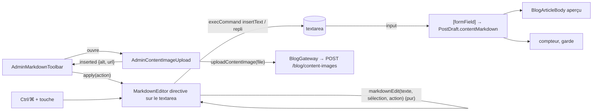

# 016 — Éditeur d'articles

## Description

### Contexte

Depuis la PR c1 de la spec 015, un article se rédige dans `/admin/blog/new` et `/admin/blog/:id`
(`AdminPostEditor` → `AdminPostForm`) : une zone Markdown brute (`textarea` possédé par
`[formField]`), un aperçu rendu par `parseMarkdown` (marked + DOMPurify, ADR-0002), une couverture
téléversée par `POST /blog/posts/:id/image`. La spec 015 avait exclu l'« éditeur Markdown riche ».

Le propriétaire veut écrire sans retenir la syntaxe, mettre des images dans le texte, et publier des
blocs de code lisibles.

### Ce qui est attendu

1. Une **barre de mise en forme** au-dessus de la zone Markdown : gras, italique, souligné, barré,
   niveaux de titre, lien, listes, citation, code en ligne, bloc de code avec langage, image,
   séparateur. Raccourcis clavier, annulation (Ctrl+Z) préservée.
2. Des **images dans le corps** de l'article, en plus de la couverture, téléversées depuis l'éditeur.
3. Des **blocs de code colorés** « comme sur Obsidian » sur le site public et dans l'aperçu, avec
   l'étiquette du langage et un bouton « Copier ».

### Décisions validées par le propriétaire (2026-10-07)

1. **Taille du texte = niveaux de titre** : menu « Paragraphe / Titre 2 / Titre 3 / Titre 4 », pas de
   taille libre. Le `h1` reste le titre de l'article.
2. **Images du corps téléversées depuis l'éditeur** : bouton « Image », choix du fichier, texte
   alternatif obligatoire, envoi à l'API (AVIF sur S3, comme la couverture), ``
   inséré au curseur. **Nouvel endpoint API**, déployé avant le front.
3. **Coloration syntaxique** calculée au build et au prérendu, **sans JavaScript ajouté pour le
   lecteur** ; thème clair et sombre dans l'esprit d'Obsidian, sur les tokens du site ; étiquette du
   langage et bouton « Copier » ; langages : TypeScript, JavaScript, HTML, CSS, SCSS, JSON, Bash,
   SQL, YAML, Markdown, Dockerfile, Python.
4. **Ordre** : après la PR c2 de la spec 015 (`feat/admin-audience`), qui touche aussi
   `src/styles.css` et `DESIGN.md`.

### Hors périmètre

- Éditeur WYSIWYG, bibliothèque d'éditeur (CodeMirror, ProseMirror, Milkdown…) : la zone reste un
  `textarea` Markdown.
- Boutons pour les tableaux GFM, `<kbd>`, `<details>`, notes de bas de page : ils restent saisissables
  à la main (DOMPurify les laisse passer, ADR-0002).
- Taille libre du texte, couleurs du texte, alignements.
- Variantes de taille des images du corps (`srcset`) : une image est servie telle que stockée
  (AVIF ≤ 1 600 px), comme la galerie (ADR-0009 §5).
- Balayage des images orphelines (ADR-0015 §5).
- Éditeur de projet : rien ne change.

### Contraintes

- `CLAUDE.md`, `DESIGN.md`, `.claude/project-profile.md` : Signal Forms, Tailwind seul, tokens
  OKLCH, `@utility` réservé aux éléments non enveloppables (ADR-0003), Two Registers Rule,
  WCAG 2.2 AA, cibles de 44 px dans l'admin.
- CSP stricte de production (`apply-csp-hashes.mjs`) : aucun gestionnaire inline, aucun attribut
  `style` dans le HTML prérendu sans hachage ; DOMPurify retire `style` (`FORBID_ATTR`).
- `parseMarkdown` reste le **seul** point d'assainissement (ADR-0002).
- API dans un dépôt séparé (`nest-portfolio-app`, NestJS 11, Drizzle, Jest) : item 10 de
  `CLAUDE.md` (API déployée avant le merge du front qui en dépend).

## Arbitrages

Recommandations du plan, **à confirmer** par le propriétaire avant la PR concernée.

- **A. Souligné.** Le Markdown n'a pas de soulignement ; la barre insère `<u>…</u>`, que DOMPurify
  conserve (essai : `<u>`, `<s>` et `<del>` passent avec le profil `html`). Sur le web, un texte
  souligné se lit comme un lien. *Recommandation : garder le bouton* et donner à `<u>` un trait
  épais en `foreground/40`, décalé de 0,3 em, **dans la couleur du texte**, alors que les liens sont
  indigo (`prose-a:text-primary`) ; l'usage restera rare. Alternative : retirer le bouton (Ctrl+U
  devient alors inactif).
- **B. Couleurs du code et One Indigo Rule.** Une coloration « comme Obsidian » emploie six teintes ;
  `DESIGN.md` n'en admet qu'une. *Recommandation : exception bornée aux blocs de code* (`pre code`),
  inscrite dans `DESIGN.md`, l'indigo gardant les mots-clés. Alternative : thème monochrome (indigo,
  `foreground`, `muted`), moins lisible.
- **C. Nettoyage des images.** *Recommandation : minimum viable d'ADR-0015* : rien n'est supprimé à
  l'édition ; à la suppression d'un article, ses images que nul autre article ne cite sont
  supprimées ; les orphelins (envoi abandonné, image retirée du texte) sont acceptés.
- **D. Raccourcis.** Ctrl (⌘) + B gras, I italique, U souligné, K lien, E code en ligne ; aucun
  raccourci pour le barré, les titres et les listes. Aucun Ctrl+Alt : sur AZERTY Windows, AltGr vaut
  Ctrl+Alt et produit `@`, `#`, `{`. À confirmer : Firefox pourrait garder Ctrl+K et Ctrl+E pour sa
  barre de recherche (vérifié au navigateur, § 10).
- **E. Presse-papiers en test.** Si `navigator.clipboard` de happy-dom ne suffit pas à prouver la
  copie, le presse-papiers entre dans la liste fermée des frontières d'I/O du profil (comme
  `localStorage`). Sinon, rien à changer.
- **F. Langage par défaut du bloc de code.** Le bouton insère ```` ```ts ```` avec `ts` sélectionné
  (le plus fréquent sur ce blog), que l'on remplace en tapant.

### Réponses du propriétaire (2026-10-07)

- **A, souligné** : gardé, en `<u>` avec un style distinct d'un lien (trait épais couleur du texte ; les liens restent indigo).
- **B, couleurs du code** : palette Obsidian acceptée, exception limitée aux blocs de code, contrastes ≥ 4,5:1 dans les deux thèmes.
- **C, nettoyage des images** : minimum viable. Suppression des images du corps à la suppression d'un article, si aucun autre article ne les cite ; une image retirée du texte reste stockée.
- **D, raccourcis** : Ctrl/⌘ + B, I, U, K, E retenus par défaut, à vérifier au navigateur (Firefox).
- **E, presse-papiers en test** : accepté comme frontière d'entrée-sortie simulable.
- **F, bloc de code** : ```ts inséré avec « ts » présélectionné.

## Plan technique

> Profil lu (`.claude/project-profile.md`). Validation runtime aux frontières non vérifiée (adapters
> purs, pas de lib côté front) : inchangé. ADR : **ADR-0014** (coloration et corps non hydraté),
> **ADR-0015** (images du corps). Une dépendance nouvelle : `highlight.js`. Une évolution d'API, sans
> migration.

### 1. Décisions structurantes

| # | Décision | Pourquoi |
|---|---|---|
| D1 | La barre **insère du Markdown dans le `textarea` existant**, aucune bibliothèque d'éditeur | Demande ; l'aperçu et la garde de sortie restent inchangés |
| D2 | Écriture par `document.execCommand('insertText')` sur une plage sélectionnée ; repli `setRangeText` + `InputEvent('input')` si la commande est absente ou renvoie `false` | `insertText` est la seule voie qui inscrit la modification dans la **pile d'annulation native** (Ctrl+Z / Ctrl+Shift+Z) et émet `input` ; `setRangeText` n'y entre pas. `execCommand` est marqué obsolète sans remplaçant ; le repli ne sert qu'aux environnements sans la commande (happy-dom) |
| D3 | **Signal Forms reste seul propriétaire de la valeur** : la barre ne touche jamais le modèle, elle modifie le DOM et laisse `[formField]` lire l'événement `input` (`host.listenToDom('input', …)`, `@angular/forms` 22, `signals.mjs`) | Une seule voie d'écriture, la même que la frappe : compteur de modifications, aperçu et garde suivent sans code ; Ctrl+Z émet aussi `input` |
| D4 | Pas d'`aria-pressed` ; le **niveau de bloc** est un `select` qui reflète la ligne du curseur | Les boutons insèrent des marqueurs : un état « pressé » mentirait sur une source Markdown. Le niveau, lui, est un état lisible de la ligne |
| D5 | Raccourcis Ctrl/⌘ + B, I, U, K, E (`event.key`, donc indépendants de la disposition), refusés si Alt ou Maj est enfoncé | Arbitrage D (AltGr) |
| D6 | **highlight.js 11** (cœur + 12 grammaires) dans le renderer `code` de `parseMarkdown`, sortie à classes `hljs-*`, thème par tokens | ADR-0014 ; mesures § 7 |
| D7 | **Corps d'article dans `BlogArticleBody` sous `@defer (on immediate; hydrate never)`**, recréé par `@for (current of [p]; track current.id)` | ADR-0014 : 0 Ko de rendu Markdown chargé sur une arrivée directe, au lieu de 24,6 Ko gzip aujourd'hui |
| D8 | **« Copier » par délégation** : bouton statique émis par le renderer, directive `CodeCopy` sur un ancêtre hydraté | ADR-0014 ; CSP inchangée, rejoué par `withEventReplay()` |
| D9 | `POST /blog/content-images`, sans rattachement en base, utilisable depuis `/admin/blog/new` | ADR-0015 |
| D10 | Dimensions intrinsèques dans la clé (`blog-content/<uuid>-<sha8>-<l>x<h>.avif`), relues par le renderer `image` | ADR-0015 ; pas de CLS sans table |
| D11 | `<u>` conservé, stylé autrement qu'un lien | Arbitrage A |
| D12 | Trois PR : API (A1-A2) et front « rendu » (R1-R4) indépendantes ; front « barre » (E1-E4) après le déploiement de l'API et le merge du « rendu » | § 9 |

### 2. Architecture

**Rendu (site public, aperçu admin, RSS)**

```
contentMarkdown ──▶ parseMarkdown(md, { topHeadingLevel, codeCopyButton })        features/blog/infra
                      ├─ renderer heading  (existant)
                      ├─ renderer code   ──▶ resolveCodeLanguage (domain) ─▶ highlightCode (hljs)
                      │                     └─▶ renderCodeBlock : barre (étiquette, bouton) + pre tabindex=0
                      ├─ renderer image  ──▶ contentImageSize(href) ─▶ width/height, lazy, async
                      └─ DOMPurify (profil html, sans style)   ← seul assainissement (ADR-0002)
                    ▼
BlogArticleBody (application/components)   bypassSecurityTrustHtml → div [innerHTML]
   ├─ BlogDetail : <div appCodeCopy> @for(track id) @defer(on immediate; hydrate never) <body/> </div>
   │              + <p role="status" sr-only>{{ codeCopy.status() }}</p>
   └─ AdminPostForm (aperçu « Rendu ») : même composant, topHeadingLevel 2, même directive
generate-rss.mjs : parseMarkdown(md) sans bouton (option par défaut)
```

**Édition (admin)**



- **Frontière presenter / composant.** La dérivation non triviale (où insérer, quoi sélectionner
  ensuite, niveau de la ligne, raccourci → action, index de focus suivant) vit dans des **fonctions
  pures** testées sans TestBed (`markdown-edit.ts`, `markdown-shortcut.ts`, `toolbar-focus.ts`) ;
  la directive ne fait que la glue DOM (focus, sélection, commande), la barre que le rendu et le
  clavier. Aucun presenter-classe : il n'y a pas d'état dérivé partagé entre plusieurs vues.
- **Décomposition.** `MarkdownEditor` (directive, DOM du `textarea`), `AdminMarkdownToolbar`
  (contrôles, focus itinérant, annonce), `AdminContentImageUpload` (fichier, texte alternatif,
  envoi). `BlogArticleBody` et `CodeCopy` côté blog.
- **Dépendances.** `admin → blog (domain, application, infra)` comme aujourd'hui (`parseMarkdown`,
  `BlogPostRow`) ; `blog` n'importe jamais `admin`. `BlogArticleBody` importe
  `../../infra/parse-markdown` : même écart à la règle `application ↛ infra` que `blog-detail.ts` et
  `admin-post-form.ts` aujourd'hui, déplacé et non aggravé.
- **Landmarks.** Aucun landmark ajouté ; la barre est un `role="toolbar"` dans le `fieldset`
  « 02 · Contenu ».
- **Formulaire imbriqué.** Le panneau d'image vit **dans** `<form id="post-form">` : il n'a pas de
  `<form>` propre (HTML interdit l'imbrication). C'est un `div role="group"` ; ses boutons sont
  `type="button"` et Entrée dans le champ de texte alternatif est interceptée (sinon la soumission
  implicite enregistre l'article). Tous les boutons de la barre sont `type="button"`.

### 3. Tokens et contrastes (calculés)

Formule : OKLCH → sRGB (matrices d'Ottosson), luminance relative WCAG 2.x, ratio
`(L1 + 0,05) / (L2 + 0,05)`. Fond des blocs = `foreground` à 4 % sur `background`
(`#141415` Console, `#efece7` Ivoire). Script : scratchpad de session (`contrast.py`), à rejouer par
la revue si une valeur bouge.

| Token `--theme-code-*` | Console (valeur, ratio) | Ivoire (valeur, ratio) | Classes `hljs-*` |
|---|---|---|---|
| `keyword` | `oklch(74.5% 0.16 277)` 7,71 | `oklch(43.3% 0.21 278)` 7,47 | `keyword`, `literal`, `doctag`, `meta` |
| `function` | `oklch(72% 0.157 296)` 7,07 | `oklch(45.7% 0.244 297)` 7,08 | `title`, `section`, `built_in`, `type` |
| `string` | `oklch(72.3% 0.19 145)` 8,08 | `oklch(49% 0.14 150)` 4,98 | `string`, `regexp`, `addition`, `template-tag` |
| `number` | `oklch(76.6% 0.16 70)` 8,54 | `oklch(51% 0.155 47)` 5,20 | `number`, `symbol`, `bullet`, `variable`, `template-variable`, `attr` |
| `tag` | `oklch(71.5% 0.18 22)` 6,73 | `oklch(50.5% 0.213 27.5)` 5,47 | `name`, `selector-tag`, `selector-id`, `selector-class`, `selector-attr`, `selector-pseudo`, `attribute`, `deletion` |
| `comment` | `oklch(70.4% 0.011 286)` 7,01 | `oklch(43.8% 0.013 56)` 6,69 | `comment`, `quote` |
| (texte par défaut) | `foreground` 17,7 | `foreground` 13,02 | `property`, `params`, `punctuation`, `operator`, `subst` |

- Valeurs littérales, pas des `var(--theme-status-*)` : le code ne doit pas changer de couleur si un
  statut change. Les teintes Console reprennent celles des tokens existants ; en Ivoire, le vert et
  l'ambre des statuts (`green-600` 3,08, `amber-600` 3,10) échouent et sont assombris.
- Pas d'italique sur les commentaires (JN Mono n'a que la graisse 500 et pas d'italique : on
  obtiendrait un oblique synthétique) ; `hljs-strong` reste en 500.
- Code en ligne : `text-primary` sur `foreground/6` = 7,37 (Console), 7,19 (Ivoire).
- Exposition : `--color-code-*: var(--theme-code-*)` dans `@theme`, consommés par
  `@utility code-syntax` (`color: var(--color-foreground)` sur le `code`, puis une règle descendante
  par rôle).

### 4. Modèles de données

```ts
// features/blog/domain/code-language.ts — catalogue pur, partagé par l'infra et l'indication de l'admin
export type CodeLanguageId =
  | 'typescript' | 'javascript' | 'html' | 'css' | 'scss' | 'json'
  | 'bash' | 'sql' | 'yaml' | 'markdown' | 'dockerfile' | 'python';
export type CodeLanguage = {
  readonly id: CodeLanguageId;
  readonly label: string;               // « TypeScript », « HTML », « Dockerfile »…
  readonly aliases: readonly string[];  // premier = identifiant affiché dans l'indication (ts, js, html…)
};
export const CODE_LANGUAGES: readonly CodeLanguage[];
export function resolveCodeLanguage(info: string | undefined): CodeLanguage | null; // premier mot, insensible à la casse

// features/blog/infra/highlight-code.ts — compile-time : chaque id du catalogue a sa grammaire
const GRAMMARS = { typescript, javascript, html: xml, /* … */ } satisfies Record<CodeLanguageId, LanguageFn>;

// features/blog/domain/models/content-image.model.ts
export type ContentImage = { readonly url: string; readonly width: number; readonly height: number };

// features/blog/infra/content-image-size.ts
export function contentImageSize(href: string): { readonly width: number; readonly height: number } | null;
// …/blog-content/<uuid>-<sha8>-<l>x<h>.avif → dimensions ; toute autre URL → null (pas d'attribut)

// features/admin/application/markdown-edit.ts — union discriminée : une action incomplète ne compile pas
export type TextSelection = { readonly start: number; readonly end: number };
export type InlineFormat = 'bold' | 'italic' | 'underline' | 'strikethrough' | 'inline-code';
export type BlockLevel = 'paragraph' | 'h2' | 'h3' | 'h4';
export type LinePrefix = 'bullet-list' | 'ordered-list' | 'quote';
export type MarkdownAction =
  | { readonly kind: 'inline'; readonly format: InlineFormat }
  | { readonly kind: 'block-level'; readonly level: BlockLevel }
  | { readonly kind: 'line-prefix'; readonly prefix: LinePrefix }
  | { readonly kind: 'link' }
  | { readonly kind: 'code-block' }
  | { readonly kind: 'rule' }
  | { readonly kind: 'image'; readonly alt: string; readonly url: string };
export type MarkdownEdit = {
  readonly from: number; readonly to: number;   // plage remplacée
  readonly text: string;                         // texte inséré
  readonly selection: TextSelection;             // sélection après l'édition
};
export function markdownEdit(text: string, selection: TextSelection, action: MarkdownAction): MarkdownEdit;
export function blockLevelAt(text: string, caret: number): BlockLevel | null; // null : h1, h5, h6
```

Contrat de `markdownEdit` (triangulé en `it.each` par `qa`) :

| Action | Sélection non vide | Sélection vide |
|---|---|---|
| inline (`**`, `*`, `<u>…</u>`, `~~`, `` ` ``) | entoure ; les espaces de bord restent hors des marqueurs ; sélection = texte intérieur ; **retire** les marqueurs si la sélection en est déjà entourée (dedans ou dehors) ; sur plusieurs lignes, chaque ligne non vide | insère la paire, curseur au milieu |
| block-level | lignes touchées : préfixe `#{1,6} ` retiré puis `## `/`### `/`#### ` ajouté ; `paragraph` retire seulement | ligne du curseur |
| line-prefix (`- `, `1. ` numérotés depuis 1, `> `) | bascule : retire si toutes les lignes non vides l'ont, sinon ajoute (une liste remplace l'autre) ; sélection = bloc | ligne du curseur |
| link | `[sel](https://)`, `https://` sélectionné | `[](https://)`, curseur entre crochets |
| code-block | paragraphe propre : ```` ```ts ````, la sélection, ```` ``` ```` ; `ts` sélectionné (arbitrage F) | idem, corps vide |
| rule | `---` en paragraphe propre, curseur après | idem |
| image | `` en paragraphe propre, curseur après ; `alt` : `\`, `[`, `]` échappés, retours à la ligne → espace, rogné | idem |

« Paragraphe propre » : ligne vide avant (sauf début du texte) et après (sauf fin).

API (`nest-portfolio-app`) : réponse `ContentImageResponse = { url: string; width: number; height:
number }` (`url` relative) ; côté front, type API dans `http-blog.gateway.ts` (précédent : la
réponse `{ key }` de la couverture y est typée en ligne), résolution `API_BASE_URL + url` par la
même fonction que `resolvePost` (extraite en `resolveApiUrl`).

### 5. Réactivité et état partagé

- **Aucun store, aucune facade** : tout l'état est local et instance-scopé.
- `MarkdownEditor` (directive, `exportAs: 'markdownEditor'`) : `private readonly _snapshot =
  signal<{ text; selection }>` mis à jour sur `input`, `select`, `keyup`, `pointerup`, `focus` de
  l'hôte ; `readonly blockLevel = computed(() => blockLevelAt(...))` exposé en lecture seule ;
  `apply(action)` impératif (méthode, pas `effect`). Le `DOCUMENT` est injecté (pas de `document`
  global), l'`ElementRef` de l'hôte aussi.
- `AdminMarkdownToolbar` : `editor = input.required<MarkdownEditor>()`, `activeIndex =
  signal(0)`, `imagePanelOpen = signal(false)`, `status = signal('')`. Le `select` lit
  `editor().blockLevel()` en `[value]` et écrit par `(change)` (convention `CLAUDE.md` des `select`
  hors formulaire).
- `AdminContentImageUpload` : modèle `signal({ alt: '' })` + `form(model, imageAltSchema)` **sans
  `[formRoot]`** (pas de `<form>`, § 2) ; `submit(this.altForm, action)` déclenché par le bouton et
  par Entrée ; `file = signal<File | null>`, `uploading = signal(false)`, `error = signal('')` ;
  l'envoi est un `firstValueFrom` dans l'action de soumission, pas un `subscribe`.
- `CodeCopy` : `status = signal('')` exposé en lecture seule (`.asReadonly()`), minuterie de 2 s
  annulée par `DestroyRef`.
- `BlogArticleBody` : `html = computed(...)` sur `markdown` et `topHeadingLevel`.
- Immutabilité : modèles `readonly`, aucune mutation de signal hors `set`/`update`. Écart sanctionné :
  `CodeCopy` écrit le texte du bouton cliqué (« Copié ») dans le DOM non hydraté, que rien d'autre ne
  gère.

### 6. Fichiers

**PR API — `nest-portfolio-app`, branche `feat/blog-content-images`**

| Fichier | Rôle |
|---|---|
| `src/blog/blog-content-image.ts` (+spec) | Pur : `CONTENT_IMAGE_PREFIX = 'blog-content/'`, `contentImageKey(id, hash, width, height)`, `contentImageKeysIn(markdown)` (clés `blog-content/…avif` citées par une URL `…/storage/portfolio-storage/…`, dédoublonnées) |
| `src/blog/blog-content-images.service.ts` (+spec) | `upload(file)` : `ImageOptimizer.optimize` → clé → `StorageService.upload` → `{ url: getPublicUrl, width, height }` ; `removeUnreferenced(keys, excludingPostId)` |
| `src/blog/blog-content-images.controller.ts` (+spec) | `@Controller('blog/content-images')`, `@Post()` : `JwtAuthGuard`, `AdminWriteThrottle`, `FileInterceptor('file')`, `ParseFilePipe` (5 Mo, `webp\|jpeg\|png\|avif`, 422), Swagger (201, 401, 413, 422) |
| `src/blog/blog.service.ts` (+spec) | `remove()` : après la suppression de la ligne et de la couverture, `removeUnreferenced(contentImageKeysIn(current.contentMarkdown))` |
| `src/blog/blog.module.ts` | Déclare le contrôleur et le service |

Aucune migration, aucune table.

**PR front « rendu » — branche `feat/blog-rendu-code` (R1 à R4)**

| Fichier | Rôle |
|---|---|
| `features/blog/domain/code-language.ts` (+spec) | Catalogue des 12 langages, `resolveCodeLanguage` |
| `features/blog/infra/highlight-code.ts` (+spec) | `highlight.js/lib/core` + 12 grammaires (imports `highlight.js/lib/languages/*`, export ESM du paquet), `highlightCode(code, language)` : HTML échappé, `ignoreIllegals: true` |
| `features/blog/infra/render-code-block.ts` | Gabarit HTML du bloc : conteneur `not-prose` `data-code-block`, barre (étiquette, bouton `data-code-copy` facultatif), `pre tabindex="0"`, `code class="code-syntax language-<id>"` ; classes utilitaires écrites dans le source (scannées par Tailwind) |
| `features/blog/infra/content-image-size.ts` (+spec) | Dimensions lues dans l'URL d'une image du corps |
| `features/blog/infra/parse-markdown.ts` (+spec) | Renderers `code` et `image` ; option `codeCopyButton` (défaut `false`) |
| `features/blog/application/components/blog-article-body.ts` (+spec) | Corps assaini, classes `prose` du site (déplacées de `blog-detail.ts`), code en ligne, `<u>`, images |
| `features/blog/application/components/code-copy.ts` (+spec) | Directive `[appCodeCopy]`, `exportAs: 'appCodeCopy'` : clic délégué → presse-papiers, `status`, « Copié » pendant 2 s |
| `features/blog/application/blog-detail.ts` (+spec) | `@for` + `@defer (on immediate; hydrate never)` + `@placeholder` + `@error` (lien de rechargement) ; `appCodeCopy` et région `role="status"` ; retrait de `DomSanitizer`, `parseMarkdown`, `renderedContent` |
| `features/admin/application/components/admin-post-form.ts` (+spec) | Aperçu par `BlogArticleBody` (`topHeadingLevel` 2) + `appCodeCopy` + statut ; retrait de `DomSanitizer` et du `replaceAll('<pre>', …)` (le renderer pose `tabindex`) |
| `src/styles.css` | Tokens `--theme-code-*` (deux registres), `--color-code-*` dans `@theme`, `@utility code-syntax` |
| `DESIGN.md` | § « Bloc de code » (structure, tokens, bouton) ; exception de la One Indigo Rule (arbitrage B) ; `<u>` et code en ligne |
| `package.json`, `pnpm-lock.yaml` | `highlight.js` `^11.12.0` en `dependencies` (comme `marked`) |

**PR front « barre » — branche `feat/admin-barre-markdown` (E1 à E4)**

| Fichier | Rôle |
|---|---|
| `features/admin/application/markdown-edit.ts` (+spec) | `markdownEdit`, `blockLevelAt` (purs) |
| `features/admin/application/markdown-shortcut.ts` (+spec) | `shortcutAction({ key, ctrlKey, metaKey, altKey, shiftKey })` → `MarkdownAction \| null` |
| `features/admin/application/toolbar-focus.ts` (+spec) | `nextToolbarIndex(current, key, count)` : flèches avec retour au début, Début, Fin |
| `features/admin/application/markdown-toolbar-controls.ts` | Constante des boutons (libellé, icône, action, raccourci `aria-keyshortcuts`), groupes |
| `features/admin/application/components/markdown-editor.ts` (+spec) | Directive `textarea[appMarkdownEditor]` (D2, D5) |
| `features/admin/application/components/admin-markdown-toolbar.ts` (+spec) | Barre, focus itinérant, `select` de niveau, bouton Image (`aria-expanded`), annonce |
| `features/admin/application/components/admin-content-image-upload.ts` (+spec) | Panneau d'image : `FileDropzone`, texte alternatif, envoi, erreurs |
| `features/admin/application/components/admin-image-alt-schema.ts` | `git mv` de `admin-gallery-alt-schema.ts`, export renommé `imageAltSchema` (2 consommateurs de plus : la galerie l'importe, `admin-gallery-upload-form.ts` et `admin-gallery-image-item.ts` mis à jour) |
| `features/admin/application/components/admin-post-form.ts` (+spec) | Barre au-dessus de la zone, directive sur le `textarea`, indication `post-content-hint` (`aria-describedby`) |
| `features/blog/domain/models/content-image.model.ts` | `ContentImage` |
| `features/blog/domain/gateways/blog.gateway.ts` | `abstract uploadContentImage(file: File): Observable<ContentImage>` |
| `features/blog/infra/http-blog.gateway.ts` (+spec) | `POST {api}/blog/content-images` (FormData `file`), URL résolue par `resolveApiUrl` |
| `features/blog/testing/stub-blog-gateway.ts`, `blog-post-builders.ts` | Méthode de la doublure, `makeContentImage()` |
| `shared/icons/icon-map.ts`, `public/icons/sprite.svg` | `bold`, `italic`, `underline`, `strikethrough`, `link`, `image`, `list-ul`, `list-ol`, `quote-left`, `file-code`, `minus` (`code` existe) ; `pnpm icons:build` |

**Réutilisé tel quel** : `parseMarkdown` (seul assainissement), `FileDropzone`, `galleryAltSchema`
(renommé), la table d'erreurs d'envoi d'`AdminProjectGallery` (413 / 422, même forme, libellés
propres), `ImageOptimizer`, `contentHash`, `deleteS3IfExists`, `AdminWriteThrottle`, le motif
`@for (x of [cle]; track x)` de recréation, l'injection d'un gateway dans un composant d'édition
(précédent `AdminProjectGallery`). **Écart justifié** : le panneau d'image ne réutilise pas
`AdminGalleryUploadForm` (un `<form>` à soumission propre, interdit dans le formulaire d'article, et
des libellés de galerie) ; il en reprend le schéma et la zone de dépôt.

### 7. Bibliothèques

- **`highlight.js` 11.12.0** (BSD-3-Clause, exports ESM `./lib/core` et `./lib/languages/*`,
  types inclus) : **83,6 Ko minifiés / 23,3 Ko gzip** pour le cœur et les 12 grammaires (esbuild
  `--minify`, `gzip -9`). Comparaison et rejet de Shiki (878,9 / 144,3 Ko, styles inline) et de
  Prism (43,2 / 16,3 Ko, global mutable) : ADR-0014.
- **Doit-il tourner dans le navigateur ?** Oui, à deux endroits seulement : l'aperçu en direct de
  l'admin (chunk admin, +23,3 Ko gzip) et une navigation interne vers un article (chunk différé de
  `BlogArticleBody`, chargé à la demande). Sur une arrivée directe, rien : le bloc `hydrate never`
  ne télécharge ni highlight.js, ni marked, ni DOMPurify (−24,6 Ko gzip mesurés sur le chunk actuel,
  `chunk-DdQaO-sR.js` du build du 2026-10-07).
- **Pas de `marked-highlight`** : le renderer `code` doit émettre la barre ; l'extension n'apporterait
  que l'appel à `highlight`.
- **Rien côté barre** : `execCommand`, `setSelectionRange`, `navigator.clipboard` sont natifs.
- API : aucune dépendance (sharp, Multer, `@nestjs/throttler` déjà présents).

### 8. Tranches

Chaque tranche est verticale et passe sans les suivantes. `qa` écrit les tests de **la** tranche
courante.

#### PR API (`nest-portfolio-app`, Jest)

- **Tranche A1 — téléverser une image de corps.** Contrôleur, service, `contentImageKey`, module.
  Tests : clé `^blog-content/[0-9a-f-]{36}-[0-9a-f]{8}-1600x900\.avif$` pour une sortie
  d'optimiseur 1600 × 900 ; `upload` appelé avec le tampon AVIF et `image/avif` ; réponse
  `{ url: getPublicUrl(bucket, key), width, height }` ; aucune écriture en base ; validateurs du pipe
  (type refusé ou fichier absent → 422, `it.each` ; plus de 5 Mo → 413, limite Multer) ; métadonnées : garde JWT, throttle admin (précédent
  `throttle.spec.ts`).
- **Tranche A2 — supprimer un article retire ses images de corps orphelines.** `contentImageKeysIn`,
  `removeUnreferenced`, `BlogService.remove`. Tests : extraction (`it.each` : URL absolue de prod,
  `/storage/…` relative, `/api/storage/…`, doublon, couverture `blog/…` ignorée, autre bucket ignoré,
  aucune image) ; une clé citée par un autre article n'est pas supprimée ; les autres le sont ;
  ordre « base puis S3 » ; la couverture reste supprimée comme avant.

#### PR front « rendu » (`feat/blog-rendu-code`)

- **Tranche R1 — un bloc de code avec langage est coloré, étiqueté et défilable au clavier.**
  Catalogue, `highlightCode`, `renderCodeBlock`, renderer `code`, tokens et `code-syntax`,
  `DESIGN.md`, dépendance. Visible sans autre changement : `BlogDetail` et l'aperçu admin appellent
  déjà `parseMarkdown`. Tests : `it.each` sur les 12 langages et leurs alias (`ts`, `html`, `sh`,
  `shell`, `yml`, `md`, `docker`, `py`) → étiquette et au moins un `span.hljs-*` ; langage inconnu ou
  absent → texte échappé, sans étiquette ni `hljs` ; `<script>` dans un bloc rendu en texte ;
  `pre` avec `tabindex="0"` ; aucun attribut `style` ; pas de bouton sans l'option. Test existant
  modifié : `toContain('<pre>')` devient l'attente de `tabindex`.
- **Tranche R2 — le corps s'affiche sans charger le rendu Markdown chez le lecteur.**
  `BlogArticleBody`, `BlogDetail` (`@for` + `@defer`), aperçu admin. Tests (spécs de composant en
  `DeferBlockBehavior.Playthrough`) : contenu rendu et assaini ; passage de l'article A à l'article B
  sur la même instance → corps de B (garde-fou du `track id`) ; aperçu admin inchangé (rendu, suivi
  de la saisie, `h1` abaissé, assaini). La non-hydratation se prouve au navigateur (§ 10).
- **Tranche R3 — copier un bloc de code.** Option `codeCopyButton`, `CodeCopy`, région de statut
  dans `BlogDetail` et l'aperçu. Tests : bouton présent avec l'option seulement ; clic → texte exact
  du `code` (sans l'étiquette) dans le presse-papiers (`navigator.clipboard.readText()` de happy-dom,
  arbitrage E sinon) ; statut « Code copié dans le presse-papiers » ; bouton « Copié » puis
  « Copier » après 2 s (`vi.useFakeTimers`) ; échec de l'écriture → « Copie impossible :
  sélectionnez le code. » ; clic hors bouton → rien.
- **Tranche R4 — images du corps sans décalage, souligné et code en ligne distincts.**
  `contentImageSize`, renderer `image`, classes du corps. Tests : `it.each` d'URL (clé valide → `width`
  et `height` ; autre hôte, couverture, motif incomplet → sans dimensions) ; `loading="lazy"` et
  `decoding="async"` toujours ; `alt` conservé ; `<u>` conservé, `style` retiré.

#### PR front « barre » (`feat/admin-barre-markdown`)

- **Tranche E1 — gras, italique, souligné, barré, code en ligne, depuis la barre et au clavier.**
  Structure porteuse : `markdownEdit` (actions `inline`), `shortcutAction`, `nextToolbarIndex`,
  directive, barre, intégration au formulaire, icônes. Tests : contrat inline (tableau § 4, `it.each`) ;
  raccourcis (`it.each` : Ctrl, ⌘, Maj ou Alt refusés, touche inconnue) ; focus (`it.each`) ; barre :
  `role="toolbar"`, nom, `aria-controls`, un seul `tabindex="0"`, flèches, Début, Fin ; clic sur
  « Gras » → `value().contentMarkdown` du formulaire mis à jour, sélection sur le texte intérieur,
  focus revenu au `textarea`, statut annoncé ; Ctrl+B dans le `textarea` → même résultat ; boutons
  `type="button"` (aucune soumission). Le chemin `execCommand` est vérifié au navigateur (absent de
  happy-dom ; on ne le simule pas).
- **Tranche E2 — niveau de bloc.** Actions `block-level`, `blockLevelAt`, `select`. Tests :
  contrat (`it.each`) ; le `select` suit la ligne du curseur (h2 → « Titre 2 », ligne vide →
  « Paragraphe », `#####` → option neutre) ; choisir « Titre 3 » réécrit la ligne ; Gauche/Droite sur
  le `select` déplacent le focus, Haut/Bas non.
- **Tranche E3 — listes, citation, lien, bloc de code, séparateur.** Actions `line-prefix`, `link`,
  `code-block`, `rule`. Tests : contrat (`it.each`, dont la numérotation et la bascule) ; un test de
  bout en bout par bouton.
- **Tranche E4 — image dans le corps.** Modèle, gateway, doublure, panneau, schéma renommé. Tests :
  gateway (`POST`, `FormData` avec `file`, URL résolue absolue) ; panneau : ouverture
  (`aria-expanded`), texte alternatif obligatoire et fichier obligatoire (messages `role="alert"`),
  Entrée dans le champ n'enregistre pas l'article (aucune émission `submitted`), succès →
  `` au curseur dans le modèle, panneau fermé, focus au `textarea`, « Image insérée » ;
  413 et 422 → messages, panneau ouvert, saisie gardée ; Échap et « Annuler » → focus au bouton
  Image ; sur `/admin/blog/new` (sans `id`), l'envoi part sans identifiant ; galerie toujours verte
  après le renommage.

### 9. Ordre de merge et de déploiement

1. Prérequis : PR c2 de la spec 015 mergée (intersection : `src/styles.css`, `DESIGN.md`,
   `admin-post-form.ts` possible).
2. **PR API** (A1, A2) : indépendante du front. Après merge et déploiement, preuve :
   `curl -s -o /dev/null -w '%{http_code}' -X POST https://api.nedellec-julien.fr/api/blog/content-images`
   rend `401` (route gardée) et non `404`.
3. **PR front « rendu »** (R1 à R4), depuis `master` après c2 : aucune dépendance à l'API. Elle doit
   être en ligne **avant** qu'un article ne cite une image de corps (dimensions, `lazy`). Gates :
   `pnpm install --frozen-lockfile` (le lockfile change) puis `pnpm run build --configuration
   production`. Après déploiement : HTML prérendu d'un article à code servi en prod contenant
   `hljs-` et `data-code-copy` ; `rss.xml` régénéré sans `data-code-copy`.
4. **PR front « barre »** (E1 à E4), depuis `master` **après** le merge du « rendu »
   (`admin-post-form.ts` dans les deux diffs) et **après** la preuve de l'étape 2 (item 10).
5. Les PR « rendu » et « barre » ne sont pas indépendantes ; l'API et le « rendu » le sont
   (dépôts distincts).

### 10. Vérification au navigateur (pas d'e2e)

Méthode du § 8 de la spec 015 (build de production servi en local, Playwright, requêtes vers l'API
interceptées, **aucune écriture en prod**). En plus :

- **Rendu** : arrivée directe sur un article à code → aucune réponse JS contenant `DOMPurify` ou
  `hljs` dans le journal réseau ; navigation `/blog` → article → les mêmes chunks arrivent et le
  corps s'affiche ; « article suivant » → corps du nouvel article ; axe-core WCAG 2.2 AA
  (`color-contrast` sur les jetons) dans les deux registres ; bouton « Copier » avec
  `grantPermissions(['clipboard-read', 'clipboard-write'])`, puis clic avant hydratation (réseau
  ralenti) rejoué ; pas de défilement horizontal à 375 px hors du `pre`.
- **Barre** (Chromium **et** Firefox) : chaque bouton puis **Ctrl+Z** restaure le texte d'avant en
  une étape, Ctrl+Maj+Z le rétablit ; Ctrl+B/I/U/K/E ne déclenchent ni la source de la page ni la
  recherche du navigateur (sinon : arbitrage D) ; clavier seul dans la barre ; `POST
  /blog/content-images` **servi par une réponse locale** (`route.fulfill`, fichier factice) pour
  prouver l'insertion, aucune requête vers la prod ; aperçu qui affiche l'image avec `width`/`height`.

### 11. Risques et inconnues

- `hydrate never` + instance de `BlogDetail` réutilisée + rejeu d'événements sur un sous-arbre
  déshydraté : ni happy-dom ni TestBed ne le prouvent ; si le navigateur contredit l'ADR-0014, repli :
  corps dans `BlogDetail` (+23,3 Ko gzip au lecteur), à rearbitrer.
- `execCommand('insertText')` est obsolète sans remplaçant : la conservation de l'annulation ne se
  prouve qu'au navigateur, et un navigateur qui la retirerait ferait tomber la barre sur le repli
  sans annulation.
- Les URL absolues dans le Markdown lient le contenu à `api.nedellec-julien.fr` (passage en même
  origine = réécriture SQL, ADR-0015) ; l'hypothèse « 5 Mo, quatre formats » reprend la couverture
  sans mesure propre aux captures d'écran de code.

## Plan de test

> Profil lu. Régime zoneless (aucun `fakeAsync`). Les deux tranches de la PR « rendu » R1 et R2 sont
> écrites dans la même invocation, à la demande de la session principale ; chaque bloc porte sa
> propre preuve. Base de `master` (`70b3b5b`) : 2510 tests verts, 169 fichiers.
>
> **Méthode de preuve.** `highlight.js` n'est pas installé (dépendance due au GREEN) et les modules
> `code-language.ts`, `highlight-code.ts`, `blog-article-body.ts` n'existent pas : sans eux, la
> compilation des spécs échoue sur l'import, ce qui est attendu. Pour prouver que le rouge tombe sur
> les **assertions**, trois squelettes jetables (catalogue vide, `resolveCodeLanguage` → `null`,
> `highlightCode` qui échappe sans colorer, composant au gabarit vide) ont été posés, la commande
> complète lancée, puis retirés. Une **implémentation jetable** (highlight.js 11.12.0 ajouté puis
> retiré, `package.json` et `pnpm-lock.yaml` restaurés, `pnpm install --frozen-lockfile`) a ensuite
> fait passer **2597 / 2597** tests : aucun test n'est inatteignable. Rien de cela ne reste dans l'arbre.

### Tranche R1 — un bloc de code avec langage est coloré, étiqueté et défilable au clavier

**Contrat de sortie fixé par les tests** (ce que le plan laissait ouvert est tranché ici) :

- `features/blog/domain/code-language.ts` : `CODE_LANGUAGES` (ordre et libellés ci-dessous),
  `resolveCodeLanguage(info: string | undefined): CodeLanguage | null` (premier mot, casse
  ignorée, renvoie l'entrée même du catalogue).
- `features/blog/infra/highlight-code.ts` : `highlightCode(code: string, language: CodeLanguageId): string`.
- Bloc rendu par `parseMarkdown` : un élément `[data-code-block]` par bloc, qui contient l'étiquette
  `[data-code-label]` (texte = libellé du catalogue) **avant** un `pre tabindex="0"` ; le `code`
  porte `language-<id>` (identifiant canonique : `ts` → `language-typescript`) et des `span` à
  classes `hljs-*`. Langage inconnu, absent ou bloc indenté : `pre tabindex="0"`, texte échappé,
  ni `[data-code-label]` ni `hljs`. Aucun `button`, aucun `[data-code-copy]` sans option.

| Fichier | Test | Scénario | Assertions clés |
|---|---|---|---|
| `domain/code-language.spec.ts` | catalogue (golden `toEqual`) | lecture de `CODE_LANGUAGES` | 12 couples `{ id, label }` dans l'ordre : TypeScript, JavaScript, HTML, CSS, SCSS, JSON, Bash, SQL, YAML, Markdown, Dockerfile, Python |
| | alias non partagés | chaque alias résolu | ≥ 20 alias ; chacun rend son propre langage |
| | `it.each` × 20 | `ts`, `typescript`, `js`, `javascript`, `html`, `css`, `scss`, `json`, `bash`, `sh`, `shell`, `sql`, `yaml`, `yml`, `md`, `markdown`, `dockerfile`, `docker`, `py`, `python` | `id` attendu |
| | `it.each` × 4 | `TS`, `Dockerfile`, `ts title="main.ts"`, `py {1,3}` | premier mot, casse ignorée |
| | `it.each` × 6 | `rust`, `tsx`, `plaintext`, `''`, `'   '`, `undefined` | `null` |
| | identité | `yml` | `toBe` l'entrée `yaml` du catalogue |
| `infra/highlight-code.spec.ts` | `it.each` × 12 | un extrait par langage | un jeton **propre à la grammaire** (`type` en `hljs-keyword` pour TS, `{` en `hljs-punctuation` pour JSON, `RUN` pour Dockerfile…) ; `textContent` = source |
| | échappement | `"<script>…</script>" & 1` en TS | `&lt;script&gt;`, `&amp;`, aucun `<script` brut, texte intact |
| | `ignoreIllegals` | `{ "a": 1, @@@ }` en JSON | `1` reste en `hljs-number` (sans l'option, highlight.js rend tout en texte brut) |
| | classes seules | HTML avec `<style>` | pas de `style="`, des `class="hljs-` |
| `infra/parse-markdown.spec.ts` | `it.each` × 20 (12 langages + alias `ts`, `js`, `sh`, `shell`, `yml`, `md`, `docker`, `py`) | bloc clôturé | étiquette, `language-<id>`, ≥ 1 `span.hljs-*`, texte du `code` = source, aucun attribut `style` ni `on*` dans le rendu |
| | `it.each` × 2 | `TS title="main.ts"`, `Python` | étiquette TypeScript, Python |
| | structure | texte, bloc `ts`, texte | 1 `[data-code-block]`, 1 `pre`, `tabindex="0"`, étiquette avant le `pre`, 0 bouton |
| | `it.each` × 3 | `rust`, sans langage, bloc indenté | texte `fn main() { let s = "<b>x</b>"; }` intact, 0 `b`, `tabindex="0"`, 0 étiquette, pas de `hljs` |
| | `it.each` × 3 | `<script>` dans un bloc `html`, sans langage, `rust` | 0 `script`, texte intact |
| | assainissement mixte | `<p style onclick>` + blocs `html` et `css` | aucun `style`/`on*` ; les deux blocs gardent leurs classes `hljs-*` |

**Test existant modifié** : `parse-markdown.spec.ts`, « convertit un bloc de code avec langage »
(`toContain('<pre>')` et `toContain('language-ts')`) est **remplacé** par le test de structure et
l'`it.each` ci-dessus : le `pre` porte désormais `tabindex="0"` et la classe devient
`language-typescript`. Aucun autre test existant ne change dans R1. L'aperçu admin
(« Given a code block … reachable with the keyboard ») reste tel quel : il passera par le
renderer au lieu du `replaceAll('<pre>', …)`.

**Hors test unitaire (revue et navigateur)** : tokens `--theme-code-*` des deux registres,
`--color-code-*`, `@utility code-syntax` et `DESIGN.md` (aucun test source-based : `tsconfig.spec`
n'a pas les types Node, et le contraste se prouve par `contrast.py` et axe `color-contrast`, § 10).
Limite connue : `html` ⊂ `markdown`, `css` ⊂ `scss`, `javascript` ⊂ `typescript` en grammaire ; un
échange entre ces paires dans `GRAMMARS` ne serait pas détecté par le jeton choisi.

**Tests verts dès le squelette (gardes, pas des preuves de rouge)** : les 6 cas « aucun langage » de
`resolveCodeLanguage`, l'échappement de `highlightCode` et les 3 « script en texte » de
`parseMarkdown` (marked échappe déjà le code). Ils protègent contre une résolution trop permissive et
contre une régression d'assainissement.

RED confirmé via la commande test du profil (`pnpm test`, cache Angular vidé) le 2026-10-07 20:13,
squelettes jetables en place : **68 failed / 2597 total** pour la tranche (code-language 27 / 33,
highlight-code 14 / 15, parse-markdown 27 / 49 dont 27 sur les 30 nouveaux). Nature des échecs :
exclusivement des `AssertionError` (`expected { label: undefined … } to deeply equal { label:
'TypeScript' … }`, `tabindex: null` au lieu de `'0'`, `marked: false`), aucune erreur de harnais ;
typecheck et format verts. Sans squelette, la compilation échoue sur `./code-language` et
`./highlight-code` introuvables (attendu, dû au GREEN).

### Tranche R2 — le corps s'affiche sans charger le rendu Markdown chez le lecteur

**Contrat fixé par les tests** :

- `features/blog/application/components/blog-article-body.ts`, classe `BlogArticleBody`, entrées
  `markdown` (obligatoire) et `topHeadingLevel` (facultative, 1 par défaut) ; le HTML est posé dans
  un **descendant** `[data-testid="blog-content"]` (même `testid` qu'aujourd'hui dans `BlogDetail`).
- `BlogDetail` : `@defer` avec `@placeholder` (`data-testid="blog-content-placeholder"`) et
  `@error` (`data-testid="blog-content-error"` contenant un `a` à `href="/blog/<slug>"` **sans**
  `routerLink` : rechargement complet, qui récupère des chunks à jour) ; la sentinelle de lecture
  reste hors du `@defer`, après le corps.
- `AdminPostForm` : l'aperçu contient un `BlogArticleBody`.

| Fichier | Test | Scénario | Assertions clés |
|---|---|---|---|
| `application/components/blog-article-body.spec.ts` | titres | `# Bonjour`, `## Partie`, `*mot*` | `H1 Bonjour`, `H2 Partie`, ancre `bonjour`, `em` |
| | plafond | `topHeadingLevel` 2 | `H2 Titre`, `H3 Partie`, `H6 Note` |
| | code | bloc `ts` | étiquette TypeScript, `tabindex="0"`, `type` en `hljs-keyword` (prouve que les attributs survivent à `innerHTML`, donc le contournement après assainissement) |
| | assaini | `` + `<script>` | `img` gardée sans `onerror`, 0 `script` |
| | réactivité | `inputBinding('markdown', signal)` puis `set` | `H2 Après` |
| `application/blog-detail.spec.ts` | composant public | article `# Bonjour` (Playthrough) | `BlogArticleBody` (`By.directive`) rend le `h1` ; sentinelle **après** le corps |
| | `@defer` | `DeferBlockBehavior.Manual` | avant : placeholder, 0 `blog-content`, sentinelle présente ; après `render(Complete)` : plus de placeholder, `h1` Bonjour |
| | `@error` | `render(Error)`, clic sur le lien | `href="/blog/mon-article"`, 0 `blog-content`, `Router.navigateByUrl` jamais appelé |
| | article suivant | slug `a` puis `b` sur la même instance | un **nouvel** élément `BlogArticleBody`, qui montre `Corps de B` |
| `admin/…/admin-post-form.spec.ts` | même corps que le site | Markdown `## Exemple` + bloc `ts` | le `BlogArticleBody` est dans l'aperçu, `h2` Exemple, étiquette TypeScript |

**Aperçu admin inchangé** : les 5 tests existants de « contenu et aperçu Markdown » (rendu, `h1`
abaissé, `pre` focalisable, suivi de la saisie, assainissement) restent la preuve et passent avec
l'implémentation jetable.

**Tests existants modifiés** (construction seulement) :

- `blog-detail.spec.ts`, `setup()` : `getPostBySlug` typé `(slug: string) => …` (pour servir deux
  articles), paramètre `deferBlockBehavior` (défaut `DeferBlockBehavior.Playthrough`, explicite)
  transmis à `configureTestingModule`. Adaptation mécanique : `blog-detail.spec.ts` — 1 site
  (`setup`) repointé, aucune valeur attendue modifiée. Le test existant « rend le contenu Markdown en
  HTML » reste inchangé et passe derrière le `@defer` en Playthrough.
- `admin-post-form.spec.ts` : un import et un test ajoutés, rien d'autre.

**Ce que les tests ne prouvent pas, et ce que l'implémentation jetable a montré** : retirer le
`@for (current of [p]; track current.id)` laisse les 23 tests de `BlogDetail` verts. `resource()`
remet `value()` à `undefined` pendant le chargement d'un nouveau slug, donc le `@if (p)` recrée déjà
le corps : en test, le `@for` n'est qu'une seconde garantie. `hydrate never` n'a pas d'effet sans
hydratation (TestBed rend côté client). **Preuve navigateur attendue** (build de production servi en
local, § 10) :

1. Arrivée directe sur un article à code : aucune réponse JS contenant `DOMPurify`, `marked` ou `hljs`
   dans le journal réseau ; le HTML servi contient le corps, `hljs-` et `data-code-block` ; aucun
   `ngh` ni marqueur d'hydratation sur le sous-arbre du corps.
2. `/blog` → article : les chunks du corps arrivent à la demande et le corps s'affiche.
3. Article → « article suivant » sur la même instance : le corps du nouvel article remplace l'ancien
   (pas de corps figé de l'article précédent), titre et commentaires cohérents.
4. Chunk du corps bloqué (`route.abort`) en navigation interne : le lien de rechargement apparaît et
   recharge la page.
5. Console sans erreur d'hydratation (`NG0500`…) ni avertissement `NG0750` sur le `@defer`.

RED confirmé via la commande test du profil (`pnpm test`, cache Angular vidé) le 2026-10-07 20:13,
squelette de `BlogArticleBody` au gabarit vide : **10 failed / 2597 total** pour la tranche
(blog-article-body 5 / 5, blog-detail 4 / 23, admin-post-form 1 / 34). Nature des échecs :
`AssertionError` uniquement (`heading: undefined` au lieu de `'Bonjour'`, `placeholder: false`,
`href: undefined`, `firstShown: false`, `inPreview: false`) ; aucun test des autres fichiers ne tombe
(166 fichiers verts). Exécution commune R1 + R2 : 78 failed / 2597 total, 6 fichiers.

> **R3 et R4**, écrites dans la même invocation à la demande de la session principale ; chaque bloc
> porte sa preuve. Base : R1 + R2 verts, 2598 tests. **Méthode** identique : sans
> `content-image-size.ts`, `code-copy.ts` ni l'option `codeCopyButton`, la compilation échoue sur
> l'import et sur l'option (attendu, dû au GREEN) ; trois squelettes jetables (`contentImageSize` →
> `null`, directive `CodeCopy` au seul `status` vide, option `codeCopyButton` acceptée et ignorée)
> ont servi à la preuve, puis une **implémentation jetable** (expression régulière de la clé,
> renderer `image`, bouton numéroté, directive à clic délégué, région de statut dans `BlogDetail` et
> l'aperçu, classes du corps) a fait passer **2638 / 2638** tests, deux exécutions de suite. Tout a
> été retiré : `git status` identique à l'état d'avant l'invocation, hors fichiers de test.
> Presse-papiers (arbitrage E) : celui de happy-dom suffit pour la copie réussie
> (`writeText` puis `readText`) ; l'échec et l'absence d'API sont simulés par `vi.spyOn`
> (`writeText` rejeté, accesseur `navigator.clipboard` → `undefined`). Utilitaire de test ajouté :
> `shared/testing/accessible-name.ts` (happy-dom ne calcule pas le nom accessible : ordre
> simplifié `aria-labelledby`, `aria-label`, texte).

### Tranche R3 — copier un bloc de code

**Contrat fixé par les tests** :

- `parseMarkdown(md, { codeCopyButton: true })` : **chaque** `[data-code-block]` (langage connu,
  inconnu, bloc indenté) contient exactement un `button[data-code-copy]` `type="button"`, placé
  **avant** le `pre`, avec au moins une classe `focus-visible:*` ; son nom accessible commence par
  « Copier » (le libellé visible est dans le nom) et diffère de celui de tous les autres blocs de
  l'article ; deux rendus du même Markdown sont **identiques** (numérotation remise à zéro à chaque
  appel, comme les ancres). Sans l'option ou avec `false` : aucun bouton (flux RSS).
- `BlogArticleBody` passe toujours `codeCopyButton: true` (site et aperçu ; le HTML prérendu porte
  donc le bouton).
- `features/blog/application/components/code-copy.ts` : directive `CodeCopy`, sélecteur
  `[appCodeCopy]`, `exportAs: 'appCodeCopy'`, `status` en lecture. Clic délégué sur un
  `[data-code-copy]` → `navigator.clipboard.writeText(texte exact du code du même bloc)`, sans
  l'étiquette ni le libellé du bouton. Succès : texte du bouton commençant par « Copié »,
  `status` = `Code copié dans le presse-papiers` ; 2 s après le **dernier** clic, « Copier »,
  même nom accessible qu'avant, `status` vide (une seconde copie est de nouveau annoncée). Échec
  (`writeText` rejeté, ou `navigator.clipboard` absent) : `status` =
  `Copie impossible : sélectionnez le code.`, bouton inchangé. Clic ailleurs : rien. Directive
  détruite : la minuterie ne touche plus le bouton.
- `BlogDetail` et l'aperçu de `AdminPostForm` : une région `role="status"`
  `data-testid="code-copy-status"`, vide au chargement, **hors** du `@defer` (présente pendant le
  placeholder) et un ancêtre `appCodeCopy` du corps.

| Fichier | Test | Scénario | Assertions clés |
|---|---|---|---|
| `infra/parse-markdown.spec.ts` | bouton par bloc | option, blocs `ts`, `ts`, `rust`, indenté | 4 blocs × 1 bouton, `type="button"`, avant le `pre`, nom « Copier… », 4 noms distincts, `focus-visible:` |
| | `it.each` × 2 | `{}`, `{ codeCopyButton: false }` | 0 `button`, 0 `[data-code-copy]` |
| | déterminisme | deux rendus avec l'option | chaînes identiques |
| | assainissement | `<p style onclick>` + bloc `ts`, option | aucun `style`/`on*`, 1 `button[data-code-copy]` |
| `application/components/code-copy.spec.ts` | copie réussie | 2 blocs, clic sur le 2ᵉ | presse-papiers = `echo "<b>x</b>" && ls\ncd /tmp` exact, 2ᵉ « Copié », 1ᵉʳ « Copier », statut |
| | retour à l'état initial | `vi.useFakeTimers`, 1 999 ms puis 2 000 ms | « Copié » + statut, puis « Copier », même nom, statut vide |
| | double clic | 2ᵉ clic à 1 500 ms | « Copié » à 2 500 ms, « Copier » à 3 500 ms |
| | échec | `writeText` rejeté (`NotAllowedError`) | statut d'échec, bouton « Copier », presse-papiers inchangé |
| | sans API | `navigator.clipboard` → `undefined` | statut d'échec |
| | `it.each` × 3 | clic sur le code, l'étiquette, un paragraphe | 0 écriture, statut vide |
| | destruction | détruite à 0 ms, +2 000 ms | le bouton détaché garde « Copié » |
| `application/components/blog-article-body.spec.ts` | bouton servi | blocs `ts` et `sql` | `[1, 1]` bouton `type="button"` |
| `application/blog-detail.spec.ts` | région présente | `DeferBlockBehavior.Manual`, avant rendu | `role="status"`, vide, placeholder affiché |
| | bout en bout | bloc `bash`, clic | presse-papiers `pnpm test`, statut annoncé |
| `admin/…/admin-post-form.spec.ts` | aperçu | bloc `ts`, clic dans l'aperçu | presse-papiers, `role="status"`, statut, **0 soumission** |

**Verts dès le squelette (gardes)** : `it.each` « sans option » (× 2), déterminisme (l'option est
ignorée), et les 3 « clic ailleurs » (aucune écriture). Ils tombent si un bouton fuit vers le RSS,
si la numérotation dérive d'un appel à l'autre, ou si la délégation réagit hors du bouton.

**Ce que happy-dom ne prouve pas — preuve navigateur attendue** (build de production servi en
local, § 10, Chromium, `grantPermissions(['clipboard-read', 'clipboard-write'])`) :

1. HTML prérendu d'un article à code : un `button[data-code-copy]` par bloc, aucun attribut `on*`,
   CSP inchangée (aucun hachage ajouté) ; `rss.xml` sans `data-code-copy`.
2. **Rejeu avant hydratation** : réseau ralenti (CPU ×6, scripts retardés), clic sur « Copier »
   avant la fin de l'hydratation de `BlogDetail` → après hydratation, presse-papiers = code du bloc
   et statut annoncé, sans second clic (`withEventReplay()` ; sous-arbre `hydrate never`
   jamais hydraté, ancêtre `appCodeCopy` hydraté).
3. Clavier : Tab atteint chaque bouton, anneau `focus-visible` visible dans les deux registres,
   Entrée et Espace copient ; lecteur d'écran (ou arbre d'accessibilité Playwright) : nom distinct
   par bouton, statut lu une fois.
4. axe-core 0 violation sur l'article et l'éditeur, clair et sombre ; console sans erreur CSP.

RED confirmé via la commande test du profil (`pnpm test`, cache Angular et `node_modules/.vite`
vidés) le 2026-10-07 20:42, squelettes jetables en place : **12 failed / 2638 total** pour la
tranche (code-copy 6 / 9, parse-markdown 2 / 5 nouveaux, blog-article-body 1 / 1 nouveau,
blog-detail 2 / 2 nouveaux, admin-post-form 1 / 1 nouveau). Nature des échecs : `AssertionError`
uniquement (`status: ''` au lieu du message, `clipboard: 'avant'`, `role: undefined`,
`buttonsPerBlock` à 0, `[0, 0]` au lieu de `[1, 1]`) ; typecheck et format verts ; aucun test
existant ne tombe.

### Tranche R4 — images du corps sans décalage, souligné et code en ligne distincts

**Contrat fixé par les tests** :

- `features/blog/infra/content-image-size.ts` : `contentImageSize(href: string): { readonly
  width: number; readonly height: number } | null`. Dimensions si l'URL est, en entier,
  `[https://api.nedellec-julien.fr][/api]/storage/portfolio-storage/blog-content/<uuid>-<sha8 hex>-<l>x<h>.avif`
  avec `l`, `h` entiers ≥ 1 ; `null` pour toute autre (couverture `blog/…`, autre hôte, autre
  bucket, sans taille, taille partielle, largeur 0, autre extension, empreinte tronquée, requête
  `?v=2`, chaîne vide).
- Renderer `image` de `parseMarkdown` : `src`, `alt` (texte entier, même s'il contient `"`),
  `title` s'il existe, `width`/`height` si `contentImageSize` en donne, et **toujours**
  `loading="lazy"` `decoding="async"` ; aucun attribut `on*`.
- `<u>` et `<s>` conservés, `style` et `on*` retirés.
- Conteneur `[data-testid="blog-content"]` de `BlogArticleBody` : `prose-code:text-primary` et
  `prose-code:bg-foreground/6` (code en ligne, le code des blocs est `not-prose`) ;
  `[&_u]:decoration-foreground/40`, `[&_u]:underline-offset-[0.3em]`, une épaisseur
  `[&_u]:decoration-<n>`, et aucune classe `[&_u]:` en `primary` (souligné couleur du texte, lien
  indigo).

| Fichier | Test | Scénario | Assertions clés |
|---|---|---|---|
| `infra/content-image-size.spec.ts` | `it.each` × 3 | absolue de prod, `/api/storage/…`, `/storage/…` | `{ 1600, 900 }`, `{ 800, 1200 }`, `{ 1, 1 }` |
| | `it.each` × 10 | voir contrat | `null` |
| `infra/parse-markdown.spec.ts` | `it.each` × 4 | clé valide absolue, relative ; autre hôte ; couverture | `src`, `alt`, `width`/`height` ou `null`, `lazy`, `async` |
| | titre | `` | `title` gardé |
| | `alt` hostile | `` | `alt` = texte entier, 0 `on*` |
| | souligné | `<u style onclick>mot</u>`, `<s>barré</s>` | `u` sans attribut, `s` gardé |
| `application/components/blog-article-body.spec.ts` | image | clé 1600 × 900 | dimensions, `lazy`, `async`, `alt` après `innerHTML` |
| | classes du corps | `` `code` `` et `<u>mot</u>` | classes du contrat, rendu `code` et `u` |

**Verts dès le squelette (gardes)** : les 10 cas `null` de `contentImageSize` (le squelette rend
`null`), le `title`, l'`alt` hostile et `<u>`/`<s>` (marked et DOMPurify les traitent déjà). Ils
tombent si l'expression régulière devient trop permissive ou si le renderer `image` personnalisé
perd le titre, n'échappe pas l'`alt` ou change le profil d'assainissement.

**Limite connue** : les classes du corps sont vérifiées sur le DOM rendu, pas leur effet (happy-dom
ne charge pas la feuille Tailwind) ; l'aspect du souligné et du code en ligne, et leurs contrastes,
se vérifient au navigateur (§ 10 : axe `color-contrast`, capture claire et sombre), comme l'absence
de décalage à l'arrivée d'une image (CLS mesuré sur un article qui en cite une).

RED confirmé via la commande test du profil (`pnpm test`, cache Angular et `node_modules/.vite`
vidés) le 2026-10-07 20:42, squelettes jetables en place : **9 failed / 2638 total** pour la
tranche (content-image-size 3 / 13, parse-markdown 4 / 7 nouveaux, blog-article-body 2 / 2
nouveaux). Nature des échecs : `AssertionError` uniquement (`expected null to deeply equal
{ width: 1600, height: 900 }`, `loading: null`, classes absentes) ; typecheck et format verts.
Exécution commune R3 + R4 : **21 failed / 2638 total**, 6 fichiers, 168 fichiers verts.

> **E1 et E2** (PR « barre », branche `feat/admin-barre-markdown`), écrites dans la même invocation à
> la demande de la session principale ; chaque bloc porte sa preuve. Base : `master` `8925a7b`,
> **2643 / 2643**. **Méthode** identique à R1-R4 : sans `markdown-edit.ts`, `markdown-shortcut.ts`,
> `toolbar-focus.ts`, `markdown-editor.ts` ni `admin-markdown-toolbar.ts`, la compilation échoue sur
> l'import (attendu, dû au GREEN). Squelettes jetables (types du § 4, `markdownEdit` sans effet,
> `blockLevelAt` → `'paragraph'`, `shortcutAction` et `nextToolbarIndex` → `null`, directive à
> `apply` vide, barre au gabarit vide, formulaire inchangé) pour la preuve, puis **implémentation
> jetable** (les cinq fichiers, barre et directive branchées dans `AdminPostForm`, quatre icônes dans
> `icon-map.ts`) : **2840 / 2840**. Tout est retiré : `git status` ne montre que les fichiers de test.
> happy-dom n'a pas `document.execCommand` : les tests passent par le repli `setRangeText` + `input`,
> sans doublure (l'API n'est pas une frontière d'entrée-sortie du profil). Attention pour le GREEN :
> le `setRangeText(…, 'end')` de happy-dom 20.9 calcule mal la fin de sélection (`start +
> value.length`) ; la directive doit poser la sélection elle-même ensuite, ce que le contrat exige de
> toute façon. Dans happy-dom, `setSelectionRange` émet `select` : les tests ne distinguent donc pas
> `select`, `keyup` et `pointerup` (le déplacement du curseur aux flèches, sans `select`, se prouve au
> navigateur).
>
> **Notation des tests purs** : `«` et `»` bornent la sélection (`'un «mot» ici'` = texte `un mot
> ici`, sélection 3-6 ; `«»` = curseur). Les tests appliquent le `MarkdownEdit` rendu (`from`, `to`,
> `text`) au texte et comparent le texte obtenu et sa sélection : la plage remplacée reste libre.

### Tranche E1 — gras, italique, souligné, barré, code en ligne, depuis la barre et au clavier

**Contrat fixé par les tests** (ce que le plan laissait ouvert est tranché ici) :

- `features/admin/application/markdown-edit.ts` : types du § 4 ; `markdownEdit` pour `inline`.
  - Sélection sur une ligne : bords blancs laissés hors des marqueurs, sélection = texte intérieur ;
    retrait si la sélection est entourée **dedans** (`**«mot»**`) ou **dehors** (`«**mot**»`) ;
    sélection vide : paire insérée, curseur au milieu ; curseur entre deux marqueurs vides : paire
    retirée.
  - Astérisques comptés en suites : le gras est présent si les deux suites font au moins 2, l'italique
    si elles sont impaires. Italique sur `**«mot»**` → `***«mot»***` ; gras sur `***«mot»***` →
    `*«mot»*` ; italique sur `«**mot**»` → `*«**mot**»*`.
  - Plusieurs lignes : chaque ligne non vide entourée (blancs de bord hors marqueurs), lignes vides
    intactes ; retrait si **toutes** les lignes non vides sont entourées, sinon ajout aux seules
    lignes qui ne le sont pas ; sélection = le bloc entier, marqueurs compris (`«**un**\n**deux**»`).
  - Appliquer deux fois le même format rend le texte **et** la sélection d'origine (mot, deux lignes,
    curseur), pour les cinq formats.
- `markdown-shortcut.ts` : `shortcutAction({ key, ctrlKey, metaKey, altKey, shiftKey })` ; Ctrl **ou**
  ⌘ + `b`, `i`, `u`, `e` (casse ignorée, verrouillage majuscule) → action `inline` ; Alt ou Maj
  enfoncé, aucune touche de commande, ou autre touche → `null`. `k` (lien) relève d'E3.
- `toolbar-focus.ts` : `nextToolbarIndex(current, key, count): number | null` ; flèches droite et
  gauche avec retour au début et à la fin, `Home` → 0, `End` → `count - 1`, toute autre touche
  (Haut, Bas, Entrée, Espace, Tab…) → `null`.
- `components/markdown-editor.ts` : directive `MarkdownEditor`, sélecteur `textarea[appMarkdownEditor]`,
  `exportAs: 'markdownEditor'`, `apply(action)` public. Après `apply` : texte écrit, sélection
  posée, focus dans la zone, **exactement un** événement `input` qui remonte (`bubbles`). Raccourci
  reconnu au `keydown` de la zone → action appliquée et `preventDefault()` ; sinon rien, touche
  laissée au navigateur.
- `components/admin-markdown-toolbar.ts` : `AdminMarkdownToolbar`, sélecteur
  `app-admin-markdown-toolbar`, entrée `editor`. Élément `role="toolbar"`
  `data-testid="markdown-toolbar"`, nom « Mise en forme du contenu », `aria-controls` = `id` du
  `textarea` de l'éditeur. Cinq boutons `type="button"`, dans cet ordre :

  | `data-testid` | Nom | `aria-keyshortcuts` | Icône (`use href`) |
  |---|---|---|---|
  | `markdown-tool-bold` | Gras | `Control+B Meta+B` | `/icons/sprite.svg#solid-bold` |
  | `markdown-tool-italic` | Italique | `Control+I Meta+I` | `#solid-italic` |
  | `markdown-tool-underline` | Souligné | `Control+U Meta+U` | `#solid-underline` |
  | `markdown-tool-strikethrough` | Barré | (aucun) | `#solid-strikethrough` |
  | `markdown-tool-inline-code` | Code en ligne | `Control+E Meta+E` | `#solid-code` |

  Contrôles de la barre = ses `button` et `select`, dans l'ordre du DOM : un seul `tabindex="0"`
  (le premier au rendu), les autres `-1` ; flèches, Début, Fin déplacent le focus (touche annulée) ;
  un contrôle qui reçoit le focus autrement (pointeur) devient le seul tabulable ; Haut et Bas sur un
  bouton : rien. Aucun `aria-pressed`. Région `role="status"` `data-testid="markdown-toolbar-status"`
  (hors du `role="toolbar"`), vide au rendu, puis « `<Nom>` appliqué » ou « `<Nom>` retiré » après un
  clic.
- `AdminPostForm` : la barre dans la section « 02 · Contenu », **avant** le `textarea`, qui porte la
  directive ; `aria-controls="post-content-markdown"`. Le brouillon de la page suit par l'événement
  `input` (aucune écriture directe au modèle).

| Fichier | Test | Scénario | Assertions clés |
|---|---|---|---|
| `markdown-edit.spec.ts` | `it.each` × 9 | gras : mot, début, fin, tout, bords blancs, curseur au milieu, texte vide, curseur en fin, en début | texte et sélection exacts |
| | `it.each` × 5 | gras sur plusieurs lignes : 2 lignes, sélection en milieu de ligne, ligne vide, blancs de bord, une ligne déjà en gras | chaque ligne non vide, bloc sélectionné |
| | `it.each` × 6 | bascule du gras : dedans, dehors, curseur, deux lignes, italique → gras-italique, gras-italique → italique | marqueurs retirés ou complétés |
| | `it.each` × 7 | italique, dont `**`, `***` et `«**mot**»` | suites d'astérisques |
| | `it.each` × 13 | souligné, barré, code en ligne : pose, retrait dedans et dehors, curseur, bords blancs, deux lignes | `<u>…</u>`, `~~`, `` ` `` |
| | `it.each` × 15 | 5 formats × (mot, deux lignes, curseur) appliqués deux fois | texte et sélection d'origine |
| | `it.each` × 4 | bornes | `0 ≤ from ≤ to ≤ longueur`, sélection dans le texte obtenu |
| `markdown-shortcut.spec.ts` | `it.each` × 4 + 4 | Ctrl, ⌘ + `b`, `i`, `u`, `e` | action `inline` exacte |
| | verrouillage majuscule | Ctrl + `B` | gras |
| | `it.each` × 11 | touche seule, Maj, Ctrl+Maj, Ctrl+Alt (AltGr), ⌘+Alt, ⌘+Maj, Alt, Ctrl+S, Ctrl+Z, Ctrl+X, Ctrl seul | `null` |
| `toolbar-focus.spec.ts` | `it.each` × 12 | flèches, retours aux bords, Début, Fin, barre d'un seul contrôle | index exact |
| | `it.each` × 7 | Haut, Bas, Entrée, Espace, Tab, Page suivante, lettre | `null` |
| `components/markdown-editor.spec.ts` | repli | « un mot ici », 3-6, gras | `execCommand` absent, `un **mot** ici`, sélection 5-8, 1 `input` qui remonte |
| | focus | focus sur un autre bouton, italique | focus dans la zone, `un *mot* ici` |
| | bascule | `un **mot** ici`, 5-8, gras | `un mot ici`, 3-6 |
| | `it.each` × 5 | Ctrl+B, ⌘+B, Ctrl+I, Ctrl+U, ⌘+E | texte, sélection, `defaultPrevented`, 1 `input` |
| | `it.each` × 4 | Ctrl+S, Ctrl+Alt+B, Ctrl+Maj+B, B seul | zone intacte, touche non annulée, 0 `input` |
| `components/admin-markdown-toolbar.spec.ts` | structure | rendu | `toolbar`, nom, `aria-controls` |
| | boutons | rendu | ordre, noms, `type`, raccourcis, icônes (tableau ci-dessus) |
| | `aria-pressed` | curseur dans du gras | ≥ 5 contrôles, 0 `aria-pressed` |
| | statut | rendu | `role="status"`, vide |
| | tabulation | rendu | ≥ 5 contrôles, un seul `0`, le premier |
| | `it.each` × 6 | Droite, Gauche, Gauche au début, Droite à la fin, Début, Fin | focus, seul tabulable, touche annulée |
| | focus au pointeur | 3ᵉ contrôle | seul tabulable |
| | `it.each` × 2 | Haut, Bas sur « Gras » | focus inchangé, touche non annulée |
| | `it.each` × 5 | clic sur chaque bouton, « mot » sélectionné | texte, sélection intérieure, focus dans la zone, 1 `input` |
| | bascule annoncée | « Gras » deux fois | « Gras appliqué », puis « Gras retiré », texte d'origine |
| | `it.each` × 4 | les quatre autres boutons | « Italique appliqué »… « Code en ligne appliqué » |
| `components/admin-post-form.spec.ts` | position | section 02 | barre dans la section, avant le `textarea`, `aria-controls="post-content-markdown"`, tous les boutons `type="button"` |
| | bout en bout | « IV » sélectionné, clic sur « Gras » | `value().contentMarkdown` = `## AES-256-GCM\n\nUn **IV** unique.`, `strong` IV dans l'aperçu, focus dans la zone, sélection 21-23, **0 soumission** |
| | raccourci | Ctrl+B dans la zone | même brouillon, 0 soumission |
| | aucune soumission | clic sur chaque bouton de la barre | ≥ 5 boutons, 0 soumission |
| `admin-post-editor.spec.ts` | compteur | gras depuis la barre | contenu, « 1 modification non enregistrée », sommaire `['', 'modifié', '', '']` |
| | garde | gras, puis fil d'Ariane | dialogue ouvert, URL inchangée |

**Verts dès le squelette (gardes, pas des preuves de rouge)** : les 15 allers-retours et les 4
bornes de `markdownEdit` (un squelette sans effet les satisfait : ils tombent si une bascule n'est
pas réversible ou si une plage sort du texte), les 11 `null` de `shortcutAction`, les 7 `null` de
`nextToolbarIndex`, les 4 « zone intacte » de la directive (ils tombent si un raccourci fuit vers
Ctrl+S, AltGr ou Maj).

**Tests existants modifiés** : aucun attendu. `admin-post-form.spec.ts` et `admin-post-editor.spec.ts`
reçoivent chacun un `describe` ajouté. Prettier a aussi replié une ligne existante de
`admin-post-editor.spec.ts` (`grid:` du test de la colonne d'aperçu), qui dépassait la largeur sur
`master` : mise en forme seule, aucune valeur attendue modifiée (lint-staged l'aurait faite au
commit).

**Point ouvert, non figé par les tests** : Ctrl+B dans la zone ne passe pas par la barre ; les tests
n'exigent pas d'annonce dans la région de statut pour un raccourci (le plan ne la prévoit pas). Un
lecteur d'écran n'entend donc rien après Ctrl+B, sinon la sélection. À trancher en revue a11y.

**Ce que happy-dom ne prouve pas — preuve navigateur attendue** (build de production servi en local,
§ 10, Chromium **et** Firefox) :

1. Chaque bouton, puis **Ctrl+Z** : texte d'avant restauré en une étape ; **Ctrl+Maj+Z** : rétabli
   (chemin `execCommand('insertText')`, absent de happy-dom).
2. Ctrl+B, I, U, E dans la zone : mise en forme, ni favori, ni source de la page, ni barre de
   recherche (Firefox : Ctrl+E, et Ctrl+K pour E3) ; AltGr + touche sur AZERTY : caractère inséré.
3. Clavier seul : Tab entre dans la barre sur un seul contrôle, flèches, Début, Fin, Tab en sort ;
   anneau `focus-visible` dans les deux registres ; arbre d'accessibilité : `toolbar "Mise en forme
   du contenu"`, boutons nommés, statut lu.
4. Après un bouton : aperçu, « 1 modification non enregistrée » et dialogue de sortie, comme à la
   frappe.
5. axe-core 0 violation sur l'éditeur, clair et sombre ; icônes du sprite (`pnpm icons:build`)
   visibles.

RED confirmé via la commande test du profil (`pnpm test`, cache Angular et `node_modules/.vite`
vidés) le 2026-10-07 21:41, squelettes jetables en place : **99 failed / 2840 total** pour la
tranche (markdown-edit 40 / 59 en ligne, markdown-shortcut 9 / 20, toolbar-focus 12 / 19,
markdown-editor 8 / 12, admin-markdown-toolbar 24 / 24 hors niveau de bloc, admin-post-form 4 / 4
nouveaux, admin-post-editor 2 / 2 nouveaux). Nature des échecs : `AssertionError` uniquement
(`expected 'un «mot» ici' to be 'un **«mot»** ici'`, `expected null to deeply equal { kind:
'inline', format: 'bold' }`, `prevented: false`, `found: false`, `applied: ''`, `dialog: false`) ;
aucune erreur de typage ni de harnais ; les 172 fichiers existants restent verts.

### Tranche E2 — niveau de bloc

**Contrat fixé par les tests** :

- `markdownEdit` pour `block-level` : préfixe `#{1,6} ` en début de ligne retiré, puis `## `, `### `
  ou `#### ` ajouté (`paragraph` : retrait seul). Curseur : ligne du curseur réécrite, curseur
  décalé avec le texte ; un curseur **dans** l'ancien préfixe va au début du texte de la ligne.
  Curseur sur une ligne vide : le préfixe est posé (`## «»`). Sélection non vide : chaque ligne
  touchée non vide (lignes vides intactes), sélection = les lignes entières réécrites. Choisir deux
  fois le même niveau ne change rien la seconde fois.
- `blockLevelAt(text, caret)` : niveau de la ligne du curseur ; `## `, `### `, `#### ` → `h2`,
  `h3`, `h4` (même vide : `## `) ; `# `, `##### `, `###### ` → `null` ; sans espace (`##Titre`),
  sept `#`, ligne vide ou texte → `'paragraph'`.
- `AdminMarkdownToolbar` : un `select` `data-testid="markdown-block-level"`, nommé « Niveau du
  texte », **contrôle de la barre** (focus itinérant), options dans l'ordre `paragraph` Paragraphe,
  `h2` Titre 2, `h3` Titre 3, `h4` Titre 4, puis `''` Autre titre **désactivée** (choisie quand
  `blockLevelAt` vaut `null`). La valeur suit la ligne du curseur. Un choix (`change`) réécrit la
  ligne par un seul `input`, et **le focus reste sur le `select`** (sous Windows, Haut et Bas
  changent la valeur d'un `select` fermé à chaque pression : renvoyer le focus à la zone les
  rendrait inutilisables). Gauche et Droite sur le `select` déplacent le focus dans la barre
  (touche annulée) ; Haut et Bas restent au `select`.

| Fichier | Test | Scénario | Assertions clés |
|---|---|---|---|
| `markdown-edit.spec.ts` | `it.each` × 12 | curseur : pose, remplacement (`#`, `####`, `######`), paragraphe, texte simple, curseur dans le préfixe | ligne et curseur exacts |
| | `it.each` × 4 | curseur sur une ligne d'un texte de plusieurs lignes, ligne vide comprise | seule cette ligne change |
| | `it.each` × 5 | sélection sur plusieurs lignes, en milieu de ligne, ligne vide, paragraphe, lignes encadrées | lignes non vides réécrites, bloc sélectionné |
| | `it.each` × 4 | chaque niveau deux fois | idempotent |
| | `blockLevelAt` `it.each` × 12 | `##`, `###`, `####`, début de texte, titre vide, texte, vide, `##Titre`, sept `#`, `#`, `#####`, `######` | niveau ou `null` |
| | `it.each` × 5 | curseur en début, en fin de ligne, sur une ligne vide, dans la ligne du milieu | niveau de **cette** ligne |
| `components/admin-markdown-toolbar.spec.ts` | options | rendu | dans la barre, nom, 5 options (valeur, libellé, désactivée) |
| | `it.each` × 6 | curseur sur `##`, ligne vide, texte, `####`, `#####`, `#` | valeur et libellé affichés |
| | suivi | curseur déplacé d'un titre vers le texte (`keyup`) | `paragraph` |
| | choix | « Titre 3 » sur `Te«»xte` | `### Texte\n\nSuite`, curseur 6, `select` à `h3`, focus sur le `select`, 1 `input` |
| | paragraphe | « Paragraphe » sur `## Partie` | `Intro\nPartie`, `select` à `paragraph` |
| | `it.each` × 4 | Droite, Gauche, Bas, Haut sur le `select` | focus déplacé de ±1 (avec retour) ou non, touche annulée ou non |
| `components/admin-post-form.spec.ts` | bout en bout | curseur dans « Un IV unique. », « Titre 2 » | `value().contentMarkdown` = `## AES-256-GCM\n\n## Un IV unique.`, deux `h2` dans l'aperçu |

**Verts dès le squelette (gardes)** : les 4 idempotences et « Texte → Paragraphe » (squelette sans
effet), les 7 cas `'paragraph'` de `blockLevelAt` (squelette qui rend `'paragraph'`) : ils tombent
si un préfixe est ajouté deux fois, si un texte simple est réécrit, ou si une ligne sans espace après
les `#` est prise pour un titre.

**Tests existants modifiés** : aucun.

**Ce que happy-dom ne prouve pas — preuve navigateur attendue** : le `select` suit le curseur déplacé
aux flèches et au clic (`keyup`, `pointerup` : dans happy-dom, `setSelectionRange` émet `select`) ;
choisir « Titre 3 » puis **Ctrl+Z** dans la zone restaure la ligne ; Haut et Bas sur le `select`
fermé (Windows) réécrivent la ligne sans perdre le focus ; Firefox et Chromium.

RED confirmé via la commande test du profil (`pnpm test`, cache Angular et `node_modules/.vite`
vidés) le 2026-10-07 21:41, squelettes jetables en place : **45 failed / 2840 total** pour la
tranche (markdown-edit 20 / 25 niveau de bloc et 10 / 17 `blockLevelAt`, admin-markdown-toolbar
14 / 14, admin-post-form 1 / 1). Nature des échecs : `AssertionError` uniquement (`expected
'Titre«»' to be '## Titre«»'`, `expected 'paragraph' to be 'h2'`, `{ value: undefined, label:
undefined }`, `inToolbar: false`) ; typecheck vert. Exécution commune E1 + E2 : **144 failed / 2840
total**, 7 fichiers, 172 fichiers verts.

> **E3 et E4** (PR « barre »), écrites dans la même invocation à la demande de la session
> principale ; chaque bloc porte sa preuve. Base : E1 et E2 verts non commités, **2841 / 2841**,
> 179 fichiers. **Méthode** identique à E1-E2. Sans les symboles dus au GREEN (`LinePrefix` et les
> cinq membres de `MarkdownAction`, `content-image.model.ts`, `BlogGateway.uploadContentImage`,
> `HttpBlogGateway.uploadContentImage`, `admin-content-image-upload.ts`), le typecheck des specs
> échoue sur ces seuls symboles (20 erreurs TS2305/2307/2322/2339/2345/2551/2561). Pour la preuve :
> **squelettes jetables** (union complète, `markdownEdit` sans effet pour les nouvelles actions,
> modèle, méthode abstraite, gateway HTTP qui rend `NEVER`, composant de panneau à gabarit vide et
> sorties `inserted`/`cancelled`) ; puis **implémentation jetable** de tout E3 et E4 (`markdownEdit`,
> Ctrl+K, barre et annonces, panneau en Signal Forms sans `<form>`, gateway, indication, sept icônes
> dans `icon-map.ts`) : **2985 / 2985**, 180 fichiers. Tout est retiré : les fichiers applicatifs sont
> identiques octet pour octet à leur état E1-E2 (`cmp`), `git status` ne montre de neuf que des
> fichiers de test.

### Tranche E3 — listes, citation, lien, bloc de code, séparateur

**Contrat fixé par les tests** (ce que le plan laissait ouvert est tranché ici) :

- `markdownEdit`, action `line-prefix` (`bullet-list` `- `, `ordered-list` `1. `, `quote` `> `) :
  - Curseur : la ligne du curseur bascule, curseur décalé avec le texte ; un curseur dans l'ancien
    préfixe va au début du texte de la ligne ; ligne vide : préfixe posé (`- «»`).
  - Une liste remplace l'autre (`1. ` ↔ `- `, `12. ` reconnu) ; la citation se pose **devant** une
    liste (`> - Item`), sans la retirer.
  - Sélection non vide : lignes touchées (une sélection qui finit juste après un `\n` n'entraîne pas
    la ligne suivante), lignes vides intactes ; retrait si **toutes** les lignes non vides portent le
    préfixe, sinon ajout aux lignes qui ne l'ont pas ; numérotation **1, 2, 3** sur les lignes non
    vides, renumérotée depuis 1 à l'ajout (`2. un\ndeux` → `1. un\n2. deux`) ; sélection = les lignes
    entières réécrites.
  - Deux fois de suite : texte et sélection d'origine.
- `link` : `[sel](https://)`, `https://` sélectionné ; blancs de bord hors des crochets (comme
  `inline`) ; sélection vide : `[](https://)`, curseur entre les crochets.
- `code-block`, `rule`, `image` : **paragraphe propre** au point d'insertion. Avant : rien si le
  texte qui précède est vide ou finit par `\n\n`, `\n` s'il finit par un seul `\n`, sinon `\n\n` ;
  après : même règle sur le texte qui suit. Le bloc **remplace la sélection**, comme une frappe ou
  un collage (Ctrl+Z la rend), sauf `code-block`, qui l'entoure.
  - `code-block` : ```` ```ts ````, `\n`, sélection (vide : rien), `\n`, ```` ``` ```` ; `ts`
    sélectionné.
  - `rule` : `---`, curseur juste après.
- `shortcutAction` : Ctrl ou ⌘ + `k` (casse ignorée) → `{ kind: 'link' }` ; Maj ou Alt → `null`.
- `AdminMarkdownToolbar` : six boutons `type="button"` après « Code en ligne », dans cet ordre
  relatif (l'Image d'E4 s'insère entre « Lien » et « Liste à puces ») :

  | `data-testid` | Nom | `aria-keyshortcuts` | Icône (`use href`) | Annonce |
  |---|---|---|---|---|
  | `markdown-tool-link` | Lien | `Control+K Meta+K` | `#solid-link` | Lien inséré |
  | `markdown-tool-bullet-list` | Liste à puces | (aucun) | `#solid-list-ul` | Liste à puces appliquée / retirée |
  | `markdown-tool-ordered-list` | Liste numérotée | (aucun) | `#solid-list-ol` | Liste numérotée appliquée / retirée |
  | `markdown-tool-quote` | Citation | (aucun) | `#solid-quote-left` | Citation appliquée / retirée |
  | `markdown-tool-code-block` | Bloc de code | (aucun) | `#solid-file-code` | Bloc de code inséré |
  | `markdown-tool-rule` | Séparateur | (aucun) | `#solid-minus` | Séparateur inséré |

  Ctrl+K dans la zone est annoncé « Lien inséré », comme un clic.
- `AdminPostForm` : indication `p#post-content-hint` `data-testid="admin-post-content-hint"`,
  référencée par l'`aria-describedby` du `textarea` ; elle liste en `code`, dans l'ordre du
  catalogue, les identifiants courts `ts`, `js`, `html`, `css`, `scss`, `json`, `bash`, `sql`,
  `yaml`, `md`, `dockerfile`, `py` (prose libre autour).

| Fichier | Test | Scénario | Assertions clés |
|---|---|---|---|
| `markdown-edit.spec.ts` | `it.each` × 15 | curseur : pose, ligne vide, retrait, liste remplacée, curseur dans le préfixe, ligne du milieu, `12.`, citation devant une liste | ligne et curseur exacts |
| | `it.each` × 18 | sélection : deux lignes, milieu de ligne, une ligne, ligne vide, retrait, mélange, remplacement, contexte, fin après `\n`, numérotation et renumérotation | bloc réécrit et sélectionné |
| | `it.each` × 9 | 3 préfixes × (curseur, deux lignes, ligne vide) deux fois | texte et sélection d'origine |
| | `it.each` × 5 | lien : mot, tout, blancs de bord, curseur, texte vide | `[mot](«https://»)` |
| | `it.each` × 9 | bloc de code : texte vide, fin, début, après `\n`, avant `\n`, entre paragraphes, sélection, ligne encadrée, deux lignes | paragraphe propre, `«ts»` |
| | `it.each` × 6 | séparateur : mêmes positions, sélection remplacée | `---«»` en paragraphe propre |
| | `it.each` × 5 | bornes (liste, lien, bloc de code, séparateur) | plage et sélection dans les textes |
| `markdown-shortcut.spec.ts` | `it.each` × 3 | Ctrl+K, ⌘+K, verrouillage majuscule | `{ kind: 'link' }` |
| | `it.each` × 3 | Ctrl+Maj+K, Ctrl+Alt+K, K seul | `null` |
| `components/markdown-editor.spec.ts` | `it.each` × 2 | Ctrl+K, ⌘+K sur « mot » | `un [mot](https://) ici`, 9-17, touche annulée, 1 `input` |
| | `it.each` × 3 | liste, bloc de code, séparateur au curseur | texte, sélection, 1 `input` |
| `components/admin-markdown-toolbar.spec.ts` | structure | rendu | ordre relatif, noms, `type`, raccourcis, icônes (tableau) |
| | `it.each` × 6 | clic sur chaque bouton | texte, sélection, focus dans la zone, 1 `input`, annonce |
| | `it.each` × 3 | liste à puces, numérotée, citation deux fois | « … appliquée » puis « … retirée », ligne d'origine |
| | raccourci | Ctrl+K dans la zone | `un [mot](https://) ici`, « Lien inséré » |
| `components/admin-post-form.spec.ts` | `it.each` × 6 | chaque bouton sur « Un IV unique. » | `value().contentMarkdown` exact ; aperçu : `ul > li`, `ol > li`, `blockquote`, `a` `IV → https://`, bloc `TypeScript \| Un IV unique.`, `['H2', 'P', 'HR']` (pas de titre setext) ; 0 soumission |
| | indication | rendu | `id`, `aria-describedby`, 12 identifiants dans l'ordre |

**Verts dès le squelette (gardes)** : les 9 allers-retours et les 5 bornes de `markdownEdit`, les
3 `null` de `shortcutAction`. Ils tombent si une bascule n'est pas réversible, si une plage sort du
texte, ou si Ctrl+K fuit vers Maj ou AltGr.

**Tests existants modifiés** : aucun. Ajouts dans des fichiers existants : un `describe` imbriqué
dans « AdminPostForm: barre de mise en forme ».

**Ce que happy-dom ne prouve pas — preuve navigateur attendue** (§ 10, Chromium **et** Firefox) :
chaque nouveau bouton puis **Ctrl+Z** rend le texte d'avant en une étape (y compris quand le
séparateur remplace une sélection) ; **Ctrl+K** sous Firefox n'ouvre pas la barre de recherche
(arbitrage D) ; après « Bloc de code », taper remplace `ts` ; aperçu : liste, citation, bloc
coloré étiqueté, `hr` ; lecteur d'écran : indication lue au focus de la zone ; axe 0 violation.

RED confirmé via la commande test du profil (`pnpm test`, cache Angular et `node_modules/.vite`
vidés) le 2026-10-07 22:16, squelettes jetables en place : **79 failed / 2985 total** pour la
tranche (markdown-edit 53 / 67, markdown-shortcut 3 / 6, markdown-editor 5 / 5,
admin-markdown-toolbar 11 / 11, admin-post-form 7 / 7). Nature des échecs : `AssertionError`
uniquement (`expected 'Ite«»m' to be '- Ite«»m'`, `expected null to deeply equal { kind: 'link' }`,
`{ value: 'un mot ici', … }`, `found: false`) ; typecheck et format verts ; les 2841
tests existants restent verts.

### Tranche E4 — image dans le corps

**Contrat fixé par les tests** :

- `ContentImage` (`features/blog/domain/models/content-image.model.ts`) ; builder
  `makeContentImage()` (URL absolue de prod, clé `…-1600x900.avif`, que `contentImageSize` lit) ;
  `stubBlogGateway` rend `of(makeContentImage())` par défaut.
- `BlogGateway.uploadContentImage(file: File): Observable<ContentImage>` ; `HttpBlogGateway` :
  `POST {api}/blog/content-images`, corps `FormData` au **seul** champ `file`, aucun identifiant
  d'article ; réponse 201 `{ url, width, height }` ; `url` relative préfixée par `API_BASE_URL`,
  absolue laissée telle quelle (la règle de `resolvePost`) ; erreurs propagées avec leur statut
  (413, 422) ; `silentErrors()` (aucun toast, comme les autres écritures de l'admin).
- `markdownEdit`, action `image` : `` en paragraphe propre (règle d'E3), **au curseur**
  (une ligne coupée au milieu devient deux paragraphes), sélection remplacée, curseur juste après ;
  `alt` : retours à la ligne (`\n`, `\r\n`) → espace, rogné, `\`, `[` et `]` échappés.
- `AdminContentImageUpload` (`app-admin-content-image-upload`) : injecte `BlogGateway` ; sorties
  `inserted: { alt, url }` (alt rogné) et `cancelled`. Élément `data-testid="markdown-image-panel"`
  `role="group"` nommé « Insérer une image », **aucun `<form>`** ; zone de dépôt
  `accept="image/avif,image/webp,image/png,image/jpeg"` ; champ `markdown-image-alt` (label
  « Texte alternatif », `aria-required="true"`) ; boutons `type="button"` `markdown-image-submit`
  « Insérer l'image » et `markdown-image-cancel` « Annuler ».
  - Validation au clic (et à Entrée) : `markdown-image-file-error` « Choisissez une image »,
    `markdown-image-alt-error` « Ce champ est obligatoire » (blancs seuls compris) ou « 300
    caractères au plus », tous deux `role="alert"` ; rien n'est envoyé.
  - Entrée dans le champ : `preventDefault()` toujours, puis même soumission que le bouton.
  - Envoi en cours : bouton désactivé, ni clic ni Entrée ne renvoient.
  - Échec : `markdown-image-error` `role="alert"` : 413 « L'image dépasse 5 Mo. », 422 « Image
    refusée : format non pris en charge ou fichier illisible. », tout autre statut (429, 500)
    « L'image n'a pas pu être envoyée. Réessayez. » (espaces insécables avant `Mo` et `:`, écrits
    `\u00a0`) ; fichier et texte gardés, bouton réactivé ; un nouvel essai renvoie le même fichier
    et efface le message.
  - Échap dans le panneau ou « Annuler » : `cancelled`, rien n'est envoyé.
- `AdminMarkdownToolbar` : bouton `markdown-tool-image` « Image » (`#solid-image`, sans raccourci),
  entre « Lien » et « Liste à puces », `aria-expanded` `false` / `true`, `aria-controls` = `id` du
  panneau quand il est ouvert ; le panneau est rendu **hors** du `role="toolbar"` (le focus itinérant
  ne compte pas ses contrôles) et reçoit le focus à l'ouverture ; second clic : fermé. Après
  `inserted` : `apply({ kind: 'image', alt, url })` (un seul `input`, chemin d'annulation de la
  directive), panneau fermé, focus dans la zone, annonce « Image insérée ». Après `cancelled` :
  panneau fermé, focus sur « Image ».

| Fichier | Test | Scénario | Assertions clés |
|---|---|---|---|
| `blog/infra/http-blog.gateway.spec.ts` | envoi | fichier | `POST`, `FormData`, champs `['file']`, même `File` |
| | `it.each` × 2 | réponse relative, absolue | `{ url absolue, 1600, 900 }` |
| | `it.each` × 2 | 413, 422 | statut reçu par l'appelant |
| | ligne ajoutée à l'`it.each` des écritures | 500 | 0 toast, erreur 500 propagée |
| `markdown-edit.spec.ts` | `it.each` × 5 | texte vide, fin, milieu de ligne, entre paragraphes, sélection | `«»` en paragraphe propre |
| | `it.each` × 6 | `alt` : blancs, `[ ]`, `\`, mélange, `\n`, `\r\n` | `alt` écrit exact |
| | borne × 1 | milieu de ligne | plage et sélection dans les textes |
| `components/markdown-editor.spec.ts` | `apply` image | curseur en fin | texte, curseur 46, 1 `input` |
| `components/admin-content-image-upload.spec.ts` | structure | rendu | `group`, nom, 0 `form`, label, `aria-required`, `accept`, boutons |
| | requis | rien de choisi | deux alertes, 0 envoi |
| | `it.each` × 4 | fichier seul, blancs, texte seul, 301 caractères | seule l'alerte due, 0 envoi |
| | succès | fichier + `  Schéma du chiffrement ` | appels `[[file]]`, `inserted` `[{ alt rogné, url }]` |
| | `it.each` Entrée × 2 | rempli, texte vide | touche annulée ; envoi ou alerte |
| | envoi en cours | `Subject` en attente, clic et Entrée de nouveau | bouton désactivé, 1 envoi, 1 émission |
| | `it.each` × 4 | 413, 422, 429, 500 | message exact, `role="alert"`, texte et fichier gardés, bouton actif, rien émis |
| | nouvel essai | 422 puis succès | `[[file], [file]]`, message effacé, image émise |
| | annuler, Échap | | `cancelled` × 1, 0 envoi |
| `components/admin-markdown-toolbar.spec.ts` | bouton | rendu | ordre, nom, icône, `aria-expanded="false"`, pas de panneau |
| | ouverture | clic | `true`, `aria-controls`, panneau hors barre, nombre de contrôles inchangé, focus dans le panneau, zone intacte |
| | fermeture | second clic | `false`, pas de panneau |
| | insertion | `Avant\n\nAprès`, curseur 5 | `Avant\n\n\n\nAprès`, curseur après, 1 `input`, panneau fermé, focus zone, « Image insérée » |
| | refus | 413 | panneau ouvert, message, texte gardé, zone intacte, 0 `input`, statut vide |
| | `it.each` × 2 | « Annuler », Échap | panneau fermé, focus sur « Image », 0 envoi, zone intacte |
| `components/admin-post-form.spec.ts` | bout en bout | curseur en fin, image envoyée | brouillon exact ; aperçu `img` `src`, `alt`, `width="1600"`, `height="900"` ; focus zone ; 0 soumission |
| | `it.each` × 2 | Entrée dans le champ, texte vide ou rempli | touche annulée, 0 soumission, brouillon inchangé ou avec l'image |
| | boutons du panneau | clic sur chacun | ≥ 3, tous `type="button"`, 0 soumission |
| `admin-post-editor.spec.ts` | `/admin/blog/new` | article jamais enregistré, image insérée | appels `[[file]]` (aucun identifiant), 0 `createPost`, 0 `updatePost`, contenu `# Contenu\n\n` |

**Vert dès le squelette (garde)** : la borne de l'action `image`.

**Galerie et renommage du schéma** : aucun test ne référence `galleryAltSchema` ni son fichier ;
le renommage (`admin-image-alt-schema.ts`, `imageAltSchema`) ne touche aucun test, et les suites de
la galerie (`admin-project-gallery.spec.ts`, 2985 verts avec l'implémentation jetable qui gardait
l'ancien nom) restent la preuve qu'elle tient : à rejouer au GREEN après le `git mv`.

**Tests existants modifiés (adaptation mécanique)** : `admin-post-form.spec.ts` (`renderForm` fournit
un `BlogGateway` doublé), `admin-markdown-toolbar.spec.ts` (`beforeEach` de fichier qui fournit le
même), `admin-post-editor.spec.ts` (espion `uploadContentImage` dans `Spies` et la doublure),
`http-blog.gateway.spec.ts` (un cas ajouté à l'`it.each` des écritures) — 4 sites de construction,
aucune valeur attendue modifiée, aucune assertion retirée. Doublures partagées étendues :
`stubBlogGateway` (`uploadContentImage`), `makeContentImage` ; page de test partagée
`features/admin/application/testing/content-image-panel-page.ts` (ouvrir, choisir le fichier, taper
le texte, presser un bouton ou une touche, tout insérer).

**Ce que happy-dom ne prouve pas — preuve navigateur attendue** (§ 10, build de production servi
en local, Chromium **et** Firefox, **aucune écriture en prod**) :

1. `POST /api/blog/content-images` **intercepté** (`page.route` + `route.fulfill`, statut 201, corps
   `{ "url": "/storage/portfolio-storage/blog-content/<uuid>-<sha8>-1600x900.avif", "width": 1600,
   "height": 900 }`) ; toute autre requête non-GET annulée et journalisée ; vérifier qu'aucune
   requête ne part vers `api.nedellec-julien.fr` en écriture. Le `GET` de l'image servi lui aussi
   localement (`route.fulfill`, WebP généré par le navigateur, comme pour R4).
2. Insertion : `` au curseur, URL
   **absolue**, puis **Ctrl+Z** retire l'image en une étape et **Ctrl+Maj+Z** la remet (chemin
   `execCommand`).
3. Aperçu : `img` avec `width="1600"` `height="900"` `loading="lazy"`, image affichée.
4. 413 et 422 simulés par `route.fulfill` (statut seul) : message visible et annoncé, panneau
   ouvert ; Entrée dans le champ : aucune soumission de l'article (journal réseau : 0 `PATCH`/`POST`
   de `blog/posts`) ; Échap et « Annuler » : focus sur « Image ».
5. `/admin/blog/new` : envoi sans article enregistré, corps de la requête interceptée = un seul champ
   `file`.
6. Clavier seul, `focus-visible`, axe 0 violation panneau ouvert et en erreur, clair et sombre,
   1440 et 375.

RED confirmé via la commande test du profil (`pnpm test`, cache Angular et `node_modules/.vite`
vidés) le 2026-10-07 22:16, squelettes jetables en place : **47 failed / 2985 total** pour la
tranche (http-blog.gateway 6 / 6, markdown-edit 11 / 12, markdown-editor 1 / 1,
admin-content-image-upload 17 / 17, admin-markdown-toolbar 7 / 7, admin-post-form 4 / 4,
admin-post-editor 1 / 1). Nature des échecs : `AssertionError` pour 41 (`expected '«»' to be
'«»'`, `{ error: null, alt: undefined, … }`, `panel: null`,
`prevented: false`) ; 6 du gateway par `HttpTestingController` « Expected one matching request …
found none » (le squelette ne fait aucune requête) ; aucune erreur de typage ni de harnais, aucun
rejet non géré. Exécution commune E3 + E4 : **126 failed / 2985 total**, 8 fichiers, 172 fichiers
verts.

### Tranche E4bis — corrective : correctifs de la revue de la PR barre

> Origine : `## Review code`, PR « barre », bloquant 1 et mineurs 2 à 6. Les mineurs 7 (statut de
> l'ADR) et 8 (preuve de la route API, `git mv`) ne relèvent pas des tests.

**Changements de contrat** (valeurs attendues qui changent, donc RED et non adaptation mécanique) :

- **Envoi en cours** (remplace « bouton désactivé » du contrat E4) : le bouton « Insérer l'image »
  porte `aria-disabled="true"` et **aucun** attribut `disabled` ; il garde le focus ; un clic ou une
  Entrée pendant l'envoi ne renvoie rien (1 envoi, 1 émission). Hors envoi, `aria-disabled="false"`
  (rendu de `[attr.aria-disabled]="altForm().submitting()"`), sans `disabled`. Le rétablissement
  du focus après `await submit()` (`afterNextRender`, `DOCUMENT`, `Injector`, `viewChild`)
  disparaît : c'est lui qui levait les `NG0911`.
- **Échec** (`it.each` 413, 422, 429, 500) : l'attendu `enabled: true` (lu sur `.disabled`) devient
  `available: { ariaDisabled: 'false', disabled: false }`.
- **Remplacement de liste** : `1. Item`, curseur en fin, « Liste à puces » → `- Item`, curseur 6,
  annonce « Liste à puces appliquée » (pas « retirée »).
- **Niveau au rendu** : un contenu `## Titre` posé par `[formField]` (sans événement `input`) fait
  lire « Titre 2 » au menu dès le rendu, la zone n'ayant jamais eu le focus.
- **Identifiants du panneau** : tous les `id` internes du panneau commencent par l'`id` du panneau ;
  deux zones sur une page, panneaux ouverts : aucun `id` en double, chaque panneau nommé
  « Insérer une image », chaque `label[for]` dans son propre panneau.
- **Champ alt en erreur** : après une soumission invalide, `aria-invalid="true"` et
  `aria-describedby` contient l'`id` du message `markdown-image-alt-error` ; une fois le texte
  corrigé, plus d'`aria-invalid="true"` et aucun `id` de `aria-describedby` ne pointe dans le vide.
- **Texte alternatif** : `*`, `_` et l'accent grave sont échappés par `\`, en plus de `\`, `[`, `]` ;
  l'aperçu affiche le texte tel que saisi.

| Fichier | Test | Scénario | Assertions clés |
|---|---|---|---|
| `components/admin-content-image-upload.spec.ts` | envoi en cours (modifié) | `Subject` en attente, clic et Entrée de nouveau | `{ ariaDisabled: 'true', disabled: false }`, 1 envoi, 1 émission |
| | focus pendant l'envoi puis après un 413 (nouveau) | focus sur le bouton, clic, `pending.error(413)` | focus sur le bouton pendant et après, message 413, `{ 'false', false }` |
| | `it.each` × 4 échec (modifié) | 413, 422, 429, 500 | `available: { ariaDisabled: 'false', disabled: false }` au lieu de `enabled: true` |
| | champ alt invalide (nouveau) | fichier seul, « Insérer l'image » | `aria-invalid` `'true'` (pas avant), message avec `id`, cité par `aria-describedby` |
| | champ alt corrigé (nouveau) | puis `Schéma` tapé | pas d'`aria-invalid="true"`, plus de message, 0 `id` orphelin |
| `components/admin-markdown-toolbar.spec.ts` | ligne ajoutée à l'`it.each` des outils de bloc | `1. Item`, curseur 7, « Liste à puces » | `- Item`, `[6, 6]`, focus zone, 1 `input`, « Liste à puces appliquée » |
| | deux zones sur une page (nouveau) | hôte `TwoToolbarsHost`, les deux panneaux ouverts | 2 panneaux, 0 doublon, noms, `label` dans le panneau, `id` internes préfixés |
| `components/admin-post-form.spec.ts` | niveau au rendu (nouveau) | article `## Titre`, aucune interaction | zone non focalisée, `h2`, « Titre 2 » |
| | texte alternatif avec marques (nouveau) | ``*Clé* de _session_ et `iv` `` inséré | `alt` de l'`img` de l'aperçu identique |
| `markdown-edit.spec.ts` | `it.each` alt × 3 lignes ajoutées | `*gras* _x_`, `` la fonction `run` ``, `**[a_b]**` | `\*`, `\_`, `` \` `` écrits |

**Vert dès aujourd'hui (gardes)** :

- la ligne `1. Item` : le champ `removed` la fait déjà passer. Discriminance prouvée par mutation
  jetable (`removed` recalculé par la longueur, comme avant) : elle seule tombe
  (« Liste à puces retirée »), 1 failed / 59 dans `admin-markdown-toolbar.spec.ts`.
- « champ alt corrigé » : rien n'est posé aujourd'hui. Discriminance prouvée par mutation jetable
  (`aria-describedby` toujours posé) : il tombe, 1 failed / 20.

**Focus et happy-dom** : happy-dom ne retire pas le focus d'un bouton qui devient `disabled`, donc
la part « focus » du test d'échec passe déjà ; il est rouge aujourd'hui par `aria-disabled`. La
preuve que le focus reste sur le bouton pendant un envoi réel est au navigateur (§ 10, point 4 de la
preuve E4 : Tab jusqu'au bouton, envoi retardé par `route.fulfill`, `document.activeElement`).

**Piège pour le GREEN (identifiants)** : monté seul (`TestBed.createComponent`), l'hôte du panneau
**est** la racine de TestBed, dont l'`id` (`root0`, `root1`…) sert au nettoyage entre tests. Un
panneau qui lie l'`id` de son propre hôte écrase cette racine : les panneaux fuient d'un test à
l'autre et 12 tests de `admin-content-image-upload.spec.ts` tombent pour une raison de harnais
(observé avec une première implémentation jetable). L'implémentation jetable qui passe garde l'`id`
de l'hôte posé par la barre et dérive les `id` internes d'une entrée.

**Preuve du rouge pour la bonne raison** : une implémentation jetable (`aria-disabled`, bloc
`afterNextRender` retiré, `id` internes dérivés, `aria-invalid` et `aria-describedby`, relecture du
niveau dans un `afterNextRender` de la directive, échappement `*`, `_`, `` ` ``) a fait passer
`pnpm test` à **2995 / 2995, exit 0, aucune erreur non gérée**, puis a été retirée ; les quatre
fichiers applicatifs sont revenus à l'identique (sommes `md5` vérifiées).

RED confirmé via la commande test du profil (`pnpm test`, `pnpm exec ng cache clean` et
`node_modules/.vite` vidés) le 2026-10-07 22:51 : **13 failed / 2995 total**, 4 fichiers en échec,
176 verts. Répartition : `admin-content-image-upload` 7 (en cours 1, focus 1, échec × 4, alt
invalide 1), `admin-markdown-toolbar` 1, `admin-post-form` 2, `markdown-edit` 3. Nature : 13
`AssertionError` (`ariaDisabled: null` au lieu de `'true'` / `'false'`, `disabled: true`,
`invalid: null`, `describedByError: false`, `duplicates: ['markdown-image-title',
'markdown-image-alt']`, `value: 'paragraph'`, alt `Clé de session et iv`, `*gras*` non échappé) ;
aucune erreur de typage, de format ni de harnais. **Exit 1**, et 5 rejets non gérés
`NG0911: View has already been destroyed` : ce sont ceux du bloquant, levés par le code applicatif
actuel (`admin-content-image-upload.ts:143`) ; le cinquième vient du nouveau test d'aperçu, qui
insère une image par le même chemin. L'implémentation jetable les fait tous disparaître.

## Journal des tranches

- **Tranche R1 — un bloc de code avec langage est coloré, étiqueté et défilable au clavier** : GREEN 2598 passed / 2598 total (R1 et R2 joués ensemble, + 1 test du correctif annexe d'`admin-messages`) · refactor : JSDoc de `code-language.ts`, `highlight-code.ts`, `render-code-block.ts` ramenés à une ligne de pourquoi ou retirés ; `escapeHtml` gardé privé dans `render-code-block.ts` (qui choisit lui-même coloration ou échappement) ; `.hljs-subst` remis en couleur du texte (§ 3 : `subst` = texte par défaut, il héritait de la chaîne).
- **Tranche R2 — le corps s'affiche sans charger le rendu Markdown chez le lecteur** : GREEN 2598 passed / 2598 total · refactor : `text.replace(/\n$/, '')` retiré du renderer `code` (marked rend déjà le texte sans saut final, tests verts) ; commentaire de gabarit sur la recréation du bloc `hydrate never` par `@for … track id`.
- **Tranche R3 — copier un bloc de code** : GREEN 2638 passed / 2638 total (R3 et R4 joués ensemble, aucun test modifié) · refactor : bouton ramené à 32 px de haut et `transition-colors` retiré (vu au navigateur : l'anneau `focus-visible` global, non stratifié, l'emporte sur les utilitaires avec un décalage de 2 px, et la transition faisait partir sa couleur de `currentColor`) ; extraction d'un `escapeHtml` partagé essayée puis annulée (le renderer `image` réutilise `Renderer.prototype.image` de marked, qui échappe lui-même : un seul consommateur).
- **Tranche R4 — images du corps sans décalage, souligné et code en ligne distincts** : GREEN 2638 passed / 2638 total · refactor : aucun.
- **Correctifs de la revue** : GREEN 2643 passed / 2643 total (3 tests ajoutés dans `code-copy.spec.ts` et `parse-markdown.spec.ts` (dont un `it.each` à 3 cas), 1 attendu changé : « Échec » au lieu de « Copier » après un refus du presse-papiers, à la demande de la revue ; 5 sites de `blog-detail.spec.ts` passés à `makeBlogPost`, `post()` gardé, il a encore 17 sites d'appel) · refactor : `writeToClipboard` sorti de `CodeCopy` (résultat booléen, plus de `let` dans `copy`), `_copiedLabels` renommé `_changedLabels` (il porte aussi « Échec »).
- **Tranche E1 — gras, italique, souligné, barré, code en ligne, depuis la barre et au clavier** : GREEN 2841 passed / 2841 total (E1 et E2 joués ensemble ; 1 test ajouté dans `admin-markdown-toolbar.spec.ts` : Ctrl+B deux fois annonce « Gras appliqué » puis « Gras retiré » dans la région de statut, rouge prouvé en retirant l'annonce du raccourci ; aucun test existant modifié) · refactor : `markdown-edit.ts` ramené à une table `MARKERS` unique pour les cinq formats et une règle de suites d'astérisques (`STAR_RUNS`) partagée par la vérification « autour » et « dedans », au lieu de deux branches gras/italique et autres formats dupliquées ; `transition-colors` retiré des boutons (vu au navigateur : l'anneau `focus-visible` partait de `currentColor`, couleur mesurée en pleine transition).
- **Tranche E2 — niveau de bloc** : GREEN 2841 passed / 2841 total · refactor : aucun.
- **Tranche E3 — listes, citation, lien, bloc de code, séparateur** : GREEN 2985 passed / 2985 total (E3 et E4 joués ensemble, aucun test modifié) · refactor : réécriture de la ligne du curseur commune au niveau de bloc et aux préfixes (`caretLineEdit`, 5 paramètres au lieu de deux copies) et lignes touchées extraites (`touchedLines`) ; compteur `let rank` remplacé par le rang parmi les lignes non vides ; `INLINE_CONTROLS` devenu `TOOLBAR_TOOLS` (douze outils, annonces écrites en entier), consommé par la barre et par `shortcutAction` ; `apply` de la barre retiré, le gabarit appelle l'éditeur.
- **Tranche E4 — image dans le corps** : GREEN 2985 passed / 2985 total · refactor : `resolveApiUrl` extrait de `resolvePost` (deux consommateurs dans `http-blog.gateway.ts` : `resolvePost` et `uploadContentImage`), réponse de l'API typée en ligne puis copiée champ par champ ; vu au navigateur et corrigé : panneau en `grid-cols-1` (le contenu de la zone de dépôt débordait à 375 px) et focus rendu au bouton « Insérer l'image » après l'envoi (désactivé pendant l'envoi, il laissait le focus sur `body`).
- **Tranche E4bis — corrective : correctifs de la revue de la PR barre** : GREEN 2995 passed / 2995 total, **exit 0, 0 `Unhandled`** (aucun test modifié) · refactor : `send` ramené à `void submit(this.altForm)` (plus d'`async` ni d'`await` sans suite) ; vu au navigateur et corrigé : la relecture du niveau par un `afterNextRender` passait les tests mais pas l'éditeur réel (article chargé après le premier rendu, curseur mis en fin de texte par Chromium), remplacée par un `afterRenderEffect` sur la valeur du `FormField`.

## Implémentation

- `highlight.js` **11.12.0** épinglé exactement (`pnpm add -E`, comme `isomorphic-dompurify`) ; le plan écrivait `^11.12.0`. `pnpm install --frozen-lockfile` vert.
- `render-code-block.ts` traite aussi les blocs sans langage connu (même conteneur `data-code-block`, sans barre d'étiquette, `code class="code-syntax"`) : un seul gabarit visuel, la barre ne s'affiche que si elle a quelque chose à dire. R3 y ajoutera le bouton.
- Classes `prose` déplacées de `BlogDetail` vers `BlogArticleBody` ; les `prose-pre:*` disparaissent (tout `pre` est dans un bloc `not-prose`). Le padding `pt-14 pb-8` reste côté page (posé sur l'hôte et sur le squelette). L'aperçu admin passe de `prose` à `prose-lg`, comme le site (ADR-0013 §3).
- Code en ligne : inchangé (`prose-code:text-primary`), son fond `foreground/6` est prévu en R4.
- R3 : la barre d'un bloc existe dès qu'elle porte l'étiquette **ou** le bouton (bloc sans langage : bouton seul, à droite). Libellé visible « Copier » dans `span[data-code-copy-label]` (seul nœud que la directive réécrit), suivi d'un `sr-only` « le bloc de code N » ; numérotation remise à zéro dans `preprocess`, comme les ancres.
- R3 : `CodeCopy` passe la copie par `PendingTasks.run` (la fixture et `whenStable` attendent la fin de l'écriture asynchrone), une seule minuterie de 2 s relancée à chaque copie ou échec, qui remet tous les libellés « Copié » et vide le statut ; `DestroyRef` l'annule. Le message d'échec s'efface aussi après 2 s, pour qu'un second échec soit de nouveau annoncé.
- R3 : `withEventReplay()` était déjà actif dans `app.config.ts` ; le `div[appCodeCopy]` sort du prérendu avec `jsaction="click:;"`, sans aucun attribut `on*`.
- R4 : renderer `image` = `Renderer.prototype.image` de marked (nettoyage de l'URL, échappement de `alt` et `title`) complété de `width`/`height` et `loading="lazy" decoding="async"`. Code en ligne : fond `foreground/6`, `rounded-sm`, `px-1.5 py-0.5`, graisse 500 (seule graisse de JN Mono) et accents graves du plugin typographique retirés ; `<u>` : `decoration-foreground/40`, `decoration-2`, `underline-offset-[0.3em]`.
- Correctif annexe : état vide d'`admin-messages` (« Le formulaire de contact de l'accueil est en ligne ; chaque envoi arrive ici et par e-mail. », `&nbsp;` dans le gabarit) et test ajouté.
- Poids (esbuild de prod, `gzip -9` des fermetures d'imports statiques, script `scratchpad/closure.mjs`) :

  | Mesure | Avant (`70b3b5b`) | Après | Écart | Plan |
  |---|---|---|---|---|
  | Initial (JS) | 452,27 Ko / 144,86 Ko gz | 453,32 Ko / 145,56 Ko gz | +0,70 Ko gz | 0 |
  | Arrivée directe sur un article (initial + `blog-detail`) | 540,66 / 175,72 Ko gz | 467,35 / 151,70 Ko gz | **−24,02 Ko gz** | −24,6 |
  | Navigation interne (+ chunk du corps) | 540,66 / 175,72 Ko gz | 628,24 / 202,56 Ko gz | +26,84 Ko gz | +23,3 |
  | Chunk marked + DOMPurify / chunk du corps | 74,67 Ko / 24,57 Ko gz | 160,74 Ko / 50,38 Ko gz | +25,81 Ko gz | +23,3 |
  | Éditeur d'article (initial + `admin-post-editor`) | 630,80 / 204,27 Ko gz | 717,80 / 230,82 Ko gz | +26,55 Ko gz | +23,3 |
  | `styles.css` | 129,70 Ko / 20,55 Ko gz | 130,72 Ko / 20,98 Ko gz | +0,43 Ko gz | — |

  Écarts : l'initial prend 0,7 Ko gz parce qu'esbuild sort de `main` un chunk partagé de `platform-browser` (`DomSanitizer` est désormais aussi importé par le chunk du corps) ; le surcoût de navigation interne et de l'admin dépasse la mesure du plan de 2 à 3,5 Ko gz (le plan mesurait highlight.js seul ; le chunk du corps porte aussi `BlogArticleBody`, le gabarit et le catalogue, et esbuild y duplique un peu de code partagé).
- Barre (E1, E2) : l'union `MarkdownAction` ne porte que `inline` et `block-level` ; `line-prefix`, `link`, `code-block`, `rule`, `image` (§ 4) arrivent avec E3 et E4, pour ne pas livrer de branche sans test.
- `MarkdownEditor` ne garde pas d'instantané `{ text, selection }` (§ 5) : il pose directement `blockLevel` (signal privé, exposé en lecture seule) sur `input`, `select`, `keyup`, `pointerup`, `focus`, ce qui suffit au `select` ; `apply` relit la sélection dans l'élément. Il expose aussi `applied` (dernière action, retrait ou ajout) : la barre en tire son annonce, si bien qu'un raccourci clavier est annoncé comme un clic (ajout d'accessibilité demandé). Retrait déduit d'un texte inséré plus court que la plage remplacée.
- Annonce réémise à l'identique : chaque action produit un nouvel objet, rendu dans la région par `@for … track` sur l'objet, donc un nouveau nœud ; deux « Gras appliqué » de suite sont deux ajouts (vérifié au navigateur par `MutationObserver`), sans minuterie.
- Écriture : focus de la zone, sélection de la plage, `execCommand('insertText')` ; repli `setRangeText` + `InputEvent('input', { bubbles: true, inputType: 'insertText' })`, puis la sélection finale reposée à la main (pas de mode `'end'`, faux dans happy-dom). Une édition sans effet (même niveau choisi deux fois) n'écrit rien.
- `select` : options écrites en dur dans le gabarit (une liste `@for` arriverait après la liaison `[value]` au premier rendu et laisserait « Paragraphe » affiché à tort) ; après un choix, le focus revient au `select` (la commande exige la zone focalisée le temps de l'écriture). Il précède les boutons et porte donc le premier `tabindex="0"`.
- Clavier de la barre écouté sur l'hôte (`host: { '(keydown)', '(focusin)' }`) : posé sur le `div role="toolbar"`, il déclenche `interactive-supports-focus` d'angular-eslint.
- Icônes `bold`, `italic`, `underline`, `strikethrough` ajoutées à `icon-map.ts`, sprite régénéré (`pnpm icons:build`, 100 icônes, `icons:check` vert) ; celles d'E3 attendront E3.
- Barre (E3, E4) : `MarkdownEdit` porte un champ `removed` de plus que le § 4. Le retrait déduit d'un texte plus court (E1) se trompait sur une liste qui en remplace une autre (`1. Item` → `- Item` est plus court mais applique la liste à puces) ; c'est `markdownEdit`, qui sait s'il retire, qui le dit. Aucun test ne lit l'objet entier.
- Une liste posée sur une sélection retire d'abord tout préfixe de liste (`- `, `12. `) puis numérote 1, 2, 3 ; la citation ne retire rien et s'ajoute aux seules lignes qui ne l'ont pas. Une liste sur une ligne citée (`> x`) s'écrit devant (`- > x`) : non spécifié, non testé.
- Le lien ne gère pas une sélection sur plusieurs lignes (le texte reste sur ses lignes entre crochets) : non spécifié.
- `TOOLBAR_TOOLS` (`markdown-toolbar-controls.ts`) : un outil = identifiant (celui du `data-testid`), libellé, icône, touche, action (`null` pour Image, qui ouvre le panneau), annonces d'ajout et de retrait. `toolbarToolOf(action)` retrouve l'outil d'une action appliquée : la barre annonce ainsi un clic, un raccourci et l'image envoyée par le même chemin.
- Panneau d'image (décision du plan, § 5) : `form(model, imageAltSchema, { submission })` **sans `[formRoot]`**, soumis par `submit(this.altForm)` depuis le bouton et depuis Entrée (`preventDefault()` d'abord). Seule solution qui garde Signal Forms sans `<form>` imbriqué. Pendant l'envoi, le bouton porte `aria-disabled="true"` (et non `disabled`, qui lui retirait le focus) ; un second clic ou Entrée n'envoie rien, car `submit` refuse une soumission concurrente (E4bis). L'envoi est un `firstValueFrom` dans l'action, l'échec est attrapé et traduit (413, 422, autre).
- Le panneau prend son `id` de la barre (`<id de la zone>-image-panel`), qui pose aussi l'`aria-controls`. La barre lie à la fois l'entrée `id` du panneau (préfixe des `id` internes `-title`, `-alt`, `-alt-error`, `'markdown-image'` par défaut) et `[attr.id]` de l'hôte : le panneau ne lie jamais l'`id` de son propre hôte, qui écraserait celui de la racine de TestBed (E4bis). Deux barres sur une page : aucun `id` en double. Le focus entre sur le premier bouton du panneau (la zone de dépôt) par `afterNextRender`.
- Focus après l'envoi (E4bis) : le rétablissement par `afterNextRender` après `await submit()` est retiré (il levait `NG0911` une fois le panneau détruit par un succès). Avec `aria-disabled`, le bouton garde le focus pendant et après l'envoi : vu au navigateur, § Verify E4bis.
- Champ alt (E4bis) : `aria-invalid` et `aria-describedby="<id>-alt-error"` posés seulement quand l'erreur est affichée (`touched && invalid`), comme `contact-form.ts`.
- Niveau au rendu (E4bis) : `MarkdownEditor` injecte le `FormField` de son élément (`self`, optionnel) et suit sa valeur dans un `afterRenderEffect` : phase `write`, hors focus, curseur ramené en début de texte (Chromium le met en fin quand une valeur est écrite par programme) ; phase `read`, niveau relu. Le menu lit la ligne 0 au chargement, et une action de la barre lancée sans focus s'applique à cette même ligne. Sans `[formField]` (bancs de test de la barre), l'effet ne tourne qu'au premier rendu.
- Texte alternatif (E4bis) : `*`, `_` et l'accent grave échappés en plus de `\`, `[`, `]` ; l'aperçu rend le texte tel que saisi.
- Réponse de l'API typée en ligne dans `http-blog.gateway.ts` (`{ url; width; height }`, comme `{ key }` de la couverture), copiée champ par champ vers `ContentImage` ; `resolveApiUrl` est une fonction privée du fichier.
- `git mv` du schéma en `admin-image-alt-schema.ts` (`imageAltSchema`), désindexé par `git restore --staged` ; la galerie importe le nouveau nom. `admin-project-gallery.spec.ts` et les autres suites de la galerie restent vertes.
- Icônes `link`, `image`, `list-ul`, `list-ol`, `quote-left`, `file-code`, `minus` ajoutées à `icon-map.ts`, sprite régénéré (107 icônes, `icons:check` vert).

## Verify

**Tranches R1 et R2 — PASS.** Build de production servi en local (port 4380, `serve-handler`,
repli `index.csr.html` pour `/admin`), Chromium 1208 (Playwright), axe-core 4.14 (WCAG 2.0 à 2.2
A/AA + best-practice), **CSP de la page appliquée** (méta hachée par `apply-csp-hashes.mjs`).

**Steps reproductibles.**

1. `pnpm install --frozen-lockfile` (exit 0), `pnpm run build --configuration production` (exit 0,
   « Prerendered 20 static routes », « CSP hardened on 21 page(s): 20 style element hash(es),
   1 style attribute hash(es) », comme avant), puis `git checkout public/rss.xml public/sitemap.xml`.
2. HTML prérendu de `/blog/chiffrer-des-donnees-sensibles-…-dashflow` : 8 `data-code-block`,
   8 étiquettes « TypeScript », 376 occurrences de `hljs-`, un seul attribut `style` dans la page
   (la couverture `NgOptimizedImage fill`, déjà hachée avant), aucun dans le corps ; aucun
   `'unsafe-inline'` dans la CSP ; `rss.xml` généré : 85 `hljs-`, 0 bouton.
3. Script `scratchpad/v/r12.mjs` : GET de l'API servis par une copie locale de `GET /blog/posts`,
   **toute requête non-GET annulée** et journalisée (`POST /analytics/track` × n), toute origine
   tierce annulée (giscus), session admin simulée (`localStorage['auth:session'] = '1'`) pour
   l'éditeur. Aucune écriture vers la prod.

| Cas | Observé |
|---|---|
| Arrivée directe (clair et sombre) | 14 scripts chargés, **aucun** ne contient `DOMPurify`, `marked` ni `hljs` ; corps affiché (8 blocs, 347 `span.hljs-*`) ; sous-arbre `app-blog-article-body` du HTML servi : 0 `ngh`, 0 `style` |
| `/blog` → article | après le clic : `blog-detail`, deux chunks partagés, le chargeur du `@defer` puis `chunk-DKvk9wXU.js` [DOMPurify, marked, hljs] ; corps affiché, 8 blocs ; 1 seul document chargé |
| Article → « article précédent » → retour | corps de « De 20 ans de métallurgie… » (0 bloc, `h2` « Vingt ans dans l'industrie ») puis de nouveau 8 blocs ; aucun corps figé |
| Arrivée directe puis article voisin | le bloc jamais hydraté est remplacé : chunk du corps chargé à la demande, corps du nouvel article affiché |
| Chunk du corps bloqué (`route.abort`) en navigation interne | « Le texte de l'article n'a pas pu être chargé. Recharger la page », `href` = `/blog/<slug>` ; le clic charge un nouveau document (rechargement complet), corps prérendu affiché |
| Console | **aucun `NG0500` à `NG0507` ni `NG0750`**, aucune violation CSP ; seuls le `404 /api/config` (route du serveur SSR, absente du service statique) et les `ERR_FAILED` des requêtes annulées par le harnais |
| axe | **0 violation** : article en clair et en sombre, éditeur en clair et en sombre (dont `color-contrast` sur les jetons) |
| Contrastes mesurés au navigateur (fond composé du bloc) | Ivoire, fond `rgb(239,236,230)` : texte 12,99, étiquette 6,69, `keyword` 7,44, `title`/`built_in` 7,05, `string` 4,96, `number`/`variable`/`attr` 5,21, `comment` 6,69 ; Console, fond `rgb(19,19,20)` : texte 17,81, étiquette 7,06, `keyword` 7,72, `title` 7,13, `string` 8,11, `number` 8,56, `comment` 7,06. Recalcul `scratchpad/contrast.py` identique au § 3 (7,71 / 7,07 / 8,08 / 8,54 / 6,73 / 7,01 ; 7,47 / 7,08 / 4,98 / 5,20 / 5,47 / 6,69) |
| Éditeur `/admin/blog/<id>` | l'aperçu contient `app-blog-article-body`, 8 blocs étiquetés « TypeScript », 8 `pre tabindex="0"`, titres abaissés (`h2`) |
| 375 px | aucun défilement horizontal de la page ; le `pre` défile seul |

**Captures** (scratchpad) : `r12-direct-light.jpg`, `r12-direct-dark.jpg`, `r12-direct-375.jpg`,
`r12-internal.jpg`, `r12-neighbour.jpg`, `r12-direct-then-neighbour.jpg`, `r12-chunk-error.jpg`,
`r12-admin-light.jpg`, `r12-admin-dark.jpg` ; rapport `r12-report.json`.

**Non couvert ici** : le bouton « Copier » et le rejeu d'un clic avant hydratation (R3), les images
du corps et le code en ligne (R4).

**Tranches R3 et R4 — PASS.** Même banc : build de production servi en local (port 4381,
`serve-handler`, repli `index.csr.html` pour `/admin`), Chromium 1208 (Playwright,
`grantPermissions(['clipboard-read', 'clipboard-write'])`), axe-core 4.14 (WCAG 2.0 à 2.2 A/AA +
best-practice), CSP de la page appliquée. Script `scratchpad/v/r34.mjs` : GET de l'API servis par
une copie locale, **toute requête non-GET annulée** (seules `POST /analytics/track` apparaissent,
toutes annulées), origines tierces annulées, session admin simulée pour l'éditeur. Aucune écriture
vers la prod.

**Steps reproductibles.**

1. `pnpm install --frozen-lockfile` (exit 0), `pnpm test` (**2638 / 2638**, 174 fichiers),
   `pnpm lint` (« All files pass linting »), `pnpm run build --configuration production` (exit 0,
   « Prerendered 20 static routes », « CSP hardened on 21 page(s): 20 style element hash(es),
   1 style attribute hash(es) », comme avant R3), puis `git checkout public/rss.xml public/sitemap.xml`
   (copie du `rss.xml` généré gardée pour l'inspection).
2. `node r34.mjs <scratchpad>`.

| Cas | Observé |
|---|---|
| HTML prérendu de l'article à code | 8 blocs, **1 `button[data-code-copy]` par bloc**, 0 attribut `on*`, un seul `style` (la couverture `NgOptimizedImage fill`, haché comme avant), `<div appcodecopy jsaction="click:;">`, région `<p role="status" data-testid="code-copy-status" class="sr-only">` vide ; `script-src` sans `'unsafe-inline'` |
| `rss.xml` généré | 0 `data-code-copy`, 0 `button` |
| Clic avant hydratation (scripts retardés de 4 s, CPU ×6) | au clic, 0 réponse JS terminée, libellé « Copier », statut vide, presse-papiers `avant` ; après hydratation, **sans second clic** : presse-papiers = code exact du 1ᵉʳ bloc, bouton « Copié », statut « Code copié dans le presse-papiers » |
| Clavier, clair et sombre | Tab atteint le 1ᵉʳ bouton (26ᵉ arrêt), `:focus-visible`, anneau `solid 2px` `oklch(43.3% 0.21 278)` (Ivoire) / `oklch(74.5% 0.16 277)` (Console), entier dans la barre ; Entrée copie le 1ᵉʳ bloc, « Copier » et statut vide 2,1 s plus tard ; Tab, Tab, Espace copie le 2ᵉ bloc ; arbre d'accessibilité : `button "Copier le bloc de code 1"`… 8 noms distincts |
| Image de corps (fixture, navigation interne, réponse retardée de 2,5 s) | `width="1600" height="900" loading="lazy" decoding="async"`, `alt` gardé ; boîte 688 × 387 **avant** et après l'arrivée, paragraphe suivant à la même position, **0 `layout-shift`** pendant le chargement (clair et sombre). Image servie par `route.fulfill` : WebP 1600 × 900 généré par le navigateur (Chromium n'encode pas l'AVIF), URL au format `blog-content/<uuid>-<sha8>-1600x900.avif` |
| `<u>`, code en ligne, lien | `<u>` : couleur du paragraphe, trait `foreground/40` de 2 px décalé de 5,4 px ; code en ligne : indigo sur fond `foreground/6`, `2px 6px`, rayon 4 px, sans accent grave ; lien : indigo souligné indigo. Les trois se distinguent à l'œil (captures) |
| Aperçu de l'éditeur (`/admin/blog/<id>`) | clic sur « Copier » : presse-papiers = 1ᵉʳ bloc, « Copié », statut annoncé (`role="status"`), même URL, **0 requête non-GET**, barre « Aucune modification » (pas de soumission) |
| axe | **0 violation** : article après copie (clair, sombre), article à image et souligné (clair, sombre), éditeur après copie |
| Console | aucune erreur `NG0…`, aucune violation CSP ; seuls le `404 /api/config` (route du serveur SSR, absente du service statique) et les `ERR_FAILED` des requêtes annulées par le banc |

**Captures** (scratchpad) : `r34-replay-copied.jpg`, `r34-focus-light.jpg`, `r34-focus-dark.jpg`,
`r34-copied-light.jpg`, `r34-copied-dark.jpg`, `r34-inline-image-light.jpg`,
`r34-inline-image-dark.jpg`, `r34-admin-copied.jpg` ; rapport `r34-report.json`.

**Non couvert** : lecteur d'écran réel (annonce vérifiée par la région `role="status"` et l'arbre
d'accessibilité de Playwright) ; Firefox (prévu pour la barre, PR suivante).

**Correctifs de la revue — PASS.** Même banc que R3 et R4 (build de production servi en local,
port 4382, `serve-handler`, Chromium 1208, axe-core 4.14, CSP de la page appliquée, GET de l'API
servis par une copie locale, toute requête non-GET annulée, origines tierces annulées).

**Steps reproductibles.**

1. `pnpm test` (**2643 / 2643**, 174 fichiers), `pnpm lint` (« All files pass linting »),
   `pnpm run build --configuration production` (exit 0, « Prerendered 20 static routes », « CSP
   hardened on 21 page(s): 20 style element hash(es), 1 style attribute hash(es) », comme avant),
   puis `git checkout public/rss.xml public/sitemap.xml`.
2. `node scratchpad/v/rv016.mjs scratchpad/review016fix`. Le refus du presse-papiers est simulé
   par un script d'initialisation : `navigator.clipboard.writeText` rejette une
   `DOMException` `NotAllowedError`.

| Cas | Observé |
|---|---|
| Presse-papiers refusé, clair et sombre | 150 ms après le clic, le bouton affiche « Échec » (nom « Échec le bloc de code 1 »), les autres restent « Copier », le statut vaut « Copie impossible : sélectionnez le code. » ; 2,1 s plus tard, « Copier » et statut vide ; axe : **0 violation** pendant l'échec |
| Deux copies à 500 ms d'intervalle | journal horodaté de la région `role="status"` : « Code copié… » à 49 ms, vide à 585 ms, « Code copié… » à 684 ms ; arbre d'accessibilité : `status` sans nom 60 ms après le 2ᵉ clic, puis `status: Code copié dans le presse-papiers` ; bouton « Copié » tout du long |
| Aperçu de l'éditeur, `<button>Envoyer</button>` brut dans le Markdown | `type="button"` dans l'aperçu, clic : même URL, **0 requête non-GET** (pas de soumission du formulaire) |
| Console | aucune erreur `NG0…`, aucune violation CSP ; seuls le `404 /api/config` (route du serveur SSR, absente du service statique) et les `ERR_FAILED` des requêtes annulées par le banc |

**Captures** (scratchpad, `review016fix/`) : `rv-failed-light.jpg`, `rv-failed-dark.jpg`,
`rv-second-copy.jpg`, `rv-admin-raw-button.jpg` ; rapport `rv-report.json`.

**Écart au brief** : la réécriture par `afterNextRender` a été essayée puis écartée.
`ApplicationRef.tick` rejoue la détection de changements tant que les hooks de rendu salissent une
vue : le texte passe de vide à « Code copié… » dans la même tâche, et un test à
`MutationObserver` ne voit jamais l'état vide. Le statut est donc vidé, puis réécrit 100 ms plus
tard par une minuterie annulée à la destruction, comme le `LiveAnnouncer` du CDK. Ce n'est pas un
`setTimeout(0)` : le délai laisse au lecteur d'écran le temps de voir la région vide.

**Non couvert** : lecteur d'écran réel ; refus réel du navigateur (le rejet est simulé, le chemin
de code est le même).

**Tranches E1 et E2 — PASS.** Build de production servi en local (port 4383, `serve-handler`,
repli `index.csr.html` pour `/admin`), Chromium 1208 (Playwright), axe-core 4.14 (WCAG 2.0 à 2.2
A/AA + best-practice), CSP de la page appliquée. Script `scratchpad/v/e12.mjs` : GET de l'API servis
par une copie locale, **toute requête non-GET annulée et journalisée** (aucune n'est apparue), origines
tierces annulées, session admin simulée (`localStorage['auth:session'] = '1'`). Éditeur de l'article
« Chiffrer des données sensibles… » (19 152 caractères). Aucune écriture vers la prod.

**Steps reproductibles.**

1. `pnpm install --frozen-lockfile` (exit 0), `pnpm test` (**2841 / 2841**, 179 fichiers),
   `pnpm lint` (« All files pass linting »), `pnpm icons:check` (« sprite is in sync (100 icons) »),
   `pnpm run build --configuration production` (exit 0, « Prerendered 20 static routes », « CSP
   hardened on 21 page(s): 20 style element hash(es), 1 style attribute hash(es) », comme avant),
   puis `git checkout public/rss.xml public/sitemap.xml`.
2. `node scratchpad/v/e12.mjs scratchpad/e12` ; `document.execCommand` est enveloppé pour journaliser
   ses appels et leur retour, et un écouteur de capture relève l'`inputType` de chaque `input`.

| Cas | Observé |
|---|---|
| « DashFlow » sélectionné, clic sur « Gras » | `execCommand('insertText')` appelé une fois, **retour `true`** (le repli n'a pas servi), un `input` `insertText` ; `**DashFlow**`, « DashFlow » resté sélectionné, focus dans la zone, statut « Gras appliqué », aperçu avec `<strong>DashFlow</strong>`, barre « 1 modification non enregistrée » |
| Puis **Ctrl+Z** | un `input` `historyUndo` : texte identique à l'original en une étape, « Aucune modification », plus de `strong` dans l'aperçu |
| Puis **Ctrl+Maj+Z** | `historyRedo` : `**DashFlow**` rétabli, « 1 modification non enregistrée », `strong` revenu |
| Puis fil d'Ariane « Articles » | dialogue « Quitter sans enregistrer ? » ouvert, URL inchangée |
| Ctrl+B, Ctrl+I, Ctrl+U, Ctrl+E au clavier, chacun suivi de Ctrl+Z | `**…**`, `*…*`, `<u>…</u>`, `` `…` `` par `execCommand` (retour `true`), mot resté sélectionné, statut « Gras / Italique / Souligné / Code en ligne appliqué » ; chaque Ctrl+Z rend le texte d'origine ; une seule page ouverte, URL inchangée (ni source de la page, ni barre de recherche, ni navigation) |
| Menu « Niveau du texte » | curseur sur `## Pourquoi…` (flèche) : « Titre 2 » ; sur un paragraphe : « Paragraphe » ; au clic dans la zone : suit ; « Titre 3 » choisi sur le premier paragraphe : `### DashFlow…`, focus resté sur le menu, « 1 modification non enregistrée » ; zone refocalisée puis Ctrl+Z : texte d'origine, menu revenu à « Paragraphe » |
| Clavier seul (clair, sombre ; 1440, 375) | Tab depuis l'extrait : entrée dans la barre sur le seul contrôle tabulable (le menu) ; Droite → Gras ; Fin → Code en ligne ; Droite au bout → menu ; Gauche au début → Code en ligne ; Début → menu, `tabIndex` `[0, -1, -1, -1, -1, -1]` ; Bas sur le menu : valeur changée (Chromium Linux change la valeur d'un `select` fermé), focus resté ; Tab → zone ; Maj+Tab → retour sur le menu. Anneau `solid 2px oklch(0.433 0.21 278)` (Ivoire), `oklch(0.745 0.16 277)` (Console) |
| Arbre d'accessibilité | `toolbar "Mise en forme du contenu"` : `combobox "Niveau du texte"` (5 options, « Autre titre » désactivée), `button "Gras"`… `button "Code en ligne"` ; `status: Gras appliqué` après Ctrl+B |
| Même phrase deux fois | deux mises en gras sur deux mots : la région reçoit deux nœuds « Gras appliqué » (`MutationObserver`), donc deux annonces |
| Défilement de la zone | sélection au milieu du texte (zone défilée à 3 970 px) : `scrollTop` inchangé après un clic sur « Gras » et après Ctrl+B |
| Mise en page | boutons 44 × 44 ; barre de 51 px de haut à 1440, sur deux rangées (99 px) à 375 ; aucun défilement horizontal |
| axe | **0 violation** : clair et sombre, 1440 et 375 |
| Console | aucune erreur `NG0…`, aucune violation CSP ; seul le `404 /api/config` (route du serveur SSR, absente du service statique) |

**Captures** (scratchpad) : `e12-bold-light.jpg`, `e12-guard.jpg`, `e12-level-h3.jpg`,
`e12-focus-light-1440.jpg`, `e12-focus-light-375.jpg`, `e12-focus-dark-1440.jpg`,
`e12-focus-dark-375.jpg`, `e12-toolbar-light-1440.jpg`, `e12-toolbar-light-375.jpg`,
`e12-toolbar-dark-1440.jpg`, `e12-toolbar-dark-375.jpg` ; rapport `e12/e12-report.json`.

**Non couvert** : **Firefox** (Playwright n'a ici que Chromium 1208 ; le Firefox du système ne se pilote
pas par Playwright, aucun navigateur téléchargé) : raccourcis, Ctrl+K à venir et Ctrl+Z restent à
prouver sous Firefox ; lecteur d'écran réel (annonce vérifiée par la région `role="status"`,
l'arbre d'accessibilité et les mutations) ; AltGr sur une disposition AZERTY réelle (couvert par les
tests de `shortcutAction` et de la directive) ; un navigateur avec interface (Chromium sans tête :
une page unique et une URL inchangée prouvent l'absence de navigation, pas l'absence d'une barre
de recherche affichée).

**Tranches E3 et E4 — PASS.** Build de production servi en local (port 4384, `serve-handler`,
repli `index.csr.html` pour `/admin`), Chromium 1208 (Playwright), axe-core 4.14 (WCAG 2.0 à 2.2
A/AA + best-practice), CSP de la page appliquée. Script `scratchpad/v/e34.mjs` : GET de l'API servis
par une copie locale, session admin simulée (`localStorage['auth:session'] = '1'`), **`POST
/api/blog/content-images` servi par `route.fulfill`** (201 `{ url: "/storage/portfolio-storage/blog-content/<uuid>-<sha8>-1600x900.avif", width: 1600, height: 900 }`, puis 413 et 422 par statut seul),
**toute autre requête non-GET annulée et journalisée** (aucune n'est apparue), `GET` de l'image servi
localement (WebP 1600 × 900 généré par le navigateur). Fichier choisi par `setInputFiles` (PNG
généré). Éditeur de l'article « Chiffrer des données sensibles… ». Aucune écriture vers la prod.

**Steps reproductibles.**

1. `pnpm install --frozen-lockfile` (exit 0), `pnpm test` (**2985 / 2985**, 180 fichiers),
   `pnpm lint` (« All files pass linting »), `pnpm icons:check` (« sprite is in sync (107 icons) »),
   `pnpm run build --configuration production` (exit 0, « Prerendered 20 static routes », « CSP
   hardened on 21 page(s): 20 style element hash(es), 1 style attribute hash(es) », comme avant),
   puis `git checkout public/rss.xml public/sitemap.xml`.
2. `node scratchpad/v/e34.mjs scratchpad/e34` ; `document.execCommand` enveloppé pour journaliser ses
   appels et leur retour.

| Cas | Observé |
|---|---|
| Lien, Liste à puces, Liste numérotée, Citation (curseur dans un paragraphe ou mot sélectionné) | un `execCommand('insertText')` chacun, **retour `true`** ; `[DashFlow](https://)` avec `https://` sélectionné, `- `, `1. `, `> ` en tête de ligne ; focus dans la zone ; statut « Lien inséré », « Liste à puces appliquée », « Liste numérotée appliquée », « Citation appliquée » ; aperçu : `a[href="https://"]`, `ul > li`, `ol > li`, `blockquote` (0 → 1) |
| Ctrl+K sur un mot | même résultat que le bouton Lien, « Lien inséré » ; une seule page ouverte, URL inchangée |
| Bloc de code, Séparateur (curseur en fin de paragraphe), Séparateur sur un mot sélectionné | ```` ```ts ```` / `---` en paragraphe propre (`…VPS.\n\n```ts\n\n```\n\nDans…`), `ts` sélectionné ; la sélection remplacée par `---` ; aperçu 8 → 9 blocs de code, 0 → 1 `hr` ; « Bloc de code inséré », « Séparateur inséré » |
| **Ctrl+Z après chaque nouveau bouton** (8 cas ci-dessus) | texte d'origine en **une** étape à chaque fois ; Ctrl+Maj+Z rétablit l'édition ; Ctrl+Z de nouveau : texte d'origine |
| Après « Bloc de code », frappe `bash`, Bas, `docker compose up -d` | ```` ```bash\ndocker compose up -d\n``` ```` ; l'aperçu étiquette le bloc « Bash » |
| Bouton Image | `aria-expanded="true"`, `aria-controls="post-content-markdown-image-panel"` = `id` du panneau ; focus sur la zone de dépôt |
| 413 puis 422 (Entrée dans le champ) | `role="alert"` « L'image dépasse 5 Mo. » puis « Image refusée : format non pris en charge ou fichier illisible. » ; panneau ouvert, texte alternatif et fichier gardés, bouton actif, zone intacte, barre « Aucune modification » ; **0 `POST`/`PATCH` de `blog/posts`** ; axe 0 violation |
| Échap dans le champ ; « Annuler » | panneau fermé, `aria-expanded="false"`, focus sur « Image » |
| 201 (Entrée dans le champ) | `` au curseur, en paragraphe propre, **URL absolue** ; un `execCommand` (`true`) ; curseur après l'image ; panneau fermé ; focus dans la zone ; « Image insérée » ; « 1 modification non enregistrée » ; 0 écriture d'article |
| Ctrl+Z puis Ctrl+Maj+Z après l'image | texte d'origine en une étape (0 image dans l'aperçu), puis image revenue (1) |
| Aperçu | `img` `width="1600"` `height="900"` `loading="lazy"` `decoding="async"`, `alt` gardé, image affichée (1600 × 900 naturels) |
| Corps des requêtes interceptées | `multipart/form-data`, champs `['file']` (413, 422, 201) |
| `/admin/blog/new` (jamais enregistré) | envoi d'un seul champ `file`, contenu `# Contenu\n\n`, aucune requête non-GET hors l'envoi, URL inchangée |
| Clavier seul (clair, sombre ; 1440, 375) | Tab → menu de niveau ; 7 × Droite → « Image » ; Entrée : panneau, focus sur la zone de dépôt (`:focus-visible`, anneau) ; Tab → texte alternatif (`:focus-visible`) ; Tab → « Insérer l'image » ; Entrée (413) : message, focus rendu au bouton ; Échap → « Image » |
| axe | **0 violation** panneau ouvert et panneau en erreur : clair et sombre, 1440 et 375 |
| Mise en page | barre de 51 px à 1440 (12 boutons + menu), trois rangées (147 px) à 375 ; **aucun défilement horizontal** panneau ouvert |
| Arbre d'accessibilité | `toolbar "Mise en forme du contenu"` : menu, 12 boutons nommés, `button "Image" [expanded]` ; `group "Insérer une image"` hors de la barre : zone de dépôt, `textbox "Texte alternatif"`, `button "Insérer l'image"`, `button "Annuler"` ; indication décrite par `aria-describedby="post-content-hint"` : « … : ts, js, html, css, scss, json, bash, sql, yaml, md, dockerfile, py. » |
| Console | aucune erreur `NG0…`, aucune violation CSP ; seuls le `404 /api/config` (route du serveur SSR, absente du service statique) et les journaux natifs des réponses 413 et 422 simulées |

**Corrigé au vu de cette preuve** (premier passage FAIL sur deux points) : à 375 px, la zone de
dépôt et le champ débordaient du panneau (défilement horizontal) : panneau en `grid-cols-1` ; après
Entrée sur « Insérer l'image », le bouton désactivé pendant l'envoi rendait le focus à `body` (Échap
ne fermait plus le panneau) : focus rendu au bouton une fois l'envoi fini. Second passage : PASS.

**Captures** (scratchpad) : `e34-bullet-light.jpg`, `e34-code-block-preview-light.jpg`,
`e34-panel-open-light.jpg`, `e34-refused-413-light.jpg`, `e34-refused-422-light.jpg`,
`e34-image-inserted-light.jpg`, `e34-new-post-light.jpg`, `e34-panel-{light,dark}-{1440,375}.jpg`,
`e34-panel-error-{light,dark}-{1440,375}.jpg`, `e34-toolbar-light-1440.jpg` ; rapport
`e34-report.json`.

**Non couvert** : **Firefox** (Playwright n'a ici que Chromium 1208) : Ctrl+K sous Firefox (barre de
recherche) et Ctrl+Z restent à prouver ; lecteur d'écran réel ; dépôt d'un fichier par
glisser-déposer (le choix passe par `setInputFiles`) ; l'API réelle (route déployée par la PR API,
§ 9).

**Tranche E4bis — PASS.** Build de production servi en local (port 4386, `serve-handler`, repli
`index.csr.html` pour `/admin`), Chromium 1208 (Playwright), axe-core 4.14 (WCAG 2.0 à 2.2 A/AA +
best-practice), CSP de la page appliquée. Script `scratchpad/v/e4bis.mjs` (même banc que `e34.mjs`) :
GET de l'API servis par une copie locale, session admin simulée (`localStorage['auth:session'] =
'1'`), **`POST /api/blog/content-images` servi par `route.fulfill`** et retenu par une promesse
jusqu'à libération (envoi en cours observable), **toute autre requête non-GET annulée et
journalisée** (aucune n'est apparue). Aucune écriture vers la prod.

**Steps reproductibles.**

1. `pnpm exec ng cache clean`, `node_modules/.vite` vidé, `pnpm test; echo exit=$?` : **2995 / 2995,
   180 fichiers, `exit=0`**, `grep -c Unhandled` = **0** (aucun `NG0911`) ; `pnpm lint` : exit 0,
   « All files pass linting » ; `pnpm run build --configuration production` : exit 0,
   « Prerendered 20 static routes », « CSP hardened on 21 page(s): 20 style element hash(es),
   1 style attribute hash(es) », puis `git checkout public/rss.xml public/sitemap.xml`.
2. `node scratchpad/v/e4bis.mjs scratchpad/e4bis`.

| Cas | Observé |
|---|---|
| Clavier (clair, sombre ; 1440, 375) : fichier choisi, texte saisi, Tab → « Insérer l'image » | focus sur le bouton ; `aria-disabled="false"`, pas d'attribut `disabled`, curseur `pointer` |
| Entrée, envoi retenu | **focus resté sur « Insérer l'image »** ; `aria-disabled="true"`, pas de `disabled`, curseur `wait`, opacité 0,6 |
| Pendant l'envoi : Entrée de nouveau, puis clic sur le bouton | **1 seul `POST`** intercepté |
| Envoi libéré en 413 | `role="alert"` « L'image dépasse 5 Mo. » ; **focus toujours sur « Insérer l'image »** ; `aria-disabled="false"`, pas de `disabled` ; axe **0 violation** ; aucun défilement horizontal |
| Échap | panneau fermé, focus sur « Image » |
| Article dont la ligne 0 est `## Titre de tête`, aucune interaction | zone non focalisée, curseur `[0, 0]`, menu « Titre 2 » (`h2`) |
| Fichier seul, « Insérer l'image » | `aria-invalid="true"`, `aria-describedby="post-content-markdown-image-panel-alt-error"`, cible présente « Ce champ est obligatoire » ; axe **0 violation** |
| Texte corrigé | `aria-invalid="false"`, plus d'`aria-describedby` |
| `id` du panneau | hôte `post-content-markdown-image-panel` (= `aria-controls` du bouton Image), `aria-labelledby` `…-title`, `id` internes `…-title`, `…-alt`, `…-alt-error`, `label[for]` `…-alt` ; 0 `id` en double sur la page |
| Texte alternatif ``*Clé* de _session_ et `iv` `` (201) | Markdown inséré ```` ; `alt` de l'`img` de l'aperçu : ``*Clé* de _session_ et `iv` `` (identique) ; corps envoyé : champ `file` seul |
| Console | aucune erreur `NG0…`, aucune violation CSP, aucun `pageerror` ; seuls le `404 /api/config` (route du serveur SSR, absente du service statique) et le journal natif de la réponse 413 simulée ; 0 écriture d'article |

**Corrigé au vu de cette preuve** (premier passage FAIL sur un point) : avec une relecture du niveau
par `afterNextRender`, les tests passaient, mais le menu restait sur « Paragraphe » dans l'éditeur
réel. L'article y arrive après le premier rendu, et Chromium place le curseur en fin de texte quand
la valeur est écrite par programme. Correction : `afterRenderEffect` sur la valeur du `FormField`,
curseur ramené au début hors focus. Second passage : PASS.

**Captures** (scratchpad) : `e4bis-sending-{light,dark}-{1440,375}.jpg`,
`e4bis-after413-{light,dark}-{1440,375}.jpg`, `e4bis-alt-invalid-light.jpg` ; rapport
`e4bis-report.json`.

**Route API déployée (§ 9, étape 2 ; prérequis de merge, `CLAUDE.md` item 10).** Vérifié le
2026-10-07 à 19:29 UTC : conteneur `portfolio-jned-backend` créé à 17:29:38 UTC, après le merge de
nest #45 (17:27:55 UTC) ; `curl -s -o /dev/null -w '%{http_code}' -X POST
https://api.nedellec-julien.fr/api/blog/content-images` → **`401`** (route présente, garde
d'authentification active ; une route absente rendrait `404`). Rejoué le 2026-10-07 à 20:56 UTC :
**`401`**. `POST` anonyme, sans corps : rien n'est écrit.

**Verdict global `## Verify` (R1 à R4, correctifs de la revue, E1 à E4, E4bis) : PASS.**

## Review code

### PR « barre » (E1 à E4), revue du 2026-10-07

**Verdict** : REJECTED
**Gates CI locaux** : tests ❌ (`pnpm exec ng cache clean`, `node_modules/.vite` vidé, puis `pnpm test` : **exit 1**, 2985 / 2985 tests verts, 180 fichiers, mais « Vitest caught 4 unhandled errors » `NG0911: View has already been destroyed`, levées par `admin-content-image-upload.ts:143` ; rejoué une seconde fois, même résultat ; c'est ce que la CI exécute) / lint ✅ (`pnpm lint`, exit 0, « All files pass linting ») / build ✅ (`pnpm run build --configuration production`, exit 0, « Prerendered 20 static routes », « CSP hardened on 21 page(s): 20 style element hash(es), 1 style attribute hash(es) ») ; `pnpm install --frozen-lockfile` exit 0 ; `pnpm icons:check` exit 0 (« sprite is in sync (107 icons) ») ; étape « Verify prerendered output » de `ci.yml` rejouée : exit 0 (20 routes) ; image Docker construite depuis le Dockerfile et étape « Smoke test the image » rejouée (port local 3016) : exit 0 ; `public/rss.xml` et `public/sitemap.xml` restaurés
**Checks mécaniques** : checker non vendoré (`.claude/checks/` absent) : auto-checks joués à la main sur le diff et les fichiers non suivis. Archéologie (motif du profil) : 0 ; `fakeAsync`/`waitForAsync`/`flushMicrotasks` : 0 ; `export default`, `effect(`, `@HostListener`, `@ViewChild`, `ngModel`, `console.`, `any`, `innerHTML`, `setTimeout`, snapshot, `.only`/`.skip`, `it` en boucle : 0 ; 14 commentaires, tous d'une ligne ; exports sans consommateur : 0 ; `galleryAltSchema` : 0 occurrence restante
**Warnings de gate** : (a) nouveau, induit par le diff : les 4 rejets non gérés `NG0911` de `pnpm test` (point 1). Build, lint, prérendu, postbuild CSP : aucun
**Rendu compilé** : N/A (aucun composant `shared/ui` ni sélecteur attribut de composant touché ; la directive `textarea[appMarkdownEditor]` ne porte pas de style)
**Preuve de verify runtime** : ✅ (preuve E1-E4 de `## Verify` complète ; rejouée par la revue sur un build frais avec les bancs `v/e12.mjs` et `v/e34.mjs`, sortie `scratchpad/rvbar/` : PASS sur tous les cas, `execCommand` à `true`, Ctrl+Z et Ctrl+Maj+Z en une étape, 413/422/201 servis par `route.fulfill`, champs du corps `['file']`, 0 requête non-GET hors l'envoi intercepté, 0 écriture d'article, axe 0 violation clair et sombre à 1440 et 375, aucune erreur `NG0…` ni CSP, aucun `pageerror`)
**Score de mutation** : N/A (profil sans outil)
**Conventions Angular 20+** : ✅
**Cross-platform** : ✅
**Tests** : ❌ (gate rouge, point 1)
**Sécurité** : ✅
**Alignement spec** : ✅

**Constats vérifiés**

- Site public : build de `master` (worktree jetable, supprimé depuis) comparé au build de la branche. Mêmes 21 pages. Après normalisation (hachages de chunks, CSS critique inliné, hachages CSP, numéros de gabarits `ng-state`), 20 pages identiques ; la 21ᵉ (`/offres/site-vitrine`) ne diffère que par le compteur `name="ng.form0.*"` / `ng.form1.*` du formulaire de contact, qui dépend de l'ordre de prérendu dans le worker, pas de ce diff. `sitemap.xml` identique ; `rss.xml` identique hors `lastBuildDate`. `styles.css` : +294 octets (utilitaires de la barre).
- Sécurité, par sondage `tsx` sur `markdownEdit` puis `parseMarkdown` : un texte alternatif `x](javascript:alert(1)) [y` reste dans `alt` (crochets échappés, aucune sortie de la syntaxe) ; `" onerror="…` devient `&quot;` ; `` reste du texte d'attribut ; `\n\n` et `\r` ramenés à une ligne. L'URL insérée vient uniquement de la réponse de l'API, résolue par `resolveApiUrl` (`API_BASE_URL` + chemin relatif) ; l'aperçu passe toujours par `parseMarkdown` et DOMPurify. Aucun HTML injecté par la barre : elle n'écrit que du texte dans le `textarea`.
- Contrat API : `nest-portfolio-app` `master` contient la PR #45 (mergée 2026-10-07 17:14) ; le contrôleur rend `{ url, width, height }`, `url` relative, comme le gateway l'attend.
- Signal Forms sans `[formRoot]` : conforme. `FormRoot` ne fait que poser `novalidate` et brancher l'événement `submit` d'un `<form>` sur `submit()` ; la doc de `submit()` (`@angular/forms` 22, `_structure-chunk.d.ts`) en fait l'appel programmatique nominal et précise « Concurrent submissions are prohibited ». Le `<form>` imbriqué étant interdit par HTML, la règle `<form [formRoot]>` de `CLAUDE.md` ne peut pas s'appliquer ici.
- Renommage du schéma : contenu identique à `master` hors le nom exporté ; le diff le montre en suppression + ajout tant que rien n'est indexé (le `git mv` est à refaire au commit pour garder l'historique).
- Périmètre : les 31 fichiers touchés sont ceux du § 6 « barre », plus `DESIGN.md`, la spec et la page de test `testing/content-image-panel-page.ts` (annoncée au plan de test E4). Rien hors plan.

**Points à trancher (demandés par la session principale)**

1. **Focus après l'envoi** : le correctif actuel est la cause du gate rouge (point 1 bloquant). Il enregistre un `afterNextRender` **après** `await submit()`, alors qu'un envoi réussi a déjà émis `inserted`, et la barre a déjà détruit le panneau : `NG0911`. Au navigateur, l'ordre des tâches masque le défaut, mais en test il est systématique. Recommandation : `[attr.aria-disabled]="altForm().submitting()"` au lieu de `[disabled]`. Le bouton garde le focus et reste annoncé, `submit()` refuse déjà un second envoi concurrent, et le bloc `afterNextRender`, `DOCUMENT`, `Injector` et `viewChild` disparaît. Test : `aria-disabled="true"` et pas d'attribut `disabled` pendant l'envoi, 1 seul envoi, focus resté sur le bouton après un 413. Le contrat E4 dit aujourd'hui « bouton désactivé », et `admin-content-image-upload.spec.ts` lit `.disabled` : c'est une valeur attendue qui change, donc un retour par `qa` (RED), pas une adaptation mécanique. Repli minimal si `disabled` est gardé : rendre le focus dans le `catch` de l'action, tant que le composant vit, et jamais après le `await`.
2. **Haut et Bas sur le menu fermé** : acceptable. Chaque pression réécrit le préfixe sans l'empiler, et l'état final est juste. Le coût : N étapes de Ctrl+Z, une fois revenu dans la zone. Appliquer seulement à la confirmation exigerait un widget de menu sur mesure, pour un gain marginal.
3. **Aller-retour du focus** : nécessaire, car `insertText` exige la zone focalisée. Les effets de bord sont bénins : `readCaret` au focus, contenu marqué `touched` au blur alors qu'il vient de recevoir un préfixe, et le menu réannoncé, ce qui confirme le choix.
4. **Champ `removed`** : meilleure source que la longueur déduite, et c'est `markdownEdit` qui sait s'il retire. Il manque le test du cas qui l'a motivé (point 3 mineur).
5. **Cas limites** :
   - `- > x` est du Markdown valide : un élément de liste qui contient une citation.
   - Un lien sur plusieurs lignes fonctionne si les lignes ne sont séparées que par un saut simple : le sondage rend `<a href="https://">a\nb</a>`. Avec une ligne vide, le lien casse, mais Ctrl+Z annule.
   - Ce sont des limites à documenter, pas des défauts.
6. **Firefox** : non vérifiable ici. Il n'y a pas de pilote Firefox, et en télécharger un exige ton accord. À ma connaissance, Ctrl+K et Ctrl+E ne font pas partie des raccourcis que Firefox réserve au chrome et qu'une page ne peut pas annuler (Ctrl+T, W, N, Tab), mais ce n'est pas prouvé. C'est un risque résiduel sur un écran d'administration à un seul utilisateur, et les boutons restent un repli. À vérifier à la main.
7. **Panneau en Signal Forms sans `[formRoot]`** : conforme (cf. constats). Suggestion : inscrire l'exception dans la section Formulaires de `CLAUDE.md` (« sous-formulaire dans un `<form>` parent : `submit(form)` programmatique, boutons `type="button"`, Entrée interceptée »), pour qu'une revue future ne la relève pas à tort.

**Tests notables** :
- ✨ `components/admin-content-image-upload.spec.ts` (envoi en cours) : un `Subject` en attente, puis un clic et une Entrée de nouveau. Le test prouve le refus de l'envoi concurrent par le comportement (1 envoi, 1 émission), pas par l'implémentation.
- ✨ `markdown-edit.spec.ts` : les allers-retours (« appliquer deux fois rend le texte et la sélection d'origine ») et les bornes `0 ≤ from ≤ to ≤ longueur` sont de vraies propriétés, en `it.each`. Ce sont les meilleurs candidats à fast-check si un outil de propriétés entre au profil.
- ⚠️ `components/admin-markdown-toolbar.spec.ts` : aucun cas « `1. Item` puis Liste à puces → « Liste à puces appliquée » ». C'est le défaut corrigé par `removed`, et une régression vers la longueur déduite resterait verte (point 3).

**Altitude composant** (advisory, non bloquant) :
- ⚠️ `src/app/features/admin/application/markdown-edit.ts` : 311 lignes, au-dessus du seuil de 250. Ce sont des fonctions pures, cohérentes, sans dépendance DOM, donc ce n'est pas un god component. Découpe possible si le fichier grossit : `inline` et `lien` d'un côté, lignes et blocs de l'autre. `admin-markdown-toolbar.ts` (165 lignes, gabarit d'environ 85 lignes, 0 injection) et `admin-content-image-upload.ts` (165 lignes, 4 injections) restent sous les seuils.

**Duplication / dérivation** (advisory, non bloquant) :
- ⚠️ `admin-markdown-toolbar.ts:52-80` : les deux branches `@if (tool.action)` / `@else` répètent le même bouton (classes, `data-testid`, `aria-label`, `tabIndex`, icône). Seuls `(click)`, `aria-expanded` et `aria-controls` diffèrent. Un seul bouton avec des attributs conditionnels et une méthode `use(tool)` suffirait.
- ⚠️ `admin-markdown-toolbar.ts:17` et le gabarit l. 44-48 : les quatre niveaux sont écrits deux fois (`BLOCK_LEVELS` et les `<option>` en dur). Le choix est justifié dans `## Implémentation`, et la liste est typée `BlockLevel[]`, donc dérivée. À garder en tête.

**Risque résiduel** (advisory, § 8) :
- réversibilité et monitoring : profil muet. Aucun état persistant touché côté front. Une image envoyée puis retirée du texte reste stockée (orphelin accepté, ADR-0015 §5).
- Non couvert par les gates : Firefox (raccourcis, Ctrl+Z) ; lecteur d'écran réel ; l'API réelle (le front n'a été vu qu'avec des réponses simulées).

**Points à corriger** :

*Bloquant*

1. `src/app/features/admin/application/components/admin-content-image-upload.ts:139-152` : `afterNextRender` est enregistré après `await submit(this.altForm)`. Sur un succès, le panneau est déjà détruit, d'où `NG0911`. Cela produit 4 rejets non gérés et met `pnpm test` en **exit 1**, donc la CI sera rouge. Les rejets apparaissent dans `admin-markdown-toolbar.spec.ts`, deux fois dans `admin-post-form.spec.ts`, et dans `admin-post-editor.spec.ts`. Le journal (« GREEN 2985 passed ») et la `## Verify` E3-E4 (« `pnpm test` (2985 / 2985) ») ne lisent que le compteur, pas l'exit code. Correction : cf. point à trancher 1 (`aria-disabled`, retrait du rétablissement de focus), avec retour par `qa` pour le test, puis rejouer le gate en exigeant **exit 0**.

*Mineurs (à faire de préférence dans le même passage `qa`)*

2. `src/app/features/admin/application/components/markdown-editor.ts:29` : `blockLevel` démarre à `blockLevelAt('', 0)`. Or `[formField]` écrit la valeur sans événement `input`. Jusqu'au premier focus de la zone, le menu affiche donc « Paragraphe » même si la ligne 0 est un titre. Relire le niveau une fois la valeur posée, par exemple dans un `afterNextRender` de la directive.
3. `src/app/features/admin/application/components/admin-markdown-toolbar.spec.ts` : ajouter le cas « `1. Item`, curseur, Liste à puces → `- Item` et « Liste à puces appliquée » ». C'est le seul garde-fou du champ `removed`.
4. `src/app/features/admin/application/components/admin-content-image-upload.ts:34, 40, 57-59` : les `id` `markdown-image-title` et `markdown-image-alt` sont écrits en dur. Pourtant, l'`id` du panneau est dérivé de la zone « pour qu'il n'y ait pas de doublon ». Soit les dériver aussi, soit retirer cette justification de `## Implémentation`.
5. `src/app/features/admin/application/components/admin-content-image-upload.ts:58-66` : le champ n'a ni `aria-invalid` ni `aria-describedby` vers son erreur, contrairement au motif de `contact-form.ts`. Le précédent admin (`admin-gallery-upload-form.ts`) fait pareil, donc ce n'est pas bloquant ; `role="alert"` annonce déjà l'erreur.
6. `src/app/features/admin/application/markdown-edit.ts:292-296` : `escapedAlt` n'échappe pas `*`, `_` ni les accents graves. Le sondage montre qu'un texte alternatif `*gras* _x_` devient `gras x` dans le rendu. C'est cosmétique.
7. `docs/adr/0015-images-du-corps-des-articles.md:3` : statut « proposé ». C'est la dernière PR de la spec : passer l'ADR à « accepté » au merge, comme 0014.
8. Prérequis de merge, pas un défaut de code : la preuve du § 9, étape 2 (route API déployée, `401` et non `404`) n'est pas consignée dans la spec. La revue n'a envoyé **aucune** requête non-GET à la prod. À faire et à noter avant le merge (`CLAUDE.md`, item 10). Il faudra aussi refaire le `git mv` du schéma au commit.

### PR « rendu » (R1 à R4), revue précédente

**Verdict** : REJECTED
**Gates CI locaux** : tests ✅ (`pnpm test`, exit 0, 2638 / 2638, 174 fichiers, typecheck des specs inclus) / lint ✅ (`pnpm lint`, exit 0, « All files pass linting ») / build ✅ (`pnpm exec ng cache clean` puis `pnpm run build --configuration production`, exit 0, « Prerendered 20 static routes », « CSP hardened on 21 page(s): 20 style element hash(es), 1 style attribute hash(es) ») ; `pnpm install --frozen-lockfile` exit 0 ; étape « Verify prerendered output » de `ci.yml` rejouée : OK (20 `index.html`) ; image Docker construite depuis le Dockerfile et étape « Smoke test the image » de `ci.yml` rejouée (port local 3016) : OK ; `public/rss.xml` et `public/sitemap.xml` restaurés
**Checks mécaniques** : checker non vendoré (`.claude/checks/` absent) : auto-checks joués à la main sur le diff. Archéologie (motif du profil) : 0 occurrence ; `fakeAsync`/`waitForAsync`/`flushMicrotasks` : 0 ; `export default`, `effect(`, `@HostListener`, `@ViewChild`, `ngModel`, `console.`, `any`, snapshot, `it.only`/`skip`, `it` en boucle : 0 ; espace insécable brut dans le TS : 0 (` ` partout) ; commentaires de plus d'une ligne : 2 dans le TS (point 2)
**Warnings de gate** : aucun (test, lint, build, prérendu, postbuild CSP). Hors diff, informatif : `pnpm audit --prod` signale 1 vulnérabilité haute pré-existante, `source-map-js` < 1.2.2 par `jsdom > css-tree`
**Rendu compilé** : N/A (aucun composant `shared/ui` ni sélecteur attribut touché) ; rendu observé au navigateur, cf. preuve de verify
**Preuve de verify runtime** : ✅ (preuve R1 à R4 de `## Verify` complète, et rejouée par la revue sur un build frais : `v/r12.mjs`, `v/r34.mjs`, sortie `scratchpad/review016/`, 20 captures et 2 rapports JSON, PASS sur tous les cas, axe 0 violation clair et sombre, aucune erreur `NG0…` ni CSP, requêtes non-GET toutes annulées)
**Score de mutation** : N/A (profil sans outil)
**Conventions Angular 20+** : ❌ (commentaires sur deux lignes, point 2)
**Cross-platform** : ✅
**Tests** : ❌ (fixtures hors builder, point 1)
**Sécurité** : ✅
**Alignement spec** : ✅

**Constats vérifiés**

- Prérendu comparé à un build de `master` (worktree jetable, même API) : 21 pages. Partout, `<head>` hors CSS critique, CSP et `modulepreload` identiques ; titres, meta, canonical et JSON-LD identiques ; texte identique. Seule différence textuelle : les 8 étiquettes « TypeScript » de l'article à code. Ancres des titres identiques. Sur les pages hors article, seuls changent le CSS critique inliné, un `modulepreload` de plus et la numérotation des gabarits dans `ng-state`. Sous-arbre du corps : 0 `ngh`, 0 `style`, 0 `on*` ; 8 blocs, 8 boutons, 347 `hljs-`. Aucune CSP en `'unsafe-inline'`.
- RSS : 347 `hljs-`, 8 étiquettes, 0 `button`, 0 `data-code-copy`, 0 `style` ; champs hors contenu inchangés.
- Assainissement, par sondage avec `tsx` sur `parseMarkdown` : une info-string hostile (`">`, `ts" onclick=…`) n'atteint jamais la sortie, seul le catalogue fournit l'étiquette et la classe ; `alt` et `title` échappés ; `javascript:` retiré ; `<u>`/`<s>`/`<del>` sans attributs ; `<style>` retiré ; `formaction` et `onclick` retirés d'un `<button>` brut. Un `alt` contenant `</script>` est supprimé par DOMPurify : comportement identique sur `master`. L'expression régulière de `contentImageSize` est ancrée, sans quantificateur imbriqué (pas de ReDoS).
- `highlight.js` 11.12.0 : BSD-3-Clause, dernière version publiée (2026-08-12), aucune alerte connue (`pnpm audit --prod`).
- DESIGN.md : les 12 hex du frontmatter recalculés depuis l'OKLCH : identiques.
- Correctif `admin-messages` : attendu ; l'accueil porte bien le formulaire de contact, il n'existe pas de route `/contact`.

**Points à trancher (demandés par la session principale)**

1. **+0,70 Ko gzip à l'initial** : acceptable. Mesuré : 4 → 5 fichiers JS initiaux (+1 `modulepreload`, `chunk-cqb4sCLH.js`, 39,6 Ko bruts sortis de `main`), +1,07 Ko bruts au total. C'est le coût du découpage d'esbuild, pas du code ajouté. L'éviter supposerait de ne plus importer `DomSanitizer` dans le chunk du corps, alors que le contournement est indispensable : le sanitizer d'Angular retirerait `data-*` et `tabindex`. Le gain sur une arrivée directe (−24 Ko gzip) écrase ce coût.
2. **Chunk highlight.js au-dessus du plan de 2 à 3,5 Ko gzip** : acceptable. Ce coût ne touche que la navigation interne et l'admin ; l'écart est expliqué dans `## Implémentation`.
3. **`@defer` sur le contenu principal** : SEO et prérendu intacts (comparaison ci-dessus). L'exception est fondée dans ADR-0014 §4. Suggestion, non bloquante : ajouter à la règle `@defer` de `CLAUDE.md` « sauf `hydrate never`, ADR-0014 », pour qu'une revue future ne la signale pas à tort.
4. **Écarts d'implémentation** :
   - `.hljs-subst` en couleur du texte : conforme au § 3 (`subst` = texte, ratio 12,99 / 17,81 mesuré).
   - Aperçu admin en `prose-lg` : conforme à ADR-0013 §3 (même rendu que le site).
   - Anneau de focus : la règle globale `:where(a, button, …):focus-visible`, non stratifiée, l'emporte sur les utilitaires, et elle produit le même anneau (`--color-primary` = `--theme-primary-text`). Les trois classes `focus-visible:*` du bouton sont donc inertes (mineur, point 4).
   - Message d'échec effacé après 2 s : acceptable pour un lecteur d'écran, qui l'a déjà entendu. En revanche, l'échec n'est signalé **qu'aux** lecteurs d'écran (mineur, point 5).
   - Code en ligne : indigo sur `foreground/6`, rayon 4 px, sans accents graves, distinct du lien et du souligné à l'œil ; axe `color-contrast` 0 violation.
5. **highlight.js épinglé** : cf. constats ; l'épinglage exact est cohérent avec `isomorphic-dompurify`.

**Tests notables** :
- ✨ `blog-detail.spec.ts:466` : l'article A puis B sur la même instance affirme l'identité du nouvel élément ; c'est le seul garde-fou du `track id` sous TestBed.
- ✨ `code-copy.spec.ts:155` : un `it.each` sur trois cibles hors bouton, avec `found: true` dans l'assertion. Une cible introuvable ne passe pas au vert par vacuité.
- ⚠️ `code-copy.spec.ts:180` : le test de destruction affirme que le bouton détaché **garde** « Copié ». C'est l'absence d'effet après destruction, pas un état visible par l'utilisateur. Légitime, mais il fige un détail d'implémentation.

**Altitude composant** (advisory, non bloquant) :
- ⚠️ `src/app/features/blog/application/blog-detail.ts` : 314 → 338 lignes ; gabarit de 157 lignes, au-dessus de 150 depuis ce diff ; 4 dépendances injectées. Candidat à la découpe : le bloc corps (`appCodeCopy`, `@for`/`@defer`, squelette, `@error`, région de statut), de la ligne 124 à la sentinelle. Le `@defer` peut vivre dans un composant enfant hydraté.

**Risque résiduel** (advisory, § 8) :
- réversibilité et monitoring : profil absent, livraison et monitoring non renseignés (Sentry existe dans la stack). Aucun état persistant touché.
- Non couvert par les gates : la sémantique `hydrate never` sur une instance réutilisée repose sur Angular 22 (prouvée au navigateur seulement, Chromium). Le flux RSS change de balisage à la prochaine régénération (classes utilitaires et `span` d'étiquette chez les agrégateurs, inoffensifs).

**Points à corriger** :

*Bloquants*

1. `src/app/features/blog/application/blog-detail.spec.ts:369, 387, 414, 468, 469` : les tests ajoutés construisent leurs articles avec le harnais local `post()` (l. 48). Il duplique le builder `makeBlogPost`, que les deux autres tests ajoutés du même `describe` utilisent déjà. Ces 5 sites sont nouveaux : le mimétisme du voisin ne les exempte pas. Passer ces sites à `makeBlogPost(...)` ; le `post()` d'origine, non touché, reste une dette hors périmètre.
2. Deux commentaires sur deux lignes, alors que la politique du profil limite un commentaire à un WHY d'une ligne :
   - `src/app/features/blog/application/components/code-copy.ts:7-8` ;
   - `src/app/features/blog/infra/render-code-block.ts:16-17`.
   Les ramener chacun à une ligne. Par exemple :
   - « HTML injecté, jamais hydraté : clic délégué, libellé écrit dans le DOM » ;
   - « 32 px dans une barre de 40 : l'anneau global n'est pas rogné ».

*Mineurs (non bloquants, à trancher par la session principale)*

3. `docs/adr/0014-coloration-du-code-et-corps-d-article-non-hydrate.md:3` : statut « proposé ». La PR c2 a passé ses ADR à « accepté » au merge ; même traitement ici pour 0014, entièrement livrée par cette PR. ADR-0015 peut attendre l'API et E4.
4. `src/app/features/blog/infra/render-code-block.ts:19` : `focus-visible:outline-2 focus-visible:outline-offset-2 focus-visible:outline-primary` sont écrasées par la règle globale non stratifiée (`src/styles.css:203`). Retirer ces classes ou assumer le doublon. Le test de `parse-markdown.spec.ts` qui exige « au moins une classe `focus-visible:` » fige ce doublon.
5. `src/app/features/blog/application/components/code-copy.ts:41` : en cas d'échec, seul le statut `sr-only` parle. Un utilisateur voyant ne reçoit aucun retour (bouton inchangé, contrat du plan). Envisager un libellé visible temporaire, sur le modèle de « Copié ».
6. `src/app/features/blog/application/components/code-copy.ts:53` : deux copies réussies en moins de 2 s posent la même chaîne. Le signal ne change pas, et la seconde n'est pas réannoncée. Mineur : le bouton visible, lui, change.
7. `DESIGN.json` : non mis à jour. Sa règle « The One Indigo Rule » et son « Don't introduire un second accent » contredisent désormais l'exception bornée de `DESIGN.md`. Or la PR c2 a maintenu ce fichier.
8. Pré-existant, hors diff, informatif : un `<button>` brut sans `type` dans le Markdown reste conservé par DOMPurify. Dans l'aperçu, qui est dans `<form id="post-form">`, il soumettrait l'article. Le domaine de ce point est l'`intake-auditor`.
