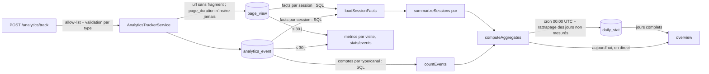
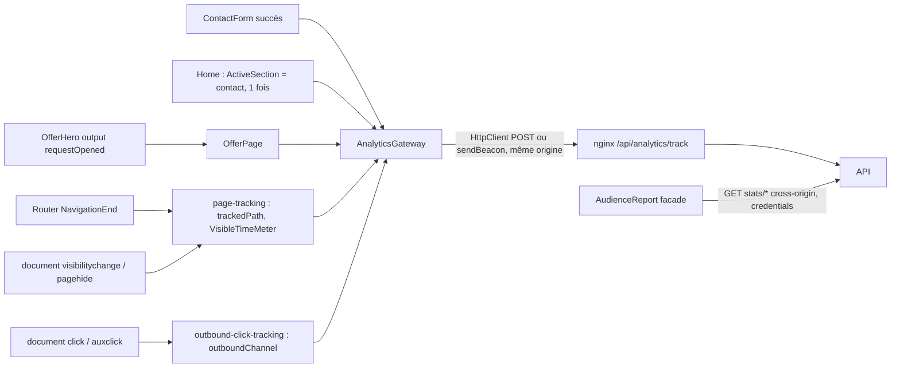

# 020 — Mesure honnête

## Description

### Objectif

Que l'admin Audience dise vrai sur l'engagement, pour juger dans quelques semaines l'effet de la
spec 019 (en prod depuis le 2026-10-10, `c947de2`). Deux dépôts : l'API NestJS
(`nest-portfolio-app`, PR livrée et **déployée en premier**) et ce front.

### Constat (audit du 2026-10-10, revérifié dans le code le même jour)

API (`nest-portfolio-app/src/analytics/`) :

1. **Visiteurs = sessions** : `analytics-aggregates.ts:80-84` ; une session est
   `sha256(ip|ua|jour UTC)` (`analytics-tracker.service.ts:79-82`), donc « un appareil, une journée ».
   L'admin affiche « Visiteurs N » avec le détail « N sessions » : deux fois le même nombre.
2. **Rebond = session d'une seule URL** (`analytics-aggregates.ts:38-53`) : un visiteur qui lit
   l'accueil 3 minutes, télécharge le CV ou appelle est compté en rebond. Les événements ne comptent
   pas.
3. **Provenance par ligne de page vue** (`analytics-stats.service.ts:116-138`, et non
   `analytics-aggregates.ts:110-144`, ligne inexistante) : `COUNT(*)` sur `page_view` groupé par
   `referrer`. Le front envoie `document.referrer` à **chaque** page vue
   (`http-analytics.gateway.ts:117-124`) ; dans une SPA il reste celui de l'arrivée, donc une visite
   de 5 pages venue de Google compte 5. `isNotNull(col)` exclut les accès directs : la part
   « Google 80 % » est une part des seules visites référencées. Navigateurs, systèmes et pays sont
   comptés de la même façon (gonflés par le nombre de pages).
4. **Fenêtres > 30 jours fausses** : `overview` agrège les tables brutes, purgées à 30 jours
   (`analytics-aggregator.service.ts:58-71`) ; « 90 jours » vaut donc 30 jours, alors que la courbe
   (lue dans `daily_stat`) montre 90 jours. « Depuis le début » n'envoie aucune date et l'API retombe
   sur 30 jours par défaut (`analytics-stats.service.ts:245-252`).
5. **Durée moyenne diluée** : `total_duration / pageviews`, les pages sans durée comptant pour 0
   (`analytics-stats.service.ts:45-46`).
6. **Une durée crée une visite fantôme** : un `page_duration` sans ligne existante insère une
   `page_view` (`analytics-tracker.service.ts:139-149`) ; une durée envoyée après minuit UTC (nouvelle
   empreinte) crée une session d'une page, sans provenance : un faux rebond « accès direct ».

Front :

7. **Durée** : envoyée à la navigation suivante ou sur `beforeunload` (`app.config.ts:92-131`),
   événement peu fiable en mobile (onglet mis en arrière-plan puis tué) et qui bloque le bfcache ;
   `sendBeacon` d'un `Blob` `application/json` **cross-origin** vers `api.` est une requête CORS
   avec pré-vol et `credentials: include`, dont la prise en charge varie selon les navigateurs
   (non vérifié en prod : l'appareil exclu n'émet rien).
8. **Le CTA « Demander mon site » des offres** (`offer-hero.ts:26`, `routerLink="." [fragment]`)
   déclenche un `NavigationEnd` : le front envoie une page vue `/offres/<slug>#demande`, ligne
   distincte côté API ⇒ la visite a « deux pages » et n'est plus un rebond. Même effet pour tout
   lien à fragment.
9. **Non mesurés** : envoi réussi du formulaire de contact (accueil et offres) ; clics `mailto:`,
   `tel:`, Malt, LinkedIn, GitHub, Discord hors bandeau recruteur ; clics vers les démos ; arrivée en
   vue du formulaire de l'accueil (`#contact`) ; « Décrire mon projet » du pied de page
   (`footer.ts:167`).
10. **Confidentialité** : `/confidentialite` (`pages/privacy-policy.ts:32-46`) décrit « pour chaque
    page vue » la page, la provenance, le pays, le navigateur, le système et la durée ; elle ne
    mentionne pas les actions déjà mesurées (clics CTA, CV, lecture d'article) ni celles à venir.

### Ce qui est attendu

1. **Rebond réel et engagement**, calculés par l'API : définition en ADR-0022 (une seule page,
   aucun événement d'engagement, moins de 30 s de temps visible — seuil validé par l'utilisateur le
   2026-10-10). L'admin les affiche dans **une seule tuile « Rebond réel »**, l'engagement
   (= 100 − rebond réel) en détail, à côté du rebond actuel renommé « Rebond (une page) »
   (arbitrage du 2026-10-10).
2. **Conversions** : formulaires envoyés (par emplacement), contacts directs (mail, téléphone, Malt,
   Discord), profils (LinkedIn, GitHub), CV, démos ouvertes, arrivées sur le formulaire de l'accueil.
3. **Provenance, navigateurs, systèmes, pays par visite** ; accès directs comptés.
4. **Périodes justes** : 90 jours et « depuis le début » lus dans les totaux journaliers ; les
   détails (pages, provenance, CTA, conversions par emplacement) annoncent qu'ils couvrent au plus
   les 30 derniers jours.
5. **Durée fiable** : temps visible, envoyé à la mise en arrière-plan (`visibilitychange`,
   `pagehide`), par un relais **même origine** (ADR-0021) ; durée moyenne calculée sur les pages
   mesurées, avec sa couverture.
6. **Libellés honnêtes** : « Visites » (un appareil, une journée) au lieu de « Visiteurs » (validé le
   2026-10-10).
7. **Confidentialité** mise à jour (actions mesurées, totaux conservés).

### Contraintes

- **RGPD** : aucune donnée personnelle nouvelle, aucun cookie, aucun identifiant persistant. Le
  contenu du formulaire n'est jamais transmis à la mesure (seul l'emplacement l'est) ; l'adresse
  d'un lien `mailto:`/`tel:` non plus (seul le canal). Le relais ne transmet ni cookie ni
  `Authorization`.
- **Exclusions intactes** : robots (`isbot`), IP privées, URL `/login` et `/admin*` (API) ; admin
  connecté et appareil exclu (front, `canTrack()`).
- **Données existantes** : aucune réécriture des tables brutes ; les nouvelles colonnes journalières
  sont nullables (`NULL` = jour non mesuré). Aucun champ du DTO actuel n'est retiré ni renommé.
- **Ordre** (CLAUDE.md item 10) : PR API mergée **et** déployée (endpoint vérifié en prod) avant la
  PR front 2 (événements + admin). Voir « Livraison ».
- **Aucune donnée de test dans les stats de prod** : l'émission des événements se prouve en local
  (API + base + front locaux). **En prod, aucune requête autre que GET** pendant les vérifications
  (règle utilisateur) : lectures admin `GET stats/*`, `GET` des pages, onglet Réseau de l'appareil
  exclu (rien ne doit partir), observation des compteurs du jour.

### Hors périmètre

- Identifiant de visiteur sur plusieurs jours (exigerait un identifiant persistant).
- Allongement de la rétention brute au-delà de 30 jours (décision à part, cf. Risques).
- Entonnoirs, cohortes, attribution multi-visites.
- Clics sortants « autres » (CNIL, Giscus, documentation…) : non classés, non envoyés.

## Plan technique

### Constats vérifiés (2026-10-10)

- API `trust proxy 1` (`src/main.ts:15-16`) : `req.ip` = dernier élément de `X-Forwarded-For`
  posé par le saut immédiat. Chemin actuel : visiteur → Traefik → API.
- Le relais `/api/storage/` du front (`Dockerfile:116-152`) parle à l'API par le réseau Docker via
  `${STORAGE_UPSTREAM}` (seule variable substituée, `NGINX_ENVSUBST_FILTER=STORAGE_`).
- Le proxy de dev (`proxy.conf.cjs`) envoie `/api` à l'API locale ; l'API locale voit `::1`,
  **écarté** par `isPrivateIp` : aujourd'hui rien n'est jamais enregistré en local.
- Tests API : Jest + `createMockDb()` (`src/database/test-utils.ts`) — le SQL n'est pas exécuté en
  test ; la logique doit donc vivre en TypeScript pur pour être testée (cf. Architecture API).
- `ActiveSection` (`core/navigation/active-section.ts`) passe à `'contact'` quand le bloc
  `#contact` de l'accueil traverse la bande centrale du viewport (`SectionVisibility`,
  `IntersectionObserver` déjà en place) : réutilisable pour « arrivée en vue », sans second
  observateur.
- `ContactForm` (`features/contact/application/contact-form.ts`) porte déjà sa propre mutation
  (gateway + toast) ; deux sites : `home.ts:135`, `offer-page.ts:60`.
- `toAudienceReadout` (`features/admin/application/overview-view.ts:78`) est partagé par l'admin
  Audience **et** le tableau de bord (`admin-overview.ts`).

### Architecture

#### Où vit chaque calcul

| Calcul | Où | Pourquoi |
|---|---|---|
| Classement d'une visite (engagée / rebond réel / rebond une page) | API, fonction pure `summarizeSessions` | Une seule définition pour le temps réel et le cumul journalier ; testable sans base |
| Groupement des canaux en conversions | API (`OUTBOUND_GROUPS`) | Stocké dans `daily_stat`, donc côté écriture |
| « Mesuré depuis » | API (première date non nulle) | Seule l'API connaît les jours stockés |
| Taux (%) | API, comme `bounceRate` aujourd'hui | DTO prêt à afficher, cohérent avec l'existant |
| Libellés, pluriels, notes de couverture, noms des canaux/emplacements | Front (presenters `application/`) | Présentation |
| Chemin suivi (sans fragment), canal d'un lien, temps visible | Front, fonctions pures `domain/` | Logique client, testable sans TestBed |

#### API — flux



- **`loadSessionFacts(db, start, end)`** (SQL) rend une ligne par session :
  `pages` = `COUNT(DISTINCT split_part(url, '#', 1))` (neutralise aussi les lignes `#demande`
  déjà en base), `durationSum` = `SUM(duration)`, `durationSamples` = `COUNT(duration)`,
  `engaged` = existence d'un événement d'`ENGAGEMENT_EVENT_TYPES` de la même session sur la plage.
  Volume : quelques centaines de lignes par jour, le calcul en TypeScript est négligeable.
- **`summarizeSessions(facts, thresholdSeconds)`** (pur) rend `sessions`, `pageviews` (somme des
  `pages`), `bounces` (`pages = 1`), `realBounces` (`pages = 1 ∧ ¬engaged ∧ (durationSum ?? 0) <
  seuil`), `engagedSessions` (= `sessions − realBounces`), `totalDuration`, `durationSamples`.
- **`countEvents(db, start, end)`** (SQL, une requête `COUNT(*) FILTER`) : compteurs existants +
  `contactSubmits`, `contactClicks`, `profileClicks`, `demoClicks`, `contactSectionViews`, et
  `v2Events` (nombre d'événements `contact_submit|outbound_click|section_view`).
- **Règle « conversions mesurées »** (ADR-0022 §4) : les colonnes de conversions d'un jour valent
  `NULL` tant qu'aucun événement v2 n'a jamais été vu (ni ce jour, ni un jour antérieur de
  `daily_stat`) ; ensuite un `0` est un vrai zéro. Pas de date en dur, pas de constante à recaler
  au déploiement du front.
- **Cron** `aggregateYesterday` : agrège J-1 (inchangé) puis **rattrape** les jours de
  `[J-29, J-2]` dont `engaged_sessions IS NULL` (recalcul complet via `computeAggregates`,
  idempotent), **avant** la purge. Effet : la nuit suivant le déploiement de l'API, les 28 jours
  encore présents en brut (≈ depuis le 2026-09-12 selon la date de déploiement) reçoivent rebond réel
  et durée mesurée — dont environ 4 semaines **avant** la spec 019. Aucun script à lancer en prod.
- **`overview`** = somme des lignes `daily_stat` de `[start, min(end, hier)]` + `computeAggregates`
  en direct pour aujourd'hui si la plage l'inclut. Les taux sont calculés sur la somme. Les colonnes
  nullables sont sommées **sur les seuls jours mesurés**, avec le dénominateur des mêmes jours
  (`measuredSessions`) — jamais divisées par les sessions des jours non mesurés.
- **`metrics`** : `countDistinct(session_hash)` pour `url|browser|os|country` ; pour `referrer`,
  une ligne par session = première provenance externe non nulle de la journée, sinon `''`
  (accès direct, désormais listé). Le nom de champ reste `count`.
- **`GET stats/events?type=contact_submit|outbound_click&startDate&endDate&limit`** (admin, JWT) :
  `{ entityId, count }[]` groupé par `entityId`, trié décroissant. Remplace l'ajout d'un endpoint
  par type ; les endpoints existants (`projects`, `cta`, …) restent.
- **Tracker** : `url` de `page_view|page_duration` tronquée au premier `#` avant tout traitement ;
  `page_duration` ne fait plus que **mettre à jour** une ligne existante (session + URL + jour),
  sinon rien (corrige le constat 6). Exclusions (bot, IP privée, URL admin) inchangées et appliquées
  aux nouveaux types (ils passent par le même `track()`).

#### Front — flux



- **Transport** : toutes les écritures (`track`) partent vers `ANALYTICS_TRACK_URL =
  '/api/analytics/track'` (même origine) ; les lectures admin (`stats/*`) restent sur
  `API_BASE_URL` (cross-origin, cookie). `page_duration` et `outbound_click` partent en
  `navigator.sendBeacon` (survivent à la fermeture ou au départ de la page) ; les autres en
  `HttpClient` (inchangé, `silentErrors()`). `sendBeacon` sort du contrat abstrait (détail
  d'implémentation de `HttpAnalyticsGateway`).
- **Relais nginx** (ADR-0021) : `location = /api/analytics/track`, `POST` seul, pas de cache,
  `client_max_body_size 4k`, `proxy_set_header X-Forwarded-For $http_x_forwarded_for` (**valeur de
  Traefik transmise telle quelle** : l'API, en `trust proxy 1`, lit le même dernier élément que par
  le chemin direct), `Cookie` et `Authorization` vidés, mêmes `proxy_hide_header` que
  `/api/storage/` pour les en-têtes CORS/sécurité de l'API, upstream `${STORAGE_UPSTREAM}`
  (c'est l'API ; renommer la variable imposerait un changement Dokploy synchronisé, hors
  périmètre).
- **`core/analytics/page-tracking.ts`** (extrait de `app.config.ts:92-131`, qui ne garde que
  `provideAppInitializer(initializePageTracking())`) : `page_view` sur `NavigationEnd` avec
  `trackedPath(urlAfterRedirects)` ; **pas de nouvelle page vue si le chemin suivi est inchangé**
  (navigation de fragment) ; `VisibleTimeMeter` démarré à l'entrée (en pause si
  `document.visibilityState === 'hidden'`), mis en pause sur `visibilitychange→hidden` avec envoi du
  temps accumulé (beacon), relancé sur `visible` ; `pagehide` vide le compteur (beacon) ; navigation
  vers un autre chemin : envoi du reste puis nouveau compteur. `beforeunload` supprimé. Les envois
  sont des **incréments** : l'API les additionne déjà (`analytics-tracker.service.ts:130-136`).
- **`core/analytics/outbound-click-tracking.ts`** : un écouteur délégué sur `document`
  (`click`, et `auxclick` bouton du milieu), `closest('a[href]')`, `outboundChannel(href,
  SITE_IDENTITY.siteUrl)` ; si un canal est reconnu, `trackOutboundClick(channel,
  trackedPath(router.url))`. Couvre d'un coup en-tête, pied de page, panneau de contact, `/about`,
  offres, pages légales, démos, sans toucher aux composants. Le suivi `cta_click` existant
  (bandeau recruteur, avis Google) **reste** : `cta_click` répond « quel emplacement marche »,
  `outbound_click` « combien d'intentions de contact » ; ils ne sont jamais additionnés.
- **Formulaire** : `ContactForm` reçoit `placement = input.required<ContactPlacement>()`, injecte
  `AnalyticsGateway` et appelle `trackContactSubmit(placement)` **uniquement** sur
  `result.success`. Sites : `'home'` (accueil), `offer_${summary().slug}` (offre).
- **Arrivée en vue** : `Home` observe `ActiveSection.key()` et émet une fois par instance
  `trackSectionView('home_contact', '/')` (garde locale ; `effect()` légitime : effet de bord
  analytique, ne réécrit aucun signal). Revenir sur l'accueil recrée l'instance et peut réémettre :
  assumé (« une fois par page affichée »).
- **CTA d'offre** : `OfferHero` gagne `output<void>() requestOpened` émis au clic du lien
  « Demander mon site » (le lien `routerLink` + `fragment` reste, l'a11y ne change pas) ;
  `OfferPage` injecte `AnalyticsGateway` et appelle `trackCtaClick(`offer_request_${slug}`,
  hero.ctaLabel)`. Pied de page : `scrollToContact()` émet aussi `trackCtaClick('footer_contact',
  …)`.
- **Admin Audience** : `AudienceReport` (facade de page, inchangée dans son rôle) ajoute deux
  ressources (`stats/events` pour `contact_submit` et `outbound_click`) ; toute la dérivation sort
  en fonctions pures dans `application/audience-view.ts` (lecture) et
  `application/audience-conversions-view.ts` (conversions) pour garder la facade sous 250 lignes.
  Les composants d'affichage existants suffisent (`AdminReadout`, `AudienceTally`,
  `AudienceShareTable`) : pas de nouveau composant.

#### Landmarks

Aucun landmark ajouté ou déplacé (admin dans le shell existant, `/confidentialite` inchangée en
structure).

### Contrat d'API (DTO)

Ajouts **seulement** ; les champs actuels gardent nom et type.

```ts
// POST /analytics/track — TrackEventDto
type AnalyticsType = /* existants */ | 'contact_submit' | 'outbound_click' | 'section_view';
// contact_submit : entityId requis, /^[a-z0-9_-]{1,64}$/ (emplacement : 'home', 'offer_site-vitrine')
// outbound_click : entityId requis ∈ OUTBOUND_CHANNELS ; entityTitle = chemin de la page (≤ 500)
// section_view   : entityId requis ∈ ['home_contact'] ; entityTitle = chemin
type OutboundChannel = 'email' | 'phone' | 'malt' | 'discord' | 'linkedin' | 'github' | 'demo';
// OUTBOUND_GROUPS : contact = email|phone|malt|discord ; profile = linkedin|github ; demo = demo

// GET /analytics/stats/overview — ajouts
type OverviewAdditions = {
  durationCoverage: number;          // % des pages vues (jours mesurés) ayant une durée, 2 décimales
  detailSince: string;               // YYYY-MM-DD : max(startDate, aujourd'hui − 30 j), début des détails bruts
  engagement: {
    measuredSince: string | null;    // premier jour de la plage où engaged_sessions est non nul
    measuredSessions: number;
    engagedSessions: number;
    realBounces: number;
    realBounceRate: number;          // %, 2 décimales ; 0 si measuredSessions = 0
    engagementRate: number;          // = 100 − realBounceRate si measuredSessions > 0, sinon 0
    thresholdSeconds: number;        // 30 : exposé pour un libellé exact côté front
  };
  conversions: {
    measuredSince: string | null;    // premier jour de la plage où les colonnes de conversions sont non nulles
    contactSubmits: number;
    contactClicks: number;
    profileClicks: number;
    demoClicks: number;
    contactSectionViews: number;
  };
};
// avgDuration : redéfini = total_duration / durationSamples (pages mesurées), arrondi à la seconde.
// visitors : conservé (= sessions) pour compatibilité ; le front ne l'affiche plus.

// GET /analytics/stats/events?type=contact_submit|outbound_click
type EventCount = { entityId: string; count: number };
```

`daily_stat` (migration Drizzle générée, colonnes `integer` **nullables, sans défaut**) :
`duration_samples`, `engaged_sessions`, `real_bounces`, `contact_submits`, `contact_clicks`,
`profile_clicks`, `demo_clicks`, `contact_section_views`. Les lignes existantes restent `NULL`
(non mesurées) ; le rattrapage les remplit pour les jours encore présents en brut.

**Compatibilité** : anciennes sessions sans durée → `durationSum` nul → traité comme `< seuil`
(rebond réel majorant, jamais minorant) ; `avgDuration` ne compte que les pages mesurées et
`durationCoverage` dit sur quelle part. L'ancien front ignore les champs ajoutés ; il bénéficie
immédiatement de la provenance par visite, de la troncature des fragments et des périodes justes.

### Fichiers à créer / modifier

**API (`nest-portfolio-app`)** — plan seulement, aucune modification dans cette session.

| Fichier | Rôle |
|---|---|
| `src/analytics/dto/track-event.dto.ts` | `ANALYTICS_TYPES` +3, `OUTBOUND_CHANNELS`, validation `entityId` par type (`ValidateIf` + `IsIn`/`Matches`) |
| `src/analytics/dto/track-event.dto.spec.ts` | cas valides/invalides des 3 types |
| `src/analytics/analytics-tracker.service.ts` | troncature `#`, `page_duration` en mise à jour seule |
| `src/analytics/analytics-tracker.service.spec.ts` | idem |
| `src/analytics/engagement.ts` (créé) | `ENGAGEMENT_EVENT_TYPES`, `ENGAGED_DURATION_SECONDS = 30`, `OUTBOUND_GROUPS`, `V2_EVENT_TYPES` |
| `src/analytics/session-facts.ts` (créé) | type `SessionFacts`, `summarizeSessions` (pur) |
| `src/analytics/session-facts.spec.ts` (créé) | triangulation `it.each` |
| `src/analytics/analytics-aggregates.ts` | `loadSessionFacts`, `countEvents`, `DayAggregates` étendu, règle conversions mesurées |
| `src/analytics/analytics-aggregator.service.ts` | écrit les nouvelles colonnes ; rattrapage `[J-29, J-2]` avant purge |
| `src/analytics/analytics-aggregator.service.spec.ts` | idem |
| `src/analytics/analytics-stats.service.ts` | `overview` (daily + direct), `metrics` par visite, `events` |
| `src/analytics/analytics-stats.service.spec.ts` | idem |
| `src/analytics/dto/date-range-query.dto.ts` | `EventsQueryDto` (`type` ∈ `contact_submit|outbound_click`) |
| `src/analytics/analytics.controller.ts` | `GET stats/events` (JWT) |
| `src/database/schema/analytics.ts` | 8 colonnes nullables sur `dailyStat` |
| `drizzle/0019_*.sql` + `drizzle/meta/*` | générés par `pnpm db:generate` |

**Front (ce dépôt)**

| Fichier | Rôle |
|---|---|
| `Dockerfile` | `location = /api/analytics/track` (relais POST, cf. Architecture) |
| `proxy.conf.cjs` | en dev, `headers: { 'X-Forwarded-For': '203.0.113.10' }` (TEST-NET-3) : l'API locale enregistre enfin (base locale uniquement) |
| `src/app/features/analytics/domain/models/analytics.types.ts` | `TrackPayload` +3 types, `OutboundChannel`, `ContactPlacement`, `SectionId`, `StatsOverview` étendu (`readonly`), `EventCount` |
| `src/app/features/analytics/domain/gateways/analytics.gateway.ts` | `trackContactSubmit`, `trackOutboundClick`, `trackSectionView`, `getEventCounts` ; `sendBeacon` retiré du contrat |
| `src/app/features/analytics/domain/tracked-path.ts` (+ `.spec.ts`) | `trackedPath(url)` : chemin sans fragment |
| `src/app/features/analytics/domain/outbound-channel.ts` (+ `.spec.ts`) | `outboundChannel(href, siteUrl): OutboundChannel \| null` (démo = sous-domaine du site hors `www`/`api`) |
| `src/app/features/analytics/domain/visible-time-meter.ts` (+ `.spec.ts`) | compteur de temps visible pur (`start/pause/resume/drain(now)`) |
| `src/app/features/analytics/infra/gateways/http-analytics.gateway.ts` (+ spec) | `ANALYTICS_TRACK_URL` même origine, beacon pour durée/sortant, 3 méthodes, `getEventCounts` |
| `src/app/features/analytics/testing/stub-analytics-gateway.ts` | nouvelles méthodes |
| `src/app/features/analytics/testing/analytics-builders.ts` | `makeStatsOverview` étendu (`engagement`, `conversions`, …), `makeEventCount` |
| `src/app/features/analytics/domain/analytics-presenter.ts` (+ spec) | `ANALYTICS_EPOCH = '2026-04-26'` ; `'all'` → `{ startDate: ANALYTICS_EPOCH, endDate: today }` ; CSV étendu |
| `src/app/core/analytics/page-tracking.ts` (+ `.spec.ts`) | initialiseur pages vues + durée visible |
| `src/app/core/analytics/outbound-click-tracking.ts` (+ `.spec.ts`) | initialiseur clics sortants délégués |
| `src/app/app.config.ts` | retire `initializeTracking`, enregistre les deux initialiseurs |
| `src/app/features/contact/application/contact-form.ts` (+ spec) | `placement`, suivi sur succès |
| `src/app/features/home/pages/home/home.ts` (+ spec) | `placement="home"`, arrivée en vue |
| `src/app/features/offer/application/components/offer-hero.ts` (+ spec) | `requestOpened` |
| `src/app/features/offer/pages/offer-page/offer-page.ts` (+ spec) | `placement`, suivi CTA d'offre |
| `src/app/layout/components/footer/footer.ts` (+ spec) | `footer_contact` |
| `src/app/features/admin/application/overview-view.ts` (+ spec) | lecture : Visites, Rebond (une page), Rebond réel, Durée mesurée |
| `src/app/features/admin/application/audience-view.ts` (+ spec) | `audienceLead` (rebond réel), `detailNote`, groupes d'événements |
| `src/app/features/admin/application/audience-conversions-view.ts` (+ spec) (créé) | totaux et lignes par emplacement/canal, libellés des canaux et emplacements |
| `src/app/features/admin/pages/admin-audience/audience-report.ts` (+ spec) | 2 ressources `stats/events`, `conversions`, `detailNote` |
| `src/app/features/admin/pages/admin-audience/admin-audience.ts` (+ spec) | section « Conversions », note de couverture, légende « Visites » |
| `src/app/pages/privacy-policy.ts` (+ spec si existant) | texte « Mesure d'audience » + date de mise à jour |
| `docs/adr/0021-relais-de-mesure-meme-origine.md`, `docs/adr/0022-engagement-et-rebond-reel.md` | créés avec ce plan |

### Modèles de données (front)

- Types `readonly`, unions plutôt qu'énumérations : `OutboundChannel` (miroir exact de l'API),
  `ContactPlacement = 'home' | \`offer_${OfferSlug}\`` (structurel : le compilateur refuse un
  emplacement libre ; `OfferSlug` existe déjà), `SectionId = 'home_contact'`.
- `TrackPayload` : union discriminée par `type` (chaque variante porte ses champs requis) plutôt
  qu'un objet à champs tous optionnels — le gateway ne peut plus envoyer un `outbound_click` sans
  canal.
- Frontière HTTP : pas de validation runtime côté front (profil) — réponses `stats/*` typées sur le
  DTO, comme l'existant. *Validation runtime aux frontières non vérifiée* (assumé par le profil).

### Texte de confidentialité (F7)

Paragraphe « Mesure d'audience » à réécrire sur ces faits, sans rien ajouter :

- par page vue : la page (sans ancre), la provenance (nom de domaine, une fois par visite), le pays
  déduit de l'IP (base locale), navigateur, système, **temps d'affichage de la page** ;
- **actions** : clic sur un bouton d'appel, sur un lien de contact (mail, téléphone, Malt, Discord),
  de profil (LinkedIn, GitHub) ou de démo, arrivée sur le formulaire de l'accueil, envoi réussi du
  formulaire, téléchargement du CV, ouverture et lecture complète d'un article — **sans le contenu
  du formulaire ni l'adresse du lien**, seulement le type d'action, l'emplacement et la page ;
- empreinte du jour, robots et éditeur exclus : inchangé ;
- conservation : brut 30 jours ; au-delà, totaux journaliers anonymes (visites, pages vues,
  visites engagées, rebonds, nombre d'actions par type).

`lastUpdate` = date de déploiement de la PR front 2.

### Réactivité

- `AudienceReport` : `rxResource` par source (pattern existant `periodic()`), `computed` pour la
  dérivation ; aucune nouvelle construction.
- Initialiseurs `core/analytics` : abonnement `router.events` (vrai flux, existant) +
  `fromEvent(document, …)` avec `takeUntilDestroyed` sur le `DestroyRef` de l'environnement ; pas
  de signal (pas d'état affiché).
- `Home` : `effect()` sur `ActiveSection.key()` avec garde d'émission unique.

### État partagé & coordination

- Aucun store. `AudienceReport` reste une **facade** de page (lit des ressources, ne possède pas
  d'état partagé). Les initialiseurs sont des fonctions d'amorçage, pas des services.
- **Gateway** : `AnalyticsGateway` reste le port (2 implémentations : HTTP + stub de test) ; aucun
  `HttpClient` ni `navigator.sendBeacon` hors de `HttpAnalyticsGateway`.

### Cross-platform / bibliothèques

Aucune cible native ; aucune dépendance ajoutée (API et front).

### Livraison (ordre)

1. **PR API** (tranches A1-A5) : merge → déploiement → vérification prod (cf. Preuves API). Urgente :
   chaque jour de retard fait sortir de la rétention un jour **antérieur** à la spec 019, que le
   rattrapage ne pourra plus mesurer.
2. **PR front 1 — transport** (F1-F2) : indépendante de l'API (aucun nouveau type, aucun nouveau
   champ lu) ; peut partir en parallèle de la PR API. **PR isolée (décision du 2026-10-10)** parce
   que le relais est le seul point capable de faire tomber **toute** la mesure (cf. Risques) : on
   l'observe seule, retour arrière immédiat si les compteurs du jour se figent.
3. **PR front 2 — événements + admin + confidentialité** (F3-F7) : après (1) **déployée** et (2)
   observée sans perte. Un événement v2 envoyé avant l'API serait refusé (400, silencieux).
   La page de confidentialité part dans la même PR que les nouveaux événements, jamais après.

Indépendance (1)/(2) : dépôts distincts ; (2)/(3) se touchent (`http-analytics.gateway.ts`,
`app.config.ts`, `analytics.types.ts`) ⇒ (3) part de `master` **après** merge de (2).

### Tranches

API (`pnpm test`, Jest) :

- **Tranche A1 — l'API accepte les événements v2 et ne fabrique plus de visites** : DTO
  (`contact_submit`, `outbound_click`, `section_view` et leurs règles d'`entityId`), troncature du
  fragment, `page_duration` sans ligne existante ⇒ aucune insertion. Tests : `track-event.dto.spec`
  (`it.each` valides/invalides : canal hors liste, emplacement avec majuscule, `section_view`
  inconnue), `analytics-tracker.service.spec` (`/offres/x#demande` ⇒ `url` stockée `/offres/x` ;
  `page_duration` sans ligne ⇒ `db.insert` non appelé ; un `outbound_click` d'un robot ou d'une IP
  privée ⇒ rien).
- **Tranche A2 — une journée se résume en rebond réel et en conversions** : `summarizeSessions`
  (pur) + `computeAggregates` étendu + écriture des colonnes + migration. Tests :
  `session-facts.spec` (`it.each` : 1 page / 0 événement / 12 s ⇒ rebond réel ; 1 page / 0 / 45 s
  ⇒ engagée ; 1 page / événement / 3 s ⇒ engagée ; 2 pages ⇒ engagée et pas rebond une page ;
  durée nulle ⇒ rebond réel ; seuil exact 30 s ⇒ engagée), `analytics-aggregator.service.spec`
  (valeurs écrites ; conversions `NULL` sans aucun événement v2 vu, `0` dès qu'un jour antérieur en a
  vu).
- **Tranche A3 — le cron rattrape les jours non mesurés** : après J-1, recalcul des jours
  `[J-29, J-2]` à `engaged_sessions` nul, avant la purge. Tests : jours sélectionnés, ordre
  rattrapage → purge, idempotence (aucun jour déjà mesuré recalculé).
- **Tranche A4 — l'overview dit vrai sur 90 jours** : somme `daily_stat` + direct du jour, DTO
  étendu (`engagement`, `conversions`, `durationCoverage`, `detailSince`, `avgDuration` mesuré).
  Tests : plage 90 j sans aujourd'hui (aucun appel direct), plage incluant aujourd'hui (somme),
  jours non mesurés exclus du dénominateur, `measuredSince`.
- **Tranche A5 — provenance par visite et détail des conversions** : `metrics` en
  `countDistinct`, `referrer` par session avec accès direct, `GET stats/events`. Tests : forme des
  requêtes sur le mock (agrégat `countDistinct`), contrôleur (garde JWT, `type` hors liste ⇒ 400).

Front (`pnpm test`, Vitest) :

- **Tranche F1 — la mesure part par l'origine du site** : `ANALYTICS_TRACK_URL`, beacon interne
  pour `page_duration`, `sendBeacon` hors contrat, relais nginx, proxy de dev. Tests
  (`http-analytics.gateway.spec`) : `trackPageView` ⇒ `POST /api/analytics/track` (pas
  `API_BASE_URL`, fourni **absolu et distinct** pour éviter le faux vert) ; `trackPageDuration` ⇒
  `navigator.sendBeacon('/api/analytics/track', Blob)` (espion sur `navigator`) ; lectures `stats/*`
  toujours sur `API_BASE_URL` avec `withCredentials`. Le relais nginx n'a pas de test unitaire :
  preuve par conteneur local (Preuves front).
- **Tranche F2 — pages vues sans fragment, durée visible** : `trackedPath`, `VisibleTimeMeter`,
  `page-tracking.ts`. Tests : `tracked-path.spec` (`it.each`), `visible-time-meter.spec` (temps
  cumulé hors pauses, `drain` remet à zéro, démarrage caché), `page-tracking.spec` (TestBed +
  `provideRouter` + stub espion + `vi.useFakeTimers`) : navigation `/offres/x` puis `/offres/x#demande`
  ⇒ une seule page vue ; `visibilitychange` caché après 40 s ⇒ durée 40 ; retour visible 10 s puis
  navigation ⇒ durée 10 pour l'URL précédente ; `pagehide` ⇒ envoi ; route 404 ⇒ rien.
- **Tranche F3 — un formulaire envoyé est compté, par emplacement** : `ContactForm.placement`,
  `trackContactSubmit` sur succès seulement ; `Home`/`OfferPage` passent l'emplacement. Tests
  (`contact-form.spec`) : succès ⇒ espion appelé avec l'emplacement ; échec métier ou exception ⇒
  jamais ; formulaire invalide ⇒ jamais. `offer-page.spec` : emplacement `offer_<slug>`.
- **Tranche F4 — les clics de contact, de profil et de démo sont comptés partout** :
  `outboundChannel` + `outbound-click-tracking.ts`. Tests : `outbound-channel.spec` (`it.each` :
  `mailto:` ⇒ email, `tel:` ⇒ phone, `SITE_IDENTITY.socials.*` ⇒ canal, `https://vieux-comptoir.nedellec-julien.fr/`
  ⇒ demo, site lui-même, `www.`, `api.`, chemin relatif, `https://www.cnil.fr` ⇒ `null`) ;
  `outbound-click-tracking.spec` : clic sur un `<a href="mailto:…">` du document ⇒
  `trackOutboundClick('email', chemin courant)` ; clic sur un enfant (`<span>`) d'un lien ⇒ idem ;
  `auxclick` bouton 1 ⇒ idem ; lien interne ⇒ rien.
- **Tranche F5 — arrivée sur le formulaire et CTA d'offre** : `Home` (`section_view` une fois),
  `OfferHero.requestOpened` + `OfferPage`, `footer_contact`. Tests : `home.spec` (`ActiveSection.set('contact')`
  deux fois ⇒ un seul appel) ; `offer-hero.spec` (clic ⇒ output) ; `offer-page.spec` (⇒
  `trackCtaClick('offer_request_<slug>', ctaLabel)`) ; `footer.spec`.
- **Tranche F6 — l'admin affiche engagement, conversions et couvertures** : presenters + facade +
  page. Tests : `overview-view.spec` (tuiles Visites / Pages vues / Rebond (une page) / Rebond réel
  avec détail « engagement X % » et « mesuré depuis le … » quand `measuredSince` > début de période /
  Durée mesurée avec couverture), `audience-view.spec` (`audienceLead` sur le rebond réel ;
  `detailNote` présente si `detailSince` > `startDate`), `audience-conversions-view.spec` (totaux,
  libellés des canaux et des emplacements, emplacement d'offre inconnu ⇒ libellé de repli),
  `audience-report.spec` (stub : appels `getEventCounts` par type et période), `admin-audience.spec`
  (section « Conversions » rendue, `data-testid`), `analytics-presenter.spec` (`'all'` ⇒
  `ANALYTICS_EPOCH` ; CSV contient les lignes de conversions).
- **Tranche F7 — la confidentialité décrit la mesure réelle** : texte + date. Test : présence des
  mentions (actions mesurées, ni contenu de formulaire ni adresse, totaux conservés) par
  `data-testid` de paragraphe ; sinon preuve par HTML prérendu.

### Consignes pour `qa`

- **RED par assertion, jamais NG0201** : fournir `AnalyticsGateway` (stub espion de
  `testing/stub-analytics-gateway.ts`) dans **tous** les tests de composants touchés **avant** que
  le composant ne l'injecte (`ContactForm`, `OfferPage`) ; ajouter d'abord les méthodes au stub et au
  contrat abstrait (signature seule) pour que le RED tombe sur « espion non appelé », pas sur la
  compilation. Pour `placement` (`input.required`), poser `setInput('placement', …)` partout où
  `ContactForm` est monté (sinon NG0950, RED d'harnais).
- **Zoneless** : jamais `fakeAsync`/`tick` ; `vi.useFakeTimers()` posé **avant** l'initialiseur
  pour `Date.now`. `document.visibilityState` se force par `Object.defineProperty(document,
  'visibilityState', { configurable: true, get: () => 'hidden' })` puis
  `document.dispatchEvent(new Event('visibilitychange'))`.
- **Pas de faux vert sur l'URL** : `API_BASE_URL` absolu (`https://api.test/api`) dans
  `http-analytics.gateway.spec` — avec `'/api'` l'assertion « même origine » passerait à tort.
- **API** : `createMockDb()` n'exécute pas le SQL ; la logique testée est dans `summarizeSessions`
  (pur, sans `TestingModule`). Les tests de service vérifient enchaînement et valeurs écrites, pas
  la sémantique SQL (prouvée en local, cf. Preuves API).
- Sélecteurs `data-testid` uniquement ; échappements `\u00a0`/`\u202f` dans les attendus ; lire
  `$?` après `pnpm test`.

### Preuves attendues

**API**

1. Gates : `pnpm test`, `pnpm lint`, `pnpm build`, `pnpm db:generate` sans différence résiduelle.
2. **Local, base locale** : `pnpm db:up && pnpm db:migrate`, insérer par `POST /api/analytics/track`
   (en-tête `X-Forwarded-For: 203.0.113.10`, UA de navigateur) un parcours type (1 page 10 s ; 1 page
   + `outbound_click` ; 2 pages ; `page_view /offres/x` + `/offres/x#demande`), puis
   `manualRun(aujourd'hui)` et `GET stats/overview` : rebond réel, engagement, conversions,
   `measuredSince` conformes au calcul fait à la main ; `GET stats/metrics?type=referrer` liste
   l'accès direct.
3. **Prod après déploiement, GET uniquement** : l'allow-list et les exclusions sont prouvées en local
   (point 2 et tests), jamais par un POST en prod. Admin : `GET stats/overview` contient
   `engagement` et `conversions` ; `GET stats/events?type=contact_submit` ⇒ 200 ; le lendemain
   00:00 UTC passé, `GET stats/overview?startDate=<J-28>` ⇒ `engagement.measuredSince` ≈ J-28
   (rattrapage effectué) ; les visites du jour continuent d'augmenter (l'ancien front écrit
   toujours).

**Front**

1. Gates : `pnpm install --frozen-lockfile`, `pnpm test` (code 0), `pnpm lint`,
   `pnpm run build --configuration production`.
2. **Relais, conteneur local** : `docker build` puis `docker run` avec `STORAGE_UPSTREAM` pointé
   sur un serveur d'écho local ; `curl -X POST -H 'X-Forwarded-For: 198.51.100.7' -H 'Cookie: a=b'
   -H 'Authorization: Bearer x' …/api/analytics/track` ⇒ l'écho reçoit `X-Forwarded-For:
   198.51.100.7` **inchangé**, pas de `Cookie` ni d'`Authorization`, le `User-Agent` d'origine ;
   `GET` ⇒ 403.
3. **Parcours local complet** (API locale + `pnpm start`, proxy avec `X-Forwarded-For` de test) :
   accueil → défilement jusqu'au formulaire → envoi → clic mail, téléphone, LinkedIn → offre →
   « Demander mon site » → démo → onglet en arrière-plan → retour → pied de page « Décrire mon
   projet » ; onglet Réseau : chaque événement part vers `/api/analytics/track` (beacon pour durée
   et sortants), aucune page vue `#demande` ; admin local : chaque compteur reflète le parcours.
4. **Prod, appareil exclu, GET uniquement** : onglet Réseau vide de tout `track` sur le même
   parcours (exclusion intacte). Aucun POST manuel vers la prod : joignabilité du relais et
   validation de l'API sont prouvées en conteneur local (point 2) et en local (point 3).
5. **Prod, observation passive (PR front 1), GET uniquement** : dans l'heure qui suit le
   déploiement, l'admin (`GET stats/overview`, `GET stats/active`, `GET stats/metrics?type=country`)
   montre des visites du jour qui continuent d'augmenter, avec des pays renseignés. Compteurs figés
   (alors que les journaux nginx montrent des `POST /api/analytics/track 204` émis par les
   visiteurs) = IP mal transmise ⇒ **retour arrière immédiat** de la PR front 1 (décision du
   2026-10-10 ; le relais est un seul `location`, le revert restaure l'envoi direct vers `api.`).
6. **Confidentialité** : HTML prérendu `confidentialite/index.html` contient le nouveau texte.

### Risques & inconnues

- **Relais = point de défaillance unique de la mesure** : si `X-Forwarded-For` arrive mal à l'API,
  `req.ip` devient l'IP Docker de nginx, **privée**, et tout est écarté sans erreur ; d'où PR front 1
  isolée, preuve d'en-têtes en conteneur local et observation passive post-déploiement. La
  justification « Traefik pose le dernier élément de XFF » repose sur la configuration Traefik de
  Dokploy, non lue ici.
- **Rupture de série** : le rebond réel dépend de la liste d'événements et de la fiabilité de la
  durée, qui changent toutes deux au déploiement de la PR front 2 (événements v2, temps visible). Les
  jours rattrapés d'avant la spec 019 n'ont que les événements v1 et des durées souvent absentes ⇒
  rebond réel **surestimé** avant, à comparer avec prudence ; la série stable pour juger 019 reste
  le rebond une page, les clics CTA, le CV et les pages par visite ; `conversions.measuredSince`
  date la rupture.
- **Seuil de 30 s (validé le 2026-10-10) = valeur de calibration** : hypothèse couplée — il s'applique au
  **temps visible** cumulé de la visite (pas au temps d'onglet ouvert), et un contact ou un clic
  rend la visite engagée quelle que soit la durée. Référence : GA4 compte une visite engagée dès
  10 s (réglable). Un seuil plus haut fait monter le rebond réel ; le changer après coup recalcule
  seulement les jours encore en brut (30 j).
- **Rétention 30 jours** : les détails (pages, provenance, CTA, conversions par emplacement) ne
  dépassent jamais 30 jours ; les comparer avant/après 019 au-delà de mi-novembre n'est possible que
  sur les totaux journaliers. Allonger la rétention = décision RGPD (page de confidentialité) à
  prendre à part.
- **Durée après minuit UTC** : désormais perdue (plus de visite fantôme) ; biais faible et connu.

## Plan de test

PR front 1 (transport) : tranches F1 et F2, RED pris ensemble sur la même branche
(`feat/honest-analytics`), par `pnpm test; echo exit=$?` après `pnpm exec ng cache clean` et
`rm -rf node_modules/.vite`. Squelettes de signature créés pour que le RED tombe sur une assertion
et non sur un module introuvable : `trackedPath` rend `''`, `VisibleTimeMeter` a des méthodes vides
et `drain` rend `0`, `initializePageTracking()` rend un initialiseur vide. Aucun ne fait passer un
test : chaque test attend au moins une valeur non nulle.

### Tranche F1 — la mesure part par l'origine du site

Fichier : `src/app/features/analytics/infra/gateways/http-analytics.gateway.spec.ts` (adapté).
`API_BASE_URL` vaut désormais `https://api.test/api` (absolu et distinct de l'origine du site) ;
`TRACK_URL = '/api/analytics/track'` est un littéral, pas le symbole applicatif.

| Test | Scénario | Assertions clés |
|---|---|---|
| `trackPageView` … sur l'origine du site | visiteur, page `/home`, referrer posé | `expectOne('/api/analytics/track')`, `POST`, corps `{ type, url, referrer }` exact |
| `trackProjectClick` / `trackArticleView` / `trackArticleRead` / `trackCtaClick` / `trackCvDownload` | un appel chacun | même URL relative, corps exact |
| silencieux pour l'intercepteur de toast | `trackCtaClick` | `SKIP_ERROR_TOAST` vrai sur la requête vers `TRACK_URL` |
| `page_duration par beacon` : beacon JSON | `trackPageDuration('/home', 12)` | `sendBeacon` appelé 1 fois avec `TRACK_URL`, `Blob` `application/json`, corps `{ type: 'page_duration', url: '/home', duration: 12 }` ; `verify()` : aucune requête `HttpClient` |
| navigateur sans `sendBeacon` | `navigator.sendBeacon` absent | ne lève pas ; `verify()` : aucune requête `HttpClient` (pas de repli) |
| `trackPageDuration` no-op `/login`, `/admin`, `/admin/dashboard` | `it.each` | beacon jamais appelé, aucune requête |
| `trackPageView` OK pour `/logins`, `/admin-public`, … | `it.each` | une requête vers `TRACK_URL` |
| visiteurs exclus : aucun POST ni beacon | `it.each` admin connecté / appareil exclu, les 7 méthodes `track*` | beacon jamais appelé, `verify()` |
| durée visible : 1 beacon pour un visiteur, 0 sinon | `it.each` visiteur 1 / admin connecté 0 / appareil exclu 0 | `toHaveBeenCalledTimes(n)` |
| SSR : `trackPageDuration` no-op | plateforme `server` | beacon jamais appelé, aucune requête |
| lectures `stats/*` (inchangées) | les 9 lectures, dont la variante intercepteur de toasts | toujours sur `https://api.test/api/analytics/stats/…` avec `withCredentials` : restent vertes avec la base absolue |

Retirés (cas qui n'existe plus : `sendBeacon` sort du contrat public) : les 6 tests de
`gateway.sendBeacon(...)` (Beacon ×2, URL filter ×2, admin connecté, SSR). Leurs invariants
(absence de `sendBeacon`, URL d'admin, admin connecté, SSR) sont repris sur `trackPageDuration`.

Échecs F1 : 14, tous sur une assertion de comportement : 12 `HttpTestingController` (« Expected one
matching request … /api/analytics/track, found none. Requests received are: POST
https://api.test/api/analytics/track » ×11, « Expected no open requests, found 1 » ×1) et 2
`AssertionError` (beacon appelé 0 fois au lieu de 1). Les tests d'exclusion et d'URL d'admin sont
verts avant comme après : ce sont des garde-fous, et la ligne « visiteur » de leur `it.each`, elle,
est rouge.

RED confirmé via la commande test du profil le 2026-10-10 17:12, 14 failed / 3518 total (part F1
du run commun F1+F2 : 42 failed / 3518 total, `exit=1`).

**Dû au GREEN (signal) :** retirer `sendBeacon` de `AnalyticsGateway` et de
`HttpAnalyticsGateway`, et la ligne `sendBeacon: () => undefined` de
`testing/stub-analytics-gateway.ts` en même temps (le stub est typé sur le contrat : l'un ne bouge
pas sans l'autre). Retirer la ligne du stub est une adaptation mécanique : aucune valeur attendue
ne change.

**Relais nginx et proxy de dev : pas de test Vitest, preuve locale (aucune requête vers la prod).**

1. `docker build -t ng-portfolio-app:relay .` (le `Dockerfile` du dépôt, comme Dokploy).
2. Serveur d'écho local dans un réseau Docker dédié (`docker network create relay-test`), par
   exemple `mendhak/http-https-echo` (renvoie méthode, chemin, en-têtes et corps reçus) sous le nom
   `echo`.
3. `docker run --network relay-test -e STORAGE_UPSTREAM=http://echo:8080 -p 8081:3000
   ng-portfolio-app:relay`.
4. `curl -si -X POST http://localhost:8081/api/analytics/track -H 'Content-Type:
   application/json' -H 'X-Forwarded-For: 198.51.100.7' -H 'Cookie: a=b' -H 'Authorization:
   Bearer x' -A 'Mozilla/5.0 relay-test' --data '{"type":"page_view","url":"/"}'`, puis lecture
   des journaux de `echo`. Attendus :
   - chemin reçu `/api/analytics/track`, méthode `POST`, corps identique ;
   - `x-forwarded-for: 198.51.100.7` **à l'identique** : une seule valeur, sans IP Docker ajoutée
     (le cas `$proxy_add_x_forwarded_for` donnerait `198.51.100.7, 172.x.x.x`) ;
   - ni `cookie` ni `authorization` ;
   - `user-agent: Mozilla/5.0 relay-test` conservé.
5. Méthodes : `curl -si http://localhost:8081/api/analytics/track` (GET) puis `-X PUT` ⇒ `403`, et
   l'écho ne reçoit rien.
6. Corps : un `POST` de 5 ko ⇒ `413`, l'écho ne reçoit rien (`client_max_body_size 4k`).
7. Réponse : en-têtes de sécurité du site présents, `Access-Control-Allow-*` de l'amont masqués,
   aucun `X-Cache-Status` ni mise en cache (deux `POST` identiques arrivent tous les deux à
   l'écho).
8. Proxy de dev (`proxy.conf.cjs`) : `pnpm start` avec l'API locale, une page vue dans le
   navigateur ⇒ la ligne `page_view` apparaît dans la base **locale** (IP `203.0.113.10`).

Sortie de chaque commande et journaux de l'écho collés dans `## Verify` par l'implémenteur.

### Tranche F2 — pages vues sans fragment, durée visible

| Fichier | Test | Scénario | Assertions clés |
|---|---|---|---|
| `features/analytics/domain/tracked-path.spec.ts` (créé) | `it.each` ×7 | `/offres/site-vitrine`, `…#demande`, `/#contact`, `/`, `/blog?tag=angular`, `…?tag=angular#comments`, `/a#b#c` | chemin coupé au premier `#`, requête conservée (`toBe`) |
| `features/analytics/domain/visible-time-meter.spec.ts` (créé) | démarrage visible | `start(1000, true)`, `drain(41000)` | `40000` (millisecondes) |
| | pause | pause 10 s → reprise 25 s → `drain(30 s)` | `15000` |
| | `drain` remet à zéro | deux `drain` successifs | `[5000, 3000]` |
| | `drain` en pause | pause 4 s, `drain(10 s)`, reprise 12 s, `drain(15 s)` | `[4000, 3000]` |
| | démarrage caché | `start(0, false)`, `drain(20 s)`, reprise, `drain(26 s)` | `[0, 6000]` |
| | double pause | deux `pause` | la seconde ne change rien (`10000`) |
| | double reprise | `resume` sur un compteur en marche | le segment n'est pas relancé (`9000`) |
| `core/analytics/page-tracking.spec.ts` (créé ; `TestBed` + `provideRouter` sur 3 routes de test dont `**` + stub espion ; `vi.useFakeTimers` posé avant tout ; `visibilityState` forcé par `defineProperty`) | fragment seul | `/offres/site-vitrine` puis `…#demande` | pages vues `[['/offres/site-vitrine']]` |
| | arrivée avec fragment | `/#contact` | `[['/']]` |
| | 404 | `/` 12 s → `/page-inconnue` 30 s → caché | vues `[['/']]`, durées `[['/', 12]]` |
| | plateforme | `it.each` browser 1 / server 0 | nombre de pages vues |
| | arrière-plan après 40 s | `visibilitychange` caché | `[['/offres/site-vitrine', 40]]` |
| | retour visible 10 s puis navigation | 40 s, caché 300 s, visible 10 s, `/` | durées `[[…, 40], […, 10]]`, vues `[[…], ['/']]` |
| | fragment pendant la lecture | 20 s, `#demande`, 10 s, caché | `[[…, 30]]` (ni coupé ni remis à zéro) |
| | `pagehide` | 25 s puis `pagehide` sur `window` | `[['/', 25]]` |
| | `pagehide` après `visibilitychange` | caché à 25 s, 5 s, `pagehide` | `[['/', 25]]` seulement (pas d'envoi à 0) |
| | onglet ouvert en arrière-plan | caché au départ 30 s, visible 5 s, caché | `[[…, 5]]` |
| | départ immédiat | `/` puis `/offres/…` sans délai | 2 pages vues, aucune durée |
| | arrondi | 12,6 s puis caché | `[['/', 13]]` |
| | bfcache | écouteurs posés sur `window` | `pagehide` écouté, `beforeunload` jamais |
| | destruction | 8 s, caché, `resetTestingModule`, visible 20 s, caché, `pagehide` | `[['/', 8]]` seulement |

Échecs F2 : 28, tous des `AssertionError` (valeur attendue contre `''`, `0`, `[]` ou objet vide).
La ligne `server` de l'`it.each` plateforme est verte par construction.

Non-régression : en dehors des 4 fichiers de F1–F2, tout est vert (199 fichiers verts sur 203).
Harnais contrôlé : une implémentation jetable, écrite puis retirée avant la preuve, fait passer
les 28 tests F2 et les 50 tests du gateway. Aucun échec n'est donc dû au harnais.

RED confirmé via la commande test du profil le 2026-10-10 17:12, 28 failed / 3518 total (part F2
du run commun F1+F2 : 42 failed / 3518 total, `exit=1`).

```
 Test Files  4 failed | 199 passed (203)
      Tests  42 failed | 3476 passed (3518)
  14 FAIL src/app/core/analytics/page-tracking.spec.ts
   7 FAIL src/app/features/analytics/domain/tracked-path.spec.ts
   7 FAIL src/app/features/analytics/domain/visible-time-meter.spec.ts
  14 FAIL src/app/features/analytics/infra/gateways/http-analytics.gateway.spec.ts
exit=1
```

Contrat fixé par les tests (le plan ne le précisait pas) : `VisibleTimeMeter.start(now, visible)`,
`drain(now)` rend des **millisecondes** ; c'est l'initialiseur qui arrondit (`Math.round`) et
n'envoie rien à 0 s. `pagehide` est écouté sur `window` (l'événement n'atteint pas `document`).
L'arrivée sur la 404 envoie le reste de la page précédente. Sans `sendBeacon`, la durée est perdue
(pas de repli `HttpClient`).

**Hors filet Vitest :** le retrait de `initializeTracking` et de son `beforeunload` dans
`app.config.ts`. Les initialiseurs de `appConfig` ne tournent pas en test. Preuve : diff relu, et
onglet Réseau du parcours local (Preuves front 3) : aucun envoi sur `beforeunload`.

## Journal des tranches (API)

Dépôt `nest-portfolio-app`, branche `feat/honest-analytics` (depuis `master` `fbf8716`), non commité.
TDD strict par tranche : tests écrits, RED constaté **par assertion** (`pnpm test -- <fichiers>; echo exit=$?`),
implémentation, vert, refactor sous vert. Base de départ : 35 suites / 568 tests verts.

- **A1 — événements v2, fragments, visites fantômes** (2026-10-10). `ANALYTICS_TYPES` +3,
  `OUTBOUND_CHANNELS`, règle `entityId` par type (contrainte `EntityIdForType` : emplacement
  `/^[a-z0-9_-]{1,64}$/`, canal ∈ liste, section ∈ `['home_contact']`) ; règles v1 inchangées.
  Tracker : URL tronquée au premier `#` **avant** l'exclusion (`/admin#x` reste exclu) ;
  `page_duration` sans ligne du jour ⇒ rien. RED : 24 échecs d'assertion (`type must be one of…`,
  `url` stockée avec `#demande`, `db.insert` appelé). GREEN : 90/90.
  **Ajout constaté au parcours local** (cf. Verify) : une seconde `page_view` de la même URL le même
  jour passait par la mise à jour et changeait une durée `NULL` en `0` (page « mesurée à 0 s »,
  couverture et durée moyenne faussées). Test RED (`db.update` appelé 1 fois) puis correctif :
  `page_view` sur ligne existante ⇒ aucune écriture ; seule `page_duration` additionne.
- **A2 — rebond réel et conversions d'une journée** (2026-10-10). `engagement.ts`
  (`ENGAGED_DURATION_SECONDS = 30`, `ENGAGEMENT_EVENT_TYPES`, `V2_EVENT_TYPES`, `OUTBOUND_GROUPS`),
  `session-facts.ts` (`summarizeSessions` pur), `computeAggregates` = `loadSessionFacts` (SQL, pages
  `COUNT(DISTINCT split_part(url,'#',1))`, `EXISTS` d'un événement d'engagement de la session) +
  `countEvents` (`COUNT(*) FILTER`) + `conversionsMeasured`. 8 colonnes nullables sur `daily_stat`,
  migration `drizzle/0019_narrow_leo.sql` générée. RED : 16 échecs d'assertion (stub à signature
  seule renvoyant des zéros). GREEN : 20/20 ; les 2 tests `overview` existants adaptés au nouveau
  harnais (même comportement).
  **Écart au plan (assumé)** : la règle « conversions mesurées » n'utilise pas un compteur `v2Events`
  du jour mais une requête unique « un événement v2 existe-t-il en brut avant la fin du jour, **ou** un
  jour antérieur de `daily_stat` a-t-il des conversions non nulles ». Même sémantique (ADR-0022 §4),
  et indépendante de l'ordre d'agrégation des jours (J-1 avant ou après le rattrapage).
  **Changement de définition** : `pageviews` = somme des pages distinctes sans fragment par visite
  (et non plus `COUNT(*)` des lignes) ; identique hors lignes `#…` historiques.
- **A3 — rattrapage par le cron** (2026-10-10). `aggregateYesterday` : J-1, puis rattrapage de
  `[J-29, J-2]` du plus ancien au plus récent, puis purge. `manualRun` ne rattrape pas.
  **Écart au plan (assumé)** : sont rattrapés les jours de la fenêtre **sans** `engaged_sessions` non
  nul, c'est-à-dire ligne à `NULL` **ou ligne absente** (cron manqué) ; un jour sans trafic reçoit une
  ligne de zéros mesurée (vrai). RED : 3 échecs d'assertion (jours agrégés `[]`, 1 appel au lieu de
  29) ; idempotence et `manualRun` déjà verts (gardes). GREEN : 141/141.
- **A4 — overview sur les totaux journaliers** (2026-10-10). `analytics-overview.ts`
  (`summarizeOverview`, pur) ; `overview` = lignes `daily_stat` de `[début, min(fin, hier)]` +
  `computeAggregates` en direct si la plage contient aujourd'hui. Colonnes nullables sommées sur les
  seuls jours mesurés, dénominateur des mêmes jours ; `avgDuration` = durée / pages mesurées ;
  `durationCoverage`, `detailSince` (= max(début, aujourd'hui − 30 j)), `engagement`, `conversions`.
  RED : 6 échecs d'assertion + 2 `TypeError` sur `result.engagement` absent du DTO. GREEN : 148/148.
- **A5 — provenance par visite, détail des conversions** (2026-10-10). `metrics` :
  `countDistinct(session_hash)` pour `url|browser|os|country` ; `referrer` = une ligne par visite,
  première provenance non nulle de la journée, sinon `''` (accès direct listé). `GET stats/events`
  (JWT, `EventsQueryDto`, `type ∈ contact_submit|outbound_click`). Nouveau
  `analytics.controller.spec.ts` (HTTP, même `ValidationPipe` que `main.ts`). RED : 13 échecs
  d'assertion (`count(*)` au lieu de `count(distinct …)`, 404 sur la route absente). GREEN : 165/165.

### Corrections après la revue REJECTED (2026-10-10)

Chaque point : test RED par assertion, puis vert. Toujours non commité.

- **M1 — incrément de durée atomique.** `page_duration` sur une ligne existante émet
  `SET duration = COALESCE("page_view"."duration", 0) + $1` (incrément calculé par Postgres, plus de
  lecture puis réécriture) ; `duration` devient obligatoire pour `page_duration` (`ValidateIf` à la
  place d'`IsOptional`). RED : 3 échecs (`Expected constructor: SQL, Received value: 15` / `10`, et
  `duration` absente acceptée). Un premier RED tombait sur un `TypeError` du harnais (rendu SQL d'un
  nombre) : assertion `toBeInstanceOf(SQL)` ajoutée avant le rendu. GREEN : 168/168. Postgres local :
  0 / 20 incrément perdu sur deux `page_duration` simultanés (+40, +5) ; la revue en mesurait 12 / 20.
- **M2 — le rattrapage ne réécrit jamais un total historique.** J-1 et `manualRun` gardent l'upsert
  complet. Le rattrapage (`backfillDay`) crée en entier une ligne absente ; sur une ligne existante,
  il ne pose que les 8 colonnes nullables, et seulement si `sessions` stockées = visites du brut
  (`onConflictDoUpdate … setWhere: daily_stat.sessions = $1`). Sinon : `returning()` vide et
  avertissement « Backfill skipped <jour> », engagement laissé `NULL`. RED : 2 échecs (le `set` du
  rattrapage contenait `sessions`, `pageviews`, `visitors`, `bounces`, `totalDuration` et les clics,
  c'est-à-dire `sessions 7 → 0` reproduit ; aucun avertissement). GREEN : 171/171. Postgres local :
  ligne héritée `sessions 7` sans brut ⇒ reste `7 / pageviews 12 / total_duration 300`, engagement
  `NULL`, avertissement journalisé ; ligne héritée dont le brut est complet ⇒ `pageviews 3` hérité
  conservé, `duration_samples 1, engaged 1, real_bounces 0` posés.
- **M3 — jours UTC explicites.** `common/utils.ts` : `formatDate` / `startOfDay` / `endOfDay` (heure
  locale, seulement utilisés par `analytics-stats.service.ts`) remplacés par `formatUtcDate` /
  `startOfUtcDay` / `endOfUtcDay` ; `overview`, `chart`, `cvDownloads` et `bounds` passent tous par eux.
  RED sous `TZ=Pacific/Kiritimati` (UTC+14) : 9 échecs d'assertion (4 utilitaires, ex.
  `Received: "2026-05-07"` ; 4 `overview` ; 1 `chart`). GREEN **sans aucune config Jest** : `exit=0`
  sous `Pacific/Kiritimati`, `Pacific/Pago_Pago` (UTC-11), `Europe/Paris` et `UTC` (200/200). Puis
  `test/jest-global-setup.ts` (`process.env.TZ ??= 'UTC'`, branché par `jest.globalSetup`) : UTC par
  défaut dans les workers (vérifié : offset 0), un `TZ` explicite reste respecté (offset −840 sous
  Kiritimati), ce qui garde son sens à la preuve.
- **Recommandé — définitions de l'ADR-0022 figées.** `engagement.spec.ts` : seuil 30 s, liste exacte
  des événements d'engagement, absence des événements automatiques, `V2_EVENT_TYPES`, groupes
  contact / profil / démo, chaque canal d'`OUTBOUND_CHANNELS` dans un seul groupe. Le code étant
  conforme, mordant prouvé sur mutant temporaire (retrait de `section_view` et de `discord`) :
  2 échecs, puis fichier restauré, 5/5.
- **Recommandé — aucune donnée libre dans les événements v2.** Pour `contact_submit`,
  `outbound_click` et `section_view` : `entityTitle` ramené au chemin (requête et ancre coupées par
  `@Transform`) puis validé `^/[A-Za-z0-9\-._~/%]{0,199}$` ; `metadata` refusé. Événements
  historiques inchangés. RED : 8 échecs d'assertion (`?email=…` conservé, texte libre, `mailto:`,
  espace, 201 caractères, `metadata` accepté sur les trois types). GREEN : 189/189.

Hors périmètre, non corrigé : `metrics?type=url` affiche encore les lignes `…#demande` déjà en base
(elles disparaissent avec la rétention de 30 jours) ; `tsc --noEmit` sur tout le projet signale des
erreurs de types **préexistantes** dans d'autres specs (`referrer.spec`, `auth.service.spec`,
`blog.service.spec`, `image-optimizer.service.spec`, un test de `analytics-tracker.service.spec`),
ignorées par ts-jest ; aucune dans les fichiers ajoutés ou modifiés ici.

## Verify (API)

**Gates après corrections de la revue** (codes de sortie lus, 2026-10-10) :
`pnpm install --frozen-lockfile` ⇒ `exit=0` (aucune dépendance ajoutée) ; `pnpm test` ⇒ `exit=0`,
39 suites / 668 tests ; `TZ=Pacific/Kiritimati pnpm test -- src/analytics` ⇒ `exit=0`, 189 tests ;
`pnpm lint` ⇒ `exit=0` (un premier passage a reformaté une ligne de spec via Prettier ; second passage :
`git diff` et empreintes des fichiers non suivis identiques avant/après) ; `pnpm build` ⇒ `exit=0` ;
`tsc --noEmit` : aucune erreur dans les fichiers ajoutés ou modifiés (seules les erreurs préexistantes
citées plus haut). Gates de la première passe : 38 suites / 644 tests, `pnpm db:generate` relancé ⇒
« No schema changes » (schéma inchangé depuis).

**Corrections de la revue, Postgres local jetable** (`127.0.0.1:55498`, supprimé ensuite ; aucune
connexion à la prod) : services réels instanciés sur la base. M1 : 20 essais de deux
`page_duration` simultanés (+40, +5) ⇒ **0 / 20 perdu**, durée 45 à chaque essai. M2 : ligne héritée
`sessions 7, pageviews 12, total_duration 300` sans brut dans `[J-29, J-2]` ⇒ après
`aggregateYesterday()`, inchangée, engagement `NULL`, avertissement `Backfill skipped …` ; ligne
héritée `sessions 1, pageviews 3` avec son brut (1 visite, 50 s) ⇒ `pageviews 3` conservé,
`duration_samples 1, engaged_sessions 1, real_bounces 0`.

**Migration** (`drizzle/0019_narrow_leo.sql`), appliquée au démarrage du conteneur
(`CMD pnpm db:migrate && node dist/main.js`) :

```sql
ALTER TABLE "daily_stat" ADD COLUMN "duration_samples" integer;
ALTER TABLE "daily_stat" ADD COLUMN "engaged_sessions" integer;
ALTER TABLE "daily_stat" ADD COLUMN "real_bounces" integer;
ALTER TABLE "daily_stat" ADD COLUMN "contact_submits" integer;
ALTER TABLE "daily_stat" ADD COLUMN "contact_clicks" integer;
ALTER TABLE "daily_stat" ADD COLUMN "profile_clicks" integer;
ALTER TABLE "daily_stat" ADD COLUMN "demo_clicks" integer;
ALTER TABLE "daily_stat" ADD COLUMN "contact_section_views" integer;
```

**Local, base jetable uniquement** (`podman` absent : conteneur Docker `postgres:17-alpine` sur
`127.0.0.1:55499`, arrêté et supprimé ensuite ; aucune connexion à la prod, aucune requête vers la
prod). `pnpm db:migrate` ⇒ 0000-0019 appliquées, colonnes nullables sans défaut (`\d daily_stat`).
API compilée démarrée en local (env factice), `POST /api/analytics/track` avec
`X-Forwarded-For: 203.0.113.x` et UA Chrome :

| Visite | Envois | Attendu |
|---|---|---|
| A | `/` (Google) + `page_duration` 10 s | rebond réel |
| B | `/about` + `outbound_click linkedin` | engagée (événement), rebond une page |
| C | `/` + `/blog`, sans provenance | engagée (2 pages), accès direct |
| D | `/offres/x` (Bing) + `/offres/x#demande` + `contact_submit offer_x` | 1 page, engagée |
| E | `page_duration /ghost` sans page vue | rien |
| refus | `outbound_click twitter`, `contact_submit Home`, `section_view footer` | 400 |
| exclus | IP `10.0.0.5`, UA Googlebot, `/admin#x`, `outbound_click` depuis IP privée | 204, rien stocké |

Base : 5 lignes `page_view` (`/offres/x` stockée sans fragment, durée de D restée `NULL`), 2
`analytics_event`. `GET stats/overview?startDate=2026-10-10` ⇒ `sessions 4, pageviews 5, bounces 3
(75 %), avgDuration 10, durationCoverage 20, engagement { measuredSessions 4, engagedSessions 3,
realBounces 1, realBounceRate 25, engagementRate 75, thresholdSeconds 30, measuredSince
2026-10-10 }, conversions { measuredSince 2026-10-10, contactSubmits 1, profileClicks 1, autres 0 }`
— identique au calcul manuel. `metrics?type=referrer` ⇒ `[{'' : 2}, {bing.com : 1}, {google.com : 1}]` ;
`metrics?type=url` ⇒ `/offres/x : 1` ; `stats/events?type=outbound_click` ⇒ `[{linkedin, 1}]` ;
`type=contact_submit` ⇒ `[{offer_x, 1}]` ; `type=page_view` ⇒ 400 ; sans jeton ⇒ 401.

**Rattrapage** (cron appelé localement sur la même base) : ligne héritée du 2026-10-07
(`engaged_sessions NULL`, brut : une visite d'une page à 40 s, une sans durée), ligne du 2026-10-08
déjà mesurée (`engaged_sessions 5`, brut contradictoire d'une visite), brut du 2026-10-09 (1 visite, 2
pages) et du 2026-09-09 (hors rétention). Après `aggregateYesterday()` : 10-09 agrégé (1 visite
engagée) ; 10-07 recalculé `duration_samples 1, engaged_sessions 1, real_bounces 1`, conversions
`NULL` ; **10-08 inchangé (5)** ; fenêtre 09-11 → 10-08 entièrement mesurée ; brut du 09-09 purgé
**après** le rattrapage. Second passage : une seule agrégation (J-1). `overview` du 10-06 au 10-10 :
16 visites, 10 engagées, 6 rebonds réels (37,5 %), `avgDuration 25` (75 s / 3 pages mesurées),
`durationCoverage 16.67` (3 / 18), `conversions.measuredSince 2026-10-10` ; même plage arrêtée au
10-09 ⇒ `conversions.measuredSince null` (aucun zéro non mesuré).

**Déploiement** : PR API → merge → déploiement (la migration s'applique au démarrage du conteneur,
colonnes ajoutées sans réécriture de table). Prod, GET uniquement : `stats/overview` contient
`engagement` et `conversions` ; `stats/events?type=contact_submit` ⇒ 200 ; après le cron de 00:00 UTC
suivant, `stats/overview?startDate=<J-28>` ⇒ `engagement.measuredSince` ≈ J-29.

## Review code (API)

Revue indépendante du 2026-10-10, dépôt `nest-portfolio-app`, branche `feat/honest-analytics` non
commitée (`git diff master` + 8 fichiers non suivis). Rien corrigé, rien commité.

**Verdict : REJECTED** : deux points bloquants, chacun corrigeable en quelques lignes (M1, M2).
Le reste de la tranche est solide : migration, allow-list, exclusions, cron, contrat compatible avec
le front en prod.

### Gates rejoués (codes de sortie lus)

- `pnpm install --frozen-lockfile` ⇒ `0` ; `pnpm test` ⇒ `exit=0`, 38 suites / 644 tests ;
  `pnpm lint` ⇒ `0`, `--fix` sans effet (diff `git diff master` identique avant/après, fichiers non
  suivis non modifiés) ; `pnpm build` ⇒ `0` ; `pnpm db:generate` ⇒ « No schema changes ».
- `TZ=Pacific/Kiritimati pnpm test -- src/analytics` ⇒ **5 échecs** (4 `overview`, 1 `chart`), cf. M3.

### Vérifications sur base locale jetable

Docker `postgres:17-alpine` sur `127.0.0.1:55511`, supprimé ensuite ; aucune connexion à la prod.

- **Migration** : migrations 0000-0018 de `master` appliquées, deux lignes `daily_stat` héritées
  insérées, puis `pnpm db:migrate` ⇒ 0019 appliquée, lignes conservées, 8 colonnes `NULL` sans
  défaut ; second `db:migrate` sans effet. Chaîne `prevId` du snapshot 0019 = `id` du 0018, journal
  `idx 19` à `when` croissant, aucune autre table modifiée dans le snapshot. `ADD COLUMN` nullable sans
  défaut = changement de catalogue seul (PG ≥ 11), verrou bref sur une petite table.
- **Fonctions réelles exécutées** (`tsx`, services instanciés sur la base) : jour vide ⇒ zéros et
  conversions `NULL` ; `#login` stocké en `url = ''` ; `/login#x` exclu ; `metrics?type=referrer` ⇒
  `''` (accès direct) listé, première provenance non nulle par visite ; cron ⇒ J-1 puis 28 jours
  `[J-29, J-2]` puis purge, puis **second passage : une seule agrégation** (idempotent en SQL réel).
- **Concurrence des durées** : 20 essais de deux `page_duration` simultanés (+40 et +0, comme
  `visibilitychange` puis `pagehide`) ⇒ **12 / 20 incréments perdus** (M1).
- **Lignes héritées sans brut** : le rattrapage remplace `sessions 7` par `0` (M2).

### Bloquants

- **M1 — incréments de durée perdus en concurrence** —
  `src/analytics/analytics-tracker.service.ts:142-148`. Lecture `existing.duration` puis écriture
  `existing + dto.duration` : deux beacons quasi simultanés écrasent l'un l'autre (12 / 20 perdus
  localement). Avec l'ancien front, un seul envoi par page, donc rare ; la PR front 1 envoie justement
  des incréments rapprochés (`visibilitychange` puis `pagehide`), donc l'erreur deviendra
  systématique, sur la durée **et** sur le rebond réel (seuil de 30 s). Correctif : incrément
  atomique `set({ duration: sql\`COALESCE(${pageView.duration}, 0) + ${dto.duration}\` })`. Dans
  la même passe, rendre `duration` requise pour `page_duration`
  (`dto/track-event.dto.ts:97-102`) : sans elle, `NULL` devient `0` (page « mesurée à 0 s »,
  couverture faussée).
- **M2 — le rattrapage peut détruire des totaux historiques sans retour possible** —
  `src/analytics/analytics-aggregator.service.ts:47-60` et `:73-101`. Pour une ligne héritée, l'upsert
  réécrit **toutes** les colonnes (`visitors`, `pageviews`, `sessions`, `bounces`,
  `total_duration`, clics) à partir du brut. Si le brut d'un jour de la fenêtre est incomplet
  (restauration, purge manuelle, ligne `daily_stat` d'une autre origine), le total historique
  passe à 0 ou baisse, et la purge suivante rend la perte définitive (reproduit : `sessions 7 → 0`).
  En temps normal le brut de `[J-29, J-2]` est complet, mais rien ne le garantit. Garde
  attendue : pour une ligne **existante**, le rattrapage ne remplit que les colonnes nullables
  (`duration_samples`, `engaged_sessions`, `real_bounces`, conversions) ; ou refuser la réécriture
  quand les `sessions` recalculées diffèrent de celles stockées (log + Sentry). Test : ligne héritée
  `sessions 7` et brut vide ⇒ `sessions` reste 7.

### Majeur (à corriger dans la PR ou à acter)

- **M3 — `overview` mélange l'heure locale et l'UTC** — `src/analytics/analytics-stats.service.ts:54-87`
  (`formatDate`, `startOfDay`, `endOfDay` de `common/utils.ts:37-55` sont en **heure locale**), alors
  que `daily_stat.date` et l'empreinte de session sont en jours UTC. C'est juste seulement si le
  processus tourne en UTC : c'est le cas avec `node:24-alpine` sans `TZ`, mais la variable n'est pas
  vérifiée côté Dokploy. Si `TZ=Europe/Paris`, le « direct » d'aujourd'hui recouvre 2 h de la veille
  déjà stockée (compté deux fois) et laisse un trou. Côté tests : rouges sous un autre fuseau, et sur
  le poste de dev (Paris) entre 00:00 et 02:00, quand les dates locale et UTC diffèrent. Correctif :
  bornes UTC explicites dans `overview` (et `bounds`), ou `TZ=UTC` dans le Dockerfile, plus
  `process.env.TZ = 'UTC'` dans la config Jest.

### Mineurs

- `analytics-tracker.service.ts:45-47` : `url = '#x'` devient `''` et crée une page vide ;
  `/login?…` et `/admin?…` ne sont pas exclus (déjà le cas avant la PR). Suggestion : `@Matches(/^\//)`
  sur `url` et exclusion sur le chemin sans `?`.
- `dto/track-event.dto.ts:118-127` : pour les types v2, `entityTitle` (le chemin) reste du texte libre
  ≤ 500 et `metadata` un objet libre : rien n'empêche un client d'y mettre une donnée personnelle.
  Suggestion : `entityTitle` en `^/[^\s]*$` et `metadata` refusé pour `contact_submit`,
  `outbound_click` et `section_view`.
- `analytics-aggregates.ts:150-170` (`conversionsMeasured`) : un seul événement v2 parasite (POST
  manuel, robot non détecté) envoyé avant la PR front 2 marque les conversions comme mesurées pour
  de bon, et des zéros non mesurés s'affichent. Risque faible ; à surveiller au premier GET après le
  déploiement (`conversions.measuredSince` doit rester `null`).
- La veille n'apparaît dans `overview` qu'après le cron (avant, elle était calculée en direct) ; si le
  cron échoue, elle manque jusqu'à la nuit suivante (le rattrapage des lignes absentes la recrée).
  Acceptable, à savoir.
- `analytics-aggregator.service.ts:46` : `dayEnd = 23:59:59.999` avec une borne `<` fait perdre la
  dernière milliseconde (déjà le cas avant la PR).

### Tests : mordant mesuré (22 mutants à la main, copie isolée)

Tués : 15 / 22. Seuil `<` contre `<=`, `!engaged`, durée inconnue, ordre rattrapage/purge, fenêtre
29 jours, dénominateurs des jours mesurés, filtre `contactSubmits !== null`, `countDistinct`,
`detailSince`, filtre `type` de `events`, troncature `#`, `page_view` sans réécriture, longueur 64.
Survivants :

- **Définitions de l'ADR-0022 non verrouillées** : retirer `section_view` de
  `ENGAGEMENT_EVENT_TYPES` ou `discord` d'`OUTBOUND_GROUPS.contact` (`engagement.ts`) laisse tout
  vert. Il faut un test qui fige les deux listes sur l'ADR (5 lignes).
- `isNotNull(dailyStat.engagedSessions)` (sélection du rattrapage) : invisible au mock. Idempotence
  prouvée ici en SQL réel.
- SQL brut (`OR EXISTS`, `COUNT(DISTINCT split_part…)`, `FILTER … IS NOT NULL` du referrer, borne
  basse de l'`EXISTS`) : non exécuté par `createMockDb()`, comme le dit le plan. Prouvé seulement en
  local. Un test d'intégration Postgres en CI serait le vrai filet (hors périmètre).
- `Object.hasOwn` dans `entityIdRule` : mutant équivalent (`type` hors liste déjà refusé par `IsIn`).

### Conformes (vérifiés)

- **Contrat** : tous les champs actuels d'`overview` gardent nom et type ; ajouts seulement. L'ancien
  front gère le nom vide : `toShareRows` affiche `entry.name || 'Accès direct'`,
  `audienceLead`/`overview-copy` cherchent `name !== ''`, le CSV affiche `|| 'Direct'`. Changements
  de sens, voulus et annoncés : `avgDuration` calculée sur les pages mesurées (plus haute), 90 jours
  pris dans `daily_stat`, parts de provenance par visite avec les accès directs.
- **Tracker** : `isbot`, IP privées, `/admin*`, `/login` (y compris `/login#x` et `/admin#x`, car la
  troncature précède l'exclusion) ; nouveaux types en allow-list (canal ∈ 7, section ∈ 1, emplacement
  `^[a-z0-9_-]{1,64}$`), `IsString` + `MaxLength 255`, `forbidNonWhitelisted` global ; pas de visite
  fantôme (`page_duration` sans ligne ⇒ rien) ; une seconde `page_view` n'écrase plus la durée.
- **Agrégats** : bornes en ISO UTC sur `timestamptz`, `summarizeSessions` conforme à l'ADR-0022
  (une page, aucun événement de la liste, durée inconnue comptée sous le seuil, seuil 30 s inclus côté
  engagé), jour vide = ligne de zéros mesurée (pas de rattrapage infini), index présents
  (`page_view(created_at)`, `(session_hash)`, `analytics_event(session_hash)`,
  `(event_type, created_at)`).
- **Cron** : J-1, puis `[J-29, J-2]` du plus ancien au plus récent, puis purge ; une exception arrête
  avant la purge (aucune perte de brut) ; `manualRun` sans rattrapage.
- **`GET stats/events`** : `JwtAuthGuard`, `type ∈ {contact_submit, outbound_click}` (400 sinon),
  `limit` borné 1-100 par `DateRangeQueryDto`.

### Pour passer APPROVED

M1 et M2 corrigés, chacun avec son test RED puis vert, et M3 tranché : correctif, ou `TZ` de prod
vérifié et noté ici. Le test qui fige `ENGAGEMENT_EVENT_TYPES` et `OUTBOUND_GROUPS` est fortement
recommandé.

### Addendum — relecture des corrections (2026-10-10)

Relu uniquement le delta (M1, M2, M3, recommandés). Rien corrigé, rien commité.

**Verdict : APPROVED.**

**Gates** (codes de sortie lus) : `pnpm install --frozen-lockfile` ⇒ `0` ; `pnpm test` ⇒ `exit=0`,
39 suites / 668 tests ; `TZ=Pacific/Kiritimati pnpm test -- src/analytics` ⇒ `exit=0` (189/189) ;
`TZ=America/Los_Angeles pnpm test` ⇒ `exit=0` (668/668) ; `pnpm lint` ⇒ `0`, `git diff master` et
fichiers non suivis inchangés ; `pnpm build` ⇒ `0` ; `pnpm db:generate` ⇒ « No schema changes ».

**Rejoué sur Postgres local jetable** (`127.0.0.1:55512`, supprimé ensuite, aucune connexion à la prod) :

- **M1 corrigé** — `analytics-tracker.service.ts:146-152` : `SET duration = COALESCE(duration, 0) + $1`.
  20 essais de **trois** `page_duration` simultanés (+40, +0, +5) ⇒ **0 / 20 perdu** (12 / 20
  avant). `page_duration` sans `duration` ⇒ 400 (`dto/track-event.dto.ts`, `ValidateIf` sur le type).
- **M2 corrigé** — `analytics-aggregator.service.ts` `backfillDay` : ligne héritée `sessions 7` sans
  brut ⇒ **conservée intégralement** (colonnes nullables restées `NULL`, avertissement « Backfill
  skipped … totals kept ») ; ligne héritée dont les visites concordent ⇒ seules les 8 colonnes
  nullables remplies, totaux historiques intacts ; jour absent ⇒ ligne complète créée. Second
  passage du cron : seul le jour refusé est retenté. Ce jour-là, le même avertissement revient chaque nuit
  jusqu'à sa sortie de la fenêtre (28 nuits au plus) : borné, acceptable.
- **M3 corrigé** — `formatUtcDate` / `startOfUtcDay` / `endOfUtcDay` (`common/utils.ts`) ; plus aucun
  appel aux anciennes fonctions locales dans `src/` ; `test/jest-global-setup.ts` (`TZ ??= 'UTC'`)
  respecte un `TZ` explicite, donc la suite verte sous Kiritimati (UTC+14) et Los Angeles prouve que le
  code ne dépend plus du fuseau.
- **Recommandés** — `engagement.spec.ts` fige `ENGAGEMENT_EVENT_TYPES`, `V2_EVENT_TYPES`,
  `OUTBOUND_GROUPS` (et leur couverture exacte d'`OUTBOUND_CHANNELS`) : les deux mutants survivants
  de la revue sont désormais tués par construction. Types v2 : `entityTitle` réduit au chemin
  (`/offres/x?email=a@b.fr#demande` ⇒ `/offres/x`), texte libre (`Julien a@b.fr`) ⇒ 400, `metadata` ⇒
  400.

**Non-régression** : événements v1 inchangés (`cta_click` avec libellé libre et `metadata` ⇒ accepté) ;
l'ancien front envoie toujours `page_duration` avec une durée > 0 et aucun type v2, donc aucun refus
nouveau ; exclusions du tracker non touchées par le delta ; contrat `overview` identique (même probe :
somme `daily_stat` + direct, `detailSince` = `startDate` dans la fenêtre brute).

**Restes non bloquants** : la garde M2 compare les `sessions` seulement (si les visites
concordent, les autres totaux viennent du même brut, cohérent) ; un événement v2 sans `entityTitle`
reste accepté (`IsOptional`), sans conséquence sur les comptes ; mineurs de la revue initiale
(`url = '#x'` ⇒ `''`, `/login?…` non exclu, borne `.999`, `conversionsMeasured` sensible à un
événement v2 parasite) toujours ouverts, hors périmètre.

## Journal des tranches (front)

Branche `feat/honest-analytics`, non commitée. RED de `qa` : 42 échecs d'assertion (F1 14, F2 28).

- **Tranche F1 — la mesure part par l'origine du site** : GREEN 3518 passed / 3518 total ·
  refactor : les 17 `proxy_hide_header` du relais d'images sortent dans un snippet
  `api-response-headers.conf`, inclus par `/api/storage/` et `/api/analytics/track` (2 sites
  réels, prouvés au conteneur local : en-têtes CORS de l'amont masqués sur les deux).
  `ANALYTICS_TRACK_URL` reste privé au gateway (2 usages, même fichier). `sendBeacon` retiré du
  contrat, du gateway HTTP et du stub de test (adaptation mécanique, décision 1).
- **Tranche F2 — pages vues sans fragment, durée visible** : GREEN 3518 passed / 3518 total ·
  refactor : `VisibleTimeMeter.drain` réécrit sur `pause` (une seule arithmétique de segment).
  `initializeTracking` et son `beforeunload` retirés d'`app.config.ts` (décision 2), remplacés par
  `initializePageTracking()`.

Écart assumé au brief : la directive est `location = /api/analytics/track` (ADR-0021 et Plan
technique), pas `^~` : la correspondance exacte prime aussi sur les regex et ne relaie pas
`/api/analytics/trackX` (vérifié : 404).

### Adresse IP retenue par l'API derrière le relais (vérifié le 2026-10-10)

Lecture seule de `nest-portfolio-app` : `src/main.ts:16` pose `trust proxy` à `1` ; le contrôleur
`POST track` lit `@Ip()` (`req.ip`) et le passe à `isPrivateIp` puis à l'empreinte. Express 5.2.1
(`lib/utils.js:202-204`) compile `1` en `(addr, i) => i < 1` ; `proxy-addr` (`alladdrs`,
`proxyaddr`) parcourt `[socket, XFF du dernier au premier]` et rend la première adresse non
approuvée : le socket (saut 0) est approuvé, donc `req.ip` = **dernier élément de
`X-Forwarded-For`**, quel que soit l'émetteur du socket.

- Chemin actuel : visiteur → Traefik → API. Socket = Traefik, dernier élément du XFF = celui que
  Traefik a posé (le visiteur).
- Chemin relayé : visiteur → Traefik → nginx → API. nginx transmet le XFF **reçu de Traefik**
  (`$http_x_forwarded_for`) sans rien ajouter ; socket = nginx (saut 0, approuvé), dernier élément
  = le même que sur le chemin actuel. L'IP retenue est donc **identique** à celle d'aujourd'hui,
  sans changement de `trust proxy`, et ce quel que soit le mode de Traefik (écrasement ou ajout à
  un XFF fourni par le client : le dernier élément reste celui de Traefik).
- Mesuré avec le vrai Express 5.2.1 de l'API (son `node_modules`, monté en lecture seule dans un
  conteneur qui joue l'amont, `trust proxy 1`) derrière l'image construite :
  `198.51.100.7` ⇒ `req.ip 198.51.100.7` ; `203.0.113.99, 198.51.100.7` ⇒ `198.51.100.7` ;
  contre-exemple de ce que produirait `$proxy_add_x_forwarded_for`
  (`198.51.100.7, 172.18.0.1`) ⇒ `req.ip 172.18.0.1`, privée, donc écartée.
- Limite : sans aucun `X-Forwarded-For` entrant, nginx n'en transmet pas et `req.ip` devient l'IP
  Docker de nginx (constaté en local sans Traefik). En prod, Traefik pose toujours l'en-tête ; la
  garde reste l'observation passive après déploiement (Preuves front 5) et le retour arrière.

## Verify (front)

Build local uniquement ; aucune requête de mesure vers la prod (URL relative, amont = conteneur
local). Le seul appel à l'origine `api.` du build est la lecture `/api/config` de `main.ts`
(préexistante, 404 en local : Sentry non configuré).

**Gates** (codes de sortie lus) : `pnpm exec ng cache clean && rm -rf node_modules/.vite` puis
`pnpm test` ⇒ `exit=0`, 203 fichiers / 3518 tests ; `pnpm lint` ⇒ `exit=0` ;
`pnpm run format:check` ⇒ `exit=0` ; `pnpm install --frozen-lockfile` ⇒ `exit=0` ;
`pnpm run build --configuration production` ⇒ `exit=0` ; `docker build -t ng-portfolio-app:relay .`
⇒ `exit=0`.

**Relais, conteneur local** (réseau `relay-test`, amont `api-probe` = Express 5.2.1 de l'API,
`trust proxy 1`, journalise méthode, chemin, socket, `req.ip`, en-têtes et corps, répond 204 avec
`Access-Control-Allow-*` et `X-Powered-By` ; relais `-e STORAGE_UPSTREAM=http://api-probe:3000
-p 8081:3000`) :

1. `curl -si -X POST http://localhost:8081/api/analytics/track -H 'Content-Type: application/json'
   -H 'X-Forwarded-For: 198.51.100.7' -H 'Cookie: a=b' -H 'Authorization: Bearer x'
   -A 'Mozilla/5.0 relay-test' --data '{"type":"page_view","url":"/"}'` ⇒ `204`, en-têtes de
   sécurité du site présents, ni `Access-Control-Allow-*`, ni `X-Powered-By`, ni `X-Cache-Status`.
   Reçu par l'amont :
   ```
   POST /api/analytics/track  socket ::ffff:172.18.0.3  req.ip 198.51.100.7
   x-forwarded-for: 198.51.100.7     (une seule valeur)
   user-agent: Mozilla/5.0 relay-test
   content-type: application/json
   (ni cookie, ni authorization)
   body: {"type":"page_view","url":"/"}
   ```
2. XFF à deux éléments ⇒ `req.ip` = dernier élément ; contre-exemple `$proxy_add_x_forwarded_for`
   ⇒ IP Docker (cf. section ci-dessus).
3. `GET`, `PUT`, `OPTIONS` ⇒ `403` ; `POST` de 5 ko ⇒ `413` ; l'amont ne reçoit **rien** (0 ligne).
4. Deux `POST` identiques ⇒ `204` ×2, **2** requêtes reçues par l'amont (aucun cache).
5. `POST /api/analytics/trackX` ⇒ `404` (hors relais).
6. Non-régression `/api/storage/x.avif` ⇒ relayé (`GET /api/storage/x.avif` reçu),
   `X-Cache-Status: MISS`, en-têtes CORS de l'amont toujours masqués (snippet partagé).

**Proxy de dev** : `pnpm start`, amont `api-probe` publié sur `127.0.0.1:3000` ;
`curl -X POST http://localhost:4200/api/analytics/track …` ⇒ `204`, amont : socket
`172.18.0.1`, `x-forwarded-for: 203.0.113.10`, `req.ip 203.0.113.10` (publique : l'API locale
enregistre). La ligne en base locale avec l'API réelle reste à constater au parcours complet de
la PR front 2 (Preuves front 3).

**Navigateur sur le build local** (image `ng-portfolio-app:relay` → amont local), page
`/offres/site-vitrine` :

- chargement : `POST /api/analytics/track` (`fetch`) ⇒ amont : `{"type":"page_view","url":"/offres/site-vitrine"}` ;
- le volet navigateur étant masqué, l'onglet démarre en `hidden` (compteur en pause) : passage à
  `visible`, 6,2 s, passage à `hidden` (via `visibilityState` forcé + `visibilitychange`, sur le
  bundle de prod réel) ⇒ entrée de ressource `initiatorType: beacon` vers
  `http://localhost:8081/api/analytics/track`, amont :
  `{"type":"page_duration","url":"/offres/site-vitrine","duration":6}` en `application/json` ;
- retour `visible`, clic sur le lien `#demande` (URL devient `…#demande`), 3,2 s, `pagehide` ⇒
  second beacon `{"type":"page_duration","url":"/offres/site-vitrine","duration":3}` ; **aucune**
  page vue supplémentaire pour le fragment ;
- onglet Réseau : toutes les requêtes vers `localhost:8081`, aucune vers `api.nedellec-julien.fr`
  pour la mesure ;
- `beforeunload` : absent du bundle public (`main-*.js` contient `pagehide` et `visibilitychange`
  une fois chacun) ; les deux seules occurrences du build sont les chunks des éditeurs admin
  (`admin-post-editor`, `admin-project-editor`, avertissement de brouillon, hors mesure) ;
  test `page-tracking.spec` « never to beforeunload » vert ;
- console : une seule erreur, le 404 de `/api/config` préexistant (cf. plus haut) ; aucune erreur
  applicative.

Capture : `specs/assets/020/verify-f1-f2-offre.jpg` (pied de l'offre après `#demande`).

Nettoyage : conteneurs `relay`, `api-probe` et réseau `relay-test` supprimés, `ng serve` arrêté,
ports 3000/4200/8081 libres.

**Verdict : PASS.**

## Review code (front 1)

Revue indépendante du 2026-10-10, branche `feat/honest-analytics` non commitée (`git diff master`
+ fichiers non suivis), périmètre F1–F2. Rien corrigé, rien commité.

**Verdict** : APPROVED
**Gates CI locaux** : après `pnpm exec ng cache clean && rm -rf node_modules/.vite` : `pnpm test` ⇒ `exit=0` (203 fichiers, 3518 tests) ; `pnpm lint` ⇒ `exit=0` ; `pnpm run format:check` ⇒ `exit=0` ; `pnpm install --frozen-lockfile` ⇒ `exit=0` ; `pnpm run build --configuration production` ⇒ `exit=0` (20 `index.html` prérendus) ; `docker build` ⇒ `exit=0`
**Checks mécaniques** : checker non vendoré (`.claude/checks/` absent) : auto-checks joués à la main (archéologie, U+202F/U+00A0, helpers zone, `beforeunload`/`sendBeacon`) : 0 hit
**Warnings de gate** : aucun (sorties test, lint et build relues en entier)
**Rendu compilé** : N/A (aucune surface UI)
**Preuve de verify runtime** : ✅ (`## Verify (front)` : étapes, PASS, capture, console propre hors 404 `/api/config` préexistant ; cohérente avec le diff)
**Score de mutation** : N/A (profil sans outil)
**Conventions Angular 20+** : ✅
**Cross-platform** : ✅
**Tests** : ✅
**Sécurité** : ✅
**Alignement spec** : ✅

### 1. IP du visiteur : raisonnement confirmé

- API : `nest-portfolio-app/src/main.ts:16` pose `trust proxy` à `1`, et `POST track` lit `@Ip()`
  (`analytics.controller.ts:51`). Le throttler (10/s sur `track`) utilise la même clé `req.ip`.
- Traefik (lecture seule sur `homeserver`) : `traefik:v3.6.7`. La config statique
  (`/etc/dokploy/traefik/traefik.yml`) ne déclare ni `forwardedHeaders.insecure` ni `trustedIPs` ni
  `proxyProtocol` sur `web`/`websecure`. Le fichier `portfolio-jned-frontend-grv0it.yml` n'a aucun
  middleware sur `websecure` (`passHostHeader: true`). Par défaut, Traefik ne fait pas confiance aux
  `X-Forwarded-*` du client : il les retire, puis pose `X-Forwarded-For` = adresse du pair TCP. Le
  front reçoit donc une seule valeur, que le client ne peut pas usurper, et nginx la transmet telle
  quelle.
- Pair TCP de Traefik : conteneur en `bridge`, ports 80/443 publiés. DNS IPv4 seul (aucun `AAAA`
  sur `nedellec-julien.fr` ni `api.`), donc DNAT iptables, qui conserve l'IP source. Aucun CDN
  devant (A = `82.64.148.159`, l'accès Free).
- Relais rejoué en local (image construite, amont = serveur d'écho) : `X-Forwarded-For: 198.51.100.7`
  arrive à l'identique (une seule valeur) ; `203.0.113.99, 198.51.100.7` arrive intact, et l'API en
  retient le dernier élément. `Cookie`/`Authorization` absents, `User-Agent` conservé.
- **Risque résiduel** : il ne dépend plus de la config Traefik lue. Il tient à deux faits futurs :
  (a) un middleware ou un CDN ajouté devant Traefik (le dernier élément deviendrait celui du CDN),
  (b) un appel au relais sans `X-Forwarded-For` (constaté en local : rien n'est transmis, donc
  `req.ip` = IP Docker de nginx, privée, et l'appel est écarté sans erreur). Ces deux cas valent
  aussi pour le chemin direct actuel, sauf (b), propre au relais et impossible tant que Traefik est
  le seul point d'entrée (le conteneur front n'a aucun port publié). Garde-fou prévu : observation
  passive des compteurs après déploiement (Preuves front 5).

### 2. CSP

`connect-src 'self' https://api.nedellec-julien.fr https://…sentry.io` (`src/index.html:48`),
inchangé après `apply-csp-hashes` (vérifié dans `dist/…/offres/site-vitrine/index.html` et
`index.csr.html`). `sendBeacon` relève de `connect-src` : `'self'` couvre `/api/analytics/track`.
Aucun changement de CSP requis.

### 3. nginx (rejoué en local, `curl` sur `127.0.0.1` uniquement)

- `POST` ⇒ `204`, en-têtes de sécurité du site présents ; `Access-Control-Allow-*`, `Set-Cookie`
  et `X-Powered-By` de l'amont masqués.
- `GET`, `HEAD`, `PUT`, `OPTIONS`, `DELETE` ⇒ `403` ; 5 000 octets ⇒ `413` ; 4 000 octets ⇒ relayé ;
  rien n'arrive à l'amont pour les refus.
- Pas de cache : chaque `POST` atteint l'amont. Query string non transmise (`$uri` seul) ;
  `/api/analytics/trackX` et `/track/` ⇒ `404` ; `%74rack` et `stats/../track` sont normalisés en
  `/api/analytics/track` (aucune autre route de l'API n'est atteignable) ;
  `/api/analytics/stats/overview` ⇒ `404` (non relayé).
- Non-régression `/api/storage/` : `200`, `X-Cache-Status: MISS` puis `HIT` (une seule requête à
  l'amont), `Cache-Control` de l'amont conservé, en-têtes CORS/`Set-Cookie` masqués par le snippet
  partagé.

### 4. Front

- `initializePageTracking` (`core/analytics/page-tracking.ts`) : contrat tenu. Chemin sans fragment ;
  pas de page vue si le chemin ne change pas ; temps visible ; `visibilitychange` sur `document` et
  `pagehide` sur `window` ; `drain` remet à zéro, donc pas de double envoi ; rien à 0 s ;
  `takeUntilDestroyed(destroyRef)` sur les trois flux ; retour immédiat hors navigateur (avant tout
  accès à `document`/`window`). `beforeunload` a disparu de la mesure : il ne reste que dans les
  éditeurs admin (brouillon).
- Exclusions : `canTrack()` (admin connecté, appareil exclu) et `isExcludedUrl` gardent
  `trackPageDuration` avant tout accès à `navigator`. `authInterceptor` reconnaît toujours
  `/analytics/track` (pas de `withCredentials`), et nginx vide de toute façon `Cookie`/`Authorization`.
- `sendBeacon` retiré du contrat, du gateway et du stub. `TrackPayload` reste consommé par le gateway.
  Pas de code mort : les imports d'`app.config.ts` (`Router`, `filter`, `NavigationEnd`,
  `isPlatformBrowser`) servent encore à `initializeSeo`/`initializeAuth`.
- Tests de `qa` non modifiés après le RED : specs écrites entre 16:59 et 17:00, RED à 17:12,
  implémentation à partir de 17:16. Aucun U+202F/U+00A0 littéral dans les fichiers du diff.

### 5. Capture `specs/assets/020/verify-f1-f2-offre.jpg`

Poids 10 Ko, et le dépôt versionne déjà ses captures (`specs/assets/012`, `015`). On peut la
garder, mais elle ne prouve pas grand-chose : on y voit le pied de l'offre, ni l'onglet Réseau ni
la console. La preuve réelle est dans le texte de `## Verify (front)`. Une capture de l'onglet
Réseau (entrée `beacon`) aurait plus de valeur.

**Tests notables** :
- ✨ `page-tracking.spec.ts:138` : scénario caché → visible → navigation, assertion exacte des
  durées et des vues ; résiste à un refactor interne.
- ✨ `http-analytics.gateway.spec.ts:389` : `API_BASE_URL` absolu et distinct de l'URL de mesure ;
  ferme le faux vert d'une URL relative qui coïnciderait.
- ⚠️ `page-tracking.spec.ts:229` : l'espion sur `window.addEventListener` couple le test au
  transport `fromEvent`. Acceptable, car l'invariant (bfcache) n'a pas d'autre surface observable.

**Risque résiduel** (advisory, § 8) :
- réversibilité : profil muet (Dokploy rejoue `master`, redeploy manuel possible) · monitoring :
  Sentry pour les erreurs JS, **aucun** pour une mesure écartée en silence côté API
- non couvert par les gates : la transmission d'IP en prod (point 1 b). Seule l'observation des
  compteurs le jour du déploiement la prouve.

**Remarques non bloquantes** :
1. `Dockerfile:179-180` et `Dockerfile:46-47` : commentaires de 2 lignes. La politique prévoit une
   ligne de WHY ; la seconde ligne de 179-180 (contre-exemple `$proxy_add_x_forwarded_for`) est
   toutefois le WHY porteur. À garder ou à fusionner en une ligne, au choix.
2. `visible-time-meter.ts:2-3` : champs privés sans préfixe `_` (CLAUDE.md, « Prefixer prives avec
   `_` »). Le dépôt est mixte (183 avec, 295 sans) : cohérence seulement.
3. Au commit : ajouter **tous** les fichiers non suivis (`page-tracking.ts`, `tracked-path.ts`,
   `visible-time-meter.ts`, specs, ADR-0021/0022). `app.config.ts` importe `page-tracking.ts`, donc
   un oubli casserait la CI.
