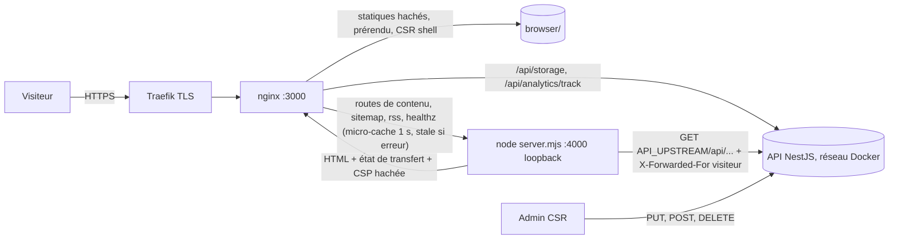

# 022 — Contenu instantané

## Description

### Objectif

Demande du propriétaire (2026-10-10, verbatim) :

> « je ne veux pas de risque je veux le mieux pour l'app ! quand je modifie je veux que ce soit dispo
> instantanément sur l'app et visible »

> « quand je modifie le code et que je push oui je veux un rebuild mais pour un update d'un
> formulaire ou le upload d'une image je veux pas de rebuild je veux que ce soit instantanément
> dispo »

### Exigence (contrat)

1. **Push de code** sur `master` : déploiement Dokploy normal (build de l'image, inchangé).
2. **Toute écriture depuis l'admin** — formulaire (projet, article, parcours, CV), envoi d'image
   (couverture, capture de galerie, portrait), ordre, suppression, publication, dépublication — est
   **visible sur le site public au rechargement suivant**, **sans aucun rebuild ni webhook**.
3. Ce qui dérive du contenu suit la même règle : accueil (projets mis en avant), `/projects`,
   `/projects/:slug`, `/blog`, `/blog/:slug`, `/about` (spec 021), `sitemap.xml`, `rss.xml`.
4. **Pas de régression** pour le visiteur : même HTML servi (SEO, JSON-LD, canonical), même
   hydratation (incrémentale, `@defer (hydrate never)` d'ADR-0014), même accessibilité, CSP stricte
   sans `'unsafe-inline'` pour les scripts, TTFB et LCP mesurés avant/après.
5. **Pas de risque** : une API indisponible ne publie jamais une page vide comme si elle était bonne ;
   le site reste servi.

### Constat (2026-10-10, `master` `e2e74f3`)

1. **Rendu** : `src/app/app.routes.server.ts` met `''`, `about`, `projects`, `projects/:slug`, `blog`,
   `blog/:slug`, `mentions-legales`, `confidentialite`, `offres` et ses pages en `RenderMode.Prerender` ;
   `login`, `two-factor`, `admin/**`, `**` en `Client`. Les slugs viennent de l'API de **production**
   au build (`fetchPrerenderSlugs`, échec ⇒ build en échec).
2. **Déjà prêt côté Angular** : `angular.json` a `outputMode: "server"` et `ssr.entry: src/server.ts` ;
   `src/server.ts` exporte un `reqHandler` (`AngularAppEngine`, API Fetch) **sans écouteur HTTP** :
   rien ne l'exécute en production.
3. **Conteneur** : `Dockerfile` copie `dist/angular-portfolio-app/browser` dans `nginx:alpine` ; nginx
   pose les en-têtes de sécurité, cache immuable des fichiers hachés, relaie `/api/storage/` (cache
   disque, ADR-0018) et `/api/analytics/track` (ADR-0021) au service API par le réseau Docker
   (`STORAGE_UPSTREAM`, gabarit envsubst), sert `index.csr.html` aux routes client et en 404.
4. **Dérivés** : `pnpm build` lance `scripts/generate-sitemap.mjs` et `scripts/generate-rss.mjs` (API de
   prod, `fetchPublicJson`) qui écrivent `public/sitemap.xml` et `public/rss.xml` (gitignorés).
5. **CSP** : `postbuild` (`scripts/apply-csp-hashes.mjs`) remplace `'unsafe-inline'` par des hachages
   page par page dans la `<meta>` CSP des fichiers prérendus. **`autoCsp` est incompatible avec le
   SSR** (doc angular.dev, *Security* : « You cannot use `autoCsp` with server-side rendering ») :
   le repo ne l'utilise pas, son post-traitement maison est transposable à la requête.
6. **Publication actuelle** : seul le blog appelle le webhook Dokploy (`BlogService.triggerDeploy`,
   API) ; une écriture de projet n'est **jamais** publiée avant le prochain push ; l'admin affiche
   pourtant « au prochain déploiement, quelques minutes après » (6 textes, cf. Plan).
7. **Branche API `feat/profile-content`** : `SiteRebuild` (A1) et le rebuild sur écriture de projet (A4)
   sont **en cours de retrait** (orchestration du 2026-10-10) ; le profil (`PUT`, portrait) ne
   déclenche aucun rebuild ; le blog garde son webhook, identique à `master`, jusqu'à la bascule de ce
   front ; son retrait est une PR API ultérieure.
8. **Throttling API** : lectures publiques à 120/min **par IP** (`PublicReadThrottle`), `trust proxy 1`
   (`nest-portfolio-app/src/main.ts:16`).
9. **Mesure de référence prod** (curl depuis le poste, 10 requêtes, 2026-10-10) : TTFB p50 28-29 ms
   sur `/`, `/blog`, `/projects`, `/about` (fichiers statiques nginx). Lighthouse mobile (mémoire perf,
   2026-10-06/10) : LCP 2,44-2,56 s, élément LCP = **texte** sur `/blog` et `/projects`.

### Hors périmètre

- Cache de données côté API, CDN, edge.
- Prévisualisation d'un brouillon sur le site public (l'aperçu admin de la spec 021 couvre `/about`).
- Retrait du webhook blog côté API : PR API ultérieure (ordre en Plan § Livraison).
- Refonte des pages statiques (offres, mentions, confidentialité) : restent prérendues.

## Plan technique

### Décision d'architecture (ADR-0024)

Les routes dont le contenu vient de l'API passent en **`RenderMode.Server`** (rendu à chaque requête,
doc angular.dev *Hybrid rendering* : « Renders the application on the server for each request ») ;
le purement statique reste **`Prerender`** ; admin et auth restent **`Client`**. Le conteneur exécute
`node server/server.mjs` **derrière nginx, dans la même image** (déploiement atomique : HTML rendu et
chunks hachés sortent du même build). nginx garde statiques, relais, en-têtes, et ajoute un
**micro-cache HTML d'une seconde servi périmé si le rendu échoue**. Sitemap et RSS sont rendus à la
requête par le serveur Node du front. Plus aucun rebuild sur écriture.



Matrice de rendu (`app.routes.server.ts`) :

| Route | Mode | Raison |
|---|---|---|
| `''` | `Server` | projets mis en avant (API) |
| `about` | `Server` | parcours (API dès la spec 021 ; `/cv` aujourd'hui) |
| `projects`, `projects/:slug` | `Server` | projets, galeries |
| `blog`, `blog/:slug` | `Server` | articles |
| `mentions-legales`, `confidentialite`, `offres`, `offres/<slug>` | `Prerender` | contenu en code |
| `login`, `two-factor`, `admin/**`, `**` | `Client` | inchangé |

### Architecture détaillée

**Serveur Node (`src/server.ts`)**

- `AngularNodeAppEngine` (singleton) remplace `AngularAppEngine` ; écouteur `node:http`
  (`createServer`) sur `127.0.0.1:4000` quand `isMainModule(import.meta.url)` ; `reqHandler =
  createNodeRequestHandler(handler)` reste exporté pour `ng serve` et le build. **Pas d'Express** : nginx
  sert les fichiers, Node ne reçoit que des routes connues (aucune dépendance ajoutée pour ça).
- Aiguillage par fonction pure `dispatchSsrRequest(pathname)` ⇒ `'health' | 'sitemap' | 'rss' |
  'angular'` : `/healthz` ⇒ `200 ok` sans appel API ; `/sitemap.xml`, `/rss.xml` ⇒ flux (§ Dérivés) ;
  le reste ⇒ `engine.handle(req, context)` puis `writeResponseToNodeResponse`.
- `context: SsrRequestContext = { apiBaseUrl, visitorForwardedFor }` passé en `REQUEST_CONTEXT`
  (second argument de `handle`) : `apiBaseUrl = ${API_UPSTREAM}/api` lu **une fois** au démarrage
  (`process.env`), `visitorForwardedFor` lu dans l'en-tête `X-Visitor-Forwarded-For` posé par nginx.
- Toute réponse HTML (rendue, CSR shell, ou asset prérendu servi par le moteur en repli) passe par
  `hardenCsp` (§ CSP) puis reçoit `Cache-Control: no-cache` (le navigateur revalide toujours).
- Typage Node : `/// <reference types="node" />` en tête de `src/server.ts` et des fichiers
  `src/server/**` qui importent `node:*` — **pas** `"node"` dans `types` de `tsconfig.app.json` (les
  globals Node resteraient interdits aux composants). Ajout de `@types/node@^22` (devDependency,
  justifiée : `IncomingMessage`/`createServer` ; le schéma SSR officiel de la CLI l'ajoute aussi).

**Côté application Angular (serveur uniquement, `app.config.server.ts`)**

- `API_BASE_URL` serveur = `REQUEST_CONTEXT.apiBaseUrl` (URL interne du réseau Docker) ; repli sur
  l'URL publique hors contexte (prérendu des routes statiques, `ng serve`).
- `HTTP_TRANSFER_CACHE_ORIGIN_MAP` : `{ [apiBaseUrl interne d'origine]: 'https://api.nedellec-julien.fr' }`
  — sans lui, la clé du transfer cache (URL interne) ne correspond pas à la requête du client (URL
  publique) et chaque page referait ses appels à l'hydratation (doc angular.dev, *SSR* : « allows you
  to establish a mapping between those origins »). **Serveur uniquement** (Angular lève une erreur si le
  jeton est présent côté client). Fourni par une factory lisant le contexte ; sans contexte, pas de
  mapping (origine déjà publique).
- `ssrUpstreamInterceptor` (`core/ssr/`, `HttpInterceptorFn`, enregistré **seulement** côté serveur) :
  1. pose `X-Forwarded-For: <visitorForwardedFor>` sur les requêtes vers `apiBaseUrl` ⇒ l'API compte
     chaque visiteur dans **son** seau de 120/min (`trust proxy 1` prend la dernière entrée, celle
     ajoutée par Traefik — même mécanique que le relais `track`, ADR-0021) ; sans cela, tous les
     visiteurs partageraient l'IP du conteneur front ⇒ 429 en rafale ⇒ pages en erreur ;
  2. en erreur d'amont (statut `0`, `429`, `5xx`) sur un `GET` : `RESPONSE_INIT.status = 503` ;
  3. les erreurs restent propagées (les pages gardent leurs états d'erreur existants).
- `markNotFound()` (`core/ssr/response-status.ts`) : `inject(RESPONSE_INIT, { optional: true })` ; sur
  le serveur pose `status = 404` ; dans le navigateur, sans effet. Appelée par `ProjectDetail`
  (`_redirectIfMissing`) et `BlogDetail` (loader en échec 404) **à la place** de `router.navigate` côté
  serveur ; côté navigateur, la redirection existante est conservée (parité avec aujourd'hui : nginx
  répond 404 à un slug absent du prérendu, puis le client redirige).

**nginx (même conteneur, gabarit du `Dockerfile`)**

- `location` dédiée aux routes de contenu, **liste fermée** :
  `~ ^/(about|projects(/[^/]+)?|blog(/[^/]+)?)?/?$` + `= /sitemap.xml`, `= /rss.xml`, `= /healthz`
  ⇒ `proxy_pass http://127.0.0.1:4000`. Les URL inconnues ne réveillent pas Node : nginx garde son 404
  sur `index.csr.html` (scanners, `/wp-login.php`…). Toute route `Server` ajoutée doit l'être ici
  aussi (la smoke CI couvre chaque route).
- En-têtes vers Node : `Host` **forcé** à `nedellec-julien.fr` (`proxy_set_header Host
  nedellec-julien.fr`), `X-Forwarded-For`/`Forwarded`/`X-Forwarded-*` vidés (sinon `console.warn` à
  chaque requête par la sanitisation d'Angular), `X-Visitor-Forwarded-For $http_x_forwarded_for`.
- **Micro-cache HTML** (zone `ssr`, `/var/cache/nginx/ssr`, non persistée) :
  `proxy_cache_valid 200 404 1s`, `proxy_cache_use_stale error timeout updating http_500 http_502
  http_503 http_504`, `proxy_cache_background_update off`, `proxy_cache_lock on`,
  `proxy_ignore_headers Cache-Control Expires Set-Cookie`, clé `$uri$is_args$args`, `max_size=200m`,
  `inactive=7d`, `X-Cache-Status $upstream_cache_status`. `/healthz` exclu du cache. Une entrée expirée
  reste sur disque (`inactive`) et n'est servie **que** si Node répond 5xx ou ne répond pas.
- `gzip_proxied any` ; snippet d'en-têtes de sécurité inclus dans la location (héritage non cumulatif,
  précédent du fichier).
- Variable : `API_UPSTREAM` (renomme `STORAGE_UPSTREAM`, qui désignait déjà le service API) pour les
  deux relais et pour Node ; `NGINX_ENVSUBST_FILTER=API_UPSTREAM`.

**Image (`Dockerfile`)**

- Étage `build` inchangé, sauf `pnpm run build` (sans sitemap/RSS) et sans dépendance à l'API.
- Étage `deps` : `pnpm install --prod --frozen-lockfile --ignore-scripts` — `jsdom` est
  `externalDependencies` (`angular.json:36`), importé à l'exécution par le bundle serveur (vérifié :
  `dist/.../server/chunk-*.mjs` importe `"jsdom"`).
- Étage `production` : `FROM nginx:alpine` ; binaire Node copié depuis `node:22-alpine`
  (`COPY --from=node:22-alpine /usr/local/bin/node`) + `apk add --no-cache libstdc++` : même Node que le
  build, entrypoint officiel nginx (gabarits envsubst) conservé. `dist/.../server` + `node_modules`
  dans `/app`, `browser/` dans `/usr/share/nginx/html`.
- `start.sh` (heredoc, précédent du fichier) : lance Node (`NODE_OPTIONS=--max-old-space-size=256`)
  et `/docker-entrypoint.sh nginx -g 'daemon off;'` en arrière-plan, boucle `kill -0` sur les deux
  PID ; si l'un meurt, le script sort en code 1 ⇒ Swarm (Dokploy) relance la tâche. `SIGTERM` relayé
  aux deux.
- `HEALTHCHECK` : `wget -q -O - http://127.0.0.1:3000/healthz` (nginx **et** Node vivants ; aucune
  dépendance à l'API : une API en panne ne doit pas faire tomber le front qui sert ses copies).

**CSP à la requête (`src/server/csp/harden-csp.ts`)**

Fonction pure `hardenCsp(html, manifest, sha256)`, **la même** pour le `postbuild` (pages prérendues)
et le serveur (pages rendues) : `scripts/apply-csp-hashes.mjs` devient un appelant (lancé par `tsx`,
déjà en devDependency) qui écrit aussi `dist/.../server/csp-manifest.json` :

- `scriptHashes` : hachages des scripts inline **constants** observés au build (pré-peinture du thème
  de `index.html`, `ng-event-dispatch-contract`, bascule `media` de beasties) ;
- `styleElementHashes`, `styleAttrHashes` : union actuelle sur toutes les pages (couvre la navigation
  SPA, qui réinjecte les feuilles de `toast.ts` et `drawer.ts`, seuls composants à `styles:`).

À la requête : script inline haché **seulement** s'il est dans `scriptHashes` **ou** s'il correspond
exactement à la forme du bootstrap jsaction
(`^window\.__jsaction_bootstrap\(document\.body,"ng",\[("[a-z]+"(,"[a-z]+")*)?\],\[("[a-z]+"(,"[a-z]+")*)?\]\);$`) ;
tout autre script inline n'est **pas** haché (bloqué par le navigateur) et journalisé. C'est la
différence de sécurité avec « hacher tout ce qui est inline » : un script injecté par un contenu
malveillant ne serait pas autorisé. JSON (`ng-state`, `ld+json`) ignoré. Styles : union du manifeste
∪ `<style>` du `<head>` de la réponse (CSS critique de beasties) ∪ attributs `style` de la réponse
(`NgOptimizedImage fill`, délais d'animation). Idempotente (une page déjà durcie ressort identique).

**Dérivés : `sitemap.xml` et `rss.xml` à la requête (serveur Node du front)**

- `src/server/feeds/sitemap.ts` (`buildSitemap`) et `rss.ts` (`buildRss`) : fonctions pures, reprises
  à l'identique des scripts (URL statiques depuis `SITE_IDENTITY`, `OFFERS`, `offerPath` ; échappement
  XML, CDATA scindé, `parseMarkdown` d'ADR-0002 avec `imageOrigin`, `toShareImageUrl`). `lastmod` des
  URL statiques = date de démarrage du serveur (= déploiement du code) ; articles : règle actuelle.
- `src/server/feeds/feed-handler.ts` : lit l'API par `fetch` (`apiBaseUrl` interne, timeout 5 s,
  **aucune attente de 429** à la requête) ; succès ⇒ `200`, `application/xml` /
  `application/rss+xml; charset=utf-8`, `Cache-Control: no-cache` ; échec ⇒ `503` (nginx sert alors la
  dernière copie). L'`enclosure` RSS (`HEAD` sur la variante `share`) est mémorisée en processus par
  URL : clés de stockage empreintées (`<id>-<sha8>`), donc immuables.
- **Choix front plutôt qu'API** : identité, catalogue d'offres, routes et rendu Markdown assaini
  sont du code front ; un endpoint API les dupliquerait (deux sources de vérité). `jsdom` est déjà
  chargé par le rendu serveur des articles.

### Fichiers à créer / modifier

| Fichier | Rôle | Tranche |
|---|---|---|
| `src/app/app.routes.server.ts` (+ `app.routes.server.spec.ts`) | matrice de rendu ; `fetchPrerenderSlugs`, `PRERENDER_API_URL` et `getPrerenderParams` **supprimés** | T1 |
| `src/server.ts` | `AngularNodeAppEngine`, écouteur `node:http` loopback, contexte, durcissement CSP, `Cache-Control`, aiguillage | T1, T2, T6 |
| `src/server/ssr-request-context.ts` | type `SsrRequestContext`, jeton de lecture typé | T1 |
| `src/server/dispatch-ssr-request.ts` (+ spec) | aiguillage pur `pathname ⇒ cible` | T1 |
| `src/app/app.config.server.ts` | `API_BASE_URL` serveur, `HTTP_TRANSFER_CACHE_ORIGIN_MAP`, intercepteur serveur | T1, T3, T4 |
| `src/app/app.config.ts` | `API_BASE_URL` : branche serveur retirée (fournie par `app.config.server.ts`) | T1 |
| `src/app/core/ssr/ssr-api-base-url.ts` (+ spec) | factory `API_BASE_URL` / origin map depuis `REQUEST_CONTEXT` | T1 |
| `src/app/core/ssr/ssr-upstream-interceptor.ts` (+ spec) | `X-Forwarded-For` visiteur, statut 503 sur erreur d'amont | T3, T4 |
| `src/app/core/ssr/response-status.ts` (+ spec) | `markNotFound()` | T5 |
| `features/projects/pages/project-detail/project-detail.ts` (+ spec) | slug inconnu : 404 serveur, redirection navigateur | T5 |
| `features/blog/pages/blog-detail/blog-detail.ts` (+ spec) | idem | T5 |
| `src/server/csp/harden-csp.ts` (+ spec) | durcissement CSP pur, partagé build/requête | T2 |
| `scripts/apply-csp-hashes.mjs` | appelle `hardenCsp`, écrit `server/csp-manifest.json` ; `postbuild` via `tsx` | T2 |
| `src/server/feeds/sitemap.ts`, `rss.ts`, `feed-handler.ts` (+ specs) | flux à la requête | T6 |
| `scripts/generate-sitemap.mjs`, `generate-rss.mjs`, `fetch-public-json.mjs` | **supprimés** | T6 |
| `package.json` | `build: ng build` ; `sitemap:build`/`rss:build` retirés ; `@types/node` ; `postbuild` via `tsx` | T1, T2, T6 |
| `.gitignore` | lignes `public/sitemap.xml`, `public/rss.xml` retirées (fichiers locaux supprimés) | T6 |
| `angular.json` | `security.allowedHosts: ["nedellec-julien.fr"]` | T1 |
| `Dockerfile` | étages `deps` et `production` nginx + Node, `start.sh`, gabarit nginx (proxy, micro-cache, `API_UPSTREAM`), `HEALTHCHECK /healthz` | T1, T4, T6 |
| `ci/api-stub/server.mjs`, `ci/api-stub/fixtures/*.json` | doublure HTTP de l'API (`node:http`, zéro dépendance) pour la smoke CI et les preuves locales | T1 |
| `.github/workflows/ci.yml` | « Verify prerendered output » réduit aux routes statiques ; smoke : réseau Docker + stub, assertions par tranche | T1-T6 |
| `features/admin/pages/admin-project-editor/admin-project-editor.ts:89`, `admin-projects.ts:91` (+ spec l.164), `admin-post-editor.ts:68`, `admin-blog.ts:39` et `:125`, `application/components/admin-post-form.ts:214` (+ spec l.860) | textes « au prochain déploiement / quelques minutes » ⇒ « visible sur le site dès l'enregistrement » | T7 |

### Modèles de données

```ts
export type SsrRequestContext = {
  readonly apiBaseUrl: string; // `${API_UPSTREAM}/api`, réseau Docker
  readonly visitorForwardedFor: string | null;
};
export type CspBuildManifest = {
  readonly scriptHashes: readonly string[];
  readonly styleElementHashes: readonly string[];
  readonly styleAttrHashes: readonly string[];
};
export type SsrTarget = 'health' | 'sitemap' | 'rss' | 'angular';
```

Lecture typée de `REQUEST_CONTEXT` (`unknown`) par une garde de forme unique dans
`ssr-request-context.ts` (frontière ; pas de lib de validation côté front, cf. profil).

### Réactivité / état

Inchangée : `rxResource`/`resource` des pages, transfer cache (`PUBLIC_READ_PATHS`, `/profile` ajouté
par la spec 021). Aucun store, aucune facade. Les caches client des gateways sont déjà invalidés par
les pages admin après écriture (`invalidateAllProjects`, `invalidateBundle`) : la navigation SPA dans
le même onglet voit aussi le nouveau contenu.

### Garanties à tenir (et ce qui les prouve)

| Exigence | Mécanisme | Mesure prévue |
|---|---|---|
| Instantané | rendu à chaque requête ; micro-cache ≤ 1 s ; `Cache-Control: no-cache` navigateur | local : écriture admin puis rechargement ⇒ visible, sans build (T1) ; prod : `X-Cache-Status` MISS/EXPIRED après 1 s |
| Résilience | statut 503 si l'amont échoue (T4) ⇒ nginx sert la dernière copie (`STALE`) ; à froid sans copie : page d'erreur 503, le client réessaie à l'hydratation (transfer cache sans la requête en échec) | local : stub arrêté ⇒ `X-Cache-Status: STALE`, contenu précédent ; cache vidé + stub arrêté ⇒ 503 |
| SSRF / Host | `Host` forcé par nginx, `allowedHosts` (Angular répond 400 sinon), Node lié à `127.0.0.1`, URL d'API fixe (env) jamais dérivée de la requête | `curl -H 'Host: evil.test'` ⇒ rendu normal (Host réécrit) ; `NG_ALLOWED_HOSTS` non utilisé |
| CSP | `hardenCsp` à la requête, allowlist | spec + `curl` : aucune `'unsafe-inline'` en `script-src`/`style-src` ; console navigateur sans violation sur les 6 routes |
| Hydratation | même HTML qu'en prérendu ; ADR-0001 et ADR-0014 valides (le rendu serveur reste la condition, prérendu ou requête) | HTML contient `ng-state` et `ngh` ; Réseau : aucun `GET /api/*` des lectures publiques au chargement |
| TTFB | rendu ~ dizaines de ms attendu, **non mesuré** | `curl -w %{time_starttransfer}` ×20 par route avant/après ; seuil d'acceptation : p50 ≤ 250 ms (pari, cf. Risques) |
| LCP | LCP = texte ⇒ suit le TTFB | Lighthouse mobile ×5 médiane `/`, `/blog`, `/projects` ; régression acceptée ≤ 150 ms vs référence |
| Mémoire/CPU | Node ~ 100-200 Mo attendu (jsdom compris), **non mesuré** | `docker stats` au repos et sous `pnpm dlx autocannon -c 10 -d 30` sur `/blog/<slug>` ; RSS max et CPU consignés ; `max-old-space-size` ajusté |

### Tranches

Une seule PR front (les tranches T1-T7 se suivent dans la branche ; T1 seule exposerait une CSP
`'unsafe-inline'`, la PR ne part qu'avec T2). Chaque tranche ajoute ses assertions à la smoke CI.

- **Tranche 1 — une écriture admin est visible au rechargement, sans rebuild** : matrice de rendu,
  `server.ts` (moteur Node, écouteur, contexte, aiguillage, `/healthz`), `API_BASE_URL` serveur et
  origin map, `allowedHosts`, image nginx + Node, location de proxy (sans micro-cache), stub API,
  `@types/node`. Tests : `app.routes.server.spec` (`it.each` : six routes `Server`, statiques
  `Prerender`, admin/auth `Client` ; aucune route avec `getPrerenderParams`) ; `dispatch-ssr-request.spec`
  (`it.each` : `/healthz`, `/sitemap.xml`, `/rss.xml`, `/blog/x` ⇒ cible) ; `ssr-api-base-url.spec`
  (contexte présent ⇒ URL interne + mapping vers l'origine publique ; absent ⇒ URL publique, pas de
  mapping). Runtime : stub ⇒ `/blog` liste la fixture ; fixture modifiée, rechargement ⇒ visible.
- **Tranche 2 — la CSP reste stricte sur les pages rendues à la requête** : `hardenCsp` partagé,
  manifeste de build, branchement serveur. Tests : `harden-csp.spec` (`'unsafe-inline'` retiré de
  `script-src`/`style-src` ; script du manifeste haché ; bootstrap jsaction haché, variante à
  événements multiples aussi ; **script inline inconnu non haché** ; bootstrap altéré
  (`;alert(1)` ajouté) non haché ; JSON ignoré ; `<style>` du `<head>` haché, `<style>` du `<body>` non ;
  attribut `style` haché ; idempotence ; `<meta>` absente ⇒ erreur). CI : grep `'unsafe-inline'` sur
  les réponses `curl` des routes `Server`.
- **Tranche 3 — chaque visiteur garde son propre quota API** : intercepteur, `X-Forwarded-For`. Tests :
  `ssr-upstream-interceptor.spec` (`HttpTestingController` : requête vers `apiBaseUrl` porte
  `X-Forwarded-For` = contexte ; hors `apiBaseUrl` ou contexte sans valeur ⇒ pas d'en-tête).
- **Tranche 4 — une API en panne ne publie pas de page vide** : statut 503, micro-cache stale.
  Tests : intercepteur (`it.each` 0, 429, 500, 503 ⇒ `RESPONSE_INIT.status` 503 ; 200 et 404 ⇒
  inchangé ; sans `RESPONSE_INIT` (navigateur) ⇒ rien). Runtime : stub arrêté ⇒ `STALE` ; à froid ⇒ 503.
- **Tranche 5 — un slug inconnu reste une vraie 404** : `markNotFound`, deux pages. Tests :
  `response-status.spec` ; `project-detail.spec`/`blog-detail.spec` (plateforme serveur + slug absent
  ⇒ `status` 404, `navigate` non appelé ; navigateur ⇒ redirection inchangée). Smoke : `/projects/inexistant`
  ⇒ 404.
- **Tranche 6 — sitemap et RSS suivent le contenu à la requête** : builders, handler, suppression des
  scripts, `build: ng build`. Tests : `sitemap.spec` (statiques + offres + projets + articles,
  `lastmod` = max(`updatedAt`, `publishedAt`), échappement) ; `rss.spec` (item, CDATA `]]>` scindé,
  `enclosure` présente/absente, `content:encoded` assaini) ; `feed-handler.spec` (`fetch` doublé :
  succès ⇒ 200 + type ; échec ou timeout ⇒ 503 ; enclosure mémorisée : un seul `HEAD` pour deux
  requêtes). Build sans réseau : `pnpm run build` passe avec l'API injoignable.
- **Tranche 7 — l'admin dit la vérité** : six textes. Tests : specs existants mis à jour
  (`admin-projects.spec` l.164, `admin-post-form.spec` l.860) + un cas par éditeur.

### Livraison (ordre, sans trou)

1. **PR API spec 021** (A1/A4 retirés, profil sans rebuild, blog inchangé) : indépendante de 022.
2. **PR front 022** : avant merge, dans Dokploy, `API_UPSTREAM` défini (reprendre la valeur de
   `STORAGE_UPSTREAM` si elle y était surchargée) et limite mémoire du service vérifiée.
   **Valeur** : `API_UPSTREAM=http://portfolio-jned-backend-oklc7p:3000` (origine seule : ni `/api`, ni
   barre finale ; Node ajoute `/api`, nginx ajoute le chemin). C'est la valeur par défaut de l'image,
   reprise telle quelle de l'ancien `STORAGE_UPSTREAM` du gabarit, qui relaie déjà `/api/storage/` et
   `/api/analytics/track` en prod. À vérifier dans Dokploy avant merge : (a) si une variable
   `STORAGE_UPSTREAM` y est définie, copier sa valeur dans `API_UPSTREAM` puis supprimer
   `STORAGE_UPSTREAM` (plus lue) ; (b) sinon, rien à définir, mais confirmer le nom du service API sur
   le réseau Docker (`ssh homeserver docker service ls --filter name=portfolio-jned-backend`, le
   suffixe `-oklc7p` est propre à l'environnement Dokploy) et son port interne (3000). Merge ⇒ build
   Dokploy ⇒ conteneur nginx + Node. Vérif prod en `GET` : six routes 200, `X-Cache-Status`, CSP,
   `sitemap.xml`/`rss.xml` valides, TTFB, `docker ps` (healthy). Entre 2 et 3, publier un article
   lance encore un rebuild inutile (redémarrage du conteneur, cache froid) : sans perte, contenu déjà
   visible.
3. **PR API « retrait du webhook blog »** (`triggerDeploy` et `DOKPLOY_DEPLOY_WEBHOOK_URL`), après 2
   vérifiée en prod **et** une première écriture réelle observée instantanée ; puis retrait de la
   variable dans Dokploy.
4. **PRs front spec 021** (F1 puis F2-F8) **après** 2 : `/about` lit l'API à la requête, aucune garde
   de build. Avant 2, une édition du parcours n'aurait aucun chemin de publication.

Retour arrière : revert de la PR 022 ⇒ image statique précédente ; tant que 3 n'est pas fait, le blog
republie encore par webhook ; après 3, les écritures attendent un push.

Conséquence pour `.claude/CLAUDE.md` item 10 (à proposer à l'utilisateur, pas édité ici) : le build ne
lit plus l'API ; l'ordre API puis front reste requis car le front lit l'API **à l'exécution**.

### Consignes pour `qa`

- RED par assertion : poser d'abord signatures et fichiers vides (`hardenCsp` identité, builders
  rendant `''`, `markNotFound` sans effet, matrice inchangée) pour que le rouge tombe sur une valeur.
- `hardenCsp` testé avec un `sha256` injecté déterministe (`(t) => \`sha256-${t.length}:${t}\``) :
  pas de `node:crypto` dans les specs.
- Plateforme serveur en test : `{ provide: PLATFORM_ID, useValue: 'server' }` + `RESPONSE_INIT` fourni
  par un objet `{ status: 200, headers: new Headers() }` ; `REQUEST_CONTEXT` par valeur.
- Zoneless : jamais `fakeAsync` ; timeout du handler par `vi.useFakeTimers` (skill
  `angular-async-testing`). Lire `$?` après `pnpm test`.

### Risques & inconnues

- **TTFB/mémoire non mesurés** : seuils (p50 ≤ 250 ms, régression LCP ≤ 150 ms, 256 Mo de tas) sont
  des paris de calibration ; ils supposent un rendu de l'ordre de 20-80 ms et un trafic faible sur le
  homeserver. Mesure T1 avant d'engager T2-T7 ; dépassement ⇒ retour au propriétaire.
- **Compatibilité binaire** du Node de `node:22-alpine` dans `nginx:alpine` (musl, `libstdc++`) :
  vérifiée par `node --version` et la smoke ; repli : `FROM node:22-alpine` + `apk add nginx`
  (gabarits envsubst à rejouer à la main).
- **Liste de routes dupliquée** nginx/`app.routes.server.ts` : une route `Server` oubliée dans nginx
  répond 404 ; la smoke CI couvre chaque route, un ajout futur doit l'étendre.

### Décisions à arbitrer par le propriétaire

> **Arbitré le 2026-10-10 par le propriétaire : les quatre recommandations sont retenues** (micro-cache 1 s + copie périmée, une seule image nginx + Node, sitemap/RSS servis par le front, vraie 404 côté serveur).

1. **Résilience vs instantané strict** — recommandation : **micro-cache 1 s + copie périmée servie si
   l'API ou Node échoue** (contenu visible au plus 1 s après l'écriture ; en panne, le visiteur voit la
   dernière version bonne au lieu d'une erreur). Alternative : aucun cache HTML (strictement instantané,
   mais API en panne ⇒ page d'erreur 503 pour tous).
2. **Topologie** — recommandation : **nginx + Node dans la même image** (un seul service Dokploy,
   déploiement atomique, relais et cache conservés). Alternatives : deux services Dokploy (fenêtre où
   HTML et chunks ne viennent pas du même build) ; Node seul (perte du cache disque des images et de la
   copie périmée).
3. **Sitemap/RSS** — recommandation : **serveur Node du front** (une seule source pour identité, offres,
   rendu Markdown). Alternative : endpoints API (duplication front/API).
4. **Slug inconnu** — recommandation : **404 HTTP côté serveur, redirection gardée côté navigateur**
   (parité SEO avec aujourd'hui). Alternative : redirection 302 vers la liste (ce que ferait le rendu
   serveur sans changement), lue par Google comme soft 404.

## Plan de test

### Tranche 1 — une écriture admin est visible au rechargement, sans rebuild

Signatures neutres posées pour que le rouge tombe sur une valeur : `src/server/dispatch-ssr-request.ts`
(`dispatchSsrRequest` rend toujours `'angular'`), `src/app/core/ssr/ssr-api-base-url.ts`
(`provideSsrApiBaseUrl()` fournit `API_BASE_URL = ''` et `HTTP_TRANSFER_CACHE_ORIGIN_MAP = {}`) ;
matrice `app.routes.server.ts` inchangée.

`src/app/app.routes.server.spec.ts` (réécrit ; tests de `fetchPrerenderSlugs` retirés, la fonction
est supprimée par le Plan) :

| Test | Scénario | Assertion clé |
|---|---|---|
| `renders the content route "%s" on each request` (`it.each` ×6) | `''`, `about`, `projects`, `projects/:slug`, `blog`, `blog/:slug` | `renderMode` = `RenderMode.Server` |
| `renders on request exactly the content routes and nothing else` | ensemble des routes `Server` | égal (trié) aux six routes : aucune route serveur hors de la liste nginx |
| `prerenders the static page %s` (×3) | `mentions-legales`, `confidentialite`, `offres` | `Prerender` (vert : garde) |
| `prerenders the offer page offres/%s` (×N) | chaque offre | `Prerender` (vert : garde) |
| `renders %s in the browser only` (×4) | `login`, `two-factor`, `admin/**`, `**` | `Client` (vert : garde) |
| `never asks the API for route params at build time` | routes portant `getPrerenderParams` | `[]` |
| `leaves the legacy offer url to the client fallback…` | `offre-site-industrie` | absente (vert : garde) |

`src/server/dispatch-ssr-request.spec.ts` :

| Test | Scénario | Assertion clé |
|---|---|---|
| `Given the pathname %s When it is dispatched Then it targets %s` (`it.each` ×8) | `/healthz`, `/sitemap.xml`, `/rss.xml` ; `/`, `/blog/x`, `/projects`, `/blog/rss.xml`, `/healthz/extra` | `health`, `sitemap`, `rss` ; `angular` pour les cinq autres (correspondance exacte, verts : garde) |

`src/app/core/ssr/ssr-api-base-url.spec.ts` (TestBed, `REQUEST_CONTEXT` par valeur, lecture de
`API_BASE_URL` et `HTTP_TRANSFER_CACHE_ORIGIN_MAP`) :

| Test | Scénario | Assertion clé |
|---|---|---|
| contexte présent (`it.each` ×2) | `http://api:3000/api`, `http://portfolio-api:8080/api` | URL interne ; mapping `{ <origine interne>: 'https://api.nedellec-julien.fr' }` (clé = origine, sans `/api`, exigence d'Angular) |
| sans contexte | aucun `REQUEST_CONTEXT` fourni | `https://api.nedellec-julien.fr/api`, mapping `{}` |
| contexte malformé (`it.each` ×3) | `null`, `apiBaseUrl` non chaîne, chaîne nue | repli public, mapping `{}` |

Preuve runtime attendue de l'implémenteur (à consigner dans `## Verify`) :

1. `node ci/api-stub/server.mjs` (fixtures `ci/api-stub/fixtures/*.json`, dont une liste d'articles
   `blog/posts` contenant un titre repérable, p. ex. `Article témoin A`), puis l'image construite
   (`docker build -t ng-portfolio-app:local .`) lancée sur un réseau Docker commun avec
   `API_UPSTREAM` pointant le stub.
2. `curl -s http://localhost:3000/healthz` ⇒ `200 ok` ; `curl -s http://localhost:3000/blog | grep -c 'Article témoin A'` ⇒ ≥ 1,
   et le HTML contient `ng-state` et `ngh`.
3. Modifier la fixture (titre ⇒ `Article témoin B`) **sans rebuild ni redémarrage du conteneur**
   (stub relisant ses fixtures à chaque requête, ou redémarré seul) ; `curl -s http://localhost:3000/blog`
   ⇒ `Article témoin B` présent, `Article témoin A` absent. Idem pour `/blog/<slug>`.
4. Journaux du stub : les requêtes de rendu arrivent sur l'URL interne (`API_UPSTREAM/api/...`) ;
   navigateur sur `/blog` : aucun `GET /api/blog/posts` au chargement (transfer cache via l'origin map).
5. `curl -H 'Host: evil.test' http://localhost:3000/blog` ⇒ rendu normal ; `/wp-login.php` ⇒ 404 nginx
   sans requête vers Node.

RED confirmé via la commande test du profil (`pnpm test`, après `pnpm exec ng cache clean`) le
2026-10-10 21:39, 17 failed / 3656 total, `exit=1`. Nature des échecs : 17 `AssertionError`
uniquement (6 × `expected 2 to be +0` sur `renderMode`, liste `Server` vide, `getPrerenderParams`
sur `projects/:slug` et `blog/:slug`, 3 × `expected 'angular' to be …`, 6 × `{ apiBaseUrl: '',
originMap: {} }`), aucune erreur de typage, de harnais ni de rejet non géré ; 206 fichiers et
3639 tests antérieurs verts. Prettier et ESLint verts sur les fichiers touchés.

### Tranche 2 — la CSP reste stricte sur les pages rendues à la requête

Signature neutre posée : `src/server/csp/harden-csp.ts` (type `CspBuildManifest` du Plan,
`hardenCsp(html, manifest, sha256)` rend `html` tel quel).

Contrat fixé par les tests (à tenir en GREEN) :

- `sha256` injecté rend une **expression de source CSP déjà entre apostrophes** (`'sha256-…'`), comme
  la fonction actuelle de `scripts/apply-csp-hashes.mjs` ; le manifeste stocke ces expressions telles
  quelles et `hardenCsp` les recopie sans les retoucher.
- Doublure : `fakeSha256` rend `'sha256-<base64 de l'UTF-8 du texte>'` au lieu de la forme
  `sha256-${t.length}:${t}` suggérée au Plan : le contenu d'un script contient `"` et `;`, qui
  casseraient l'attribut `content` de la `<meta>` et le découpage des directives au second passage.
- `script-src` : uniquement les scripts inline **présents dans la page** et autorisés (manifeste ou
  forme exacte du bootstrap jsaction). `style-src` : manifeste ∪ `<style>` du `<head>`.
  `style-src-attr` : `'unsafe-hashes'` + manifeste ∪ attributs `style` de la page.
- La journalisation d'un script refusé n'est pas testée : la signature du Plan n'a pas de journal
  injecté (à faire dans `src/server.ts`, preuve par les journaux du conteneur si souhaitée).

`src/server/csp/harden-csp.spec.ts` (fonction pure, sans TestBed, page minimale construite par
`aPage({ head, body })`, CSP de base calquée sur `index.server.html`) :

| Test | Scénario | Assertion clé |
|---|---|---|
| `unsafe-inline leaves script-src and style-src…` | page sans code inline, manifeste vide | `script-src` et `style-src` = `'self' https://giscus.app` exactement |
| `directives unrelated to inline code are kept…` | idem | `img-src`, `object-src` inchangés (vert : garde) |
| `inline script listed in the build manifest…` | script du thème, hachage au manifeste | `script-src` = `'self'`, giscus, hachage du thème |
| `event replay bootstrap with %s…` (`it.each` ×3) | un événement, plusieurs (deux listes non vides), aucun ; manifeste vide | `script-src` contient exactement le hachage du bootstrap |
| `neither in the manifest nor the bootstrap…` | thème + `fetch('/collect?c='+document.cookie)` dans le body | hachage du script inconnu absent (`script-src` exact) |
| `bootstrap altered with %s…` (`it.each` ×3) | `;alert(1)` ajouté, `alert(1);` préfixé, appel refermé tôt | hachage altéré absent (`script-src` exact) |
| `JSON data scripts…` | `ng-state` et `ld+json` | absents de `script-src` (exact) |
| `style elements in the head and in the body…` | `<style ng-app-id>` du head, `<style>` du body, feuille SPA au manifeste | `style-src` = sources de base + manifeste + head, pas le body |
| `style attributes in the page…` | `style` de `fill` (avec `;`) et `animation-delay`, un attribut au manifeste | `style-src-attr` = `'unsafe-hashes'` + les trois hachages |
| `already hardened page… identical` | page complète durcie deux fois | second passage `toBe` premier ; directives exactes, sans doublon |
| `page without a CSP meta… fails` | HTML sans `<meta>` CSP | `toThrow()` |

Contrôle `Cache-Control: no-cache` : le Plan le pose dans `src/server.ts` (module à effets de bord :
moteur instancié, écouteur), pas dans une fonction pure ⇒ **pas de test unitaire**, preuve runtime
ci-dessous (et assertion de smoke CI).

Preuve runtime attendue de l'implémenteur (`## Verify`) et assertions à ajouter à la smoke CI :

1. Build : `dist/angular-portfolio-app/server/csp-manifest.json` présent, trois tableaux non vides
   (`scriptHashes` couvre thème, contrat d'event dispatch, bascule beasties) ; les pages prérendues
   restent hachées (contrôle CI existant `! grep -l -E "(script|style)-src [^;]*'unsafe-inline'"`).
2. Image lancée contre le stub : pour chaque route `Server` (`/`, `/about`, `/projects`,
   `/projects/projet-temoin`, `/blog`, `/blog/article-temoin`), corps écrit dans un fichier puis
   `grep -c 'http-equiv="Content-Security-Policy"'` ⇒ 1 et
   `! grep -E "(script|style)-src [^;]*'unsafe-inline'"` ⇒ aucune occurrence.
3. `curl -fsS -D - -o /dev/null http://127.0.0.1:3000/blog` ⇒ en-tête `Cache-Control: no-cache`
   (idem sur `/` et `/blog/article-temoin`).
4. Navigateur, six routes `Server` puis navigation SPA vers une page à toast/drawer : console sans
   violation CSP.

RED confirmé via la commande test du profil (`pnpm test`, après `pnpm exec ng cache clean` et
`rm -rf node_modules/.vite`) le 2026-10-10 21:57, run commun T2 et T3 : 19 failed / 3679 total,
`exit=1`, dont 14 failed sur les 15 tests de `harden-csp.spec` (le seul vert est la garde des
directives sans rapport). Nature des échecs : `AssertionError` uniquement (sources CSP qui gardent
`'unsafe-inline'` sans hachage, `style-src-attr` absent, `expected [Function] to throw`), aucune
erreur de typage, de harnais ni de rejet non géré ; 209 fichiers et les 3656 tests antérieurs (T1
comprise) verts. Prettier et ESLint verts sur les fichiers touchés.

### Tranche 3 — chaque visiteur garde son propre quota API

Signature neutre posée : `src/app/core/ssr/ssr-upstream-interceptor.ts`
(`ssrUpstreamInterceptor: HttpInterceptorFn` qui transmet la requête sans la modifier).

`src/app/core/ssr/ssr-upstream-interceptor.spec.ts` (TestBed, `provideHttpClient(withInterceptors(
[ssrUpstreamInterceptor]))` + `provideHttpClientTesting()`, `verify()` en `afterEach`,
`PLATFORM_ID` et `REQUEST_CONTEXT` par valeur ; contexte interne `http://api:3000/api`) :

| Test | Scénario | Assertion clé |
|---|---|---|
| `server render for the visitor %s… carries the visitor address` (`it.each` ×2) | `203.0.113.7`, chaîne multi-sauts `198.51.100.4, 203.0.113.7` ; `GET <apiBaseUrl>/blog/posts` | `X-Forwarded-For` = valeur du contexte, à l'identique |
| `request goes to %s Then only the internal API request carries…` (`it.each` ×3) | API publique, origine tierce (giscus), asset relatif, chacun avec une requête interne témoin | `{ internal: '203.0.113.7', outside: null }` |
| `without a known visitor address…` | contexte `visitorForwardedFor: null` | pas d'en-tête (vert : garde) |
| `without request context…` | serveur, aucun `REQUEST_CONTEXT` (prérendu) | pas d'en-tête (vert : garde) |
| `Given the browser…` | `PLATFORM_ID` navigateur, pas de contexte | pas d'en-tête (vert : garde) |

L'enregistrement **serveur seulement** (`app.config.server.ts`, absent d'`app.config.ts`) n'a pas de
test unitaire (les fournisseurs de `provideHttpClient` sont opaques) : il est prouvé au runtime.

Preuve runtime attendue de l'implémenteur (`## Verify`) :

1. Image lancée contre le stub (qui journalise déjà `xff=<x-forwarded-for>` par requête) :
   `curl -H 'X-Forwarded-For: 198.51.100.9' http://127.0.0.1:3000/blog` ⇒ journal du stub
   `GET /api/blog/posts xff=198.51.100.9` (nginx transmet l'en-tête en `X-Visitor-Forwarded-For`,
   Node le repose vers l'amont) ; deux valeurs différentes sur deux requêtes (`/blog` puis
   `/blog/article-temoin`, après expiration du micro-cache si T4 est en place) ⇒ deux `xff` distincts.
2. Sans en-tête client ⇒ `xff=-` côté stub (localement, sans Traefik devant nginx).
3. Navigateur : aucune requête `/api/*` émise par le client ne porte d'`X-Forwarded-For` (onglet
   Réseau), l'intercepteur n'existant pas dans le bundle navigateur.

RED confirmé via la commande test du profil (même run que la Tranche 2, 2026-10-10 21:57) :
19 failed / 3679 total, `exit=1`, dont 5 failed sur les 8 tests de `ssr-upstream-interceptor.spec`
(les 3 verts sont les gardes « pas d'en-tête »). Nature des échecs : `AssertionError` uniquement
(`expected null to be '203.0.113.7'`, `expected null to be '198.51.100.4, 203.0.113.7'`,
`{ internal: null, outside: null }`), aucune erreur de harnais ni de typage ; T1 et l'existant verts.

### Tranche 4 — une API en panne ne publie pas de page vide

Pas de nouvelle signature : les tests étendent `src/app/core/ssr/ssr-upstream-interceptor.spec.ts`
(T3) d'un bloc `upstream failures during a server render` ; `setUp` reçoit des fournisseurs en plus
(construction des entrées seulement, aucune assertion de T3 touchée). `RESPONSE_INIT` fourni par
`{ status: 200, headers: new Headers() }`, contexte serveur avec `apiBaseUrl` interne, `GET
<apiBaseUrl>/blog/posts`.

| Test | Scénario | Assertion clé |
|---|---|---|
| `API answers %s to a GET… page answers 503 and the error still reaches the page` (`it.each` ×4) | 0 (`ProgressEvent`), 429, 500, 503 | `{ responseStatus: 503, propagatedStatus: <statut d'amont> }` |
| `API answers %s to a GET… status is left as it is` (`it.each` ×2) | 200, 404 | `responseStatus` 200 ; erreur propagée `null` / 404 (verts : garde) |
| `write that fails upstream…` | `POST` en 500 | `responseStatus` 200, erreur propagée 500 (vert : garde, le Plan borne au `GET`) |
| `no response to shape…` | pas de `RESPONSE_INIT` (navigateur, prérendu) | rien ne lève, erreur propagée 503 (vert : garde) |

Preuve runtime attendue (`## Verify`, assertions à ajouter à la smoke CI) :

1. Instantané : écriture de fixture puis `curl -sD -` deux fois à plus d'une seconde d'écart ⇒
   `X-Cache-Status: MISS` ou `EXPIRED` et nouveau contenu ; deux requêtes dans la même seconde ⇒
   la seconde en `HIT`.
2. Copie périmée : page chaude, stub arrêté, attente de plus d'une seconde ⇒ `curl` sur `/blog`
   ⇒ 200, `X-Cache-Status: STALE`, contenu précédent.
3. À froid : cache vidé (`rm -rf /var/cache/nginx/ssr/*` dans le conteneur, ou conteneur neuf) et
   stub arrêté ⇒ `/blog` ⇒ 503 ; stub relancé ⇒ 200 au rechargement suivant.
4. `/healthz` ⇒ 200 avec le stub arrêté (le front ne dépend pas de l'API pour vivre), jamais
   `X-Cache-Status`.

RED confirmé via la commande test du profil (`pnpm test`, après `pnpm exec ng cache clean` et
`rm -rf node_modules/.vite`) le 2026-10-10 22:19, run commun T4 à T7 : 42 failed / 3725 total,
`exit=1`, dont 4 failed sur les 8 tests de cette tranche (les 4 verts sont les gardes). Nature :
`AssertionError` uniquement (`expected { responseStatus: 200, … } to deeply equal { responseStatus:
503, … }`), aucune erreur de typage, de harnais ni de rejet non géré.

### Tranche 5 — un slug inconnu reste une vraie 404

Signature neutre posée : `src/app/core/ssr/response-status.ts`, `injectMarkNotFound(): () => void`
(le marqueur rendu ne fait rien). **Écart au Plan** : le Plan nomme `markNotFound()` avec un
`inject()` interne ; ses deux appelants sont un `effect()` (`ProjectDetail`) et un `loader` async de
`resource()` (`BlogDetail`), aucun n'est un contexte d'injection (NG0203). Le jeton est donc lu à la
construction (`inject*`, comme `injectSsrRequestContext`) et le marqueur appelé plus tard.

| Test | Scénario | Assertion clé |
|---|---|---|
| `response-status.spec` : `server render… after its data arrived Then the response status is 404` | marqueur créé en contexte d'injection, appelé hors contexte, `RESPONSE_INIT` fourni | `status` 404 |
| `response-status.spec` : `Given the browser…` | pas de `RESPONSE_INIT` | ne lève pas (vert : garde) |
| `project-detail.spec` : `server render of the slug %s…` (`it.each` ×2) | `PLATFORM_ID` serveur + `RESPONSE_INIT`, liste chargée ; `inexistant`, `mon-site` | `{ status: 404, navigations: [] }` ; `{ status: 200, navigations: [] }` (second vert : garde) |
| `blog-detail.spec` : `server render When the API answers %s…` (`it.each` ×2) | `HttpErrorResponse` 404, 503 | `{ status: 404, navigations: [] }` ; `{ status: 200, navigations: [] }` : une panne d'amont ne devient pas une 404 (nginx ne servirait pas sa copie périmée sur une 404) et le serveur ne redirige jamais |

Côté navigateur, les tests existants `redirige vers /projects si le slug est introuvable` et
`redirige vers /blog si le slug est introuvable (404)` restent la garde de la redirection (verts,
inchangés). `setup` des deux specs reçoit des fournisseurs en plus (construction des entrées).

Preuve runtime attendue : smoke `curl -s -o /dev/null -w '%{http_code}'` sur `/projects/inexistant`
et `/blog/inexistant` ⇒ 404 (deux fois, la seconde servie par le micro-cache, `X-Cache-Status: HIT`) ;
`/projects/projet-temoin` ⇒ 200 ; navigateur : lien client vers un slug absent ⇒ redirection vers la
liste inchangée.

RED confirmé (même run, 2026-10-10 22:19) : 42 failed / 3725 total, `exit=1`, dont 4 failed sur
les 6 tests de cette tranche (`expected 200 to be 404`, `{ status: 200, … }` contre `{ status: 404,
navigations: [] }` ×2, et le cas blog 503 rouge parce que la page redirige aujourd'hui sur toute
erreur). `AssertionError` uniquement.

### Tranche 6 — sitemap et RSS suivent le contenu à la requête

Signatures neutres posées dans `src/server/feeds/` :

- `sitemap.ts` : `buildSitemap({ projectSlugs, posts, staticLastmod }): string` (rend `''`) ;
  `posts` typés `Pick<BlogPost, 'slug' | 'publishedAt' | 'updatedAt'>`.
- `rss.ts` : `buildRss(items: readonly { post; enclosure: { url; type; length } | null }[], builtAt):
  string` (rend `''`) et `escapeCdata(html)` (identité). `escapeCdata` est exporté et testé seul :
  sous happy-dom, `parseMarkdown` ne laisse passer aucun `]]>` (texte, code, attribut `title` et
  HTML brut sondés : `>` échappé ou attribut retiré), la scission n'est donc pas atteignable par
  `buildRss`.
- `feed-handler.ts` : `createFeedHandler({ apiBaseUrl, fetch, startedAt }): (target: 'sitemap' |
  'rss') => Promise<Response>` (rend toujours `new Response(null)`) ; `src/server.ts` écrit la
  `Response` comme celle du moteur.

Données : `makeBlogPost` (builder existant) pour les articles ; projets réduits à leurs slugs ;
doublure `fetch` routée par URL exacte (URL inconnue ⇒ 404).

| Test | Scénario | Assertion clé |
|---|---|---|
| `sitemap.spec` : ordre des URL | 2 projets, 1 article | `loc` = `/`, `/about`, `/projects`, `/blog`, `/mentions-legales`, `/confidentialite`, `/offres`, chaque offre, projets, article |
| `sitemap.spec` : entrée projet | 1 projet | prologue + `urlset` exacts, bloc `<url>` exact (`lastmod` 2026-10-10 = démarrage, `monthly`, `0.7`), fin `</urlset>\n` |
| `sitemap.spec` : statiques datées | aucun contenu | 7 + offres `lastmod` = `2026-10-10` |
| `sitemap.spec` : `lastmod` article (`it.each` ×3) | retouche après publication, publication après retouche, jamais publié | max(`updatedAt`, `publishedAt`) au jour |
| `sitemap.spec` : échappement | slug `r&d<2026>` | `…/blog/r&amp;d&lt;2026&gt;` |
| `rss.spec` : canal | 1 item | 10 premières lignes exactes (prologue, espaces de noms, titre, `atom:link` self, langue, `lastBuildDate` `Sat, 10 Oct 2026 21:00:00 GMT`) |
| `rss.spec` : item | titre `Angular & signaux <v22>`, extrait `L'essentiel`, 2 tags | 9 lignes exactes (titre et tags échappés, `link`, `guid isPermaLink`, `pubDate` UTC, `dc:creator`, `description` avec `&apos;`) |
| `rss.spec` : enclosure présente / absente | couverture mesurée, puis aucune | ligne `<enclosure url length type />` exacte ; `{ items: 1, enclosures: 0 }` |
| `rss.spec` : `content:encoded` | gras, `<script>`, image `/api/storage/…` | paragraphe rendu, `src` préfixé par l'origine du site, aucun `<script` |
| `rss.spec` : ordre | 2 articles | ordre de l'API |
| `rss.spec` : `escapeCdata` (`it.each` ×3) | un `]]>`, deux, aucun | chaque fin de section scindée (le troisième vert : garde) |
| `feed-handler.spec` : sitemap sain | API saine | 200, `application/xml; charset=utf-8`, `no-cache`, projet et article présents |
| `feed-handler.spec` : RSS sain | idem | 200, `application/rss+xml; charset=utf-8`, `no-cache`, enclosure exacte, un `HEAD` sur `<apiBaseUrl>/storage/…?variant=share` |
| `feed-handler.spec` : enclosure mémorisée | deux requêtes RSS | enclosure dans les deux, un seul `HEAD` |
| `feed-handler.spec` : échecs (`it.each` ×6) | sitemap et RSS × injoignable, 500/502, 429 | 503 (un 429 n'est pas attendu : aucun timer avancé) |
| `feed-handler.spec` : timeout (`it.each` ×2) | `GET /blog/posts` sans réponse (rejette sur `abort`), `vi.useFakeTimers` | rien à 4 999 ms, 503 à 5 000 ms ; le délai doit passer par un timer simulable (`setTimeout` + `AbortController`, pas `AbortSignal.timeout`) |

Non tranché par les tests : un `HEAD` de couverture en échec (le build échouait ; à la requête,
enclosure omise ou 503 : choix de l'implémenteur, à consigner dans `## Implémentation`).

Preuve attendue (`## Verify`) :

1. Build sans réseau : `docker build --network none …` ou `unshare -rn pnpm run build` (API
   injoignable) ⇒ `exit=0` ; `dist/.../browser/` ne contient ni `sitemap.xml` ni `rss.xml`, et
   `scripts/generate-*.mjs`, `fetch-public-json.mjs` n'existent plus (`grep -rn
   "sitemap:build\|rss:build\|fetch-public-json" package.json scripts Dockerfile` vide).
2. Image contre le stub : `/sitemap.xml` ⇒ 200 `application/xml`, `xmllint --noout` OK, URL du
   projet et de l'article témoins ; `/rss.xml` ⇒ 200 `application/rss+xml`, `xmllint --noout` OK,
   enclosure présente ; fixture d'article modifiée ⇒ nouveau titre dans `/rss.xml` après une seconde,
   sans rebuild.
3. Stub arrêté après une première lecture ⇒ `/rss.xml` 200 `X-Cache-Status: STALE` ; journal du stub :
   un seul `HEAD` de couverture pour plusieurs rendus.

RED confirmé (même run, 2026-10-10 22:19) : 42 failed / 3725 total, `exit=1`, dont 26 failed sur
les 27 tests de cette tranche (sitemap 7/7, RSS 8/9, handler 11/11). `AssertionError` uniquement
(`expected [] to deeply equal [ Array(15) ]`, `expected [ '' ] to deeply equal [ '<item>', … ]`,
`expected 200 to be 503`, `{ beforeTimeout: 200 }`), aucune erreur de module ni de typage.

### Tranche 7 — l'admin dit la vérité

Formulations proposées (vraies avec le micro-cache d'une seconde ; aucune n'exige d'espace
insécable) :

| Emplacement | Texte |
|---|---|
| `admin-blog.ts` en-tête | « Les articles du blog. Un article publié est visible sur le site au plus une seconde après l'enregistrement, au rechargement de la page. » |
| `admin-blog.ts` suppression | « L'article disparaît du blog dans la seconde. Cette action est définitive. » |
| `admin-post-editor.ts` en-tête | « Un article publié est visible sur le site au plus une seconde après l'enregistrement, au rechargement de la page. » |
| `admin-post-form.ts` note (statut publié) | identique à l'éditeur d'article |
| `admin-project-editor.ts` en-tête | « Les changements sont visibles sur le site au plus une seconde après l'enregistrement, au rechargement de la page. » |
| `admin-projects.ts` suppression | « Le projet disparaît des Réalisations et de l'accueil dans la seconde, avec ses captures. Cette action est définitive. » |

Tests (specs existants mis à jour plutôt que doublés) :

| Test | Changement | Assertion clé |
|---|---|---|
| `admin-projects.spec` (dialogue de suppression) | `description` recalée | texte de suppression projet exact |
| `admin-post-form.spec` (`it.each` statut ; titre « publication note ») | note `published` recalée | texte exact ; `draft` ⇒ `null` (garde) |
| `admin-blog.spec` (dialogue de suppression) | `description` ajoutée à l'`objectContaining` | texte de suppression article exact |
| `admin-blog.spec` : `introduction says a published article…` (neuf) | liste chargée | texte de l'en-tête exact (bloc projeté juste après `admin-page-title`) |
| `admin-post-editor.spec` : `introduction` (`it.each` ×2, neuf) | `/admin/blog/new`, `/admin/blog/b-1` | texte exact |
| `admin-project-editor.spec` : `introduction` (`it.each` ×2, neuf) | `/admin/projects/new`, `/admin/projects/p-1` | texte exact |

Sweep : `grep -rn "déploiement\|quelques minutes\|redéploi" src/app` ⇒ les six emplacements
ci-dessus et leurs deux tests ; hors sujet : le `déploiement` d'`admin-project-form.spec.ts:446`
(donnée de formulaire) et le « Réessayez dans quelques minutes » du contact (`http-contact.gateway`). Le `data-testid="admin-post-redeploy-note"` garde son nom
(sélecteur seulement) ; le renommer est libre à l'implémenteur, avec le test.

RED confirmé (même run, 2026-10-10 22:19) : 42 failed / 3725 total, `exit=1`, dont 8 failed (les 3
tests existants recalés et les 5 neufs ; anciens textes reçus, nouveaux attendus). `AssertionError`
uniquement. Hors tranches : 3683 tests verts dont T1 à T3 et l'existant ; `about-hero.spec.ts`
(instable connu) vert sur ce run.

## Implémentation

### Tranche 1

- Garde de forme de `REQUEST_CONTEXT` placée dans `src/app/core/ssr/ssr-request-context.ts`
  (et non `src/server/`) : l'application l'importe par l'alias `@core/ssr/…`, `src/server.ts` aussi ;
  aucun alias ne couvre `src/server/`. Elle exige `apiBaseUrl` analysable (`URL.canParse`) et
  `visitorForwardedFor` chaîne ou `null` ; `injectSsrRequestContext()` en est le seul lecteur.
- `PUBLIC_API_ORIGIN` / `PUBLIC_API_BASE_URL` (`shared/api/api-config.ts`) : l'URL publique servait
  en dur à deux endroits d'`app.config.ts` et sert maintenant aussi au repli serveur et à la valeur
  de l'origin map.
- `src/server.ts` : `sitemap`/`rss` rendent la main (`next()` sous `ng serve`, 404 en autonome) ;
  nginx continue de servir les fichiers générés au build jusqu'à T6. Le `Cache-Control: no-cache`
  des réponses HTML est posé avec `hardenCsp` en T2.
- CSP en T1 : les pages rendues à la requête portent la `<meta>` CSP de `index.server.html`, encore
  en `'unsafe-inline'` (scripts et styles) ; les pages prérendues et la coquille CSR restent hachées
  par le `postbuild`. L'union des hachages de styles ne couvre plus que les pages statiques
  (« 0 style attribute hash(es) ») : le manifeste de T2 la rétablit. La CI ne contrôle plus
  `style-src-attr` sur la home (fichier disparu) jusqu'à T2.
- Le build lit encore l'API de production pour `sitemap.xml` et `rss.xml` (`scripts/generate-*.mjs`,
  GET), jusqu'à T6 ; plus aucune lecture pour le prérendu des pages.
- Node tourne en `root` dans le conteneur (lié à `127.0.0.1`) ; image 437 Mo (dont `node_modules`
  de production : `jsdom` et les dépendances non externalisées).

### Tranches 2 et 3

- `src/server/csp/harden-csp.ts` porte aussi `buildCspManifest(pages, sha256)` (mêmes expressions
  régulières que `hardenCsp`, une seule définition du bootstrap jsaction) ; `scripts/apply-csp-hashes.mjs`
  (lancé par `tsx`) n'en est qu'un appelant et écrit `server/csp-manifest.json`. Hachage Node unique :
  `src/server/csp/node-sha256.ts`, partagé par le postbuild et `src/server.ts`.
- `hardenCsp` reçoit un 4ᵉ paramètre optionnel `onRejectedScript` : le postbuild lève une erreur (un
  script inline hors liste fait échouer le build), le serveur journalise (`console.warn`).
- Gestionnaires inline (`on…="…"`) : plus hachés dans `script-src-attr` (liste d'autorisation) ;
  beasties >= 0.5 n'en émet plus, le contrôle CI conditionnel est conservé.
- Manifeste du build : 3 scripts (thème, contrat d'event replay, bascule beasties), 10 feuilles,
  0 attribut `style` (les pages statiques n'en portent pas ; ceux des pages rendues sont hachés
  depuis la réponse). Le contrôle CI `style-src-attr 'unsafe-hashes'` est rétabli sur la réponse de
  `/about` (smoke), la home n'étant plus un fichier prérendu.
- `src/server.ts` : manifeste lu au démarrage à côté du module ; absent (sous `ng serve`) ⇒ pas de
  durcissement ; absent en autonome ⇒ refus de démarrer. Toute réponse `text/html` est relue,
  durcie, reçoit `Cache-Control: no-cache` et perd son `Content-Length`.
- Intercepteur serveur enregistré par un second `provideHttpClient(withInterceptors([...]))` dans
  `app.config.server.ts` : les intercepteurs fonctionnels sont multi, il s'ajoute à ceux
  d'`app.config.ts` ; effet de bord connu, l'intercepteur XSRF interne est inscrit deux fois côté
  serveur (sans effet sur des GET). Absent du bundle navigateur (grep `X-Forwarded-For` : 0 fichier
  dans `browser/`, 1 dans `server/`).
- Node tourne sous l'utilisateur système `ssr` (`su-exec`, `adduser -S`), nginx garde son master
  root et ses workers `nginx`.

### Tranches 4 à 7

- **Micro-cache, échéance réelle** : nginx compte la validité en secondes entières ; avec
  `proxy_cache_valid 1s`, une entrée restait servie 1,65 à 1,91 s (5 mesures), ce qui rendait faux le
  « au plus une seconde » des textes admin (T7). Node pose donc `X-Accel-Expires: @<seconde en cours>`
  sur les réponses 200 et 404 (jamais sur une 503, qui deviendrait cacheable) : l'entrée expire au
  changement de seconde, mesuré 0,65 à 0,71 s. `proxy_cache_valid 200 404 1s` reste le repli ; nginx
  ne transmet pas `X-Accel-Expires` au navigateur (vérifié).
- **503** : l'intercepteur ne vise que les `GET` vers l'API interne (contexte présent) ; il pose 503
  sur 0, 429, 5xx et repropage l'erreur. `ProjectDetail` et `BlogDetail` : navigateur ⇒ redirection
  inchangée ; serveur ⇒ `injectMarkNotFound()` pour un projet absent de la liste ou un article en 404
  d'API ; toute autre erreur d'article laisse le 503 de l'intercepteur (copie périmée possible).
- **Flux** : `src/server/feeds/xml-escape.ts` (échappement partagé sitemap/RSS). `createFeedHandler`
  lit l'API interne par `fetch` avec un délai de 5 s (`setTimeout` + `AbortController`), sans attente
  de 429 ; échec ⇒ 503 + `console.error` (nginx sert la dernière copie).
- **HEAD de couverture en échec** (choix laissé à l'implémenteur) : l'enclosure de cet article est
  **omise**, l'article reste dans le flux, le flux répond 200 ; l'échec n'est pas mémorisé, le rendu
  suivant retente. Rendre 503 pour une seule image ferait servir à tous un flux périmé (articles
  récents absents) pour un défaut cosmétique.
- `src/server.ts` : sans `API_UPSTREAM` (`ng serve`), sitemap et RSS rendent la main (404 en dev).
- Supprimés : `scripts/generate-sitemap.mjs`, `scripts/generate-rss.mjs`, `scripts/fetch-public-json.mjs`,
  scripts `sitemap:build`/`rss:build`, lignes `.gitignore`, fichiers locaux `public/sitemap.xml` et
  `public/rss.xml`, `location = /rss.xml` statique de nginx. `build: ng build`. README mis à jour
  (rendu à la requête, nginx + Node, CSP). Plus rien ne lit l'API au build (build réussi sans réseau).
- Le `data-testid="admin-post-redeploy-note"` garde son nom (sélecteur seulement).
- **Constat de résilience** : stub arrêté, la résolution DNS Docker du nom de service ne répond pas
  avant ~5 s ; une page chaude est alors servie `STALE` en 5,0 s, une page sans copie répond 503 en
  10,1 s (`retry(1)` de la gateway projets : deux tentatives). En prod Swarm, un service sans tâche
  garde son IP virtuelle (refus de connexion immédiat) ; le cas lent est celui d'un service supprimé.
  Piste si besoin, non appliquée : `proxy_read_timeout` court sur la location de contenu.

### Corrections de la revue (REJECTED du 2026-10-10)

- **B1** : `hardenCsp` retire du `<head>` les éléments à contenu textuel (`script`, `noscript`,
  `title`, `template`) avant d'y chercher les `<style>` ; un `<style>` écrit dans le JSON-LD n'est plus
  haché. `parseMarkdown` : `FORBID_TAGS: ['style']` ; l'attribut `style` était déjà interdit
  (`FORBID_ATTR`), testé (`retire un attribut style`) : marked n'émet aucun `style` (alignement des
  tableaux en attribut, coloration par classes `hljs`), rien du rendu existant n'en dépend. Les
  hachages `style-src-attr` d'une page ne peuvent donc venir que des composants.
- **B2** : `timeout(3_000)` sur les `GET` vers l'API interne dans l'intercepteur, `TimeoutError` ⇒
  503 ; `proxy_connect_timeout 2s; proxy_read_timeout 10s;` dans `ssr-proxy.conf`. Gateway projets
  (`retry(1)`) : deux tentatives, 6 s au plus (mesuré 6,1-6,2 s), sous les 10 s de nginx.
- **I3** : `proxy_hide_header Set-Cookie` dans `ssr-cache.conf` ; `limit_except GET { deny all; }` (GET
  inclut HEAD) sur la location de contenu et celle des flux : POST/PUT/DELETE ⇒ 403.
- **M4** : tout statut d'erreur sauf 404 sur un `GET` d'API ⇒ 503 (400/401/403 ajoutés au `it.each`).
- **M5** : `limit_req_zone` par visiteur, clé `$http_x_forwarded_for` (même source que
  `X-Visitor-Forwarded-For`, posée par Traefik), repli `$binary_remote_addr` ; 10 r/s, rafale 50,
  `nodelay`, statut 429. Les `HIT` comptent aussi (le contrôle précède le cache) : une navigation
  normale reste loin du seuil.
- **M6** : `createFeedHandler` reçoit l'adresse du visiteur (2ᵉ argument) et la pose en
  `X-Forwarded-For` sur chaque lecture, HEAD de couverture compris.
- **M7** : assertion `/healthz` de la CI via fichier ; POST/DELETE ⇒ 403 ajoutés à la smoke.
- **M8** : `start.sh` envoie `QUIT` à nginx et `TERM` à Node ; Node ferme son écouteur
  (`server.close`) puis sort. `docker stop` : 2,3 s, `exit=0`, requête en vol servie (200).
- **M9** : ADR-0024 « accepté » ; commentaire `error_page` du `Dockerfile` sans webhook. `.claude/CLAUDE.md`
  et `tasks/lessons.md` non modifiés (patchs proposés au propriétaire par l'orchestrateur).

### Points non bloquants de la re-revue

- **CSP** : `script`/`noscript`/`title`/`template` sont neutralisés sur **toute la page** avant
  l'extraction du `<head>` : un `</head>` écrit dans du JSON-LD ne coupe plus l'extraction.
- **Visiteur** : `$ssr_visitor` = dernière entrée de `X-Forwarded-For` (map nginx à expression
  régulière), transmise à Node en `X-Visitor-Forwarded-For` et clé du `limit_req` (repli
  `$binary_remote_addr`). Cohérent avec l'API (`trust proxy 1` retient la dernière entrée) ; le relais
  `track` (ADR-0021) garde l'en-tête complet, que l'API lit de la même façon.
- **Traefik de Dokploy** (lecture seule, `ssh homeserver`, 2026-10-10) : `traefik:v3.6.7`, conteneur
  `dokploy-traefik` en réseau `bridge`, ports 80/443 publiés sur l'hôte ; `/etc/dokploy/traefik/traefik.yml`
  sans `forwardedHeaders` ni `trustedIPs` sur `web`/`websecure`, ni `proxyProtocol` ; aucune occurrence
  dans `dynamic/`. Comportement par défaut de Traefik : les `X-Forwarded-*` d'un client non approuvé
  sont retirés et `X-Forwarded-For` reçoit l'adresse de la connexion, donc une seule entrée en
  pratique ; la dernière entrée reste la bonne si des `trustedIPs` sont ajoutés un jour.
- **start.sh** : le signal ne fait que lever un drapeau ; à la sortie de boucle, `QUIT` à nginx (une
  seule fois) et `TERM` à Node, attente des deux par `wait`, `KILL` de garde à 8 s (sous les 10 s du
  délai d'arrêt de Docker).

## Journal des tranches

- **Tranche 1 — une écriture admin est visible au rechargement, sans rebuild** : GREEN 3656 passed / 3656 total · refactor : message d'erreur d'`API_BASE_URL` remis à l'identique (modification hors besoin retirée), formatage Prettier ; `simplify` non invocable en sous-agent, passe manuelle sur le diff (noms, exports à 2 sites vérifiés par grep, pas de wrapper)
- **Tranche 2 — la CSP reste stricte sur les pages rendues à la requête** : GREEN 3679 passed / 3679 total · refactor : hachage Node extrait dans `node-sha256.ts` (2 appelants : `src/server.ts`, `scripts/apply-csp-hashes.mjs`), construction du manifeste rapatriée dans `harden-csp.ts` au lieu d'une copie des expressions régulières dans le script ; passe manuelle (`simplify` non invocable en sous-agent)
- **Tranche 3 — chaque visiteur garde son propre quota API** : GREEN 3679 passed / 3679 total · refactor : aucun
- **Tranche 4 — une API en panne ne publie pas de page vide** : GREEN 3725 passed / 3725 total · refactor : échéance du micro-cache portée par `X-Accel-Expires` depuis Node (la validité en secondes entières de nginx tenait jusqu'à 2 s)
- **Tranche 5 — un slug inconnu reste une vraie 404** : GREEN 3725 passed / 3725 total · refactor : aucun
- **Tranche 6 — sitemap et RSS suivent le contenu à la requête** : GREEN 3725 passed / 3725 total · refactor : échappement XML extrait dans `xml-escape.ts` (2 appelants : `sitemap.ts`, `rss.ts`), export de `FeedHandlerOptions` retiré (aucun consommateur hors du fichier) ; passe manuelle (`simplify` non invocable en sous-agent)
- **Tranche 7 — l'admin dit la vérité** : GREEN 3725 passed / 3725 total · refactor : aucun
- **Corrections de revue (B1, B2, I3, M4-M9)** : RED 8 failed / 3734 total (`exit=1`, `AssertionError` uniquement) puis GREEN 3734 passed / 3734 total · refactor : lecture de l'en-tête visiteur factorisée dans `visitorForwardedFor(req)` (2 appelants dans `src/server.ts` : contexte de rendu et flux)
- **Points non bloquants de la re-revue** : RED 1 failed / 3735 total (`exit=1`, `AssertionError` : `<style>` haché avant un `</head>` écrit dans le JSON-LD) puis GREEN 3735 passed / 3735 total · refactor : aucun

## Verify

### Tranche 1 — 2026-10-10, PASS

Gates : `pnpm install --frozen-lockfile` OK ; `pnpm test` 209 fichiers, 3656 passed, `exit=0` ;
`pnpm lint` `exit=0` ; `pnpm run build --configuration production` `exit=0` (« Prerendered 8 static
routes », CSP hachée sur 9 pages) ; `docker build -t ng-portfolio-app:local .` `exit=0`
(Node `v22.23.3` dans `nginx:alpine`) ; blocs CI « Verify prerendered output » et « Smoke test the
image » rejoués localement, `exit=0`.

Steps (réseau Docker `ssr-t1`, stub `node:22-alpine node /stub/server.mjs` avec fixtures copiées
hors du dépôt, image lancée avec `API_UPSTREAM=http://api-stub:3000`, port 3000) :

1. `curl http://localhost:3000/healthz` ⇒ `200 ok`.
2. `/`, `/about`, `/about/`, `/projects`, `/projects/projet-temoin`, `/blog`, `/blog/article-temoin`
   ⇒ 200, chacun avec `id="ng-state"` et `ngh` ; « témoin A » présent sur toutes sauf `/about`
   (le parcours ne lit pas encore les projets/articles).
3. Fixture modifiée (`Article témoin A` ⇒ `Article témoin B`), conteneur ni reconstruit ni
   redémarré (`RestartCount=0`) : `/blog` A=0 B=2, `/blog/article-temoin` A=0 B=5.
4. Journal du stub : `GET /api/blog/posts`, `/api/blog/posts/article-temoin`,
   `/api/projects?_sort=order&limit=100`, `/api/cv` reçus sur l'URL interne. Navigateur sur `/blog`
   et `/blog/article-temoin` : aucune requête `/api/blog/posts` ni `/api/projects` au chargement
   (transfer cache par l'origin map), seulement `/api/analytics/track` (relais même origine) et
   `/api/config` (404 : nginx ne relaie pas `/config`, comportement antérieur en local, pas en
   prod où `main.ts` lit `api.`).
5. `curl -H 'Host: evil.test' -H 'X-Forwarded-Host: evil.test' /blog` ⇒ 200, contenu B, canonical
   `https://nedellec-julien.fr/blog`. Node direct avec `Host: evil.test` ⇒ 400 (`allowedHosts`).
   `/wp-login.php` ⇒ 404 coquille CSR, aucune requête au stub. Aucun avertissement d'Angular sur
   les en-têtes de proxy dans les journaux.
6. Capture : `/blog` rendu avec « Article témoin B » (scratchpad de session `verify-t1-blog.jpg`).
   Console : une seule erreur, la ressource `/api/config` en 404 (point 4) ; aucune violation CSP.

Mesures (local, contre le stub, 10 requêtes par route, `time_starttransfer`) : `/` p50 40,5 ms
(34-44), `/blog` 24,4 ms (20-31), `/projects` 23,2 ms (20-33), `/about` 25,1 ms (22-26). Process
Node : VmRSS 189 Mo, pic VmHWM 201 Mo après ~60 rendus ; conteneur 141 Mio au repos.

### Tranches 2 et 3 — 2026-10-10, PASS

Gates : `pnpm install --frozen-lockfile` `exit=0` ; `pnpm test` 211 fichiers, 3679 passed, `exit=0`
(un premier passage a échoué sur 8 tests de `about-hero.spec.ts`, `TypeError: Invalid URL` dans
l'observateur LCP de `NgOptimizedImage` sous happy-dom, hors du diff ; trois passages suivants verts :
test instable préexistant) ; `pnpm lint` `exit=0` ; `pnpm run build --configuration production`
`exit=0` (« manifest: 3 script, 10 style element, 0 style attribute hash(es) ») ; `docker build`
`exit=0` ; blocs CI « Verify prerendered output » et « Smoke test the image » (nouvelles assertions
CSP, `Cache-Control`, `style-src-attr`, utilisateur de Node) rejoués localement, `exit=0`.

Steps (réseau Docker `ssr-t23`, stub et image comme en T1) :

1. `dist/angular-portfolio-app/server/csp-manifest.json` : 3 / 10 / 0 hachages ; pages prérendues
   toujours sans `'unsafe-inline'` (contrôle CI).
2. `/`, `/about`, `/projects`, `/projects/projet-temoin`, `/blog`, `/blog/article-temoin` : une seule
   `<meta>` CSP, aucune `'unsafe-inline'` en `script-src`/`style-src`, en-tête `Cache-Control: no-cache` ;
   `/about` porte `style-src-attr 'unsafe-hashes'` + 2 hachages. Aucun `console.warn` CSP dans les
   journaux du conteneur.
3. Navigateur, `/`, `/about`, `/projects/projet-temoin`, `/blog/article-temoin` : clic réel sur la
   bascule de thème à chaque page, classe `app-dark` qui bascule (hydratation et gestionnaires
   actifs) ; aucune requête `/api/projects` ni `/api/blog/posts` au chargement ; viewport mobile sur
   `/blog`, ouverture du tiroir de navigation (feuille de `drawer.ts`), puis navigation SPA vers
   `/projects` : console sans aucun message CSP (`Content Security Policy|Refused|CSP` : 0). Seules
   erreurs console : `/api/config` en 404 (local, cf. T1). La navigation SPA vers `/projects` lit
   l'API publique en GET (comportement normal du navigateur, URL publique). Captures : scratchpad de
   session `verify-t2-home.jpg`, `verify-t2-drawer.jpg`.
4. Stub : `curl -H 'X-Forwarded-For: 198.51.100.9' /blog` ⇒ `GET /api/blog/posts xff=198.51.100.9` ;
   `X-Forwarded-For: 203.0.113.50` sur `/blog/article-temoin` ⇒ `xff=203.0.113.50` (deux valeurs
   distinctes) ; sans en-tête ⇒ `xff=-`.
5. `ps` dans le conteneur : `node /app/server/server.mjs` sous `ssr`, nginx master `root`, workers
   `nginx`. `docker stop` du conteneur : `exit=0`.

### Tranches 4 à 7 — 2026-10-10, PASS

Gates : `pnpm install --frozen-lockfile` `exit=0` ; `pnpm test` 215 fichiers, 3725 passed, `exit=0` ;
`pnpm lint` `exit=0` ; `unshare -rn pnpm run build --configuration production` (sans réseau,
`curl` vers l'API en échec `exit=6` dans le même espace) `exit=0`, « Prerendered 8 static routes »,
aucun `sitemap.xml`/`rss.xml` dans `browser/` ; `docker build` `exit=0` (`--network none` impossible :
l'étage de build installe les paquets depuis le registre ; il ne lit plus l'API) ; `grep
"sitemap:build\|rss:build\|fetch-public-json" package.json scripts Dockerfile` vide ; blocs CI
« Verify prerendered output » et « Smoke test the image » (nouvelles assertions : 404, HIT puis
MISS/EXPIRED, `/healthz` sans cache, sitemap/RSS bien formés, STALE stub arrêté, 503 à froid)
rejoués localement, `exit=0`.

Steps (réseau Docker `ssr-t47`, stub avec fixtures copiées, couverture d'article ajoutée à la copie) :

1. `/blog` : MISS, HIT, puis EXPIRED après 1,1 s. Échéance mesurée (5 essais, premier rendu exclu) :
   0,65 à 0,71 s.
2. `/sitemap.xml` : 200 `application/xml; charset=utf-8`, XML bien formé (`xml.dom.minidom`,
   `xmllint` absent du poste), URL du projet et de l'article témoins. `/rss.xml` : 200
   `application/rss+xml; charset=utf-8`, bien formé, enclosure
   `…/api/storage/portfolio-storage/blog/b-temoin-1a2b3c4d.avif?variant=share` `length="10"`
   `type="image/jpeg"` ; 7 rendus RSS pour **un seul** `HEAD /api/storage/…` au stub.
3. Fixture modifiée (A ⇒ B), sans rebuild ni redémarrage, 1,05 s plus tard : `/rss.xml` EXPIRED et
   titre B ; `/blog` B=2 A=0 ; `/blog/article-temoin` B ; `/sitemap.xml` renouvelé.
4. `/projects/inexistant` et `/blog/inexistant` : 404 MISS puis 404 HIT ; `/projects/projet-temoin` 200.
5. Stub arrêté : `/blog` 200 STALE (contenu B), `/rss.xml` 200 STALE (titre B), `/healthz` 200 sans
   `X-Cache-Status`. Cache vidé + stub arrêté : `/blog` 503 deux fois (MISS, jamais mis en cache) ;
   stub relancé : 200 au rechargement suivant.
6. Navigateur : depuis `/projects/projet-temoin`, navigation client vers `/projects/inexistant` ⇒
   `/projects`, vers `/blog/inexistant` ⇒ `/blog` (redirection inchangée ; la lecture de l'article
   absent part en GET vers l'API publique, comportement navigateur) ; console sans message CSP.

### Corrections de revue — 2026-10-10, PASS

RED (après `ng cache clean` et `rm -rf node_modules/.vite`) : 8 failed / 3734 total, `exit=1`,
`AssertionError` uniquement : `<style>` du JSON-LD haché, `<style>` du Markdown conservé, 400/401/403
⇒ 200, délai de 3 s absent, adresse visiteur absente des lectures des flux (×2). Une signature
neutre (2ᵉ argument optionnel de `FeedHandler`) a été posée avant, pour que le rouge tombe sur une
valeur et non sur le typage.

Gates : `pnpm install --frozen-lockfile` `exit=0` ; `pnpm test` 215 fichiers, 3734 passed, `exit=0` ;
`pnpm lint` `exit=0` ; build de production sans réseau (`unshare -rn`) `exit=0` ; `docker build`
`exit=0` ; « Verify prerendered output » et « Smoke test the image » (POST/DELETE ⇒ 403, `/healthz`
par fichier) rejoués, `exit=0`.

Runtime (image, réseau Docker, stub) :

1. B1 : excerpt `Résumé <style>body{background:red}</style>` + même `<style>` dans le Markdown : le
   JSON-LD du `<head>` contient le texte, le hachage de `body{background:red}` est **absent** de la
   CSP et le `<style>` est **absent** du corps.
2. B2, API qui accepte la connexion sans répondre : `/blog` STALE en 3,1 s, `/projects` STALE en
   6,1 s, `/blog/jamais-lu` 503 en 3,2 s, `/projects/jamais-lu` 503 en 6,2 s, `/rss.xml` STALE en 5,0 s.
   DNS lent (service absent) : `/blog` STALE 3,1 s, article sans copie 503 3,2 s, projet 503 6,1 s.
3. I3 : POST, PUT, DELETE `/blog` ⇒ 403 ; HEAD `/blog` ⇒ 200 ; POST `/api/analytics/track` ⇒ 204
   (relais intact).
4. M5 : 80 requêtes séquentielles `/about?r=N` ⇒ 80 × 200 ; 120 requêtes en parallèle (60 à la fois)
   ⇒ 98 × 200 et 22 × 429 ; ensuite trois visiteurs distincts ⇒ 200.
5. M8 : `docker stop` pendant une requête : requête servie (200), arrêt en 2,3 s, `exit=0`, journaux
   nginx « gracefully shutting down ». `ps` : Node sous `ssr`.

## Review code

**Verdict** : APPROVED
**Gates CI locaux** : tests ✅ (`pnpm test` : 215 fichiers, 3734 passed, `exit=0`) / lint ✅ (`pnpm lint`, `exit=0`) / build ✅ (`pnpm run build --configuration production`, `exit=0`, manifeste 3/10/0) ; `pnpm install --frozen-lockfile` `exit=0` ; `docker build` `exit=0`
**Checks mécaniques** : checker non vendoré (`.claude/checks/` absent) : auto-checks joués à la main (export default, `fakeAsync`, `any`, `innerHTML`, `console.log`, archéologie, U+00A0/U+202F ajoutées : 0 hit)
**Warnings de gate** : aucun
**Rendu compilé** : N/A
**Preuve de verify runtime** : ✅ (`## Verify` « Corrections de revue », reproduite par la revue : les 11 routes ont le statut attendu, CSP sans `'unsafe-inline'`, écriture visible en 0,21 s, bascule de thème cliquée et effective, aucun `GET` de contenu au chargement, console sans message CSP)
**Score de mutation** : N/A (profil sans outil)
**Conventions Angular 20+** : ✅
**Cross-platform** : ✅
**Tests** : ✅
**Sécurité** : ✅
**Alignement spec** : ✅

Re-revue du 2026-10-10 (REJECTED précédent : B1, B2, I3, M4-M9), chaque correction reproduite :

- **B1** ✅ : extrait `<style>body{background:red}</style>` plus le même `<style>` et un `style="color:red"` dans le Markdown ⇒ hachage absent de la CSP, `<style>` et attribut retirés du corps.
- **B2** ✅ : API qui accepte sans répondre ⇒ STALE en 3,1 s (`/blog`, `/about`) et 6,1 s (`/`, `/projects`, retry), 503 en 3,0 s et 6,1 s sans copie, flux STALE en 5,0 s. Après 40 rendus en parallèle : 99 descripteurs dans Node, 19 quatre secondes plus tard (aucune accumulation).
- **I3** ✅ : POST, PUT, DELETE, PATCH ⇒ 403 sur `/blog` et `/rss.xml` ; HEAD 200 ; `proxy_hide_header Set-Cookie` présent, aucun `Set-Cookie` servi ; relais `track` 204, `storage` 200, `/healthz` 200.
- **M5** ✅ : 120 requêtes en parallèle depuis un même XFF ⇒ 58 × 200 et 62 × 429 ; un autre visiteur et une page statique restent en 200. Topologie réelle : Traefik v3 sans `forwardedHeaders.insecure` ni `trustedIPs` remplace l'XFF du client par l'IP de la connexion. La clé est alors l'IP réelle : un client ne peut ni contourner la limite en changeant d'XFF, ni faire limiter un autre visiteur. Cette hypothèse est la même que celle qui fonde déjà le quota de l'API et le relais `track` (ADR-0021).
- **M8** ✅ : `docker stop` pendant deux rendus de 2,5 s ⇒ les deux servis en 200, arrêt en 2,6 s, `exit=0`, nginx « exiting ».
- **M4, M6, M7, M9** ✅ (diff et specs relus).

**Risque résiduel** (advisory, § 8) :
- réversibilité : revert de la PR = image statique précédente (aucun état persistant touché) · monitoring : Sentry navigateur seul, pas de journal Node centralisé
- non couvert par les gates : charge réelle, cache SSR perdu à chaque redéploiement (à froid + API en panne = 503 en 3 à 6 s), configuration Traefik de Dokploy (non lue)

**Points non bloquants** (à traiter quand c'est pratique) :
1. `src/server/csp/harden-csp.ts:77` — un `</head>` littéral dans un texte éditorial du JSON-LD coupe la capture du `<head>` : le `<script>` n'est plus refermé, son retrait échoue, et un `<style>` qui le précède est haché (reproduit : extrait `<style>body{background:red}</style></head><body>` ⇒ hachage présent). Sans effet aujourd'hui : DOMPurify retire tout `<style>` du corps. Correction : retirer `TEXT_ONLY_ELEMENT` sur toute la page **avant** d'extraire le `<head>`, et ajouter ce cas au spec.
2. `Dockerfile:155` — la clé `limit_req` est l'en-tête XFF entier. Si Traefik passe un jour en `forwardedHeaders.insecure` ou fait confiance à un CDN, il **ajoute** l'IP au lieu de remplacer l'en-tête, et un client pourrait contourner la limite en variant le préfixe. Une clé sur la dernière entrée (`map` avec une expression régulière `~([^,\s]+)\s*$`) tient dans les deux modes ; c'est la règle de l'API (`trust proxy 1`). À vérifier en lecture sur `homeserver` : configuration Traefik de Dokploy.
3. `start.sh` — après la sortie de Node, le `kill -TERM` de fin de boucle frappe aussi nginx, encore en arrêt gracieux (téléchargement statique long coupé). Négligeable.
4. `.claude/CLAUDE.md` item 10 et `tasks/lessons.md:49` : patchs à proposer au propriétaire, comme prévu au Plan.

### Points non bloquants — 2026-10-10, PASS

Gates : `pnpm install --frozen-lockfile` `exit=0` ; `pnpm test` 215 fichiers, 3735 passed, `exit=0` ;
`pnpm lint` `exit=0` ; `pnpm run build --configuration production` `exit=0` ; `docker build` `exit=0` ;
« Verify prerendered output » et « Smoke test the image » rejoués, `exit=0`.

Runtime (image + stub) :

1. 120 requêtes parallèles, `X-Forwarded-For: 10.0.<N>.1, 203.0.113.77` (première entrée forgée
   différente à chaque fois) : 57 × 200, 63 × 429, la limite tient. Témoin, dernière entrée
   différente à chaque requête : 120 × 200.
2. `X-Forwarded-For: 1.1.1.1, 198.51.100.9` sur `/blog` ⇒ stub `GET /api/blog/posts
   xff=198.51.100.9` ; sans en-tête ⇒ `xff=-`.
3. `docker stop` pendant une requête : requête servie (200), arrêt en 0,39 s, `exit=0`, workers nginx
   « gracefully shutting down ». Node tué (`kill -9`) : conteneur sorti en `exit=1` (Swarm relance).
